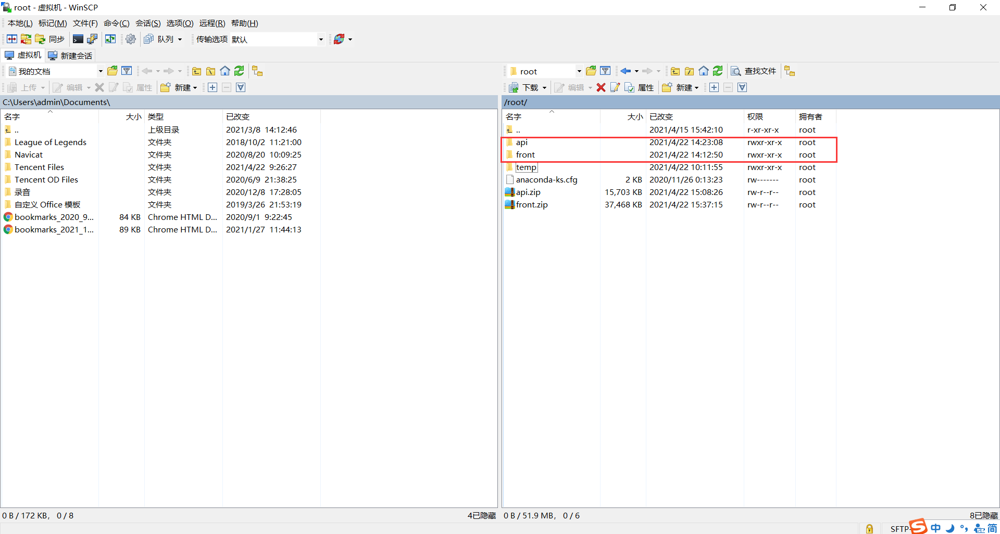
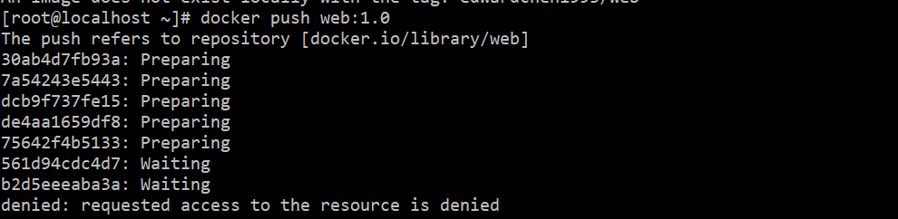
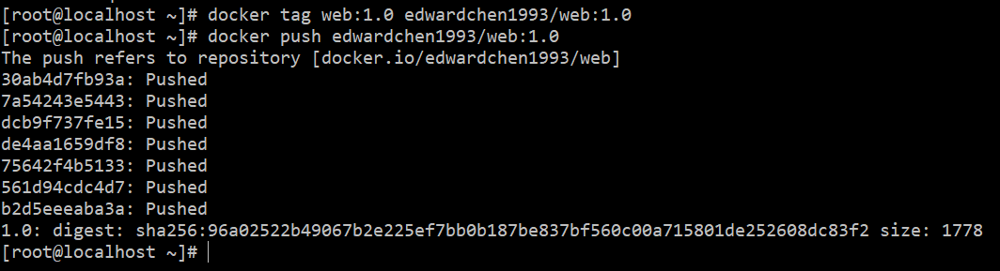

[TOC]

# docker

docker 是一个开源的应用容器引擎，让开发者可以打包他们的应用以及依赖包到一个可移植的镜像中，然后发布到任何流行的 Linux或 Windows 机器上，也可以实现虚拟化。容器是完全使用沙箱机制，相互之间不会有任何接口。


## 主要特性

1. 文件、资源、网络隔离
2. 变更管理、日志记录
3. 写时复制


## docker的安装

官方文档：

- [Mac](https://docs.docker.com/docker-for-mac/install/)
- [Windows](https://docs.docker.com/docker-for-windows/install/)
- [Ubuntu](https://docs.docker.com/install/linux/docker-ce/ubuntu/)
- [Debian](https://docs.docker.com/install/linux/docker-ce/debian/)
- [CentOS](https://docs.docker.com/install/linux/docker-ce/centos/)
- [Fedora](https://docs.docker.com/install/linux/docker-ce/fedora/)
- [其他 Linux 发行版](https://docs.docker.com/install/linux/docker-ce/binaries/)

安装完成后，运行下面的命令，验证是否安装成功：

```bash
docker version
```


启动docker：

```bash
 systemctl start docker
```

**注意：虚拟机每次关机后重启都需要重新启动docker。**


检查docker是否安装正确：

```bash
docker run hello-world
```


## 镜像加速

docker中国区镜像加速

可以令pull拉取的时候优先使用中国区镜像加速：

```bash
vi /etc/docker/daemon.json
```

写入如下内容：

```json
{
  "registry-mirrors": ["https://registry.docker-cn.com"]
}
```

然后重启docker使配置生效：

```bash
systemctl restart docker
```


## docker的操作

查看正在运行的容器：

```bash
docker ps
```

参数：

+ -a：查看所有容器，包括已经停止的容器。


启动新的容器：

```bash
docker run 容器名
```

docker run相当于执行了两步操作：将镜像放入容器中（docker create）,然后将容器启动，使之变成运行时容器（docker start）。

参数：
- -d：在后台运行容器。

- -p：`-p 8088:80`代表选择宿主机具体的8088端口映射到容器内部的80端口上了，访问`http://localhost:8088`即可。

- -v：数据持久化，`-v 宿主机目录:容器目录`，将宿主机目录挂载到容器目录

- -it：以交互模式运行启动容器

- --name：指定容器名。

  

启动已存在的容器：

```bash
docker start 容器名
```


停止容器：

```bash
docker stop 容器名
```


重启容器：

```bash
docker restart 容器名
```


删除容器，正在运行的容器必须先停止才能删除：

```bash
docker rm 容器名
```


打印容器信息：

```bash
docker logs 容器名
```

参数：

-f 持续打印


## docker-compose

docker-compose工具是一个批量工具，用于运行与管理多个docker容器。

官方文档：[链接](https://docs.docker.com/compose/)


安装：[链接](https://docs.docker.com/compose/install/)


检查docker-compose是否安装正确：

```bash
docker-compose --version
```


使用docker-compose

第一步、新建docker-compose.yml：

```bash
vi docker-compose.yml
```


第二步、写入服务配置：

```bash
version: '3'
services:
  mysql1:
    image: mysql
    environment:
    - MYSQL_ROOT_PASSWORD=zhandi34
    ports:
    - 28002:3306
  mysql2:
    image: mysql
    environment:
    - MYSQL_ROOT_PASSWORD=zhandi34
    ports:
    - 28003:3306
```


第三步、启动docker-compose：

```bash
docker-compose up
```

参数：

+ -d：容器启动后会进入后台


## dockerhub

docker仓库，用于拉取镜像，类似npm

官网： [链接](https://hub.docker.com/)


登录：

```bash
docker login
```


查看docker镜像：

```bash
docker image ls
```


提交镜像：

```bash
docker commit 容器id dockerhub用户名/镜像名:版本号
```


推送镜像到dockerhub：

```bash
docker push dockerhub用户名/镜像名:版本号
```


从dockerhub拉取镜像：

```bash
docker pull dockerhub用户名/镜像名
```


## Dockerfile

[参考文档](https://docs.docker.com/engine/reference/builder/)

作用： 

+ 用于产生Docker镜像
+ Dockerfile按照步骤构建，产生文件系统
+ Dockerfile是镜像的配置文件，高度可配置


## 打包并发布镜像

第一步、在对应项目的根目录新建Dockerfile和.dockerignore文件。

[参考](https://cn.vuejs.org/v2/cookbook/dockerize-vuejs-app.html)

前端的Dockerfile：

```bash
# build stage
FROM node:10 as build-stage

LABEL maintainer=872990547@qq.com

# 创建工作目录
WORKDIR /app

# 拷贝目录
COPY . .

# 安装依赖
RUN npm install --registry=https://registry.npm.taobao.org

# 构建
RUN npm run build

# production stage

FROM nginx:stable-alpine as production-stage
# 将项目目录拷贝到nginx目录下
COPY --from=build-stage /app/dist /usr/share/nginx/html
# 暴露容器的80端口
EXPOSE 80
# 启动ngnix
CMD ["nginx", "-g", "daemon off;"]
```

后端的Dockerfile：

```bash
# build stage
FROM node:10

LABEL maintainer=872990547@qq.com

# 创建工作目录
WORKDIR /app

COPY . .

RUN npm install --registry=https://registry.npm.taobao.org

# 这里产生了dist目录，及server.bundle.js
RUN npm run build
# 暴露容器的12005端口
EXPOSE 12005
# 挂载目录
VOLUME ["/app/public"]
# 启动node
CMD ["node", "dist/server.bundle.js"]
```


.dockerignore：

```bash
# Dependency directory
# https://www.npmjs.org/doc/misc/npm-faq.html#should-i-check-my-node_modules-folder-into-git
node_modules
.DS_Store
dist

# node-waf configuration
.lock-wscript

# Compiled binary addons (http://nodejs.org/api/addons.html)
build/Release
.dockerignore
Dockerfile
*docker-compose*

# Logs
logs
*.log

# Runtime data
.idea
.vscode
*.suo
*.ntvs*
*.njsproj
*.sln
*.sw*
pids
*.pid
*.seed
.git
.hg
.svn

```


第二步、将前后端项目拷贝到虚拟机家目录下




第三步、在虚拟机中切换到项目根目录下，执行打包镜像命令：

```bash
docker build -t web:1.0 .
```

备注：

+ -t：设置标签名

删除镜像：

```bash
docker rmi 镜像id
```

**注意：删除镜像前，必须先删除镜像对应的容器，否则删除失败。**


第四步、运行镜像，即可启动项目服务。使用ip+端口11000即可在浏览器访问页面。

```bash
docker run -itd --name web -p 11000:80 web:1.0
```


第五步、发布镜像

首先登录docker账号（账号：edwardchen1993，密码：1234567890），如果未注册账号，请先到 [dockerhub](https://hub.docker.com/) 注册账号：

```bash
docker login
```

发布：

```bash
docker push 账号名/镜像名:标签名
```

发布成功后，后续可以使用docker pull拉取镜像，然后docker run运行镜像。


**注意：如果出现以下发布报错情况，需要给上传的镜像重新打一个 tag，再重新发布。**

```bash
docker tag 镜像名:标签名 账号名/镜像名:标签名
docker push 账号名/镜像名:标签名
```



