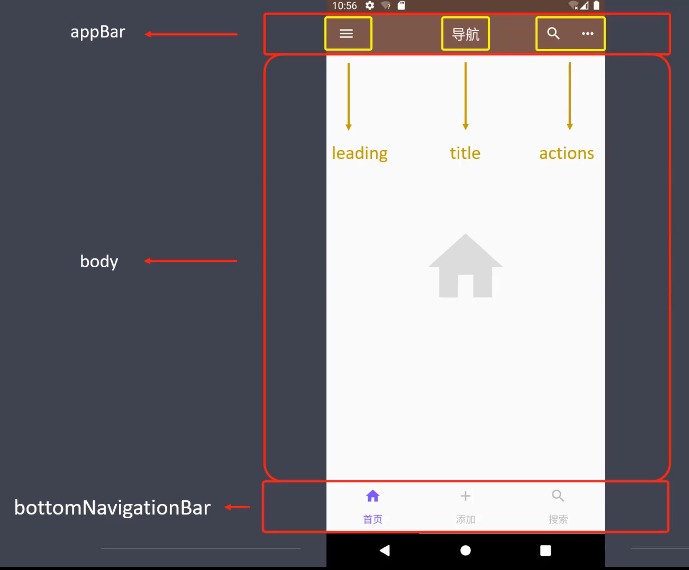

[TOC]

# flutter

## 概述

### 简介

Flutter 是谷歌开发的一款开源、免费的，基于 **Dart 语言**的移动 UI 框架，可以快速在 iOS 和 Android 上构建高质量的原生应用。 它最大的特点就是**跨平台**和**高性能**。

+ Dart 语言

  Dart 是由谷歌开发的计算机编程语言，它可以被用于 Web、服务器、移动应用和物联网等领域的 开发。Dart 诞生于 2011 年，号称要取代 JavaScript。

+ 跨平台

  良好的跨平台性，直接带来的好处就是减少开发成本。

  + 移动端
    + Android
    + iOS
  + Web
    + 各种浏览器
  + 桌面
    + Windows
    + Mac
  + 嵌入式平台
    + Linux
    + Fuchsia

+ 高性能

  Flutter 采用 GPU （图形显示）渲染技术，所以性能极高。Flutter 编写的应用是可以达到 120 fps（每秒传输帧数），这也就是说，它完全可以胜任游戏的制作。而 React Native 的性能只能达 到 60 fps。


### 发展历程

+ 2015，Flutter 在 Dart 开发者峰会上亮相 
+ 2018-6，Flutter 发布了首个预览版本 
+ 2018-12，Flutter 1.0 发布 
+ 2019-9，Flutter 1.9 发布，添加 Web 端支持 
+ 2020-9，Flutter 1.22 发布，带来了对 iOS 14 和 Android 11 的支持


### 主流框架对比

移动应用的三种开发模式


混合开发框架对比


### 成功案例

除了大量为适应快速发展节奏和节省人力成本的中小型企业，很多一线互联网企业也在重要项目中落地 了 Flutter 技术。第一个吃 Flutter 这只螃蟹的头部企业是阿里巴巴。阿里巴巴旗下的多款应用都使用了 Flutter。例如：咸鱼、淘宝特价版、盒马、优酷、飞猪等。另外，字节跳动内部的很多移动端应用，也 选中 Flutter。


### 资源网站

官网：https://flutter.dev/ 

Github: https://github.com/flutter/flutter 

中文网站： 

+ https://flutterchina.club/ 
+ https://flutter.cn/


### 环境搭建

[参考文档](https://flutter.cn/docs/get-started/install)


## 基础

### 项目目录

```bash
flutter_app
├── android # 安卓目录
├── build # 构建目录
├── ios # iOS 目录
├── lib # 开发目录（相当于 src 目录）
| ├── main.dart # 入口文件（相当于 index.js）
├── test # 测试目录
├── .gitignore # Git 提交时，设置忽略文件内容
├── pubspec.lock # 项目依赖锁定信息（相当于 npm 中的 package-lock.json）
└── pubspec.yaml # 项目依赖配置（相当于 npm 中的 package.json）
```


### 入口文件

Flutter 项目的入口文件是 `lib/main.dart`，在入口文件中有一个入口方法。

```dart
import 'package:flutter/material.dart';
void main() {
  runApp(Center(
    child: Text(
      'Hello World!',
      textDirection: TextDirection.ltr,
    )
  ));
}
```

+ UI 库 material

  ```dart
  import 'package:flutter/material.dart';
  ```

  Material 是一种标准的移动端和 Web 端的 UI 框架，是一套 Google 的设计规范，Flutter 项目以 Material 为 UI 基础。

  官网：https://www.material.io/ 

  中文网：https://material-io.cn/

+ 入口方法

  ```dart
  // 入口方法
  void main() {
  	// 具体内容
  }
  ```

+ 根函数 `runApp()`

  ```dart
  void main(){
  	runApp(
  		// 具体组件
  	);
  }
  ```

  runApp 函数接收给定的组件（Widget），并使其成为组件树的根。框架强制根组件覆盖整个屏 幕，这意味着 'Hello World!' 文本，在屏幕上居中显示。


### Widget（组件）

在 Flutter 中，一切的显示都是 Widget 。Widget 是一切的基础。Widget 和 Widget 之间通过 child: 进 行嵌套。一个 Flutter 组件，包含了组件的模板、样式和交互等内容，外部只要按照组件设定的属性、函 数及事件处理等进行调用即可，完全不用考虑组件的内部实现逻辑。你需要做的就是在 Widget 中堆积 你的布局。

+ Center：定义居中部件

  ```dart
  Center(
  	child: // 部件
  );
  ```

+ Text：定义文本部件

  ```dart
  Text(
  	'hello',
  	textDirection: TextDirection.ltr,
  )
  ```

  > 若不写textDirection会报错

+ 自定义组件

  为了增强代码的可读性，我们可以将部分代码分离出去。写成独立的 Widget。我们自定义的 Widget 需要继承 Flutter 提供的组件。这里有两种常用的组件

  + StatelessWidget

    是无状态组件，状态不可变的 Widget

  + StatefulWidget

    是有状态组件，持有的状态，可能在 Widget 生命周期改变。通俗的讲：如果我们想改变页面 中的数据的话，这个时候就需要用到 StatefulWidget

  **自定义组件中，有一个关键的 build 方法。**我们需要将独立的代码，放到 build 方法中。上述 HelloWorld ，经过分离后的代码如下：

  ```dart
  import 'package:flutter/material.dart';
  
  void main() {
    runApp(Hello());
  }
  
  // 或简写为
  // void main() => runApp(Hello());
  // 创建一个继承自无状态部件的自定义部件
  class Hello extends StatelessWidget {
    Widget build(BuildContext context) {
      // 实现一个build函数, 构建自身
      return Center(
          //返回一个部件
          child: Text(
        'Hello World!',
        textDirection: TextDirection.ltr,
      ));
    }
  }
  ```

  

### MaterialApp

参数对照表

| 字段                                                 | 类型                            |
| ---------------------------------------------------- | ------------------------------- |
| navigatorKey（导航主键）                             | GlobalKey                       |
| home（起始页）                                       | Widget                          |
| routes（路由列表）                                   | Map<String, WidgetBuilder>      |
| initialRoute（初始路由名称）                         | String                          |
| onGenerateRoute（生成路由）                          | RouteFactory                    |
| onUnknownRoute（未知路由）                           | RouteFactory                    |
| navigatorObservers（导航观察器）                     | List                            |
| builder（构造器）                                    | TransitionBuilder               |
| title（应用标题）                                    | String                          |
| onGenerateTitle（生成应用标题）                      | GenerateAppTitle                |
| color（颜色）                                        | Color                           |
| theme（主题配置）                                    | ThemeData                       |
| locale（本地化）                                     | Locale                          |
| localizationsDelegates（本地化委托代理）             | Iterable<LocalizationsDelegate> |
| localeResolutionCallback（本地化分辨回调）           | LocaleResolutionCallback        |
| supportedLocales（应用支持区域）                     | Iterable                        |
| debugShowMaterialGrid（是否显示 Material 网格）      | bool                            |
| showPerformanceOverlay（显示性能监控叠层）           | bool                            |
| checkerboardRasterCacheImages（棋盘格光栅缓存图 像） | bool                            |
| checkerboardOffscreenLayers（棋盘格层）              | bool                            |
| showSemanticsDebugger（显示语义调试器）              | bool                            |
| debugShowCheckedModeBanner（是否显示 DEBUG 横 幅）   | bool                            |


### Scaffold

Scaffold 是 Flutter 应用的脚手架。用来搭建 Flutter 项目的基本布局结构



+ appBar

  显示在界面顶部的一个 AppBar，也就是 Android 中的 ActionBar 、Toolbar

+ body

  当前界面的主体 Widget

+ floatingActionButton：

  纸墨设计中所定义的 FAB，界面的主要功能按钮

+ persistentFooterButtons：

  固定在下方显示的按钮，比如对话框下方的确定、取消按钮

+ drawer：

  侧边栏控件

+ backgroundColor：

  内容的背景颜色，默认使用的是 `ThemeData.scaffoldBackgroundColor` 的值

+ bottomNavigationBar：

  显示在页面底部的导航栏

+ resizeToAvoidBottomPadding

  类似于 Android 中的 `android:windowSoftInputMode=”adjustResize”`，控制界面内容 body 是否 重新布局来避免底部被覆盖了，比如当键盘显示的时候，重新布局避免被键盘盖住内容。默认值为 true。


### 文本

#### Text

```dargt
Text(
  'Hello',
  textDirection: TextDirection.ltr,
  style: TextStyle(
      fontSize: 40.0, color: Colors.yellow, fontWeight: FontWeight.bold),
  textAlign: TextAlign.left,
  maxLines: 3,
  overflow: TextOverflow.ellipsis,
),
```

+ TextDirection
  + TextDirection.ltr： 从左向右的文本
  + TextDirection.rtl： 从右向左的文本
+ TextStyle
  + color： 字体颜色
  + fontSize： 字体大小
  + fontWeight： 字体粗细
  + fontStyle： normal 或者 italic
  + fontFamily： 字体
  + letterSpacing： 字母间隙
  + wordSpacing： 单词间隙

| 属性                                | 说明                                                         |
| ----------------------------------- | ------------------------------------------------------------ |
| Color color                         | 文本颜色。如果指定了foreground，则此值必须为 null。          |
| TextDecoration decoration           | 绘制文本装饰:下划线（TextDecoration.underline）上划线 （TextDecoration.overline）删除线 （TextDecoration.lineThrough）无（TextDecoration.none） |
| Color decorationColor               | 绘制文本装饰的颜色。                                         |
| TextDecorationStyle decorationStyle | 绘制文本装饰的样式:画一条虚线 TextDecorationStyle.dashed画一 条虚线 TextDecorationStyle.dotted画两条线 TextDecorationStyle.double画一条实线 TextDecorationStyle.solid画一条正弦线(波浪线) TextDecorationStyle.wavy |
| FontWeight fontWeight               | 绘制文本时使用的字体粗细:FontWeight.bold 常用的字体重量比正 常重。即w700FontWeight.normal 默认字体粗细。即 w400FontWeight.w100 薄，最薄FontWeight.w200 特轻 FontWeight.w300 轻FontWeight.w400 正常/普通/平原 FontWeight.w500 较粗FontWeight.w600 半粗体 FontWeight.w700 加粗FontWeight.w800 特粗FontWeight.w900 最粗 |
| FontStyle fontStyle 字              | 对齐文本的水平线:TextBaseline.alphabetic：文本基线是标准的字 母基线TextBaseline.ideographic：文字基线是表意字基线；如果字 符本身超出了alphabetic 基线，那么ideograhpic基线位置在字符本 身的底部。 |
| String fontFamily                   | 使用的字体名称                                               |
| double fontSize                     | 字体大小(pt、sp)，默认为14个逻辑像素(14pt、14sp)             |
| double letterSpacing                | 水平字母之间的空间间隔（逻辑像素为单位）。可以使用负值来让 字母更接近。 |
| double wordSpacing                  | 单词之间添加的空间间隔（逻辑像素为单位）。可以使用负值来使 单词更接近。 |
| double height                       | 文本行与行的高度，作为字体大小的倍数（取值1~2，如1.2）       |
| Locale locale                       | 此属性很少设置，用于选择区域特定字形的语言环境               |
| Paint background 文                 | 文本背景色                                                   |
| Paint foreground                    | 文本的前景色，不能与color共同设置                            |

+ TextAlign

  + center： 文本居中
  + left： 左对齐
  + right： 右对齐
  + start： 开始处对齐，类似于左对齐。
  + end： 结尾处对齐，

+ maxLines

  设置最多显示的行数

+ overflow
  + clip： 直接切断，剩下的文字就没有了。
  + ellipsis： 在后边显示省略号。
  + fade： 溢出的部分会进行一个渐变消失的效果，当然是上下的渐变，不是左右的


#### RichText 和 TextSpan

RichText 和 TextSpan 可以为一段文本指定多个样式。

```dart
RichText(
  text: TextSpan(
      text: '你好',
      style: TextStyle(color: Colors.red),
      children: [
        TextSpan(text: '世界', style: TextStyle(color: Colors.blue))
      ]),
),
```


### 自定义字体

+ 导入字体文件

  字体文件可以网上找到，例如：https://fonts.google.com/ 

  选择需要的字体文件，然后下载

  然后，解压下载后的压缩包，将字体文件放到 Flutter 项目目录 中。例如：fonts/Source_Sans_Pro/*

+ 在 pubspec.yaml 中声明字体

  ```yaml
  flutter:
    # ......
    fonts:
      # family 属性决定了字体的名称，你将会在 TextStyle 的 fontFamily 属性中用到。
      - family: SourceSansPro
        fonts:
          - asset: fonts/Source_Sans_Pro/SourceSansPro-Black.ttf
          - asset: fonts/Source_Sans_Pro/SourceSansPro-BlackItalic.ttf
            # weight 属性指定了文件中字体轮廓的字重为 100 的整数倍
            weight: 400
            # style 属性指定文件中字体的轮廓是否为 italic 或 normal
            style: normal
  ```

+ 设置默认字体

  ```dart
  MaterialApp(
  	title: 'Custom Fonts',
  	// 设置整个应用的默认字体
  	theme: ThemeData(fontFamily: 'SourceSansPro'),
  	home: MyHomePage(),
  );
  ```

+ 在 Widget 中使用字体

  ```dart
  Text(
  	'Roboto Mono sample',
  	style: TextStyle(fontFamily: 'SourceSansPro'), // 为具体的组件设置字体
  );
  ```

  

### Icon

Icon 用来声明图标，Icons 是Flutter 中的图标组件

```dart
Icon(
	Icons.ac_unit_rounded,
	color: Colors.green,
	size: 40,
),
```

在线预览：https://material.io/resources/icons


### Color

+ Color（自定义颜色）
  + Flutter 中通过 ARGB 来声明颜色
  + const Color(0xFF42A5F5); // 16进制的ARGB = 透明度 + 六位十六进制颜色
  + const Color.fromARGB(0xFF, 0x42, 0xA5, 0xF5);
  + const Color.fromARGB(255, 66, 165, 245);
  + const Color.fromRGBO(66, 165, 245, 1.0); // O = Opacity
+ Colors（英文字母声明的颜色）
  + Colors.red


### 布局

#### Container

Container 就是 Flutter 中的盒子模式

+ Container

  + padding: EdgeInsets.all(10.0)

    + fromLTRB(double left, double top, double right, double bottom)：指定四个方向的填 充。
    + all(double value) : 所有方向，均使用相同数值的填充。
    + only({left, top, right ,bottom })：可以设置某个方向的填充（也可以同时指定多个方 向）
    + symmetric({ vertical, horizontal })：用于设置对称方向的填充，
      + vertical 值垂直方向，
      + horizontal 指水平方向。

  + margin：EdgeInsets.all(10.0)

    具体方法，参考 padding 部分

  + color 

    + Colors.颜色

  + width 

    + 数字 
    + double.infinity

  + height 

    + 数字 
    + double.infinity

  + decoration 是 container 的修饰器，用来设置背景和边框

    + BoxDecoration
      + Color color, 颜色 
      + DecorationImage image, 图片
      + BoxBorder border, 边框 
      + BorderRadiusGeometry borderRadius, 圆角
      + List boxShadow, 阴影,可以指定多个
      + Gradient gradient, 渐变 
      + BlendMode backgroundBlendMode, 背景混合模式
      + BoxShape shape = BoxShape.rectangle, 形状

  + alignment 内容对齐方式

    + Alignment
      + bottomCenter:下部居中对齐。 
      + botomLeft: 下部左对齐。 
      + bottomRight：下部右对齐。 
      + center：纵横双向居中对齐。 
      + centerLeft：纵向居中横向居左对齐。 
      + centerRight：纵向居中横向居右对齐。
      + topLeft：顶部左侧对齐。
      + topCenter：顶部居中对齐。
      + topRight： 顶部居左对齐。

  + transform 变形

    + Matrix4
      + translate：平移
      + rotate：旋转 
      + scale：缩放 
      + skew：斜切

```dart
class ContainerDemo extends StatelessWidget {
  @override
  Widget build(BuildContext context) {
    return Container(
      child: Text(
        'Hello Container',
        style: TextStyle(fontSize: 28.0),
      ),
      alignment: Alignment.bottomCenter,
// width: 300.0,
// height: 400.0,
      width: double.infinity,
      height: double.infinity,
      padding: EdgeInsets.all(10.0),
      margin: EdgeInsets.fromLTRB(10.0, 30.0, 0.0, 5.0),
      decoration: new BoxDecoration(
        color: Colors.lightGreen[200], // 背景色
        gradient: LinearGradient(// 设置渐变后，背景色失效
            colors: [Colors.lightBlue, Colors.greenAccent, Colors.purple]),
// border: Border.all(
// width: 20.0,
// color: Colors.red
// ),
        border: Border(
          top: BorderSide(width: 40.0, color: Colors.red),
          bottom: BorderSide(width: 20.0, color: Colors.yellow),
          right: BorderSide(width: 60.0, color: Colors.green),
        ),
// borderRadius: BorderRadius.all(Radius.circular(50)),
// borderRadius: BorderRadius.only(
        // topLeft: Radius.circular(30),
// topRight: Radius.circular(30),
// bottomLeft: Radius.circular(10),
// bottomRight: Radius.circular(10),
// )
      ),
    );
  }
}
```


#### 线性布局

**Column**

组件沿着列（Column）方向进行布局

+ Column
  + Column 中的主轴方向是垂直方向
  + mainAxisAlignment：MainAxisAlignment 主轴对齐方式 
  + crossAxisAlignment：CrossAxisAlignment 交叉抽对齐方式
  + children 声明内容


**Row**

组件沿着行（Row）方向进行布局

+ Row
  + Row 中的主轴方向是水平方向 
  + mainAxisAlignment：MainAxisAlignment 主轴对齐方式 
  + crossAxisAlignment：CrossAxisAlignment 交叉抽对齐方式

```dart
class ColumnRowDemo extends StatelessWidget {
  double iconSize = 50;
  @override
  Widget build(BuildContext context) {
    return Container(
        color: Colors.pink[100],
        child: Column(
          mainAxisAlignment: MainAxisAlignment.spaceEvenly, // 主轴对齐方式
          crossAxisAlignment: CrossAxisAlignment.center, // 交叉轴对齐方式
          children: [
            Icon(
              Icons.search,
              size: iconSize,
            ),
            Icon(
              Icons.home,
              size: iconSize,
            ),
            Icon(
              Icons.settings,
              size: iconSize,
            ),
            Icon(
              Icons.supervised_user_circle_sharp,
              size: iconSize,
            ),
            Row(
              mainAxisAlignment: MainAxisAlignment.spaceAround,
              children: [
                Icon(
                  Icons.access_alarms,
                  size: iconSize,
                ),
                Icon(
                  Icons.add_comment,
                  size: iconSize,
                ),
                Icon(
                  Icons.print,
                  size: iconSize,
                ),
                Icon(
                  Icons.android_rounded,
                  size: iconSize,
                ),
              ],
            )
          ],
        ));
  }
}
```


#### 弹性布局

**Flex**

+ direction 

  设置主轴方向，可设置的值为 Axis.horizontal 和 Axis.vertical，交叉轴与主轴方向垂直。

+ mainAxisAlignment

  子组件沿着主轴方向的对齐方式:

  + MainAxisAlignment.start：左对齐；（默认值） 
  + MainAxisAlignment.end：右对齐; 
  + MainAxisAlignment.center：居中对齐; 
  + MainAxisAlignment.spaceBetween：两端对齐; 
  + MainAxisAlignment.spaceAround：空格环绕; 
  + MainAxisAlignment.spaceEvently：空格平均分布.

+ crossAxisAlignment

  子组件在交叉轴的对齐方向

  + CrossAxisAlignment.start：与交叉轴的起始位置对齐；
  + CrossAxisAlignment.end：与交叉轴的结束位置对齐；
  + CrossAxisAlignment.center：居中对齐；
  + CrossAxisAlignment.stretch：填充整个交叉轴；
  + CrossAxisAlignment.baseline：按照第一行文字基线对齐。

+ mainAxisSize

  设置主轴的大小

  + MainAxisSize.max：主轴的大小是父容器的大小；
  + MainAxisSize.min：主轴的大小是其子组件大小之和。

+ verticalDirection

  设置垂直方向上的子组件的排列顺序

  + VerticalDirection.down：start 在顶部，end 在底部；
  + VerticalDirection.up：start 在底部，end 在顶部。

+ textBaseline

  设置文字对齐的基线类型

  + TextBaseline.alphabetic：与字母基线对齐；
  + TextBaseline.ideographic：与表意字符基线对齐；


**Expanded**

+ flex

  声明所占比例

+ child

  声明子组件


#### 流式布局

在介绍 Row 和 Colum 时，如果子组件超出屏幕范围，则会报溢出错误。而流式布局可以有效解决内容 溢出。

**Wrap**

+ spacing：主轴方向子组件的间距 
+ alignment: 主轴方向的对齐方式
  + WrapAlignment
+ runSpacing：纵轴方向子组件的间距
+ runAlignment：纵轴方向的对齐方式
  + WrapAlignment

```dart
Wrap(
  spacing: 8.0, // 主轴(水平)方向间距
  runSpacing: 4.0, // 纵轴（垂直）方向间距
  alignment: WrapAlignment.spaceAround, //沿主轴方向居中
  children: [
    Chip(
      avatar: CircleAvatar(backgroundColor: Colors.blue, child: Text('蜀')),
      label: Text('刘备'),
    ),
    Chip(
      avatar: CircleAvatar(backgroundColor: Colors.blue, child: Text('蜀')),
      label: Text('关羽'),
    ),
    Chip(
      avatar: CircleAvatar(backgroundColor: Colors.blue, child: Text('蜀')),
      label: Text('张飞'),
    ),
    Chip(
      avatar: CircleAvatar(backgroundColor: Colors.blue, child: Text('蜀')),
      label: Text('赵云'),
    ),
    Chip(
      avatar: CircleAvatar(backgroundColor: Colors.blue, child: Text('蜀')),
      label: Text('马超'),
    ),
    Chip(
      avatar: CircleAvatar(backgroundColor: Colors.blue, child: Text('蜀')),
      label: Text('诸葛亮'),
    ),
  ],
)
```


#### 层叠布局

**Stack**

```dart
Stack({
	this.alignment = AlignmentDirectional.topStart,
	this.textDirection,
	this.fit = StackFit.loose,
	this.overflow = Overflow.clip,
	List<Widget> children = const <Widget>[],
})
```

+ alignment：此参数决定如何去对齐没有定位（没有使用 Positioned）或部分定位的子组件。 

  所谓部分定位，在这里**特指没有在某一个轴上定位**：left、right 为横轴，top、bottom 为纵轴，只 要包含某个轴上的一个定位属性就算在该轴上有定位。

+ textDirection：和 Row、Wrap 的 textDirection 功能一样，都用于确定 alignment 对齐的参考 系。

  textDirection 的值为 TextDirection.ltr，则 alignment 的 start 代表左，end 代表右，即从左往右 的顺序textDirection 的值为 TextDirection.rtl，则 alignment 的 start 代表右，end 代表左，即从 右往左的顺序

+ fit：此参数用于确定**没有定位**的子组件如何去适应 Stack 的大小。 

  StackFit.loose 表示使用子组件的大小，StackFit.expand 表示扩伸到 Stack 的大小。

+ overflow：此属性决定如何显示超出 Stack 显示空间的子组件；

  值为 Overflow.clip 时，超出部分会被剪裁（隐藏），值为 Overflow.visible 时则不会。


**Positioned**

Positioned 可以控制组件的位置，通过他可以随意摆放一个组件，有点像**绝对布局**。

```dart
const Positioned({
	Key key,
	this.left,
	this.top,
	this.right,
	this.bottom,
	this.width,
	this.height,
	@required Widget child,
})
```

left、top 、right、 bottom 分别代表离 Stack 左、上、右、底四边的距离。width 和 height 用于指定 需要定位元素的宽度和高度。

> 注意，Positioned 的 width、height 和其它地方的意义稍微有点区别，此处用于配合 left、top 、 right、 bottom 来定位组件。 
>
> 举个例子，在水平方向时，你只能指定 left、right、width 三个属性中的两个，如指定 left 和 width 后，right 会自动算出( left+width )，如果同时指定三个属性则会报错，垂直方向同理。


**Card**

Card 是 Flutter 中的卡片组件，功能与 Container 类似，用来声明局部页面布局

+ color 卡片背景色

+ shadowColor 阴影颜色

+ elevation 阴影高度

+ shape 边框样式

  RoundedRectangleBorder

+ borderOnForeground 是否在 child 前绘制 border，默认为 true

+ margin 外边距

+ clipBehavior 裁切方式

+ child 子组件

+ semanticContainer 是否使用新的语义节点，默认为 true

代码示例：

```dart
Card(
  margin: EdgeInsets.all(30),
  child: Column(
    children: <Widget>[
      ListTile(
        title: Text("李四", style: TextStyle(fontSize: 28)),
        subtitle: Text("CEO"),
      ),
      Divider(),
      ListTile(
        title: Text("电话:123456789"),
      ),
      ListTile(title: Text("地址：xxxxxxxxxxxxxxxxx"))
    ],
  ),
),
Card(
  margin: EdgeInsets.all(30),
  child: Column(
    children: <Widget>[
      ListTile(
        leading: Icon(
          Icons.supervised_user_circle_outlined,
          size: 50,
        ),
        title: Text("张三", style: TextStyle(fontSize: 28)),
        subtitle: Text("董事长"),
      ),
      Divider(),
      ListTile(
        title: Text("电话: 123456789"),
      ),
      ListTile(title: Text("地址：xxxxxxxxxxxxxxxxx"))
    ],
  ),
  color: Colors.purpleAccent[100],
  shadowColor: Colors.yellow, // 阴影颜色
  elevation: 20, // 阴影高度
  shape: RoundedRectangleBorder(
    borderRadius: BorderRadius.circular(40),
    side: BorderSide(
      color: Colors.yellow,
      width: 3,
    ),
  ),
)
```


### 按钮

Flutter 1.22 版本新增了3个按钮，TextButton、OutlinedButton、ElevatedButton，虽然以前的 Button 没有被废弃，但还是建议使用新的 Button。以前的按钮调整为统一的外观比较麻烦，因此以前 经常使用自定义的按钮，而新增的按钮解决了此类问题，可以非常方便的设置整体外观

| 1.22版本前的按钮 | 主题        | 1.22版本后的按钮 | 主题                |
| ---------------- | ----------- | ---------------- | ------------------- |
| FlatButton       | ButtonTheme | TextButton       | TextButtonTheme     |
| OutlineButton    | ButtonTheme | OutlinedButton   | OutlinedButtonTheme |
| RaisedButton     | ButtonTheme | ElevatedButton   | ElevatedButtonTheme |

外观上并没有很大的不同，但 TextButton、OutlinedButton、ElevatedButton 将外观属性集合为一个 **ButtonStyle**，非常方便统一控制。

建议使用 **TextButton** 替换 FlatButton、**OutlinedButton** 替换 OutlineButton、**ElevatedButton** 替 换 RaisedButton。


#### TextButton

```dart
const TextButton({
  Key key,
  @required VoidCallback onPressed, // 按键回调 - 必填项
  VoidCallback onLongPress, // 长按回调
  ButtonStyle style, // 按钮样式
  FocusNode focusNode, // 焦点事件捕获与监听对象
  bool autofocus = false, // 自动获取焦点
  Clip clipBehavior = Clip.none, // 剪切
  @required Widget child, // 子组件 - 必填项
  }) : super(
  key: key,
  onPressed: onPressed,
  onLongPress: onLongPress,
  style: style,
  focusNode: focusNode,
  autofocus: autofocus,
  clipBehavior: clipBehavior,
  child: child,
);
```

+ ButtonStyle（按钮样式）

  ```dart
  const ButtonStyle({
    this.textStyle, // 文本样式,设置文字的大小和粗细
    this.backgroundColor, // 背景色
    this.foregroundColor, // 前景色，即文本的颜色和图标的颜色
    this.overlayColor, // 水波纹颜色
    this.shadowColor, // 阴影颜色
    this.elevation, // 阴影高度
    this.padding, // 内间距
    this.minimumSize, // 设置按钮的大小
    this.side, // 边框设置
    this.shape, // 外边框样式 - 会覆盖side
    this.mouseCursor, // 鼠标指针的光标进入或悬停在此按钮的[InkWell]上时
    this.visualDensity, // 视觉密度 - 按钮布局的紧凑程度
    this.tapTargetSize, // 配置按钮被按下区域的最小尺寸
    this.animationDuration, // 动画变化的持续时间
    this.enableFeedback, // 检测到的手势是否应该提供听觉和/或触觉反馈
  });
  ```

  其中属性对应的值，通过 MaterialStateProperty 组件来设置。

+ clipBehavior（剪切内容）
  + Clip.hardEdge（剪辑，但不应用抗锯齿）
  + Clip.antiAlias（剪辑具有抗锯齿功能）
  + Clip.antiAliasWithSaveLayer（在剪辑后立即剪辑具有抗锯齿和 saveLayer）
  + Clip.none（不剪辑 - 默认值）

TextButton 的代码示例

```dart
TextButton(
    onPressed: () {
      // Respond to button press
    },
    child: Text('TextButton'),
    style: ButtonStyle(
      // 文本样式
      textStyle: MaterialStateProperty.all(
          TextStyle(fontSize: 18, color: Colors.red)),
      // 前景色
      foregroundColor: MaterialStateProperty.resolveWith(
        (states) {
          if (states.contains(MaterialState.pressed)) {
            // 按下时的颜色
            return Colors.red;
          }
          // 默认状态使用灰色
          return Colors.black;
        },
      ),
      // 背景色
      backgroundColor: MaterialStateProperty.resolveWith((states) {
        // 设置按下时的背景颜色
        if (states.contains(MaterialState.pressed)) {
          return Colors.yellow;
        }
        //默认不使用背景颜色
        return Colors.white;
      }),
      // 阴影颜色
      shadowColor: MaterialStateProperty.all(Colors.yellow),
      // 阴影高度
      elevation: MaterialStateProperty.all(20),
      // 设置水波纹颜色
      overlayColor: MaterialStateProperty.all(Colors.purpleAccent),
      // 设置按钮大小
      minimumSize: MaterialStateProperty.all(Size(150, 80)),
      // 设置边框
      side: MaterialStateProperty.all(
          BorderSide(color: Colors.red, width: 1)),
      // 设置按钮形状
      shape: MaterialStateProperty.all(StadiumBorder(
        side: BorderSide(
            color: Colors.red, width: 1, style: BorderStyle.solid),
      )),
    ))
```


#### OutlinedButton

轮廓按钮 - 同 TextButton


#### ElevatedButton

凸起按钮 - 同 TextButton


#### 图标按钮

+ IconButton

  ```dart
  IconButton(
  	icon: Icon(Icons.access_alarms),
  	onPressed: () {
  	// Respond to button press
  	},
  ),
  ```

+ TextButton.icon()

  ```dart
  TextButton.icon(
  	onPressed: () {
  	// Respond to button press
  	},
  	icon: Icon(Icons.zoom_in_rounded),
  	label: Text('Text Button'),
  )
  ```

+ OutlinedButton.icon()

  ```dart
  OutlinedButton.icon(
  	onPressed: () {
  	// Respond to button press
  	},
  	icon: Icon(Icons.zoom_in_rounded),
  	label: Text('Outlined Button'),
  )
  ```

+ ElevatedButton.icon()

  ```dart
  ElevatedButton.icon(
  	onPressed: () {
  	// Respond to button press
  	},
  	icon: Icon(Icons.zoom_in_rounded),
  	label: Text('Elevated Button'),
  )
  ```

  

#### ButtonBar

ButtonBar 并不是一个单独的按钮控件，而是末端对齐的容器类控件，当在水平方向上没有足够空间时 候，按钮将整体垂直排列，而不是换行。

```dart
ButtonBar(
	children: <Widget>[
		ElevatedButton(),
		ElevatedButton(),
		ElevatedButton(),
		ElevatedButton(),
	],
)
```


#### FloatingActionButton

浮动按钮


#### Chip

Material 风格标签控件

+ Chip 
+ InputChip 
+ ChoiceChip 
+ FilterChip
+  ActionChip

```dart
Chip(
  avatar: CircleAvatar(
      // 头像
      backgroundImage: NetworkImage(
        'http://placeimg.com/640/480/people',
        scale: 1.0,
      ),
      radius: 50),
  label: Text('Hello'), // 标签名称
  labelStyle: TextStyle(
    // 标签样式
    fontSize: 40,
    color: Colors.red,
  ),
  backgroundColor: Colors.blueAccent[100], // 背景色
  shape: RoundedRectangleBorder(
      borderRadius: BorderRadius.circular(20)), // 标签形状
  padding: EdgeInsets.all(10), // 内边距
  deleteIcon: Icon(Icons.delete, size: 30), // 删除菜单图标
  deleteIconColor: Colors.red, // 删除菜单图标颜色
  onDeleted: () {
    // 删除方法
    print('dddd');
  },
  elevation: 10, // 设置阴影
  shadowColor: Colors.yellow, // 阴影颜色
)
```


### 图片

```dart
const Image({
	...
	this.width, // 图片的宽
	this.height, // 图片高度
	this.color, // 图片的混合色值
	this.colorBlendMode, // 混合模式
	this.fit, // 缩放模式
	this.alignment = Alignment.center, // 对齐方式
	this.repeat = ImageRepeat.noRepeat, // 重复方式
	...
})
```

colorBlendMode 和 color 属性配合使用，能让图片改变颜色。 

fit 属性可以控制图片的拉伸和压缩，常用属性如下:

+ BoxFit.fill: 全图显示，图片会被拉伸，并充满父容器。 
+ BoxFit.contain: 全图显示，显示原比例，可能会有空隙。 
+ BoxFit.cover：显示可能拉伸，可能裁切，充满（图片要充满整个容器，还不变形）。 
+ BoxFit.fitWidth：宽度充满（横向充满），显示可能拉伸，可能裁切。 
+ BoxFit.fitHeight ：高度充满（竖向充满）,显示可能拉伸，可能裁切。 
+ BoxFit.scaleDown：效果和 contain 差不多，但是此属性不允许显示超过源图片大小，可小不可 大。

repeat 平铺

+ ImageRepeat.repeat : 横向和纵向都进行重复，直到铺满整个画布。 
+ ImageRepeat.repeatX: 横向重复，纵向不重复。 
+ ImageRepeat.repeatY：纵向重复，横向不重复。


#### Image.asset

加载资源图片

1. 在工程根目录下创建一个 `images` 目录 ，并将图片avatar.png拷贝到该目录。

2. 在 `pubspec.yaml` 中的 flutter 部分添加如下内容：

   ```yaml
   assets:
   	- images/avatar.png
   ```

   > 注意: **由于 yaml 文件对缩进严格，所以必须严格按照每一层两个空格的方式进行缩进，此处 assets前面应有两个空格。**

3. 加载该图片

   ```dart
   Image(
   	image: AssetImage("images/avatar.png"),
   	width: 100.0
   );
   ```

   Image也提供了一个快捷的构造函数 `Image.asset` 用于从asset中加载、显示图片：

   ```dart
   Image.asset("images/avatar.png",
   	width: 100.0,
   )
   ```


#### Image.network

访问网络图片时，需要给应用赋予访问网络的权限。具体来说

> 如果不设置，会收到如下报错 
>
> 报错: **Insecure HTTP is not allowed by platform** 
>
> 原因：平台不支持不安全的 HTTP 协议，即不允许访问 HTTP 域名的地址。

+ Android 解决

  打开 `android/app/src/main/AndroidManifest.xml`

  ```xml
  <uses-permission android:name="android.permission.INTERNET" /> <!-- 添加这一行 -->
  <application
  	android:label="flutter_app"
  	android:usesCleartextTraffic="true" <!-- 添加这一行 -->
  	android:icon="@mipmap/ic_launcher">
  ```

+ iOS 解决

  打开 `ios/Runner/Info.plist`。添加如下代码

  ```dart
  <key>NSAppTransportSecurity</key>
  <dict>
  	<key>NSAllowsArbitraryLoads</key>
  	<true/>
  </dict>
  ```

网络资源图片

```dart
Image(
	image: NetworkImage("https://dummyimage.com/300X300/DDFFBB"),
	width: 100.0,
)
```

Image 也提供了一个快捷的命名构造函数 `Image.network` 用于从网络加载、显示图片：

```dart
Image.network(
	"https://dummyimage.com/300X300/DDFFBB",
	width: 100.0,
)
```


### 列表

#### SingleChildScrollView

类似于Android中的 `ScrollView` ，它只能接收一个子组件。

+ scrollDirection 滚动方向 
+ padding 内边距 
+ physics 结束拖动时效果响应
  + ClampingScrollPhysics：Android 下微光效果 
  + BouncingScrollPhysics：iOS 下弹性效果
+ child 子组件
+ reverse 此属性本质上是决定可滚动组件的初始滚动位置是在“头”还是“尾”，取 false 时，初始滚动 位置在“头”，反之则在“尾” 。

代码示例：

```dart
SingleChildScrollView(
  scrollDirection: Axis.vertical,
  padding: EdgeInsets.all(16.0),
  physics: BouncingScrollPhysics(),
  child: Center(
    child: Column(
        children: List.generate(
      100,
      (index) => Text(
        'item$index',
        style: TextStyle(fontSize: 28, wordSpacing: 40),
      ),
    )),
  ),
)
```


#### ListView

+ ListView

  ListView 是最常用的可滚动组件之一，它可以沿一个方向线性布局所有子组件，我们看看 ListView 的默认构造函数定义：

  ```dart
  ListView({
  	...
  	// 可滚动widget公共参数
  	Axis scrollDirection = Axis.vertical,
  	bool reverse = false,
  	ScrollController controller,
  	bool primary,
  	ScrollPhysics physics,
  	EdgeInsetsGeometry padding,
    
  	// ListView各个构造函数的共同参数
  	double itemExtent,
  	bool shrinkWrap = false,
  	bool addAutomaticKeepAlives = true,
  	bool addRepaintBoundaries = true,
  	double cacheExtent,
    
  	// 子widget列表
  	List<Widget> children = const <Widget>[],
  })
  ```

  通过构造函数中的 children 传入所有的子组件有一个问题：默认会创建出所有的子Widget。(性能 差)

+ ListView.builder

  ListView.builder 适用于子 Widget 比较多的场景，该构造函数将创建子 Widget 交给了一个抽象的 方法，交给 ListView 进行管理，ListView 会在真正需要的时候去创建子Widget，而不是一开始就 全部初始化好。

  + itemCount 列表项的数量，如果为空，则表示ListView为无限列表 
  + itemBuilder 列表项创建的方法

+ ListView.separated

  ListView.separated 会生成带有分割器的列表

+ ListView.custom

  支持自定义生成列表


**ListTile**

```dart
ListTile(
  leading: CircleAvatar(
    // 头部
    backgroundImage: Image.network(IMAGE_SRC),
  ),
  trailing: Container(
      // 尾部
      child: Image.network(
        IMAGE_SRC,
        fit: BoxFit.cover,
      ),
      color: Colors.grey,
      width: 60,
      height: 60),
  title: Text(TITLE), // 主标题
  subtitle: Text(
    // 次标题
    SUB_TITLE,
    maxLines: 1,
    overflow: TextOverflow.ellipsis,
  ),
)
```


#### GridView

GridView 可以构建一个二维网格列表

```dart
GridView({
	Axis scrollDirection = Axis.vertical,
	bool reverse = false,
	ScrollController controller,
	bool primary,
	ScrollPhysics physics,
	bool shrinkWrap = false,
	EdgeInsetsGeometry padding,
	@required SliverGridDelegate gridDelegate, //控制子widget layout的委托
	bool addAutomaticKeepAlives = true,
	bool addRepaintBoundaries = true,
	double cacheExtent,
	List<Widget> children = const <Widget>[],
})
```

GridView 和 ListView 的大多数参数都是相同的。唯一需要关注的是 **gridDelegate** 参数，类型是 SliverGridDelegate，其中 SliverGridDelegate 其实是一个抽象类，而且一共有两个实现类：

+ SliverGridDelegateWithFixedCrossAxisCount：用于固定列数的场景；

  我们先来看下 SliverGridDelegateWithFixedCrossAxisCount

  ```dart
  SliverGridDelegateWithFixedCrossAxisCount({
  	required this.crossAxisCount, // 列数，即一行有几个子元素；
  	this.mainAxisSpacing = 0.0, // 主轴方向上的空隙间距；
  	this.crossAxisSpacing = 0.0, // 次轴方向上的空隙间距；
  	this.childAspectRatio = 1.0, // 子元素的宽高比例
  })
  ```

+ SliverGridDelegateWithMaxCrossAxisExtent：声明子组件的宽度，列数自适应；

  来看下其构造函数：

  ```dart
  SliverGridDelegateWithMaxCrossAxisExtent({
  	required this.maxCrossAxisExtent,
  	this.mainAxisSpacing = 0.0,
  	this.crossAxisSpacing = 0.0,
  	this.childAspectRatio = 1.0,
  })
  ```

  

另外，还有一个属性需要注意，就是 physics，它的类型是 ScrollPhysics

首先介绍 ScrollPhysics ，在 Flutter 官方的介绍中， ScrollPhysics 的作用是 **确定可滚动控件的物理特性**， 常见的有以下四大金刚：

+ BouncingScrollPhysics ：允许滚动超出边界，但之后内容会反弹回来。 
+ ClampingScrollPhysics ： 防止滚动超出边界，夹住 。 
+ AlwaysScrollableScrollPhysics ：始终响应用户的滚动。 
+ NeverScrollableScrollPhysics ：不响应用户的滚动。


使用 GridView

1. GridView 默认构造函数可以类比于 ListView 默认构造函数，适用于**有限个数子元素**的场景，因为 GridView 组件会一次性全部渲染 children 中的子组件；
2. GridView.count 命名构造函数是 GrdiView 使用 SliverGridDelegateWithFixedCrossAxisCount 的 简写（语法糖），效果完全一致；
3. GridView.extent 命名构造函数式 GridView 使用 SliverGridDelegateWithMaxCrossAxisExtent 的 简写（语法糖），效果完全一致。
4. GridView.builder 命名构造函数可以类比于 ListView.builder，适用于**长列表**的场景，因为 GridView 组件会根据子组件是否出现在屏幕内而动态创建销毁，减少内存消耗，更高效渲染；