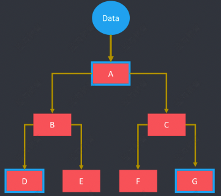
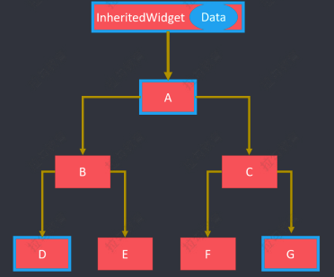
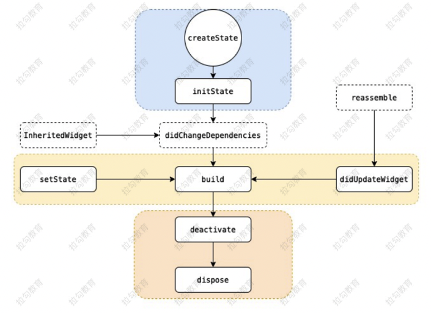
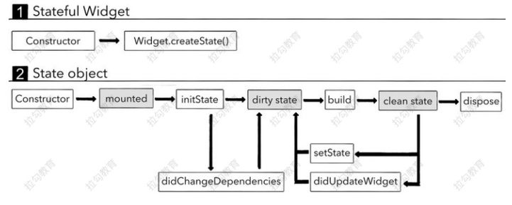
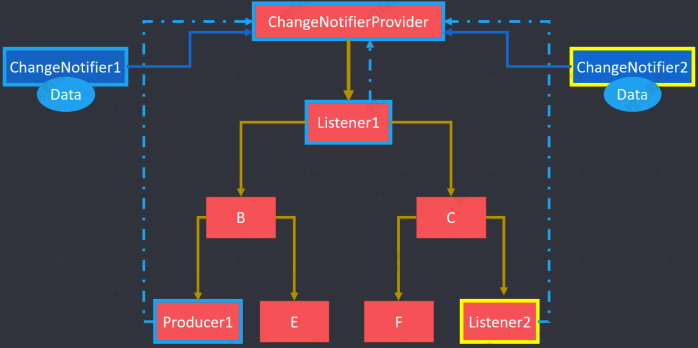

[TOC]

# flutter

## 概述

### 简介

Flutter 是谷歌开发的一款开源、免费的，基于 **Dart 语言**的移动 UI 框架，可以快速在 iOS 和 Android 上构建高质量的原生应用。 它最大的特点就是**跨平台**和**高性能**。

+ Dart 语言

  Dart 是由谷歌开发的计算机编程语言，它可以被用于 Web、服务器、移动应用和物联网等领域的 开发。Dart 诞生于 2011 年，号称要取代 JavaScript。

+ 跨平台

  良好的跨平台性，直接带来的好处就是减少开发成本。

  + 移动端
    + Android
    + iOS
  + Web
    + 各种浏览器
  + 桌面
    + Windows
    + Mac
  + 嵌入式平台
    + Linux
    + Fuchsia

+ 高性能

  Flutter 采用 GPU （图形显示）渲染技术，所以性能极高。Flutter 编写的应用是可以达到 120 fps（每秒传输帧数），这也就是说，它完全可以胜任游戏的制作。而 React Native 的性能只能达 到 60 fps。


### 发展历程

+ 2015，Flutter 在 Dart 开发者峰会上亮相 
+ 2018-6，Flutter 发布了首个预览版本 
+ 2018-12，Flutter 1.0 发布 
+ 2019-9，Flutter 1.9 发布，添加 Web 端支持 
+ 2020-9，Flutter 1.22 发布，带来了对 iOS 14 和 Android 11 的支持


### 主流框架对比

移动应用的三种开发模式


混合开发框架对比


### 成功案例

除了大量为适应快速发展节奏和节省人力成本的中小型企业，很多一线互联网企业也在重要项目中落地 了 Flutter 技术。第一个吃 Flutter 这只螃蟹的头部企业是阿里巴巴。阿里巴巴旗下的多款应用都使用了 Flutter。例如：咸鱼、淘宝特价版、盒马、优酷、飞猪等。另外，字节跳动内部的很多移动端应用，也 选中 Flutter。


### 资源网站

官网：https://flutter.dev/ 

Github: https://github.com/flutter/flutter 

中文网站： 

+ https://flutterchina.club/ 
+ https://flutter.cn/


### 环境搭建

[参考文档](https://flutter.cn/docs/get-started/install)


## 基础

### 项目目录

```bash
flutter_app
├── android # 安卓目录
├── build # 构建目录
├── ios # iOS 目录
├── lib # 开发目录（相当于 src 目录）
| ├── main.dart # 入口文件（相当于 index.js）
├── test # 测试目录
├── .gitignore # Git 提交时，设置忽略文件内容
├── pubspec.lock # 项目依赖锁定信息（相当于 npm 中的 package-lock.json）
└── pubspec.yaml # 项目依赖配置（相当于 npm 中的 package.json）
```


### 入口文件

Flutter 项目的入口文件是 `lib/main.dart`，在入口文件中有一个入口方法。

```dart
import 'package:flutter/material.dart';
void main() {
  runApp(Center(
    child: Text(
      'Hello World!',
      textDirection: TextDirection.ltr,
    )
  ));
}
```

+ UI 库 material

  ```dart
  import 'package:flutter/material.dart';
  ```

  Material 是一种标准的移动端和 Web 端的 UI 框架，是一套 Google 的设计规范，Flutter 项目以 Material 为 UI 基础。

  官网：https://www.material.io/ 

  中文网：https://material-io.cn/

+ 入口方法

  ```dart
  // 入口方法
  void main() {
  	// 具体内容
  }
  ```

+ 根函数 `runApp()`

  ```dart
  void main(){
  	runApp(
  		// 具体组件
  	);
  }
  ```

  runApp 函数接收给定的组件（Widget），并使其成为组件树的根。框架强制根组件覆盖整个屏 幕，这意味着 'Hello World!' 文本，在屏幕上居中显示。


### Widget（组件）

在 Flutter 中，一切的显示都是 Widget 。Widget 是一切的基础。Widget 和 Widget 之间通过 child: 进 行嵌套。一个 Flutter 组件，包含了组件的模板、样式和交互等内容，外部只要按照组件设定的属性、函 数及事件处理等进行调用即可，完全不用考虑组件的内部实现逻辑。你需要做的就是在 Widget 中堆积 你的布局。

+ Center：定义居中部件

  ```dart
  Center(
  	child: // 部件
  );
  ```

+ Text：定义文本部件

  ```dart
  Text(
  	'hello',
  	textDirection: TextDirection.ltr,
  )
  ```

  > 若不写textDirection会报错

+ 自定义组件

  为了增强代码的可读性，我们可以将部分代码分离出去。写成独立的 Widget。我们自定义的 Widget 需要继承 Flutter 提供的组件。这里有两种常用的组件

  + StatelessWidget

    是无状态组件，状态不可变的 Widget

  + StatefulWidget

    是有状态组件，持有的状态，可能在 Widget 生命周期改变。通俗的讲：如果我们想改变页面 中的数据的话，这个时候就需要用到 StatefulWidget

  **自定义组件中，有一个关键的 build 方法。**我们需要将独立的代码，放到 build 方法中。上述 HelloWorld ，经过分离后的代码如下：

  ```dart
  import 'package:flutter/material.dart';
  
  void main() {
    runApp(Hello());
  }
  
  // 或简写为
  // void main() => runApp(Hello());
  // 创建一个继承自无状态部件的自定义部件
  class Hello extends StatelessWidget {
    Widget build(BuildContext context) {
      // 实现一个build函数, 构建自身
      return Center(
          //返回一个部件
          child: Text(
        'Hello World!',
        textDirection: TextDirection.ltr,
      ));
    }
  }
  ```

  

### MaterialApp

参数对照表

| 字段                                                 | 类型                            |
| ---------------------------------------------------- | ------------------------------- |
| navigatorKey（导航主键）                             | GlobalKey                       |
| home（起始页）                                       | Widget                          |
| routes（路由列表）                                   | Map<String, WidgetBuilder>      |
| initialRoute（初始路由名称）                         | String                          |
| onGenerateRoute（生成路由）                          | RouteFactory                    |
| onUnknownRoute（未知路由）                           | RouteFactory                    |
| navigatorObservers（导航观察器）                     | List                            |
| builder（构造器）                                    | TransitionBuilder               |
| title（应用标题）                                    | String                          |
| onGenerateTitle（生成应用标题）                      | GenerateAppTitle                |
| color（颜色）                                        | Color                           |
| theme（主题配置）                                    | ThemeData                       |
| locale（本地化）                                     | Locale                          |
| localizationsDelegates（本地化委托代理）             | Iterable<LocalizationsDelegate> |
| localeResolutionCallback（本地化分辨回调）           | LocaleResolutionCallback        |
| supportedLocales（应用支持区域）                     | Iterable                        |
| debugShowMaterialGrid（是否显示 Material 网格）      | bool                            |
| showPerformanceOverlay（显示性能监控叠层）           | bool                            |
| checkerboardRasterCacheImages（棋盘格光栅缓存图 像） | bool                            |
| checkerboardOffscreenLayers（棋盘格层）              | bool                            |
| showSemanticsDebugger（显示语义调试器）              | bool                            |
| debugShowCheckedModeBanner（是否显示 DEBUG 横 幅）   | bool                            |


### Scaffold

Scaffold 是 Flutter 应用的脚手架。用来搭建 Flutter 项目的基本布局结构


+ appBar

  显示在界面顶部的一个 AppBar，也就是 Android 中的 ActionBar 、Toolbar

+ body

  当前界面的主体 Widget

+ floatingActionButton：

  纸墨设计中所定义的 FAB，界面的主要功能按钮

+ persistentFooterButtons：

  固定在下方显示的按钮，比如对话框下方的确定、取消按钮

+ drawer：

  侧边栏控件

+ backgroundColor：

  内容的背景颜色，默认使用的是 `ThemeData.scaffoldBackgroundColor` 的值

+ bottomNavigationBar：

  显示在页面底部的导航栏

+ resizeToAvoidBottomPadding

  类似于 Android 中的 `android:windowSoftInputMode=”adjustResize”`，控制界面内容 body 是否 重新布局来避免底部被覆盖了，比如当键盘显示的时候，重新布局避免被键盘盖住内容。默认值为 true。


### 文本

#### Text

```dargt
Text(
  'Hello',
  textDirection: TextDirection.ltr,
  style: TextStyle(
      fontSize: 40.0, color: Colors.yellow, fontWeight: FontWeight.bold),
  textAlign: TextAlign.left,
  maxLines: 3,
  overflow: TextOverflow.ellipsis,
),
```

+ TextDirection
  + TextDirection.ltr： 从左向右的文本
  + TextDirection.rtl： 从右向左的文本
+ TextStyle
  + color： 字体颜色
  + fontSize： 字体大小
  + fontWeight： 字体粗细
  + fontStyle： normal 或者 italic
  + fontFamily： 字体
  + letterSpacing： 字母间隙
  + wordSpacing： 单词间隙

| 属性                                | 说明                                                         |
| ----------------------------------- | ------------------------------------------------------------ |
| Color color                         | 文本颜色。如果指定了foreground，则此值必须为 null。          |
| TextDecoration decoration           | 绘制文本装饰:下划线（TextDecoration.underline）上划线 （TextDecoration.overline）删除线 （TextDecoration.lineThrough）无（TextDecoration.none） |
| Color decorationColor               | 绘制文本装饰的颜色。                                         |
| TextDecorationStyle decorationStyle | 绘制文本装饰的样式:画一条虚线 TextDecorationStyle.dashed画一 条虚线 TextDecorationStyle.dotted画两条线 TextDecorationStyle.double画一条实线 TextDecorationStyle.solid画一条正弦线(波浪线) TextDecorationStyle.wavy |
| FontWeight fontWeight               | 绘制文本时使用的字体粗细:FontWeight.bold 常用的字体重量比正 常重。即w700FontWeight.normal 默认字体粗细。即 w400FontWeight.w100 薄，最薄FontWeight.w200 特轻 FontWeight.w300 轻FontWeight.w400 正常/普通/平原 FontWeight.w500 较粗FontWeight.w600 半粗体 FontWeight.w700 加粗FontWeight.w800 特粗FontWeight.w900 最粗 |
| FontStyle fontStyle 字              | 对齐文本的水平线:TextBaseline.alphabetic：文本基线是标准的字 母基线TextBaseline.ideographic：文字基线是表意字基线；如果字 符本身超出了alphabetic 基线，那么ideograhpic基线位置在字符本 身的底部。 |
| String fontFamily                   | 使用的字体名称                                               |
| double fontSize                     | 字体大小(pt、sp)，默认为14个逻辑像素(14pt、14sp)             |
| double letterSpacing                | 水平字母之间的空间间隔（逻辑像素为单位）。可以使用负值来让 字母更接近。 |
| double wordSpacing                  | 单词之间添加的空间间隔（逻辑像素为单位）。可以使用负值来使 单词更接近。 |
| double height                       | 文本行与行的高度，作为字体大小的倍数（取值1~2，如1.2）       |
| Locale locale                       | 此属性很少设置，用于选择区域特定字形的语言环境               |
| Paint background 文                 | 文本背景色                                                   |
| Paint foreground                    | 文本的前景色，不能与color共同设置                            |

+ TextAlign

  + center： 文本居中
  + left： 左对齐
  + right： 右对齐
  + start： 开始处对齐，类似于左对齐。
  + end： 结尾处对齐，

+ maxLines

  设置最多显示的行数

+ overflow
  + clip： 直接切断，剩下的文字就没有了。
  + ellipsis： 在后边显示省略号。
  + fade： 溢出的部分会进行一个渐变消失的效果，当然是上下的渐变，不是左右的


#### RichText 和 TextSpan

RichText 和 TextSpan 可以为一段文本指定多个样式。

```dart
RichText(
  text: TextSpan(
      text: '你好',
      style: TextStyle(color: Colors.red),
      children: [
        TextSpan(text: '世界', style: TextStyle(color: Colors.blue))
      ]),
),
```


### 自定义字体

+ 导入字体文件

  字体文件可以网上找到，例如：https://fonts.google.com/ 

  选择需要的字体文件，然后下载

  然后，解压下载后的压缩包，将字体文件放到 Flutter 项目目录 中。例如：fonts/Source_Sans_Pro/*

+ 在 pubspec.yaml 中声明字体

  ```yaml
  flutter:
    # ......
    fonts:
      # family 属性决定了字体的名称，你将会在 TextStyle 的 fontFamily 属性中用到。
      - family: SourceSansPro
        fonts:
          - asset: fonts/Source_Sans_Pro/SourceSansPro-Black.ttf
          - asset: fonts/Source_Sans_Pro/SourceSansPro-BlackItalic.ttf
            # weight 属性指定了文件中字体轮廓的字重为 100 的整数倍
            weight: 400
            # style 属性指定文件中字体的轮廓是否为 italic 或 normal
            style: normal
  ```

+ 设置默认字体

  ```dart
  MaterialApp(
  	title: 'Custom Fonts',
  	// 设置整个应用的默认字体
  	theme: ThemeData(fontFamily: 'SourceSansPro'),
  	home: MyHomePage(),
  );
  ```

+ 在 Widget 中使用字体

  ```dart
  Text(
  	'Roboto Mono sample',
  	style: TextStyle(fontFamily: 'SourceSansPro'), // 为具体的组件设置字体
  );
  ```

  

### Icon

Icon 用来声明图标，Icons 是Flutter 中的图标组件

```dart
Icon(
	Icons.ac_unit_rounded,
	color: Colors.green,
	size: 40,
),
```

在线预览：https://material.io/resources/icons


### Color

+ Color（自定义颜色）
  + Flutter 中通过 ARGB 来声明颜色
  + const Color(0xFF42A5F5); // 16进制的ARGB = 透明度 + 六位十六进制颜色
  + const Color.fromARGB(0xFF, 0x42, 0xA5, 0xF5);
  + const Color.fromARGB(255, 66, 165, 245);
  + const Color.fromRGBO(66, 165, 245, 1.0); // O = Opacity
+ Colors（英文字母声明的颜色）
  + Colors.red


### 布局

#### Container

Container 就是 Flutter 中的盒子模式

+ Container

  + padding: EdgeInsets.all(10.0)

    + fromLTRB(double left, double top, double right, double bottom)：指定四个方向的填 充。
    + all(double value) : 所有方向，均使用相同数值的填充。
    + only({left, top, right ,bottom })：可以设置某个方向的填充（也可以同时指定多个方 向）
    + symmetric({ vertical, horizontal })：用于设置对称方向的填充，
      + vertical 值垂直方向，
      + horizontal 指水平方向。

  + margin：EdgeInsets.all(10.0)

    具体方法，参考 padding 部分

  + color 

    + Colors.颜色

  + width 

    + 数字 
    + double.infinity

  + height 

    + 数字 
    + double.infinity

  + decoration 是 container 的修饰器，用来设置背景和边框

    + BoxDecoration
      + Color color, 颜色 
      + DecorationImage image, 图片
      + BoxBorder border, 边框 
      + BorderRadiusGeometry borderRadius, 圆角
      + List boxShadow, 阴影,可以指定多个
      + Gradient gradient, 渐变 
      + BlendMode backgroundBlendMode, 背景混合模式
      + BoxShape shape = BoxShape.rectangle, 形状

  + alignment 内容对齐方式

    + Alignment
      + bottomCenter:下部居中对齐。 
      + botomLeft: 下部左对齐。 
      + bottomRight：下部右对齐。 
      + center：纵横双向居中对齐。 
      + centerLeft：纵向居中横向居左对齐。 
      + centerRight：纵向居中横向居右对齐。
      + topLeft：顶部左侧对齐。
      + topCenter：顶部居中对齐。
      + topRight： 顶部居左对齐。

  + transform 变形

    + Matrix4
      + translate：平移
      + rotate：旋转 
      + scale：缩放 
      + skew：斜切

```dart
class ContainerDemo extends StatelessWidget {
  @override
  Widget build(BuildContext context) {
    return Container(
      child: Text(
        'Hello Container',
        style: TextStyle(fontSize: 28.0),
      ),
      alignment: Alignment.bottomCenter,
// width: 300.0,
// height: 400.0,
      width: double.infinity,
      height: double.infinity,
      padding: EdgeInsets.all(10.0),
      margin: EdgeInsets.fromLTRB(10.0, 30.0, 0.0, 5.0),
      decoration: new BoxDecoration(
        color: Colors.lightGreen[200], // 背景色
        gradient: LinearGradient(// 设置渐变后，背景色失效
            colors: [Colors.lightBlue, Colors.greenAccent, Colors.purple]),
// border: Border.all(
// width: 20.0,
// color: Colors.red
// ),
        border: Border(
          top: BorderSide(width: 40.0, color: Colors.red),
          bottom: BorderSide(width: 20.0, color: Colors.yellow),
          right: BorderSide(width: 60.0, color: Colors.green),
        ),
// borderRadius: BorderRadius.all(Radius.circular(50)),
// borderRadius: BorderRadius.only(
        // topLeft: Radius.circular(30),
// topRight: Radius.circular(30),
// bottomLeft: Radius.circular(10),
// bottomRight: Radius.circular(10),
// )
      ),
    );
  }
}
```


#### 线性布局

**Column**

组件沿着列（Column）方向进行布局

+ Column
  + Column 中的主轴方向是垂直方向
  + mainAxisAlignment：MainAxisAlignment 主轴对齐方式 
  + crossAxisAlignment：CrossAxisAlignment 交叉抽对齐方式
  + children 声明内容


**Row**

组件沿着行（Row）方向进行布局

+ Row
  + Row 中的主轴方向是水平方向 
  + mainAxisAlignment：MainAxisAlignment 主轴对齐方式 
  + crossAxisAlignment：CrossAxisAlignment 交叉抽对齐方式

```dart
class ColumnRowDemo extends StatelessWidget {
  double iconSize = 50;
  @override
  Widget build(BuildContext context) {
    return Container(
        color: Colors.pink[100],
        child: Column(
          mainAxisAlignment: MainAxisAlignment.spaceEvenly, // 主轴对齐方式
          crossAxisAlignment: CrossAxisAlignment.center, // 交叉轴对齐方式
          children: [
            Icon(
              Icons.search,
              size: iconSize,
            ),
            Icon(
              Icons.home,
              size: iconSize,
            ),
            Icon(
              Icons.settings,
              size: iconSize,
            ),
            Icon(
              Icons.supervised_user_circle_sharp,
              size: iconSize,
            ),
            Row(
              mainAxisAlignment: MainAxisAlignment.spaceAround,
              children: [
                Icon(
                  Icons.access_alarms,
                  size: iconSize,
                ),
                Icon(
                  Icons.add_comment,
                  size: iconSize,
                ),
                Icon(
                  Icons.print,
                  size: iconSize,
                ),
                Icon(
                  Icons.android_rounded,
                  size: iconSize,
                ),
              ],
            )
          ],
        ));
  }
}
```


#### 弹性布局

**Flex**

+ direction 

  设置主轴方向，可设置的值为 Axis.horizontal 和 Axis.vertical，交叉轴与主轴方向垂直。

+ mainAxisAlignment

  子组件沿着主轴方向的对齐方式:

  + MainAxisAlignment.start：左对齐；（默认值） 
  + MainAxisAlignment.end：右对齐; 
  + MainAxisAlignment.center：居中对齐; 
  + MainAxisAlignment.spaceBetween：两端对齐; 
  + MainAxisAlignment.spaceAround：空格环绕; 
  + MainAxisAlignment.spaceEvently：空格平均分布.

+ crossAxisAlignment

  子组件在交叉轴的对齐方向

  + CrossAxisAlignment.start：与交叉轴的起始位置对齐；
  + CrossAxisAlignment.end：与交叉轴的结束位置对齐；
  + CrossAxisAlignment.center：居中对齐；
  + CrossAxisAlignment.stretch：填充整个交叉轴；
  + CrossAxisAlignment.baseline：按照第一行文字基线对齐。

+ mainAxisSize

  设置主轴的大小

  + MainAxisSize.max：主轴的大小是父容器的大小；
  + MainAxisSize.min：主轴的大小是其子组件大小之和。

+ verticalDirection

  设置垂直方向上的子组件的排列顺序

  + VerticalDirection.down：start 在顶部，end 在底部；
  + VerticalDirection.up：start 在底部，end 在顶部。

+ textBaseline

  设置文字对齐的基线类型

  + TextBaseline.alphabetic：与字母基线对齐；
  + TextBaseline.ideographic：与表意字符基线对齐；


**Expanded**

+ flex

  声明所占比例

+ child

  声明子组件


#### 流式布局

在介绍 Row 和 Colum 时，如果子组件超出屏幕范围，则会报溢出错误。而流式布局可以有效解决内容 溢出。

**Wrap**

+ spacing：主轴方向子组件的间距 
+ alignment: 主轴方向的对齐方式
  + WrapAlignment
+ runSpacing：纵轴方向子组件的间距
+ runAlignment：纵轴方向的对齐方式
  + WrapAlignment

```dart
Wrap(
  spacing: 8.0, // 主轴(水平)方向间距
  runSpacing: 4.0, // 纵轴（垂直）方向间距
  alignment: WrapAlignment.spaceAround, //沿主轴方向居中
  children: [
    Chip(
      avatar: CircleAvatar(backgroundColor: Colors.blue, child: Text('蜀')),
      label: Text('刘备'),
    ),
    Chip(
      avatar: CircleAvatar(backgroundColor: Colors.blue, child: Text('蜀')),
      label: Text('关羽'),
    ),
    Chip(
      avatar: CircleAvatar(backgroundColor: Colors.blue, child: Text('蜀')),
      label: Text('张飞'),
    ),
    Chip(
      avatar: CircleAvatar(backgroundColor: Colors.blue, child: Text('蜀')),
      label: Text('赵云'),
    ),
    Chip(
      avatar: CircleAvatar(backgroundColor: Colors.blue, child: Text('蜀')),
      label: Text('马超'),
    ),
    Chip(
      avatar: CircleAvatar(backgroundColor: Colors.blue, child: Text('蜀')),
      label: Text('诸葛亮'),
    ),
  ],
)
```


#### 层叠布局

**Stack**

```dart
Stack({
	this.alignment = AlignmentDirectional.topStart,
	this.textDirection,
	this.fit = StackFit.loose,
	this.overflow = Overflow.clip,
	List<Widget> children = const <Widget>[],
})
```

+ alignment：此参数决定如何去对齐没有定位（没有使用 Positioned）或部分定位的子组件。 

  所谓部分定位，在这里**特指没有在某一个轴上定位**：left、right 为横轴，top、bottom 为纵轴，只 要包含某个轴上的一个定位属性就算在该轴上有定位。

+ textDirection：和 Row、Wrap 的 textDirection 功能一样，都用于确定 alignment 对齐的参考 系。

  textDirection 的值为 TextDirection.ltr，则 alignment 的 start 代表左，end 代表右，即从左往右 的顺序textDirection 的值为 TextDirection.rtl，则 alignment 的 start 代表右，end 代表左，即从 右往左的顺序

+ fit：此参数用于确定**没有定位**的子组件如何去适应 Stack 的大小。 

  StackFit.loose 表示使用子组件的大小，StackFit.expand 表示扩伸到 Stack 的大小。

+ overflow：此属性决定如何显示超出 Stack 显示空间的子组件；

  值为 Overflow.clip 时，超出部分会被剪裁（隐藏），值为 Overflow.visible 时则不会。


**Positioned**

Positioned 可以控制组件的位置，通过他可以随意摆放一个组件，有点像**绝对布局**。

```dart
const Positioned({
	Key key,
	this.left,
	this.top,
	this.right,
	this.bottom,
	this.width,
	this.height,
	@required Widget child,
})
```

left、top 、right、 bottom 分别代表离 Stack 左、上、右、底四边的距离。width 和 height 用于指定 需要定位元素的宽度和高度。

> 注意，Positioned 的 width、height 和其它地方的意义稍微有点区别，此处用于配合 left、top 、 right、 bottom 来定位组件。 
>
> 举个例子，在水平方向时，你只能指定 left、right、width 三个属性中的两个，如指定 left 和 width 后，right 会自动算出( left+width )，如果同时指定三个属性则会报错，垂直方向同理。


**Card**

Card 是 Flutter 中的卡片组件，功能与 Container 类似，用来声明局部页面布局

+ color 卡片背景色

+ shadowColor 阴影颜色

+ elevation 阴影高度

+ shape 边框样式

  RoundedRectangleBorder

+ borderOnForeground 是否在 child 前绘制 border，默认为 true

+ margin 外边距

+ clipBehavior 裁切方式

+ child 子组件

+ semanticContainer 是否使用新的语义节点，默认为 true

代码示例：

```dart
Card(
  margin: EdgeInsets.all(30),
  child: Column(
    children: <Widget>[
      ListTile(
        title: Text("李四", style: TextStyle(fontSize: 28)),
        subtitle: Text("CEO"),
      ),
      Divider(),
      ListTile(
        title: Text("电话:123456789"),
      ),
      ListTile(title: Text("地址：xxxxxxxxxxxxxxxxx"))
    ],
  ),
),
Card(
  margin: EdgeInsets.all(30),
  child: Column(
    children: <Widget>[
      ListTile(
        leading: Icon(
          Icons.supervised_user_circle_outlined,
          size: 50,
        ),
        title: Text("张三", style: TextStyle(fontSize: 28)),
        subtitle: Text("董事长"),
      ),
      Divider(),
      ListTile(
        title: Text("电话: 123456789"),
      ),
      ListTile(title: Text("地址：xxxxxxxxxxxxxxxxx"))
    ],
  ),
  color: Colors.purpleAccent[100],
  shadowColor: Colors.yellow, // 阴影颜色
  elevation: 20, // 阴影高度
  shape: RoundedRectangleBorder(
    borderRadius: BorderRadius.circular(40),
    side: BorderSide(
      color: Colors.yellow,
      width: 3,
    ),
  ),
)
```


### 按钮

Flutter 1.22 版本新增了3个按钮，TextButton、OutlinedButton、ElevatedButton，虽然以前的 Button 没有被废弃，但还是建议使用新的 Button。以前的按钮调整为统一的外观比较麻烦，因此以前 经常使用自定义的按钮，而新增的按钮解决了此类问题，可以非常方便的设置整体外观

| 1.22版本前的按钮 | 主题        | 1.22版本后的按钮 | 主题                |
| ---------------- | ----------- | ---------------- | ------------------- |
| FlatButton       | ButtonTheme | TextButton       | TextButtonTheme     |
| OutlineButton    | ButtonTheme | OutlinedButton   | OutlinedButtonTheme |
| RaisedButton     | ButtonTheme | ElevatedButton   | ElevatedButtonTheme |

外观上并没有很大的不同，但 TextButton、OutlinedButton、ElevatedButton 将外观属性集合为一个 **ButtonStyle**，非常方便统一控制。

建议使用 **TextButton** 替换 FlatButton、**OutlinedButton** 替换 OutlineButton、**ElevatedButton** 替 换 RaisedButton。


#### TextButton

```dart
const TextButton({
  Key key,
  @required VoidCallback onPressed, // 按键回调 - 必填项
  VoidCallback onLongPress, // 长按回调
  ButtonStyle style, // 按钮样式
  FocusNode focusNode, // 焦点事件捕获与监听对象
  bool autofocus = false, // 自动获取焦点
  Clip clipBehavior = Clip.none, // 剪切
  @required Widget child, // 子组件 - 必填项
  }) : super(
  key: key,
  onPressed: onPressed,
  onLongPress: onLongPress,
  style: style,
  focusNode: focusNode,
  autofocus: autofocus,
  clipBehavior: clipBehavior,
  child: child,
);
```

+ ButtonStyle（按钮样式）

  ```dart
  const ButtonStyle({
    this.textStyle, // 文本样式,设置文字的大小和粗细
    this.backgroundColor, // 背景色
    this.foregroundColor, // 前景色，即文本的颜色和图标的颜色
    this.overlayColor, // 水波纹颜色
    this.shadowColor, // 阴影颜色
    this.elevation, // 阴影高度
    this.padding, // 内间距
    this.minimumSize, // 设置按钮的大小
    this.side, // 边框设置
    this.shape, // 外边框样式 - 会覆盖side
    this.mouseCursor, // 鼠标指针的光标进入或悬停在此按钮的[InkWell]上时
    this.visualDensity, // 视觉密度 - 按钮布局的紧凑程度
    this.tapTargetSize, // 配置按钮被按下区域的最小尺寸
    this.animationDuration, // 动画变化的持续时间
    this.enableFeedback, // 检测到的手势是否应该提供听觉和/或触觉反馈
  });
  ```

  其中属性对应的值，通过 MaterialStateProperty 组件来设置。

+ clipBehavior（剪切内容）
  + Clip.hardEdge（剪辑，但不应用抗锯齿）
  + Clip.antiAlias（剪辑具有抗锯齿功能）
  + Clip.antiAliasWithSaveLayer（在剪辑后立即剪辑具有抗锯齿和 saveLayer）
  + Clip.none（不剪辑 - 默认值）

TextButton 的代码示例

```dart
TextButton(
    onPressed: () {
      // Respond to button press
    },
    child: Text('TextButton'),
    style: ButtonStyle(
      // 文本样式
      textStyle: MaterialStateProperty.all(
          TextStyle(fontSize: 18, color: Colors.red)),
      // 前景色
      foregroundColor: MaterialStateProperty.resolveWith(
        (states) {
          if (states.contains(MaterialState.pressed)) {
            // 按下时的颜色
            return Colors.red;
          }
          // 默认状态使用灰色
          return Colors.black;
        },
      ),
      // 背景色
      backgroundColor: MaterialStateProperty.resolveWith((states) {
        // 设置按下时的背景颜色
        if (states.contains(MaterialState.pressed)) {
          return Colors.yellow;
        }
        //默认不使用背景颜色
        return Colors.white;
      }),
      // 阴影颜色
      shadowColor: MaterialStateProperty.all(Colors.yellow),
      // 阴影高度
      elevation: MaterialStateProperty.all(20),
      // 设置水波纹颜色
      overlayColor: MaterialStateProperty.all(Colors.purpleAccent),
      // 设置按钮大小
      minimumSize: MaterialStateProperty.all(Size(150, 80)),
      // 设置边框
      side: MaterialStateProperty.all(
          BorderSide(color: Colors.red, width: 1)),
      // 设置按钮形状
      shape: MaterialStateProperty.all(StadiumBorder(
        side: BorderSide(
            color: Colors.red, width: 1, style: BorderStyle.solid),
      )),
    ))
```


#### OutlinedButton

轮廓按钮 - 同 TextButton


#### ElevatedButton

凸起按钮 - 同 TextButton


#### 图标按钮

+ IconButton

  ```dart
  IconButton(
  	icon: Icon(Icons.access_alarms),
  	onPressed: () {
  	// Respond to button press
  	},
  ),
  ```

+ TextButton.icon()

  ```dart
  TextButton.icon(
  	onPressed: () {
  	// Respond to button press
  	},
  	icon: Icon(Icons.zoom_in_rounded),
  	label: Text('Text Button'),
  )
  ```

+ OutlinedButton.icon()

  ```dart
  OutlinedButton.icon(
  	onPressed: () {
  	// Respond to button press
  	},
  	icon: Icon(Icons.zoom_in_rounded),
  	label: Text('Outlined Button'),
  )
  ```

+ ElevatedButton.icon()

  ```dart
  ElevatedButton.icon(
  	onPressed: () {
  	// Respond to button press
  	},
  	icon: Icon(Icons.zoom_in_rounded),
  	label: Text('Elevated Button'),
  )
  ```

  

#### ButtonBar

ButtonBar 并不是一个单独的按钮控件，而是末端对齐的容器类控件，当在水平方向上没有足够空间时 候，按钮将整体垂直排列，而不是换行。

```dart
ButtonBar(
	children: <Widget>[
		ElevatedButton(),
		ElevatedButton(),
		ElevatedButton(),
		ElevatedButton(),
	],
)
```


#### FloatingActionButton

浮动按钮


#### Chip

Material 风格标签控件

+ Chip 
+ InputChip 
+ ChoiceChip 
+ FilterChip
+  ActionChip

```dart
Chip(
  avatar: CircleAvatar(
      // 头像
      backgroundImage: NetworkImage(
        'http://placeimg.com/640/480/people',
        scale: 1.0,
      ),
      radius: 50),
  label: Text('Hello'), // 标签名称
  labelStyle: TextStyle(
    // 标签样式
    fontSize: 40,
    color: Colors.red,
  ),
  backgroundColor: Colors.blueAccent[100], // 背景色
  shape: RoundedRectangleBorder(
      borderRadius: BorderRadius.circular(20)), // 标签形状
  padding: EdgeInsets.all(10), // 内边距
  deleteIcon: Icon(Icons.delete, size: 30), // 删除菜单图标
  deleteIconColor: Colors.red, // 删除菜单图标颜色
  onDeleted: () {
    // 删除方法
    print('dddd');
  },
  elevation: 10, // 设置阴影
  shadowColor: Colors.yellow, // 阴影颜色
)
```


### 图片

```dart
const Image({
	...
	this.width, // 图片的宽
	this.height, // 图片高度
	this.color, // 图片的混合色值
	this.colorBlendMode, // 混合模式
	this.fit, // 缩放模式
	this.alignment = Alignment.center, // 对齐方式
	this.repeat = ImageRepeat.noRepeat, // 重复方式
	...
})
```

colorBlendMode 和 color 属性配合使用，能让图片改变颜色。 

fit 属性可以控制图片的拉伸和压缩，常用属性如下:

+ BoxFit.fill: 全图显示，图片会被拉伸，并充满父容器。 
+ BoxFit.contain: 全图显示，显示原比例，可能会有空隙。 
+ BoxFit.cover：显示可能拉伸，可能裁切，充满（图片要充满整个容器，还不变形）。 
+ BoxFit.fitWidth：宽度充满（横向充满），显示可能拉伸，可能裁切。 
+ BoxFit.fitHeight ：高度充满（竖向充满）,显示可能拉伸，可能裁切。 
+ BoxFit.scaleDown：效果和 contain 差不多，但是此属性不允许显示超过源图片大小，可小不可 大。

repeat 平铺

+ ImageRepeat.repeat : 横向和纵向都进行重复，直到铺满整个画布。 
+ ImageRepeat.repeatX: 横向重复，纵向不重复。 
+ ImageRepeat.repeatY：纵向重复，横向不重复。


#### Image.asset

加载资源图片

1. 在工程根目录下创建一个 `images` 目录 ，并将图片avatar.png拷贝到该目录。

2. 在 `pubspec.yaml` 中的 flutter 部分添加如下内容：

   ```yaml
   assets:
   	- images/avatar.png
   ```

   > 注意: **由于 yaml 文件对缩进严格，所以必须严格按照每一层两个空格的方式进行缩进，此处 assets前面应有两个空格。**

3. 加载该图片

   ```dart
   Image(
   	image: AssetImage("images/avatar.png"),
   	width: 100.0
   );
   ```

   Image也提供了一个快捷的构造函数 `Image.asset` 用于从asset中加载、显示图片：

   ```dart
   Image.asset("images/avatar.png",
   	width: 100.0,
   )
   ```


#### Image.network

访问网络图片时，需要给应用赋予访问网络的权限。具体来说

> 如果不设置，会收到如下报错 
>
> 报错: **Insecure HTTP is not allowed by platform** 
>
> 原因：平台不支持不安全的 HTTP 协议，即不允许访问 HTTP 域名的地址。

+ Android 解决

  打开 `android/app/src/main/AndroidManifest.xml`

  ```xml
  <uses-permission android:name="android.permission.INTERNET" /> <!-- 添加这一行 -->
  <application
  	android:label="flutter_app"
  	android:usesCleartextTraffic="true" <!-- 添加这一行 -->
  	android:icon="@mipmap/ic_launcher">
  ```

+ iOS 解决

  打开 `ios/Runner/Info.plist`。添加如下代码

  ```dart
  <key>NSAppTransportSecurity</key>
  <dict>
  	<key>NSAllowsArbitraryLoads</key>
  	<true/>
  </dict>
  ```

网络资源图片

```dart
Image(
	image: NetworkImage("https://dummyimage.com/300X300/DDFFBB"),
	width: 100.0,
)
```

Image 也提供了一个快捷的命名构造函数 `Image.network` 用于从网络加载、显示图片：

```dart
Image.network(
	"https://dummyimage.com/300X300/DDFFBB",
	width: 100.0,
)
```


### 列表

#### SingleChildScrollView

类似于Android中的 `ScrollView` ，它只能接收一个子组件。

+ scrollDirection 滚动方向 
+ padding 内边距 
+ physics 结束拖动时效果响应
  + ClampingScrollPhysics：Android 下微光效果 
  + BouncingScrollPhysics：iOS 下弹性效果
+ child 子组件
+ reverse 此属性本质上是决定可滚动组件的初始滚动位置是在“头”还是“尾”，取 false 时，初始滚动 位置在“头”，反之则在“尾” 。

代码示例：

```dart
SingleChildScrollView(
  scrollDirection: Axis.vertical,
  padding: EdgeInsets.all(16.0),
  physics: BouncingScrollPhysics(),
  child: Center(
    child: Column(
        children: List.generate(
      100,
      (index) => Text(
        'item$index',
        style: TextStyle(fontSize: 28, wordSpacing: 40),
      ),
    )),
  ),
)
```


#### ListView

+ ListView

  ListView 是最常用的可滚动组件之一，它可以沿一个方向线性布局所有子组件，我们看看 ListView 的默认构造函数定义：

  ```dart
  ListView({
  	...
  	// 可滚动widget公共参数
  	Axis scrollDirection = Axis.vertical,
  	bool reverse = false,
  	ScrollController controller,
  	bool primary,
  	ScrollPhysics physics,
  	EdgeInsetsGeometry padding,
    
  	// ListView各个构造函数的共同参数
  	double itemExtent,
  	bool shrinkWrap = false,
  	bool addAutomaticKeepAlives = true,
  	bool addRepaintBoundaries = true,
  	double cacheExtent,
    
  	// 子widget列表
  	List<Widget> children = const <Widget>[],
  })
  ```

  通过构造函数中的 children 传入所有的子组件有一个问题：默认会创建出所有的子Widget。(性能 差)

+ ListView.builder

  ListView.builder 适用于子 Widget 比较多的场景，该构造函数将创建子 Widget 交给了一个抽象的 方法，交给 ListView 进行管理，ListView 会在真正需要的时候去创建子Widget，而不是一开始就 全部初始化好。

  + itemCount 列表项的数量，如果为空，则表示ListView为无限列表 
  + itemBuilder 列表项创建的方法

+ ListView.separated

  ListView.separated 会生成带有分割器的列表

+ ListView.custom

  支持自定义生成列表


**ListTile**

```dart
ListTile(
  leading: CircleAvatar(
    // 头部
    backgroundImage: Image.network(IMAGE_SRC),
  ),
  trailing: Container(
      // 尾部
      child: Image.network(
        IMAGE_SRC,
        fit: BoxFit.cover,
      ),
      color: Colors.grey,
      width: 60,
      height: 60),
  title: Text(TITLE), // 主标题
  subtitle: Text(
    // 次标题
    SUB_TITLE,
    maxLines: 1,
    overflow: TextOverflow.ellipsis,
  ),
)
```


#### GridView

GridView 可以构建一个二维网格列表

```dart
GridView({
	Axis scrollDirection = Axis.vertical,
	bool reverse = false,
	ScrollController controller,
	bool primary,
	ScrollPhysics physics,
	bool shrinkWrap = false,
	EdgeInsetsGeometry padding,
	@required SliverGridDelegate gridDelegate, //控制子widget layout的委托
	bool addAutomaticKeepAlives = true,
	bool addRepaintBoundaries = true,
	double cacheExtent,
	List<Widget> children = const <Widget>[],
})
```

GridView 和 ListView 的大多数参数都是相同的。唯一需要关注的是 **gridDelegate** 参数，类型是 SliverGridDelegate，其中 SliverGridDelegate 其实是一个抽象类，而且一共有两个实现类：

+ SliverGridDelegateWithFixedCrossAxisCount：用于固定列数的场景；

  我们先来看下 SliverGridDelegateWithFixedCrossAxisCount

  ```dart
  SliverGridDelegateWithFixedCrossAxisCount({
  	required this.crossAxisCount, // 列数，即一行有几个子元素；
  	this.mainAxisSpacing = 0.0, // 主轴方向上的空隙间距；
  	this.crossAxisSpacing = 0.0, // 次轴方向上的空隙间距；
  	this.childAspectRatio = 1.0, // 子元素的宽高比例
  })
  ```

+ SliverGridDelegateWithMaxCrossAxisExtent：声明子组件的宽度，列数自适应；

  来看下其构造函数：

  ```dart
  SliverGridDelegateWithMaxCrossAxisExtent({
  	required this.maxCrossAxisExtent,
  	this.mainAxisSpacing = 0.0,
  	this.crossAxisSpacing = 0.0,
  	this.childAspectRatio = 1.0,
  })
  ```

  

另外，还有一个属性需要注意，就是 physics，它的类型是 ScrollPhysics

首先介绍 ScrollPhysics ，在 Flutter 官方的介绍中， ScrollPhysics 的作用是 **确定可滚动控件的物理特性**， 常见的有以下四大金刚：

+ BouncingScrollPhysics ：允许滚动超出边界，但之后内容会反弹回来。 
+ ClampingScrollPhysics ： 防止滚动超出边界，夹住 。 
+ AlwaysScrollableScrollPhysics ：始终响应用户的滚动。 
+ NeverScrollableScrollPhysics ：不响应用户的滚动。


使用 GridView

1. GridView 默认构造函数可以类比于 ListView 默认构造函数，适用于**有限个数子元素**的场景，因为 GridView 组件会一次性全部渲染 children 中的子组件；
2. GridView.count 命名构造函数是 GrdiView 使用 SliverGridDelegateWithFixedCrossAxisCount 的 简写（语法糖），效果完全一致；
3. GridView.extent 命名构造函数式 GridView 使用 SliverGridDelegateWithMaxCrossAxisExtent 的 简写（语法糖），效果完全一致。
4. GridView.builder 命名构造函数可以类比于 ListView.builder，适用于**长列表**的场景，因为 GridView 组件会根据子组件是否出现在屏幕内而动态创建销毁，减少内存消耗，更高效渲染；


### 其他组件

#### Cupertino

material.dart 提供了 Android 风格的组件；而 Cupertino 提供了 iOS 风格的组件。 

Cupertino 详情：https://flutter.dev/docs/development/ui/widgets/cupertino


#### SafeArea

SafeArea 主要用来解决刘海屏的问题。


### 第三方库组件

Flutter 中，常用的第三方组件。

| 库                     | 功能           |
| ---------------------- | -------------- |
| dio                    | 网络框架       |
| shared_preferences     | 本地数据缓存   |
| fluttertoast           | toast          |
| flutter_redux          | redux          |
| device_info            | 设备信息       |
| connectivity           | 网络链接       |
| flutter_markdown       | markdown 解析  |
| json_annotation        | json 模板      |
| json_serializable      | json 模板      |
| url_launcher           | 启动外部浏览器 |
| iconfont               | 字库图标       |
| share                  | 系统分享       |
| flutter_spinkit        | 加载框样式     |
| get_version            | 版本信息       |
| flutter_webview_plugin | 全屏的 webview |
| sqflite                | 数据库         |
| flutter_statusbar      | 状态栏         |
| flutter_svg            | svg            |
| photo_view             | 图片预览       |
| flutter_slidable       | 侧滑           |
| flutter_cache_manager  | 缓存管理       |
| path_provider          | 本地路径       |
| permission_handler     | 权限           |
| scope_model            | 状态管理和共享 |
| lottie                 | svg 动画       |
| flare                  | 路径动画       |


#### dio

dio 是一个强大的 Dart Http 请求库，支持 Restful API、FormData、拦截器、请求取消、Cookie 管 理、文件上传/下载、超时、自定义适配器等。 

详情：https://pub.dev/packages/dio

使用：

+ 在 `pubsepc.yaml` 中添加依赖

  ```yaml
  dependencies:
  	dio: ^3.0.1
  ```

+ 安装

  + VS Code

    ctrl+s 保存 pubsepc.yaml，VS Code 会自动安装依赖。

  + pub

    ```bash
    pub get
    ```

  + flutter

    ```bash
    flutter pub get
    ```

+ 引入

  ```bash
  import 'package:dio/dio.dart';
  ```

+ 使用

  ```dart
  import 'package:dio/dio.dart';
  /// More examples see
  https://github.com/flutterchina/dio/tree/master/example
  main() async {
  	var dio = Dio();
  	Response response = await dio.get('https://google.com');
  	print(response.data);
  }
  ```

  

报错: **Insecure HTTP is not allowed by platform**

原因：平台不支持不安全的 HTTP 协议，即不允许访问 HTTP 域名的地址。

+ Android 解决

  打开 `android/app/src/main/AndroidManifest.xml`

  ```xml
  <uses-permission android:name="android.permission.INTERNET" /> <!-- 添加这一行 -->
  <application
  	android:label="flutter_app"
  	android:usesCleartextTraffic="true" <!-- 添加这一行 -->
  	android:icon="@mipmap/ic_launcher">
  ```

+ iOS 解决

  打开 `ios/Runner/Info.plist`。添加如下代码：

  ```xml
  <key>NSAppTransportSecurity</key>
  	<dict>
  		<key>NSAllowsArbitraryLoads</key>
  		<true/>
  	</dict>
  ```

  

#### flutter_swiper

flutter_swiper 是 Flutter 中最好的轮播组件。它可以实现多种轮播效果。同时适配 Android 和 iOS。具 体用法如下：

+ 在 `pubsepc.yaml` 中添加依赖

  ```yaml
  dependencies:
  	flutter_swiper: ^1.1.6
  ```

+ 安装

  + VS Code

    ctrl+s 保存 pubsepc.yaml，VS Code 会自动安装依赖。

  + pub

    ```bash
    pub get
    ```

  + flutter

    ```bash
    flutter pub ge
    ```

+ 引入

  ```dart
  import 'package:flutter_swiper/flutter_swiper.dart';
  ```

+ 使用

  ```dart
  final List<String> imgs = [
  	'images/1.jpg',
  	'images/2.jpg',
  	'images/3.jpg',
  ];
  // ...
  Container(
  	height: 200,
  	child: Swiper(
  	itemBuilder: (BuildContext context, int index) {
  		return Image.asset(
  			imgs[index],
  			fit: BoxFit.cover,
  		);
  	},
  	itemCount: imgs.length,
  	pagination: SwiperPagination(), // 如果不填则不显示指示点
  	control: SwiperControl(), // 如果不填则不显示左右按钮
  	),
  )
  ```

  

**常用属性**

| 参数            | 默认值                         | 描述                                           |
| --------------- | ------------------------------ | ---------------------------------------------- |
| scrollDirection | Axis.horizontal                | 滚动方向，设置为Axis.vertical如果需要垂 直滚动 |
| loop            | true                           | 无限轮播模式开关                               |
| index           | 0                              | 初始的时候下标位置                             |
| autoplay        | false                          | 自动播放开关                                   |
| onIndexChanged  | void onIndexChanged(int index) | 下标改变的时候调用                             |
| onTap           | void onTap(int index)          | 当用户点击某个轮播的时候调用                   |
| duration        | 300.0                          | 动画时间，单位是毫秒                           |
| pagination      | null                           | 设置 SwiperPagination() 展示默认分页指 示器    |
| control         | null                           | 设置 SwiperControl() 展示默认分页按钮          |


**分页指示器**

分页指示器继承自 SwiperPlugin, SwiperPlugin 为 Swiper 提供额外的界面。设置为 SwiperPagination() 展示默认分页.

| 参数      | 默认值                     | 描述                                                         |
| --------- | -------------------------- | ------------------------------------------------------------ |
| alignment | Alignment.bottomCenter     | 如果要将分页指示器放到其他位置，那么可以修改这 个参数        |
| margin    | const EdgeInsets.all(10.0) | 分页指示器与容器边框的距离                                   |
| builder   | SwiperPagination.dots      | 目前已经定义了两个默认的分页指示器样式： `SwiperPagination.dots` 、 `SwiperPagination.fraction` ，都可以做进一步 的自定义. |

如果需要定制自己的分页指示器，那么可以这样写：

```dart
new Swiper(
	...,
	pagination:new SwiperCustomPagination(
		builder:(BuildContext context, SwiperPluginConfig config){
      return new YourOwnPaginatipon();
		}
	)
);
```


**控制按钮**

控制按钮组件也是继承自 `SwiperPlugin` ,设置 `new SwiperControl()` 展示默认控制按钮

| 参数         | 默认值                         | 描述                 |
| ------------ | ------------------------------ | -------------------- |
| iconPrevious | Icons.arrow_back_ios           | 上一页的IconData     |
| iconNext     | Icons.arrow_forward_ios        | 下一页的IconData     |
| color        | Theme.of(context).primaryColor | 控制按钮颜色         |
| size         | 30.0                           | 控制按钮的大小       |
| padding      | const EdgeInsets.all(5.0)      | 控制按钮与容器的距离 |


**控制器（SwiperController）**

SwiperController 用于控制 Swiper 的 index 属性, 停止和开始自动播放. 通过 SwiperController() 创建 一个SwiperController实例，并保存，以便将来能使用。

| 方法                                         | 描述                             |
| -------------------------------------------- | -------------------------------- |
| void move(int index, {bool animation: true}) | 移动到指定下标，设置是否播放动画 |
| void next({bool animation: true})            | 下一页                           |
| void previous({bool animation: true})        | 上一页                           |
| void startAutoplay()                         | 开始自动播放                     |
| void stopAutoplay()                          | 停止自动播放                     |


**自动播放**

| 参数                         | 默认值 | 描述                                |
| ---------------------------- | ------ | ----------------------------------- |
| autoplayDely                 | 3000   | 自动播放延迟毫秒数.                 |
| autoplayDisableOnInteraction | true   | 当用户拖拽的时候，是否停止自动播放. |


#### shared_preferences

SharedPreferences轻量级存储类，以键值对的形式保存设置，属性和数据。在Flutter平台我们使用 shared_preferences库来同时支持Android 和iOS。

详情：https://pub.dev/packages/shared_preferences

使用：

+ 在 `pubspec.yaml` 中添加依赖

  ```yaml
  dependencies:
  	shared_preferences: ^0.5.12+4
  ```

+ 安装

  ```dash
  flutter pub get
  ```

  > VS Code 下直接保存 pubspec.yaml 就会自动帮我们下载

+ 引入

  ```dart
  import 'package:shared_preferences/shared_preferences.dart';
  ```

+ 使用

  + 增

    `setString(key, value)`

  + 删

    `remove(key) `

    `clear()`

  + 改

    更改就是重新设置数据。 

    `setString(key, value)`

  + 查

    `getString(key)`


### 状态管理

#### StatefulWidget

组件 Widget
Flutter 中的组件包括无状态组件和有状态组件。

+ 无状态组件（StatelessWidget）

  无状态组件，可以理解为将外部传入的数据转化为界面展示的内容，只会渲染一次。

  在需要实现一个 StatelessWidget 组件的时候，声明一个类需要通过 extends 继承 StatelessWidget，然后实现 build 方法，就可以创建一个无状态组件。

  > **注意**： 如果无状态组件里面有子组件，并且子组件是有状态的，则子组件的内容是可以通过 setState 来更改的。无状态组件影响的仅仅是自己是无状态的，不回影响他的父组件和子组 件。 
  >
  > **无状态Widget是不能调用 setState 函数**

+ 有状态组件（StatefulWidget）

  有状态组件，是定义交互逻辑和业务数据，可以理解为具有动态可交互的内容界面，会根据数据的 变化进行多次渲染。 

  因为 StatefulWidget 是不可变（@immutable）组件。因此，Flutter 将状态单独放到 State 组件 中进行维护。所以，在 Flutter 中声明状态组件需要写两个类：

  + StatefullWidget
  + State

  代码详情： 

  > 通过 **setState()** 函数来设置状态

  ```dart
  class MyState extends StatefulWidget {
    @override
    _MyStateState createState() => _MyStateState();
  }
  
  class _MyStateState extends State<MyState> {
    int _num = 0;
    void _increment() {
  // 用来修改状态的关键函数
      setState(() {
        _num++;
      });
    }
  
    void _decrement() {
      setState(() {
        _num--;
      });
    }
  
    @override
    Widget build(BuildContext context) {
      return Center(
          child: Column(
        children: [
          ElevatedButton(onPressed: _decrement, child: Text('-')),
          Padding(padding: EdgeInsets.all(20), child: Text('$_num')),
          ElevatedButton(onPressed: _increment, child: Icon(Icons.add))
        ],
      ));
    }
  }
  ```


#### DataTable

有些组件，在使用过程中涉及到状态管理。

```dart
// 准备用户的数据结构（包含哪些字段）
class User {
  String name;
  int age;
  bool selected;
  User(this.name, this.age, {this.selected = false});
}

// 声明状态组件
class UserList extends StatefulWidget {
  UserList({Key key}) : super(key: key);
  @override
  _UserListState createState() => _UserListState();
}

class _UserListState extends State<UserList> {
// 声明数据
  List<User> data = [
    User('张三', 18),
    User('张三丰', 218, selected: true),
    User('张翠山', 30),
    User('张无忌', 60),
  ];
  var _sortAscending = true;
	// 动态组装数据
  List _getUserRows() {
    List<DataRow> dataRows = [];
    for (int i = 0; i < data.length; i++) {
      dataRows.add(DataRow(
          selected: data[i].selected,
          onSelectChanged: (selected) {
						// 通过 setState 来设置当前记录，是否被选中
            setState(() {
              data[i].selected = selected;
            });
          },
          cells: [
            DataCell(Text('${data[i].name}')),
            DataCell(Text('${data[i].age}')),
            DataCell(Text('男')),
            DataCell(Text('---')),
          ]));
    }
    return dataRows;
  }

  @override
  Widget build(BuildContext context) {
    return Container(
      child: SingleChildScrollView(
          scrollDirection: Axis.horizontal,
          child: DataTable(
            sortColumnIndex: 1,
            sortAscending: _sortAscending,
            dataRowHeight: 100,
            horizontalMargin: 20,
            columnSpacing: 100,
            columns: [
              DataColumn(label: Text('姓名')),
              DataColumn(
                  label: Text('年龄'),
                  numeric: true,
                  onSort: (int columnIndex, bool asscending) {
                    setState(() {
                      _sortAscending = asscending;
                      if (asscending) {
												// 升序：数据越大，越往后
                        data.sort((a, b) => a.age.compareTo(b.age));
                      } else {
												// 降序：数据越小，越往后
                        data.sort((a, b) => b.age.compareTo(a.age));
                      }
                    });
                  }),
              DataColumn(label: Text('性别')),
              DataColumn(label: Text('简介')),
            ],
            rows: _getUserRows(),
          )),
    );
  }
}
```


#### InheritedWidget

InheritedWidget 是 Flutter 内置的，跨组件状态管理的方案。 我们知道 Flutter 中的组件是树状结构（类似 DOM 树）。而组件就是 Dart 类。因此，

我们可以通过构 造函数的方式。进行跨组件的状态（参数）传递。例如：



但是，通过构造函数方式传递状态，有一个明显的缺陷。例如，上图中的组件 B 和 C 不需要状态。但作 为中间的组件，仍然需要传递状态。而且实际项目中的树状结构要更复杂。因此，我们需要一个更优的 跨组件状态管理方案 - InheritedWidget。InheritedWidget 的基本逻辑是：

在 InheritedWidget 中声明状态数据。然后在**需要使用状态**的 InheritedWidget 的**后代组件**中，访问 InheritedWidget 中的状态数据。



+ What：提供了**沿树向下，共享数据**的功能

  即子组件可以获取父组件（InheritedWidget 的子类）的数据

+ Why：

  依赖构造函数传递数据的方式不能满足业务需求。所以，需要一个新的，更好的跨组件数据传输方 案

+ How： 

  `BuildContext.dependOnInheritedWidgetOfExactType()`


### 生命周期

在原生 Android 、原生 iOS 、前端 React 或者 Vue 都存在生命周期的概念，在 Flutter 中一样存在生命 周期的概念，其基本概念和作用相似。 Flutter 中说的生命周期，也是指有状态组件，对于无状态组件生 命周期只有 build 这个过程，也只会渲染一次，而有状态组件则比较复杂，下面我们就来看看有状态组 件的生命周期过程。

+ StatelessWidget（无状态组件的生命周期
  + createElement
  + build
+ StatefulWidget（有状态组件的**生命周期**）
  + createState
    + 建立状态组件时，会被调用，只调用一次。
  + initState
    + 初始化状态时调用，只调用一次。
  + didChangeDependencies
    + initState 后，会被调用。 
    + InheritedWidget 发生变化时，会被调用。
  + build
    + 组件渲染时调用
  + reassemble
    + 主要是开发阶段使用，在 debug 模式下，每次热重载都会调用该函数。
  + didUpdateWidget
    + build 后，会被调用。 
    + hot reload 后，會被调用。 
    + 如果父组件 setState，子组件的 didUpdateWidget 也会被调用。
  + setState
    + 通过 setState，会触发 build，重新渲染组件。
  + deactivate
    + 在元素树中，状态组件的位置发生了变化，需要暂时移除状态组件时，会被调用，例如: 页面切换。
  + dispose
    + 状态组件永远销毁时，才会被调用。


**生命周期的流转**



整个过程分为四个阶段：

1. 初始化阶段，包括两个生命周期函数 createState 和 initState；
2. 创建阶段，也可以称组件出生阶段，包括 didChangeDependencies 和 build；
3. 更新阶段 ，这个阶段有可能是因为 didChangeDependencies、setState 或者 didUpdateWidget 而引发的组件重新 build ，在组件运行过程中会多次被触发，**这也是优化过程中需要着重注意的 点**；
4. 销毁阶段，deactivate 和 dispose。

代码示例：

```dart
class MyState extends StatefulWidget {
  @override
// _MyStateState createState() => _MyStateState();
  _MyStateState createState() {
    print('create state');
    return _MyStateState();
  }
}

class _MyStateState extends State<MyState> {
  int _num;
  @override
  void initState() {
// 初始化时调用
    super.initState();
    print('init state');
    _num = 1;
  }

  @override
  void didChangeDependencies() {
// initState 后，或 InheritedWidget 发生变更后调用
    super.didChangeDependencies();
    print('didChangeDependencies');
  }

  @override
  void didUpdateWidget(covariant MyState oldWidget) {
// 组件更新
    super.didUpdateWidget(oldWidget);
    print('didUpdateWidget');
  }

  @override
  void deactivate() {
// 组件不活跃（例如：切换到后台）
    super.deactivate();
    print('deactivate');
  }

  @override
  void dispose() {
// 组件销毁
    super.dispose();
    print('dispose');
  }

  void _increment() {
    setState(() {
      print('setState');
      _num++;
    });
  }

  void _decrement() {
    setState(() {
      print('setState');
      _num--;
    });
  }

  @override
  Widget build(BuildContext context) {
    print('build');
    return Center(
        child: Column(
      children: [
        ElevatedButton(onPressed: _decrement, child: Text('-')),
        Padding(padding: EdgeInsets.all(20), child: Text('$_num')),
        ElevatedButton(onPressed: _increment, child: Icon(Icons.add))
      ],
    ));
  }
}
```

上述代码把有状态组件的一些生命周期函数都进行了重写，并且在执行中都打印了一些字符串标识，目 的是可以看到该函数被执行。 

代码修改后，我们打开手机模拟器，然后运行该 App ，在输出控制台可以看到下面的运行打印日志信 息。

```bash
# 项目运行后
I/flutter (22009): build
I/flutter (22009): didChangeDependencies
I/flutter (22009): init state
I/flutter (22009): create state
# 点击按钮后
I/flutter (22009): setState
I/flutter (22009): build
```

也可以通过下图来理解生命周期。




### Provider

Flutter 中的状态管理组件有很多。例如：Redux | fish-redux、Mobx、Scoped Model、BLoC、 Provider。

+ Scoped Model : 最早的状态管理方案。 
+ Redux：现在国内用的最多，因为咸鱼团队一直在用，还出了自己 fish_redux。 
+ Mobx：是一个经久考验的状态管理库。 
+ BLoC：个人觉的比 Redux 简单，而且好用，特别是一个页面里的状态管理，用起来很爽。 
+ Provider：是在 Google 的一个项目，刚出现不久，他是 Google 的亲儿子，用起来也是相当的 爽。

**Provider 其实是对 InheritedWidget 的封装。**相比于直接使用 InheritedWidget，使用 Provider 有很 多好处，比如说简化资源的分配与处置，支持懒加载等等。 

Provider 为我们提供了一些不同类型的 Provider。

| 名称                    | 描述                                                         |
| ----------------------- | ------------------------------------------------------------ |
| Provider                | 最基础的 Provider。它携带一个值，并将这个值暴露，无论这个值 是什么。 |
| ListenableProvider      | 为 Listenable 对象而创建的 Provider。ListenableProvider 会监听 对象的变化，只要 ListenableProvider 的 listner 被调用， ListenableProvider 就会重新构建依赖于该 Provider 的控件。 |
| ChangeNotifierProvider  | ChangeNotifierProvider 是一种特殊的 ListenableProvider，它基 于ChangeNotifier，并且在有需要的时候，它会自动调用 ChangeNotifier.dispose。 |
| ValueListenableProvider | 监听 ValueListenable 并只会暴露 ValueListenable.value.       |
| StreamProvider          | 监听一个 Stream，并且对外暴露最新提交的值。                  |
| FutureProvider          | 携带一个 Future，当 Future 完成时，它会更新依赖于它的控件。  |

Provider 详情：https://pub.dev/packages/provider


**使用步骤**

+ 安装 Provider

  在 pubspec.yaml 中，添加 Provider 依赖。

  ```yaml
  dependencies:
  	flutter:
  		sdk: flutter
  	//
  	provider: ^4.3.3
  ```

  安装依赖

  ```yaml
  flutter pub get
  ```

  > VS Code 中，保存 pubspec.yaml 会自动安装依赖

+ 创建数据模型

  ```dart
  // 1. 创建数据模型
  class LikesModel extends ChangeNotifier {
    int _counter = 0;
    int get counter => _counter;
    incrementCounter() {
  // 累加
      _counter++;
  // 通过 UI 更新
      notifyListeners();
    }
  }
  ```

+ 注册数据模型（创建 Provider）

  ```dart
  class Home extends StatelessWidget {
    @override
    Widget build(BuildContext context) {
      // 2. 创建 Provider （注册数据模型）
        return ChangeNotifierProvider(
          create: (BuildContext context) => new LikesModel(),
          child: MyHomePage(),
        ),
      );
    }
  }
  ```

+ 在子组件中使用数据模型 

  通过上下文可以获取数据模型中的数据；也可以通过 Provider.of<数据模型> 获取指定数据模型中 的数据。

  ```dart
  class MyHomePage extends StatelessWidget {
    const MyHomePage({Key key}) : super(key: key);
    @override
    Widget build(BuildContext context) {
      return Container(
        width: double.infinity,
        child: Column(
          mainAxisAlignment: MainAxisAlignment.center,
          children: [
            // 3. 在子组件中使用数据模型
            Text('${context.watch<LikesModel>().counter}'),
            TextButton(
                // 3. 在子组件中使用数据模型
                onPressed: Provider.of<LikesModel>(context).incrementCounter,
                child: Icon(Icons.thumb_up))
          ],
        ),
      );
    }
  }
  ```


**Provider 原理**




### 路由

管理多个页面时有两个核心概念和类：Route 和 Navigator。 一个 route 是一个屏幕或页面的抽象， Navigator 是管理 route 的 Widget。Navigator 可以通过 route 入栈和出栈来实现页面之间的跳转。

Navigator 提供了一系列方法来管理路由栈，其中最常用的两个方法是push()和pop()，它们的含义如 下。

+ push()：将给定的路由入栈，返回值是一个Future对象，用以接收路由出栈时的返回数据。 
+ pop()：将栈顶路由出栈，返回结果为页面关闭时返回给上一个页面的数据。


#### 匿名路由

基本用法仅适用于页面较少的场景。

```dart
// 跳转：
Navigator.push()
  
// 退出：
Navigator.pop()
```


具体代码实现：

```dart
import 'package:flutter/material.dart';

class MyApp extends StatelessWidget {
  @override
  Widget build(BuildContext context) {
    return MaterialApp(
      title: 'Flutter Demo',
      home: Home(),
      debugShowCheckedModeBanner: false,
    );
  }
}

class Home extends StatelessWidget {
  @override
  Widget build(BuildContext context) {
    return Scaffold(
      appBar: AppBar(
        title: Text('首页'),
      ),
      body: Center(
        child: RaisedButton(
            child: Text('跳转到商品页'),
            onPressed: () => Navigator.push(
                context, MaterialPageRoute(builder: (context) => Product()))),
      ),
    );
  }
}

class Product extends StatelessWidget {
  @override
  Widget build(BuildContext context) {
    return Scaffold(
      appBar: AppBar(
        title: Text('商品页'),
      ),
      body: Center(
        child: RaisedButton(
            child: Text('返回首页'), onPressed: () => Navigator.pop(context)),
      ),
    );
  }
}
```

> 跳转页面使用的是 Navigator.push() 方法，该方法可以将一个新的路由添加到由 Navigator 管理 的路由对象的栈顶。而创建新的路由对象使用的是 **MaterialPageRoute**，MaterialPageRoute 是 PageRoute 的子类，定义了路由创建及切换时过渡动画的相关接口及属性。


#### 命名路由

所谓命名路由，就是给页面起一个别名，然后使用页面的别名就可以打开它，使用此种方式来管理路 由，使得路由的管理更加清晰直观。 

要想通过别名来指定页面切换，必须先给应用程序 MaterialApp 提供一个页面名称映射规则，即**路由 表。路由表是一个Map的结构，其中key对应页面名字，value则是对应的页面**，如下所示：

```dart
MaterialApp(
  // ... // 其他配置
  routes:{ // 注册路由（路由表）
    'first': (context) => FirstPage(),
    'second': (context) => SecondPage(),
  },
  initialRoute: 'first', // 初始路由页面
);
```

使用命名路由

```dart
// 跳转
Navigator.pushNamed(context, 'second'); // second 表示页面别名

// 返回
Navigator.pop(context);
```


#### 未知路由

如果打开一个不存在的路由页面。可以跳转到一个统一的错误页面（相当于 Web 端的 404）。在注册路 由表时，Flutter 提供了一个 UnknownRoute 属性，用来对未知的路由标识符，进行统一的页面跳转处 理，如下所示：

```dart
MaterialApp(
  // ... // 其他配置
  routes:{},
  onUnknownRoute: (RouteSettings setting) => MaterialPageRoute(builder:
  (context) => UnknownPage()), // 错误路由处理，返回UnknownPage
);

class UnknownPage extends StatelessWidget {
  @override
  Widget build(BuildContext context) {
    return Scaffold(
      appBar: AppBar(
        title: Text('404'),
      ),
      body: Center(
        child: Text('未知页面')
      ),
    );
  }
}
```


#### 动态路由

动态路由是指通过 onGenerateRoute 属性指定的路由，可以根据访问路径进行动态匹配和拦截。

```dart
class MyApp extends StatelessWidget {
  @override
  Widget build(BuildContext context) {
    return MaterialApp(
        // 通过 onGenerateRoute 生成动态路由
      onGenerateRoute: (settings) {
        // Handle '/'
        if (settings.name == '/') {
          return MaterialPageRoute(builder: (context) => HomeScreen());
        }
        // Handle '/details/:id'
        var uri = Uri.parse(settings.name);
        if (uri.pathSegments.length == 2 &&
            uri.pathSegments.first == 'details') {
          var id = uri.pathSegments[1];
          return MaterialPageRoute(builder: (context) => DetailScreen(id: id));
        }
        return MaterialPageRoute(builder: (context) => UnknownScreen());
      },
    );
  }
}
```


#### 路由传参

**普通路由传参**

```dart
Navigator.push(context,
  MaterialPageRoute(builder: (context) {
    return BlogDetail(
      id: blogItem['id'],
    );
  })
);
```

接收参数

```dart
class BlogDetail extends StatefulWidget {
	// 构造函数
	BlogDetail({Key key, @required this.id}) : super(key: key);
	final int id;
}
```


**命名路由传参**

```dart
Navigator.pushNamed(
	context,
	"/homePage",
	arguments: {'title': "命令路由传递过来的title"}
);
```

接收参数

```dart
class HomePage extends StatelessWidget {
	final Map arguments;
	HomePage({Key key, this.arguments});
	String title = arguments['title'];
	// ......
}
```


### 导航

导航是指 Flutter 中，跟路由相关的 Flutter 组件。

#### Drawer

```dart
Drawer(
      child: ListView(
        padding: EdgeInsets.all(0.0),
        children: <Widget>[
          UserAccountsDrawerHeader(
            accountName: Text('我是Drawer'),
            accountEmail: Text('wo shi Email'),
            onDetailsPressed: () {},
            currentAccountPicture: CircleAvatar(
              backgroundImage: AssetImage('images/logo.jpg'),
            ),
            decoration: BoxDecoration(
								// 背景图片
                image: DecorationImage(
                    fit: BoxFit.cover, image: AssetImage('images/bg1.jpg'))),
          ),
          ListTile(
            leading: Icon(Icons.settings),
            title: Text('设置'),
            trailing: Icon(Icons.arrow_forward_ios),
          ),
          Divider(
            thickness: 2,
          ), // 分割线
          ListTile(
            leading: Icon(Icons.account_balance),
            title: Text('余额'),
            trailing: Icon(Icons.arrow_forward_ios),
          ),
          Divider(
            thickness: 2,
          ), // 分割线
          ListTile(
            leading: Icon(Icons.person),
            title: Text('我的'),
            trailing: Icon(Icons.arrow_forward_ios),
          ),
          Divider(
            thickness: 2,
          ), // 分割线
          ListTile(
            title: Text('ListTile2'),
            subtitle: Text(
              'ListSubtitle2',
              maxLines: 2,
              overflow: TextOverflow.ellipsis,
            ),
            leading: CircleAvatar(child: Text("2")),
            onTap: () {
              Navigator.pop(context);
            }, // 关闭 Drawer
            trailing: Icon(Icons.arrow_forward_ios),
          ),
          AboutListTile(
            icon: new CircleAvatar(child: new Text("4")),
            child: new Text("关于"),
            applicationName: "应用名称",
            applicationVersion: "1.0.1",
            applicationIcon: new Image.asset(
              'images/logo.jpg',
              width: 55.0,
              height: 55.0,
            ),
            applicationLegalese: "应用法律条例",
            aboutBoxChildren: <Widget>[new Text("第一条..."), new Text("第二条...")],
          ),
          Divider(), //分割线
          // DrawerHeader(
          // decoration: BoxDecoration(
          // color: Colors.lightBlueAccent,
          // ),
          // child: Center(
          // child: SizedBox(
          // width: 60.0,
          // height: 60.0,
          // child: CircleAvatar(
          // child: Text('R'),
          // ),
          // ),
          // ),
          // ),
        ],
      ),
    );
```


#### BottomNavigationBar

BottomNavigationBar 是底部导航菜单。

```dart
class Home extends StatefulWidget {
  Home({Key key}) : super(key: key);
  @override
  _HomeState createState() => _HomeState();
}

class _HomeState extends State<Home> {
	// 导航菜单
  final List<BottomNavigationBarItem> bottomNavItems = [
    BottomNavigationBarItem(
      backgroundColor: Colors.blue,
      icon: Icon(Icons.home),
      label: '首页',
    ),
    BottomNavigationBarItem(
      backgroundColor: Colors.green,
      icon: Icon(Icons.message),
      label: '消息',
    ),
    BottomNavigationBarItem(
      backgroundColor: Colors.amber,
      icon: Icon(Icons.shopping_cart),
      label: '购物车',
    ),
    BottomNavigationBarItem(
      backgroundColor: Colors.red,
      icon: Icon(Icons.person),
      label: '我',
    ),
  ];
	// 导航页面
  final pages = [
    Center(
      child: Text("Home", style: TextStyle(fontSize: 50)),
    ),
    Center(
      child: Text("Message", style: TextStyle(fontSize: 50)),
    ),
    Center(
      child: Text("Cart", style: TextStyle(fontSize: 50)),
    ),
    Center(
      child: Text("Profile", style: TextStyle(fontSize: 50)),
    ),
  ];
  int currentIndex;
  @override
  void initState() {
		// TODO: implement initState
    super.initState();
    currentIndex = 0;
  }

  @override
  Widget build(BuildContext context) {
    return Scaffold(
      appBar: AppBar(
        title: Text("底部导航"),
        leading: Icon(Icons.menu),
        actions: [Icon(Icons.settings)],
        elevation: 0.0,
        centerTitle: true,
      ),
      bottomNavigationBar: BottomNavigationBar(
          items: bottomNavItems, // 导航菜单
          currentIndex: currentIndex, // 当前索引
          type: BottomNavigationBarType.fixed, // 菜单类型：固定菜单
					// type: BottomNavigationBarType.shifting, // 菜单类型：流动菜单
          onTap: (index) {
            _changePage(index);
          }),
      body: pages[currentIndex],
    );
  }

  void _changePage(int index) {
    if (index != currentIndex) {
      setState(() {
        currentIndex = index;
      });
    }
  }
}
```

BottomNavigationBarType 有两种方式

+ shifting 流动菜单
+ fixed 固定菜单


#### TabBar

TabBar 是选项卡菜单。

```dart
class Home extends StatelessWidget {
	// 菜单数组
  final List<Widget> _tabs = [
    Tab(text: "首页", icon: Icon(Icons.home)),
    Tab(text: "添加", icon: Icon(Icons.add)),
    Tab(text: "搜索", icon: Icon(Icons.search)),
  ];
	// 页面数组
  final List<Widget> _tabViews = [
    Icon(Icons.home, size: 120, color: Colors.red),
    Icon(Icons.add, size: 120, color: Colors.green),
    Icon(Icons.search, size: 120, color: Colors.black),
  ];
  @override
  Widget build(BuildContext context) {
    return DefaultTabController(
      length: _tabs.length,
      child: Scaffold(
        appBar: AppBar(
          title: Text("Tab"),
          leading: Icon(Icons.menu),
          actions: [Icon(Icons.settings)],
          elevation: 0.0,
          centerTitle: true,
          bottom: TabBar(
            tabs: _tabs,
            labelColor: Colors.yellow,
            unselectedLabelColor: Colors.black45,
            indicatorSize: TabBarIndicatorSize.tab,
            indicatorColor: Colors.yellow,
            indicatorWeight: 10,
          ),
        ),
        body: TabBarView(children: _tabViews),
        bottomNavigationBar: TabBar(
          tabs: _tabs,
          labelColor: Colors.blue,
          unselectedLabelColor: Colors.black45,
        ),
      ),
    );
  }
}
```


### 表单

#### Switch

开关组件

| 属性                  | 说明                                             |
| --------------------- | ------------------------------------------------ |
| value                 | 当前开关状态 布尔值                              |
| onChanged             | 监听（开关状态改变时调用）                       |
| activeColor           | 打开 状态 轨道 和 按钮颜色                       |
| activeTrackColor      | 打开 状态轨道颜色                                |
| inactiveThumbColor    | 关闭 状态按钮颜色                                |
| inactiveTrackColor    | 关闭 状态轨道颜色                                |
| activeThumbImage      | 打开 状态下按钮图片                              |
| inactiveThumbImage    | 关闭 状态下按钮图片                              |
| materialTapTargetSize | 配置tap目标的最小大小                            |
| dragStartBehavior     | 确定处理拖动启动行为的方式。（没看出有什么变化） |

代码实现

```dart
Switch(
  value: this._switchValue, // 开关的值
  activeColor: Colors.orange, // 激活的圆点颜色
  activeTrackColor: Colors.pink, // 激活时轨道颜色
  // 激活时原点背景图
  // activeThumbImage: NetworkImage('http://placeimg.com/640/480/people'),
  inactiveThumbColor: Colors.green, // 非激活圆点颜色
  inactiveTrackColor: Colors.blueGrey, // 非激活时滑轨颜色
  // inactiveThumbImage: NetworkImage('url'), // 非激活时原点背景图
  onChanged: (bool val) { // 变更事件
    setState(() {
      this._switchValue = val;
    });
  },
),
```


#### CupertinoSwitch

CupertinoSwitch 是 iOS 风格的开关

```dart
CupertinoSwitch(
	value: this._switchValue, // 当前 switch 开关的值
	activeColor: Colors.red, // 开关打开时，轨道颜色
	trackColor: Colors.yellow, // 开关关闭时，轨道颜色
	dragStartBehavior: DragStartBehavior.down, // 拖拽效果，默认为 start 更为平滑，为
	down 时有明显吸附效果
	onChanged: (value){ // 变更事件
		setState(() {
			this._switchValue = value;
		});
	},
);
```


#### Checkbox

| value                 | 是否选中此复选框                                             |
| --------------------- | ------------------------------------------------------------ |
| onChanged             | 监听当复选框的值应该更改时调用                               |
| tristate              | 默认 false，如果为 true，复选框的值可以为 true、false 或 null。 |
| activeColor           | 选中此复选框时要使用的颜色                                   |
| checkColor            | 选中此复选框时用于复选图标的颜色                             |
| materialTapTargetSize | 配置 tap 目标的最小大小                                      |

```dart
ListTile(
	leading: Checkbox(
	value: this._male,
	// tristate: true, // 半选中的状态（选中和不选中之外的第三种状态）
	activeColor: Colors.red, // 选中时，背景的颜色
	checkColor: Colors.white, // 选中时，对号的颜色
	onChanged: (value) {
		setState(() {
			this._male = value;
		});
	} ,
	),
	title: Text('男'),
),
```


#### CheckboxListTile

+ onChanged 选中状态变更时间 
+ activeColor 选中时，背景色 
+ checkColor 选中时，对号的颜色 
+ title 主标题 
+ subtitle 副标题 
+ isThreeLine 是否显示三行。默认 false 
+ dense 是否密集垂直 
+ secondary 显示在复选框前面的小部件 
+ selected: text 和 icon 的 color 是否 是 activeColor 的颜色，默认 false 
+ controlAffinity 控件相对于文本的位置
  + ListTileControlAffinity.platform 根据不同的平台，来显示 对话框 的位置（默认）
  + ListTileControlAffinity.trailing：勾选在右，title 在中，secondary 在左
  + ListTileControlAffinity.leading ：勾选在左，title 在中，secondary 在右

```dart
CheckboxListTile(
	secondary: Icon(Icons.settings, size: 50),
	title: Text('每天 1:00 更新'),
	subtitle: Text('自动更新系统软件'),
	value: this._valued,
	// isThreeLine: true,
	activeColor: Colors.green,
	checkColor: Colors.white,
	// dense: true,
	selected: true,
	onChanged: (bool value) {
		setState(() {
			this._valued = value;
		});
	},
),
```


#### Radio

常用属性

| 属性        | 描述                 |
| ----------- | -------------------- |
| value       | 单选的值             |
| onChanged   | 改变时触发           |
| activeColor | 选中的颜色、背景颜色 |
| groupValue  | 选择组的值           |


#### RadioListTitle

常用属性

| 属性        | 描述                 |
| ----------- | -------------------- |
| value       | true 或者 false      |
| onChanged   | 改变的时候触发的事件 |
| activeColor | 选中的颜色、背景颜色 |
| title       | 标题                 |
| subtitle    | 二级标题             |
| secondary   | 配置图标或者图片     |
| groupValue  | 选择组的值           |


#### TextField

TextField 是一个 Material Design 风格的输入框

```dart
const TextField({
  Key key,
  this.controller, // 控制器
  this.focusNode, // 焦点
  this.decoration = const InputDecoration(), // 装饰
  TextInputType keyboardType, // 键盘类型，即输入类型
  this.textInputAction, // 键盘按钮
  this.textCapitalization = TextCapitalization.none, // 大小写
  this.style, // 样式
  this.strutStyle,
  this.textAlign = TextAlign.start, // 对齐方式
  this.textDirection,
  this.autofocus = false, // 自动聚焦
  this.obscureText = false, // 是否隐藏文本，即显示密码类型
  this.autocorrect = true, // 自动更正
  this.maxLines = 1, // 最多行数，高度与行数同步
  this.minLines, // 最小行数
  this.expands = false,
  this.maxLength, // 最多输入数，有值后右下角就会有一个计数器
  this.maxLengthEnforced = true,
  this.onChanged, // 输入改变回调
  this.onEditingComplete, // 输入完成时，配合 TextInputAction.done 使用
  this.onSubmitted, // 提交时,配合 TextInputAction
  this.inputFormatters, // 输入校验
  this.enabled, // 是否可用
  this.cursorWidth = 2.0, // 光标宽度
  this.cursorRadius, // 光标圆角
  this.cursorColor, // 光标颜色
  this.keyboardAppearance,
  this.scrollPadding = const EdgeInsets.all(20.0),
  this.dragStartBehavior = DragStartBehavior.start,
  this.enableInteractiveSelection,
  this.onTap, // 点击事件
  this.buildCounter,
  this.scrollPhysics,
})
```


**InputDecoration**

```dart
const InputDecoration({
  this.icon, // 左侧外的图标
  this.labelText, // 悬浮提示，可代替 hintText
  this.labelStyle, // 悬浮提示文字的样式
  this.helperText, // 帮助文字
  this.helperStyle,
  this.hintText, // 输入提示
  this.hintStyle,
  this.hintMaxLines,
  this.errorText, // 错误提示
  this.errorStyle,
  this.errorMaxLines,
  this.hasFloatingPlaceholder = true, // 是否显示悬浮提示文字
  this.isDense,
  this.contentPadding, // 内填充
  this.prefixIcon, // 左侧内的图标
  this.prefix,
  this.prefixText, // 左侧内的文字
  this.prefixStyle,
  this.suffixIcon, // 右侧内图标
  this.suffix,
  this.suffixText,
  this.suffixStyle,
  this.counter, // 自定义计数器
  this.counterText, // 计数文字
  this.counterStyle, // 计数样式
  this.filled, // 是否填充
  this.fillColor, // 填充颜色
  this.errorBorder,
  this.focusedBorder,
  this.focusedErrorBorder,
  this.disabledBorder,
  this.enabledBorder,
  this.border, // 边框
  this.enabled = true,
  this.semanticCounterText,
  this.alignLabelWithHint,
})
```

+ keyboardType

  keyboardType 参数控制键盘类型。TextInputType.**类型**

  + text：通用键盘。 
  + multiline：当 TextField 为多行时（maxLines 设置大于 1），右下角的为“换行” 按键。 
  + number：数字键盘。 
  + phone：手机键盘，比数字键盘多 "*" 和 "#"。 
  + datetime：在 iOS 上和 text 一样，在 Android 上出现数字键盘、":" 和 "-"。 
  + emailAddress：邮箱键盘，有 "@" 和 "." 按键。 
  + url：url 键盘，有 "/" 和 "." 按键。 
  + visiblePassword：既有字幕又有数字的键盘。

+ textInputAction

  textInputAction 参数控制软键盘右下角的按键，说明如下：

  + none：Android 上显示返回键，iOS 不支持。 
  + unspecified：让操作系统自己决定哪个合适，一般情况下，Android 显示 “完成” 或者 “返 回”。 
  + done：Android 显示代表“完成”的按钮，iOS 显示 “Done”（中文：完成）。 
  + go：Android 显示表达用户去向目的地的图标，比如向右的箭头，iOS 显示 “Go”（中文：前 往）。 
  + search：Android 显示表达搜索的按钮，iOS 显示 "Search"（中文：搜索）。 s
  + end：Android 显示表达发送意思的按钮，比如 “纸飞机” 按钮，iOS 显示 "Send"（中文：发 送）。 
  + next：Android 显示表达 “前进” 的按钮，比如 “向右的箭头” , iOS 显示 "Next"（中文：下一 项）。 
  + previous：Android 显示表达 “后退” 的按钮，比如 “向左的箭头” , iOS不支持。 
  + continueAction：Android 不支持，iOS 仅在 iOS 9.0+ 显示 "Continue"（中文：继续）。 
  + join：Android 和 iOS 显示 "Join"（中文：加入）。 
  + route：Android 不支持，iOS 显示 "Route"（中文：路线）。 
  + emergencyCall：Android 不支持，iOS 显示 "Emergency Call"（中文：紧急电话）。 
  + newline：Android 显示表达 “换行” 的按钮，iOS 显示 ”换行“。

  Android 上显示的按钮大部分是不确定的，比如 next 有的显示向右的箭头，有的显示前进，这是 因为各大厂商对 Android ROM 定制引发的。

+ decoration

  是TextField组件的装饰（外观）参数，类型是 InputDecoration

+ obscureText

  文本加密（实现密码框）false（默认）| true

+ textCapitalization

  textCapitalization 用来配置键盘是大写还是小写，仅支持键盘模式为 text ，其他模式下**忽略 此配置**

  + words：每一个单词的首字母大写。 
  + sentences：每一句话的首字母大写。
  + characters：每个字母都大写 
  + none：都小写

+ maxLines 

  最多行数

+ maxLength

  计数器（最多多少字）

+ onChanged

  内容变更事件

+ onSubmitted

  提交事件

+ onTab

  触碰事件

```dart
class InputWidget extends StatefulWidget {
  @override
  _InputWidgetState createState() => _InputWidgetState();
}

class _InputWidgetState extends State<InputWidget> {
  String username;
  String password;
  _login() {
    print(username);
    print(password);
  }

  @override
  Widget build(BuildContext context) {
    return Padding(
      padding: EdgeInsets.all(20.0),
      child: Column(
        children: <Widget>[
          TextField(
            keyboardType: TextInputType.phone, // 键盘类型
            decoration: InputDecoration(
                prefixIcon: Icon(
                  Icons.mobile_screen_share,
                  color: Colors.grey,
                ),
                focusedBorder: UnderlineInputBorder(
                    borderSide: BorderSide(color: Colors.red)),
                enabledBorder: UnderlineInputBorder(
                    borderSide: BorderSide(color: Colors.black12)),
                labelText: '手机号',
                hintText: '请输入手机号',
                hintStyle: TextStyle(color: Colors.black38, fontSize: 14.0)),
            onChanged: (value) {
              // 内容变更事件
              setState(() {
                username = value;
              });
            },
          ),
          TextField(
            obscureText: true, // 文本加密
            keyboardType: TextInputType.text,
            decoration: InputDecoration(
                prefixIcon: Icon(
                  Icons.code,
                  color: Colors.grey,
                ),
                focusedBorder: UnderlineInputBorder(
                    borderSide: BorderSide(color: Colors.black12)),
                enabledBorder: UnderlineInputBorder(
                    borderSide: BorderSide(color: Colors.black12)),
                labelText: '密码',
                hintText: '请输入密码',
                hintStyle: TextStyle(color: Colors.black38, fontSize: 14.0)),
            onChanged: (value) {
              setState(() {
                password = value;
              });
            },
          ),
          Container(
            width: double.infinity,
            child: RaisedButton(
              color: Colors.blue,
              onPressed: () {
                _login();
              },
              child: Text(
                '登录',
                style: TextStyle(color: Colors.white),
              ),
            ),
          )
        ],
      ),
    );
  }
}
```


#### CupertinoTextField

CupertinoTextField 和 TextField 基本一样，TextField 是基于 Material 风格的，而 CupertinoTextField 是 iOS 风格的输入框。


#### 日历

##### CalendarDatePicker

+ DatePickerMode.day

  ```dart
  CalendarDatePicker(
    initialCalendarMode: DatePickerMode.day, // 日期选择样式
    initialDate: DateTime.now(), // 初始化选中日期~
    currentDate: DateTime.now(), // 当前日期~
    firstDate: DateTime(2010, 9, 10), // 开始日期
    lastDate: DateTime(2030, 9, 10), // 结束日期
    // 选中日期改变回调函数
    onDateChanged: (dateTime){
      print("选择日期 $dateTime");
    },
    // 月份改变回调函数
    onDisplayedMonthChanged: (dateTime){
      print("选择月份 $dateTime");
    },
    // 日期是否可选（返回 false 表示不可选）
    selectableDayPredicate: (dayTime) {
      if (dayTime == DateTime(2021, 1, 15)) {
        return false;
      }
      return true;
    }
  );
  ```

+ DatePickerMode.year

  ```dart
  CalendarDatePicker(
    initialCalendarMode: DatePickerMode.year, // 日期选择样式
    initialDate: DateTime.now(), // 初始化选中日期~
    currentDate: DateTime.now(), // 当前日期~
    firstDate: DateTime(2010, 9, 10), // 开始日期
    lastDate: DateTime(2030, 9, 10), // 结束日期
    // 选中日期改变回调函数
    onDateChanged: (dateTime){
      print("选择日期 $dateTime");
    },
    // 月份改变回调函数
    onDisplayedMonthChanged: (dateTime){
      print("选择月份 $dateTime");
    },
    // 日期是否可选（返回 false 表示不可选）
    selectableDayPredicate: (dayTime) {
      if (dayTime == DateTime(2021, 1, 15)) {
        return false;
      } 
      return true;
    }
  );
  ```

  

##### showDatePicker

initialDatePickerMode

+ DatePickerMode.year

  年份选择器

  ```dart
  showDatePicker(
  	context: context,
  	initialDatePickerMode: DatePickerMode.year, // 日期选择模式，默认为天数选择
  	initialDate: DateTime.now(), // 初始化选中日期
  	firstDate: DateTime(2015, 6), // 开始日期
  	lastDate: DateTime(2025, 6), // 结束日期
  	currentDate: DateTime.now(), // 当前日期
  	helpText: "年份选择器", // 左上方提示
  	cancelText: "取消", // 取消按钮文案
  	confirmText: "确认", // 确认按钮文案
  );
  ```

+ DatePickerMode.day

  日期选择器

  ```dart
  showDatePicker(
  	context: context,
  	initialDatePickerMode: DatePickerMode.day, // 日期选择模式，默认为天数选择
  	initialDate: DateTime.now(), // 初始化选中日期
  	firstDate: DateTime(2020, 6), // 开始日期
  	lastDate: DateTime(2021, 6), // 结束日期
  	initialEntryMode: DatePickerEntryMode.calendar, // 日历弹框样式
  	currentDate: DateTime.now(), // 当前日期
  	helpText: "日期选择器", // 左上方提示
  	cancelText: "取消", // 取消按钮文案
  	confirmText: "确定", // 确认按钮文案
  	// 设置不可选日期
  	selectableDayPredicate: (dayTime){
  		if (dayTime == DateTime(2021, 1, 15)) {
  			return false;
  		}
  		return true;
  	}
  );
  ```

  

initialEntryMode

+ DatePickerEntryMode.calendar

  日历模式

+ DatePickerEntryMode.input

  输入框模式


##### CupertinoDatePicker

CupertinoTimerPicker 是 iOS 风格的日期选择器。 

mode 参数设置日期的格式：

+ dateAndTime：时间和日期都显示，效果： `Fri Jul 13 | 4 | 14 | PM `

  如果采用 24 小时制，则 AM 或 PM 会消失

  ```dart
  CupertinoDatePicker(
  	mode: CupertinoDatePickerMode.dateAndTime, // 展示模式, 默认为 dateAndTime
  	initialDateTime: DateTime(2020, 10, 10), // 默认选中日期
  	minimumDate: DateTime(2010, 10, 10), // 最小可选日期
  	maximumDate: DateTime(2021, 10, 10), // 最大可选日期
  	minuteInterval: 10, // 分钟间隔
  	use24hFormat: true, // 是否采用24小时制
  	backgroundColor: Colors.greenAccent[200], // 背景色
  	onDateTimeChanged: (dayTime){
  		print("选择日期时间 $dayTime");
  	},
  ),
  ```

+ date：只显示日期，效果：` July | 13 | 2012`

  ```dart
  CupertinoDatePicker(
  	mode: CupertinoDatePickerMode.date, // 展示模式, 默认为 dateAndTime
  	initialDateTime: DateTime(2020, 10, 10), // 默认选中日期
  	minimumDate: DateTime(2010, 10, 10), // 最小可选日期
  	maximumDate: DateTime(2021, 10, 10), // 最大可选日期
  	minuteInterval: 10, // 分钟间隔
  	use24hFormat: true, // 是否采用24小时制
  	backgroundColor: Colors.greenAccent[200], // 背景色
  	onDateTimeChanged: (dayTime){
  		print("选择日期时间 $dayTime");
  	},
  ),
  ```

+ time：只显示时间，效果： `4 | 14 | PM` 

  如果采用 24 小时制，则 AM 或 PM 会消失

  ```dart
  CupertinoDatePicker(
  	mode: CupertinoDatePickerMode.time, // 展示模式, 默认为 dateAndTime
  	initialDateTime: DateTime(2020, 10, 10), // 默认选中日期
  	minimumDate: DateTime(2010, 10, 10), // 最小可选日期
  	maximumDate: DateTime(2021, 10, 10), // 最大可选日期
  	minuteInterval: 10, // 分钟间隔
  	use24hFormat: true, // 是否采用24小时制
  	backgroundColor: Colors.greenAccent[200], // 背景色
  	onDateTimeChanged: (dayTime){
  		print("选择日期时间 $dayTime");
  	},
  ),
  ```

  

##### showTimePicker

```dart
showTimePicker(
	context: context,
	initialTime: TimeOfDay(hour: 10, minute: 30),
	initialEntryMode: TimePickerEntryMode.input,
	helpText: "时间选择器",
	cancelText: "取消",
	confirmText: "确定"
);
```


##### CupertinoTimerPicker

CupertinoTimerPicker 是 iOS 风格的时间选择器。 

mode 参数设置日期的格式：

+ hms：显示时分秒，效果： `5 hours | 40 min. | 0 sec.`

  ```dart
  CupertinoTimerPicker(
  	mode: CupertinoTimerPickerMode.hms, // 展示模式，默认为 hms
  	initialTimerDuration: Duration(hours: 5, minutes: 40), // 默认选中时间
  	minuteInterval: 10, // 分钟间隔
  	secondInterval: 10, // 秒间隔
  	alignment: Alignment.center, // 对齐方式
  	backgroundColor: Colors.amber[200], // 背景颜色
  	// 滑动后，每次改变回调函数
  	onTimerDurationChanged: (dayTime){
  		print("选中时间 $dayTime");
  	},
  );
  ```

+ hm：显示时分，效果： `5 hours | 10 min.`

  ```dart
  CupertinoTimerPicker(
  	mode: CupertinoTimerPickerMode.hm, // 展示模式，默认为 hms
  	initialTimerDuration: Duration(hours: 5, minutes: 10), // 默认选中时间
  	minuteInterval: 10, // 分钟间隔
  	secondInterval: 10, // 秒间隔
  	alignment: Alignment.center, // 对齐方式
  	backgroundColor: Colors.amber[200], // 背景颜色
  	// 滑动后，每次改变回调函数
  	onTimerDurationChanged: (dayTime){
  		print("选中时间 $dayTime");
  	},
  );
  ```

+ ms：显示分秒，效果： `10 min. | 0 sec.`

  ```dart
  CupertinoTimerPicker(
  	mode: CupertinoTimerPickerMode.ms, // 展示模式，默认为 hms
  	initialTimerDuration: Duration(hours: 5, minutes: 10), // 默认选中时间
  	minuteInterval: 10, // 分钟间隔
  	secondInterval: 10, // 秒间隔
  	alignment: Alignment.center, // 对齐方式
  	backgroundColor: Colors.amber[200], // 背景颜色
  	// 滑动后，每次改变回调函数
  	onTimerDurationChanged: (dayTime){
  		print("选中时间 $dayTime");
  	},
  );
  ```

  


##### Form

Form 是表单容器。创建表单时，需要声明全局唯一 key。Form 的主要用法有： 

+ 创建表单唯一键：final GlobalKey _formKey = GlobalKey(); 
+ 验证表单：_formKey.currentState.validate() 
+ 提交表单：_formKey.currentState.save() 
+ 重置表单：_formKey.currentState.reset()


##### TextFormField

TextFormField 与 Form 结合在一起使用。（TextField 单独使用）

+ validator（验证器） 
+ obscureText（密码框） 
+ onSaved（保存表单数据时调用） 
  + 设定表单字段的值 
  + 在 Form 的 save() 方法中执行 
+ onTap （被点击时调用） 
+ onChanged（表单数据变更时调用） 
+ onEditingComplete（编辑结束时调用）

代码示例：

```dart
class FormDemo extends StatefulWidget {
  FormDemo({Key key}) : super(key: key);
  @override
  _FormDemoState createState() => _FormDemoState();
}

class _FormDemoState extends State<FormDemo> {
  final GlobalKey<FormState> _formKey = GlobalKey<FormState>();
  String _phone;
  String _password;
  @override
  Widget build(BuildContext context) {
    return Container(
      padding: EdgeInsets.all(20),
      child: Column(
        children: [
          Form(
              key: _formKey,
              child: Column(
                children: [
                  TextFormField(
                    decoration: InputDecoration(hintText: '手机号'),
                    validator: (value) {
                      RegExp reg = new RegExp(r'^\d{11}$');
                      if (!reg.hasMatch(value)) {
                        return '手机号非法111';
                      }
                      return null;
                    },
                    onSaved: (value) {
                      print('_phone onSaved');
                      _phone = value;
                    },
                  ),
                  TextFormField(
                    obscureText: true,
                    decoration: InputDecoration(hintText: '密码'),
                    validator: (value) {
                      return value.length < 6 ? "密码长度不够" : null;
                    },
                    onSaved: (value) {
                      print('_password onSaved');
                      _password = value;
                    },
                  )
                ],
              )),
          Row(
            children: [
              Expanded(
                  child: ElevatedButton(
                onPressed: () {
                  if (_formKey.currentState.validate()) {
                    print('提交成功');
                    // 提交表单
                    print('_formKey.currentState.save() - Before');
                    _formKey.currentState.save();
                    print('_formKey.currentState.save() - After');
                    print(_phone);
                    print(_password);
                  }
                },
                child: Text('提交'),
              )),
              SizedBox(
                width: 20,
              ),
              Expanded(
                  child: ElevatedButton(
                onPressed: () {
                  _formKey.currentState.reset();
                },
                child: Text('重置'),
              ))
            ],
          )
        ],
      ),
    );
  }
}
```


### 动画

#### 动画简介

**为什么要有动画？**

UI 界面设计合理的动画，可以让用户觉得更加流畅、直观，可以极大提高和改善用户体验

**动画的原理**

动画就是运动起来的画面。在短时间内，播放一系列连续的画面，因为**视觉暂留**，从而形成动画效果。 

+ 视觉暂留：画面经视神经传入大脑后，不会立即消失（会存留一段时间） 
+ 帧（Frame）：单个的画面，在学术上叫帧。每秒中展示的帧数简称 fps（Frame per Second）

**动画分类**

Flutter 中的动画，根据实现原理，可以分为两类：

+ 补间（Tween）动画

  在补间动画中，我们定义**开始点**和**结束点**、**时间线**以及定义转换时间和速度曲线。然后由系统计 算，从开始点运动到结束点。从而形成动画效果。 

  例如：透明度从 0 到 1，颜色值从 0 到 255

+ 拟物动画

  拟物动画是对真实世界的行为进行建模，使动画效果类似于现实中的物理效果。

  例如：弹簧，阻尼，重力，抛物线等。

在 Flutter 中，想要实现动画，离不开几个核心概念：

+ Animation（动画对象） 
+ AnimationController（动画控制器） 
+ Tweens（插值器） 
+ Curves（动画曲线）


#### Animation

Animation 是 Flutter中，实现动画的核心类，它是一个抽象类。它包含动画的**值**和**状态**两个属性，定义 了动画的一系列监听**方法**。

+ 监听值

  值是一个具体的属性字段。例如：透明度从 0 到 1，颜色值从 0 到 255 等。

  + addListener方法

    每当动画的状态值发生变化时，动画都会通知所有通过 `addListener` 添加的监听器。

  + removeListener

    删除状态值的监听。通常，一个正在监听动画的 `state` 对象会调用自身的 `setState` 方法，将自身传入这些监 听器的回调函数，来通知组件系统需要根据新状态值进行重新构建。

+ 监听状态

  Flutter 中的**动画状态**有四个：

  ```dart
  // 动画状态
  enum AnimationStatus {
  	// 动画在开始时停止
  	dismissed,
  	// 动画从开始状态执行到结束状态
  	forward,
  	// 动画反向执行，从结束状态执行到开始状态
  	reverse,
  	// 动画执行完成
  	completed,
  }
  ```

  + addStatusListener
  + 当动画的状态发生变化时，会通知所有通过 `addStatusListener` 添加的监听器。
  + removeStatusListener
    + 删除动画状态的监听

  通常情况下，动画会从 `dismissed` 状态开始，表示它处于变化区间的开始点。（例如，从 0.0 到 1.0 的动画在 `dismissed` 状态时的值应该是 0.0）。动画进行的下一状态可能是 `forward` （比如 从 0.0 到 1.0）或者 `reverse` （比如从 1.0 到 0.0）。最终，如果动画到达其区间的结束点（比如 1.0），则动画会变成 `completed` 状态。


Animation 的源码：

```dart
abstract class Animation<T> extends Listenable implements ValueListenable<T> {
  const Animation();
// 添加动画监听器
  @override
  void addListener(VoidCallback listener);
// 移除动画监听器
  @override
  void removeListener(VoidCallback listener);
// 添加动画状态监听器
  void addStatusListener(AnimationStatusListener listener);
// 移除动画状态监听器
  void removeStatusListener(AnimationStatusListener listener);
// 获取动画当前状态
  AnimationStatus get status;
// ......
}
```


#### AnimationController

要实现动画，通常我们需要创建 AnimationController 对象。

> Animation 是一个抽象类，并不能用来直接创建对象实现动画的使用。AnimationController 是 Animation 的一个实现类，AnimationController 会生成一系列的值，默认情况下值是 0.0 到 1.0 区间的值；

```dart
AnimationController({
	// 初始化值
	double value,
	// 动画执行的时间
	this.duration,
	// 反向动画执行的时间
	this.reverseDuration,
	// 最小值
	this.lowerBound = 0.0,
	// 最大值
	this.upperBound = 1.0,
	// 刷新率ticker的回调（看下面详细解析）
	@required TickerProvider vsync,
})
```

> 什么是 vsync 
>
> vsync 是 TickerProvider 类型的值。TickerProvider 定义了可以发送 Ticker 对象的接口，Ticker 的主要作用是获取每一帧刷新的通知。 
>
> Flutter 每次渲染一帧画面之前都需要等待一个 vsync 信号。这里也是为了监听 vsync 信号，当 Flutter 开发的应用程序不再接受同步信号时（比如锁屏或退到后台），那么继续执行动画会消耗 性能。
>
> 这个时候我们设置了 Ticker，就不会再触发动画了。开发中比较常见的是将 SingleTickerProviderStateMixin 混入到 State 的定义中。

除了上面的监听，获取动画的值和状态之外，AnimationController 还提供了控制动画的方法：

```dart
<!--开始动画，从开始值向结束值-->
TickerFuture forward({ double from }) {}
<!--开始反向运行此动画-->
TickerFuture reverse({ double from }) {}
<!--开始执行动画，结束后重新启动-->
TickerFuture repeat({ double min, double max, Duration period }) {}
<!--使用阻尼效果驱动动画-->
TickerFuture fling({ double velocity: 1.0 }) {}
<!--停止动画-->
void stop({ bool canceled: true }) {}
<!--释放此对象使用的资源,此方法调用后不再控制器对象不再可用-->
void dispose() {}
```


#### CurvedAnimation

CurvedAnimation 也是 Animation 的一个实现类，它的目的是为了给 AnimationController 增加**动画曲线**：

+ CurvedAnimation 可以将 AnimationController 和 Curve 结合起来，生成一个新的 Animation 对 象

+ Curve 类已经帮我们实现了一些常用的动画曲线，例如：

  | Curves 曲线 | 动画过程                     |
  | ----------- | ---------------------------- |
  | linear      | 匀速的                       |
  | decelerate  | 匀减速                       |
  | ease        | 开始加速，后面减速           |
  | easeIn      | 开始慢，后面快               |
  | easeOut     | 开始快，后面慢               |
  | easeInOut   | 开始慢，然后加速，最后再减速 |

  详情查看：https://api.flutter.dev/flutter/animation/Curves-class.html


#### Tween

默认情况下，AnimationController 动画生成的值所在区间是 0.0 到 1.0，如果希望使用这个以外的值， 或者其他的数据类型，就需要使用 Tween（补间动画）。Tween 源码非常简单，传入两个值即可，可 以定义一个范围:

```dart
class Tween<T extends dynamic> extends Animatable<T> {
	Tween({ this.begin, this.end });
}
```

Tween 也有一些子类，比如 ColorTween、BorderTween，可以针对动画或者边框来设置动画的值。 

+ ReverseTween 
+ ColorTween 
+ SizeTween 
+ RectTween 
+ IntTween 
+ StepTween 
+ ConstantTween

Tween.animate

要使用Tween对象，需要调用 Tween 的 animate() 方法，传入一个 Animation 对象。


#### 交织动画

交织动画（Stagger Animation）是由多个单一动画叠加而成复杂动画。例如：组件变化可能设计高度、 宽度、颜色、透明度、位置等等。 

交织动画需要注意以下几点：

1. 要创建交织动画，需要使用多个动画对象（ `Animation` ）。
2. 一个 `AnimationController` 控制所有的动画对象。
3. 给每一个动画对象指定时间间隔（Interval）

声明动画

```dart
void initState() {
// TODO: implement initState
  super.initState();
// 1. 创建 AnimationController
  controller = AnimationController(
    duration: Duration(seconds: 3),
    vsync: this,
  );
// 2. 创建动画
  animation = CurvedAnimation(parent: controller, curve: Interval(0.0, 0.5))
    ..addListener(() {
      setState(() {});
    });
// 3. 让动画反复运行
  animation.addStatusListener((status) {
    if (status == AnimationStatus.completed) {
// 反向执行动画
      controller.reverse();
    } else if (status == AnimationStatus.dismissed) {
// 正向执行动画
      controller.forward();
    }
  });
// 4. 设置其他动画
  sizeAnimation = Tween(begin: 0.0, end: 200.0).animate(animation);
  colorAnimation = ColorTween(begin: Colors.yellow, end: Colors.red).animate(
      CurvedAnimation(
          parent: controller,
          curve: Interval(0.5, 0.8, curve: Curves.bounceIn)))
    ..addListener(() {
      setState(() {});
    });
  rotationAnimation = Tween(begin: 0.0, end: 2 * pi).animate(CurvedAnimation(
      parent: controller, curve: Interval(0.8, 1.0, curve: Curves.easeIn)));
}
```

使用动画

```dart
Opacity(
  opacity: controller.value,
  child: Transform.rotate(
    angle: rotationAnimation.value,
    child: Container(
      width: sizeAnimation.value,
      height: sizeAnimation.value,
      color: colorAnimation.value
    )
  )
)
```

Transform（对组件进行矩阵变换） 

+ 平移：Transform.translate() 
+ 旋转：Transform.rotate() 
+ 缩放：Transform.scale()


#### Hero 动画

移动端开发会经常遇到类似这样的需求：

+ 点击一个头像，显示头像的大图，并且从原来图像的Rect到大图的Rect 
+ 点击一个商品的图片，可以展示商品的大图，并且从原来图像的Rect到大图的Rect

这种跨页面共享的动画被称之为享元动画（Shared Element Transition）

在 Flutter 中，有一个专门的组件可以来实现这种动画效果：Hero

实现 Hero 动画，需要如下步骤：

+ 在页面 A 中，定义一个起始的 Hero 组件（source hero），并声明一个 tag； 
+ 在页面 B 中，定义一个终点的 Hero 组件（destination hero），并且绑定相同的 tag； 
+ 可以通过 Navigator 来切换页面时，传递 tag；

Flutter会设置 Tween 来界定 Hero 从起点到终端的大小和位置，并且在图层上执行动画效果。


### 多语言（国际化）

多语言，也叫国际化。是指，我们的应用支持多种语言（例如：中文、英文）。国际化的英文称呼： `internationalization` （简称为 i18n ，取前后两个字母，18表示中间省略字母的个数）。 

Flutter 中的国际化分为两个内容 

+ 组件国际化 
+ 文本国际化（包括文本顺序）


#### 组件国际化

Flutter给我们提供的Widget默认情况下就是支持国际化，但是在没有进行特别的设置之前，它们无论在 什么环境都是以**英文**的方式显示的。例如：日历组件。想要实现组件国际化，需要以下几步：

1. 在 `pubspec.yaml` 中添加依赖

   要添加对其他语言的支持，应用程序须添加一个名为 `flutter_localizations` 的包依赖， 要使用 `flutter_localizations` 包，首先需要添加依赖到 `pubspec.yaml` 文件中：

   ```yaml
   dependencies:
   	flutter:
   		sdk: flutter
   	flutter_localizations:
   		sdk: flutter
   ```

   接下来，下载 `flutter_localizations` 库

   > 执行 flutter pub get 命令 
   >
   > （在 VS Code 中保存后，VS Code 会自动帮我们下载 flutter_localizations）

2. 配置 MaterialApp

   主要包括两个内容

   + localizationsDelegates

     指定哪些组件需要进行国际化（例如：Material、Widgets、Cupertino）

     > 当前，设置具体内容之前，先引入 flutter_localizations 
     >
     > import 'package:flutter_localizations/flutter_localizations.dart';

   + supportedLocales

     指定要支持哪些语言

   例如：

   ```dart
   // 引入本地化的包
   import 'package:flutter_localizations/flutter_localizations.dart';
   new MaterialApp(
     localizationsDelegates: [
       // 本地化的代理类
       GlobalMaterialLocalizations.delegate, // Material 国际化
       GlobalCupertinoLocalizations.delegate, // Cupertino 国际化
       GlobalWidgetsLocalizations.delegate, // Widgets 国际化
     ],
     supportedLocales: [
       const Locale('en', 'US'), // 美国英语
       const Locale('zh', 'CN'), // 中文简体
       //其它Locales
       // generic Chinese 'zh'
       // const Locale.fromSubtags(languageCode: 'zh'),
       // generic simplified Chinese 'zh_Hans'
       // const Locale.fromSubtags(languageCode: 'zh', scriptCode: 'Hans'),
       // generic traditional Chinese 'zh_Hant'
       // const Locale.fromSubtags(languageCode: 'zh', scriptCode: 'Hant'),
       // 'zh_Hans_CN'
       // const Locale.fromSubtags(languageCode: 'zh', scriptCode: 'Hans', countryCode: 'CN'),
       // 'zh_Hant_TW'
       // const Locale.fromSubtags(languageCode: 'zh', scriptCode: 'Hant', countryCode: 'TW'),
     ],
     // ...
   )
   ```

   > 与 `MaterialApp` 类为入口的应用不同对，基于 `WidgetsApp` 类为入口的应用程序进行国际 化时,不需要 `GlobalMaterialLocalizations.delegate` 。

3. 查看组件效果

   设置完成后，我们在 Android 模拟器上，将语言设置为中文，然后查看效果。


#### 文本国际化

App 中除了有默认的组件，我们也希望对自己的文本进行国际化。

1. 创建本地化类

   ```dart
   import 'package:flutter/material.dart';
   
   class CustomLocalizations {
     final Locale locale;
     CustomLocalizations(this.locale);
     static Map<String, Map<String, String>> _localizedValues = {
       "en": {
         "title": "home",
         "greet": "hello",
       },
       "zh": {
         "title": "首页",
         "greet": "你好",
       }
     };
     String translate(String key) {
   // 例如：_localizedValues['zh']['title'];
       return _localizedValues[locale.languageCode][key];
     }
   
   // 这是稍后要实现的代理类
     static CustomLocalizationsDelegate delegate = CustomLocalizationsDelegate();
   }
   ```

2. 创建本地化类的代理

   上面的本地化类创建好之后，如何使用呢？逻辑跟组件国际化类似。我们需要创建本地化类的代 理，并将其传入 `localizationsDelegates` 中。

   `CustomLocalizationsDelegate` 需要继承自 `LocalizationsDelegate`，并且有三个方法必须重写：

   + isSupported

     用于当前环境的 Locale，是否在我们支持的语言范围内

   + shouldReload

     当 Localizations 组件重新 build 时，是否调用 load 方法重新加载 Locale 资源。 

     一般情况下，Locale 资源只应该在 Locale 切换时加载一次，不需要每次 Localizations 重新 build 时都加载一遍；所以一般情况下返回 false 即可；

   + load 方法：当 Locale 发生改变时（语言环境），加载对应的 CustomLocalizations 资源

     + 这个方法返回的是一个 Future，因为有可能是异步加载的； 
     + 内容比较少时，也可以直接返回一个同步

   ```dart
   import 'package:flutter/cupertino.dart';
   import 'package:flutter/foundation.dart';
   import 'CustomLocalizations.dart';
   
   class CustomLocalizationsDelegate
       extends LocalizationsDelegate<CustomLocalizations> {
     /// 当前环境的 Locale，是否在我们支持的语言范围内
     @override
     bool isSupported(Locale locale) {
       return ["en", "zh"].contains(locale.languageCode);
     }
   
     /// 当 Localizations 组件重新构建时，是否调用 load 方法，重新加载 Locale 资源
     @override
     bool shouldReload(LocalizationsDelegate<CustomLocalizations> old) {
       return false;
     }
   
     /// 当 Locale 发生变化时，加载对应的 CustomLocalizations 资源
     @override
     Future<CustomLocalizations> load(Locale locale) {
       return SynchronousFuture(CustomLocalizations(locale));
     }
   }
   ```

3. 使用本地化类

   在 `localizationsDelegates` 中，添加 `CustomLocalizations` 代理支持

   ```dart
   localizationsDelegates: [
   	// 本地化的代理类
   	CustomLocalizations.delegate, // 自定义本地化代理
   	GlobalMaterialLocalizations.delegate,
   	GlobalCupertinoLocalizations.delegate,
   	GlobalWidgetsLocalizations.delegate,
   ],
   ```

   可以通过 Localizations.of(context, CustomLocalizations) 获取到 CustomLocalizations 对象。

   ```dart
   Widget build(BuildContext context) {
     return Scaffold(
       appBar: AppBar(
         title: Text(
             Localizations.of(context, CustomLocalizations).translate['title']),
       ),
       body: Center(
         child: Text(
             Localizations.of(context, CustomLocalizations).translate['title']),
       ),
     );
   }
   ```

   另外，我们可以对 Localizations.of(context, CustomLocalizations) 进行一个优化。给 CustomLocalizations 定义一个 of 的静态方法。

   ```dart
   class CustomLocalizations {
   	// ...
     static CustomLocalizations of(BuildContext context) {
       return Localizations.of(context, CustomLocalizations);
     }
   	// ...
   }
   ```

   接下来，代码的简化写法

   ```dart
   Widget build(BuildContext context) {
     return Scaffold(
       appBar: AppBar(
         title: Text(CustomLocalizations.of(context).translate['title']),
       ),
       body: Center(
         child: Text(CustomLocalizations.of(context).translate['title']),
       ),
     );
   }
   ```

4. 异步加载数据

   如果语言文件来自 Json 文件或者服务器，我们可以修改 `CustomLocalizations` 的数据加载

   + 设置语言包

     + 在项目根目录下创建语言包

     ```bash
     flutter_app
     - lang
     - lang/en.json
     - lang/zh.json
     ```

     en.json

     ```json
     {
     	"Home": "Home",
     	"Hello": "Hello"
     }
     ```

     zh.json

     ```json
     {
     	"Home": "首页",
     	"Hello": "你好"
     }
     ```

     + 在 `pubspec.yaml` 中配置语言包

       ```yaml
       assets:
       	- lang/en.json
       	- lang/zh.json
       ```

   + 异步加载语言包

     在 CustomLocalizations 中，加载 JSON 语言包的代码

     ```dart
     class CustomLocalizations {
     	// ...
       Map<String, String> _localizedValues;
       Future<bool> loadJSON() async {
         String jsonString =
             await rootBundle.loadString('lang/${locale.languageCode}.json');
         print(jsonString);
         Map<String, dynamic> jsonMap = json.decode(jsonString);
         _localizedValues = jsonMap.map((key, value) {
           return MapEntry(key, value.toString());
         });
         return true;
       }
     	// ...
     }
     ```

     在 CustomLocalizationsDelegate 中，调用 CustomLocalizations 的 loadJSON() 方法

     ```dart
     class CustomLocalizationsDelegate
         extends LocalizationsDelegate<CustomLocalizations> {
       // ...
       /// 当 Locale 发生变化时，加载对应的 CustomLocalizations 资源
       @override
       Future<CustomLocalizations> load(Locale locale) async {
         CustomLocalizations localizations = CustomLocalizations(locale);
         await localizations.loadJSON();
         return localizations;
       }
       // ...
     }
     ```

   + 调整 CustomLocalizations 中的 translate 方法

     ```dart
     String translate(String key) {
     	// 例如：_localizedValues['zh']['title'];
     	// 原来是二维数组，现在是一维数组（因为只加载 en.json 或 zh.json 中的一个）
     	return _localizedValues[key];
     }
     ```

     


### 多主题

主题风格可通过 MaterialApp 中的 theme 来定义，从而实现整个App 风格的统一。一旦设置了主题, 那 么应用程序中的某些 Widget, 就会直接使用主题的样式。


#### ThemeData

```dart
ThemeData({
	Brightness brightness, // 深色还是浅色
	MaterialColor primarySwatch, // 主题颜色样本，见下面介绍
	Color primaryColor, // 主色，决定导航栏颜色
	Color accentColor, // 次级色，决定大多数 Widget 的颜色，如进度条、开关等。
	CardTheme cardTheme // 卡片主题
	ButtonThemeData buttonTheme, // 按钮主题
	TextTheme textTheme, // 文本主题，包括标题、body等文字样式
	IconThemeData iconTheme, // 图标主题
	...
})
```


#### Theme

如果不想使用全局主题。还可以通过 Theme 组件来声明局部主题

```dart
Theme(
	data: ThemeData(accentColor: Colors.green),
	child: ThemeDemo(),
),
```


#### Theme.of

它是一个 static 方法。子组件通过使用 Theme.of 来获取当前主题的 ThemeData 对象，当组件使用 Theme.of 时，如果主题更改，则组件会自动重建以适应主题更改。我们可以通过 Theme.of 查看当前 应用程序的配色方案。

```dart
@override
Widget build(BuildContext context) {
	return Text(
		'Theme Example',
		// style: Theme.of(context).accentColor
		style: Theme.of(context).textTheme.subtitle1,
	);
}
```


#### 适配终端

所谓适配终端，是指终端（例如手机）中的主题风格切换时，Flutter App 中的主题也随之切换。

1. 声明不同的主题

   ```dart
   import 'package:flutter/material.dart';
   
   class CustomTheme {
   	// 公共样式
     static const double _titleFontSize = 20;
   	// 高亮主题
     static final ThemeData lightTheme = ThemeData(
       primaryColor: Colors.blue,
       primaryTextTheme: TextTheme(
           subtitle1: TextStyle(color: Colors.yellow, fontSize: _titleFontSize)),
       textTheme: TextTheme(bodyText1: TextStyle(color: Colors.red)),
       iconTheme: IconThemeData(
         color: Colors.red,
       ),
       cardColor: Colors.red[100],
     );
   	// 黑暗主题
     static final ThemeData darkTheme = ThemeData(
       primaryColor: Colors.grey,
       primaryTextTheme: TextTheme(
           subtitle1: TextStyle(color: Colors.grey, fontSize: _titleFontSize)),
       textTheme: TextTheme(
           subtitle1: TextStyle(color: Colors.grey),
           bodyText1: TextStyle(color: Colors.grey[300])),
       iconTheme: IconThemeData(
         color: Colors.black54,
       ),
       cardColor: Colors.grey[300],
     );
   }
   ```

2. 使用主题风格

   ```dart
   import 'CustomTheme.dart';
   // ....
   MaterialApp(
   	title: 'Flutter Demo',
   	home: Home(),
   	theme: CustomTheme.lightTheme, // 高亮主题
   	darkTheme: CustomTheme.darkTheme, // 黑暗主题
   	// ....
   );
   ```

3. 切换终端（模拟器）主题，查看效果
