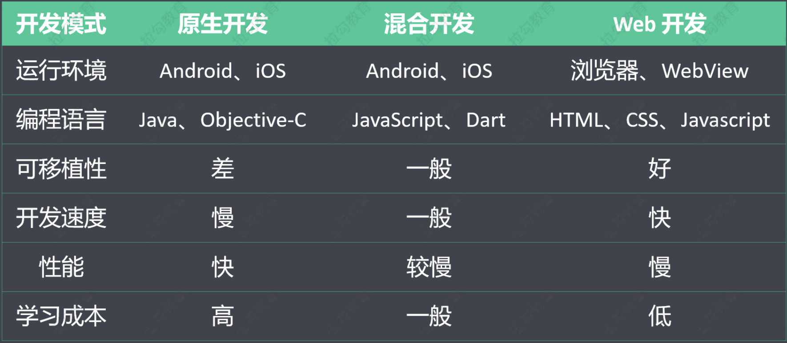
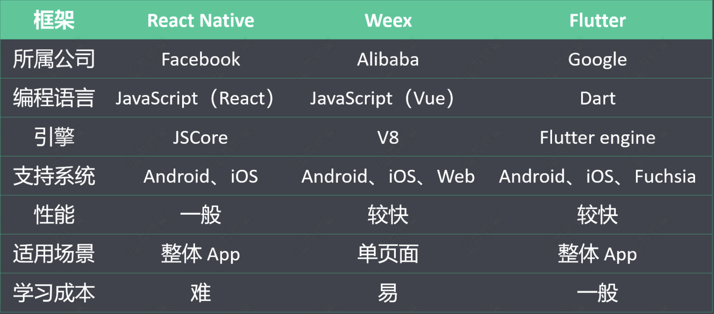

[TOC]

# flutter

# 概述

## 简介

Flutter 是谷歌开发的一款开源、免费的，基于 **Dart 语言**的移动 UI 框架，可以快速在 iOS 和 Android 上构建高质量的原生应用。 它最大的特点就是**跨平台**和**高性能**。

+ Dart 语言

  Dart 是由谷歌开发的计算机编程语言，它可以被用于 Web、服务器、移动应用和物联网等领域的 开发。Dart 诞生于 2011 年，号称要取代 JavaScript。

+ 跨平台

  良好的跨平台性，直接带来的好处就是减少开发成本。

  + 移动端
    + Android
    + iOS
  + Web
    + 各种浏览器
  + 桌面
    + Windows
    + Mac
  + 嵌入式平台
    + Linux
    + Fuchsia

+ 高性能

  Flutter 采用 GPU （图形显示）渲染技术，所以性能极高。Flutter 编写的应用是可以达到 120 fps（每秒传输帧数），这也就是说，它完全可以胜任游戏的制作。而 React Native 的性能只能达 到 60 fps。

## 发展历程

+ 2015，Flutter 在 Dart 开发者峰会上亮相 
+ 2018-6，Flutter 发布了首个预览版本 
+ 2018-12，Flutter 1.0 发布 
+ 2019-9，Flutter 1.9 发布，添加 Web 端支持 
+ 2020-9，Flutter 1.22 发布，带来了对 iOS 14 和 Android 11 的支持

## 主流框架对比

移动应用的三种开发模式

混合开发框架对比

## 成功案例

除了大量为适应快速发展节奏和节省人力成本的中小型企业，很多一线互联网企业也在重要项目中落地 了 Flutter 技术。第一个吃 Flutter 这只螃蟹的头部企业是阿里巴巴。阿里巴巴旗下的多款应用都使用了 Flutter。例如：咸鱼、淘宝特价版、盒马、优酷、飞猪等。另外，字节跳动内部的很多移动端应用，也 选中 Flutter。

## 资源网站

官网：https://flutter.dev/ 

Github: https://github.com/flutter/flutter 

中文网站： 

+ https://flutterchina.club/ 
+ https://flutter.cn/

## 环境搭建

[参考文档](https://flutter.cn/docs/get-started/install)