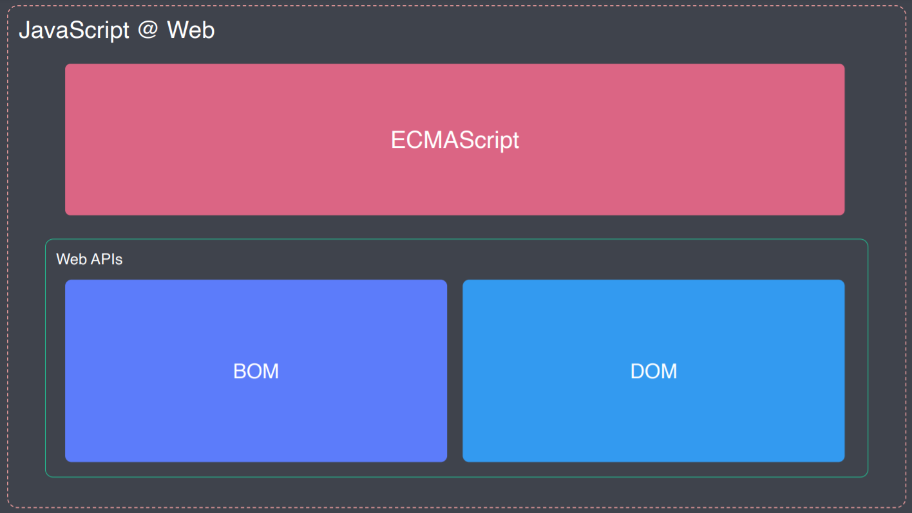
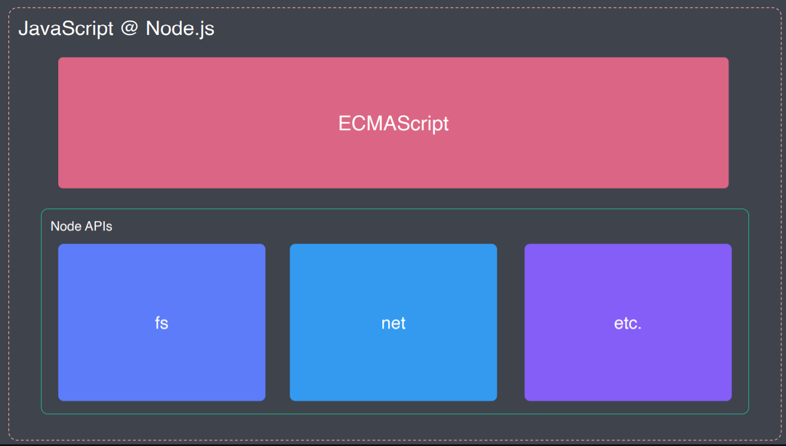
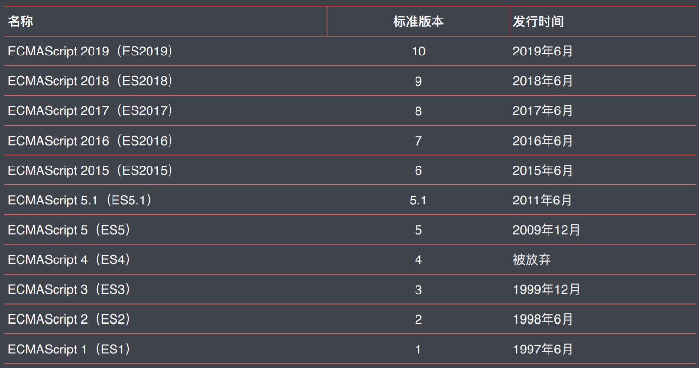
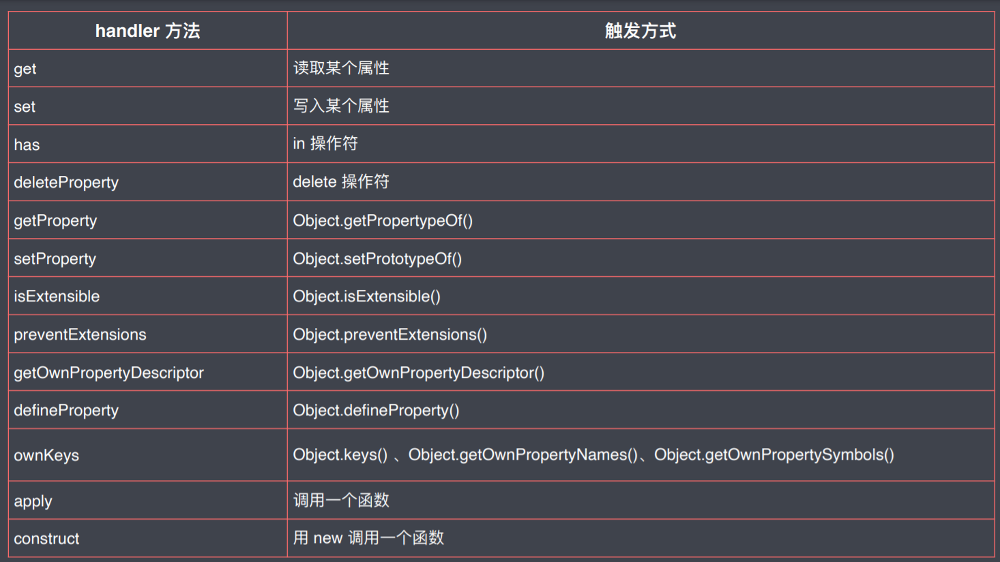

[TOC]

# ECMAScript新特性

## **ECMAScript和JavaScript的关系**

- ECMAScript（ES）是JavaScript的标准化规范

- JavaScript是ECMAScript的扩展语言

- ECMAScript只提供了最基本的语法

- JavaScript是遵循ECMAScript语法，并在此基础上进行了扩展

- - 使得我们在浏览器中可以去操作DOM和BOM



- - 使得我们在node环境中可以去读写文件等操作




## **ECMAScript发展史**

- 从ES5到ES2015大概6年时间内，添加的内容最多，这里着重学习
- ES5和ES2015可不是一回事，ES2015其实是ES6，是ES5的下一代
- 从ES2015后更习惯以年份命名：




## **ES2015（ES6）**

- 对原有语法进⾏增强
- 解决原有语法上的⼀些问题或者缺陷
- 全新的对象、全新的⽅法、全新的功能
- 全新的数据类型和数据结构


### let与块级作用域

- let 声明的成员只会在所声明的块中生效

```js
if (true) {
 // var foo = 'zce'
 let foo = 'zce'
 console.log(foo)
}
```

- 使用var容易导致变量覆盖

```js
// 使用var
for (var i = 0; i < 3; i++) {
 for (var i = 0; i < 3; i++) {
 console.log(i)
  }
 console.log('内层结束 i = ' + i)  // 内层只执行3x1=3次
}

// 使用let
for (var i = 0; i < 3; i++) {
 for (let i = 0; i < 3; i++) {
 console.log(i)
  }
 console.log('内层结束 i = ' + i)  // 内层执行3x3=9次
}
```

- 应用场景

```js
var elements = [{}, {}, {}] // 模拟DOM对象
for (var i = 0; i < elements.length; i++) {
 elements[i].onclick = function () {
 console.log(i)  // 异步，不点击不执行
  }
}
elements[2].onclick()
// 虽然每个DOM对象都被绑定了点击事件，但是点击事件的处理函数中要获取的值却是全局的

var elements = [{}, {}, {}]
for (var i = 0; i < elements.length; i++) {
 elements[i].onclick = (function (i) {
 return function () {
 console.log(i)
    }
  })(i)  // 利用闭包来解决，立即执行函数里面的i被缓存起来，最后return一个函数出去
}
elements[0].onclick()


var elements = [{}, {}, {}]
for (let i = 0; i < elements.length; i++) {  // 最方便的let生成块级作用域
 elements[i].onclick = function () {
 console.log(i)
  }
}
elements[0].onclick()
```

- 使用let时for循环会有两层作用域

```js
for (let i = 0; i < 3; i++) {
 let i = 'foo'
 console.log(i)
}

// 将for循环进行拆解可知，for循环形成了两层作用域
let i = 0 // for循环块本身的作用域

if (i < 3) { 
 let i = 'foo'  // 循环体的作用域
 console.log(i)
}

i++

if (i < 3) {
 let i = 'foo'
 console.log(i)
}

i++

if (i < 3) {
 let i = 'foo'
 console.log(i)
}

i++
```

- let 修复了变量提升现象

```js
console.log(foo)
var foo = 'zce' // undefind

console.log(foo)
let foo = 'zce' // 引用错误
```

- 不去删掉var的原因：
  保证之前用var的项目能正常运行。


### const

- 恒量声明过后不允许重新赋值

```js
const name = 'zce'
name = 'jack' // 报错
```

- 恒量要求声明同时赋

```js
const name
name = 'zce' // 报错
```

- 恒量只是要求内层指向不允许被修改，数据成员可以修改

```js
const obj = {}
obj = {} // 报错

obj.name = 'zce' // 对于数据成员的修改是没有问题的
```

- 其余特性等同let
- 最佳用法：不用var，主用const（更加明确使用的成员会不会被修改），配合使用let


### 数组的解构

- 提取对应`位置`的成员到对应位置的变量中 【根据位置进行提取】

```js
// 1. 示例：
const arr = [100, 200, 300]
const [foo, bar, baz] = arr
console.log(foo, bar, baz)

// 2. 如果只想提取指定位置的成员，需要保留之前成员的位置
const [, , baz] = arr
console.log(baz)

// 3. 可以使用...xxx的方式来接收剩余参数，并把剩余参数保存到名为xxx数组中
const [foo,...xxx] = arr
consolve.log(xxx)  // [200,300]

// 4. 注意此用法只能用到最后一个参数位置
const [foo,...xxx,bar] = arr
consolve.log(xxx)  // 报错：Rest element must be last element

// 5. 如果解构变量数组长度大于原数组长度，多出来的是undefined,如果小于就按顺序解构
const [foo, bar, baz, more] = arr
console.log(more) // undefind

// 6. 可以预先为解构的变量设置默认值，如果没有解构到值就用默认值，解构到了就覆盖默认值
const [foo, bar, baz = 123, more = 'default value'] = arr
console.log(bar, more)  // 200, default value
```

- 应用

```js
// 拆分一个字符串，并获取指定位置的值
// 原始做法：
const path = '/foo/bar/baz'
const tmp = path.split('/')  // 得到的是：[ '', 'foo', 'bar', 'baz' ]
const rootdir = tmp[1]

// 解构做法：
console.log(path.split('/'))
const [, rootdir] = path.split('/')
console.log(rootdir)
```

### 对象的解构

- 提取对应`属性名`的成员到同名变量中 【根据名称进行提取】

- - 对象内部数据是无序的，所以得用名称来对应

```js
// 对象解构
const obj = { name: 'zce', age: 18 }
const { name } = obj
```

- 如果解构作用域中存在了解构变量，可以使用重名名的方式避免冲突

```js
const obj = { name: 'zce', age: 18 }
const name = 'tom'
// const { name: objName } = obj  // 已存在name变量，导致冲突
const { name: objName } = obj	// 重命名的方式来避免冲突
console.log(objName)
```

- 可以设置默认值

```js
const obj = { uname: 'zce', age: 18 }
const name = 'tom'
const { name: objName = 'jack' } = obj	// jack  匹配不到就用默认值
console.log(objName)
```

- 应用

```js
// 提取某个对象中的某个属性（方法）
// 比如提取console对象中的log方法
const { log } = console
log('foo')
log('bar')
```


### 模板字符串

- 示例

```js
// 1. 反引号包裹
const str = `hello es2015, this is a string`

// 2. 允许换行【传统字符串得用/n表示换行】
const str = `hello es2015,
换行了`

// 3. 使用反斜杠\转义反引号就能打印出反引号
const str = `hello es2015,this is a \`string\``

// 4. 可以通过 ${} 插入表达式，表达式的执行结果将会输出到对应位置
const name = 'tom'
const msg = `hey, ${name} --- ${1 + 2} ---- ${Math.random()}`
console.log(msg)  // hey, tom --- 3 ---- 0.4648965397333502
```

- 带标签的模板字符串

```js
// 带标签的模板字符串

// 模板字符串的标签就是一个特殊的函数，
// 使用这个标签就是调用这个函数，这个log就是函数
// const str = console.log`hello world`

const name = 'tom'
const gender = false

function myTagFunc (strings, name, gender) { // 使用标签函数就得先定义这个标签函数
  // console.log(strings, name, gender)  // 
  // 第一个参数strings返回一个以变量为分隔符分割开元素放进数组中。['hey,','is a', '.']
  // return '123'
  const sex = gender ? 'man' : 'woman'
  return strings[0] + name + strings[1] + sex + strings[2] // 原本字符串
}

const result = myTagFunc`hey, ${name} is a ${gender}.`


console.log(result) // 接收到模板字符串中的两个插值

// 应用：实现中英文转换，查找非法字符
```


### 字符串的拓展方法

- 判断字符串中有没有的指定内容

```js
// 字符串的扩展方法
const message = 'Error: foo is not defined.'
console.log(
// startsWith 判断字符串开头有没有这个方法
  message.startsWith('Error')  // true
//  endsWith 判断字符串开头有没有这个方法
  message.endsWith('.')   // true
// includes 判断字符串中（包括开头和结尾）有么有对应的字符
  message.includes('foo')


    
```


### 参数的默认值

```js
// 函数参数的默认值

function foo (enable) {
  // 短路运算很多情况下是不适合判断默认参数的，例如 0 '' false null
  // enable = enable || true  // 假如这里enable取值是false作为参数，那么将识别不到，还是走true
  // 正确做法是用判断是否等于undefined（是否传入了值），如下
  enable = enable === undefined ? true : enable
  console.log('foo invoked - enable: ')
  console.log(enable)
}

// 如果有多个参数时，带默认参数的形参一定是在形参列表的最后
function foo (bar,enable = true) {
  console.log('foo invoked - enable: ')
  console.log(enable)
}

foo(false)
```


### ...运算符

1. 用作剩余参数

- 只能出现在形参的最后一位，而且只能使用一次，用来接收剩余参数

```js
// 剩余参数

// function foo () {
//   console.log(arguments)  arguments 是接收所有，是个伪数组
// }

function foo (first, ...args) {  // ...xxx  是接收剩余并保存到xxx数组中
  console.log(args)
}

foo(1, 2, 3, 4)
```

**2. 用作展开数组**

- 将数组中的参数展开传递给函数的几种方法

```js
// 索引
const arr = ['foo', 'bar', 'baz']
console.log(arr[0],arr[1],arr[2] )

// apply方法
console.log.apply(console, arr)

// 展开运算符
console.log(...arr)
```


### 箭头函数

- 使用：

```js
// 箭头函数

// function inc (number) {
//   return number + 1
// }

// 最简方式
// const inc = n => n + 1

// 完整参数列表，函数体多条语句，返回值仍需 return
const inc = (n, m) => {
  console.log('inc invoked')
  return n + 1
}

console.log(inc(100))

const arr = [1, 2, 3, 4, 5, 6, 7]

// arr.filter(function (item) {
//   return item % 2
// })

// 常用场景，回调函数
arr.filter(i => i % 2)
```

- 箭头函数中的this

```js
// 箭头函数与 this
// 箭头函数不会改变 this 指向

const person = {
  name: 'tom',
  // sayHi: function () {
  //   console.log(`hi, my name is ${this.name}`)
  // }
  sayHi: () => {
    console.log(`hi, my name is ${this.name}`)
  },
  sayHiAsync: function () {
    // const _this = this
    // setTimeout(function () {
    //   console.log(_this.name)
    // }, 1000)

    console.log(this)
    setTimeout(() => {
      // console.log(this.name)
      console.log(this)
    }, 1000)
  }
}

person.sayHiAsync()
```


### 对象字面量的增强

```js
// 对象字面量

const bar = '345'

const obj = {
  foo: 123,
  // bar: bar
  // 属性名与变量名相同，可以省略 : bar
  bar,
  // method1: function () {
  //   console.log('method111')
  // }
  // 方法可以省略 : function 改写如下：
  method1 () {
    console.log('method111')
    // 这种方法就是普通的函数，同样影响 this 指向。
    console.log(this)
  },
    
  // Math.random(): 123 // 不允许
  // 通过 [] 让表达式的结果作为属性名
  [bar]: 123
  [1+1]: '不知道'
  [Math.random]: '随机的属性名'
}

// obj[Math.random()] = 123

console.log(obj)
obj.method1()
```


### **Object.assign**

```js
// Object.assign 方法,将第二个参数及以后的资源对象覆盖到第一个参数的目标对象

// const source1 = {
//   a: 123,
//   b: 123
// }

// const source2 = {
//   b: 789,
//   d: 789
// }

// const target = {
//   a: 456,
//   c: 456
// }

// const result = Object.assign(target, source1, source2)

// console.log(target)
// console.log(result === target)  // true，返回的对象和目标对象其实是一个
// 所以修改返回的新对象，也会影响之前的目标对象，使用下面的方法即可

// 应用场景

function func (obj) {
  // obj.name = 'func obj'
  // console.log(obj)

  const funcObj = Object.assign({}, obj)
  funcObj.name = 'func obj'
  console.log(funcObj)
  console.log(funObj)
}

const obj = { name: 'global obj' }

func(obj)
console.log(obj)
// 也就是说assign方法时的第一个参数target目标对象就是assign的返回值对象，他们的索引是一个
```


### **Object.is()**

```js
// Object.is

console.log(
  // 0 == false              // => true
  // 0 === false             // => false
  // +0 === -0               // => true
  // NaN === NaN             // => false
  // Object.is(+0, -0)       // => false
  // Object.is(NaN, NaN)     // => true
)
```


### proxy

- 代理，**无论是拿数据还是存数据都要经过proxy【保安】**，类似于ES5中的Object.defineProperty数据劫持。【用来监视数据读写】

```js
// Proxy 对象
// 用get监听数据读取，用set监听数据更新

const person = { // 被代理的对象
  name: 'zce',
  age: 20
}

const personProxy = new Proxy(person, {
  // get 监视属性读取
  get (target, property) { // 被代理的目标对象，外部要访问的属性名
    return property in target ? target[property] : 'default'
    // console.log(target, property)
    // return 100
  },
    
  // set 监视属性设置
  set (target, property, value) {
    if (property === 'age') {
      if (!Number.isInteger(value)) {
        throw new TypeError(`${value} is not an int`)
      }
    }

    target[property] = value
    // console.log(target, property, value)
  }
})

// 会调用set ：
personProxy.age = 100
personProxy.gender = true

// 会调用get：
console.log(personProxy.name)
console.log(personProxy.xxx)
```

- proxy相较于Object.defineProperty的优势：

```js
//优势1：Proxy 可以监视读写以外的操作,比如删除操作 

const person = {
  name: 'zce',
  age: 20
}

const personProxy = new Proxy(person, {
  deleteProperty (target, property) {
    console.log('delete', property)
    delete target[property]
  }
})

delete personProxy.age
console.log(person)
```

可监视的操作如下：



```js
// 优势2：Proxy 可以很方便的监视数组操作
// Object.defineProperty是重写数组原型中的方法来实现的，来劫持数组方法的调用过程

const list = []

const listProxy = new Proxy(list, {
  set (target, property, value) {
    console.log('set', property, value) 
    target[property] = value
    return true // 表示设置成功
  }
})

listProxy.push(100)  // set 0 100
listProxy.push(100)  // set 1 100

// 优势3：Proxy 不需要侵入对象
// proxy不需要对对象进行修改，Object.defineProperty需要对对象中的属性进行操作
// proxy监听的是对象，Object.defineProperty监听的是对象中的属性，需要监听多次。

const person = {}

Object.defineProperty(person, 'name', {
  get () {
    console.log('name 被访问')
    return person._name
  },
  set (value) {
    console.log('name 被设置')
    person._name = value
  }
})
Object.defineProperty(person, 'age', {
  get () {
    console.log('age 被访问')
    return person._age
  },
  set (value) {
    console.log('age 被设置')
    person._age = value
  }
})

person.name = 'jack'

console.log(person.name)
```


### Reflect()

- 静态类，只能调用其静态方法，不能对其进行new 操作，类似于Math方法
- Reflect 内部封装了一系列对对象的底层操作
- Reflect中提供的方法和proxy处理对象中的方法名一样，其实就是proxy的内部实现

```js
// Reflect 对象
const obj = {
  foo: '123',
  bar: '456'
}

// 这里的get方法其实就是用Reflect实现的，虽然不是我们自己定义的，但是这对设计模式上也有着借鉴的作用
// 在我们实现自己的get或set方法时要先实现自己的监视逻辑，然后再使用Reflect对象对应的方法。
const proxy = new Proxy(obj, {
  get (target, property) {  
    console.log('watch logic~')
    return Reflect.get(target, property)  
  }
})
console.log(proxy.foo)
```

- 价值：提供了统一的一套用于操作对象的API，便于操作,如下：

```js
const obj = {
  name: 'zce',
  age: 18
}

// 传统方式：不断地去变换方式去操作对象，如下：
console.log('name' in obj)   // 用in 关键字
console.log(delete obj['age'])  // 用delete方法 
console.log(Object.keys(obj))	// 用Object的keys方法

// Reflect() 提供了一个统一用于操作对象的API，都是调用Reflect的方法
console.log(Reflect.has(obj, 'name'))
console.log(Reflect.deleteProperty(obj, 'age'))
console.log(Reflect.ownKeys(obj))
```


### Promise

- 详情见异步编程一章


### Class类

- 语法：

```js
// 传统方式
function Person (name) {
  this.name = name
}

Person.prototype.say = function () {
  console.log(`hi, my name is ${this.name}`)
}


// class 关键词，类的方式
class Person {
  constructor (name) {
    this.name = name
  }

  say () { // 写在了原型上
    console.log(`hi, my name is ${this.name}`)
  }
}

const p = new Person('tom')
p.say()
```

- 实例方法和静态方法

```js
// static 方法

class Person {
  constructor (name) {
    this.name = name
  }

  say () {
    console.log(`hi, my name is ${this.name}`)
  }

  static create (name) {  // 静态方法，类似于函子中的of方法
    return new Person(name)
  }
}

const tom = Person.create('tom')
tom.say()
```

- 类的继承

```js
// extends 继承
// 父类
class Person {
  constructor (name) {
    this.name = name
  }
  say () {
    console.log(`hi, my name is ${this.name}`)
  }
}


// 子类
class Student extends Person {  // extends用来继承父类的静态成员，super用来继承实例成员
  constructor (name, number) {
    super(name) // super指向父类的构造器，会在子类中执行父类的构造器，并且必须要写在下面的this代码前
// this的指向是谁调用指向谁。子类的构造函数中的this指向的是子类,相当于把父构造函数中的代码直接丢到子类构造器里由子类执行。
    this.number = number
  }
  hello () {
    super.say() // 调用父类成员，这里的 super 指向父类的原型对象
    console.log(`my school number is ${this.number}`)
  }
}

const s = new Student('jack', '100')
s.hello()
```


### Set

- 内容数据不重复，如果有重复则忽

```js
// Set 数据结构

const s = new Set()
// add方法会返回集合本身，所以可以链式调用,重复的数据就会被忽略
s.add(1).add(2).add(3).add(4).add(2) 
console.log(s)	// Set {1,2,3,4}

// 遍历
s.forEach(i => console.log(i))

for (let i of s) {
  console.log(i)
}

console.log(s.size)  // Set集合中的数据长度，等同数组的length

console.log(s.has(100))  // 是否存在，返回布尔值

console.log(s.delete(3))  // 删除集合中的值，返回布尔值，表示是否成功

s.clear()  // 清空Set集合
```

- 应用

```js
onst arr = [1, 2, 1, 3, 4, 1]

// const result = Array.from(new Set(arr))
const result = [...new Set(arr)]

console.log(result)  // [1,2,3,4]

// 弱引用版本 WeakSet
// 差异就是 Set 中会对所使用到的数据产生引用
// 即便这个数据在外面被消耗，但是由于 Set 引用了这个数据，所以依然不会回收
// 而 WeakSet 的特点就是不会产生引用，
// 一旦数据销毁，就可以被回收，所以不会产生内存泄漏问题。
```


### Map

- 对象的属性名（键）可以是其他任意数据类型，比如对象

```js
// 对象中以非字符串作为键名
const obj = {}
obj[true] = 'value'
obj[123] = 'value'
obj[{ a: 1 }] = 'value'

console.log(Object.keys(obj)) // ['123','true',[object,object]]
// 如果指定的键名不是字符串，那么以后在使用的时候会将toString的结果作为键
// 【所以对象只能使用字符串作为键】
console.log(obj['[object Object]'])


// Map 数据结构
const m = new Map()
const tom = { name: 'tom' }

m.set(tom, 90) // 为map设置键名和键值
console.log(m)
console.log(m.get(tom))

// m.has()	判断是否有这个这个键
// m.delete()	删除键
// m.clear()	清空键

m.forEach((value, key) => {
  console.log(value, key)  // value是被变遍历键的键值，key是键名
})


// 弱引用版本 WeakMap
// 差异就是 Map 中会对所使用到的数据产生引用
// 即便这个数据在外面被消耗，但是由于 Map 引用了这个数据，所以依然不会回收
// 而 WeakMap 的特点就是不会产生引用，
// 一旦数据销毁，就可以被回收，所以不会产生内存泄漏问题。
```


### Symbol

- 用来定义一个独一无二的值
- 应用场景：

```js
// 场景1：扩展对象，属性名冲突问题

// 传统方式

// shared.js ====================================

const cache = {}  // 共享的文件中的数据

// a.js =========================================

cache['a_foo'] = Math.random()  // a文件向共享文件中添加一个foo数据

// // b.js =========================================

cache['b_foo'] = '123'	// b 文件向共享文件中添加一个foo的数据，两个采用约定的方式命名


// symbol() 方式

const s = Symbol()
console.log(s)
console.log(typeof s)

// 两个 Symbol 永远不会相等

console.log(Symbol() === Symbol())  // false
console.log(Symbol('foo') === Symbol('foo'))  // false

// Symbol 描述文本
console.log(Symbol('foo'))  // Symbol(foo)
console.log(Symbol('bar'))  // Symbol(bar)
console.log(Symbol('baz'))  // Symbol(baz)

// 使用 Symbol 为对象添加用不重复的键

const obj = {}
obj[Symbol()] = '123'
obj[Symbol()] = '456'
console.log(obj)

// 也可以在计算属性名中使用

// const obj = {
//   [Symbol()]: 123
// }
// console.log(obj)


// 案例2：Symbol 模拟实现私有成员

// a.js ======================================

const name = Symbol()
const person = {
  [name]: 'zce',
  say () {
    console.log(this[name])
  }
}
// 只对外暴露 person

// b.js =======================================

// 由于无法创建出一样的 Symbol 值，
// 所以无法直接访问到 person 中的「私有」成员(因为创建不出一模一样的Symbol)
// person[Symbol()]
person.say()


// Symbol 全局注册表 for方法---------------------
// 以字符串为对应关系
const s1 = Symbol.for('foo')
const s2 = Symbol.for('foo')
console.log(s1 === s2)  // true

console.log( // 这样会转为字符串再比较
  Symbol.for(true) === Symbol.for('true')
)

// 内置 Symbol 常量防止和对象中的属性有冲突 ----------------
console.log(Symbol.iterator)
console.log(Symbol.hasInstance)

const obj = {  // 定义一个内置属性
  [Symbol.toStringTag]: 'XObject'
}
console.log(obj.toString())

// Symbol 属性名获取 ----------------------------------

const obj = {
  [Symbol()]: 'symbol value',
  foo: 'normal value'
}

for (var key in obj) {
  console.log(key)	// 获取不到
}
console.log(Object.keys(obj))
console.log(JSON.stringify(obj))

// 只能通过Symbol相关的方法来进行获取
// getOwnPropertySymbols只能获取Symbol相关的属性
console.log(Object.getOwnPropertySymbols(obj))
```


### for...of遍历

- 遍历任何数据，实现遍历的统一
- 用来调用数据的迭代接口拿到一个迭代器实现遍历
- 只要是实现了Iterable接口的对象都可以被for ... of 调用

```js
// for...of 循环

const arr = [100, 200, 300, 400]

for (const item of arr) {
  console.log(item)
}

// for...of 循环可以替代 数组对象的 forEach 方法

arr.forEach(item => {
  console.log(item)
})

for (const item of arr) { // item 就是遍历的值而不是下标，只有这一个参数
  console.log(item)
  if (item > 100) {
    break	// 可以终止遍历
  }
}

// forEach 无法跳出循环，必须使用 some 或者 every 方法返回true或者false终止遍历
// forEach 不会终止遍历
arr.forEach() // 不能跳出循环
arr.some()
arr.every()


// 也可以遍历非数组数据和伪数组，set对象
// 遍历 Set 与遍历数组相同

const s = new Set(['foo', 'bar'])

for (const item of s) {
  console.log(item)
}

// 遍历 Map 可以配合数组结构语法，直接获取键值

const m = new Map()
m.set('foo', '123')
m.set('bar', '345')

for (const [key, value] of m) {
  console.log(key, value) // 如果不解构set的键值会被存到一个数组中
}

// 普通对象不能被直接 for...of 遍历，因为默认没有实现 Symbol.iterator 接口，需要手动实现
const obj = { foo: 123, bar: 456 }

for (const item of obj) {
  console.log(item)  // 会报错
}
```


### 迭代器

- 可迭代接口就是可以被for...of循环访问的规格标准

- 实现Iterable接口就是for...of的前提

- 迭代器

- - 每个可迭代接口里面都有一个[Symbo.iterator]属性，这个属性是一个函数，这个函数的返回值是一个数组的**迭代器**对象，这个对象里面有个next方法，next方法指向的是数组的下一个元素，每调用一次next就会返回下一个对象【next就是个指针】


```js
// 迭代器（Iterator）

// 测试next()
const set = new Set(['foo', 'bar', 'baz'])

const iterator = set[Symbol.iterator]()

// console.log(iterator.next())
// console.log(iterator.next())
// console.log(iterator.next())
// console.log(iterator.next())
// console.log(iterator.next())

// 用while实现迭代器
while (true) {
  const current = iterator.next()
  if (current.done) {
    break // 迭代已经结束了，没必要继续了
  }
  console.log(current.value)
}
```

- 迭代接口

- - 用来返回迭代器
  - 实现next迭代接口

```js
// 实现可迭代接口（Iterable）示意版：
// 下面的这种结构就是约定的接口结构
const obj = {  // 第一层对象，实现可迭代接口Iterable，约定内部要有一个返回迭代器的iterator方法
  [Symbol.iterator]: function () {  // 返回一个迭代器对象iterator
    return {  // 迭代器对象iterator
      next: function () {  // next指针方法
        return {	// 返回一个iteration result
           value: 'zce',  // 当前被迭代到的数据，可以是任何数据类型
           done: true // 是否迭代停止，是否到了最后一个元素
         }
       }
     }
   }
 }


// 完整版可迭代接口：
const obj = {
  store: ['foo', 'bar', 'baz'],

  [Symbol.iterator]: function () {
    let index = 0
    const self = this

    return {
      next: function () {
        const result = {
          value: self.store[index],
          done: index >= self.store.length
        }
        index++  // 让指针移一位
        return result
      }
    }
  }
}

for (const item of obj) {
  console.log('循环体', item)
}
```

- - 迭代器的设计模式

  - - 目的是向外提供一个统一的遍历接口，而使调用者不必关心内部的数据结构

```js
// 迭代器设计模式

// 场景：你我协同开发一个任务清单应用

// 开发者代码 ===============================

const todos = {
  life: ['吃饭', '睡觉', '打豆豆'],
  learn: ['语文', '数学', '外语'],
  work: ['喝茶'],

  // 提供统一遍历访问接口
  each: function (callback) {
    const all = [].concat(this.life, this.learn, this.work)
    for (const item of all) {
      callback(item)
    }
  },

  // 提供迭代器（ES2015 统一遍历访问接口）
  [Symbol.iterator]: function () {
    const all = [...this.life, ...this.learn, ...this.work]
    let index = 0
    return {
      next: function () {
        return {
          value: all[index],
          done: index++ >= all.length
        }
      }
    }
  }
}


// 调用者代码 ===============================

    // 传统模式：
    // for (const item of todos.life) {
    //   console.log(item)
    // }
    // for (const item of todos.learn) {
    //   console.log(item)
    // }
    // for (const item of todos.work) {
    //   console.log(item)
    // }

// 调用迭代接口模式：
todos.each(function (item) {
  console.log(item)
})

console.log('-------------------------------')

for (const item of todos) {
  console.log(item)
}
```

- - 上例中的方法只适用于todos对象的这种数据结构，自己随便实现的。而ES2015中的迭代器是在语言层面上实现的迭代器模式，适用于任何数据结构，只需要我们实现Iterator方法。


### Generator生成器

- 基本用法

```js
// Generator 函数
 function * foo () {   //
   console.log('zce')
   return 100
 }

 const result = foo()
 consolve.log(result)  // Object [Generator] {}  生成器对象
 console.log(result.next())  // zce    [value: 100, done: true]


// 案例：
function * foo () {
  console.log('1111')
  yield 100
  console.log('2222')
  yield 200
  console.log('3333')
  yield 300
}

const generator = foo()

// 第一次调用，函数体开始执行，遇到第一个 yield 暂停
console.log(generator.next())  // 1111  {value: 100, done: true}

// 第二次调用，从暂停位置继续，直到遇到下一个 yield 再次暂停
console.log(generator.next()) // 2222  {value: 200, done: true}

// 第三次调用，从暂停位置继续，直到遇到下一个 yield 再次暂停
console.log(generator.next()) // 3333  {value: 300, done: true}

// 第四次调用，已经没有需要执行的内容了，所以直接得到 undefined
console.log(generator.next())  //   {value:undefind, done: false}

// 生成器函数执行后会返回一个生成器对象并不会立即执行内部的函数体，当我们调用这个对象的next方法才会让这个函数的函数体开始执行，一旦遇到了yield关键词就会被暂停下来，并且yield后面的值将会作为next方法返回对象的value值返回。惰性执行，调用一次执行一次。
```

- 应用场景

- - 实现发号器：

```js
// Generator 应用

// 案例1：发号器

function * createIdMaker () {
  let id = 1
  while (true) {
    yield id++
  }
}

const idMaker = createIdMaker()

console.log(idMaker.next().value)
console.log(idMaker.next().value)
console.log(idMaker.next().value)
console.log(idMaker.next().value)

// 案例2：使用 Generator 函数实现 iterator 方法

const todos = {
  life: ['吃饭', '睡觉', '打豆豆'],
  learn: ['语文', '数学', '外语'],
  work: ['喝茶'],
    
  [Symbol.iterator]: function * () {
    const all = [...this.life, ...this.learn, ...this.work]
    for (const item of all) {
      yield item
    }
  }
}

for (const item of todos) { // 整item就是迭代器结果IterationResult中的value值
  console.log(item)
}
```


### ES Module

- 详情见模块化开发一章


### ES2016

- 数组的includes方法

```js
// 之前的indexOf方法： 判断数组中有没有这个数据，有就返回0没有返回-1
const arr = ['foo',1,NaN, false]
console.log(arr.indexOf('foo'))
console.log(arr.indexOf('bar'))
console.log(arr.indexOf(NaN))  // 不能识别NaN，会返回-1


// includes方法：判断是否含有，可以识别NaN，并返回布尔值表示是否含有
console.log(arr.includes(NaN))
```

- 指数运算符

```js
// 之前的指数运算：
console.log(Math.pow(2,10))  // 表示2的十次幂   1024

// ES2016新增指数运算符 **
console.log(2**10)  // 1024
```


### ES2017

- Object 对象的拓展方法

- - Object.values 方法

```js
const obj = {foo: 'value1', bar: 'value2'}

// 返回所有对象中所有值组成的数组
console.log(Object.values(obj))  // ['value1','value2']

// 之前的Object.keys方法时返回所有对象中所有键名组成的数组
console.log(Object.values)  // ['foo','bar']
```

- - Object.entries 方法

```js
// 把对象中的键值对保存到数组中，以该数组作为元素保存到一个数组中
const obj = {foo: 'value1', bar: 'value2'}
console.log(Object.entries(obj))  // [['foo','value1'], ['bar','value2']]

// 应用：作为Map对象的参数
let m = new Map(Object.entries(obj))
console.log(m) // Map {'foo' => 'value', 'bar' => 'value2'}
console.log(m.get('foo'));
```

- - Object.getOwnPropertyDescriptors 方法

```js
// 获取一个对象的所有自身属性的描述符。
const p1 = {
  firstName: 'Edward',
  lastName: 'Chen',
  get fullName () {
    return this.firstName + ' ' + this.lastName
  }
}

// console.log(p1.fullName) // 'Edward Chen'

// const p2 = Object.assign({}, p1)
// p2.firstName = 'Hua'
// console.log(p2) // 'Edward Chen'

const descriptors = Object.getOwnPropertyDescriptors(p1)
// console.log(descriptors)
const p2 = Object.defineProperties({}, descriptors)
p2.firstName = 'Hua'
console.log(p2.fullName)	// 'Hua Chen'
```

+ String 对象的拓展方法
  + String.prototype.padStart / String.prototype.padEnd

```js
// padStart 和 padEnd 方法用另一个字符串填充当前字符串(如果需要的话，会重复多次)，以便产生的字符串达到给定的长度。从当前字符串的左侧/右侧开始填充。主要用于对齐文本。
const books = {
  html: 5,
  css: 16,
  javascript: 128
}

// for (const [name, count] of Object.entries(books)) {
//   console.log(name, count)
// }

for (const [name, count] of Object.entries(books)) {
  console.log(`${name.padEnd(16, '-')}|${count.toString().padStart(3, '0')}`)
}
/*
	html------------|005
	css-------------|016
	javascript------|128
*/
```

+ 在函数参数中添加尾逗号

```js
// 主要用于方便编辑器使用 alt+↑/alt+↓ 移动参数位置，以及添加新参数时不需要先输入逗号。但并不影响任何实际功能层面的东西。
function foo (
  bar,
  baz,
) {

}
```

+ Async/Await

  详情见异步编程一章


