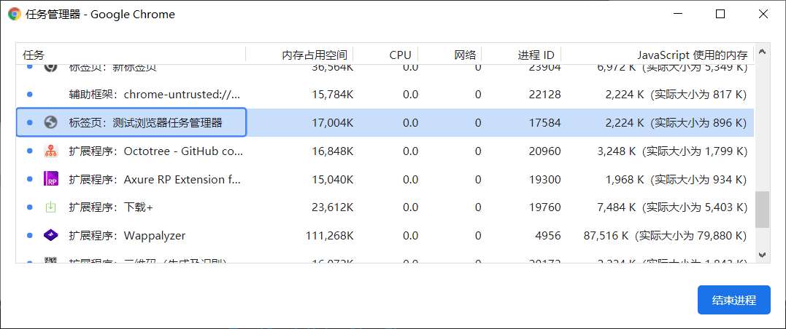

[TOC]

# JavaScript性能优化

## **内存管理**

- 必要性

```js
function fn() {
    arrList = []
    arrList[100000] = 'lg is a coder'
}
fn()
// 会开辟大量的内存空间
```

性能曲线如下：


内存管理：

- 内存：由可读写单元组成，表示一片可操作的空间
- 管理：人为的去操作一片空间的申请、使用、释放
- 内存管理：开发者主动去申请空间、释放空间
- 管理流程：申请——使用——释放
- ECMAScript并没有提供内存管理操作的API，所以JS不能像C、C++那样主动去调用
  API完成内存的管理，但是JS也是可以演示内存的生命周期的。

内存空间生命周期演示：

```js
// 申请：
let obj = {}

// 使用，读写操作
obj.name = 'lg'

// 释放
obj = null
```


## **垃圾回收机制**

### 什么是垃圾

- js中内存管理是自动的
- 对象不再被引用时是垃圾
- 对象不能从根上访问到时是垃圾

### 可达性

- 可以访问到的对象就是可达对象（通过具体的引用、当前上下文的作用域链）
- 可达标准是从根出发是否能被找到
- JS中的根可以理解为全局变量对象

引用和可达性：

```js
// 示例1
let obj = {name: 'xiaoming'}
let a = obj
obj = null  // obj 断开与对象之间的引用，但是a没有断开，所以对象仍然是可达的
// 示例2
function objGroup (obj1,obj2){
    obj1.next = obj2
    obj2.prev = obj1
    return {
        o1:obj1,
        o2:obj2
    }
}
let obj = objGroup({name:'obj1'}, {name: 'obj2'})
console.log(obj) 
// {o1: {…}, o2: {…}}
// o1: {name: "obj1", next: {…}}   // 此处... 为循环引用
// o2: {name: "obj2", prev: {…}}
```

所以引用和变量之间的关系是：


如果断开了o1对obj1的引用和o2中Prev对obj1的引用断开掉，那么关系如下：


那么此时obj1就是访问不到的对象，所以他就是垃圾。


### **常见的GC算法**

- GC（Garbage Collection）就是垃圾回收机制的简写
- GC可以找到内存中的垃圾、并释放和回收空间
- 什么是垃圾：

```js
// 1. 程序中不再需要使用的对象
function fn() {
  name = 'lg'  // 没用关键字声明
  console.log(`${name} is a coder`)  // 用完之后name就不再需要了,就应该被当做垃圾回收
}
fn() 

// 2. 程序中不能再访问到的对象
function fn() {
  const name = 'lg'  // 用关键字声明，就导致外部使用不到他，所以函数执行完也应该被回收
  console.log(`${name} is a coder`)
}

fn() 

```

- 什么是GC算法：

- - GC是一种机制，垃圾回收器完成具体的工作
  - 工作的内容就是查找垃圾释放空间、回收空间
  - 算法就是工作时查找和回收所遵循的规则

- 常见的GC算法：

- - 引用计数
  - 标记清除
  - 标记整理
  - 分代回收

- 

### 引用计数算法

- 核心思想：设置引用数，判断当前引用数是否为0
- 引用计数器
- 引用关系改变时修改引用数字
- 引用数字为0时立即回收

```js
const user1 = {age: 11}
const user2 = {age: 22}
const user3 = {age: 33}
const nameList = [user1.age, user2.age,user3.age]

function fn() {
  const num1 = 1
  const num2 = 2
}

fn()  // fn执行后，函数中的num1和num2从外部根出发就找不到了引用就是0了，所以就是垃圾会被回收掉
```

- 优缺点：

- - 发现垃圾时立即回收

  - 较快的释放空间（引用为0就释放），最大限度减少程序暂停

  - 无法回收循环引用的对象

    ```js
    function fn() {
     const obj1 = {}
     const obj2 = {}
     obj1.name = obj2
     obj2.name = obj1
     return 'over'
    }
    fn()
    ​
    // 这里面由于obj1中存在着对obj2的引用，obj2中也存在着对obj1的引用，所以计数不为0无法释放
    ```

  - 时间开销大（需要维护引用数值的变化，引入了计数器）

  - 

### 标记清除算法

- 核心思想：分标记和清除两个阶段完成
- 标记阶段：遍历所有对象找标记活动对象（递归查找，标记活动的、可达的对象）
- 清除阶段：遍历所有对象清除没有标记的对象，同时把第一次遍历所做的标记抹掉
- 把回收的空间放到空闲列表上面，方便后续程序申请空间使用
- 原理：


- 优缺点

- - 可以解决循环引用的对象
  - 地址不连续，空间碎片化
  - 不会立即回收垃圾对象


### 标记整理算法

- 是标记清除的增强
- 标记阶段的操作和标记清除算法的一致
- 清除阶段会先执行整理，移动对象位置，然后确保空间连续再清除


- 优缺点：

- - 确保空间连续再清除
  - 不会立即回收垃圾对象


### **V8引擎的垃圾回收**

- 认识V8引擎：

- - 即时编译，直接将源码转换成机器码来执行（之前是将源码转换成字节码）
  - 内存设上限 （64位 1.5G，32位 800M）【原因是太大了再回收会导致回收时间过长】


- V8垃圾回收策略

  

- 采用分代回收的思想

- 内存分为新生代、老生代

- 针对不同对象采用不同算法

- - 分代回收
  - 空间复制
  - 标记清除
  - 标记整理
  - 标记增量


### V8回收新生代存储

- V8内存空间一分为二
- 小空间用于存储新生代对象（64位：32M | 32位：16M）
- 新生代指的是存活时间较短的对象（局部作用域中的变量，函数执行完了就回收）

下图白色部分就是新生代存储


- 回收过程采用复制算法 + 整理标记
- 新生代内存区分为两个等大小空间
- 使用空间为From，空闲空间为To
- 所有对象存储于From空间（包括活动对象和非活动对象）
- 当From空间应用到一定程度后会触发GC机制【标记整理后（保证空间连续）】将活动对象拷贝至To
- From完成释放（From和To交换空间）

回收细节说明：

1. 拷贝过程中可能出现晋升
2. 晋升就是讲新生代对象移动至老生代：

- 一轮GC还存活的新生代需要晋升
- To空间的使用率超过25%需要晋升至老生代（To空间会越来越多，不晋升就放不下了）


### V8回收老生代存储

- 老生代对象存放在右侧老生代区域

- 64位限制1.4G，32位限制700M

- 老生代对象就是指存活时间较长的对象（全局变量，闭包）

- 实现过程：

- - 主要采用标记清除、标记整理、增量标记算法
  - 首先使用标记清除完成垃圾空间的回收（快速释放）
  - 采用标记整理进行空间优化（当新生代晋升老生代时，同时也发现老生代空间不够存新生代晋升过来的，就会进行标记整理空间优化）
  - 采用增量标记进行效率优化（将标记过程分段进行）

- 增量标志优化垃圾回收

- - 垃圾回收会阻塞程序执行

- 

- 使用增量标记将垃圾回收分段执行，使得垃圾回收和程序执行交替执行，避免长时间的程序阻塞空档期（比如标记可以分段标记，第一次标记一层，第二次标记下一层）


### 新老回收对比

- 新生代区域的垃圾回收使用空间换时间，新生代空间较小（复制算法）
- 老生代区域垃圾回收不适合复制算法（空间大，复制消耗太大）


### 新老总结

- 内存设上限 （64位 1.5G，32位 800M）【原因是太大了再回收会导致回收时间过长】

- V8垃圾回收策略

- - 采用分代回收的思想
  - 内存分为新生代、老生代
  - 针对不同对象采用不同算法


## **Performance工具**

- 通过Performance可以实时监控内存变化

- 使用步骤：

- - 输入目标网址
  - 进入开发者工具，选择Performance
  - 开启录制功能，访问具体页面
  - 执行用户行为，结束后停止录制
  - 勾选 `Memory` 选项，查看并分析截面汇总记录的内存信息

### **内存问题的外在表现**

- 页面出现延迟加载或经常性暂停（频繁的垃圾回收）
- 页面持续性出现糟糕的性能（内存膨胀，分配的内存超过机器能力）
- 页面的性能随时间延长越来越差（内存泄漏）


### 界定内存问题的标准

- 内存泄漏：内存使用持续升高，越来越高

- 内存膨胀：

- - 在多数设备上都存在性能问题，可能是代码写的问题
  - 个别设备存在性能问题就可能是本身硬件不支持，比如当前应用需要向硬件索取10M的内存，但是当前硬件只能提供8M

- 频繁垃圾回收：通过内存变化图进行分析

  

### 监控方式

- 浏览器任务管理器（用来查看有没有问题，比如实际内存一直增大）

- - shift+Esc
  - 右击可以调出JavaScript使用的内存
  - 比如创建DOM时会导致实际大小增大
  - 如果内存和JavaScript使用内存不断增大就表示有问题
  - 用于判断脚本内存是否异常，但是很难定位异常出现的位置



- TImeline时序图记录

- - 内存监控：走势应该有升有降（用点击事件后添加DOM结构来模拟的）
  - 时间节点监控：用来看哪个位置出现的问题


- 堆块照查找分离DOM（分离DOM存在是一种内存泄漏）

- - DOM节点状态

  - - 界面元素存活在DOM树上
    - 垃圾对象时的DOM节点（不在页面上显示，也不在js内存中，内存中没有对其的引用。）
    - 分离状态的DOM节点（不在页面上显示，但是存活在js内存中，内存中保留对其的引用。）

+ 利用堆快照找到分离的DOM
  + 测试代码：

```js
<button id = 'btn'> Add </button> 
...
var temp
function fn() {
 var ul document.createElement('ul')
 for (var i =0; i<10; i++) {
 var li = document.createElement('li')
 ul.appendChild(li)
    }
 temp = ul
 // temp = null  置空后就可以解决分离DOM导致的内存泄露了
}

document.getElementById('btn').addEventListener('click',fn)
```


+ Detached HTMLElement 就是分离DOM，需要被优化，将不用的DOM置空


- 判断是否存在频繁的垃圾回收

  + GC工作时应用程序是停止的，会被阻塞

  + 频繁且过长的GC会导致应用假死

  + 用户使用中感知应用卡顿

  + 判断：

    + Timeline中频繁的上升和下降

    - 任务管理器中数据的增加减小（不断的增大减小）


### **Performance总结**

- 使用流程
- 内存问题的相关分析
- Performance时序图监控内存变化
- 任务管理器监控内存变化
- 堆快照查找分离DOM


## **代码优化介绍**

### **Benchmark.js的使用**

- 已经不维护了，换成JSBench

- 可以使用基于Benchmark.js的网站完成：[https://jsperf.com](https://link.zhihu.com/?target=https%3A//jsperf.com/)

- 使用流程：

- - 使用github登录
  - 填写个人信息（非必须）
  - 填写详细的测试用例信息（title、slug）
  - 填写准备代码（DOM操作时经常使用）
  - 填写必要有setup与teardown代码
  - 填写测试代码片段


### **JSBench的使用**

- Setup HTML 和 Setup Javascript 可以做一些初始化工作（例如初始的DOM结构），teardown JavaScript 可以做一些拆卸收尾工作（例如断开数据库连接、统一调用函数）。
- Test Case 可以输入多个测试用例，建议分别取名为 before 和 after，分别输入优化前的代码和优化后的代码，最后是teardown JavaScript 运行测试用例，输入函数调用即可。
- 点击 RUN 即可开始运行测试代码。
- 测试时不要打开多个标签页，不要最小化挂起（因为浏览器是多线程的，防止多个标签页抢占资源）。


### **慎用全局变量**

- 所有作用域链的顶端，所以会比较耗时，尽量放在局部作用域
- 全局执行上下文一直存在于上下文执行栈中，知道程序退出，比较占用内存
- 不利于GC机制，耗内存
- 全局变量命名污染


### **缓存全局变量**

- 将使用中无法避免的全局变量混存到局部中（比如document）

```html
<body>
  <input type="button" value="btn" id="btn1">
  <input type="button" value="btn" id="btn2">
  <input type="button" value="btn" id="btn3">
  <input type="button" value="btn" id="btn4">
  <p>1111</p>
  <input type="button" value="btn" id="btn5">
  <input type="button" value="btn" id="btn6">
  <p>222</p>
  <input type="button" value="btn" id="btn7">
  <input type="button" value="btn" id="btn8">
  <p>333</p>
  <input type="button" value="btn" id="btn9">
  <input type="button" value="btn" id="btn10">

  <script>
    function getBtn() {  // 没有缓存document
      let oBtn1 = document.getElementById('btn1')
      let oBtn3 = document.getElementById('btn3')
      let oBtn5 = document.getElementById('btn5')
      let oBtn7 = document.getElementById('btn7')
      let oBtn9 = document.getElementById('btn9')
    }

    function getBtn2() {  // 缓存了document
      let obj = document
      let oBtn1 = obj.getElementById('btn1')
      let oBtn3 = obj.getElementById('btn3')
      let oBtn5 = obj.getElementById('btn5')
      let oBtn7 = obj.getElementById('btn7')
      let oBtn9 = obj.getElementById('btn9')
    }
  </script>

</body>
```


### **通过原型新增方法来替代构造函数中新增方法**

```js
// 把方法定义在实例上
var fn1 = function() {
  this.foo = function() {
    console.log(11111)
  }
}

let f1 = new fn1()


// 把方法定义在原型上
var fn2 = function() {}
fn2.prototype.foo = function() {
  console.log(11111)
}

let f2 = new fn2()
```


### **避开闭包陷阱（容易内存泄漏）**

- 外部对内部有引用
- 外部访问内部作用域的数据
- 闭包使用不当容易出现内存泄露
- 不要为了闭包而闭包

```js
function foo() {
  var el = document.getElementById('btn')
  el.onclick = function (){
    console.log(el.id);
  }
  // el = null
}
foo()
// 当界面中的DOM结构被删除后，代码里面的引用也要断开，让引用计数归0，从而让GC进行内存回收。
```


### **避免属性访问方法使用**

- JS不需要属性访问的方法，所有属性都是外部可见的
- 使用属性访问方法只会增加一层重定义，没有访问控制力

示例：

```js
// 通过属性访问函数访问：（封装性好，但是执行效率没有直接访问快）
function Person() {
  this.name = 'icoder'
  this.age = 18
  this.getAge = function() {
    return this.age
  }
}

const p1 = new Person()
const a = p1.getAge()


// 直接访问
function Person() {
  this.name = 'icoder'
  this.age = 18
}
const p2 = new Person()
const b = p2.age
```


### **for循环优化**

- 优化1

```js
// 缓存长度 正向遍历
for (var i =0,len = arr.length; i< len; i++){
    console.log(i)
}

// 缓存长度 逆向遍历
for (var i = arrList.length; i; i--) {
  console.log(arrList[i])
}
```


### **选择最优的循环方法**

```js
var arrList = new Array(1, 2, 3, 4, 5)

// forEach 遍历	最优！
arrList.forEach(function(item) {
  console.log(item)
})

// for 遍历	次之！
for (var i = arrList.length; i; i--) {
  console.log(arrList[i])
}

// for in 遍历  最差！
for (var i in arrList) {
  console.log(arrList[i])
}
```


### **节点添加优化**

- 优化回流和重绘导致性能开销
- 使用文档碎片方式：文档碎片是指

示例：

```html
<body>
  <script>
    // 原始方法
    for (var i = 0; i < 10; i++) {
      var oP = document.createElement('p')
      oP.innerHTML = i 
      document.body.appendChild(oP)
    }
      
    // 使用文档碎片的方式 
    // createDocumentFragment()当需要添加多个dom元素时，如果先将这些元素添加到DocumentFragment中，再统一将DocumentFragment添加到页面，会减少页面渲染dom的次数，效率会明显提升
    const fragEle = document.createDocumentFragment()
    for (var i = 0; i < 10; i++) {
      var oP = document.createElement('p')
      oP.innerHTML = i 
      fragEle.appendChild(oP)
    }
    document.body.appendChild(fragEle)
  </script>
</body>
```


### **克隆优化节点操作**

- 当我们想向页面中新增某一DOM时，我们可以克隆已经存在的DOM来实现新增
- 这种方法优势是可以复用已经存在的DOM元素的样式和属性，不用二次添加

```html
<body>
  <p id="box1">old</p>
  <script>
    // 传统新增
    for (var i = 0; i < 3; i++) {
      var oP = document.createElement('p')
      oP.innerHTML = i 
      document.body.appendChild(oP)
    }
      
    // 克隆操作完成新增
    var oldP = document.getElementById('box1')
    for (var i = 0; i < 3; i++) {
      var newP = oldP.cloneNode(false)  
      newP.innerHTML = i 
      document.body.appendChild(newP)
    }
 // var dupNode = node.cloneNode(deep); 是否采用深度克隆,如果为true,则该节点的所有后代节点也都会被克隆,如果为false,则只克隆该节点本身.默认
  </script>
</body>
```


### **直接量替换new Object**

```js
var a = [1, 2, 3] // 性能更好
var a1 = new Array(3)
a1[0] = 1
a1[1] = 2
a1[2] = 3
```


### **减少判断层级**

```js
// 优化前：if嵌套方式
function doSomething (part, chapter) {
    const parts = ['ES2016','工程化', 'Vue', 'React', 'Node']
    if (part) {
        if(parts.includes(part)) {
            console.log('属于当前课程')
        }
        if(chapter > 5) {
            console.log('您需要提供VIP身份')
        }
    }else {
        console.log('请确认模块信息')
    }
}

doSomething('ES2016', 6)

// 优化后：
function doSomething (part, chapter) {
    const parts = ['ES2016','工程化', 'Vue', 'React', 'Node']
    if (!part) {
        console.log('请确认模块信息')
        return
    }
    
    if(!parts.includes(part)) return 
    console.log('属于当前课程')
    
    if(chapter > 5) {
    	console.log('您需要提供VIP身份')
    }
}

doSomething('ES2016', 6)
// 如果有明确的对应关系的判断，比如case值为1时做什么，case值为2做什么... 类似这种最好用switch
```


### **减少作用域链查找层级**

```js
// 空间换时间
// 会查找到全局作用域，但是节省了空间，因为没有开辟多余的变量
var name1 = 'jelly'

function foo () {
    name1 = 'jelly'	// 没用关键字声明
    function baz () {
        var age = 20
        console.log(age);
        console.log(name1);
    }
    baz()
}

foo()

// 不会查找到全局作用域，节省了时间，但是开辟了空间，更快更占用内存
var name1 = 'jelly'

function foo () {
    var name1 = 'jelly'	// 用关键字声明，从baz查找是到此为止不会再去全局找
    function baz () {
        var age = 20
        console.log(age);
        console.log(name1);
    }
    baz()
}

foo()
```


### **减少数据的读取次数**

```html
// 空间换时间

<div id='skip' class='skip'> </div>

// 不缓存DOM对象
<script>
	var oBox = document.getElementById('skip')
    function hasEle (ele,cls) {   // 判断某个DOM节点有没有某个类名
        return ele.className = cls
    }
    console.log(hasEle(oBox, 'skip'))
</script>

// 缓存DOM对象,更快更占用内存
<script>
	var oBox = document.getElementById('skip')
    function hasEle (ele,cls) {   
        var clsname = ele.className		// 对要使用的DOM对象进行缓存
        return clsName = cls
    }
    console.log(hasEle(oBox, 'skip'))
</script>
```


### **字面量与构造式**

```js
// 构造式
// 引用类型
var test = () =>{
    let obj = new Object()  
    obj.name = 'zce'
}

// 基本类型
var str2 = new String('hello jelly')

// 字面量式
// 引用类型
var test = () => {
    let obj = {
        name: 'zce'
    }
}
// 基本类型
var str1 = 'hello jelly'
// 经测试，都是字面量更快，更好性能，基本数据类型差距更明显
```


### **减少循环体中的活动**

```js
// 不缓存长度			速度最慢
var test = () => {
   var i
   var arr = ['zce',38,'hello']
   for (i=0; i<arr.length;i++) {
      console.log(arr[i])
   }
}

var test = () => {
	// 缓存长度 正向遍历		速度次之
	var len = arr.length
	for (var i =0; i< len; i++){
    console.log(i)
	}
}


// 使用while循环，反向遍历		速度最快
var test = () => {
	var len = arr.length
	while (len--) {
    console.log(arr[len])
	}
}
```


### **事件委托**

```html
<body>
    <ul id="ul">
        <li>jelly</li>
        <li>25</li>
        <li>hello</li>
    </ul>
    <script>
        // 为每个li添加点击事件
        
        // 常规循环
        var list = document.querySelectorAll('li')

        function showTxt (e) {
            console.log(e.target.innerHTML);
        }
        for (let item of list) {    // 为每个li添加点击事件
            item.onclick = showTxt
        }
        
         // 事件委托，性能更好
        var ul = document.getElementById('ul')
        ul.addEventListener('click',showTxt,true)
        function showTxt (e) {
            let obj = e.target	
            if (obj.nodeName.toLowerCase() ==='li'){	// 判断当前子节点是不是li
                console.log(obj.innerHTML)
            }
        }
    </script>
</body>
```

