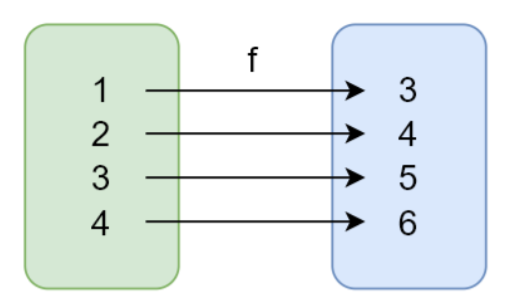
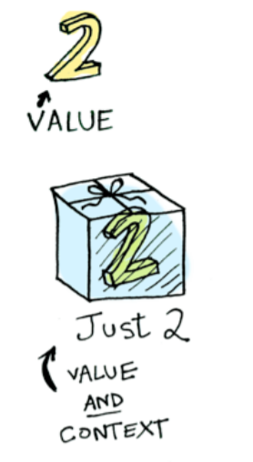

[TOC]

# 函数式编程

## 为什么要学习函数式编程

函数式编程是非常古老的一个概念，早于第一台计算机的诞生，[函数式编程的历史](https://zhuanlan.zhihu.com/p/24648375?refer=marisa)。 

那我们为什么现在还要学函数式编程？ 

+ 函数式编程是随着 React 的流行受到越来越多的关注 

+ Vue 3也开始拥抱函数式编程 

+ 函数式编程可以抛弃 this 

+ 打包过程中可以更好的利用 tree shaking 过滤无用代码 

+ 方便测试、方便并行处理 

+ 有很多库可以帮助我们进行函数式开发：lodash、underscore、ramda

  

## 什么是函数式编程

函数式编程(Functional Programming, FP)，FP 是编程范式之一，我们常听说的编程范式还有面向过程 编程、面向对象编程。

+ 面向对象编程的思维方式：把现实世界中的事物抽象成程序世界中的类和对象，通过封装、继承和 多态来演示事物事件的联系 
+ 函数式编程的思维方式：把现实世界的事物和事物之间的联系抽象到程序世界（对运算过程进行抽 象）
  + 程序的本质：根据输入通过某种运算获得相应的输出，程序开发过程中会涉及很多有输入和 输出的函数
  +  x -> f(联系、映射) -> y，y=f(x) 
  + **函数式编程中的函数指的不是程序中的函数(方法)**，而是数学中的函数即映射关系，例如：y = sin(x)，x和y的关系 
  + **相同的输入始终要得到相同的输出(纯函数)** 
  + 函数式编程用来描述数据(函数)之间的映射

```js
// 非函数式
let num1 = 2
let num2 = 3
let sum = num1 + num2
console.log(sum)
// 函数式
function add(n1, n2) {
  return n1 + n2
}
let sum = add(2, 3)
```


## 前置知识

+ 函数是一等公民 
+ 高阶函数 
+ 闭包


### 函数是一等公民

+ 函数可以存储在变量中 
+ 函数作为参数 
+ 函数作为返回值

在 JavaScript 中**函数就是一个普通的对象** (可以通过 `new Function()` )，我们可以把函数存储到变量/ 数组中，它还可以作为另一个函数的参数和返回值，甚至我们可以在程序运行的时候通过 `new Function('alert(1)')` 来构造一个新的函数。

+ 把函数赋值给变量

  ```js
  // 把函数赋值给变量
  let fn = function () {
    console.log('Hello First-class Function')
  }
  fn()
  // 一个示例
  const BlogController = {
    index(posts) {
      return Views.index(posts)
    },
    show(post) {
      return Views.show(post)
    },
    create(attrs) {
      return Db.create(attrs)
    },
    update(post, attrs) {
      return Db.update(post, attrs)
    },
    destroy(post) {
      return Db.destroy(post)
    },
  }
  // 优化
  const BlogController = {
    index: Views.index,
    show: Views.show,
    create: Db.create,
    update: Db.update,
    destroy: Db.destroy,
  }
  ```

+ 函数是一等公民是我们后面要学习的高阶函数、柯里化等的基础。

  

### 高阶函数

+ 高阶函数 (Higher-order function

  + 可以把函数作为参数传递给另一个函数 
  + 可以把函数作为另一个函数的返回结果

+ 函数作为参数

  ```js
  // forEach
  function forEach(array, fn) {
    for (let i = 0; i < array.length; i++) {
      fn(array[i])
    }
  }
  // filter
  function filter(array, fn) {
    let results = []
    for (let i = 0; i < array.length; i++) {
      if (fn(array[i])) {
        results.push(array[i])
      }
    }
    return results
  }
  ```

+ 函数作为返回值

  ```js
  function makeFn() {
    let msg = 'Hello function'
    return function () {
      console.log(msg)
    }
  }
  const fn = makeFn()
  fn()
  
  // once
  function once(fn) {
    let done = false
    return function () {
      if (!done) {
        done = true
        return fn.apply(this, arguments)
      }
    }
  }
  let pay = once(function (money) {
    console.log(`支付：${money} RMB`)
  })
  // 只会支付一次
  pay(5)
  pay(5)
  pay(5)
  ```

  

**使用高阶函数的意义**

+ 抽象可以帮我们屏蔽细节，只需要关注与我们的目标
+ 高阶函数是用来抽象通用的问题

```js
// 面向过程的方式
let array = [1, 2, 3, 4]
for (let i = 0; i < array.length; i++) {
  console.log(array[i])
}
// 高阶高阶函数
let array = [1, 2, 3, 4]
forEach(array, (item) => {
  console.log(item)
})
let r = filter(array, (item) => {
  return item % 2 === 0
})
```

**常用高阶函数**

+ forEach 
+ map 
+ filter 
+ every 
+ some 
+ find/findIndex 
+ reduce
+ sort
+ ……

```js
const map = (array, fn) => {
  let results = []
  for (const value of array) {
    results.push(fn(value))
  }
  return results
}
const every = (array, fn) => {
  let result = true
  for (const value of array) {
    result = fn(value)
    if (!result) {
      break
    }
  }
  return result
}
const some = (array, fn) => {
  let result = false
  for (const value of array) {
    result = fn(value)
    if (result) {
      break
    }
  }
  return result
}
```


### 闭包

+ 闭包 (Closure)：函数和其周围的状态(词法环境)的引用捆绑在一起形成闭包。

  + 可以在另一个作用域中调用一个函数的内部函数并访问到该函数的作用域中的成员

    ```js
    // 函数作为返回值
    function makeFn() {
      let msg = 'Hello function'
      return function () {
        console.log(msg)
      }
    }
    const fn = makeFn()
    fn()
    // once
    function once(fn) {
      let done = false
      return function () {
        if (!done) {
          done = true
          return fn.apply(this, arguments)
        }
      }
    }
    let pay = once(function (money) {
      console.log(`支付：${money} RMB`)
    })
    // 只会支付一次
    pay(5)
    pay(5)
    
    ```

+ 闭包的本质：函数在执行的时候会放到一个执行栈上当函数执行完毕之后会从执行栈上移除，**但是 堆上的作用域成员因为被外部引用不能释放**，因此内部函数依然可以访问外部函数的成员

+ 闭包案例

  ```js
  // 生成计算数字的多少次幂的函数
  function makePower(power) {
    return function (x) {
      return Math.pow(x, power)
    }
  }
  let power2 = makePower(2)
  let power3 = makePower(3)
  
  console.log(power2(4))
  console.log(power3(4))
  
  // 第一个数是基本工资，第二个数是绩效工资
  function makeSalary(x) {
    return function (y) {
      return x + y
    }
  }
  let salaryLevel1 = makeSalary(1500)
  let salaryLevel2 = makeSalary(2500)
  console.log(salaryLevel1(2000))
  console.log(salaryLevel1(3000))
  ```

  

## 纯函数

+ **纯函数：相同的输入永远会得到相同的输出**，而且没有任何可观察的副作用

  + 纯函数就类似数学中的函数(用来描述输入和输出之间的关系)，y = f(x)

    

+ lodash 是一个纯函数的功能库，提供了对数组、数字、对象、字符串、函数等操作的一些方法

+ 数组的 `slice` 和 `splice `分别是：纯函数和不纯的函数 `slice `返回数组中的指定部分，不会改变原数组 `splice `对数组进行操作返回该数组，会改变原数组

  ```js
  let numbers = [1, 2, 3, 4, 5]
  // 纯函数
  numbers.slice(0, 3)
  // => [1, 2, 3]
  numbers.slice(0, 3)
  // => [1, 2, 3]
  numbers.slice(0, 3)
  // => [1, 2, 3]
  // 不纯的函数
  numbers.splice(0, 3)
  // => [1, 2, 3]
  numbers.splice(0, 3)
  // => [4, 5]
  numbers.splice(0, 3)
  // => []
  ```

+ 函数式编程不会保留计算中间的结果，所以变量是不可变的（无状态的） 

+ 我们可以把一个函数的执行结果交给另一个函数去处理


**纯函数的好处**

+ 可缓存

  + 因为纯函数对相同的输入始终有相同的结果，所以可以把纯函数的结果缓存起来

    ```js
    const _ = require('lodash')
    function getArea(r) {
      return Math.PI * r * r
    }
    let getAreaWithMemory = _.memoize(getArea)
    console.log(getAreaWithMemory(4))
    ```

+ 自己模拟一个 memoize 函数

  ```js
  function memoize(f) {
    let cache = {}
    return function () {
      let arg_str = JSON.stringify(arguments)
      cache[arg_str] = cache[arg_str] || f.apply(f, arguments)
      return cache[arg_str]
    }
  }
  ```

+ 可测试 

  + 纯函数让测试更方便

+ 并行处理 

  + 在多线程环境下并行操作共享的内存数据很可能会出现意外情况 
  + 纯函数不需要访问共享的内存数据，所以在并行环境下可以任意运行纯函数 (Web Worker)


**副作用**

+ 纯函数：对于相同的输入永远会得到相同的输出，而且没有任何可观察的**副作用**

  ```js
  // 不纯的
  let mini = 18
  function checkAge(age) {
    return age >= mini
  }
  // 纯的(有硬编码，后续可以通过柯里化解决)
  function checkAge(age) {
    let mini = 18
    return age >= mini
  }
  ```

副作用让一个函数变的不纯(如上例)，纯函数的根据相同的输入返回相同的输出，如果函数依赖于外部 的状态就无法保证输出相同，就会带来副作用。

副作用来源： 

+ 配置文件
+ 数据库
+ 获取用户的输入
+ ……

所有的外部交互都有可能带来副作用，副作用也使得方法通用性下降不适合扩展和可重用性，同时副作 用会给程序中带来安全隐患给程序带来不确定性，但是副作用不可能完全禁止，尽可能控制它们在可控 范围内发生。


## 柯里化 (Haskell Brooks Curry)

+ 使用柯里化解决上一个案例中硬编码的问题

  ```js
  function checkAge(age) {
    let min = 18
    return age >= min
  }
  // 普通纯函数
  function checkAge(min, age) {
    return age >= min
  }
  checkAge(18, 24)
  checkAge(18, 20)
  checkAge(20, 30)
  // 柯里化
  function checkAge(min) {
    return function (age) {
      return age >= min
    }
  }
  // ES6 写法
  let checkAge = (min) => (age) => age >= min
  let checkAge18 = checkAge(18)
  let checkAge20 = checkAge(20)
  checkAge18(24)
  checkAge18(20)
  ```

+ 柯里化 (Currying)：

  + 当一个函数有多个参数的时候先传递一部分参数调用它（这部分参数以后永远不变） 
  + 然后返回一个新的函数接收剩余的参数，返回结果


**lodash 中的柯里化函数**

+ `_.curry(func)`

  + 功能：创建一个函数，该函数接收一个或多个 func 的参数，如果 func 所需要的参数都被提 供则执行 func 并返回执行的结果。否则继续返回该函数并等待接收剩余的参数。
  + 参数：需要柯里化的函数
  + 返回值：柯里化后的函数

  ```js
  const _ = require('lodash')
  // 要柯里化的函数
  function getSum(a, b, c) {
    return a + b + c
  }
  // 柯里化后的函数
  let curried = _.curry(getSum)
  // 测试
  curried(1, 2, 3)
  curried(1)(2)(3)
  curried(1, 2)(3)
  ```

+ 案例

  ```js
  const _ = require('lodash')
  const match = _.curry(function (reg, str) {
    return str.match(reg)
  })
  const haveSpace = match(/\s+/g)
  const haveNumber = match(/\d+/g)
  console.log(haveSpace('hello world'))
  console.log(haveNumber('25$'))
  const filter = _.curry(function (func, array) {
    return array.filter(func)
  })
  console.log(filter(haveSpace, ['John Connor', 'John_Donne']))
  const findSpace = filter(haveSpace)
  console.log(findSpace(['John Connor', 'John_Donne']))
  ```

+ 模拟 `_.curry()` 的实现

  ```js
  function curry(func) {
    return function curriedFn(...args) {
      // 判断实参和形参的个数
      if (args.length < func.length) {
        return function () {
          return curriedFn(...args.concat(Array.from(arguments)))
        }
      }
      // 实参和形参个数相同，调用 func，返回结果
      return func(...args)
    }
  }
  ```


**总结**

+ 柯里化可以让我们给一个函数传递较少的参数得到一个已经记住了某些固定参数的新函数 
+ 这是一种对函数参数的'缓存' 让函数变的更灵活，
+ 让函数的粒度更小 
+ 可以把多元函数转换成一元函数，可以组合使用函数产生强大的功能


## 函数组合

+ 纯函数和柯里化很容易写出洋葱代码 `h(g(f(x)))` 

  + 获取数组的最后一个元素再转换成大写字母，` _.toUpper(_.first(_.reverse(array)))`

    

+ 函数组合可以让我们把细粒度的函数重新组合生成一个新的函数


## 管道

下面这张图表示程序中使用函数处理数据的过程，给 fn 函数输入参数 a，返回结果 b。可以想想 a 数据 通过一个管道得到了 b 数据。


当 fn 函数比较复杂的时候，我们可以把函数 fn 拆分成多个小函数，此时多了中间运算过程产生的 m 和 n。 

下面这张图中可以想象成把 fn 这个管道拆分成了3个管道 f1, f2, f3，数据 a 通过管道 f3 得到结果 m，m 再通过管道 f2 得到结果 n，n 通过管道 f1 得到最终结果 b


```js
fn = compose(f1, f2, f3)
b = fn(a)
```


## 函数组合

+ 函数组合 (compose)：如果一个函数要经过多个函数处理才能得到最终值，这个时候可以把中间 过程的函数合并成一个函数 
  + 函数就像是数据的管道，函数组合就是把这些管道连接起来，让数据穿过多个管道形成最终 结果
  + **函数组合默认是从右到左执行**

```js
// 组合函数
function compose(f, g) {
  return function (x) {
    return f(g(x))
  }
}
function first(arr) {
  return arr[0]
}
function reverse(arr) {
  return arr.reverse()
}
// 从右到左运行
let last = compose(first, reverse)
console.log(last([1, 2, 3, 4]))
```

+ lodash 中的组合函数 
+ lodash 中组合函数 flow() 或者 flowRight()，他们都可以组合多个函数
+ flow() 是从左到右运行 
+ flowRight() 是从右到左运行，使用的更多一些

```js
const _ = require('lodash')
const toUpper = (s) => s.toUpperCase()
const reverse = (arr) => arr.reverse()
const first = (arr) => arr[0]
const f = _.flowRight(toUpper, first, reverse)
console.log(f(['one', 'two', 'three']))
```

+ 模拟实现 lodash 的 flowRight 方法

```js
// 多函数组合
function compose(...fns) {
  return function (value) {
    return fns.reverse().reduce(function (acc, fn) {
      return fn(acc)
    }, value)
  }
}
// ES6
const compose =
  (...fns) =>
  (value) =>
    fns.reverse().reduce((acc, fn) => fn(acc), value)
```

+ 函数的组合要满足**结合律** (associativity)：

  + 我们既可以把 g 和 h 组合，还可以把 f 和 g 组合，结果都是一样的

  ```js
  // 结合律（associativity）
  let f = compose(f, g, h)
  let associative = compose(compose(f, g), h) == compose(f, compose(g, h))
  // true
  ```

+ 所以代码还可以像下面这样

  ```js
  const _ = require('lodash')
  // const f = _.flowRight(_.toUpper, _.first, _.reverse)
  // const f = _.flowRight(_.flowRight(_.toUpper, _.first), _.reverse)
  const f = _.flowRight(_.toUpper, _.flowRight(_.first, _.reverse))
  console.log(f(['one', 'two', 'three']))
  // => THREE
  ```

  

**调试**

+ 如何调试组合函数

  ```js
  const f = _.flowRight(_.toUpper, _.first, _.reverse)
  console.log(f(['one', 'two', 'three']))
  ```

  ```js
  const _ = require('lodash')
  const trace = _.curry((tag, v) => {
    console.log(tag, v)
    return v
  })
  const split = _.curry((sep, str) => _.split(str, sep))
  const join = _.curry((sep, array) => _.join(array, sep))
  const map = _.curry((fn, array) => _.map(array, fn))
  const f = _.flowRight(
    join('-'),
    trace('map 之后'),
    map(_.toLower),
    trace('split 之后'),
    split(' ')
  )
  console.log(f('NEVER SAY DIE'))
  ```

+ lodash/fp

  + lodash 的 fp 模块提供了实用的对**函数式编程友好**的方法 
  + 提供了不可变 **auto-curried iteratee-first data-last** 的方法

  ```js
  // lodash 模块
  const _ = require('lodash')
  _.map(['a', 'b', 'c'], _.toUpper)
  // => ['A', 'B', 'C']
  _.map(['a', 'b', 'c'])
  // => ['a', 'b', 'c']
  _.split('Hello World', ' ')
  // lodash/fp 模块
  const fp = require('lodash/fp')
  fp.map(fp.toUpper, ['a', 'b', 'c'])
  fp.map(fp.toUpper)(['a', 'b', 'c'])
  fp.split(' ', 'Hello World')
  fp.split(' ')('Hello World')
  ```

  ```js
  const fp = require('lodash/fp')
  const f = fp.flowRight(fp.join('-'), fp.map(_.toLower), fp.split(' '))
  console.log(f('NEVER SAY DIE'))
  ```

  


## Point Free

我们可以把数据处理的过程定义成与数据无关的合成运算，不需要用到代表数据的那个参 数，只要把简单的运算步骤合成到一起，在使用这种模式之前我们需要定义一些辅助的基本运算函数

+ 不需要指明处理的数据 

+ **只需要合成运算过程** 
+ 需要定义一些辅助的基本运算函数

```js
const f = fp.flowRight(fp.join('-'), fp.map(_.toLower), fp.split(' '))
```

+ 案例演示

  ```js
  // 非 Point Free 模式
  // Hello World => hello_world
  function f(word) {
    return word.toLowerCase().replace(/\s+/g, '_')
  }
  // Point Free
  const fp = require('lodash/fp')
  const f = fp.flowRight(fp.replace(/\s+/g, '_'), fp.toLower)
  console.log(f('Hello World'))
  ```

+ 使用 Point Free 的模式，把单词中的首字母提取并转换成大写

  ```js
  const fp = require('lodash/fp')
  const firstLetterToUpper = fp.flowRight(join('. '),
  fp.map(fp.flowRight(fp.first, fp.toUpper)), split(' '))
  console.log(firstLetterToUpper('world wild web'))
  // => W. W. W
  ```


## Functor (函子)

到目前为止已经已经学习了函数式编程的一些基础，但是我们还没有演示在函数式编程中如何把副作用 控制在可控的范围内、异常处理、异步操作等。


**什么是 Functor**

+ 容器：包含值和值的变形关系(这个变形关系就是函数) 

+ 函子：是一个特殊的容器，通过一个普通的对象来实现，该对象具有 map 方法，map 方法可以运 行一个函数对值进行处理(变形关系)

  

**Functor 函子**

```js
// 一个容器，包裹一个值
class Container {
  // of 静态方法，可以省略 new 关键字创建对象
  static of(value) {
    return new Container(value)
  }
  constructor(value) {
    this._value = value
  }
  // map 方法，传入变形关系，将容器里的每一个值映射到另一个容器
  map(fn) {
    return Container.of(fn(this._value))
  }
}
// 测试
Container.of(3)
  .map((x) => x + 2)
  .map((x) => x * x)
```

+ 总结

  + 函数式编程的运算不直接操作值，而是由函子完成
  + 函子就是一个实现了 map 契约的对象
  + 我们可以把函子想象成一个盒子，这个盒子里封装了一个值
  + 想要处理盒子中的值，我们需要给盒子的 map 方法传递一个处理值的函数（纯函数），由这 个函数来对值进行处理
  + 最终 map 方法返回一个包含新值的盒子（函子）

+ 在 Functor 中如果我们传入 null 或 undefined

  ```js
  // 值如果不小心传入了空值(副作用)
  Container.of(null)
  .map(x => x.toUpperCase())
  // TypeError: Cannot read property 'toUpperCase' of null
  ```


**MayBe 函子**

+ 我们在编程的过程中可能会遇到很多错误，需要对这些错误做相应的处理 

+ MayBe 函子的作用就是可以对外部的空值情况做处理（控制副作用在允许的范围）

  ```js
  class MayBe {
    static of(value) {
      return new MayBe(value)
    }
    constructor(value) {
      this._value = value
    }
    // 如果对空值变形的话直接返回 值为 null 的函子
    map(fn) {
      return this.isNothing() ? MayBe.of(null) : MayBe.of(fn(this._value))
    }
    isNothing() {
      return this._value === null || this._value === undefined
    }
  }
  // 传入具体值
  MayBe.of('Hello World').map((x) => x.toUpperCase())
  // 传入 null 的情况
  MayBe.of(null).map((x) => x.toUpperCase())
  // => MayBe { _value: null }
  ```

+ 在 MayBe 函子中，我们很难确认是哪一步产生的空值问题，如下例：

  ```js
  MayBe.of('hello world')
  .map(x => x.toUpperCase())
  .map(x => null)
  .map(x => x.split(' '))
  // => MayBe { _value: null }
  ```

  

**Either 函子**

+ Either 两者中的任何一个，类似于 if...else...的处理 

+ 异常会让函数变的不纯，Either 函子可以用来做异常处理

  ```js
  class Left {
    static of(value) {
      return new Left(value)
    }
    constructor(value) {
      this._value = value
    }
    map(fn) {
      return this
    }
  }
  class Right {
    static of(value) {
      return new Right(value)
    }
    constructor(value) {
      this._value = value
    }
    map(fn) {
      return Right.of(fn(this._value))
    }
  }
  ```

+ Either 用来处理异常

  ```js
  function parseJSON(json) {
    try {
      return Right.of(JSON.parse(json))
    } catch (e) {
      return Left.of({ error: e.message })
    }
  }
  let r = parseJSON('{ "name": "zs" }').map((x) => x.name.toUpperCase())
  console.log(r)
  ```


**IO 函子**

+  IO 函子中的 _value 是一个函数，这里是把函数作为值来处理 
+ IO 函子可以把不纯的动作存储到 _value 中，延迟执行这个不纯的操作(惰性执行)，包装当前的操 作纯 
+ 把不纯的操作交给调用者来处理

```js
const fp = require('lodash/fp')
class IO {
  static of(x) {
    return new IO(function () {
      return x
    })
  }
  constructor(fn) {
    this._value = fn
  }
  map(fn) {
    // 把当前的 value 和 传入的 fn 组合成一个新的函数
    return new IO(fp.flowRight(fn, this._value))
  }
}
// 调用
let io = IO.of(process).map((p) => p.execPath)
console.log(io._value())
```


**Task 异步执行**

+ 异步任务的实现过于复杂，我们使用 folktale 中的 Task 来演示

+ folktale 一个标准的函数式编程库

  + 和 lodash、ramda 不同的是，他没有提供很多功能函数
  + 只提供了一些函数式处理的操作，例如：compose、curry 等，一些函子 Task、Either、 MayBe 等

  ```js
  const { compose, curry } = require('folktale/core/lambda')
  const { toUpper, first } = require('lodash/fp')
  // 第一个参数是传入函数的参数个数
  let f = curry(2, function (x, y) {
    console.log(x + y)
  })
  f(3, 4)
  f(3)(4)
  // 函数组合
  let f = compose(toUpper, first)
  f(['one', 'two'])
  ```

+ Task 异步执行

  + folktale(2.3.2) 2.x 中的 Task 和 1.0 中的 Task 区别很大，1.0 中的用法更接近我们现在演示的 函子
  + 这里以 2.3.2 来演示

  ```js
  const { task } = require('folktale/concurrency/task')
  function readFile(filename) {
    return task((resolver) => {
      fs.readFile(filename, 'utf-8', (err, data) => {
        if (err) resolver.reject(err)
        resolver.resolve(data)
      })
    })
  }
  // 调用 run 执行
  readFile('package.json')
    .map(split('\n'))
    .map(find((x) => x.includes('version')))
    .run()
    .listen({
      onRejected: (err) => {
        console.log(err)
      },
      onResolved: (value) => {
        console.log(value)
      },
    })
  ```


**Pointed 函子**

+ Pointed 函子是实现了 of 静态方法的函子 
+ of 方法是为了避免使用 new 来创建对象，更深层的含义是 of 方法用来把值放到上下文 Context（把值放到容器中，使用 map 来处理值）



```js
class Container {
  static of(value) {
    return new Container(value)
  }
  ……
}
Contanier.of(2).map((x) => x + 5)

```


**Monad（单子）**

在使用 IO 函子的时候，如果我们写出如下代码：

```js
const fs = require('fs')
const fp = require('lodash/fp')
let readFile = function (filename) {
  return new IO(function () {
    return fs.readFileSync(filename, 'utf-8')
  })
}
let print = function (x) {
  return new IO(function () {
    console.log(x)
    return x
  })
}
// IO(IO(x))
let cat = fp.flowRight(print, readFile)
// 调用
let r = cat('package.json')._value()._value()
console.log(r)
```

+ Monad 函子是可以变扁的 Pointed 函子，IO(IO(x)) 
+ 一个函子如果具有 join 和 of 两个方法并遵守一些定律就是一个 Monad

```js
const fp = require('lodash/fp')
// IO Monad
class IO {
  static of(x) {
    return new IO(function () {
      return x
    })
  }
  constructor(fn) {
    this._value = fn
  }
  map(fn) {
    return new IO(fp.flowRight(fn, this._value))
  }
  join() {
    return this._value()
  }
  flatMap(fn) {
    return this.map(fn).join()
  }
}
let r = readFile('package.json').map(fp.toUpper).flatMap(print).join()
```

