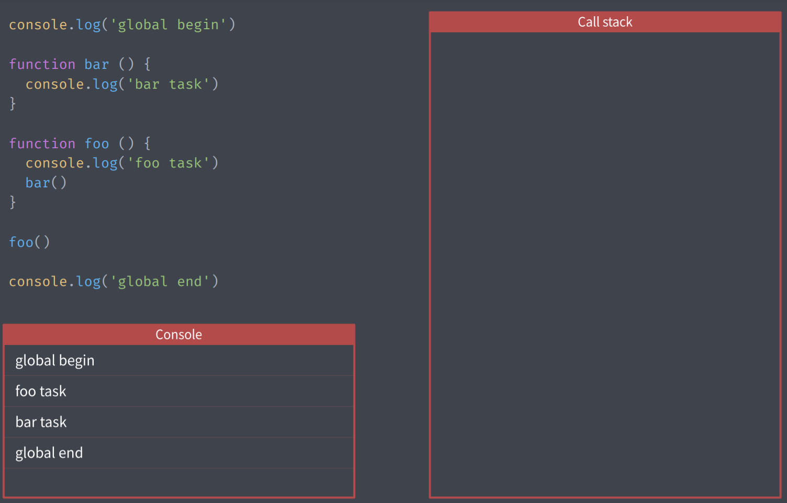
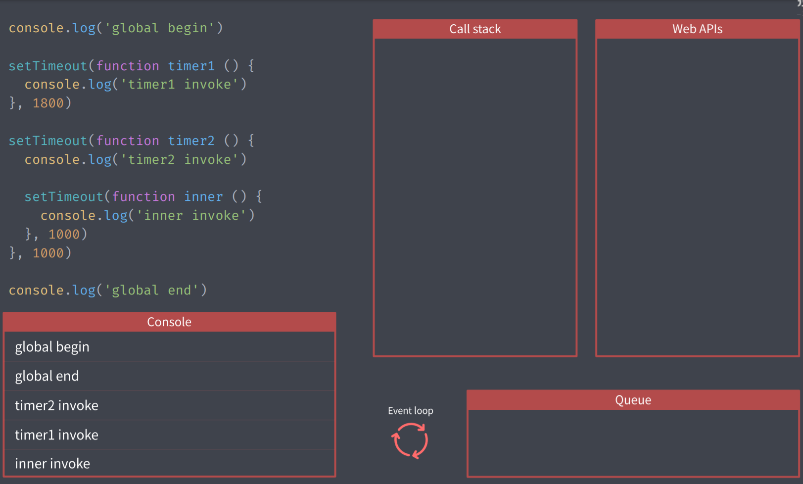
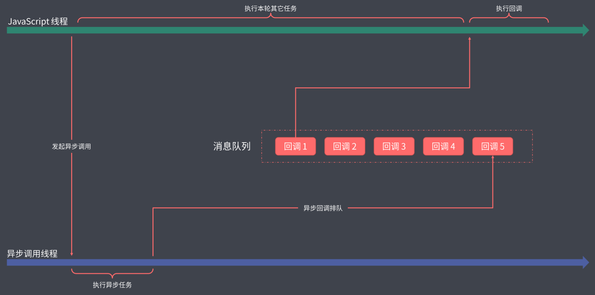

[TOC]

# 异步编程

## **同步模式与异步模式**

### **概述**

- JavaScript单线程工作模式原因：
  运行浏览器的脚本语言需要进行页面的交互，交互必然要操作DOM，DOM操作必须要单线程，否则会导致线程工作冲突产生线程同步问题（比如一个线程修改了DOM一个线程删除了DOM，此时浏览器就不知道以哪个为准）。所以JS执行环境中负责执行代码的线程只有一个
- 这种模式有优点也有缺点，优点就是简单，不会产生多线程冲突。缺点就是容易阻塞，耗时任务会阻塞后续代码。
- JS中将代码的执行模式分成了两种，一种是同步模式一种是异步模式。


### **同步模式**

- 即代码依此执行，执行顺序等同于我们的书写顺序
- 代码执行会将一个匿名函数压入栈进行开始调用，这个匿名函数包含着当前文档中的所有代码
- 函数的声明、变量的声明没有入栈操作

案例：



函数执行会进行压入栈操作，图中右侧call stack，调用结束（不存在闭包的前提下）后会弹出栈，同步模式下按代码的书写顺序执行，但容易导致阻塞。


### **异步模式**

- 不去等待当前这个任务执行结束再开始下一个任务，可以避免阻塞现象。但是代码的执行顺序比较混乱。
- 意义：单线程的js可以去执行大量耗时的任务

### 事件循环与消息队列

- setTimeout也会有压栈操作，并借助WebAPIs形成一个计时器，倒计时结束后就进入宏任务队列排队
- EventLoop的作用就是监听消息队列中的任务，是同步队列和异步队列中间的枢纽。





同步和异步不是以我们写代码的方式来决定的，而是运行环境提供的API是以同步还是异步模式工作来决定的。耗时的任务总得去等，只不过不是我们js线程去等，而是让浏览器提供的API来为我们去等。


## **异步编程的几种方式**

### **1. 回调函数**

- 由调用者定义，执行者执行的函数就是回调函数。

示例：

```js
function foo(callback) {
  setTimeout(() => {
    callback()
  }, 3000)
}

foo(function () {
  console.log('这是回调函数')
})
```

回调函数嵌套层级过多将产生回调地狱，不利于代码的编写和阅读。


### **2. Promise**

- 为了解决回调地狱，引入Promise。
- Promise有三种状态Pending、Fulfilled、Rejected，其中Fulfilled和Rejected是结果，一旦状态改变到达结果后就不会再变了。到达Fulfilled和Rejected后都会有相应的回调作为响应，分别是onFulfilled和onRejected。

Promise基本示例：

```js
const promise = new Promise((resolve, reject) => {
  resolve('成功的回调')
  reject(new Error('失败的回调'))  // 这个不会执行，状态一旦改变就不会执行了
})
​
promise.then(value => {
  console.log(value)
}, error => {
  console.log(error);
})
```


#### promise案例——简版ajax

```js
function ajax(url) {
  return new Promise((resolve, reject) => {
      let xhr = new XMLHttpRequest()
      xhr.open('GET', url)
      xhr.responseType = 'json'
      xhr.onload = function () {
          if (xhr.status === 200) {
              resolve(xhr.responseText)
          }else{
              reject(new Error(xhr.statusText))
          }
      }
      xhr.send()
  })
}
​
ajax('./api.json').then((value) =>{
  console.log(value);
})
```

- xhr.responseType = 'JSON' 这是H5新增的方法，能接受返回的结果为JSON类型。
- xhr.onload 相当于onreadystatuechange中的status ==400.


#### Promise链式调用

要时用链式调用来代替promise的嵌套调用

- promise通过.then后返回一个全新的promise对象，新的promise对象的状态取决于上一个promise的状态
- 如果不断地调用then方法，这里的每一个then方法都是**为**上一个then方法返回的promise对象提供一个状态明确后的回调
- 我们也可以在then方法中手动返回一个promise对象，这样一来下面的then的中接收到的就是这个promise对象的状态改变后的回调了，then中的回调函数的参数就是这个promise最终的执行结果，所以这样就可以通过链式调用then，并且then中不断return新的promise来实现多个异步任务链式调用执行来避免嵌套了。
- 前面的then方法中回调函数的返回值会作为后面then方法回调的参数。
- 如果上一个then中return的不是一个promise，那么下一个then中的回调参数中接收到的就是这个非promise值。
- 如果上一个没有返回任何值，那么下一个then中的回调函数的参数接收的就是undefined


#### promise 异常处理

- 在promise中抛出异常（比如调用了不存在的函数啥的或者手动抛出一个异常），这种情况下回触发then的第二函数参数回调，也就是onRejected回调来捕获异常。当然我们更常用catch方法来捕获异常。更符合链式调用的风格。
- 但是两种错误的捕获有不同的地方，首先then的链式捕获只能捕获当前处理的promise对象中的错误。而.catch会捕获链条从一开始传递下来的异常。

对比案例：

```js
let p_success = new Promise((resolve,reject) =>{
  resolve('成功')
})
​
let p_fail = new Promise((resolve,reject) =>{
  reject('失败')
})
​
// 用then来捕获失败
p_success
.then(function onFulfilled (value) {
  console.log('onFulfilled', value)   // onFulfilled 成功
  return p_fail
}, function onRejected (error) {
  console.log('onRejected', error)    // 捕获不到P_fail
})
​
​
​
// 用catch来捕获失败
p_success
.then(function onFulfilled (value) {
  console.log('onFulfilled', value)   // onFulfilled 成功
  return p_fail
})
.catch(function onRejected (error) {
  console.log('onRejected', error)    // onRejected 失败
})
```


在全局中注册 unhandledrejection 事件，去主动捕获没有被手动捕获的 promise 异常：

浏览器：

```js
// 在全局中注册 unhandledrejection 事件，去主动捕获没有被手动捕获的 promise 异常
window.addEventListener(
  'unhandledrejection',
  (e) => {
    const { reason, promise } = e
    console.log(reason, promise)
    // reason -> Promise 失败原因，一般是一个错误对象
    // promise -> 出现异常的 Promise 对象
    e.preventDefault()
  },
  false
)
```

node:

```js
process.on('unhandledRejection', (reason, promise) => {
  console.log(reason, promise)
  // reason -> Promise 失败原因，一般是一个错误对象
  // promise -> 出现异常的 Promise 对象
})
```


#### Promise的静态方法

**1. promise.resolve(value)**
把一个值转换为一个状态为fulfilled的promise对象，并且'value'将会作为这个promise对象返回的值，.then中的回调函数接收到的值就是value。
如：

```js
Promise.resolve('foo')
 .then((value) =>{
 console.log(value);  // foo
})

// 上面写法等价于下面的：

new Promise(function(resolve, reject){
 resolve('foo')
})
 .then((value) =>{
 console.log(value);  // foo
})
```

如果value是另一个promise对象，那么这个promise对象会被原样返回。

```js
let promise = new Promise(()=>{})
let promise2 = Promise.resolve(promise)
console.log(promise ===promise2)  // true
```


如果一个对象，它具有then属性，并且属性值也是有onFulfilled和onRejected这种函数的格式，就可以通过promise.resolve方法转成标注promise对象

```js
Promise.resolve({
 then:(onFulfilled, onRejected) =>{
 onFulfilled('foo')
    }
})
.then(function(value){
 console.log(value)
})
```

**2. Promise.reject(value)**
这个方法没啥特别的，就是作为失败的回调而已。

```js
Promise.reject('foo')
 .catch((value) =>{
 console.log(value);  // foo
})

// 等同下面写法

new Promise(function(resolve, reject) {
 reject('foo')
})
.catch((value) => {
 console.log(value);
})
```


#### Promise并行执行

**1. Promise.all()**
可以将多个promise对象集合成一个promise去管理，生成一个新的promise对象
只有all中的多个promise对象中都完成了，并且都是fulfilled状态，新的promise对象p1才是fulfilled状态。其中一个失败，新的promise也失败。

```js
let p1 = Promise.all([
 ajax('/api1.json'),
 ajax('/api2.json')
])

p1.then((value) =>{
 console.log(value);   // [Array(2), Array(2)]
})
.catch((err) =>{
 console.log(err);
})
```


案例：同时使用并行和串行

```js
// 注意：promise 新建后（new后）会立即执行内部代码
ajax('/api.json')
.then(value => {
 const urls = Object.values(value)   // 解析ajax的promise对象中的resolve的结果，
 // 结果是个对象，提取对象中所有属性的属性值构成一个数组
 const tasks = urls.map(url => ajax(url))   // 对每一个属性值也就是url地址都调用ajax方法，得到
 // 有着访问不同地址的任务的promise对象，这个对象里面已经开始执行任务了，
 // 如果有结果后就存在一个新的tasks数组中，只是需要用then来开启。

 return Promise.all(tasks)
})
.then(values =>{
 console.log(values);
})
```

**2. Promise.race()**
他只会等待第一个任务的结束，并决定race的状态。
案例：ajax超时控制：

```js
const request = ajax('/api.json')
const timeout = new Promise((resolve, reject) =>{
 setTimeout(() =>{   
 reject(new Error('timeout'))
    ,500})
})

Promise.race([     // 如果request没有在500毫秒返回数据，那么就会走timeout这个，并且race不会再处理request。
 request,
 timeout
])
.then(value => {
 console.log(value);
})
.catch(error =>{
 console.log(error);
})
```


#### 宏任务和微任务

异步任务可以分为微任务和宏任务，微任务的优先级大于宏任务。

常用的宏任务和微任务：

| 宏任务      | 微任务           |
| ----------- | ---------------- |
| setTimeout  | Promise          |
| setInterval | MutationObserver |
| 事件绑定    | process.nextTick |


### **3. Generator异步方案**

promise是链式调用，可读性并没有传统代码高，引出Generator生成器函数

语法：

```js
function* foo() {
    console.log('start')
    // yield 'foo'    // 函数体中可以随时使用yield方法向外部返回值(返回的值是yield后面的值，会被next方法的返回值接收到)
                      // 并且yield方法会使生成器暂停执行
    try {
        const res = yield 'foo' // res的值为 ‘res’，这里如果跟一个promise那就就可以把promise的执行结果返回出去给next
    } catch (e) {
        console.log(e);
    }

}

const generator = foo() // 调用函数并不会立即执行函数体

generator.next()   // 调用生成器的next方法才会开始执行generator生成器的函数体，碰到yield就暂停执行直到再次调用next

// const result = generator.next() // 这个next方法的返回值就是yield关键字返回的值

generator.next('res')  // 从上一个yield停止的地方开始执行，这个res参数将会传递到generator中作为yield的返回值

generator.throw(new Error('Generator error')) // 也可以让生成器函数接着向下执行，不过同时也会向generator生成器中抛出一个异常，然后生成器内部可以用try...catch捕获

// 每一个g.next()的返回值都是生成器开始(或恢复)执行碰到的yield后面的那个promise任务函数调用
```

使用generator管理异步流程：

核心思想就是使用yield暂停生成器的执行流程

```js
function* main() {
    const user = yield ajax('/api.json')
    console.log(user);
    const post = yield ajax('/post.json')
    console.log(post);
    const get = yield ajax('/get.json')
    console.log(get);
}

const g = main()
const result = g.next()

result.value.then(data => {
    const result2 = g.next(data)
    if(result2.done) return
    result2.value.then(data => {
        const result3 = g.next(data)  // next方法返回的是下一个result对象，里面包含异步任务promise的解析结果
        if(result3.done) return
        result3.value.then(data => {
            g.next(data)
        })
    })
})

// 执行流程：

// 首先定义了一个构造器，然后再外部调用main生成了这个构造器，然后通过g.next()开始执行构造器
// 碰到yield先执行yield后面的异步任务函数调用，并将异步任务函数调用返回的promise结果传递到【当次执行（第一次执行）】的g.next()的返回值对象的value属性中
// g.next()的返回值是个对象，里面的value属性存的是yield返回过来的值，里面的done属性代表当前是否生成器中的所有任务都被迭代完成，这个对象被result接收到，result中的value属性再调用then方法就能拿到成功回调后的结果
// 最后在then中将得到的执行结果通过g.next(data)再回传到generator生成器中的yield的返回值user中,这样在生成器中就拿到了最终的结果，让程序接着向下执行。

// 每一个g.next()的返回值都是生成器开始(或恢复)执行碰到的【下一个】yield后面的那个promise任务函数调用，也就是说第二个异步任务的结果解析时result2.value.then中的g.next()的返回值就应该是result3，也就是第三个异步任务
```

用递归的方式来优化生成器代码：

```js
function* main() {
  const res = yield ajax('/api/urls.json')
  console.log(res)
  const res2 = yield ajax('/api/posts.json')
  console.log(res2)
}

// 上面是生成器函数，下面是生成器函数执行器用于实现自动执行生成器函数

function co(generator) {
  const g = generator()
  ;(function handler(result) {
    if (result.done) return
    result.value.then(
      (data) => {
        handler(g.next(data)) // next方法返回的是下一个result对象，里面包含异步任务promise的解析结果
      },
      (err) => {
        g.throw(err)  // 捕获异常
      }
    )
  })(g.next())
}

co(main)
```


### **4. Async/Await语法糖（ES2017）**

和generator有着相似的用法，不同的是async会返回一个promise对象，并且await只能用在async中不可以用在外部.

await 表示等一下，代码就暂停到这里，不再向下执行了，它等什么呢？等后面的promise对象执行完毕，然后拿到promise resolve 的值并进行返回，返回值拿到之后，它继续向下执行。

```js
function ajax(url) {
  return new Promise((resolve, reject) => {
      let xhr = new XMLHttpRequest()
      xhr.open('GET', url)
      xhr.responseType = 'json'
      xhr.onload = function () {
          if (xhr.status === 200) {
              resolve(xhr.responseText)
          }else{
              reject(new Error(xhr.statusText))
          }
      }
      xhr.send()
  })
}
​
async function main() {
  const user = await ajax('/api.json')
  console.log(user);
  const post = await ajax('/post.json')
  console.log(post);
  const get = await ajax('/get.json')
  console.log(get);
}
​
// async 会返回一个promise对象
const promise = main()
promise.then(() =>{
  console.log('all completed')
})
```

**注意：await只能出现在async函数内部使用**