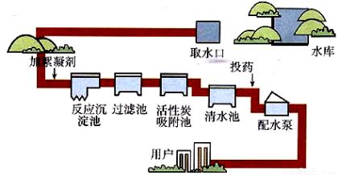
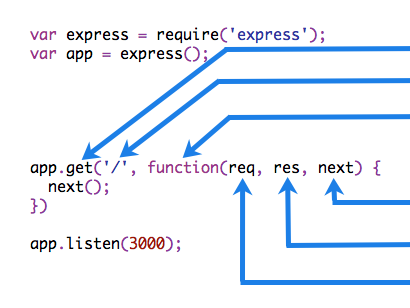

[TOC]

# Express

## Express 介绍

- Express 是一个基于 Node.js 平台，快速、开放、极简的 web 开发框架。

- 作者：[tj](https://github.com/tj)

- - [tj 个人博客](http://tjholowaychuk.com/)

- - 知名的开源项目创建者和协作者

- - Express、commander、ejs、co、Koa...

- - 已经离开 Node 社区，转 Go 了

- - [知乎 - 如何看待 TJ 宣布退出 Node.js 开发，转向 Go？](https://www.zhihu.com/question/24373004)

- 丰富的 API 支持，强大而灵活的中间件特性

- Express 不对 Node.js 已有的特性进行二次抽象，只是在它之上扩展了 Web 应用所需的基本功能

- 有很多[流行框架](http://expressjs.com/en/resources/frameworks.html)基于 Express

- [Express 官网](http://expressjs.com/)

- [Express 中文文档（非官方）](http://www.expressjs.com.cn/)

- [Express GitHub 仓库](https://github.com/expressjs/express)


## 起步

### 安装

参考文档：http://expressjs.com/en/starter/installing.html

```shell
# 创建并切换到 myapp 目录
mkdir myapp
cd myapp

# 初始化 package.json 文件
npm init -y

# 安装 express 到项目中
npm i express
```


### Hello World

参考文档：http://expressjs.com/en/starter/hello-world.html

```javascript
// 0. 加载 Express
const express = require("express");

// 1. 调用 express() 得到一个 app
//    类似于 http.createServer()
const app = express();

// 2. 设置请求对应的处理函数
//    当客户端以 GET 方法请求 / 的时候就会调用第二个参数：请求处理函数
app.get("/", (req, res) => {
  res.send("hello world");
});

// 3. 监听端口号，启动 Web 服务
app.listen(3000, () => console.log("app listening on port 3000!"));
```


### 基本路由

参考文档：http://expressjs.com/en/starter/basic-routing.html

路由（Routing）是由一个 URI（或者叫路径标识）和一个特定的 HTTP 方法（GET、POST 等）组成的，涉及到应用如何处理响应客户端请求。

每一个路由都可以有一个或者多个处理器函数，当匹配到路由时，这个/些函数将被执行。

路由的定义的结构如下：

```javascript
app.METHOD(PATH, HANDLER);
```


其中：

- `app` 是 express 实例

- `METHOD` 是一个 [HTTP 请求方法](https://en.wikipedia.org/wiki/Hypertext_Transfer_Protocol#Request_methods)

- `PATH` 是服务端路径（定位标识）

- `HANDLER` 是当路由匹配到时需要执行的处理函数


下面是一些基本示例。

```javascript
// 当你以 GET 方法请求 / 的时候，执行对应的处理函数
app.get("/", function(req, res) {
  res.send("Hello World!");
});
```


```javascript
// 当你以 POST 方法请求 / 的时候，指定对应的处理函数
app.post("/", function(req, res) {
  res.send("Got a POST request");
});
```


```javascript
app.put("/user", function(req, res) {
  res.send("Got a PUT request at /user");
});
```


```typescript
app.delete("/user", function(req, res) {
  res.send("Got a DELETE request at /user");
});
```


## 处理静态资源

参考文档：http://expressjs.com/en/starter/static-files.html

```javascript
// 开放 public 目录中的资源
// 不需要访问前缀
app.use(express.static("public"));

// 开放 files 目录资源，同上
app.use(express.static("files"));

// 开放 public 目录，限制访问前缀
app.use("/public", express.static("public"));

// 开放 public 目录资源，限制访问前缀
app.use("/static", express.static("public"));

// 开放 publi 目录，限制访问前缀
// path.join(__dirname, 'public') 会得到一个动态的绝对路径
app.use("/static", express.static(path.join(__dirname, "public")));
```


## 使用模板引擎

参考文档：

- [Using template engines with Express](http://expressjs.com/en/guide/using-template-engines.html)


我们可以使用模板引擎处理服务端渲染，但是 Express 为了保持其极简灵活的特性并没有提供类似的功能。

同样的，Express 也是开放的，它支持开发人员根据自己的需求将模板引擎和 Express 结合实现服务端渲染的能力。


### 配置使用 art-template 模板引擎

参考文档：

- [art-template 官方文档](https://aui.github.io/art-template/)

这里我们以 [art-template](https://github.com/aui/art-template) 模板引擎为例演示如何和 Express 结合使用。


安装：

```shell
npm install art-template express-art-template
```


配置：

```javascript
// 第一个参数用来配置视图的后缀名，这里是 art ，则你存储在 views 目录中的模板文件必须是 xxx.art
// app.engine('art', require('express-art-template'))

// 这里我把 art 改为 html
app.engine("html", require("express-art-template"));
```


使用示例：

```javascript
app.get("/", function(req, res) {
  // render 方法默认会去项目的 views 目录中查找 index.html 文件
  // render 方法的本质就是将读取文件和模板引擎渲染这件事儿给封装起来了
  res.render("index.html", {
    title: "hello world"
  });
});
```


如果希望修改默认的 `views` 视图渲染存储目录，可以：

```javascript
// 第一个参数 views 是一个特定标识，不能乱写
// 第二个参数给定一个目录路径作为默认的视图查找目录
app.set("views", 目录路径);
```


### 其它常见模板引擎


JavaScript 模板引擎有很多，并且他们的功能都大抵相同，但是不同的模板引擎也各有自己的特色。

大部分 JavaScript 模板引擎都可以在 Node 中使用，下面是一些常见的模板引擎。

- ejs

- handlebars

- jade

- - 后改名为 pug

- nunjucks


## 解析表单 post 请求体

参考文档：

- [GitHub - body-parser](https://github.com/expressjs/body-parser)

在 Express 中没有内置获取表单 POST 请求体的 API，这里我们需要使用一个第三方包：`body-parser`。


安装：

```shell
npm install --save body-parser
```


配置：

```javascript
var express = require("express");
// 0. 引包
var bodyParser = require("body-parser");

var app = express();

// 配置 body-parser
// 只要加入这个配置，则在 req 请求对象上会多出来一个属性：body
// 也就是说你就可以直接通过 req.body 来获取表单 POST 请求体数据了
// parse application/x-www-form-urlencoded
app.use(bodyParser.urlencoded({ extended: false }));
// parse application/json
app.use(bodyParser.json());
```


使用：

```javascript
app.use(function(req, res) {
  res.setHeader("Content-Type", "text/plain");
  res.write("you posted:\n");
  // 可以通过 req.body 来获取表单 POST 请求体数据
  res.end(JSON.stringify(req.body, null, 2));
});
```


## 使用 Session

参考文档：https://github.com/expressjs/session

安装：

```shell
npm install express-session
```


配置：

```javascript
// 该插件会为 req 请求对象添加一个成员：req.session 默认是一个对象
// 这是最简单的配置方式，暂且先不用关心里面参数的含义
app.use(
  session({
    // 配置加密字符串，它会在原有加密基础之上和这个字符串拼起来去加密
    // 目的是为了增加安全性，防止客户端恶意伪造
    secret: "itcast",
    resave: false,
    saveUninitialized: false // 无论你是否使用 Session ，我都默认直接给你分配一把钥匙
  })
);
```


使用：

```javascript
// 添加 Session 数据
req.session.foo = "bar";

// 获取 Session 数据
req.session.foo;
```


提示：默认 Session 数据是内存存储的，服务器一旦重启就会丢失，真正的生产环境会把 Session 进行持久化存储。

------


## 在 Express 中获取客户端请求参数的三种方式


例如，有一个地址：`/a/b/c?foo=bar&id=123`


### 查询字符串参数

获取 `?foo=bar&id=123`

```javascript
console.log(req.query);
```


结果如下：

```javascript
{
  foo: 'bar',
  id: '123'
}
```


### 请求体参数

`POST` 请求才有请求体，我们需要单独配置 `body-parser` 中间件才可以获取。
只要程序中配置了 `body-parser` 中间件，我们就可以通过 `req.body` 来获取表单 `POST` 请求体数据。


```plain
req.body
// => 得到一个请求体对象
```


### 动态的路径参数

在 Express 中，支持把一个路由设计为动态的。例如：

```javascript
// /users/:id 要求必须以 /users/ 开头，:id 表示动态的，1、2、3、abc、dnsaj 任意都行
// 注意：:冒号很重要，如果你不加，则就变成了必须 === /users/id
// 为啥叫 id ，因为是动态的路径，服务器需要单独获取它，所以得给它起一个名字
// 那么我们就可以通过 req.params 来获取路径参数
app.get("/users/:id", (req, res, next) => {
  console.log(req.params.id);
});

// /users/*/abc
// req.params.id
app.get("/users/:id/abc", (req, res, next) => {
  console.log(req.params.id);
});

// /users/*/*
// req.params.id
// req.params.abc
app.get("/users/:id/:abc", (req, res, next) => {
  console.log(req.params.id);
});

// /*/*/*
// req.params.users
app.get("/:users/:id/:abc", (req, res, next) => {
  console.log(req.params.id);
});

// /*/id/*
app.get("/:users/id/:abc", (req, res, next) => {
  console.log(req.params.id);
});
```

------


## 中间件

参考文档：

- [Writing middleware for use in Express apps](http://expressjs.com/en/guide/writing-middleware.html)

- [Using middleware](http://expressjs.com/en/guide/using-middleware.html)


Express 的最大特色，也是最重要的一个设计，就是中间件。一个 Express 应用，就是由许许多多的中间件来完成的。

为了理解中间件，我们先来看一下我们现实生活中的自来水厂的净水流程。




在上图中，自来水厂从获取水源到净化处理交给用户，中间经历了一系列的处理环节，我们称其中的每一个处理环节就是一个中间件。这样做的目的既提高了生产效率也保证了可维护性。


### 一个简单的中间件例子：打印日志

```javascript
app.get("/", (req, res) => {
  console.log(`${req.method} ${req.url} ${Date.now()}`);
  res.send("index");
});

app.get("/about", (req, res) => {
  console.log(`${req.method} ${req.url} ${Date.now()}`);
  res.send("about");
});

app.get("/login", (req, res) => {
  console.log(`${req.method} ${req.url} ${Date.now()}`);
  res.send("login");
});
```


在上面的示例中，每一个请求处理函数都做了一件同样的事情：请求日志功能（在控制台打印当前请求方法、请求路径以及请求时间）。


针对于这样的代码我们自然想到了封装来解决：

```javascript
app.get("/", (req, res) => {
  // console.log(`${req.method} ${req.url} ${Date.now()}`)
  logger(req);
  res.send("index");
});

app.get("/about", (req, res) => {
  // console.log(`${req.method} ${req.url} ${Date.now()}`)
  logger(req);
  res.send("about");
});

app.get("/login", (req, res) => {
  // console.log(`${req.method} ${req.url} ${Date.now()}`)
  logger(req);
  res.send("login");
});

function logger(req) {
  console.log(`${req.method} ${req.url} ${Date.now()}`);
}
```


这样的做法自然没有问题，但是大家想一想，我现在只有三个路由，如果说有 10 个、100 个、1000 个呢？那我在每个请求路由函数中都手动调用一次也太麻烦了。


好了，我们不卖关子了，来看一下我们如何使用中间件来解决这个简单的小功能。

```javascript
app.use((req, res, next) => {
  console.log(`${req.method} ${req.url} ${Date.now()}`);
  next();
});

app.get("/", (req, res) => {
  res.send("index");
});

app.get("/about", (req, res) => {
  res.send("about");
});

app.get("/login", (req, res) => {
  res.send("login");
});

function logger(req) {
  console.log(`${req.method} ${req.url} ${Date.now()}`);
}
```


上面代码执行之后我们发现任何请求进来都会先在服务端打印请求日志，然后才会执行具体的业务处理函数。那这个到底是怎么回事？


### 中间件的组成



中间件函数可以执行以下任何任务：


- 执行任何代码

- 修改 request 或者 response 响应对象

- 结束请求响应周期

- 调用下一个中间件


### 中间件分类

- 应用程序级别中间件

- 路由级别中间件

- 错误处理中间件

- 内置中间件

- 第三方中间件


#### 应用程序级别中间件

不关心请求路径：

```javascript
var app = express();

app.use(function(req, res, next) {
  console.log("Time:", Date.now());
  next();
});
```


限定请求路径：

```javascript
app.use("/user/:id", function(req, res, next) {
  console.log("Request Type:", req.method);
  next();
});
```


限定请求方法：

```typescript
app.get("/user/:id", function(req, res, next) {
  res.send("USER");
});
```


多个处理函数：

```javascript
app.use(
  "/user/:id",
  function(req, res, next) {
    console.log("Request URL:", req.originalUrl);
    next();
  },
  function(req, res, next) {
    console.log("Request Type:", req.method);
    next();
  }
);
```


多个路由处理函数：

```javascript
app.get(
  "/user/:id",
  function(req, res, next) {
    console.log("ID:", req.params.id);
    next();
  },
  function(req, res, next) {
    res.send("User Info");
  }
);

// handler for the /user/:id path, which prints the user ID
app.get("/user/:id", function(req, res, next) {
  res.end(req.params.id);
});
```


要从路由中间件堆栈中跳过其余中间件功能，请调用 `next('router')` 将控制权传递给下一条路由。

**注意：`next('router')` 仅在使用 `app.METHOD()` 或 `router.METHOD()` 函数加载的中间件函数中有效。**

最后一个例子：

```javascript
app.get(
  "/user/:id",
  function(req, res, next) {
    // if the user ID is 0, skip to the next route
    if (req.params.id === "0") next("route");
    // otherwise pass the control to the next middleware function in this stack
    else next();
  },
  function(req, res, next) {
    // render a regular page
    res.render("regular");
  }
);

// handler for the /user/:id path, which renders a special page
app.get("/user/:id", function(req, res, next) {
  res.render("special");
});
```


#### 路由级别中间件

路由级中间件与应用程序级中间件的工作方式相同，只不过它绑定到的实例 `express.Router()`。

创建路由实例：

```javascript
var router = express.Router();
```

使用 `router.use()` 和 `router.METHOD()` 函数加载路由级中间件。

示例：

```javascript
var app = express();
var router = express.Router();

// a middleware function with no mount path. This code is executed for every request to the router
router.use(function(req, res, next) {
  console.log("Time:", Date.now());
  next();
});

// a middleware sub-stack shows request info for any type of HTTP request to the /user/:id path
router.use(
  "/user/:id",
  function(req, res, next) {
    console.log("Request URL:", req.originalUrl);
    next();
  },
  function(req, res, next) {
    console.log("Request Type:", req.method);
    next();
  }
);

// a middleware sub-stack that handles GET requests to the /user/:id path
router.get(
  "/user/:id",
  function(req, res, next) {
    // if the user ID is 0, skip to the next router
    if (req.params.id === "0") next("route");
    // otherwise pass control to the next middleware function in this stack
    else next();
  },
  function(req, res, next) {
    // render a regular page
    res.render("regular");
  }
);

// handler for the /user/:id path, which renders a special page
router.get("/user/:id", function(req, res, next) {
  console.log(req.params.id);
  res.render("special");
});

// mount the router on the app
app.use("/", router);
```


另一个示例：

```javascript
var app = express();
var router = express.Router();

// predicate the router with a check and bail out when needed
router.use(function(req, res, next) {
  if (!req.headers["x-auth"]) return next("router");
  next();
});

router.get("/", function(req, res) {
  res.send("hello, user!");
});

// use the router and 401 anything falling through
app.use("/admin", router, function(req, res) {
  res.sendStatus(401);
});
```


#### 错误处理中间件

以与其他中间件函数相同的方式定义错误处理中间件函数，除了使用四个参数而不是三个参数（特别是使用签名(err, req, res, next)）之外：

```javascript
app.use(function(err, req, res, next) {
  console.error(err.stack);
  res.status(500).send("Something broke!");
});
```

错误处理中间件始终带有四个参数。您必须提供四个参数以将其标识为错误处理中间件函数。即使不需要使用该 `next` 对象，也必须指定它以维护签名。否则，该 `next` 对象将被解释为常规中间件。


#### 处理404

```javascript
// 通常会在所有的路由支行配置处理 404 的内容
// 请求进来从上到下依次匹配
app.use(function(req, res, next) {
  res.status(404).send("404 Not Found.");
});
```


#### 内置中间件

Express 具有以下内置中间件函数：

+ [exprsss.json()](http://expressjs.com/en/4x/api.html#express.json) 解析 Content-Type 为 `application/json` 格式的请求体

+ [exprsss.urlencoded()](http://expressjs.com/en/4x/api.html#express.urlencoded) 解析 Content-Type 为 `application/x-www-form-urlencoded` 格式的请求体
+ [exprsss.raw()](http://expressjs.com/en/4x/api.html#express.raw) 解析 Content-Type 为 `application/octet-stream` 格式的请求体
+ [exprsss.text()](http://expressjs.com/en/4x/api.html#express.text) 解析 Content-Type 为 `text/plain` 格式的请求体
+ [exprsss.static()](http://expressjs.com/en/4x/api.html#express.static) 托管静态资源文件


#### 第三方中间件

有关Express常用的第三方中间件功能的部分列表，请参阅：[http://expressjs.com/en/resources/middleware.html](http://expressjs.com/en/resources/middleware.html)


## 路由

路由是指应用程序的端点（URI）如何响应客户端请求，有关路由的介绍，请参阅[路由基础](https://segmentfault.com/a/1190000017525711)。

使用与HTTP方法相对应的Express `app`对象的方法定义路由，例如，`app.get()`用于处理`GET`请求，`app.post()`用于处理`POST`请求，有关完整列表，请参阅`app.METHOD`。你还可以使用`app.all()`来处理所有HTTP方法，并使用`app.use()`将中间件指定为回调函数（有关详细信息，请参阅使用中间件）。

这些路由方法指定当应用程序收到对指定路由（端点）和HTTP方法的请求时调用的回调函数（有时称为“处理函数”），换句话说，应用程序“监听”与指定路由和方法匹配的请求，并且当它检测到匹配时，它调用指定的回调函数。

实际上，路由方法可以有多个回调函数作为参数，使用多个回调函数时，重要的是提供`next`作为回调函数的参数，然后在函数体内调用`next()`以将控制权交给下一个回调。

以下代码是一个非常基础的路由示例。

```javascript
var express = require('express')
var app = express()
 
// respond with "hello world" when a GET request is made to the homepage
app.get('/', function (req, res) {
  res.send('hello world')
})
```


### 路由方法

路由方法是从其中一个HTTP方法派生的，并附加到express类的实例。

以下代码是为应用程序根目录的GET和POST方法定义的路由示例。

```javascript
// GET method route
app.get('/', function (req, res) {
  res.send('GET request to the homepage')
})
 
// POST method route
app.post('/', function (req, res) {
  res.send('POST request to the homepage')
})

```


Express支持与所有HTTP请求方法相对应的方法：`get`、`post`等，有关完整列表，请参阅`app.METHOD`。

有一种特殊的路由方法`app.all()`，用于在路径上为所有HTTP请求方法加载中间件函数，例如，无论是使用GET、POST、PUT、DELETE还是[http模块](https://nodejs.org/api/http.html#http_http_methods)支持的任何其他HTTP请求方法，都会对路由`“/secret”`的请求执行以下处理程序。

```javascript
app.all('/secret', function (req, res, next) {
  console.log('Accessing the secret section ...')
  next() // pass control to the next handler
})
```


### 路由路径

路由路径与请求方法结合，定义可以发出请求的端点，路由路径可以是字符串、字符串模式或正则表达式。

字符`?`、`+`、`*`和`()`是它们的正则表达式对应物的子集，连字符（`-`）和点（`.`）由字符串路径按字面解释。

如果你需要在路径字符串中使用美元字符（`$`），请将其包含在`([`和`])`中，例如，`“/data/$book”`处的请求的路径字符串将是`“/data/([\$])book”`。

> Express使用 [path-to-regexp](https://www.npmjs.com/package/path-to-regexp)来匹配路由路径，有关定义路由路径的所有可能性，请参阅 `path-to-regexp`文档， [Express Route Tester](http://forbeslindesay.github.io/express-route-tester/)是一个用于测试基本Express路由的便捷工具，但它不支持模式匹配。
>
> 查询字符串不是路由路径的一部分。

以下是基于字符串的路由路径的一些示例。

此路由路径将匹配对根路由`/`的请求。

```javascript
app.get('/', function (req, res) {
  res.send('root')
})
```

此路由路径将匹配`/about`的请求。

```javascript
app.get('/about', function (req, res) {
  res.send('about')
})
```

此路由路径将匹配对`/random.text`的请求。

```javascript
app.get('/random.text', function (req, res) {
  res.send('random.text')
})
```

以下是基于字符串模式的路由路径的一些示例。

此路由路径将匹配`acd`和`abcd`。

```javascript
app.get('/ab?cd', function (req, res) {
  res.send('ab?cd')
})
```

此路由路径将匹配`abcd`、`abbcd`、`abbbcd`等。

```javascript
app.get('/ab+cd', function (req, res) {
  res.send('ab+cd')
})
```

此路由路径将匹配`abcd`、`abxcd`、`abRANDOMcd`、`ab123cd`等。

```javascript
app.get('/ab*cd', function (req, res) {
  res.send('ab*cd')
})
```

此路由路径将匹配`/abe`和`/abcde`。

```javascript
app.get('/ab(cd)?e', function (req, res) {
  res.send('ab(cd)?e')
})
```

基于正则表达式的路由路径示例：

此路由路径将匹配其中包含“`a`”的任何内容。

```javascript
app.get(/a/, function (req, res) {
  res.send('/a/')
})
```

这个路由路径将与`butterfly`和`dragonfly`相匹配，但不会与`butterflyman`、`dragonflyman`等相匹配。

```javascript
app.get(/.*fly$/, function (req, res) {
  res.send('/.*fly$/')
})
```


### 路由参数

路由参数是命名的URL片段，用于捕获在URL中的位置指定的值，捕获的值填充在`req.params`对象中，在路径中指定的路由参数的名称作为其各自的键。

```bash
Route path: /users/:userId/books/:bookId
Request URL: http://localhost:3000/users/34/books/8989
req.params: { "userId": "34", "bookId": "8989" }
```

要使用路由参数定义路由，只需在路由路径中指定路由参数，如下所示。

```javascript
app.get('/users/:userId/books/:bookId', function (req, res) {
  res.send(req.params)
})
```

> 路由参数的名称必须由“单词字符”（[A-Za-z0-9_]）组成。

由于连字符（`-`）和点（`.`）按字面解释，因此它们可以与路由参数一起使用以用于有用的目的。

```javascript
Route path: /flights/:from-:to
Request URL: http://localhost:3000/flights/LAX-SFO
req.params: { "from": "LAX", "to": "SFO" }
```

```javascript
Route path: /plantae/:genus.:species
Request URL: http://localhost:3000/plantae/Prunus.persica
req.params: { "genus": "Prunus", "species": "persica" }
```


要更好地控制路由参数可以匹配的确切字符串，可以在括号（`()`）中附加正则表达式：

```javascript
Route path: /user/:userId(\d+)
Request URL: http://localhost:3000/user/42
req.params: {"userId": "42"}
```

> 因为正则表达式通常是文字字符串的一部分，所以请务必使用额外的反斜杠转义任何 `\`字符，例如 `\\d+`。
>
> 在Express 4.x中，[正则表达式中的`*`字符不以通常的方式解释](https://github.com/expressjs/express/issues/2495)，要解决此问题，请使用`{0,}`而不是`*`，这可能会在Express 5中修复。


### 路由处理程序

你可以提供多个回调函数，其行为类似于中间件来处理请求，唯一的例外是这些回调可能会调用`next('route')`来绕过剩余的路由回调，你可以使用此机制在路由上施加前置条件，然后在没有理由继续当前路由的情况下将控制权传递给后续路由。

路由处理程序可以是函数，函数数组或两者的组合形式，如以下示例所示。

单个回调函数可以处理路由，例如：

```javascript
app.get('/example/a', function (req, res) {
  res.send('Hello from A!')
})
```

多个回调函数可以处理路由（确保指定`next`对象），例如：

```lua
app.get('/example/b', function (req, res, next) {
  console.log('the response will be sent by the next function ...')
  next()
}, function (req, res) {
  res.send('Hello from B!')
})

```

一组回调函数可以处理路由，例如：

```javascript
var cb0 = function (req, res, next) {
  console.log('CB0')
  next()
}
 
var cb1 = function (req, res, next) {
  console.log('CB1')
  next()
}
 
var cb2 = function (req, res) {
  res.send('Hello from C!')
}
 
app.get('/example/c', [cb0, cb1, cb2])
```

单独函数和函数数组的组合可以处理路由，例如：

```lua
var cb0 = function (req, res, next) {
  console.log('CB0')
  next()
}
 
var cb1 = function (req, res, next) {
  console.log('CB1')
  next()
}
 
app.get('/example/d', [cb0, cb1], function (req, res, next) {
  console.log('the response will be sent by the next function ...')
  next()
}, function (req, res) {
  res.send('Hello from D!')
})
```


### 响应方法

下表中的响应对象（`res`）上的方法可以向客户端发送响应，并终止请求—响应周期，如果没有从路由处理程序调用这些方法，则客户端请求将保持挂起状态。

| 方法               | 描述                                             |
| :----------------- | :----------------------------------------------- |
| `res.download()`   | 提示下载文件                                     |
| `res.end()`        | 结束响应过程                                     |
| `res.json()`       | 发送JSON响应                                     |
| `res.jsonp()`      | 使用JSONP支持发送JSON响应                        |
| `res.redirect()`   | 重定向请求                                       |
| `res.render()`     | 渲染视图模板                                     |
| `res.send()`       | 发送各种类型的响应                               |
| `res.sendFile()`   | 将文件作为八位字节流发送                         |
| `res.sendStatus()` | 设置响应状态码并将其字符串表示形式作为响应体发送 |


### app.route()

你可以使用`app.route()`为路由路径创建可链接的路由处理程序，由于路径是在单个位置指定的，因此创建模块化路由很有帮助，同时减少冗余和拼写错误，有关路由的更多信息，请参阅：`Router()`文档。

以下是使用`app.route()`定义的链接路由处理程序示例。

```javascript
app.route('/book')
  .get(function (req, res) {
    res.send('Get a random book')
  })
  .post(function (req, res) {
    res.send('Add a book')
  })
  .put(function (req, res) {
    res.send('Update the book')
  })
```


### express.Router

使用`express.Router`类创建模块化、可装载的路由处理程序，`Router`实例是一个完整的中间件和路由系统，因此，它通常被称为“迷你应用程序”。

以下示例将路由器创建为模块，在其中加载中间件功能，定义一些路由，并将路由器模块装载在主应用程序中的路径上。

在应用程序目录中创建名为`birds.js`的路由器文件，其中包含以下内容：

```javascript
var express = require('express')
var router = express.Router()
 
// middleware that is specific to this router
router.use(function timeLog (req, res, next) {
  console.log('Time: ', Date.now())
  next()
})
// define the home page route
router.get('/', function (req, res) {
  res.send('Birds home page')
})
// define the about route
router.get('/about', function (req, res) {
  res.send('About birds')
})
 
module.exports = router
```

然后，在应用程序中加载路由器模块：

```php
var birds = require('./birds')
 
// ...
 
app.use('/birds', birds)
```

该应用程序现在能够处理对`/birds`和`/birds/about`的请求，以及调用特定于该路由的`timeLog`中间件函数。