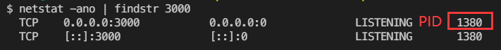
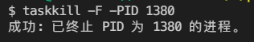

[TOC]

# node

## __dirname和process.cwd()的区别

`process.cwd()` 返回当前命令行执行所在的目录。如：调用node命令执行脚本时的目录。
`__dirname ` 返回当前源代码所在的目录。

例如：对于d:\dir\index.js。

| **命令**          | **process.cwd()** | **__dirname** |
| ----------------- | ----------------- | ------------- |
| node index.js     | d:\dir            | d:\dir        |
| node dir\index.js | d:                | d:\dir        |


## 关闭程序端口占用

windows：

**占用查询端口的pid查询：**

```bash
netstat -ano | findstr 端口号
```




**关闭对应pid：**

```bash
taskkill -F -PID 对应的PID
```




## 定时任务

cron模块可以帮助我们在node中定时执行任务。如果定时需求是简单的 `setInterval()` 与 `setTimeout()` 计时器所无法满足的比较复杂的定时规则，可以使用cron来配置。

**安装**

```bash
npm install cron
```

**用法**

```js
var CronJob = require('cron').CronJob;
var job = new CronJob('* * * * * *', function() {
  console.log('You will see this message every second');
}, null, true, 'America/Los_Angeles');
job.start();
```

其中第一个参数'* * * * * *'为cron表达式。

例如：

- '* * * * * *' 为每秒钟执行一次；
- '*/30 * * * * *'为每30秒执行一次，会在每分钟的0秒和30秒执行；
- '* */30 8-18 * * *'每天的8点到18点的0分和30分执行；
- '* 15 10,18 * * *'每天的10点15分和18点15分执行。

**cron 表达式**

| 顺序         | 秒   | 分钟 | 小时 | 日期       | 月份 | 星期    | 年（可选）        |
| ------------ | ---- | ---- | ---- | ---------- | ---- | ------- | ----------------- |
| 取值         | 0-59 | 0-59 | 0-23 | 1-30（31） | 1-12 | 1-7     |                   |
| 允许特殊字符 | ,-*/ | ,-*/ | ,-*/ | ,-*/?LWC   | ,-*/ | ,-*/L#C | 1970-2099 , - * / |

**备注：和linux中不一样，linux只有5位，从分钟开始。**

[参考文档](https://www.npmjs.com/package/cron)

