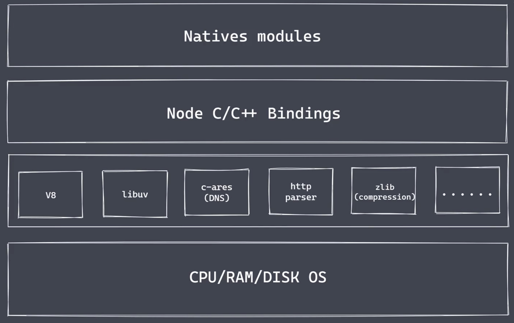
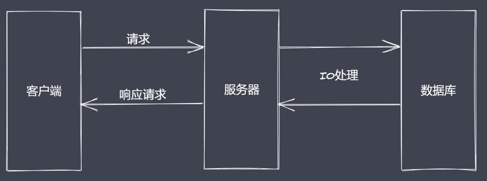
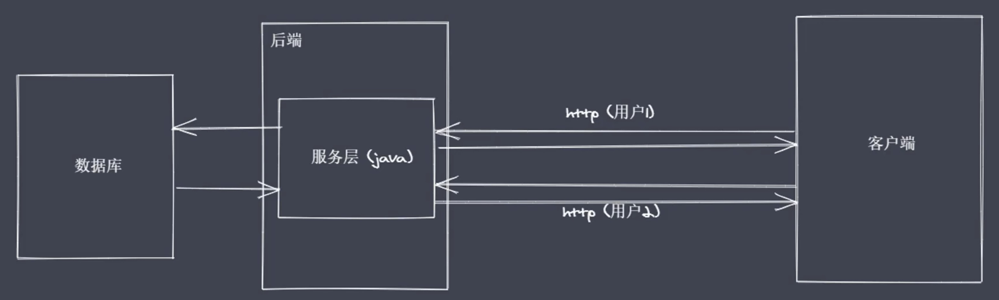
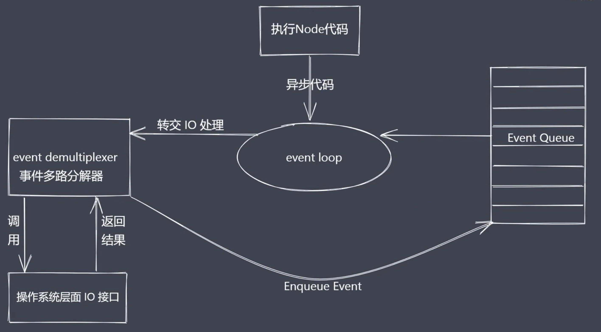
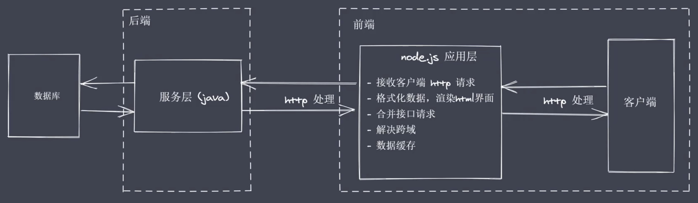

[TOC]

# node基础

## 概述

**可以做什么**

轻量级、高性能的Web服务
前后端JavaScript同构开发
便捷高效的前端工程化


## Nodejs架构



**Native Modules**

- 当前层内容由JS实现

- 提供应用程序可直接调用库，例如fs、path、http等

- JS语言无法直接操作底层硬件设置

  

**Builtin module “胶水层”**


**底层**

- V8:执行js代码，提供桥梁接口
- Libuv:事件循环、事件队列、异步IO
- 第三方模块：zlib、http、c-ares等


## 为什么是Nodejs

Nodejs慢慢演化为一门服务端“语言”

### 

IO是计算机操作过程中最缓慢的环节



Reactor模式，单线程完成多线程工作
Reactor模式下实现异步IO、事件驱动
Nodejs更适用于IO密集型高并发请求


## Nodejs异步IO

重复调用IO操作，判断IO是否结束
常见的轮询技术：

+ read
+ select
+ poll
+ kqueue
+ event ports

期望实现无须主动判断的非阻塞IO




异步IO总结

- IO是应用程序的瓶颈所在
- 异步IO提高性能无须原地等待结果返回
- IO操作属于操作系统级别，平台都有对应实现
- Nodejs单线程配合事件驱动架构及libuv实现了异步IO


## 事件驱动架构

事件驱动架构是软件开发中的通用模式
事件驱动、发布订阅、观察者
主体发布消息，其它实例接收消息


```js
const EventEmitter = require('events')
const myEvent = new EventEmitter()
myEvent.on('事件1', () => {
  console.log('事件1执行了')
})
myEvent.on('事件1', () => {
  console.log('事件1-2执行了')
})
myEvent.emit('事件1')
```


## Nodejs单线程

用JS实现高效可伸缩的高性能Web服务
单线程如何实现高并发？
异步非阻塞IO配合事件回调通知
Nodejs主线程时单线程

```js
const http = require('http')
function sleepTime (time) {
  const sleep = Date.now() + time * 1000
  while(Date.now() < sleep) {}
  return 
}
sleepTime(4)
const server = http.createServer((req, res) => {
  res.end('server starting......')
})
server.listen(8080, () => {
  console.log('服务启动了')
})
```


## Nodejs应用场景

IO密集型高并发请求



操作数据库提供API服务
实时聊天应用程序
Nodejs更加适合IO密集型任务


## Nodejs全局对象

- 与浏览器平台的window不完全相同
- Nodejs全局对象上挂载许多属性
  全局对象是JavaScript中的特殊对象
  Nodejs中全局对象是global
  Global根本作用是作为宿主
  全局对象可以看做是全局变量的宿主


**Nodejs常见全局变量**

+ __filename：返回正在执行脚本文件的绝对路径
+ __dirname：返回正在执行脚本所在目录
+ timer类函数：执行顺序与事件循环间的关系
+ process：提供与当前进程互动的接口
+ require：实现模块的加载
+ Module、exports：处理模块的导出


```js
// console.log(global)
/* console.log(__filename)
console.log(__dirname)
console.log(this)
 */
// 默认情况 this 是空对象，和 global 并不是一样的
console.log(this == global) // false
(function () {
  console.log(this == global) // true
})()
// 默认传入
/* require('module')
__filename
__dirname
module 
exports  */
```


## 全局变量 process

无须require可直接使用
获取进程信息
执行进程操作

```js
// 1 资源： cpu 内存
// const fs=require('fs') heapUsed会变大
// buffer.alloc(1001) arrayBuffers会变化
// console.log(process.memoryUsage())
// {
//   rss: 24612864,     常驻内存
//   heapTotal: 4247552, 脚本执行时申请的总的内存大小
//   heapUsed: 2303160, 脚本运行时实际使用的内存大小
//   external: 756789,  表示底层c/c++核心模块所占据的内存大小
//   arrayBuffers: 9382 一片独立的空间大小，不占据v8所占用的内存
// }


// console.log(process.cpuUsage())
// { 
//   user: 31000, // 代表用户执行过程中所占用的cpu时间片段
//   system: 15000 // 代表操作系统执行过程中所占用的cpu时间片段
// }


// 2 运行环境：运行目录、node环境、cpu架构、用户环境、系统平台
// console.log(process.cwd())  // current work direct
// console.log(process.version) // node版本
// console.log(process.versions)
// console.log(process.arch) // cpu架构  如：x64
// console.log(process.env.NODE_ENV) // 环境获取
// console.log(process.env.PATH) // 当前本地所配置的系统环境变量
// console.log(process.env.USERPROFILE)  // mac:HOME     本机所设置好的管理员目录
// console.log(process.platform) // win32

// 3 运行状态： 启动参数、PID、运行时间
// console.log(process.argv)
// [
//   'D:\\办公软件\\node.exe',  // node启动程序所对应的完整路径
//   'C:\\Users\\wuhui\\Desktop\\study\\5-1-课程资料\\Code\\01Base\\05-process.js'  // 当前进程所在文件的绝对路径
// ]
// console.log(process.argv0)  //  拿到数组中第一个值
// console.log(process.execArgv) // --启动参数或者配置参数
// console.log(process.pid)   //ppid  // pid 运行时在当前的操作系统内占据唯一的id

setTimeout(() => {
  console.log(process.uptime()) // 当前脚本运行时间的统计
}, 3000)
```

```js
// 4 事件
// process.on('exit',(code)=>{
//   // 这里不能放异步代码 如延时器 无反应
//   console.log('exit'+code)
// })
// process.on('beforeExit',(code)=>{
//   console.log('before exit'+code)
// })
// console.log('代码执行结束')

// process.exit() // 让程序主动退出  则不会执行beforeExit
// // 后面代码不会再执行

// 5 标准输出 输入 错误
// console.log = function(data){
//   process.stdout.write('---' + data + '\n')   // stdout 标准输出 返回的是一个对象 这个对象就是一个流
// }
// console.log (11)
// console.log (22)

// const fs = require('fs')
// fs.createReadStream('test.txt').pipe(process.stdout)   // 标准输出就在目前的终端面板中

// process.stdin.pipe(process.stdout)   // 执行会hang住，需要在标注输入里写入内容 然后会在标准输出里输出内容

process.stdin.setEncoding('utf-8')
process.stdin.on('readable',()=>{
  let chunk = process.stdin.read()  // 从标准输入读取数据
  if(chunk!==null){
    process.stdout.write('data' + chunk)
  }
})
```

