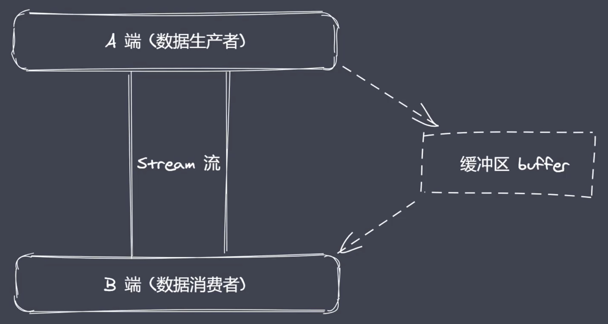
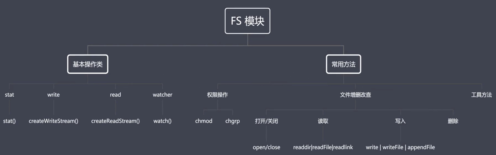
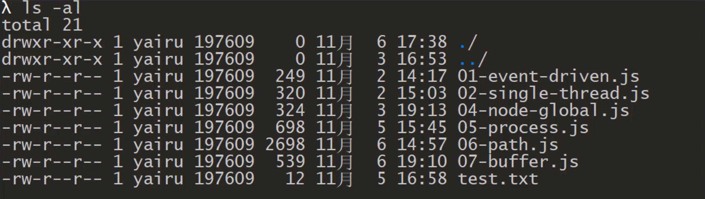
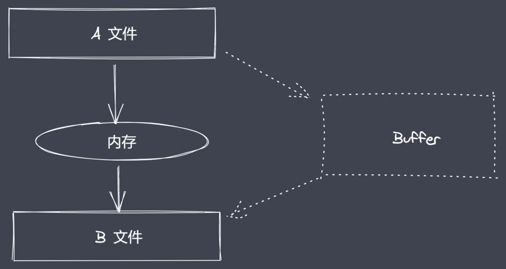
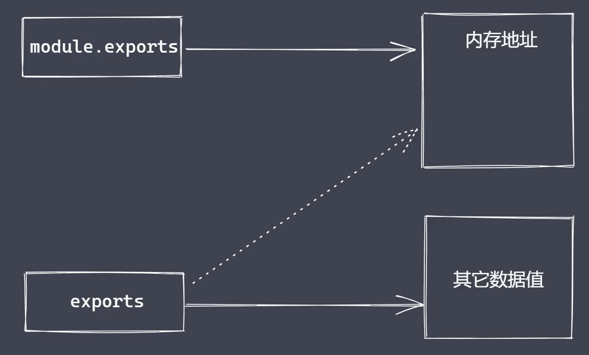
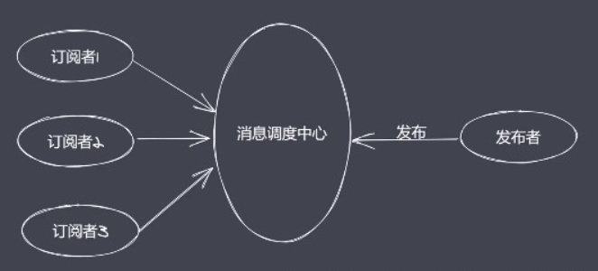
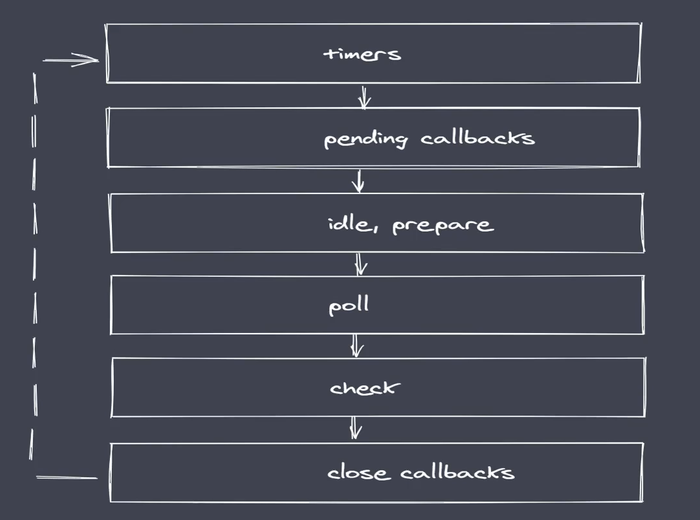

[TOC]

# node核心模块

## path

内置模块，require之后直接使用
用于处理文件/目录的路径

掌握path模块中的常见API：

+ basename()：获取路径中基础名称
+ dirname()：获取路径中目录名称
+ extname()：获取路径中扩展名称
+ isAbsolute()：获取路径是否为绝对路径
+ join()：拼接多个路径片段
+ resolve()：返回绝对路径
+ parse()：解析路径
+ format()：序列化路径
+ normalize()：规范化路径

```js
const path = require('path')

// console.log(__filename)

// 1 获取路径中的基础名称 
/**
 * 01 返回的就是接收路径当中的最后一部分 
 * 02 第二个参数表示扩展名，如果说没有设置则返回完整的文件名称带后缀
 * 03 第二个参数做为后缀时，如果没有在当前路径中被匹配到，那么就会忽略
 * 04 处理目录路径的时候如果说，结尾处有路径分割符，则也会被忽略掉
 */
/* console.log(path.basename(__filename))
console.log(path.basename(__filename, '.js'))
console.log(path.basename(__filename, '.css'))
console.log(path.basename('/a/b/c'))
console.log(path.basename('/a/b/c/')) */

// 2 获取路径目录名 (路径)
/**
 * 01 返回路径中最后一个部分的上一层目录所在路径
 */
/* console.log(path.dirname(__filename))
console.log(path.dirname('/a/b/c'))
console.log(path.dirname('/a/b/c/')) */

// 3 获取路径的扩展名
/**
 * 01 返回 path路径中相应文件的后缀名
 * 02 如果 path 路径当中存在多个点，它匹配的是最后一个点，到结尾的内容
 */
/* console.log(path.extname(__filename))
console.log(path.extname('/a/b'))
console.log(path.extname('/a/b/index.html.js.css'))
console.log(path.extname('/a/b/index.html.js.'))  */
```

```js
// 4 解析路径
/**
 * 01 接收一个路径，返回一个对象，包含不同的信息
 * 02 root dir base ext name
 */
// const obj = path.parse('/a/b/c/index.html')
// console.log(obj)
// {
//     root: '/',
//     dir: '/a/b/c',     
//     base: 'index.html',
//     ext: '.html',      
//     name: 'index'      
//   }
// const obj = path.parse('/a/b/c/')
/* const obj = path.parse('./a/b/c/')
console.log(obj.name) */

// 5 序列化路径
// const obj = path.parse('./a/b/c/')
// console.log(path.format(obj))  // ./a/b\c   这边路径分隔符跟当前操作系统相关

// 6 判断当前路径是否为绝对
/* console.log(path.isAbsolute('foo'))  false
console.log(path.isAbsolute('/foo'))  true
console.log(path.isAbsolute('///foo')) true
console.log(path.isAbsolute('')) false
console.log(path.isAbsolute('.')) false
console.log(path.isAbsolute('../bar')) false
*/

// 7 拼接路径
/* 
console.log(path.join('a/b', 'c', 'index.html'))
console.log(path.join('/a/b', 'c', 'index.html'))
console.log(path.join('/a/b', 'c', '../', 'index.html')) \a\b\index.html
console.log(path.join('/a/b', 'c', './', 'index.html'))  \a\b\c\index.html
console.log(path.join('/a/b', 'c', '', 'index.html'))  \a\b\c\index.html
console.log(path.join('')) . 代表当前工作目录
*/

// 8 规范化路径
/* 
console.log(path.normalize('')) . 代表当前工作目录
console.log(path.normalize('a/b/c/d'))  a\b\c\d
console.log(path.normalize('a///b/c../d')) a\b\c..\d
console.log(path.normalize('a//\\/b/c\\/d')) a\b\c\d
console.log(path.normalize('a//\b/c\\/d'))  a\c\d    b作为字符被转义 b就不再作为路径去出现了
*/

// 9 绝对路径
// console.log(path.resolve())
/**
 * resolve([from], to)
 */
// console.log(path.resolve('a', 'b'))   //C:...\a\b
// console.log(path.resolve('a', '/b'))   //C:\b
// console.log(path.resolve('a', './b'))   //C:...\a\b
// console.log(path.resolve('a', '../b')) //C:...\b
// console.log(path.resolve('/a', 'b')) //C:\a\b
// console.log(path.resolve('/a', '..b')) //C:\a\..b
// console.log(path.resolve('/a', '/b')) //C:\b
// console.log(path.resolve('/a', '../b')) //C:\b
// console.log(path.resolve('index.html'))  //C:..\index.html
```


## Buffer

Buffer缓冲区
Buffer让js可以操作二进制
二进制数据、流操作、Buffer
JS语言期初服务于浏览器平台
Nodejs平台下JS可实现IO 如：文件的读写、网络服务中的数据传输等
IO行为操作的就是二进制数据
Stream流操作并非Nodejs独创
大数据传输时，避免操作数据内存过大 而出现短时间内把内存占满的情况出现
流操作配合管道实现数据分段传输
数据的端到端传输会有生产者和消费者
生产和消费的过程往往存在等待
产生等待时数据存放在哪？
Nodejs中Buffer是一片内存空间

Buffer总结：

- 无须require的一个全局变量
- 实现Nodejs平台下的二进制数据操作
- 不占据V8堆内存大小的内存空间 直接由C++层面进行分配
- 内存的使用由Node来控制，由V8的GC回收，无法进行人为参与
- 一般配合Stream流使用，充当数据缓冲区



### 创建Buffer

Buffer是Nodejs的内置类
创建Buffer实例

- alloc:创建指定字节大小的buffer
- allocUnsafe:创建指定大小的buffer（不安全）
- from：接收数据，创建buffer。它产出的对象 里面默认是装有数据的

```js
// const b1 = Buffer.alloc(10)
// const b2 = Buffer.allocUnsafe(10)

// console.log(b1)
// <Buffer 00 00 00 00 00 00 00 00 00 00>
// console.log(b2) 
//在内存之中只要一个有空闲的空间就会被拿过来使用
// <Buffer 25 10 00 00 20 08 00 00 e0 5b>
// 空间回收时，由于算法的不同，并不能保证空间里面得到实时的回收，比如有些垃圾的区域的确没人用了，但是由于一些空间碎片的存在，它里面的数据还是在的
// 但的确没有对象再指向它进行引用了 ，那么这时候有可能就在某一瞬间把这样的空间被拿过来了，完了之后就去创建了一个新的空间
// 当然具体使用时，可能也不会影响最后的一个数据填充，因为最终我们要的是一个内存的大小
// 但终归来说我们觉得这样是不干净的


// from 
//  const b1 = Buffer.from('1') 
//  console.log(b1) 
// <Buffer 31>
// 接收三种数据类型：字符串、数组、buffer类型的数据来源
// 第二个参数对应的编码 默认utf-8  utf-8里对于汉字1同样存在一个指定的编码
// 这个编码会对应一个数值 而这个数值在去以我们当前这种格式进行展示的时候
// 会先去转成16进制。这个31就应该时这样转过来的
// const b2 = Buffer.from('中')  // 一个汉字在utf-8里占据3个字节
// console.log(b2) 
// 这里正好有3个
// <Buffer e4 b8 ad>

// const b1 = Buffer.from([1, 2, 3])
// console.log(b1)
// <Buffer 01 02 03>


// const b1 = Buffer.from([0xe4, 0xb8, 0xad])
/* const b1 = Buffer.from([0x60, 0b1001, 12])
console.log(b1) 
console.log(b1.toString())  */
//  const b1 = Buffer.from('中')
// console.log(b1)
// console.log(b1.toString()) 
// <Buffer e4 b8 ad>
// 中
// 建议直接用10进制


// const b1 = Buffer.alloc(3)
// const b2 = Buffer.from(b1)

// console.log(b1)
// console.log(b2)

// b1[0] = 1
// console.log(b1)
// console.log(b2)
// 并不是共享，只是利用了老空间的大小长度创建了一个新的空间
```


### Buffer实例方法

+ fill：使用数据填充buffer 返回当前填充数据之后的buffer
+ write：向buffer中写入数据
+ toStrig：从buffer中提取数据，然后按照指定的编码格式进行相应的内容展示
+ slice：截取buffer 从buffer中截取指定长度的目标数据
+ indexOf:在buffer中查找数据 可以在buffer中查询指定的目标buffer是否存在，返回布尔值 -1 0 …
+ copy：拷贝buffer中的数据

```js
let buf = Buffer.alloc(6) // 设置一个空的buffer，指定一个长度 6个字节

// fill（填充的数据，写入的初始位置，写入的结束位置:取不到）
 // 当前fill把给定的数据全都放到buf中去，如果填不满当前buffer的长度，会进行反复的填充
 // 如果超过如'12345678' 则只会写满到'123456'
//  buf.fill('123') 
// console.log(buf)
// console.log(buf.toString()) 

// <Buffer 31 32 33 31 32 33>
// 123123

// buf.fill('123', 1)  // 1代表从buffer的下标，哪个位置开始去执行
// console.log(buf)  // <Buffer 00 31 32 33 31 32>
// console.log(buf.toString()) //  12312 前面有个空格

// buf.fill('123', 1, 3)  // 1代表从buffer的下标，哪个位置开始去执行   3截止的位置 不包括3这个位置（顾头不顾尾）
// console.log(buf)  // <Buffer 00 31 32 00 00 00>
// console.log(buf.toString()) //  12 前面有个空格

// buf.fill(123)  
// console.log(buf)  // <Buffer 7b 7b 7b 7b 7b 7b>  7b转换为10禁止123
// console.log(buf.toString()) // {{{{{{    转换到utf8的编码里就是{

// write(写入的数据、写入的初始位置、写入的长度)

//  buf.write('123') // 没有重复的写入
// console.log(buf) // <Buffer 31 32 33 00 00 00>
// console.log(buf.toString()) // 123

//  buf.write('123' ,1)
// console.log(buf) // <Buffer 00 31 32 33 00 00>
// console.log(buf.toString()) // 123 前面有空格

//  buf.write('123', 1, 1) 
// console.log(buf) // <Buffer 00 31 00 00 00 00>
// console.log(buf.toString()) // 1 前面有空格

// buf.write('123', 1, 4) 
// console.log(buf) // <Buffer 00 31 32 33 00 00>
// console.log(buf.toString()) // 1 前面有空格

// toString（编码格式、提取开始的下标位置、提取的结束下标位置：取不到）
//  buf = Buffer.from('小明 learning node')  // 一个汉字3个字节
// console.log(buf) // <Buffer e5 b0 8f e6 98 8e 20 6c 65 61 72 6e 69 6e 67 20 6e 6f 64 65>
// console.log(buf.toString('utf-8', 3, 9))  // 明 le

// slice （截取开始位置，截取结束位置：取不到）
//  buf = Buffer.from('哇哇哈哈')
// let b1 = buf.slice() // 默认从头截到尾
// console.log(b1)  // <Buffer e5 93 87 e5 93 87 e5 93 88 e5 93 88>
// console.log(b1.toString()) // 哇哇哈哈

// let b1 = buf.slice(3,6) // 默认从头截到尾
// console.log(b1)  // <Buffer e5 93 87>
// console.log(b1.toString()) // 哇

// let b1 = buf.slice(-3) // 从后往前截取
// console.log(b1)  // <Buffer e5 93 88>
// console.log(b1.toString()) // 哈

// indexOf(数据，偏移量)
//  buf = Buffer.from('爱前端，爱学习，爱大家，我爱所有')
// console.log(buf)
// console.log(buf.indexOf('爱')) // 0
// console.log(buf.indexOf('爱', 4)) // 12
// console.log(buf.indexOf('爱12', 4)) // -1

// copy(拷贝到的目标buffer，目标buffer哪个位置开始执行写入操作，源buffer开始读取的下标位置，源buffer结束读取的下标位置：取不到) 
let b1 = Buffer.alloc(6)  // 定义一个空的buffer 里面给6个字节
let b2 = Buffer.from('哇哈') // 刚好6个字节

// b2.copy(b1)  将b2里的内容拷贝到b1里面
// console.log(b1.toString()) // 哇哈
// console.log(b2.toString()) // 哇哈

b2.copy(b1,3,3,6)
console.log(b1.toString()) // 哈
console.log(b2.toString()) // 哇哈
```


### Buffer静态方法

- concat：将多个buffer通过数组的方式进行拼接成一个新的buffer
- isBuffer：判断当前数据是否为buffer

```js
// let b1 = Buffer.from('哇哈')
// let b2 = Buffer.from('哇哈')

// let b = Buffer.concat([b1, b2])
// console.log(b) // <Buffer e5 93 87 e5 93 88 e5 93 87 e5 93 88>
// console.log(b.toString()) // 哇哈哇哈

// let b = Buffer.concat([b1, b2], 9)  // 第二个参数指定长度
// console.log(b)
// console.log(b.toString()) 

// isBuffer
let b1 = '123'
console.log(Buffer.isBuffer(b1)) // false
```


### Buffer-split实现

```js
ArrayBuffer.prototype.split = function (sep) {
  let len = Buffer.from(sep).length
  let ret = []
  let start = 0
  let offset = 0

  while(offset = this.indexOf(sep, start) !== -1) {
    ret.push(this.slice(start, offset))
    start = offset + len
  }
  ret.push(this.slice(start))
  return ret
}

let buf = 'zce吃馒头，吃面条，我吃所有吃'
let bufArr = buf.split('吃')
console.log(bufArr) // [ 'zce', '馒头，', '面条，我', '所有', '' ]
```


## fs

一个缓冲区，一个数据流
Buffer、Stream与FS有什么关系？
Node中Buffer、Stream操作的是二进制数据 和FS密不可分
FS是内置核心模块，提供文件系统操作的API




FS模块结构

+ FS基本操作类
+ FS常用API
+ 权限位、标识符、文件描述符fd


**权限：用户对于文件所具备的操作权限**
文件的权限操作分为3种：

+ r读权限
+ w写权限
+ x执行权限
  如果采用8进制的数字进行表示：r 对应4 w对应2 x对应1 如果不具备该权限则就是0

操作系统中又将用户分为3类：

+ 文件的所有者：一般指当前用户他自己
+ 文件的所属组：类似当前用户的家人
+ 其他用户：例如 访客用户


下图是在本机某个目录中执行 ls -al 命令之后所看到的的结果



第一列 刚好是10位
除去第一位的d或者- 后面的每三位被算作是一组
这样的话就提供了当前文件的类型，以及不同用户对它的一个操作权限
d表示当前文件就是一个文件夹
-表示当前文件就是一个普通的file
三位一组，不具备的权限用-代替
这些内容常见于linux或者unix系统当中。而在windows系统当中文件一般都是可读可写不可执行的，采用数值去表示就是0O666
0O就是8进制的表示
666得到的就是4+2 我们当前最后一个x是为0的
8进制转换为10机制就是438


**Nodejs中flag表示对文件操作方式**

常见flag操作符：

+ r 表示可读
+ w 表示可写
+ s 表示同步
+ +表示执行相反操作 如 r+ 表示可读又可写
+ x 表示排它操作
+ a 表示追加操作


**额外说明：**

| Flag | 描述                                                   |
| :--- | :----------------------------------------------------- |
| r    | 以读取模式打开文件。如果文件不存在抛出异常。           |
| r+   | 以读写模式打开文件。如果文件不存在抛出异常。           |
| rs   | 以同步的方式读取文件。                                 |
| rs+  | 以同步的方式读取和写入文件。                           |
| w    | 以写入模式打开文件，如果文件不存在则创建。             |
| wx   | 类似 'w'，但是如果文件路径存在，则文件写入失败。       |
| w+   | 以读写模式打开文件，如果文件不存在则创建。             |
| wx+  | 类似 'w+'， 但是如果文件路径存在，则文件读写失败。     |
| a    | 以追加模式打开文件，如果文件不存在则创建。             |
| ax   | 类似 'a'， 但是如果文件路径存在，则文件追加失败。      |
| a+   | 以读取追加模式打开文件，如果文件不存在则创建。         |
| ax+  | 类似 'a+'， 但是如果文件路径存在，则文件读取追加失败。 |


**fd就是操作系统分配给被打开文件的数值标识**
该标识就是 文件标识符
通过这个标识符，文件操作就可以识别并且追踪到某个特定的文件
windows系统采用的是一个不同但是概念又与文件描述符有一些类似的机制来追踪资源。所以node就与处理io操作是一样的，又专门去抽象了下不同操作系统之间的一些差异。为所有打开的文件分配了数值的文件描述符。
nodejs中每操作一个文件，文件的描述符就会递增一次，并且这个描述符一般是从3开始的，因为012这三个值是已经被标准输入、标准输出、标准错误给占用了


### 文件操作API

文件读写与拷贝操作

- readFile：从指定文件中读取数据
- writeFile：向指定文件中写入数据
- appendFile：追加的方式向指定文件中写入数据
- copyFile：将某个文件中的数据拷贝至另一文件
- watchFile：对指定文件进行监控

```js
const fs = require('fs')
const path = require('path')

// readFile 
//  fs.readFile(path.resolve('data.txt'), 'utf-8', (err, data) => {
//   //  错误优先
//   console.log(err) // null
//   if (!null) {
//     console.log(data) // 数据
//   }
// }) 

// writeFile (目标文件，写入数据，设置项，回调函数)
//  fs.writeFile('data.txt', '123', {
//   mode: 438, // 操作权限 8进制0O666 10进制438  windows下可读可写不可执行
//   flag: 'w+', // 默认w+ 清空后写入   r+ 不清空直接从第一个位置写入
//   encoding: 'utf-8'
// }, (err) => {
//   if (!err) {
//     fs.readFile('data.txt', 'utf-8', (err, data) => {
//       console.log(data)
//     })
//   }
// }) 

// appendFile 追加数据
//  fs.appendFile('data.txt', 'hello node.js',{},  (err) => {
//   console.log('写入成功')
// })

// copyFile（数据源，目标文件路径，回调函数）
//  fs.copyFile('data.txt', 'test.txt', () => {
//   console.log('拷贝成功')
// }) 

// watchFile
fs.watchFile('data.txt', {interval: 20}, (curr, prev) => {
  if (curr.mtime !== prev.mtime) {
    console.log('文件被修改了')
    fs.unwatchFile('data.txt')
  }
})
```


### 文件打开与关闭

```js
const fs = require('fs')
const path = require('path')

// open 
//  fs.open(path.resolve('data.txt'), 'r', (err, fd) => {
//   //  fd 文件操作符
//   console.log(fd)  // 3
// }) 

// close
fs.open('data.txt', 'r', (err, fd) => {
  console.log(fd)
  // 建立在打开之后
  fs.close(fd, err => {
    console.log('关闭成功')
  })
})
```


### 大文件读写操作



```js
const fs = require('fs')

// read ： 所谓的读操作就是将数据从磁盘文件中写入到 buffer 中
let buf = Buffer.alloc(10)

/**
 * fd 定位当前被打开的文件 
 * buf 用于表示当前缓冲区
 * offset 表示当前从 buf 的哪个位置开始执行写入
 * length 表示当前次写入的长度
 * position 表示当前从文件的哪个位置开始读取
 */
//  fs.open('data.txt', 'r', (err, rfd) => {
//   console.log(rfd) // 3
//   // fs.read(fd,缓存区,offset,length,position,callback)
//   fs.read(rfd, buf, 1, 4, 3, (err, readBytes, data) => {
//     console.log(readBytes) // 实际读的字节数 length 4
//     console.log(data)// 读取/写入到buffer的数据  <Buffer 00 34 35 36 37 00 00 00 00 00>
//     console.log(data.toString()) // 4567
//   })
// }) 

// write 将缓冲区里的内容写入到磁盘文件中
buf = Buffer.from('1234567890')
fs.open('b.txt', 'w', (err, wfd) => {
  fs.write(wfd, buf, 2, 4, 0, (err, written, buffer) => {
    console.log(written, '----') // 实际写入的字节数
    fs.close(wfd,err => {
      console.log('关闭成功')
    })
  })
})
```


### 文件拷贝与自定义实现

```js
const fs = require('fs')

/**
 * 01 打开 a 文件，利用 read 将数据保存到 buffer 暂存起来
 * 02 打开 b 文件，利用 write 将 buffer 中数据写入到 b 文件中
 */
let buf = Buffer.alloc(10)

// 01 打开指定的文件
/* fs.open('a.txt', 'r', (err, rfd) => {
  // 03 打开 b 文件，用于执行数据写入操作
  fs.open('b.txt', 'w', (err, wfd) => {
    // 02 从打开的文件中读取数据
    fs.read(rfd, buf, 0, 10, 0, (err, readBytes) => {
      // 04 将 buffer 中的数据写入到 b.txt 当中
      fs.write(wfd, buf, 0, 10, 0, (err, written) => {
        console.log('写入成功')
      })
    })
  })
}) */

// 02 数据的完全拷贝
/* fs.open('a.txt', 'r', (err, rfd) => {
  fs.open('b.txt', 'a+', (err, wfd) => {
    fs.read(rfd, buf, 0, 10, 0, (err, readBytes) => {
      fs.write(wfd, buf, 0, 10, 0, (err, written) => {
        fs.read(rfd, buf, 0, 5, 10, (err, readBytes) => {
          fs.write(wfd, buf, 0, 5, 10, (err, written) => {
            console.log('写入成功')
          })
        })
      })
    })
  })
}) */

const BUFFER_SIZE = buf.length
let readOffset = 0

fs.open('a.txt', 'r', (err, rfd) => {
  fs.open('b.txt', 'w', (err, wfd) => {
    function next () {
      fs.read(rfd, buf, 0, BUFFER_SIZE, readOffset, (err, readBytes) => {
        if (!readBytes) {
          // 如果条件成立，说明内容已经读取完毕
          fs.close(rfd, ()=> {})
          fs.close(wfd, ()=> {})
          console.log('拷贝完成')
          return
        }
        readOffset += readBytes
        fs.write(wfd, buf, 0, readBytes, (err, written) => {
          next()
        })
      })
    }
    next()
  })
})
```


### 目录操作API

- access：判断文件或目录是否具有操作权限
- stat：获取目录及文件信息。返回一个stat类包含文件的创建/修改的时间等等
- mkdir：创建目录
- rmdir：删除目录
- readdir：读取目录中内容
- unlink：删除指定文件

```js
const fs = require('fs')

// 一、access 
//  fs.access('a.txt', (err) => {
//   if (err) {
//     console.log(err)
//   } else {
//     console.log('有操作权限')
//   }
// }) 

// 二、stat 
//  fs.stat('a.txt', (err, statObj) => {
//   console.log(statObj.size) // 108
//   console.log(statObj.isFile()) // true
//   console.log(statObj.isDirectory()) // false
// }) 

// 三、mkdir(路径，配置参数如递归,回调)
// 必须保证父级目录a存在
//  fs.mkdir('a/b/c', {recursive: true}, (err) => {
//   if (!err) {
//     console.log('创建成功')
//   }else{
//     console.log(err)
//   }
// }) 

// 四、rmdir
// fs.rmdir('a', {recursive: true}, (err) => {
//   if (!err) {
//     console.log('删除成功')
//   } else {
//     console.log(err)
//   }
// })

// 五、readdir 
// fs.readdir('a/b', (err, files) => {
//   console.log(files)
// }) 
//  fs.readdir('a', (err, files) => {
//   console.log(files)
// }) 

// 六、unlink
 fs.unlink('a/a.txt', (err) => {
  if (!err) {
    console.log('删除成功')
  }
}) 
```


### 目录创建之同步实现

```js
const fs = require('fs')
const path = require('path')

/**
 * 01 将来调用时需要接收类似于 a/b/c ，这样的路径，它们之间是采用 / 去行连接
 * 02 利用 / 分割符将路径进行拆分，将每一项放入一个数组中进行管理  ['a', 'b', 'c']
 * 03 对上述的数组进行遍历，我们需要拿到每一项，然后与前一项进行拼接 /
 * 04 判断一个当前对拼接之后的路径是否具有可操作的权限，如果有则证明存在，否则的话就需要执行创建
 */
console.log(path.sep)
function makeDirSync (dirPath) {
  let items = dirPath.split(path.sep) // path.sep获取当前系统所对应的路径分隔符
  for(let i = 1; i <= items.length; i++) {
    let dir = items.slice(0, i).join(path.sep)
    try {
      fs.accessSync(dir)
    } catch (err) {
      fs.mkdirSync(dir)
    }
  }
}

makeDirSync('a\\b\\c')
```


### 目录创建之异步实现

```js
const fs = require('fs')
const path = require('path')
// 把方法变成promise风格
const {promisify} = require('util')

/* function mkDir (dirPath, cb) {
  let parts = dirPath.split('/')
  let index = 1

  function next () {
    if (index > parts.length) return cb && cb()

    let current = parts.slice(0, index++).join('/')

    fs.access(current, (err) => {
      if (err) {
        fs.mkdir(current, next)
      }else{
        next()
      }
    })
  }
  next()
}

mkDir('a/b/c', () => {
  console.log('创建成功')
}) */


// 将 access 与 mkdir 处理成 async... 风格
const access = promisify(fs.access)
const mkdir = promisify(fs.mkdir)

async function myMkdir (dirPath, cb) {
  let parts = dirPath.split('/')
  for(let index = 1; index <= parts.length; index++) {
    let current = parts.slice(0, index).join('/')
    try {
      await access(current)
    } catch (err) {
      await mkdir(current)
    }
  }
  cb && cb()
}

myMkdir('a/b/c', () => {
  console.log('创建成功')
})
```


### 目录删除之异步实现

```js
const { dir } = require('console')
const fs = require('fs')
const path = require('path')

/**
 * 需求：自定义一个函数，接收一个路径，然后执行删除
 * 01 判断当前传入的路径是否为一个文件，直接删除当前文件即可
 * 02 如果当前传入的是一个目录，我们需要继续读取目录中的内容，然后再执行删除操作
 * 03 将删除行为定义成一个函数，然后通过递归的方式进行复用
 * 04 将当前的名称拼接成在删除时可使用的路径
 */
function myRmdir (dirPath, cb) {
  // 判断当前 dirPath 的类型
  fs.stat(dirPath, (err, statObj) => {
    if (statObj.isDirectory()) {
      // 目录---> 继续读取
      fs.readdir(dirPath, (err, files) => {
        let dirs = files.map(item => {
          return path.join(dirPath, item)
        })
        let index = 0
        function next () {
          if (index == dirs.length) return fs.rmdir(dirPath, cb)

          let current = dirs[index++]

          myRmdir(current, next)
        }

        next()
      })
    } else {
      // 文件---> 直接删除
      fs.unlink(dirPath, cb)
    }
  })
}

myRmdir('tmp', () => {
  console.log('删除成功了')
})
```


## 模块

### 模块化历程

**传统开发常见问题**

+ 命名冲突和污染
+ 代码冗余，无效请求多
+ 文件间的依赖关系复杂
+ 项目难以维护不方便复用


模块就是小而精且利于维护的代码片段，利用函数、对象、自执行函数实现分块


**常见的模块化规范**

+ Commonjs规范
+ AMD规范 define require requirejs
+ CMD规范 seajs
+ ES modules规范


模块化是前端走向工程化中的重要一环，早期JavaScript语言层面没有模块化规范，Commonjs、AMD、CMD都是模块化规范

ES6中将模块化纳入标准规范，当前常用的规范是Commonjs与ESM


### CommonJS规范

浏览器本身特点：数据基于网络传输、单线程阻塞的加载方式
所以该规范不能适用于浏览器平台
CommonJS是语言层面上的规范 类似ECMAScript
而模块化只是这个规范中的一个部分

+ 模块引用
+ 模块定义
+ 模块标识
+ Nodejs与COmmonJS
+ 任意一个文件就是一个模块，具有独立作用域
+ 使用require导入其他模块
+ 将模块ID传入require实现目标模块定位


**module属性**

+ 任意js文件就是一个模块，可以直接使用module属性
+ id:返回模块标识符，一般是一个绝对路径
+ filename:返回文件模块的绝对路径
+ loaded:返回布尔值，标识模块是否加载完成
+ parent：返回对象，存放调用当前模块的模块
+ children:返回数组，存放当前模块调用的其他模块
+ exports:返回当前模块需要暴露的内容
+ paths：返回数组，存放不同目录下的node_modules位置


**modules.exports与exports的区别**

commonJs规范中只规定了 modules.exports 来执行数据的导出操作
而exports 实际上是nodejs自己为了方便操作，给每个模块都提供了一个变量，他只是指向了modules.exports所对应的内存地址，因此可以通过exports来导出相应的内容

但是不能直接给exports重新赋值。如果这样做就等于切断了exports合module.exports之间的联系。它就变成局部变量无法向外部提供数据




**require属性**

+ 基本功能是读入并且执行一个模块文件
+ resolve：返回模块文件的绝对路径
+ extensions：依据不同后缀名执行解析操作
+ main:返回主模块对象


**总结CommonJS规范**

+ CommonJS规范起初是为了弥补JS语言模块化缺陷
+ CommonJS是语言层面的规范，当前主要用于Node.js
+ CommonJS规定模块化分为引入、定义、标识符三个部分
+ Module在任意模块中可直接使用包含模块信息
+ Require接收标识符，加载目标模块
+ modules.exports与exports 都能导出模块数据
+ Commonjs规范定义模块的加载是同步完成 正是这样的一个特点让他不能应用与浏览器平台


### Nodejs与CommonJS

+ 使用module.exports与require实现模块导入与导出
+ module 属性及其常见信息获取
+ exports 导出数据及其与module.exports区别
+ CommonJS规范下的模块同步加载


导出：

```js
// 一、模块的导入与导出
/* const age = 18
const addFn = (x, y) => {
  return x + y
}

module.exports = {
  age: age, 
  addFn: addFn
} */

// 二、module 
/* module.exports = 1111
console.log(module) */

// 三、exports
// exports.name = 'zce'
/* exports = { // 不能这样使用哈
  name: 'syy',
  age: 18
} */

// 四、同步加载
/* let name = 'lg'
let iTime = new Date()

while(new Date() -iTime < 4000) {}

module.exports = name
console.log('m.js被加载导入了') */

// require.main 返回的是它的parent
/* console.log(require.main == module) */

// module.exports = 'lg'
```

导入：

```js
// 一、导入
/* let obj = require('./m')
console.log(obj) */

// 二、module
// let obj = require('./m')

// 三、exports
/* let obj = require('./m')
console.log(obj) */

// 四、同步加载
/* let obj = require('./m')
console.log('01.js代码执行了') */

let obj = require('./m')
console.log(require.main == module)
```


### 模块分类及加载流程

**模块分类**

+ 内置模块
+ 文件模块
+ 模块加载速度
+ 核心模块：Node源码编译时写入到二进制文件中
+ 文件模块：代码运行时，动态加载


**加载流程**

+ 路径分析：依据标识符（将当前标识符转成绝对路径）确定模块位置
+ 文件定位：确定目标模块中具体的文件及文件类型
+ 编译执行：采用对应的方式完成文件的编译执行


**路径分析之标识符**

+ 路径标识符
+ 非路径标识符（常见于核心模块如fs http path等）


**文件定位**

+ 项目下存在 `m1.js`模块，导入时使用 `require('m1')` 语法
+ `m1.js` -> `m1.json` -> `m1.node`
+ 查找 `package.json` 文件，使用 `JSON.parse()` 解析
+ `main.js` -> `main.json` -> `main.node`
+ 将 `index` 作为目标模块中的具体文件名称


**编译执行**

+ 将某个具体类型的文件按照相应的方式进行编译和执行
+ 创建新的对象，按路径载入，完成编译执行


**JS文件的编译执行**

+ 使用fs模块同步读入目标文件内容
+ 对内容进行语法包装，生成可执行JS函数
+ 调用函数时传入exports、module、require等属性值


**JSON文件编译执行**

+ 将读取到的内容通过JSON.parse()进行解析。然后将结果返回给exportsd对象就可


**缓存优先原则**

- 提高模块加载速度
- 当前模块不存在，则经历一次完整加载流程
- 模块加载完成后，使用路径作为索引进行缓存


**加载流程小结**

- 路径分析：确定目标模块位置
- 文件定位：确定目标模块中具体的文件及文件类型
- 编译执行：对模块内容进行编译，返回可用exports对象


### VM模块使用

内置模块之VM
创建独立运行的沙箱环境

```js
const fs = require('fs')
const vm = require('vm')

let age = 33
let content = fs.readFileSync('test.txt', 'utf-8')

// eval
// eval(content)

// new Function
/* console.log(age)
let fn = new Function('age', "return age + 1")
console.log(fn(age)) */
// vm.runInThisContext(content)
vm.runInThisContext("age += 10")

console.log(age)
```


### 模块加载模拟实现

**核心逻辑**

- 路径分析
- 缓存优先
- 文件定位
- 编译执行

```js
const { dir } = require('console')
const fs = require('fs')
const path = require('path')
const vm = require('vm')

function Module (id) {
  this.id = id
  this.exports = {}
  console.log(1111)
}

Module._resolveFilename = function (filename) {
  // 利用 Path 将 filename 转为绝对路径
  let absPath = path.resolve(__dirname, filename)
  
  // 判断当前路径对应的内容是否存在（）
  if (fs.existsSync(absPath)) {
    // 如果条件成立则说明 absPath 对应的内容是存在的
    return absPath
  } else {
    // 文件定位
    let suffix = Object.keys(Module._extensions)

    for(var i=0; i<suffix.length; i++) {
      let newPath = absPath + suffix[i]
      if (fs.existsSync(newPath)) {
        return newPath
      }
    }
  }
  throw new Error(`${filename} is not exists`)
}

Module._extensions = {
  '.js'(module) {
    // 读取
    let content = fs.readFileSync(module.id, 'utf-8')

    // 包装
    content = Module.wrapper[0] + content + Module.wrapper[1] 
    
    // VM 
    let compileFn = vm.runInThisContext(content)

    // 准备参数的值
    let exports = module.exports
    let dirname = path.dirname(module.id)
    let filename = module.id

    // 调用
    compileFn.call(exports, exports, myRequire, module, filename, dirname)
  },
  '.json'(module) {
    let content = JSON.parse(fs.readFileSync(module.id, 'utf-8'))

    module.exports = content
  }
}

Module.wrapper = [
  "(function (exports, require, module, __filename, __dirname) {",
  "})"
]

Module._cache = {}

Module.prototype.load = function () {
  let extname = path.extname(this.id)
  
  Module._extensions[extname](this)
}

function myRequire (filename) {
  // 1 绝对路径
  let mPath = Module._resolveFilename(filename)
  
  // 2 缓存优先
  let cacheModule = Module._cache[mPath]
  if (cacheModule) return cacheModule.exports

  // 3 创建空对象加载目标模块
  let module = new Module(mPath)

  // 4 缓存已加载过的模块
  Module._cache[mPath] = module

  // 5 执行加载（编译执行）
  module.load()

  // 6 返回数据
  return module.exports
}

let obj = myRequire('./v')
let obj2 = myRequire('./v')
console.log(99,obj.age) 
console.log(88,obj2.age)
```


## Events

通过EventEmitter类实现事件统一管理
**events与EventEmitter**

+ node.js是基于事件驱动的异步操作架构，内置events模块
+ events模块提供了EventEmitter类
+ node.js中很多内置核心模块继承EventEmitter 例如fs、net、http等


**EventEmitter常见API**

+ on:添加当事件被触发时调用的回调函数
+ emit:触发事件，按照注册的顺序同步调用每个事件监听器
+ once:添加当事件在注册之后首次被触发时调用的回调函数
+ off：移除特定的监听器

```js
const EventEmitter = require('events')

const ev = new EventEmitter()

// on 
/* ev.on('事件1', () => {
  console.log('事件1执行了---2')
})

ev.on('事件1', () => {
  console.log('事件1执行了')
})

// emit
ev.emit('事件1')
ev.emit('事件1') */

// once 
/* ev.once('事件1', () => {
  console.log('事件1执行了')
})
ev.once('事件1', () => {
  console.log('事件1执行了--2')
})

ev.emit('事件1')
ev.emit('事件1') */

// off
/* let cbFn = (...args) => {
  console.log(args)
}
ev.on('事件1', cbFn) */

/* ev.emit('事件1')
ev.off('事件1', cbFn) */
// ev.emit('事件1', 1, 2, 3)

/* ev.on('事件1', function () {
  console.log(this)
})
ev.on('事件1', function () {
  console.log(2222)
})

ev.on('事件2', function () {
  console.log(333)
})

ev.emit('事件1') */

const fs = require('fs')

const crt = fs.createReadStream()
crt.on('data')
```


### 发布订阅模式

定义对象间一对多的依赖关系



**发布订阅要素**

- 缓存队列，存放订阅者信息
- 具有增加、删除订阅的能力
- 状态改变时通知所有订阅者执行监听


发布订阅中存在调度中心
状态发生改变时，发布订阅无须主动通知

```js
class PubSub{
  constructor() {
    this._events = {}
  }

  // 注册
  subscribe(event, callback) {
    if (this._events[event]) {
      // 如果当前 event 存在，所以我们只需要往后添加当前次监听操作
      this._events[event].push(callback)
    } else {
      // 之前没有订阅过此事件
      this._events[event] = [callback]
    }
  }

  // 发布
  publish(event, ...args) {
    const items = this._events[event]
    if (items && items.length) {
      items.forEach(function (callback) {
        callback.call(this, ...args)
      })
    }
  }
}

let ps = new PubSub()
ps.subscribe('事件1', () => {
  console.log('事件1执行了')
})
ps.subscribe('事件1', () => {
  console.log('事件1执行了---2')
})

ps.publish('事件1')
ps.publish('事件1')
```


### EventEmitter模拟

```js
function MyEvent () {
  // 准备一个数据结构用于缓存订阅者信息
  this._events = Object.create(null)
}

MyEvent.prototype.on = function (type, callback) {
  // 判断当前次的事件是否已经存在，然后再决定如何做缓存
  if (this._events[type]) {
    this._events[type].push(callback)
  } else {
    this._events[type] = [callback]
  }
}

MyEvent.prototype.emit = function (type, ...args) {
  if (this._events && this._events[type].length) {
    this._events[type].forEach((callback) => {
      callback.call(this, ...args)
    })
  }
}

MyEvent.prototype.off = function (type, callback) {
  // 判断当前 type 事件监听是否存在，如果存在则取消指定的监听
  if (this._events && this._events[type]) {
    this._events[type] = this._events[type].filter((item) => {
      return item !== callback && item.link !== callback
    })
  }
}

MyEvent.prototype.once = function (type, callback) {
  let foo = function (...args) {
    callback.call(this, ...args)
    this.off(type, foo)
  }
  foo.link = callback
  this.on(type, foo)
}

let ev = new MyEvent()

let fn = function (...data) {
  console.log('事件1执行了', data)
}

/* ev.on('事件1', fn)
ev.on('事件1', () => {
  console.log('事件1----2')
})

ev.emit('事件1', 1, 2)
ev.emit('事件1', 1, 2) */

/* ev.on('事件1', fn)
ev.emit('事件1', '前')
ev.off('事件1', fn)
ev.emit('事件1', '后') */

ev.once('事件1', fn)
// ev.off('事件1', fn)
ev.emit('事件1', '前')
```


### 浏览器中的事件循环

**完整事件循环执行顺序**

- 从上而下执行所有的同步代码
- 执行过程中将遇到的宏任务与微任务添加至相应的队列
- 同步代码执行完毕后，执行满足条件的微任务回调
- 微任务队列执行完毕后执行所有满足需求的宏任务回调
- 循环事件环操作

```js
// setTimeout(() => {
//   console.log('s1')
//   Promise.resolve().then(() => {
//     console.log('p1')
//   })
//   Promise.resolve().then(() => {
//     console.log('p2')
//   })
// })

// setTimeout(() => {
//   console.log('s2')
//   Promise.resolve().then(() => {
//     console.log('p3')
//   })
//   Promise.resolve().then(() => {
//     console.log('p4')
//   })
// })

setTimeout(() => {
  console.log('s1')
  Promise.resolve().then(() => {
    console.log('p2')
  })
  Promise.resolve().then(() => {
    console.log('p3') 
  })
})

Promise.resolve().then(() => {
  console.log('p1')
  setTimeout(() => {
    console.log('s2')
  })
  setTimeout(() => {
    console.log('s3')
  })
})

// p1 s1 p2 p3 s2 s3
```


### Nodejs中的事件循环




**队列说明**

+ timers：执行 setTimout 与 setlnterval 回调
+ pending callbacks：执行系统操作的回调，例如 tcp udp
+ idle, prepare：只在系统内部进行使用
+ poll：执行与1/0相关的回调
+ check：执行 setlmmediate 中的回调
+ close callbacks：执行 close事件的回调


**Nodejs 完整事件环**

+ 执行同步代码，将不同的任务添加至相应的队列
+ 所有同步代码执行后会去执行满足条件微任务
+ 所有微任务代码执行后会执行 timer 队列中满足的宏任务
+ timer 中的所有宏任务执行完成后就会依次切换队列
+ 注意：在完成队列切换之前会先清空微任务代码

```js
setTimeout(() => {
  console.log('s1')
})

Promise.resolve().then(() => {
  console.log('p1')
})

console.log('start')

process.nextTick(() => {
  console.log('tick')
})

setImmediate(() => {
  console.log('setimmediate')
})

console.log('end')

// start,  end, tick, p1, s1,  st
```


### Nodejs事件循环理解

```js
setTimeout(() => {
  console.log('s1')
  Promise.resolve().then(() => {
    console.log('p1')
  })
  process.nextTick(() => {
    console.log('t1')
  })
})

Promise.resolve().then(() => {
  console.log('p2')
})

console.log('start')

setTimeout(() => {
  console.log('s2')
  Promise.resolve().then(() => {
    console.log('p3')
  })
  process.nextTick(() => {
    console.log('t2')
  })
})

console.log('end')

// start, end， p2, s1, s2 , t1, t2, p1, p3
```


### Nodejs与浏览器事件循环区别

**Node 与浏览器事件环不同**

+ 任务队列数不同
+ Nodejs 微任务执行时机不同
+ 微任务优先级不同


**任务队列数**

+ 浏览器中只有二个任务队列
+ Nodejs 中有6个事件队列


**微任务执行时机**

+ 二者都会在同步代码执行完毕后执行微任务
+ 浏览器平台下每当一个宏任务执行完毕后就清空微任务
+  Nodejs 平台在事件队列切换时会去清空微任务


**微任务优先级**

+ 浏览器事件环中，微任务存放于事件队列，先进先出
+ Nodejs 中process.nextTick 先于 promise.then
