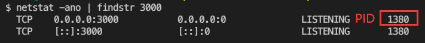
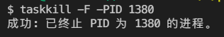

[TOC]

# node笔记

## __dirname和process.cwd()的区别

`process.cwd()` 返回当前命令行执行所在的目录。如：调用node命令执行脚本时的目录。
`__dirname ` 返回当前源代码所在的目录。

例如：对于d:\dir\index.js。

| **命令**          | **process.cwd()** | **__dirname** |
| ----------------- | ----------------- | ------------- |
| node index.js     | d:\dir            | d:\dir        |
| node dir\index.js | d:                | d:\dir        |


## 关闭程序端口占用

windows：

**占用查询端口的pid查询：**

```bash
netstat -ano | findstr 端口号
```




**关闭对应pid：**

```bash
taskkill -F -PID 对应的PID
```




## 定时任务

cron模块可以帮助我们在node中定时执行任务。如果定时需求是简单的 `setInterval()` 与 `setTimeout()` 计时器所无法满足的比较复杂的定时规则，可以使用cron来配置。

**安装**

```bash
npm install cron
```

**用法**

```js
var CronJob = require('cron').CronJob;
var job = new CronJob('* * * * * *', function() {
  console.log('You will see this message every second');
}, null, true, 'America/Los_Angeles');
job.start();
```

其中第一个参数'* * * * * *'为cron表达式。

例如：

- '* * * * * *' 为每秒钟执行一次；
- '*/30 * * * * *'为每30秒执行一次，会在每分钟的0秒和30秒执行；
- '* */30 8-18 * * *'每天的8点到18点的0分和30分执行；
- '* 15 10,18 * * *'每天的10点15分和18点15分执行。

**cron 表达式**

| 顺序         | 秒   | 分钟 | 小时 | 日期       | 月份 | 星期    | 年（可选）        |
| ------------ | ---- | ---- | ---- | ---------- | ---- | ------- | ----------------- |
| 取值         | 0-59 | 0-59 | 0-23 | 1-30（31） | 1-12 | 1-7     |                   |
| 允许特殊字符 | ,-*/ | ,-*/ | ,-*/ | ,-*/?LWC   | ,-*/ | ,-*/L#C | 1970-2099 , - * / |

**备注：和linux中不一样，linux只有5位，从分钟开始。**

[参考文档](https://www.npmjs.com/package/cron)


## child_process的exec和spawn方法的区别

Node.js的Child Processes模块(`child_process`)中，有两个类似的方法exec和spawn，都是通过生成子进程去执行指定的命令。两个方法除了使用方法稍有不同外，最大的区别就是二者的返回值不一样。 `child_process.exec`返回一个buffer，而`child_process.spawn`返回一个stream。


### exec方法

`child_process.exec`返回整个子进程处理时产生的buffer，这个buffer默认大小是200K。 当子进程返回的数据超过默认大小时，程序就会产生”Error: maxBuffer exceeded”异常。 调大exec的maxBuffer选项可以解决这个问题，不过当子进程返回的数据太过巨大的时候，这个问题还会出现。 因此当子进程返回的数据超过默认大小时，最好的解决方法是使用spawn方法。


### spawn方法

`child_process.spawn`返回`stdout`和`stderr`流对象。 程序可以通过`stdout`的`data`、`end`或者其他事件来获取子进程返回的数据。 使用spawn方法时，子进程一开始执行就会通过流返回数据，因此spawn适合子进程返回大量数据的情形。

与exec相比，spawn还可以对子进程进行更详细的设置。 例如使子进程在后台运行，成为一个daemon程序，不随着父进程的退出而退出。

```js
var app = spawn('node','main.js' {env:{detached:true}});
app.stderr.on('data',function(data) {
  console.log('Error:',data);
});

app.stdout.on('data',function(data) {
  console.log(data);
});

process.exit(0);
```

在执行子进程的时候设置`detached:true`选项，这样在父进程退出时，子进程不会退出继续执行。


### 总结

从实现原理来说，spawn是更底层的接口，exec对spawn进行了再次封装，提供了更简单的API接口。

- exec比spawn易于使用，当子进程返回的数据不超过200K时，exec比spawn更适合。
- 当子进程需要返回大量数据时，spawn更安全。
- spawn提供了更多的选项，可以对子进程进行更详细的设置。


## 静态资源的绝对路径与相对路径

**绝对路径：**

`http://example.com/main.css`

**相对路径：**

`../public/css/main.css`

在 file 协议中，相对于**当前文件**

在 http 协议中，相对于**当前网页的 url 地址**

| 网页url地址 | 相对路径               | 结果路径               |
| ----------- | ---------------------- | ---------------------- |
| /           | ../public/css/main.css | /public/css/main.css   |
| /a/b        | ../public/css/main.css | /public/css/main.css   |
| /a/b/c      | ../public/css/main.css | /a/public/css/main.css |

**备注：/a/b/c，相当于/a/b目录下的c文件。**


