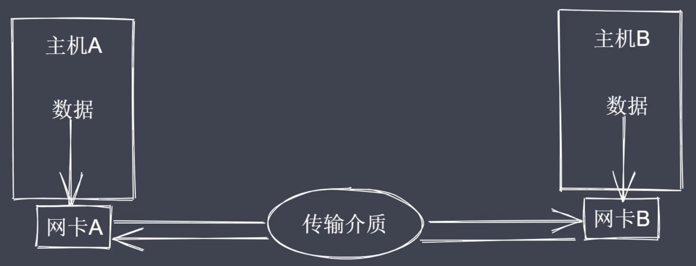
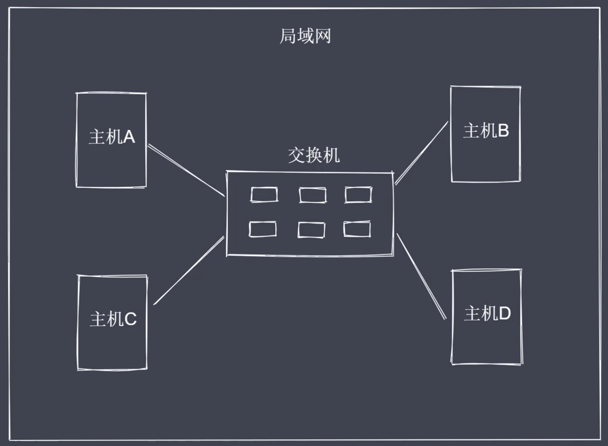
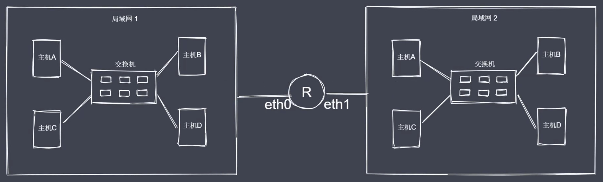
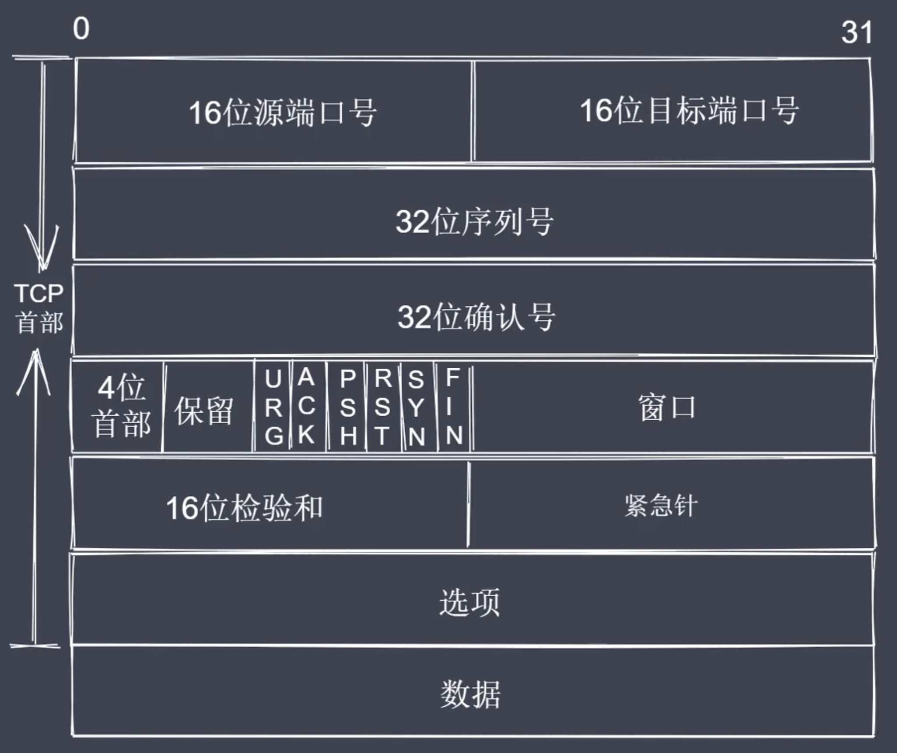
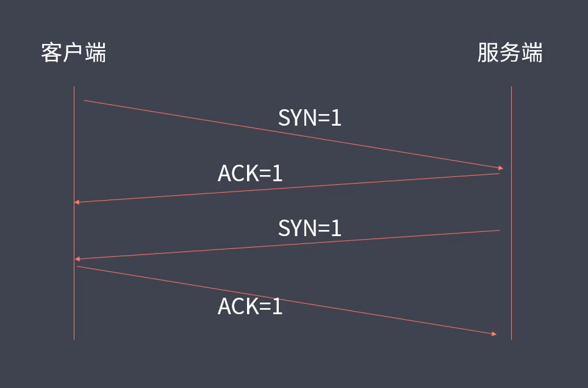

[TOC]

# node通信

## 网络通信基本原理

通信必要条件

- 主机之间需要有传输介质
- 主机上必须有网卡设备
- 主机之间需要协商网络速率




## 网络通信方式

常见通讯方式

- 交换机通讯
- 路由器通讯

如何建立多台主机互连



如何定位局域网中的其他主机
通过Mac地址（物理地址）来唯一标识一台主机
Mac地址：对于任意一台主机来说，都有一个唯一标识网卡设备的地址

交换机的接口数量有上限
局域网存在大量主机会造成广播风暴



明确目标主机IP地址


## 网络层次模型

OSI七层模型

- 应用层：用户与网络的接口
- 表示层：数据加密、转换、压缩
- 会话层：控制网络连接建立与终止
- 传输层：控制数据传输可靠性
- 网络层：确定目标网络
- 数据链路层：确定目标主机
- 物理层：各种物理设备和标准

数据从A至B,先封装再解封


## 数据封装与解封装

应用层 http协议（data）
传输层 TCP、UDP基于端口的协议，端口的作用：在主机上用于唯一确定的应用进程（目标端口、源端口、data）
网络层 主机处于不同的网络里，所以需用通过ip协议确定目标主机所在网络（目标IP、源IP、目标端口、源端口、data）
数据链路层 寻址操作（目标Mac、源Mac、目标IP、源IP、目标端口、源端口、data）
物理层 网线不能识别二进制（10001010…），经过网卡的调制会变成高低电压


## TCP三次握手与四次挥手

TCP协议

- TCP属于传输层协议
- TCP是面向连接的协议
- TCP用于处理实时通信



常见控制字段

- SYN=1表示请求建立连接
- FIN=1表示请求断开连接
- ACK=1表示数据信息确认



一个服务端会服务于多个客户端

TCP协议

- TCP处于传输层，基于端口，面向连接
- 主机之间要想通信需要建立双向数据通道
- TCP的握手和挥手本质上都是四次


## 创建TCP通信

Net模块实现了底层通信接口

通信过程

+ 创建服务端：接收和回写客户端数据
+ 创建客户端：发送和接收服务端数据
+ 数据传输：内置服务事件和方法读写数据


通信事件

+ listening事件：调用server.listen方法后触发
+ connection事件：新的连接建立时触发
+ close事件：当server关闭时触发
+ error事件：当错误出现的时候触发


通信事件&方法

+ data事件：当接收到数据的时候触发该事件
+ write方法：在socket上发送数据，默认是UTF8编码
+ end操作：当socket的一端发送FIN包时触发，结束可读端

```js
// client.jd
const net = require('net')

const client = net.createConnection({
  port: 1234, 
  host: '127.0.0.1'
})

client.on('connect', () => {
  client.write('拉勾教育')
})

client.on('data', (chunk) => {
  console.log(chunk.toString())
})

client.on('error', (err) => {
  console.log(err)
})

client.on('close', () => {
  console.log('客户端断开连接')
})
```

```js
// server.js
const net = require('net')

// 创建服务端实例
const server = net.createServer()

const PORT = 1234
const HOST = 'localhost'

server.listen(PORT, HOST)

server.on('listening', () => {
  console.log(`服务端已经开启在 ${HOST}: ${PORT}`)
})

// 接收消息 回写消息
server.on('connection', (socket) => {
  socket.on('data', (chunk) => {
    const msg = chunk.toString()
    console.log(msg)

    // 回数据
    socket.write(Buffer.from('您好' + msg))
  })
})

server.on('close', () => {
  console.log('服务端关闭了')
})

server.on('error', (err) => {
  if (err.code == 'EADDRINUSE') {
    console.log('地址正在被使用')
  }else{
    console.log(err)
  }
})
```


## TCP粘包及解决

TCP数据粘包
通信包含数据发送端与接收端
发送端累积数据统一发送
接收端缓冲数据之后再消费
TCP拥塞机制决定发送时机

```js
// client.js 不推荐
const net = require('net')

const client = net.createConnection({
  port: 1234, 
  host: '127.0.0.1'
})

let dataArr = [
  '拉勾教育2', 
  '拉勾教育3', 
  '拉勾教育4', 
  '拉勾教育5', 
]

client.on('connect', () => {
  client.write('拉勾教育1')
  for(let i=0; i<dataArr.length; i++) {
    (function (val, index) {
      setTimeout(() => {
        client.write(val)
      }, 1000 * (index +1))
    })(dataArr[i], i)
  }
})

client.on('data', (chunk) => {
  console.log(chunk.toString())
})

client.on('error', (err) => {
  console.log(err)
})

client.on('close', () => {
  console.log('客户端断开连接')
})
```


## 封包拆包实现

消息头（header）+ 消息体（body）
消息头分为：序列号+消息长度

数据传输过程

+ 进行数据编码，获取二进制数据
+ 按规则拆解数据，获取指定长度的数据


Buffer数据读写

+ writeInt6BE：将 value 从指定位置写入
+ readInt16BE：从指定位置开始读取数据

```js
//myTransform.js
class MyTransformCode{
  constructor() {
    this.packageHeaderLen = 4  // header总长度
    this.serialNum = 0 // 包的编号
    this.serialLen = 2 // 消息体里的长度
  }

  // 编码
  encode(data, serialNum) {
    const body = Buffer.from(data)

    // 01 先按照指定的长度来申请一片内存空间做为 header 来使用
    const headerBuf = Buffer.alloc(this.packageHeaderLen)

    // 02 
    headerBuf.writeInt16BE(serialNum || this.serialNum)

    headerBuf.writeInt16BE(body.length, this.serialLen)

    if (serialNum == undefined) {
      this.serialNum++
    }

    return Buffer.concat([headerBuf, body])
  }

  // 解码
  decode(buffer) {
    const headerBuf = buffer.slice(0, this.packageHeaderLen)
    const bodyBuf = buffer.slice(this.packageHeaderLen)

    return {
      serialNum: headerBuf.readInt16BE(),
      bodyLength: headerBuf.readInt16BE(this.serialLen),
      body: bodyBuf.toString()
    }
  }

  // 获取包长度的方法
  getPackageLen(buffer) {
    if (buffer.length < this.packageHeaderLen) {
      return 0
    } else {
      return this.packageHeaderLen + buffer.readInt16BE(this.serialLen)
    }
  }
}

module.exports = MyTransformCode
```

```js
//test.js
const MyTransform = require('./myTransform.js')

let ts = new MyTransform()

let str1 = '拉勾教育'

// console.log(Buffer.from(str1))
// console.log(ts.encode(str1, 1))

let encodeBuf = ts.encode(str1, 1)

/*let a = ts.decode(encodeBuf)
console.log(a) */

let len = ts.getPackageLen(encodeBuf)
console.log(len)
```


## 封包解决粘包

```js
// server.js
const net = require('net')
const MyTransform = require('./myTransform.js')

const server = net.createServer()

let overageBuffer = null
let ts = new MyTransform()

server.listen('1234', 'localhost')

server.on('listening', () => {
  console.log('服务端运行在 localhost:1234')
})

server.on('connection', (socket) => {
  socket.on('data', (chunk) => {
    if (overageBuffer) {
      chunk = Buffer.concat([overageBuffer, chunk])
    }
    let packageLen = 0
    while(packageLen = ts.getPackageLen(chunk)) {
      const packageCon = chunk.slice(0, packageLen)
      chunk = chunk.slice(packageLen)

      const ret = ts.decode(packageCon)
      console.log(ret)

      socket.write(ts.encode(ret.body, ret.serialNum))
    }
    overageBuffer = chunk
  })
})
```

```js
// client.js
const net = require('net')
const MyTransform = require('./myTransform.js')

let overageBuffer = null 
let ts = new MyTransform()

const client = net.createConnection({
  host: 'localhost', 
  port: 1234
})

client.write(ts.encode('拉勾教育1'))
client.write(ts.encode('拉勾教育2'))
client.write(ts.encode('拉勾教育3'))
client.write(ts.encode('拉勾教育4'))
client.write(ts.encode('拉勾教育5'))

client.on('data', (chunk) => {
  if (overageBuffer) {
    chunk = Buffer.concat([overageBuffer, chunk])
  }
  let packageLen = 0
  while(packageLen = ts.getPackageLen(chunk)) {
    const packageCon = chunk.slice(0, packageLen)
    chunk = chunk.slice(packageLen)

    const ret = ts.decode(packageCon)
    console.log(ret)
  }
  overageBuffer = chunk
})
```


## http协议

```js
// server.js
const net = require('net')

// 创建服务端
let server = net.createServer()
server.listen(1234, () => {
  console.log('服务端启动了....')
})

server.on('connection', (socket) => {
  socket.on('data', (data) => {
    console.log(data.toString())
  })
  socket.end('test http request')
})
```

浏览器中访问127.0.0.1:1234 请求

```js
const http = require('http')

// 创建服务端
let server = http.createServer((req, res) => {
  // 针对于请求和响应完成各自的操作
  console.log('1111')
})
server.listen(1234, () => {
  console.log('server is running......')
})
```


## 获取http请求信息

```js
const http = require('http')
const url = require('url')

const server = http.createServer((req, res) => {
  // console.log('请求进来了')

  // 请求路径
  let {pathname, query} = url.parse(req.url, true)
  console.log(pathname, '----', query)

  // 请求方式
  console.log(req.method)

  // 版本号
  // console.log(req.httpVersion)

  // 请求头
  // console.log(req.headers)

  // 请求体数据获取
  let arr = []
  req.on('data', (data) => {
    arr.push(data)
  })
  req.on('end', () => {
    console.log(Buffer.concat(arr).toString())
  })

})
server.listen(1234, () => {
  console.log('server is start......')
})
```


## 设置http响应

```js
const http = require('http')

const server = http.createServer((req, res) => {
  console.log('有请求进来了')

  // res
  // res.write('ok')
  // res.end()
  // res.end('test ok')
  res.statusCode = 302
  res.setHeader('Content-type', 'text/html;charset=utf-8')
  res.end('拉勾教育')
})

server.listen(1234, () => {
  console.log('server is start.....')
})
```


## 代理客户端

```js
// server.js
const http = require('http')
const url = require('url')
const querystring = require('querystring')

const server = http.createServer((req, res) => {
  // console.log('请求进行来了')
  let {pathname, query} = url.parse(req.url)
  console.log(pathname, '----', query)

  // post
  let arr = []
  req.on('data', (data) => {
    arr.push(data)
  })
  req.on('end', () => {
    let obj = Buffer.concat(arr).toString()
    // console.log(Buffer.concat(arr).toString())
    // console.log(req.headers['content-type'])
    if (req.headers['content-type'] == 'application/json') {
      let a = JSON.parse(obj)
      a.add = '互联网人的大学'
      res.end(JSON.stringify(a))
    }else if(req.headers['content-type'] == 'application/x-www-form-urlencoded') {
      let ret = querystring.parse(obj)
      res.end(JSON.stringify(ret))
    }
  })
})
server.listen(1234, () => {
  console.log('server is running')
})
```

```js
// client.js
const http = require('http')

// http.get({
//   host: 'localhost', 
//   port: 1234, 
//   path: '/?a=1'
// }, (res) => {
  
// })

let options = {
  host: 'localhost', 
  port: 1234, 
  path: '/?a=1', 
  method: 'POST', 
  headers:{
    // 'Content-type': 'application/json'
    'Content-type': 'application/x-www-form-urlencoded'
  }
}

let req = http.request(options, (res) => {
  let arr = []
  res.on('data', (data) => {
    arr.push(data)
  })
  res.on('end', () => {
    console.log(Buffer.concat(arr).toString())
  })
})
// req.end('拉勾教育')
// req.end('{"name":"lg"}')
req.end('a=1&b=2')
```


## 代理客户端解决跨域

```js
// agent-client.js
const http = require('http')

let options = {
  host: 'localhost', 
  port: 1234, 
  path: '/',
  method: 'POST'
}

let server = http.createServer((request, response) => {
  let req = http.request(options, (res) => {
    let arr = []
    res.on('data', (data) => {
      arr.push(data)
    })
    res.on('end', () => {
      // console.log(Buffer.concat(arr).toString())
      let ret = Buffer.concat(arr).toString()
      response.setHeader('Content-type', 'text/html;charset=utf-8')
      response.end(ret)
    })
  })
  
  req.end('拉勾教育')
})

server.listen(2345, () => {
  console.log('本地的服务端启动了')
})
```

```js
// server.js
const http = require('http')

const server = http.createServer((req, res) => {
  // console.log('请求进来了')
  let arr = []
  req.on('data', (data) => {
    arr.push(data)
  })
  req.on('end', () => {
    console.log(Buffer.concat(arr).toString())
    res.end('111111')
  })
})
server.listen(1234, () => {
  console.log('外部服务端启动了')
})
```


## Http静态服务

```js
const http = require('http')
const url = require('url')
const path = require('path')
const fs = require('fs')
const mime = require('mime') // 需要安装 npm install mime

const server = http.createServer((req, res) => {
  // console.log('请求进来了')
  // 1 路径处理
  let {pathname, query} = url.parse(req.url)
  pathname = decodeURIComponent(pathname)
  let absPath = path.join(__dirname, pathname)
  // console.log(absPath)
  // 2 目标资源状态处理
  fs.stat(absPath, (err, statObj) => {
    if(err) {
      res.statusCode = 404
      res.end('Not Found')
      return
    }
    if (statObj.isFile()) {
      // 此时说明路径对应的目标是一个文件，可以直接读取然后回写
      fs.readFile(absPath, (err, data) => {
        res.setHeader('Content-type', mime.getType(absPath) + ';charset=utf-8')
        res.end(data)
      })
    } else {
      fs.readFile(path.join(absPath, 'index.html'), (err, data) => {
        res.setHeader('Content-type', mime.getType(absPath) + ';charset=utf-8')
        res.end(data)
      })
    }
  })
})
server.listen(1234, () => {
  console.log('server is start.....')
})
```

