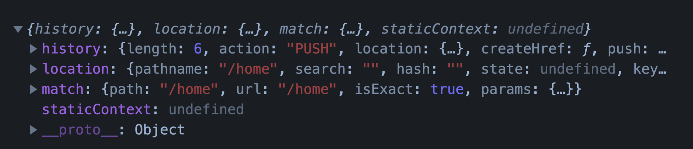

[TOC]

# React Hooks

## React Hooks 介绍

### React Hooks 是用来做什么的

对函数型组件进行增强, 让函数型组件可以存储状态, 可以拥有处理副作用的能力.

让开发者在不使用类组件的情况下, 实现相同的功能.


### 类组件的不足 (Hooks 要解决的问题)

#### 缺少逻辑复用机制

为了复用逻辑增加无实际渲染效果的组件，增加了组件层级 显示十分臃肿

增加了调试的难度以及运行效率的降低


#### 类组件经常会变得很复杂难以维护

将一组相干的业务逻辑拆分到了多个生命周期函数中

在一个生命周期函数内存在多个不相干的业务逻辑


#### 类成员方法不能保证this指向的正确性


## React Hooks 使用

Hooks 意为钩子, React Hooks 就是一堆钩子函数, React 通过这些钩子函数对函数型组件进行增强, 不同的钩子函数提供了不同的功能.

`useState()`

`useEffects()`

`useReducer()`

`useRef()`

`useCallback()`

`useContext()`

`useMemo()`


### useState()

用于为函数组件引入状态

```jsx
import React, { useState } from "react";

function App() {
  const [count, setCount] = useState(0);
  return (
    <div>
      <span>{count}</span>
      <button onClick={() => setCount(count + 1)}>+1</button>
    </div>
  );
}

```

1. 接收唯一的参数即状态初始值. 初始值可以是任意数据类型.

2. 返回值为数组. 数组中存储状态值和更改状态值的方法. 方法名称约定以set开头, 后面加上状态名称.

3. 方法可以被调用多次. 用以保存不同状态值.

4. 参数可以是一个函数, 函数返回什么, 初始状态就是什么, 函数只会被调用一次, 用在初始值是动态值的情况.


设置状态值方法的参数可以是一个值也可以是一个函数

设置状态值方法的方法本身是异步的


### useReducer()

useReducer是另一种让函数组件保存状态的方式.

```jsx
import React, { useReducer } from "react";

function reducer(state, action) {
  switch (action.type) {
    case "increment":
      return state + 1;
  }
}

function App() {
  const [count, dispatch] = useReducer(reducer, 0);
  return (
    <div>
      <span>{count}</span>
      <button onClick={() => dispatch({ type: "increment" })}>+1</button>
    </div>
  );
}

```


### useContext()

在跨组件层级获取数据时简化获取数据的代码.

```jsx
import React, { createContext, useContext } from "react";
const countContext = createContext()

function App() {
  return <countContext.Provider value={100}>
    <Foo />
  </countContext.Provider>
}

function Foo() {
  const count = useContext(countContext)
  return <div>{count}</div>
}

```


### useEffect()

让函数型组件拥有处理副作用的能力. 类似生命周期函数.


#### useEffect 执行时机

可以把 useEffect 看做 `componentDidMount`, `componentDidUpdate` 和 `componentWillUnmount` 这三个函数的组合.

`useEffect(() => {})`         =>     `componentDidMount`, `componentDidUpdate`

`useEffect(() => {}, [])`       =>    ` componentDidMount`

`useEffect(() => () => {})`     =>     `componentWillUnMount`


#### useEffect 解决的问题

1. 按照用途将代码进行分类 (将一组相干的业务逻辑归置到了同一个副作用函数中)

2. 简化重复代码, 使组件内部代码更加清晰


#### 只有指定数据发生变化时触发effect

```js
useEffect(()=>{
  document.title = count
}, [count])
```


#### useEffect 结合异步函数

useEffect中的参数函数不能是异步函数, 因为useEffect函数要返回清理资源的函数, 如果是异步函数就变成了返回Promise

```js
useEffect(()=>{
  (async () => {
    await axios.get()
  })()
})
```


### useMemo()

useMemo 的行为类似Vue中的计算属性, 可以监测某个值的变化, 根据变化值计算新值.

useMemo 会缓存计算结果. 如果监测值没有发生变化, 即使组件重新渲染, 也不会重新计算. 此行为可以有助于避免在每个渲染上进行昂贵的计算.

```js
import React, { useMemo } from "react";

const result = useMemo(() => {
  // 如果count值发生变化此函数重新执行
  return result;
}, [count]);

```


### memo 方法

性能优化, 如果本组件中的数据没有发生变化, 阻止组件更新. 类似类组件中的 PureComponent 和 shouldComponentUpdate

```jsx
import React, { memo } from "react";

function Counter() {
  return <div></div>;
}

export default memo(Counter);

```


### useCallback()

性能优化, 缓存函数, 使组件重新渲染时得到相同的函数实例.

```jsx
import React, { useState, useCallback } from "react";

function Counter() {
  const [count, setCount] = useState(0);
  const resetCount = useCallback(() => setCount(0), [setCount]);
  return <div>
    <span>{count}</span>
    <button onClick={()=> setCount(count+1)}>+1</button>
    <Test resetCount={resetCount}/>
  </div>;
}
```

```jsx
import React, { memo } from "react";

function Test(props) {
  console.log("Test re-render");
  return (
    <div>
      Test
      <button onClick={props.resetCount}>reset</button>
    </div>
  );
}

export default memo(Test);
```


### useRef()

获取DOM元素对象

```jsx
import React, { useRef } from "react";

function App() {
  const username = useRef();
  const handler = () => console.log(username); // {current: input}
  return <input ref={username} onChange={handler} />;
}
```


保存数据 (跨组件周期)

即使组件重新渲染, 保存的数据仍然还在. 保存的数据被更改不会触发组件重新渲染.

```jsx
import { useState, useEffect, useRef } from "react";

function App() {
  const [count, setCount] = useState(0);
  let timeId = useRef();
  useEffect(() => {
    timeId.current = setInterval(() => {
      setCount((count) => count + 1);
    }, 1000);
  }, []);

  const stopCount = () => {
    console.log(timeId);
    clearInterval(timeId.current);
  };
  return (
    <div>
      {count}
      <button onClick={stopCount}>stopCount</button>
    </div>
  );
}

export default App;
```


## **自定义** **Hook**

自定义 Hook 是标准的封装和共享逻辑的方式.

自定义 Hook 是一个函数, 其名称以 use 开头.

自定义 Hook 其实就是逻辑和内置 Hook 的组合.

```jsx
import { useState } from "react";

function useUpdateInput(initialState) {
  const [value, setValue] = useState(initialState);
  return {
    value,
    onChange: (event) => setValue(event.target.value),
  };
}

function App() {
  const usernameInput = useUpdateInput("");
  const passwordInput = useUpdateInput("");
  const submitForm = (event) => {
    event.preventDefault();
    console.log(usernameInput.value);
    console.log(passwordInput.value);
  };
  return (
    <form onSubmit={submitForm}>
      <input type="text" name="username" {...usernameInput} />
      <input type="password" name="password" {...passwordInput} />
      <input type="submit" />
    </form>
  );
}

export default App;
```


## React 路由 Hooks

### react-router-dom 路由提供的钩子函数

```js
import { useHistory, useLocation, useRouteMatch, useParams } from 'react-router-dom';
```




## 源码实现

```jsx
import React from "react";
import ReactDOM from "react-dom";

let state = [];
let setters = [];
let stateIndex = 0;

function createSetter(index) {
  return function (newState) {
    state[index] = newState;
    render();
  };
}

function useState(initalState) {
  state[stateIndex] = state[stateIndex] ? state[stateIndex] : initalState;
  setters.push(createSetter(stateIndex));
  let value = state[stateIndex];
  let setter = setters[stateIndex];
  stateIndex++;
  return [value, setter];
}

function render() {
  stateIndex = 0;
  effectIndex = 0;
  ReactDOM.render(<App />, document.getElementById("root"));
}

// 上一次的依赖值
let prevDepsAry = [];
let effectIndex = 0;
function useEffect(callback, depsAry) {
  // 判断 callback 是不是函数
  if (Object.prototype.toString.call(callback) !== "[object Function]") {
    throw new Error("useEffect函数的第一个参数必须是函数");
  }
  // 判断 depsAry 有没有传递
  if (typeof depsAry === "undefined") {
    // 没有传递
    callback();
  } else {
    // 判断 depsAry 是不是数组
    if (Object.prototype.toString.call(depsAry) !== "[object Array]") {
      throw new Error("useEffect函数的第二个参数必须是数组");
    }
    // 获取上一次的状态值
    let prevDeps = prevDepsAry[effectIndex];
    // 将当前的依赖值和上一次的依赖值做对比，如果有变化调用callback
    let hasChanged = prevDeps
      ? depsAry.every((dep, index) => (dep === prevDeps[index]) === false)
      : true;

    // 判断值是否有变化
    if (hasChanged) {
      callback();
    }
    // 同步依赖值
    prevDepsAry[effectIndex] = depsAry;
    effectIndex++;
  }
}

function useReducer(reducer, initialState) {
  const [state, setState] = useState(initialState);
  function dispatch(action) {
    const newState = reducer(state, action);
    setState(newState);
  }
  return [state, dispatch];
}

function App() {
  function reducer(state, action) {
    switch (action.type) {
      case "increment":
        return state + 1;
      case "decrement":
        return state - 1;
      default:
        return state;
    }
  }

  const [count, dispatch] = useReducer(reducer, 0);
  return (
    <div>
      {count}
      <button onClick={() => dispatch({ type: "increment" })}>+1</button>
      <button onClick={() => dispatch({ type: "decrement" })}>-1</button>
    </div>
  );
}

export default App;
```

