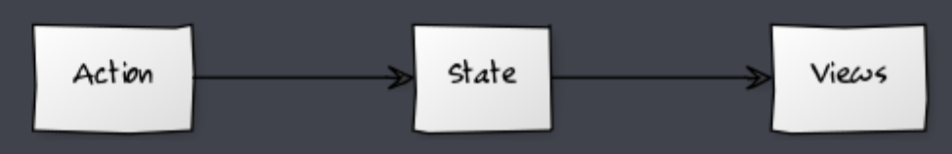

[TOC]

# mobx

## mobx 简介

### MobX 介绍

简单, 可扩展的状态管理库 

MobX 是由 Mendix，Coinbase，Facebook 开源和众多个人赞助商所赞助的 

React 和 MobX 是一对强力组合，React 负责渲染应用的状态，MobX 负责管理应用状态供 React 使用


### MobX 浏览器支持

MobX 5 版本运行在任何支持 ES6 proxy 的浏览器，不支持 IE11，Node.js 6 

MobX 4 可以运行在任何支持 ES5 的浏览器上 

MobX 4 和 5的 API 是相同的


## 开发前的准备

### 启用装饰器语法支持 (方式一)

1. 弹射项目底层配置：`npm run eject `
2. 下载装饰器语法babel插件：`npm install @babel/plugin-proposal-decorators `
3. 在 `package.json` 文件中加入配置

```json
"babel": {
    "plugins": [
        [
            "@babel/plugin-proposal-decorators",
            {
                "legacy": true
            }
        ]
    ]
}
```


### 启用装饰器语法支持 (方式二)

1. `npm install react-app-rewired customize-cra @babel/plugin-proposal-decorators` 
2. 在项目根目录下创建 `config-overrides.js` 并加入配置

```js
const { override, addDecoratorsLegacy } = require("customize-cra");

module.exports = override(addDecoratorsLegacy());
```

3. 更改 `package.json` 文件中的项目启动配置

```json
"scripts": {
  "start": "react-app-rewired start",
  "build": "react-app-rewired build",
  "test": "react-app-rewired test",
  "eject": "react-scripts eject"
}
```


### 解决 vscode 编辑器关于装饰器语法的警告

修改配置：`"javascript.implicitProjectConfig.experimentalDecorators": true`


## MobX + React

### 下载 MobX

```bash
npm install mobx mobx-react
```


### MobX 工作流程




### MobX 基本使用

**定义 Store 类**

```js
import { observable } from "mobx";
class BirdStore {
  @observable greeting = "Hello MobX";
  changeGreeting = () => {
    this.greeting = "Hi MobX";
  };
}
export default BirdStore;

```


**创建 Store 对象，通过 Provider 组件将 Store 对象放置在全局**

```jsx
import { Provider } from "mobx-react";
import BirdStore from "./stores/BirdStore";
const birdStore = new BirdStore();

ReactDOM.render(
  <Provider birdStore={birdStore}>
    <App />
  </Provider>,
  document.getElementById("root")
);

```


**将 Store 注入组件，将组件变成响应式组件**

```jsx
import { inject, observer } from "mobx-react";
@inject("birdStore")
@observer
class App extends Component {
  render() {
    const {
      bindStore: { greeting, changeGreeting },
    } = this.props;
    return (
      <div>
        {greeting}
        <button onClick={changeGreeting}>change</button>
      </div>
    );
  }
}
```


### 禁止普通方法更改可观察的状态

默认情况下任何方法都可以更改可观察的状态，可以通过配置约束状态只能通过 Action 函数更改

```js
import { observable, configure, action } from "mobx";
configure({ enforceActions: "observed" });
class BirdStore {
  @observable greeting = "Hello Mobx";
  @action changeGreeting = () => {
    this.greeting = "Hi MobX";
  };
}
```


### 更正 Action 函数中的 this 指向

在类中定义方法时，使用非箭头函数的定义方式时 this 指向为 undefined

```js
  @action.bound changeGreeting = () => {
    this.greeting = "Hi MobX";
  };
```


## MobX 异步

### runInAction

在 action 函数中如果存在异步代码，更新状态的代码就需要包裹在runInAction方法中

```js
class BirdStore {
  @observable person = {};
  @action.bound async loadPerson() {
    let response = await fetchData();
    runInAction(() => (this.person = response.data));
  }
}
```


### flow

flow方法中可以执行异步操作，可以直接进行状态的更改

```js
import { flow } from "mobx";
class BirdStore {
  @observable person = {};
  loadPerson = flow(function* () {
    let response = yield fetchData();
    this.person = response.data;
  }).bind(this);
}
```


## MobX 数据监测

### computed 计算值

计算值是可以根据现有的状态或其它计算值衍生出的值，将复杂的业务逻辑从模板中进行抽离。

**示例：**

```js
import { observable, action, computed } from "mobx";
class BirdStore {
  @observable count = 10;
  @observable price = 15;
  @computed get totalPrice() {
    return this.count * this.price;
  }
}
```


### autorun 方法

当监测的状态发生变化时，你想根据状态产生 "效果"，请使用 autorun。 autorun 会在初始化的时候执行一次，会在每次状态发生变化时执行。

```js
autorun(async ()=>{
  let response = await uniqueUsername(this.username)
}, {delay: 1500})
```
