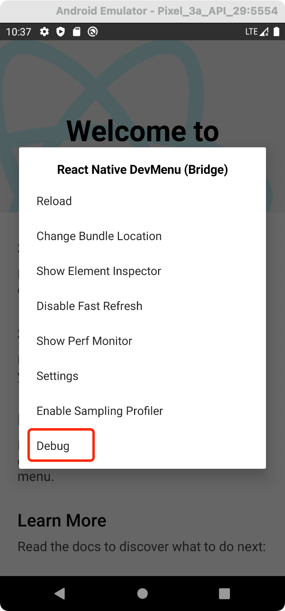
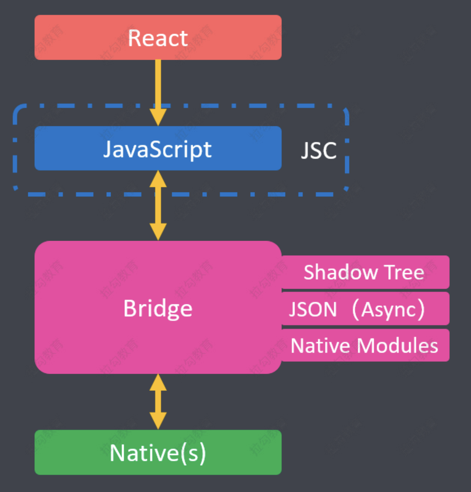
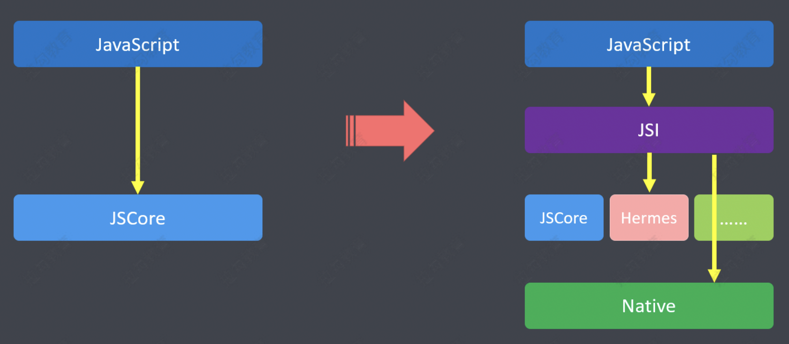

[TOC]

# react-native

## 概述

### 简介

React Native ( 简称 RN ) 是 Facebook 于2015年4月开源的跨平台移动应用开发框架，是 Facebook 早 先开源的 JS 框架 React 在原生移动应用平台的衍生产物，支持 iOS 和 Android 两大平台。RN 使用 Javascript 语言，因此熟悉 Web 前端开发的技术人员，只需很少的学习就可以进入移动应用开发领域。


### 原理 

RN 中的代码，经过转换后，会生成 Android 和 iOS 对应的原生代码。我们开发时，写的是 JavaScript，用的是 React 语法。项目编译后会生成两个环境下对应的代码。


## 环境搭建

RN 可以开发安卓和苹果应用。需要注意的是 

+ 在 Windows 下，只能搭建开发安卓应用的环境。而不能搭建开发苹果应用的环境 
+ 在 Mac 下，既可以搭建安卓应用的环境，又可以搭建开发苹果应用的环境 

RN 的 Android 和 iOS 这两种环境的搭建，会有差异。

[参考文档](https://reactnative.cn/docs/environment-setup)


## 调试工具

调试 RN 一般有两种方式：

+ 浏览器调试 
  + 点击模拟器（让模拟器获取焦点） 
  + ctrl+m 快捷键，打开菜单，然后点选 debug



然后会跳转到浏览器，在浏览器上你会看到如下效果。然后，在页面上右键，点“检查”。就可 以调试了


+ + 配置捕获网络请求 RN 发送的网络请求，默认是无法通过浏览器调试的。解决方案如下： 
  + 在入口文件（ index.js 或 App.js）中加入这一行

```js
GLOBAL.XMLHttpRequest = GLOBAL.originalXMLHttpRequest ||
GLOBAL.XMLHttpRequest
```


## StyleSheet

StyleSheet 是 RN 中用来声明样式的语法

### RN 中的样式与 CSS 的区别

+ RN 中的样式，没有继承性（子组件不能继承父组件的样式） 

  CSS：Cascading Style Sheet（级联样式表） 

  SS：Style Sheet（样式表）

+ 样式名称使用小驼峰式命名 

  例如：CSS 中的 font-size，在 RN 中写成 fontSize

+ 所有尺寸都是没有单位

  例如：width: 100 这是因为 RN 中尺寸只有一个单位，dp（ 一种基于屏幕密度的抽象单位，默认省略。详情查看 [pixelratio](https://reactnative.cn/docs/pixelratio)）

  ```jsx
  import { PixelRatio } from 'react-native';
  const dp2px = dp=>PixelRatio.getPixelSizeForLayoutSize(dp);
  const px2dp = px=>PixelRatio.roundToNearestPixel(px);
  // 按照下面的方式可实现 px 与 dp 之间的转换（比如 100px*200px 的 View）
  <View style={{width:px2dp(100),height:px2dp(200),backgroundColor:"red"}} />
  ```

+ RN 中有些样式名的写法与 CSS 不同 

  例如：marginVertical、marginHorizontal


### RN 样式的声明方式

+ 通过 style 属性直接声明

  + 属性值是对象

  ```jsx
  // 基本用法
  <Text style={{color: '#e33', fontSize: 30}}> Hello World </Text>
  // 越靠后的样式，优先级越高；下面字体显示为蓝色
  <Text style={{color: 'red', color: 'blue',}}> Hello World </Text>
  ```

  + 属性值是数组

  ```jsx
  // 数组元素是对象，这样可以传入多个样式对象，方便构造复杂的样式效果
  <Text style={[{fontSize: 40}, {color: 'green'}]}> Hello World </Text>
  ```

+ 通过 StyleSheet 声明（推荐）

  ```jsx
  // 引入 StyleSheet
  import {Text, StyleSheet} from 'react-native';
  <View style={styles.container}>
    <Text style={styles.red}>Hello World</Text>
    {/* 数组中可以传入多个样式 */}
    <Text style={[styles.red, styles.fontLarge]}>Hello RN</Text>
    <Text style={[styles.red, styles.fontMedium]}>Hello RN</Text>
    <Text style={[styles.red, styles.fontSmall]}>Hello RN</Text>
  </View>;
  // 通过 StyleSheet.create({}) 创建样式，与组件内容分开（使用 StyleSheet 之前要先引入）
  const styles = StyleSheet.create({
    container: {
      marginTop: 50,
    },
    red: {
      color: 'red',
    },
    fontLarge: {
      fontSize: 40,
    },
    fontMedium: {
      fontSize: 30,
    },
    fontSmall: {
      fontSize: 20,
    },
  });
  
  ```

另外，在实际开发中。样式值还可以通过变量的方式指定，例如：

```jsx
<View
	style={[styles.base, {
		width: this.state.width,
		height: this.state.width * this.state.aspectRatio
	}]}
/>
```

> 注意：RN 中的样式不支持 Less 或 Sass 中的 MIxin 特性（这也是一直被吐槽的）


## Flexbox

Web 和 RN 开发中的区别是：


**注意：Web 开发中默认的主轴方向是 row，而 RN 中默认的主轴方向是 column**


## 响应式布局

+ Flexbox
+ Dimensions

Dimensions 模块用于获取设备屏幕的宽高。

你可以用下面的方法来获取设备的宽高：

```jsx
import { Dimensions } from 'react-native';
const windowWidth = Dimensions.get('window').width;
const windowHeight = Dimensions.get('window').height;
```

获取屏幕尺寸之后，我们可以根据屏幕尺寸做一些适配工作。例如：将屏幕三等分。

```jsx
width: Dimensions.get('window').width / 3
```

示例：

```jsx
import {Text, View, Dimensions, StyleSheet} from 'react-native';
import React, {Component} from 'react';

const windowWidth = Dimensions.get('window').width;
const windowHeight = Dimensions.get('window').height;

export default class Index extends Component {
  render() {
    return (
      <View style={[styles.container]}>
        <View style={[styles.itemBase]}>
          <Text style={[styles.h3]}t>扫一扫</Text>
        </View>
        <View style={[styles.itemBase]}>
          <Text style={[styles.h3]}>卡包</Text>
        </View>
        <View style={[styles.itemBase]}>
          <Text style={[styles.h3]}>卡包</Text>
        </View>
        <View style={[styles.itemBase]}>
          <Text style={[styles.h3]}>出行</Text>
        </View>
      </View>
    );
  }
}

const styles = StyleSheet.create({
  container: {
    flexDirection: 'row',
  },
  itemBase: {
    justifyContent: 'center',
    alignItems: 'center',
    backgroundColor: '#00b38a',
    width: windowWidth / 4,
    height: 90,
    borderWidth: 1,
    borderColor: 'yellow',
  },
  h3:{
    fontSize: 30,
    color: 'red'
  }
});
```

效果：


## 组件和 API

### 简介

在 React Native 项目中，所有展示的界面，都可以看做是一个组件（Component），只是功能和逻辑 上的复杂程度不同。


### 原生组件

在 Android 开发中是使用 Kotlin 或 Java 来编写视图；在 iOS 开发中是使用 Swift 或 Objective-C 来编写 视图。在 React Native 中，则使用 React 组件通过 JavaScript 来调用这些视图。在运行时，React Native 为这些组件创建相应的 Android 和 iOS 视图。由于 React Native 组件就是对原生视图的封装， 因此使用 React Native 编写的应用外观、感觉和性能与其他任何原生应用一样。我们将这些平台支持的 组件称为原生组件。


React Native 允许您为 Android 和 iOS 构建自己的 Native Components（原生组件）。


### 核心组件

React Native 还包括一组基本的，随时可用的原生组件，您可以使用它们来构建您的应用程序。这些是 React Native 的 **核心组件。（来自 react-native 的组件叫核心组件）**

```jsx
import {Animated, Text, View, StyleSheet, Button} from 'react-native';
```


### 第三方组件 

不在 react-native 中的，需要单独安装，然后才能使用的组件


### 自定义组件

一般指，具有特定功能的，由工程师自己写的，在项目中需要重复使用的组件


### 常用组件

#### View

相当于 HTML 中的 div，用来展示内容

```jsx
import { View } from 'react-native'
<View>{/* 内容 */}</View>
```


#### SafeAreaView 

用法与 View 一致，只是 SafeAreaView 可以避开 **刘海（挖空屏幕）**


#### Text

用来展示文本信息（RN 中所有的文本，必须包含在 Text 标签中）

```jsx
import { Text } from 'react-native'
<Text>文本内容</Text>
<Text
	style={[styles.newsItemHeader]} // 样式
	numberOfLines={2} // 文本显示的行数
	ellipsizeMode="tail" // 从文本的末尾进行截断
	onPress={() => alert('点击')}
	onLongPress={() => alert('长按点击')}
>
文本内容
</Text>
```

> ellipsizeMode 的取值为 enum('head', 'middle', 'tail', 'clip'), 用来设定当文本显示不下全部内容 时，文本应该如何被截断，需要注意的是，它必须和 numberOfLines（文本显示的行数）搭配使 用，才会发挥作用。
>
> + head：从文本的开头进行截断，并在文本的开头添加省略号，例如：...xyz。 
> + middle ：从文本的中间进行截断，并在文本的中间添加省略号，例如：ab...yz。 
> + tail：从文本的末尾进行截断，并在文本的末尾添加省略号，例如：abcd...。 clip ：文本的末尾显示不下的内容会被截断，并且不添加省略号，
> + clip只适用于iOS平台。


#### Button

```jsx
import { Button } from 'react-native'
<Button
	onPress={onPressLearnMore}
	title="Learn More"
	color="#841584"
/>
```

> Button 组件不能使用 style 属性


#### Alert

引入

```jsx
import { Alert } from 'react-native'
```

基础用法

```jsx
Alert.alert('This is a button!')
```


两个按钮

```jsx
Alert.alert(
	"警告标题",
	"警告内容",
	[
		{
			text: "取消",
			onPress: () => console.log("Cancel Pressed"),
			style: "cancel"
		},
		{ text: "确认", onPress: () => console.log("OK Pressed") }
	]
);
```

三个按钮

```jsx
Alert.alert(
	"更新提醒",
	"发现新版本，是否现在更新",
	[
		{
			text: "稍后再说",
			onPress: () => console.log("Ask me later pressed")
		},
		{
			text: "取消",
			onPress: () => console.log("Cancel Pressed"),
			style: "cancel"
		},
		{ text: "确认", onPress: () => console.log("OK Pressed") }
	]
);
```


#### Switch

开关按钮，类似HTML 中的 CheckBox 

引入

```jsx
import { Switch } from 'react-native';
```

使用

```jsx
<Switch
	trackColor={{ false: "#999", true: "#666" }} // 背景色
	thumbColor={this.state.hideStatusBar ? "red" : "white"} // 前景色
	ios_backgroundColor="#3e3e3e"
	value={this.state.hideStatusBar}
	onValueChange={this.toggleStatusBar} // 开关处理函数
/>
```


#### StatusBar

状态栏位于手机的顶部，一般用来显示网络信号，时间，电量等信息。在 RN 可以通过 StatusBar 来控 制状态栏 

引入

```jsx
import { StatusBar } from 'react-native'
```

使用

```jsx
<StatusBar
	backgroundColor="blue" // 设置背景色，仅在 Android 下有效
	animated={false}
	hidden={this.state.hideStatusBar} // 是否隐藏 StatusBar
/>
```


#### ActivityIndicator

引入

```jsx
import { ActivityIndicator } from 'react-native'
```

使用

```jsx
<ActivityIndicator size="large" color="#0000ff" />
<ActivityIndicator size="small" color="#00ff00" />
<ActivityIndicator size={70} color="#00d0ff" />
<ActivityIndicator size={100} color="red" />
```

> Android VS iOS 下的效果（使用数字来声明大小，仅在 Android 下有效。）


#### Image 

用来展示图片。图片路径有三种情况： 

本地路径

```jsx
<Image
	style={styles.slideItem}
	source={require('../../images/1.jpg')}
/>
```

> 图片地址只支持静态地址的写法。不支持变量拼接 
>
> 例如，如下写法无效： 
>
> source={require('../../images/' + imagename + '.jpg')}

URL 地址

```jsx
<Image
	style={styles.mediumLogo}
	source={{
		uri: 'https://reactnative.dev/img/tiny_logo.png',
	}}
/>
```

Base64 字符串

```jsx
<Image
	style={styles.logo}
	source={{
uri:'data:image/png;base64,iVBORw0KGgoAAAANSUhEUgAAADMAAAAzCAYAAAA6oTAqAAAAEXRFWHRTb2Z0d2FyZQBwbmdjcnVzaEB1SfMAAABQSURBVGje7dSxCQBACARB+2/ab8BEeQNhFi6WSYzYLYudDQYGBgYGBgYGBgYGBgYGBgZmcvDqYGBgmhivGQYGBgYGBgYGBgYGBgYGBgbmQw+P/eMrC5UTVAAAAABJRU5ErkJggg==',
	}}
/>
```


#### TextInput

RN 中的 TextInput 支持多种表单类型，例如：普通输入框，密码框，文本域等。不同类型的表单是通过 不同的属性来实现的。

```jsx
import React, {Component} from 'react';
import {
  Text,
  StyleSheet,
  View,
  TextInput,
  Dimensions,
  Button,
} from 'react-native';
export default class index extends Component {
  constructor() {
    super();
    this.state = {
      username: '',
      password: '',
    };
  }
  doLogin = () => {
    alert(this.state.username);
  };
  render() {
    return (
      <View style={[styles.container]}>
        <TextInput
          style={[styles.input]} // 表单样式
          placeholder="请输入用户名" // 文字提示
          value={this.state.username} // 表单的值
          onChangeText={val => {
            // 内容变更的处理函数
            this.setState({
              username: val,
            });
          }}
        />
        <TextInput
          style={[styles.input]}
          placeholder="请输入密码"
          value={this.state.password}
          secureTextEntry={true} // 启用加密效果
          onChangeText={val => {
            this.setState({
              password: val,
            });
          }}
        />
        <TextInput
          style={[styles.input]}
          placeholder="手机号"
          keyboardType="number-pad" // 使用数字键盘
        />
        <TextInput
          style={[styles.input]}
          placeholder="请输入自我介绍"
          multiline={true} // 启动多行
          numberOfLines={5} // 指定文本域的行数
          textAlignVertical="top" // 在 Android 中，使文本顶部对齐（默认垂直居中）
        />
        <View style={[styles.btn]}>
          <Button title="登陆" onPress={this.doLogin} />
        </View>
      </View>
    );
  }
}
const styles = StyleSheet.create({
  container: {
    flex: 1,
    justifyContent: 'center',
  },
  input: {
    width: Dimensions.get('window').width - 20,
    margin: 10,
    borderWidth: 1,
    borderColor: 'red',
    paddingHorizontal: 5,
  },
  btn: {
    margin: 10,
  },
});
```


#### Touchable

引入

```jsx
import {
	TouchableHighlight, // 触碰高亮显示（背景高亮）
	TouchableOpacity, // 触碰透明显示（透明度发生变化）
	TouchableWithoutFeedback // 触碰无反馈
} from 'react-native'
```

使用

```jsx
<TouchableHighlight onPress={() => this.highlight()}>
	<View style={[styles.item]}>
		<Text style={[styles.h3]}>触碰高亮</Text>
	</View>
</TouchableHighlight>
<TouchableOpacity onPress={() => this.opacity()}>
		<View style={[styles.item]}>
		<Text style={[styles.h3]}>触碰透明度</Text>
</View>
</TouchableOpacity>
<TouchableWithoutFeedback onPress={() => this.withoutFeedback()}>
	<View style={[styles.item]}>
		<Text style={[styles.h3]}>触碰无反馈</Text>
	</View>
</TouchableWithoutFeedback>
```

> 触碰插件一般与事件一起使用


#### ScrollView

View 没有滚动功能。当内容超出可视区域后。就无法正常显示。此时，我们可以用滚动视图 （ScrollView）来显示内容。

引入

```jsx
import { ScrollView } from 'react-native';
```

使用

```jsx
<ScrollView
	style={{backgroundColor: '#dfb'}} // 指定样式
	horizontal={true} // 是否水平方向滚动。默认是垂直方向
	contentContainerStyle={{margin: 30}} // 设置内容样式
	showsVerticalScrollIndicator={false} // 是否展示垂直方向的滚动条
	showsHorizontalScrollIndicator={false} // 是否显示水平方向的滚动条
>
</ScrollView>
```


SectionList

SectionList 将列表分成若干个章节，每个章节有一个标题。支持下面这些常用的功能：

+ 完全跨平台。 
+ 行组件显示或隐藏时可配置回调事件。 
+ 支持单独的头部组件。 
+ 支持单独的尾部组件。 
+ 支持自定义行间分隔线。
+  支持分组的头部组件。 
+ 支持分组的分隔线。 
+ 支持多种数据源结构 。
+ 支持下拉刷新。
+  支持上拉加载。


引入

```jsx
import { SectionList } from "react-native";
```

使用

```jsx
import {Text, View, StyleSheet, SectionList} from 'react-native';
import React, {Component} from 'react';

const DATA = [
  {
    title: 'Main dishes',
    data: ['Pizza', 'Burger', 'Risotto'],
  },
  {
    title: 'Sides',
    data: ['French Fries', 'Onion Rings', 'Fried Shrimps'],
  },
  {
    title: 'Drinks',
    data: ['Water', 'Coke', 'Beer'],
  },
  {
    title: 'Desserts',
    data: ['Cheese Cake', 'Ice Cream'],
  },
];

const Item = ({title}) => (
  <View style={styles.item}>
    <Text style={styles.title}>{title}</Text>
  </View>
);

export default class sectionlist extends Component {
  constructor() {
    super();
    this.state = {
      isFresh: false,
    };
  }

  loadData = () => {
    this.setState({
      isFresh: true,
    });

    setTimeout(() => {
        this.setState({isFresh: false})
    }, 2000)
  };

  render() {
    return (
      <View>
        <SectionList
          sections={DATA}
          keyExtractor={(item, index) => item + index} // 设置唯一 key
          renderItem={({item}) => <Item title={item} />}
          renderSectionHeader={({section: {title}}) => (
            <Text style={styles.header}>{title}</Text>
          )}
          // 声明项目之间的分隔符
          ItemSeparatorComponent={() => {
            return (
              <View
                style={{borderBottomWidth: 1, borderBottomColor: 'red'}}></View>
            );
          }}
          // 列表数据为空时，展示的组件
          ListEmptyComponent={() => {
            return <Text>空空如也</Text>;
          }}
          // 下拉刷新
          refreshing={this.state.isFresh}
          onRefresh={this.loadData}

          // 上拉刷新
          onEndReachedThreshold={0.1} // 声明触底的比率，0.1 表示距离底部还有 10%
          onEndReached={()=>{
            alert('到底了')
          }}

          // 声明列表的头部
          ListHeaderComponent={()=>{
            return <Text>头部</Text>
          }}
          // 声明列表的底部
          ListFooterComponent={()=>{
            return <Text>底部</Text>
          }}
        />
      </View>
    );
  }
}

const styles = StyleSheet.create({
  container: {
    flex: 1,
    marginHorizontal: 16,
  },
  item: {
    backgroundColor: '#f9c2ff',
    padding: 20,
    marginVertical: 8,
  },
  header: {
    fontSize: 32,
    backgroundColor: '#fff',
  },
  title: {
    fontSize: 24,
  },
});

```


#### FlatList

FlatList 用来渲染列表。具有如下特点： 

+ 完全跨平台 
+ 支持垂直（默认）和水平两个方向的列表 
+ 可配置显示或隐藏的回调事件 
+ 支持自定义 Header 
+ 支持自定义 Footer 
+ 支持自定义行与行之间的分割线 
+ 下拉刷新 
+ 上拉刷新 
+ 支持跳到指定行 
+ 支持多列显示

代码演示

```jsx
import React, {Component} from 'react';
import {
  Text,
  StyleSheet,
  View,
  FlatList,
  StatusBar,
  RefreshControl,
  TouchableOpacity,
} from 'react-native';
export default class FlatListDemo extends Component {
  constructor(props) {
    super(props);
    this.state = {
      isLoading: false,
      list: [
        {
          id: '1',
          title: 'Item 1',
        },
        {
          id: '2',
          title: 'Item 2',
        },
        {
          id: '3',
          title: 'Item 3',
        },
        {
          id: '4',
          title: 'Item 4',
        },
        {
          id: '5',
          title: 'Item 5',
        },
        {
          id: '6',
          title: 'Item 6',
        },
        {
          id: '7',
          title: 'Item 7',
        },
        {
          id: '8',
          title: 'Item 8',
        },
        {
          id: '9',
          title: 'Item 9',
        },
      ],
      selectedId: null,
    };
  }

  renderItem = ({index, item}) => {
    const backgroundColor =
      item.id === this.state.selectedId ? '#dfb' : '#f9c2ff';
    return (
      <TouchableOpacity
        style={[styles.item, {backgroundColor}]}
        onPress={() => {
          this.setState({selectedId: item.id});
        }}>
        <Text style={styles.title}>{item.title}</Text>
      </TouchableOpacity>
    );
  };
  reachBottom = () => {
    alert('到底了');
  };

  loadData = () => {
    this.setState({
      isLoading: true,
    });
    // 模拟网络请求
    setTimeout(() => {
      // 模拟请求数据
      alert('刷新请求数据');
      this.setState({
        isLoading: false,
      });
    }, 2000);
  };
  render() {
    return (
      <FlatList
        ListHeaderComponent={() => {
          // 自定义头部
          return (
            <View style={[styles.header]}>
              <Text style={{fontSize: 30}}>列表头部</Text>
            </View>
          );
        }}
        // stickyHeaderIndices={[0]} // 置顶索引
        initialScrollIndex={0} // 初始索引
        initialNumToRender={4} // 指定初始渲染数据的数量，一般数量要填满一屏幕
        data={this.state.list} // 数据
        renderItem={this.renderItem} // 渲染项目
        keyExtractor={item => item.id} // 唯一索引
        inverted={false} // 是否反转列表
        extraData={this.setState.selectedId}
        ItemSeparatorComponent={() => {
          // 分割线
          return <View style={[styles.separator]}></View>;
        }}
        onEndReached={() => {
          // 触底事件（上拉刷新）
          this.reachBottom();
        }}
        onEndReachedThreshold={0.1} // 声明距离底部的比率
        horizontal={false} // 是否水平
        numColumns={1} // 列数
        // 下拉刷新
        refreshing={this.state.isLoading}
        onRefresh={() => {
          this.loadData(); // 下拉刷新加载数据
        }}
        // 设置刷新样式
        refreshControl={
          <RefreshControl
            title={'Loading'} // android中设置无效
            colors={['red']} // android
            tintColor={'red'} // ios
            titleColor={'red'}
            refreshing={this.state.isLoading}
            onRefresh={() => {
              this.loadData(); // 下拉刷新加载数据
            }}
          />
        }
        ListFooterComponent={() => {
          // 自定义尾部
          return <Text style={[styles.footer]}>---- 没有更多了 ----</Text>;
        }}
      />
    );
  }
}

const styles = StyleSheet.create({
  container: {
    flex: 1,
    marginTop: StatusBar.currentHeight || 0,
  },
  item: {
    backgroundColor: '#f9c2ff',
    padding: 20,
    marginVertical: 8,
    marginHorizontal: 16,
  },
  title: {
    fontSize: 32,
  },
  header: {
    fontSize: 20,
    margin: 20,
  },
  footer: {
    fontSize: 20,
    textAlign: 'center',
    marginVertical: 40,
  },
  separator: {
    borderBottomWidth: 1,
    borderBottomColor: 'red',
    marginHorizontal: 10,
  },
});
```


#### Animated

Animated 库旨在使动画变得流畅，强大并易于构建和维护。 Animated 侧重于输入和输出之间的声明性 关系，以及两者之间的可配置变换，此外还提供了简单的 `start/stop` 方法来控制基于时间的动画执 行。

创建动画最基本的工作流程是:

+ 先创建一个 Animated.Value ，将它连接到动画组件的一个或多个样式属性，

  在 RN 中有两种值可以用于 Animated 中，分别是：

  + `Animated.Value()` -- 单个值
  + `Animated.ValueXY()` -- 向量值

+ 然后使用 Animated.timing() 通过动画效果展示数据的变化。

  Animated 提供了三种动画类型。

  > 每种动画类型都提供了特定的函数曲线，用于控制动画值从初始值变化到最终值的变化过 程：

  + `Animated.decay()` **加速效果** - 以指定的初始速度开始变化，然后变化速度越来越慢直至停 下。
  + `Animated.spring()` **弹跳效果** - 提供一个简单的弹簧物理模型 
  + `Animated.timing()` **时间渐变效果** - 通过 easing函数 在一定时间内，演绎一个动画

  > 最常用的函数是 timing()


Animated 中默认导出了以下这些，可以直接使用的动画组件：

+ Animated.Image 
+ Animated.ScrollView 
+ Animated.Text 
+ Animated.View


动画组合：动画还可以使用组合函数以复杂的方式进行组合： 

+ `Animated.delay()` 在给定延迟后开始动画。 
+ `Animated.parallel()` 同时启动多个动画。 
+ `Animated.sequence()` 按顺序启动动画，等待每一个动画完成后再开始下一个动画。 
+ `Animated.stagger()` 按照给定的延时间隔，顺序并行的启动动画。


引入

```jsx
import { Animated, Text, View, StyleSheet, Button, Easing } from "react-native";
```

使用

```jsx
import React, {Component} from 'react';
import {Animated, Text, View, StyleSheet, Button} from 'react-native';

class App extends Component {
  // fadeAnim will be used as the value for opacity. Initial Value: 0
  state = {
    fadeAnim: new Animated.Value(0),
    moveAnim: new Animated.Value(0),
  };

  fadeIn = () => {
    // Will change fadeAnim value to 1 in 5 seconds
    Animated.timing(this.state.fadeAnim, {
      toValue: 1, // 目标值
      duration: 5000, // 动画执行时间
      useNativeDriver: true, // 启用原生方式，渲染动画（执行效率更高）
    }).start(() => {
      // 动画执行结束后的回调函数
      alert('我显示出来了');
    });
  };

  fadeOut = () => {
    // Will change fadeAnim value to 0 in 5 seconds
    Animated.timing(this.state.fadeAnim, {
      toValue: 0,
      duration: 5000,
      useNativeDriver: true, // 启用原生方式，渲染动画（执行效率更高）
    }).start(() => {
      // 动画执行结束后的回调函数
      alert('我隐藏起来了');
    });
  };

  componentDidMount() {
    this.scanMove();
  }

  scanMove = () => {
    // 将 moveAnim 初始值设置为 0
    this.state.moveAnim.setValue(0);
    Animated.timing(this.state.moveAnim, {
      toValue: 200,
      duration: 2000,
      useNativeDriver: true,
    }).start(this.scanMove);
  };

  render() {
    return (
      <View style={styles.container}>
        <Animated.View
          style={[
            styles.fadingContainer,
            {
              opacity: this.state.fadeAnim, // Bind opacity to animated value
            },
          ]}>
          <Text style={styles.fadingText}>Fading View!</Text>
        </Animated.View>
        <View style={styles.buttonRow}>
          <Button title="Fade In" onPress={this.fadeIn} />
          <Button title="Fade Out" onPress={this.fadeOut} />
        </View>
        <View style={[styles.scanContainer]}>
          <Animated.View
            style={[
              styles.border,
              {
                transform: [
                  {
                    translateY: this.state.moveAnim,
                  },
                ],
              },
            ]}></Animated.View>
        </View>
      </View>
    );
  }
}

const styles = StyleSheet.create({
  container: {
    flex: 1,
    alignItems: 'center',
    justifyContent: 'center',
  },
  fadingContainer: {
    paddingVertical: 8,
    paddingHorizontal: 16,
    backgroundColor: 'powderblue',
  },
  fadingText: {
    fontSize: 28,
    textAlign: 'center',
    margin: 10,
  },
  buttonRow: {
    flexDirection: 'row',
    marginVertical: 16,
  },
  scanContainer: {
    height: 200,
    width: 200,
    borderWidth: 1,
    borderColor: 'green',
  },
  border: {
    borderWidth: 1,
    borderColor: 'red',
  },
});

export default App;
```


#### Platform

Platform 模块可以区分平台，来完成针对平台的定制代码。例如：Platform.OS 会返回 ios 或 android

```jsx
import { Platform, StyleSheet } from 'react-native';
const styles = StyleSheet.create({
	height: Platform.OS === 'ios' ? 200 : 100
});
```


#### WebView

WebView 相当于 RN 中的内置浏览器，我们写的 H5 的代码，可以直接在 WebView 中直接运行。该组 件之前在 RN 核心中。现在已经单独维护了。

安装

```bash
yarn add react-native-webview
```

链接原生代码

React Native 模块包括 Objective-C, Swift, Java, or Kotlin 等原生代码，我们必须将其”链接“，然 后，编译器才会在应用中使用。

```bash
react-native link react-native-webview
```

> 如果需要取消链接，请执行：react-native unlink react-native-webview


**iOS 应用**

如果你在 iOS 下，请在 ios/ 或 macos/ 目录下运行

```bash
cd ios && pod install && cd ../
```


**Android 应用** 

如果 react-native-webview 的版本 < 6，则无需任何操作 

如果 react-native-webview 的版本 >= 6，请确保 AndroidX 在项目中已启动。具体做法是在 **android/gradle.properties** 中添加如下两行

```bash
android.useAndroidX=true
android.enableJetifier=true
```

上述链接操作完成后，我们就可以启动应用了 

iOS：`yarn ios `

Android：`yarn android`


使用

直接填写网址

```jsx
import React, {Component} from 'react';
import {WebView} from 'react-native-webview';
class MyWeb extends Component {
  render() {
    return (
      <WebView source={{uri: 'https://infinite.red'}} style={{marginTop: 20}} />
    );
  }
}
```

或者直接写 HTML 代码

```jsx
import React, {Component} from 'react';
import {WebView} from 'react-native-webview';
class MyInlineWeb extends Component {
  render() {
    return (
      <WebView
        originWhitelist={['*']}
        source={{html: '<h1>Hello world</h1>'}}
      />
    );
  }
}
```


#### Picker

Picker 相当于 HTML 中的下拉框。react-native@0.60.0 之前在 RN 核心中。现在已经单独维护了

安装

```bash
yarn add @react-native-picker/picker
```

在 iOS 下，还需要执行

```bash
pod-install
```

使用

```jsx
import {Text, View} from 'react-native';
import React, {Component} from 'react';
import {Picker} from '@react-native-picker/picker';

export default class picker extends Component {
  state = {
    gender: 0, // 在状态中指定性别
  };
  render() {
    return (
      <Picker
        selectedValue={this.state.gender} // 选中的值
        style={{height: 50, width: 100}}
        mode={'dialog'} // mode 属性只在 Android 下有效
        onValueChange={(itemValue, itemIndex) =>
          this.setState({gender: itemValue})
        }>
        <Picker.Item label="保密" value="0" enabled={false}/>
        <Picker.Item label="男" value="1" />
        <Picker.Item label="女" value="2" />
      </Picker>
    );
  }
}
```


#### Swiper

在 React Native 中，实现轮播图常用的组件是 react-native-swiper

安装

```bash
npm i react-native-swiper --save
```

使用

```jsx
import React, {Component} from 'react';
import {StyleSheet, View, ScrollView, Image, Dimensions} from 'react-native';
import Swiper from 'react-native-swiper';
export default class SwiperDemo extends Component {
  render() {
    return (
      <View>
        <ScrollView>
          <Swiper style={[styles.wrapper]} showsButtons={true} autoplay={true}>
            <Image
              source={require('./images/1.jpg')}
              style={[styles.slideImage]}
            />
            <Image
              source={require('./images/2.jpg')}
              style={[styles.slideImage]}
            />
            <Image
              source={require('./images/3.jpg')}
              style={[styles.slideImage]}
            />
          </Swiper>
        </ScrollView>
      </View>
    );
  }
}
const styles = StyleSheet.create({
  wrapper: {
    height: 200,
  },
  slideImage: {
    width: Dimensions.get('window').width,
    height: 200,
  },
});
```

> 注意：Swiper 要放在 ScrollView 组件中，否则显示不正常


#### AsyncStorage

AsyncStorage AsyncStorage 是一个简单的、异步的、持久化的 Key-Value 存储系统，它对于 App 来说是全局性的。 可用来代替 localStorage。

 我们推荐您在 AsyncStorage 的基础上做一层抽象封装，而不是直接使用 AsyncStorage。 

在 iOS 上， AsyncStorage 在原生端的实现是把较小值存放在序列化的字典中，而把较大值写入单独的 文件。在 Android 上， AsyncStorage 会尝试使用 RocksDB，或退而选择 SQLite。

安装

```bash
yarn add @react-native-async-storage/async-storage
```

链接

在使用之前，我们需要将 AsyncStorage 链接到应用 

**安卓环境** 

如果你的 React-native >= 0.60，启动项目时，启动命令会自动链接必要的模块，我们不需要任何 操作。 

如果你的 React Native <=0.59, 在启动项目之前，需要先运行下面的命令。

```bash
react-native link @react-native-async-storage/async-storage
```

如果以上自动链接无效，再考虑使用下面的手动链接。 

1. 在 android/settings.gradle 文件的尾部，添加如下内容

   ```bash
   include ':@react-native-async-storage'
   project(':@react-native-async-storage').projectDir = new
   File(rootProject.projectDir, '../node_modules/@react-native-asyncstorage/async-storage/android')
   ```

2. 在 `android/app/build.gradle` 中添加依赖

   ```bash
   dependencies {
   	...
   	implementation project(':@react-native-async-storage')
   }
   ```

3. 在 `android/app/src/main/java/your/package/MainApplication.java` 中，添加如下代码

   ```bash
   package com.myapp;
   import com.reactnativecommunity.asyncstorage.AsyncStoragePackage; // 添加
   这一行
   ...
   
   @Override
   protected List<ReactPackage> getPackages() {
   	return Arrays.<ReactPackage>asList(
   		new MainReactPackage(),
   		new AsyncStoragePackage() // 添加这一行
   	);
   }
   ```

4. 启动安卓应用

   ```bash
   yarn android
   ```


**iOS 环境**

1. 链接 AsyncStorage

   ```bash
   cd ios && pod install && cd ../
   ```

2. 启动应用

   ```bash
   yarn ios
   ```


使用

使用之前先引入组件

```jsx
import AsyncStorage from '@react-native-async-storage/async-storage';
```


使用过程中，我们主要掌握 增查删改 四种操作 

增：添加数据 

查：获取数据 

删：删除数据 

改：修改，合并数据


示例代码：

storage.js

```jsx
import AsyncStorage from '@react-native-async-storage/async-storage';

class Storage {
  // 设置
  static set(key, value) {
    return AsyncStorage.setItem(key, JSON.stringify(value));
  }
	// 获取
  static get(key) {
    return AsyncStorage.getItem(key)
      .then(value => {
        if (value && value !== '') {
          const jsonValue = JSON.parse(value);
          return jsonValue;
        }
      })
      .catch(() => null);
  }
	// 更新
  static update(key, newValue) {
    return AsyncStorage.getItem(key).then(oldValue => {
      newValue =
        typeof newValue === 'string'
          ? newValue
          : Object.assign({}, oldValue, newValue);
      return AsyncStorage.setItem(key, JSON.stringify(newValue));
    });
  }
	// 删除
  static delete(key) {
    return AsyncStorage.removeItem(key);
  }
	// 清空
  static clear() {
    return AsyncStorage.clear();
  }
}

export default Storage;
```


asyncStorage.js

```jsx
import {Text, View, Button, StyleSheet} from 'react-native';
import React, {Component} from 'react';
import AsyncStorage from '@react-native-async-storage/async-storage';
import Storage from './storage';

export default class asyncstorage extends Component {
  storeData = async value => {
    try {
      await AsyncStorage.setItem('mytest', value);
    } catch (error) {}
  };

  getData = async () => {
    try {
      const value = await AsyncStorage.getItem('mytest', value);
      if (value !== null) {
        alert(value);
      }
    } catch (error) {}
  };


  render() {
    return (
      <View style={[styles.container]}>
        <Button title="存储" onPress={()=>this.storeData('hello rn')}></Button>
        <Button title="获取" onPress={this.getData}></Button>
        <Button title="清空" onPress={Storage.clear}></Button>
      </View>
    );
  }
}

const styles = StyleSheet.create({
  container: {
    flex: 1,
    justifyContent: 'space-around',
    alignItems: 'center',
  },
});
```


#### Geolocation

Geolocation 是 React Native 中用来定位的组件。

1. 安装

   ```bash
   yarn add @react-native-community/geolocation
   ```

2. 配置

   + Android 

     在 `android/app/src/main/AndroidManifest.xml` 下添加允许授权的配置。

     ```bash
     <uses-permission android:name="android.permission.ACCESS_FINE_LOCATION"/>
     ```

   + iOS

     + 对于 iOS 10+ 的环境，需要在 **ios/项目名称/Info.plist** 中添加 NSLocationWhenInUseUsageDescription 和 NSLocationAlwaysAndWhenInUseUsageDescription 等允许授权的配置。如果你的 iOS 小于 10，还需要添加 NSLocationAlwaysUsageDescription

       如下图：

       ```bash
       <plist version="1.0">
       	<dict>
       		...
       			<key>NSLocationWhenInUseUsageDescription</key>
       			<string>$(PRODUCT_NAME) use location once</string>
       			<key>NSLocationAlwaysAndWhenInUseUsageDescription</key>
       			<string>$(PRODUCT_NAME) always use location</string>
       			<key>NSLocationAlwaysUsageDescription</key>
       			<string>$(PRODUCT_NAME) always use location for ios10 and earlier</string>
       	</dict>
       </plist>
       ```
       
    > 如果上述配没有效果，请参考 [官方文档](


3. 使用

   ```jsx
   import Geolocation from '@react-native-community/geolocation';
   Geolocation.getCurrentPosition(info => console.log(info));
   ```

   > 注意：如果出现请求超时错误`{"TIMEOUT":3,"POSITION_UNAVAILABLE":2,"PERMISSION_DENIED":1,"message":"Location request timed out", "code":3}`，请使用第三个参数设置超时时间 timeout

   ```js
   Geolocation.getCurrentPosition(
      info => {
         console.log(info);
      },
       error => Alert.alert('Error', JSON.stringify(error)),
       {enableHighAccuracy: true, timeout: 20000, maximumAge: 1000},
   );
   ```

   返回结果

   ```json
   {
   	"coords": {
   		"accuracy": 70.6677474975586,
   		"altitude": 0,
   		"heading": 0,
   		"latitude": 39.981797, // 纬度
   		"longitude": 116.300916, // 经度
   		"speed": 0
   	},
   	"mocked": false,
   	"timestamp": 1606213656508
   }
   ```

   

#### Camera

react-native-camera 是 React Native 中调用摄像头的模块。

+ 安装

```bash
npm install react-native-camera --save
```

+ 链接
  + RN > 0.60
  
    ```bash
    cd ios && pod install && cd ..
    ```
  
  + RN < 0.60
  
    ```bash
    react-native link react-native-camera
    ```

+ 配置

  + 安卓环境

    在 `android/app/src/main/AndroidManifest.xml` 文件下，添加权限相关设置

    ```bash
    <!-- 必填项 -->
    <uses-permission android:name="android.permission.CAMERA" />
    <!-- 相册设置（非必要，不添加） -->
    <uses-permission android:name="android.permission.READ_EXTERNAL_STORAGE"
    />
    <uses-permission
    android:name="android.permission.WRITE_EXTERNAL_STORAGE" />
    <!-- 视频录制设置（非必要，不添加） -->
    <uses-permission android:name="android.permission.RECORD_AUDIO"/>
    ```

    在 `android/settings.gradle` 下，添加：

    ```bash
    include ':react-native-camera'
    project(':react-native-camera').projectDir = new
    File(rootProject.projectDir, '../node_modules/react-nativecamera/android')
    ```

    在 `android/app/build.gradle` 下，添加设置

    ```bash
    android {
    	...
    	defaultConfig {
    		...
    		missingDimensionStrategy 'react-native-camera', 'general' // <-- 添加这一行
    	}
    }
    dependencies {
    	...
    	implementation project(':react-native-camera') // <-- 添加这一行
    }
    ```

  + iOS 环境

    在 ios/项目名称/Info.plist 文件中添加允许权限的配置

    ```bash
    <!-- iOS 10+ -->
    <key>NSCameraUsageDescription</key>
    <string>第一次访问摄像头时，展示给用户的消息</string>
    <!-- 允许调用相册 iOS 11+ -->
    <key>NSPhotoLibraryAddUsageDescription</key>
    <string>第一次访问相册时，展示给用户的消息</string>
    <!-- 允许调用相册 -->
    <key>NSPhotoLibraryUsageDescription</key>
    <string>第一次访问相册时，展示给用户的消息</string>
    <!-- 允许使用麦克风录制视频 -->
    <key>NSMicrophoneUsageDescription</key>
    <string>第一次调用麦克风时，展示给用户的消息</string>
    ```

    在 `ios/Podfile` 中添加如下代码

    ```bash
    pod 'react-native-camera', path: '../node_modules/react-native-camera',
    subspecs: [
    'BarcodeDetectorMLKit'
    ]
    ```

    > 如果想要使用人脸识别等功能，还需要单独安装 Firebase，请参考官方文档

    安装依赖

    ```bash
    cd ios && pod install && cd ..
    ```

    如果上述配置不起作用，请参考 [官方文档](https://react-native-camera.github.io/react-native-camera/docs/installation) 进行手动配置

+ 使用 

  这里仅验证，扫码功能

  ```jsx
  import {RNCamera} from 'react-native-camera';
  // ....
  <RNCamera
    style={styles.preview}
    ratio={'16:9'}
    defaultVideoQuality={RNCamera.Constants.VideoQuality['720p']}
    scanAreaLimit={true}
    scanAreaX={(115 * winWidth) / 750}
    scanAreaY={(328 * winHeight) / 1334}
    scanAreaWidth={(522 * winWidth) / 750}
    scanAreaHeight={(521 * winHeight) / 1334}
    flashMode={
      this.state.torchState == 'off'
        ? RNCamera.Constants.FlashMode.off
        : RNCamera.Constants.FlashMode.torch
    }
    barCodeTypes={[
      RNCamera.Constants.BarCodeType.qr,
      RNCamera.Constants.BarCodeType.code39,
    ]}
    onBarCodeRead={this._onBarCodeRead.bind(this)}>
    <View style={styles.rectangleContainer}>
      <View style={styles.rectangle} />
      <Animated.View
        style={[
          styles.border,
          {
            transform: [
              {
                translateY: this.moveAnim.interpolate({
                  inputRange: [0, 1],
                  outputRange: [-200, 0],
                }),
              },
            ],
          },
        ]}
      />
      <Text style={styles.rectangleText}>将二维码放入框内，即可自动扫描</Text>
    </View>
  </RNCamera>;
  ```

  图示

  


#### ImagePicker

react-native-image-picker 允许我们从设备中选择图片，或直接通过摄像头拍摄。

1. 安装

   ```bash
   yarn add react-native-image-picker
   # RN >= 0.60
   npx pod-install
   # RN < 0.60
   react-native link react-native-image-picker
   ```

2. 配置环境

   1. Android

      + 在 `android/app/src/AndroidManifest.xml` 下添加允许授权的配置（**如果之前已经设置 了，请忽略**）

        ```bash
        <uses-permission android:name="android.permission.CAMERA" />
        <uses-permission android:name="android.permission.WRITE_EXTERNAL_STORAGE"/>
        ```

   2. iOS

      + 对于 iOS 10+ 的环境，需要在 `ios/项目名称/Info.plist` 中添加 NSPhotoLibraryUsageDescription , NSCameraUsageDescription , NSPhotoLibraryA ddUsageDescription and NSMicrophoneUsageDescription` (如果允许视频) 等允许授 权的配置 

        如下图：

        ```bash
        <plist version="1.0">
        	<dict>
        	...
        		<key>NSPhotoLibraryUsageDescription</key>
        		<string>$(PRODUCT_NAME) would like access to your photo gallery</string>
        		<key>NSCameraUsageDescription</key>
        		<string>$(PRODUCT_NAME) would like to use your camera</string>
        		<key>NSPhotoLibraryAddUsageDescription</key>
        		<string>$(PRODUCT_NAME) would like to save photos to your photo gallery</string>
        		<key>NSMicrophoneUsageDescription</key>
        		<string>$(PRODUCT_NAME) would like to use your microphone (for videos)</string>
        	</dict>
        </plist>
        ```

      > 如果上述配置不起作用，请参考 [官方文档](https://github.com/react-native-image-picker/react-native-image-picker/blob/2.3.4/docs/Install.md) 的手动配置，

   3. 使用

      react-native-image-picker 中有三个方法

      + showImagePicker(options, callback)

        弹出一个对话框，提供两个选项（1. 去拍照，2.在相册中选取图片）

      + launchCamera(options, callback)

        直接调用摄像头去拍照

      + launchImageLibrary(options, callback)

        直接访问本地相册

      下面，以 showImagePicker 为例，演示 react-native-image-picker 的执行效果

      ```jsx
      import React, {Component} from 'react';
      import {Text, StyleSheet, View, TouchableOpacity, Image} from 'react-native';
      import ImagePicker from 'react-native-image-picker';
      const options = {
        title: '选择头像',
        storageOptions: {
          skipBackup: true,
          path: 'images',
        },
        cancelButtonTitle: '取消',
        takePhotoButtonTitle: '去拍照',
        chooseFromLibraryButtonTitle: '从手机相册中选择',
      };
      export default class Avatar extends Component {
        constructor(props) {
          super(props);
          this.state = {
            avatar: '',
          };
        }
        handleSaveImg = () => {
          // 弹出窗口（去拍照 | 在相册中选择）
          ImagePicker.showImagePicker(options, response => {
            if (response.didCancel) {
              console.log('User cancelled video picker');
            } else if (response.error) {
              console.log('ImagePicker Error: ', response.error);
            } else if (response.customButton) {
              console.log('User tapped custom button: ', response.customButton);
            } else {
              const {uri} = response;
              this.setState({
                avatar: uri,
              });
            }
          });
        };
        render() {
          return (
            <View style={{flex: 1, alignItems: 'center', justifyContent: 'center'}}>
              <TouchableOpacity onPress={() => this.handleSaveImg()}>
                <View style={{width: 200, height: 200}}>
                  {this.state.avatar === '' ? (
                    <Text style={{width: 200, height: 200, borderRadius: 100}}>
                      点击上 传
                    </Text>
                  ) : (
                    <Image
                      style={{width: 200, height: 200, borderRadius: 100}}
                      source={{uri: this.state.avatar}}
                    />
                  )}
                </View>
              </TouchableOpacity>
            </View>
          );
        }
      }
      ```


## 路由与导航

### 简介

在 React 中实现路由，有两种方案，分别对应两个不同的场景

+ React-Router 

  React-Router 适用于 Web 项目。

+ React-Navigation

  React Native 没有像浏览器那样的内置导航 API （location对象，history对象）。React Native 中 的导航是通过 React-Navigation 来完成的。React Native 把导航和路由都集中到了 ReactNavigation 中。

> RN 0.44 之前，React-Navigation 在核心中维护，0.44 之后，与核心分离，独立维护。 官网：https://reactnavigation.org/ 中文手册: https://reactnavigation.org/docs/zh-Hans/getting-started.html


React-Navigation 常用的组件有四个

+ StackNavigator

  栈导航器在 React Native 中的作用，相当于 BOM 中的 history 对象。用来跳转页面和传递参数。 与浏览器端导航不同的是。 StackNavigator 还提供了路由之间的 手势 和 动画 。 **只有声明了栈导航之后，才能在 React Native 中执行跳转**。

+ TabNavigator

  标签导航器（例如：底部标签栏），用来区分模块。

+ DrawerNavigator

  抽屉导航器，在 App 侧面划出的导航页面。

+ MaterialTopTabNavigator

  支持左右滑动的 Tab 菜单


### 基础安装

在正式开始学习 React Native 路由之前，我们需要先安装相关的组件和依赖

1. 安装组件

   ```bash
   # 安装 react-navigation 核心组件
   yarn add @react-navigation/native
   # 安装相关的依赖
   yarn add react-native-reanimated react-native-gesture-handler react-nativescreens react-native-safe-area-context @react-native-community/masked-view
   ```

2. 链接组件

   安装完成之后，我们还需要将相关组件和依赖，连接到操作系统平台中（Android 或 iOS）。 从 0.60 之后, 链接会自动执行. 因此，我们不再需要运行 react-native link 

   但是，**如果你是在 iOS 下，还需要运行下面的命令来完成链接**

   ```bash
   npx pod-install ios
   ```

3. 添加头部组件

   最后一步，你需要将如下代码，放到应用的头部（例如：放到 index.js 或 App.js 文件的头部 ）

   ```jsx
   import 'react-native-gesture-handler';
   // 其他引入
   ```

   > 注意：如果你忽略了这一步，你的应用上线后可能会崩溃（虽然开发环境一切正常）

4. 添加导航容器

   我们需要在入口文件中，把整个应用，包裹在导航容器（**NavigationContainer**）中（例如：在 index.js 或 App.js 文件中）。然后将其他应用代码，写在 NavigationContainer 组件中间。

   ```jsx
   import 'react-native-gesture-handler';
   import * as React from 'react';
   import { NavigationContainer } from '@react-navigation/native';
   export default function App() {
   	return (
   		<NavigationContainer>
   			{/* 具体的导航 */}
   		</NavigationContainer>
   	);
   }
   ```

5. 使用具体的导航

   完成以上 4 个步骤后，就可以在导航容器中使用具体的导航了。下面我们会一一介绍具体的导航。 主要包括：

   + Stack 导航
   + BottomTab 导航
   + Drawer 导航
   + MaterialTopTab 导航


### Stack 导航

在浏览器中，我们可以通过 标签，来实现不同页面之间的跳转。当用户点击链接时，URL 地址会被推 送到 history 的栈中。当用户点击回退按钮时，浏览器会从 history 栈的顶部弹出一项，然后我们所处的 **当前页面**，其实就是之前访问过的页面。但是，RN 中没有浏览器的内置 history 栈。而 React Navigation 的 **Stack 导航实现了类似浏览器端 history 栈的功能。可以在 RN 的不用屏幕之间进行跳 转，并管理跳转地址**。

在 RN 中，如果想做跳转。必须先声明 Stack 导航

1. 安装组件

   ```bash
   yarn add @react-navigation/stack
   ```

   或

   ```bash
   npm install @react-navigation/stack
   ```

2. 使用组件

   ```jsx
   import * as React from 'react';
   import {View, Text, Button} from 'react-native';
   import {NavigationContainer} from '@react-navigation/native';
   import {createStackNavigator} from '@react-navigation/stack';
   function HomeScreen({navigation}) {
     return (
       <View style={{flex: 1, alignItems: 'center', justifyContent: 'center'}}>
         <Text style={{fontSize: 40}}>Home Screen</Text>
         <Button
           onPress={() => navigation.navigate('Details')}
           title="跳转到详情
   页"
         />
       </View>
     );
   }
   function DetailsScreen({navigation}) {
     return (
       <View style={{flex: 1, alignItems: 'center', justifyContent: 'center'}}>
         <Text style={{fontSize: 40}}>Details Screen</Text>
         <Button onPress={() => navigation.navigate('Home')} title="回首页" />
       </View>
     );
   }
   const Stack = createStackNavigator();
   function App() {
     return (
       <NavigationContainer>
         <Stack.Navigator initialRouteName="Details">
           <Stack.Screen name="Home" component={HomeScreen} />
           <Stack.Screen name="Details" component={DetailsScreen} />
         </Stack.Navigator>
       </NavigationContainer>
     );
   }
   export default App;
   ```

   我们可以通过 Screen 组件来声明路由。

   Screen 组件有两个必选属性，分别是 name 和 component。

   + name 是路由名称
   + component 是组件名称**（不接受函数）**
   + 类组件可以通过 **this.props.navigation.navigate(路由名称)** 方式来跳转

3. 扩展属性

   + Navigator 扩展

     + initialRouteName 导航初始化路由名称（第一个加载的路由）。注意： **initialRouteName 发生改变时，需要重新启动应用。RN 的热更新对 initialRouteName 不起作用。**
     + headerMode
       + float：iOS 的通用模式
       + screen：Android 的通用模式
       + none：隐藏 header （包括 screen 的header）

   + Screen 扩展

     + options

       ```jsx
       <Stack.Navigator initialRouteName="Home">
         <Stack.Screen
           name="Home"
           component={HomeScreen}
           options={{
             title: '首页', // 屏幕标题
             headerStyle: {
               backgroundColor: '#dfb', // 头部背景
               height: 50, // 头部高度
             },
             headerTitleStyle: {
               // 头部字体样式
               color: 'blue',
               fontSize: 20,
               fontWeight: 'bold',
             },
             headerShown: true, // 是否显示 header
             headerTitleAlign: 'left', // header 标题排序方式 left | center
             // 设置头部右侧内容
             headerRight: () => (
               <TouchableOpacity onPress={() => alert('Hello')}>
                 <Text
                   style={{
                     fontSize: 18,
                     fontWeight: 'bold',
                     color: 'black',
                     marginRight: 20,
                   }}>
                   关于
                 </Text>
               </TouchableOpacity>
             ),
           }}
         />
         <Stack.Screen name="Details" component={DetailsScreen} />
       </Stack.Navigator>;
       ```

       > options 选项，主要用来设置屏幕头部信息，例如：高度，颜色，字体大小等。


### BottomTab 导航

1. 安装组件

   ```bash
   yarn add @react-navigation/bottom-tabs
   ```

   或

   ```bash
   npm install @react-navigation/bottom-tabs
   ```

2. 使用组件

   ```jsx
   import * as React from 'react';
   import {Text, View} from 'react-native';
   import {NavigationContainer} from '@react-navigation/native';
   import {createBottomTabNavigator} from '@react-navigation/bottom-tabs';
   function HomeScreen() {
     return (
       <View style={{flex: 1, justifyContent: 'center', alignItems: 'center'}}>
         <Text>Home!</Text>
       </View>
     );
   }
   function SettingsScreen() {
     return (
       <View style={{flex: 1, justifyContent: 'center', alignItems: 'center'}}>
         <Text>Settings!</Text>
       </View>
     );
   }
   const Tab = createBottomTabNavigator();
   export default function App() {
     return (
       <NavigationContainer>
         <Tab.Navigator>
           <Tab.Screen name="Home" component={HomeScreen} />
           <Tab.Screen name="Settings" component={SettingsScreen} />
         </Tab.Navigator>
       </NavigationContainer>
     );
   }
   ```

3. 为 Tab 导航菜单，设置小图标

   1.  安装图标组件

      React-native-vector-icons 是著名的图标组件，包含了世界各大公司的矢量图标。使用之前先 安装：

      ```bash
      npm install --save react-native-vector-icons
      ```

   2. 将图标文件关联到应用

      不同环境下的关联方式不同，详情查看：[https://github.com/oblador/react-native-vector-icons](https://github.com/oblador/react-native-vector-icons)

      + iOS

        项目根目录下运行：react-native link react-native-vector-icons

      + Android

        编辑 `android/app/build.gradle` ( 不是 android/build.gradle ) 并添加如下内容:

        ```bash
        apply from: "../../node_modules/react-native-vectoricons/fonts.gradle"
        ```

        **然后重新运行项目。**

   3. 代码实现

      ```jsx
      // 引入图标组件
      import Ionicons from 'react-native-vector-icons/Ionicons';
      // (...)
      export default function App() {
        return (
          <NavigationContainer>
            <Tab.Navigator
              screenOptions={({route}) => ({
                tabBarIcon: ({focused, color, size}) => {
                  let iconName;
                  if (route.name === 'Home') {
                    iconName = focused
                      ? 'ios-information-circle'
                      : 'ios-information-circle-outline';
                  } else if (route.name === 'Settings') {
                    iconName = focused ? 'settings' : 'settings-outline';
                  }
                  // You can return any component that you like here!
                  return <Ionicons name={iconName} size={size} color={color} />;
                },
              })}
              tabBarOptions={{
                activeTintColor: 'tomato',
                inactiveTintColor: 'gray',
              }}>
              <Tab.Screen name="Home" component={HomeScreen} />
              <Tab.Screen name="Settings" component={SettingsScreen} />
            </Tab.Navigator>
          </NavigationContainer>
        );
      }
      ```

      

### Drawer 导航

1. 安装组件

   ```bash
   yarn add @react-navigation/drawer
   ```

   或

   ```bash
   npm install @react-navigation/drawer
   ```

2. 使用组件

   ```jsx
   import * as React from 'react';
   import {View, Text, Button} from 'react-native';
   import {NavigationContainer} from '@react-navigation/native';
   import {createDrawerNavigator} from '@react-navigation/drawer';
   function Feed({navigation}) {
     return (
       <View style={{flex: 1, justifyContent: 'center', alignItems: 'center'}}>
         <Text style={{fontSize: 40}}>Feed Screen</Text>
         <Button title="Open drawer" onPress={() => navigation.openDrawer()} />
         <Button title="Toggle drawer" onPress={() => navigation.toggleDrawer()} />
       </View>
     );
   }
   function Notifications() {
     return (
       <View style={{flex: 1, justifyContent: 'center', alignItems: 'center'}}>
         <Text style={{fontSize: 40}}>Notifications Screen</Text>
       </View>
     );
   }
   const Drawer = createDrawerNavigator();
   export default function App() {
     return (
       <NavigationContainer>
         <Drawer.Navigator>
           <Drawer.Screen name="Feed" component={Feed} />
           <Drawer.Screen name="Notifications" component={Notifications} />
         </Drawer.Navigator>
       </NavigationContainer>
     );
   }
   ```

3. 扩展属性

   ```jsx
   <Drawer.Navigator
     drawerPosition={'right'} // 菜单右侧显示
     drawerType="slide" // 设置抽屉菜单动画效果
     drawerStyle={{
       backgroundColor: '#cdb', // 设置抽屉菜单背景色
       width: 180, // 设置抽屉菜单宽度
     }}
     drawerContentOptions={{
       activeTintColor: '#e91e63', // 设置活跃字体颜色
       itemStyle: {
         // 设置菜单项样式
         marginVertical: 20, // 设置菜单的垂直外间距
       },
     }}>
     <Drawer.Screen name="Feed" component={Feed} />
     <Drawer.Screen
       name="Notifications"
       component={Notifications}
       options={{
         title: '通知', // 菜单标题
       }}
     />
   </Drawer.Navigator>;
   ```

   

### MaterialTopTab 导航

生成可以左右滑动的 Tab 导航

1. 安装

   ```bash
   yarn add @react-navigation/material-top-tabs react-native-tab-view
   ```

   或

   ```bash
   npm install @react-navigation/material-top-tabs react-native-tab-view
   ```

2. 使用

   ```bash
   import * as React from 'react';
   import {Text, View} from 'react-native';
   import {NavigationContainer} from '@react-navigation/native';
   import {createMaterialTopTabNavigator} from '@react-navigation/materialtop-tabs';
   function OrderUnpayScreen() {
     return (
       <View style={{flex: 1, justifyContent: 'center', alignItems: 'center'}}>
         <Text style={{fontSize: 40}}>待付款!</Text>
       </View>
     );
   }
   function OrderPaidScreen() {
     return (
       <View style={{flex: 1, justifyContent: 'center', alignItems: 'center'}}>
         <Text style={{fontSize: 40}}>待发货!</Text>
       </View>
     );
   }
   function OrderSentScreen() {
     return (
       <View style={{flex: 1, justifyContent: 'center', alignItems: 'center'}}>
         <Text style={{fontSize: 40}}>待收获!</Text>
       </View>
     );
   }
   function OrderFinishScreen() {
     return (
       <View style={{flex: 1, justifyContent: 'center', alignItems: 'center'}}>
         <Text style={{fontSize: 40}}>待评价!</Text>
       </View>
     );
   }
   const Tab = createMaterialTopTabNavigator();
   export default function App() {
     return (
       <NavigationContainer>
         <Tab.Navigator>
           <Tab.Screen
             name="OrderUnpay"
             component={OrderUnpayScreen}
             options={{title: '待付款'}}
           />
           <Tab.Screen
             name="OrderPaid"
             component={OrderPaidScreen}
             options={{title: '待发货'}}
           />
           <Tab.Screen
             name="OrderSent"
             component={OrderSentScreen}
             options={{title: '待收获'}}
           />
           <Tab.Screen
             name="OrderFinish"
             component={OrderFinishScreen}
             options={{title: '待评价'}}
           />
         </Tab.Navigator>
       </NavigationContainer>
     );
   }
   ```

3. 属性配置

   + Navigator 属性

     + tabBarPosition

       标签显示的位置，默认是 top，如果想把标签设置在底部，可以使用 bottom。

     + tabBarOptions

       包含 tabBar 组件属性的对象。

       + activeTintColor - 当前标签的标签或图标颜色。
       + inactiveTintColor - 非当前标签的标签或图标颜色。 
       + showIcon - 是否显示图标, 默认是 false。 
       + showLabel - 是否显示文字, 默认是 true。 
       + tabStyle - 标签样式对象。 
       + labelStyle - 标签文字样式对象。这里指定的颜色，会覆盖 activeTintColor 和 inactiveTintColor 的值。 
       + iconStyle - 图标样式对象。

     ```jsx
     <Tab.Navigator
       tabBarPosition='bottom' // 显示位置 top | bottom
       tabBarOptions={{
         labelStyle: { fontSize: 16 },
         tabStyle: { // 标签样式
         borderColor: '#dfb',
         borderWidth: 1,
         },
         activeTintColor: 'red', // 当前标签的字体或图标颜色
         inactiveTintColor: '#666', // 非当前标签的字体或图标颜色
         showIcon: true, // 是否显示图标
         showLabel: true, // 是否显示文字
         style: { backgroundColor: 'powderblue' },
       }}
     />
     ```

   + Screen 属性

     + options

       设置 Screen 组件的对象

       + title - 设置标签文字
       + tabBarIcon - 设置标签图标。需要现在 Navigator 中指定 showIcon: true。 其值为函数，包含两个参数：{ focused: boolean, color: string }。
         + focused 用来判断标签是否获取焦点，
         + color 为当前标签的颜色
       + tabBarLabel - 设置标签文字内容（当未定义时，会使用 title 字段） 其值为函数，包含两个参数：{ focused: boolean, color: string }。

     ```jsx
     <Tab.Screen
       name="OrderPaid"
       component={OrderPaidScreen}
       options={{
         title: '待发货',
         tabBarIcon: ({focused, color}) => {
           return (
             <Ionicons name={'arrow-redo-circle-outline'} size={20} color={color} />
           );
         },
       }}
     />;
     ```

     


## 架构原理

为了更好的理解 React Native，我们需要了解 RN 的架构原理。这里主要介绍两个内容

+ 现有架构

  当前 RN 正在使用的架构

+ 新架构

  2018年6月，Facebook推出了 RN 的重构计划。我们需要了解下一代 RN 的架构原理。


### 现有架构

#### 架构模型

基本架构模型如下：

+ Native 是原生部分，例如：iOS 原生 或 Android 原生

+ JS 端主要是 React 语法

+ Bridge 用与 Native 和 JS 的通信

  因为 Native 和 JS 相对独立。彼此通信是通过桥接器（Bridge）来实现。


详细一点的架构模型



+ 最上层提供类 React 支持，运行在 JSC 提供的 JavaScript 运行时环境中

+ Bridge 层将 JavaScript 与 Native 世界连接起来。具体的：

  Shadow Tree 用来定义 UI 效果及交互功能， 

  Native Modules 提供 Native 功能（比如蓝牙）

+ 二者之间通过 JSON 消息相互通信


#### 线程模型

+ JS 线程

  + JS 代码的执行线程，将源码通过 Metro 打包后，传给 JS 引擎进行解析

+ Main 线程（也称为 UI 线程 或 原生线程）

  + 主要负责原生渲染（Native UI）和调用原生模块（Native Modules）

+ Shadow 线程（也称为 Layout 线程）

  + 创建 Shadow Tree 来模拟 React 结构树（类似虚拟 DOM）
  + 再由 Yoga 引擎将 Flexbox 等样式，解析成原生平台的布局方式

  > RN使用 Flexbox 布局，但是原生是不支持，Yoga 用来将 Flexbox 布局转换为原生平台的布 局方式。


#### 渲染机制

+ JS 线程将视图信息（结构、样式、属性等）传递给 Shadow 线程，

+ 创建出用于布局计算的 Shadow Tree，Shadow 线程计算好布局之后，再将完整的视图信息（包括 宽高、位置等）传递给主线程

+ 主线程据此创建 Native View（UI）

  

也可以通过下图，来理解渲染过程：


#### 线程间通信


现有架构启动流程


### 新架构 

#### 新旧架构对比


#### 新架构的主要改动

+ JavaScript 层：
  + 支持 React 16+ 的新特征
  + 增强 JS 静态类型检查（CodeGen）
  + 引入 JSI，允许替换不同的 JavaScript 引擎。支持 JS 与 Native 直接通信
+ Bridge 层：
  + 划分成 Fabric 和 TurboModules 两部分，分别负责 UI 管理与 Native 模块
+ Native 层：
  + 精简核心模块，将非核心部分拆分出去，作为社区模块，独立更新维护


**增强类型检查**

+ CodeGen 是 FaceBook 推出的代码生成工具

  通过 CodeGen，自动将 Flow 或者 TypeScript 等有静态类型的 JS 代码翻译成 Fabric 和 TurboModules 使用的接口文件。

+ 加入类型约束后的作用：

  + 减少了数据类型错误 
  + 减少了数据验证的次数，提高了通信性能

> 举个例子：JS 中的数字经常被引号引起来，从而将数字类型转成了字符串。将转换后的数字传递 给 bridge 的时候，通常 iOS 下会静默失败，而 Android 会崩溃。 另外。类型约束对通信性能也有一定提升。因为，在加入类型约束之前，每次通信都需要进行数据 验证。加载类型约束之后，我们就没有必要每次通信都进行数据验证了。减少了数据验证的次数， 就会提高通信性能。


**JSI（JavaScript Interface）**

不同于之前直接将 JavaScript 代码输入给 JSC，新的架构中引入了一层 JSI（JavaScript Interface），作 为 JSC 之上的抽象



+ JSI 是一个用C++写成的轻量级框架。其作用主要有两个：
  + 通过 JSI，可以实现 JS 引擎的更换
  + 通过 JSI，可以通过 JS 直接调用 Native
    + JS 对象可以直接获得 C++ 对象(Host Objects)引用，从而允许 JS 与 Native 的直接调用
    + 减少不必要的线程通信
    + 省去了序列化和反序列化的成本
    + 减轻了通信压力，提高了通信性能


**优化 Bridge 层**

+ Fabric

  + 简化了 UI 渲染

  Fabric 简化了 React Native 渲染，简化之前渲染流程中，有复杂跨线程交互（React -> Native -> Shadow Tree -> Native UI）。优化之后，直接在 C++ 层创建 JavaScript 与 Native 共享的 Shadow Tree，并通过 JSI 层将 UI 操作接口暴露给 JavaScript，允许 JavaScript 直接控制高优先级 的 UI 操作，甚至允许同步调用（应对列表快速滚动、页面切换、手势处理等场景）。这样避免了 跨线程的操作，极大地提高了UI的响应速度。

+ Turbo Modules

  + 通过 JSI，可以让 JS 直接调用 Native 模块，实现同步操作 
  + 实现 Native 模块按需加载，减少启动时间，提高性能

  之前所有 Native Modules（无论是否需要用到）都要在应用启动时进行初始化，因为 Native 不知 道 JS 将会调用哪些功能模块。而新的 Turbo Modules 允许按需加载 Native 模块，并在模块初始 化之后直接持有其引用，不再依靠消息通信来调用模块功能。因此，应用的启动时间也会有所提升


**精简核心（Lean Core）**

+ 将 react-native 核心包进行瘦身
  + RN 推出多年，其核心包太过臃肿 
  + 有些包在项目中用不到，每次也要引入，造成资源浪费
+ 非必要的包，移到社区模块，单独维护
  + 例如：AsyncStorage、WebView 等


新架构启动流程


