[TOC]

# redux

## redux 核心

### redux 介绍

JavaScript 状态容器，提供可预测化的状态管理

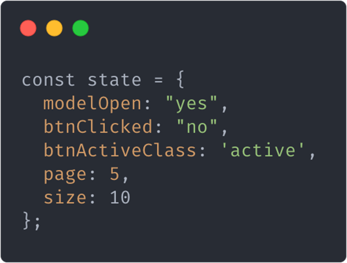


### 获取 redux

[官网](https://redux.js.org/)

[CDN](https://cdn.bootcss.com/redux/4.0.5/redux.min.js)

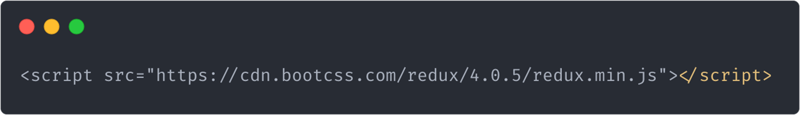


### redux 核心概念及工作流程

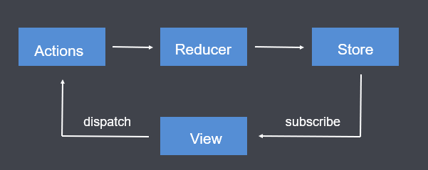

**Store**：存储状态的容器，JavaScript对象

**View**: 视图，HTML页面

**Actions**: 对象，描述对状态进行怎样的操作

**Reducers**：函数，操作状态并返回新的状态


### redux 核心 API


示例：

```html
<!DOCTYPE html>
<html lang="en">
<head>
  <meta charset="UTF-8">
  <meta name="viewport" content="width=device-width, initial-scale=1.0">
  <title>Document</title>
</head>
<body>
  <button id="plus">+</button>
  <span id="count">0</span>
  <button id="minus">-</button>
  <script src="redux.min.js"></script>
  <script>
    // 3. 存储默认状态
    var initialState = {
      count: 0
    }
    // 2. 创建 reducer 函数，redux 初始化会默认调用一次，用于存储默认 state
    function reducer (state = initialState, action) {
      switch (action.type) {
        case 'increment':
          // 不能直接修改 state，而是需要返回一个全新的 state
          return {count: state.count + 1};
        case 'decrement':
          return {count: state.count - 1}
        default:
          return state;
      }
    }
    // 1. 创建 store 对象
    var store = Redux.createStore(reducer);

    // 4. 定义 action
    var increment = { type: 'increment' };
    var decrement = { type: 'decrement' };

    // 5. 获取按钮 给按钮添加点击事件
    document.getElementById('plus').onclick = function () {
      // 6. 触发action
      store.dispatch(increment);
    }

    document.getElementById('minus').onclick = function () {
      // 6. 触发action
      store.dispatch(decrement);
    }

    // 7. 订阅 store
    store.subscribe(() => {
      // 获取store对象中存储的状态
      // console.log(store.getState());
      document.getElementById('count').innerHTML = store.getState().count;
    })
  </script>
</body>
</html>
```


## react + redux

### 在 react 中不使用 redux 时遇到的问题

在React中组件通信的数据流是单向的, 顶层组件可以通过props属性向下层组件传递数据, 而下层组件不能向上层组件传递数据, 要实现下层组件修改数据, 需要上层组件传递修改数据的方法到下层组件. 当项目越来越大的时候, 组件之间传递数据变得越来越困难.

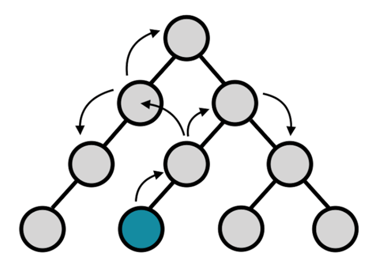


### 在 react 项目中加入 redux 的好处

使用Redux管理数据，由于Store独立于组件，使得数据管理独立于组件，解决了组件与组件之间传递数据困难的问题。

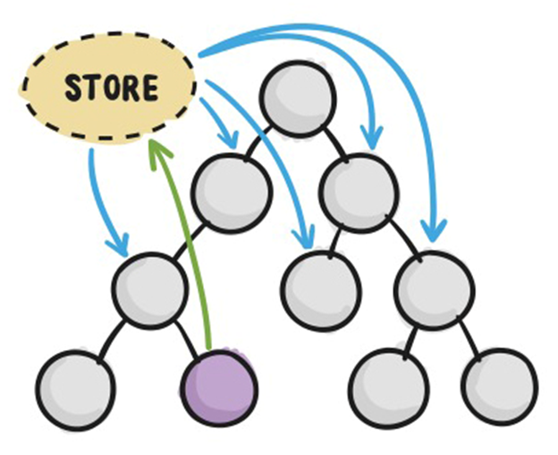

### 下载 Redux

```bash
npm install redux react-redux
```


### Redux 工作流程

1. 组件通过 dispatch 方法触发 Action

2. Store 接收 Action 并将 Action 分发给 Reducer

3. Reducer 根据 Action 类型对状态进行更改并将更改后的状态返回给 Store

4. 组件订阅了Store中的状态，Store中的状态更新会同步到组件

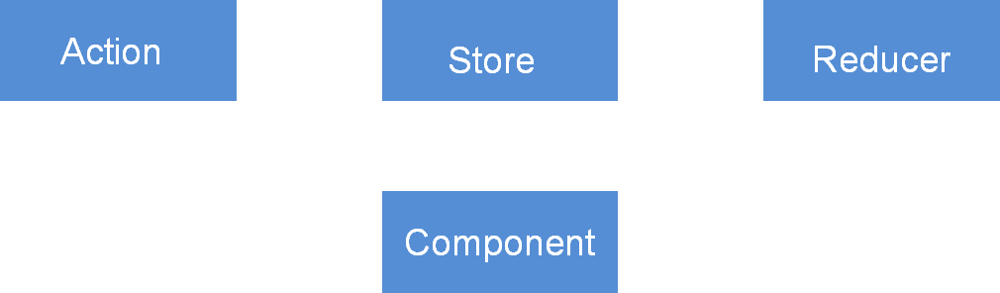


### Redux 使用步骤

#### 创建 Store 和 Reducer

1. 创建 Store 需要使用 createStore 方法, 方法执行后的返回值就是Store, 方法需要从 redux 中引入

2. createStore 方法的第一个参数需要传递reducer

3. reducer 是一个函数, 函数返回什么, store中就存储什么. 函数名称自定义.

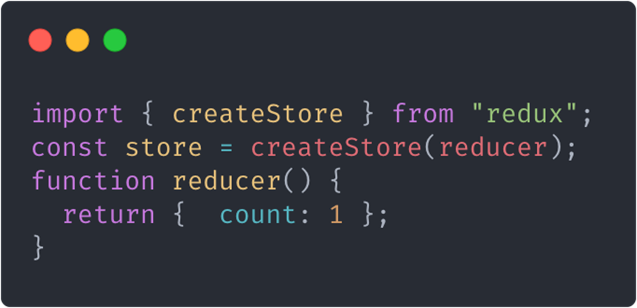


#### 组件获取Store中的数据

##### 将store中的数据放在Provider组件中, Provider组件是存储共享数据的地方

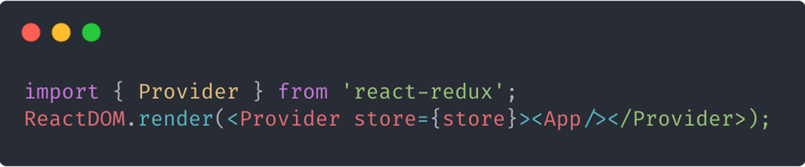


##### 组件使用connect方法获取数据并将数据通过props传递进组件

1. connect 方法会帮助我们订阅store 当store中的状态发生更改的时候 会帮助我们重新渲染组件

2. connect 方法可以让我们获取store中的状态 将状态通过组件的props属性映射给组件

3. connect 方法可以让我们获取 dispatch 方法

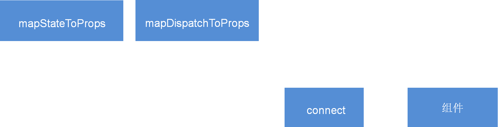

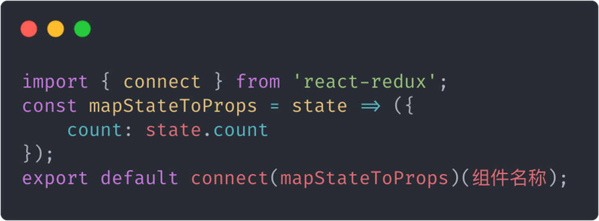


#### 组件更改Store中的数据

##### 定义 action

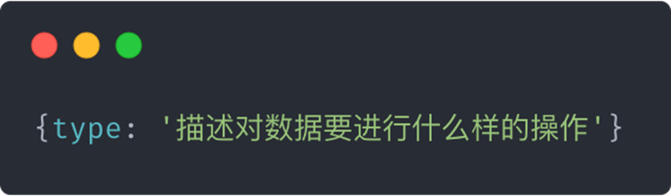

action是改变状态的唯一途径


##### 组件触发 action

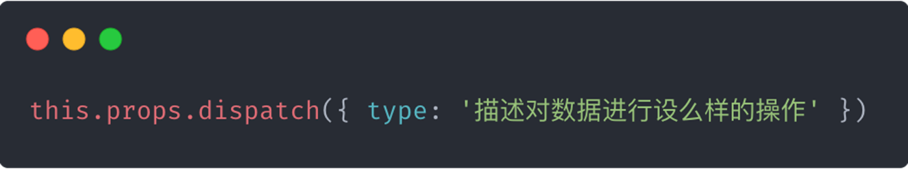


reducer 接收 action, 针对action对数据进行处理并返回

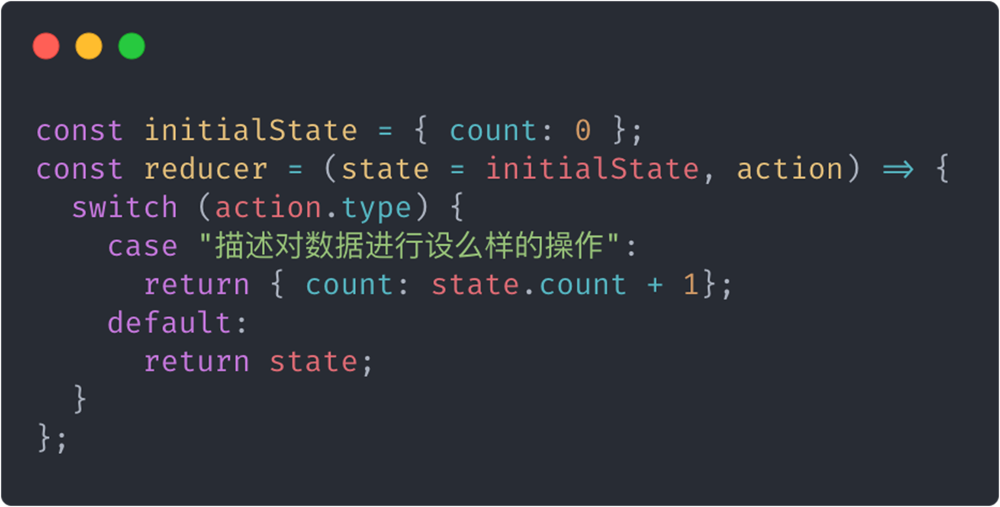


#### 为 action 传递参数

##### 传递参数

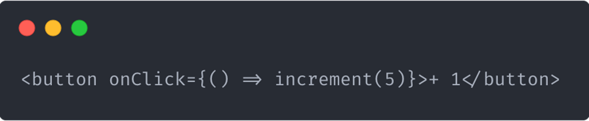


##### 接收参数, 传递reducer

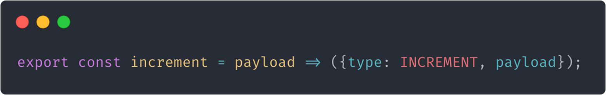


##### reducer根据接收到的数据进行处理

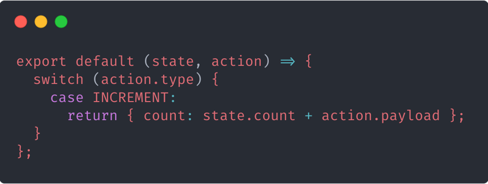


### 优化

#### 使用 Action Creator 函数将触发Action的代码独立成函数

在组件中通过调用this.props.dispatch({type: '描述对数据进行设么样的操作'})方法触发action. 造成HTML模板在视觉上的混乱.

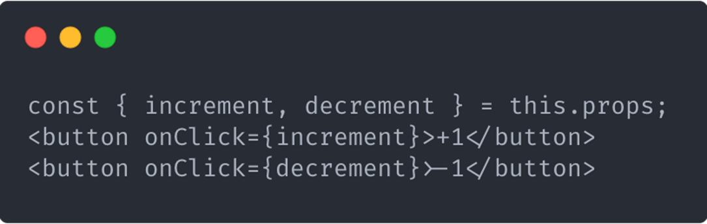

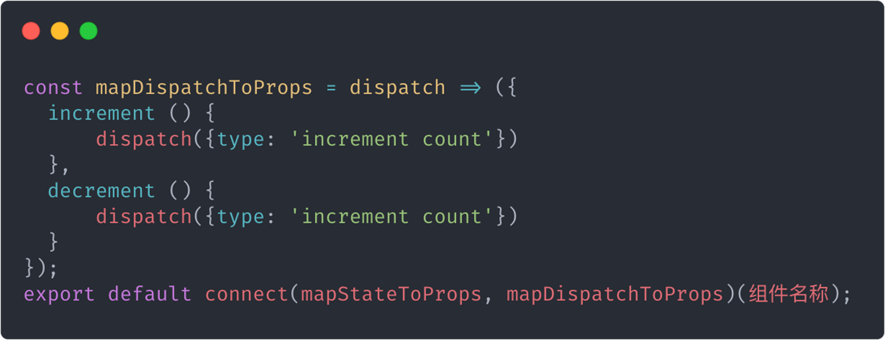


#### Action Creators 函数绑定

触发Action的函数, 内部代码重复率非常高, 所以React提供了方法帮我们生成这些函数, 代替开发者手写.

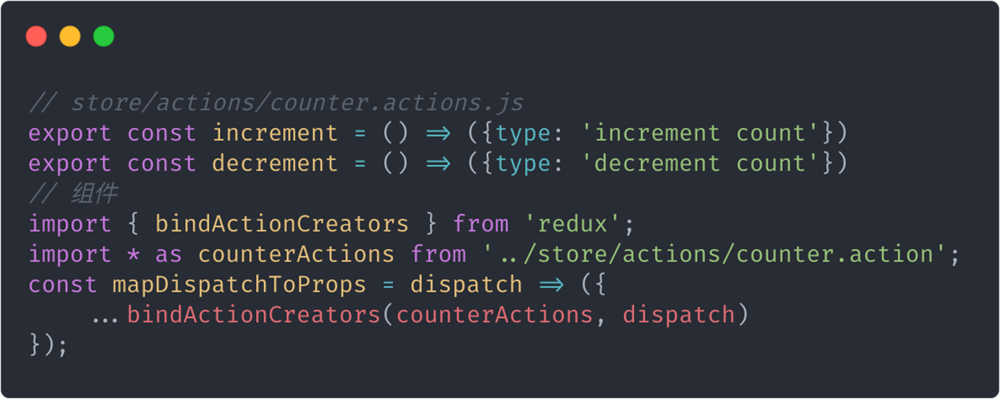


#### 将Action类型字符串独立成常量

Action类型字符串组件在触发Action时需要使用, Reducer在接收Action时也需要使用, 由于字符串不存在代码提示, 存在写错的风险, 所以要将它独立成常量.


#### 拆分Reducer

当要管理的数据越来越多时, reducer中的代码将会变得越来越庞大.

React允许将一个大的reducer拆分成若干个小的reducer, 最后进行合并使用.

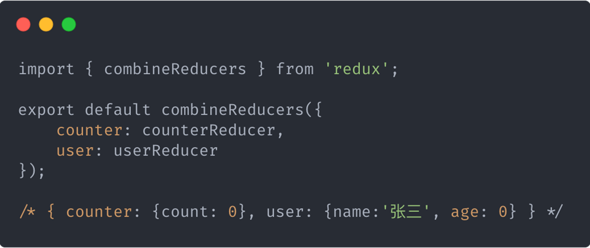


### 中间件概念

#### 什么是中间件

中间件允许我们扩展redux应用程序。


#### 加入了中间件 Redux 工作流程

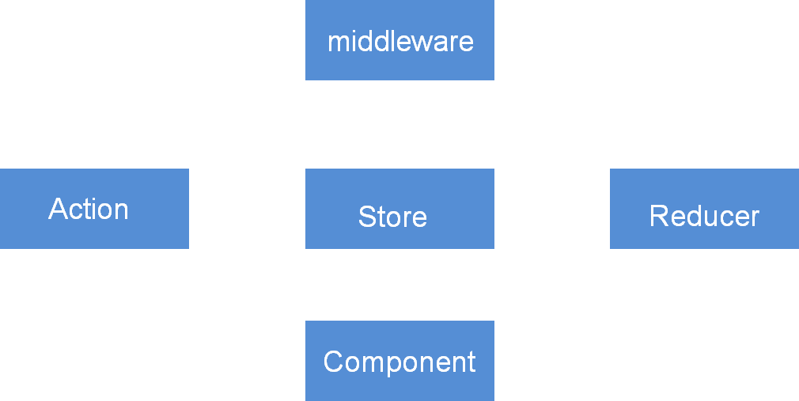


#### 开发 Redux 中间件

开发中间件的模板代码

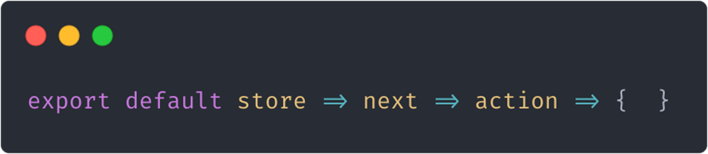


#### 注册中间件

中间件在开发完成以后只有被注册才能在Redux的工作流程中生效

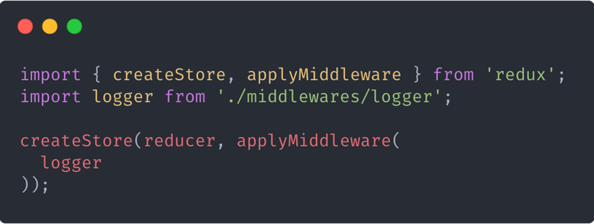


#### 中间件开发实例 thunk

**thunk 中间件可以让我们在 Redux 的工作流程中加入异步代码**

1. 当前这个中间件函数不关心你想执行什么样的异步操作，只关心你执行的是不是异步操作

2. 如果你执行的是异步操作，你在触发action的时候给我传递一个函数，如果执行的是同步操作就传递action对象

3. 异步操作代码要写在你传递进来的函数中

4. 当前这个中间件函数在调用你传递进来的函数时，要将dispatch方法传递过去

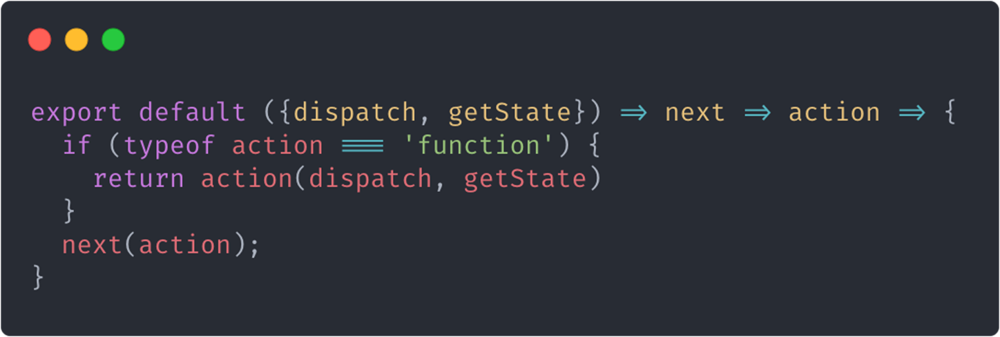


#### redux-thunk

**redux-thunk 下载**

```bash
npm install redux-thunk
```


**引入 redux-thunk**

```js
import thunk from 'redux-thunk'
```


**注册 redux-thunk**

```js
import { createStore, applyMiddleware } from "redux";
import RootReducer from "./reducers/root.reducer";
import thunk from 'redux-thunk'

export const store = createStore(RootReducer, applyMiddleware(thunk));
```


**使用 redux-thunk 中间件**

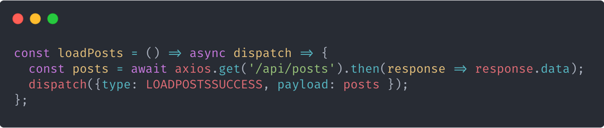


#### redux-saga

**redux-saga 解决的问题**

redux-saga 可以将异步操作从 Action Creator 文件中抽离出来，放在一个单独的文件中。


**redux-saga 下载**

```bash
npm install redux-saga
```


**创建 redux-saga 中间件**

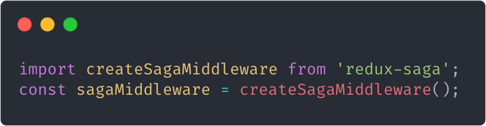


**注册 sagaMiddleware**

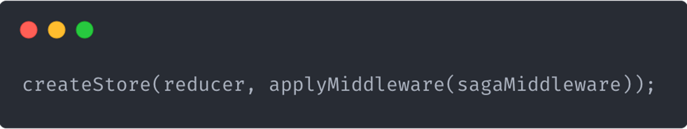


**使用 saga 接收 action 执行异步操作**

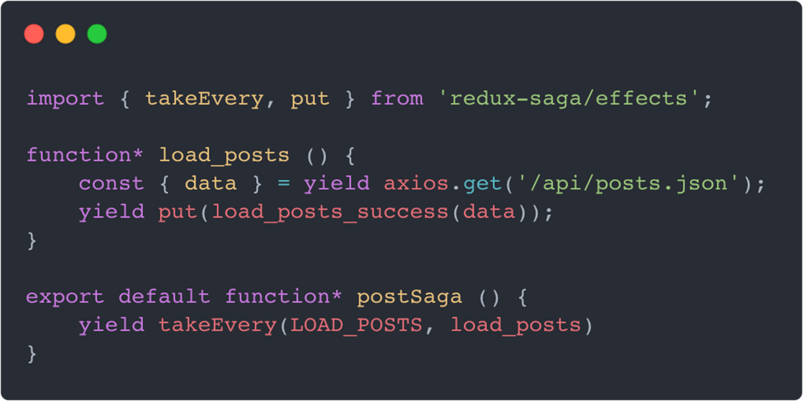


**启动saga**

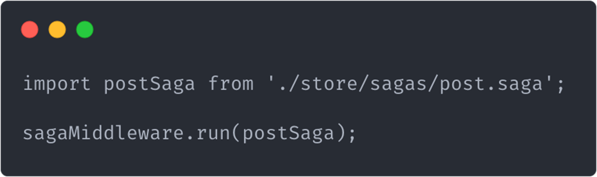


**合并sagas**

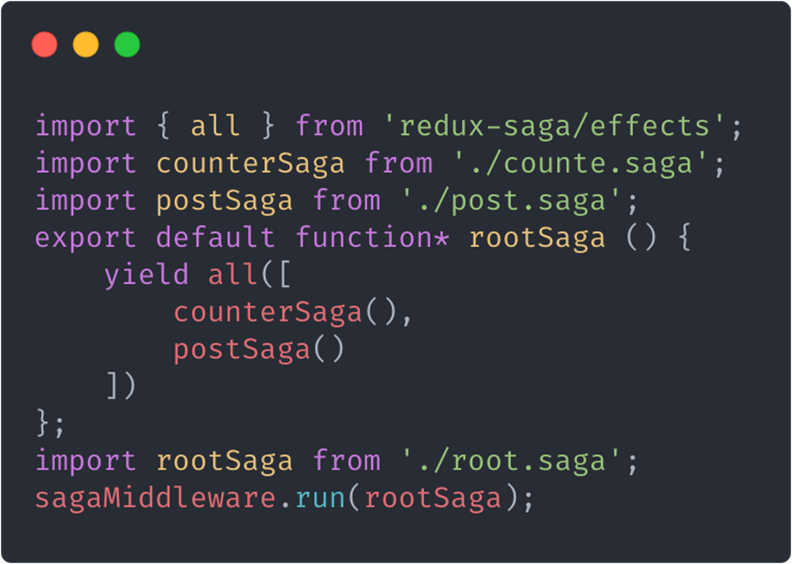


#### redux-actions

**redux-actions 解决的问题**

redux流程中大量的样板代码读写很痛苦, 使用redux-actions可以简化Action和Reducer的处理.


**redux-actions 下载**

```bash
npm install redux-actions
```


**创建 Action**

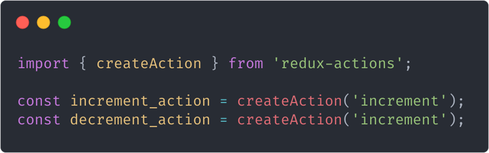


**创建 Reducer**

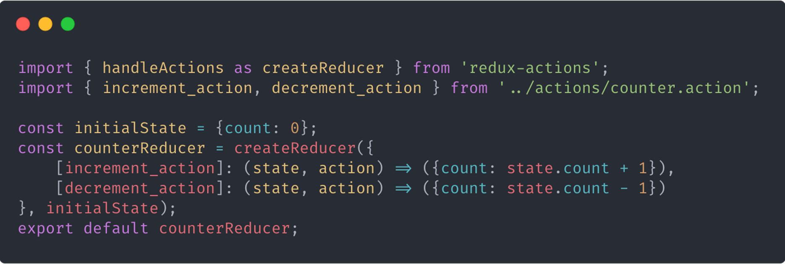

