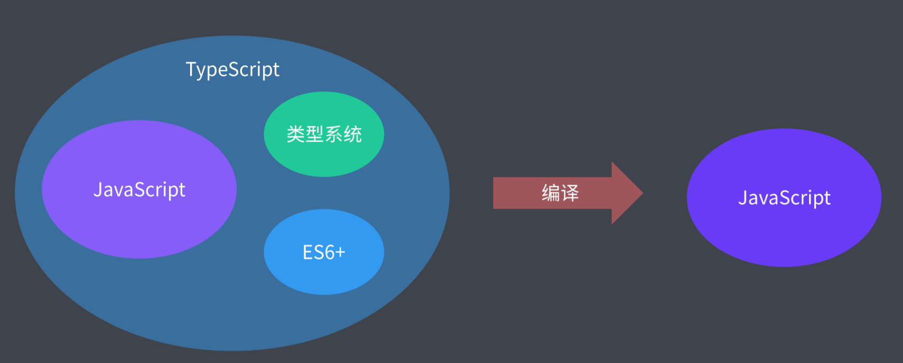
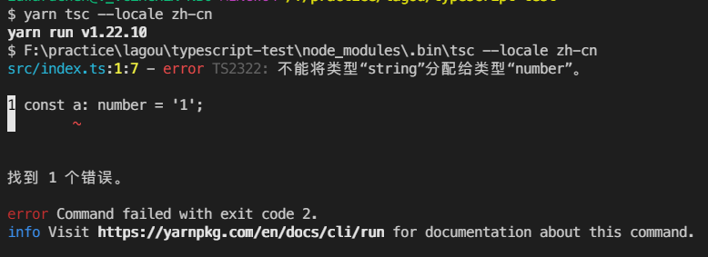
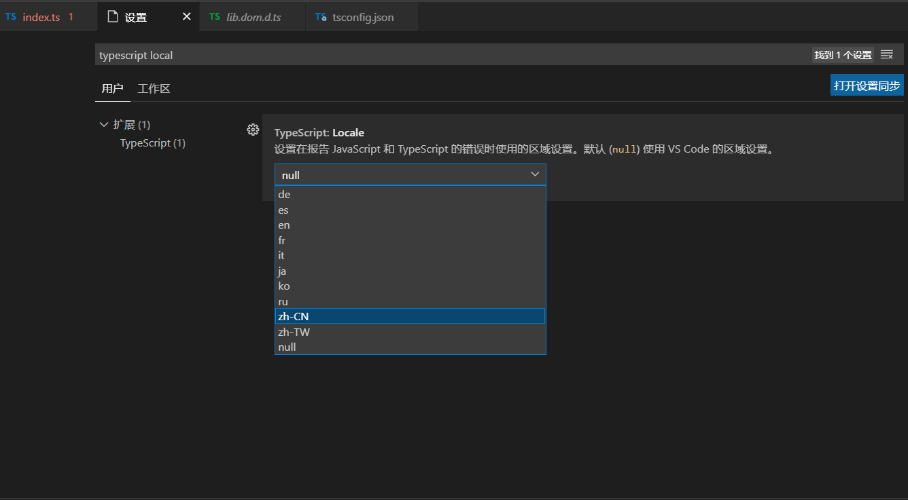
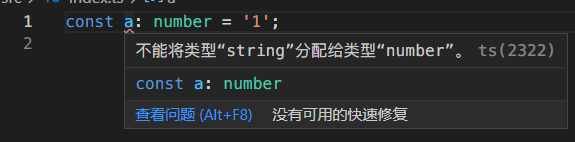

[TOC]

# TypeScript基础

## **强类型与弱类型**

- 是从类型安全角度来说的：
- 强类型：语言层面上限制了函数的实参类型必须与形参类型相同
- 弱类型：并不要求满足上面的约束
- 强类型有更强的类型约束，弱类型中几户没有什么约束
- 强类型中不允许有任意的隐式类型转换【编译层面就不允许】，弱类型中允许任意的数据隐式类型转换
- 变量类型允许随时改变的特点，不是强弱类型的差异。比如Python，他的变量类型可变，但是他也是强类型语言。

```js
'100' - 50 //  50
Math.floor('foo')
```


## **静态类型与动态类型**

- 是从类型检查角度来说的：

- 静态类型语言：变量声明时他的类型就是明确的，且声明后它的类型不允许再修改

- 动态类型语言：运行阶段才能明确变量的类型，且声明后可以随时变换

- - 动态语言中变量是没有类型的，变量中存放的值是有类型的，如JS


## **JavaScript自有类型系统的问题**

- JavaScript是弱类型且为动态类型语言

- 灵活多变，缺失系统可靠性

- 为什要设计成这样？

- - 客观原因：早前JavaScript应用简单，没想到演变到今天的这么强大
  - JavaScript没有编译环节，无法在编译阶段进行类型检查
  - 大规模应用情况下这样的特征就出现一些问题


- 弱类型的问题：

- - 出现类型异常只能在运行阶段发现，不方便测试（比如定时器中的函数有错误得等到定时器结束计时后才发现）
  - 多人协同开发只能靠**约定**来传递参数，由于传递参数的不同可能导致函数功能发生改变
    没有可靠性（比如a+b，a和b中都为数值和其中某个为字符串都能输出结果，但是结果不一致）
  - 类型不明确造成对象属性值的错误用法，会将属性名转换成字符串


- 强类型的优势：

- - 错误更早暴露
  - 代码更智能，编码更准确
  - 重构更牢靠
  - 减少不必要的类型判断


## **Flow静态类型检查方案**

（类型检查角度）

- Flow，JavaScript类型检查器（2014，Facebook）
- TypeScript源码中可能用到了Flow类型


### **类型注解**

- 通过`类型注解`来控制类型，类型不符合保存后Flow语法就可以检测出来异常
- 类型注解：参数后面加：然后接数据类型就行了

```js
function sum (a:number,b:number) {
    return a + b
}
sum(100,50)  // 正确
sum('100', 50)  // 字符串100下面会被波浪线标记

```

- 使用步骤

1. Flow 是以工具包的形式来使用的，用 `npm i flow-bin -dev` 安装成开发依赖即可
2. 需要在使用flow工具检测的文件开头以注释的形式写上 `// @flow`
3. 在代码当中为类型成员添加类型注释 ：类型名
4. 关闭掉JavaScript的语法校验来解除类型注释的波浪标错。
5. 使用 `npx flow init` 生成初始化配置文件
6. 使用`npx flow` 来执行flow工具


- 类型注解的移除
- 如果不移出类型注解，JS文件将会报错并无法执行，所以需要移除
- 使用 flow-remove-types 插件来移除类型注解

1. 使用`npm i flow-remove-types -D`安装移除注解插件
2. 使用 `npx flow-remove-types . -d dist`
   【第一个参数是转换的当前目录 '.'，第二个参数是输出目录用-d表示，后面的是输出目录的位置dist，参数直接用空格隔开】
3. 一般都是将要删除类型注解的文件放到单独的文件夹，防止在删除时误删到其他文件的类型注解，比如三方包中的类型注解


- 使用babel及其插件来移除

1. 安装babel核心文件

   ```bash
   npm i @babel/core -D
   ```

2. 安装babel的cli命令行工具

   ```bash
   npm i @babel/cli -D
   ```

3. 安装babel去除类型注释的插件

   ```bash
   npm i @babel/preset-flow -D
   ```

4. 在项目的根目录下添加 `.babelrc` 文件，添加preset的配置

   ```bash
   {
   	"presets": ["@babel/preset-flow"]
   }
   ```

- 使用vsCode插件来检查用波浪线标记语法错误

- - 安装Flow Language Support 插件来标记类型异常
  - 文件保存后才会进行类型检查


### 类型注解的其他应用

- 规定变量存放的数据类型

```js
/**
 * 类型注解
 *
 * @flow
 */

function square (n: number) {
 return n * n
}

let num: number = 100

// num = 'string' // error
```

- 规定函数的返回值

```js
function foo (): number {
  return 100 			// ok
  return 'string' 		// error 报错
}

function bar (): void {
  return undefined		// 函数如果没有返回值就使用 :void来表示return undefined
}
```


### **类型推断**

- 如下例，会根据代码内容来推断参数类型

```js
/**
 * 类型推断
 *
 * @flow
 */

function square (n) {
  return n * n		// 显然n只能是数字类型
}

// square('100')

square(100)
```

- 不过为了可读性，建议使用类型注解的方式来进行类型的检查


## **Flow数据类型**

### **原始数据类型**

```js
/**
 * 原始类型
 *
 * @flow
 */

const a: string = 'foobar'

const b: number = Infinity // NaN // 100

const c: boolean = false // true

const d: null = null

const e: void = undefined  // void来表示undefined，而不能用undefined来表示undefined

const f: symbol = Symbol()

// abcf都不允许为undefined和null
```


### **数组类型**

```js
/**
 * 数组类型
 *
 * @flow
 */

const arr1: Array<number> = [1, 2, 3] // <number>表示泛型，表示数组中全是数字

const arr2: number[] = [1, 2, 3]

// 元组（在函数中返回多个数据类型的返回值时候可以使用元祖类型）
const foo: [string, number] = ['foo', 100]  // 定义固定长度、固定类型的数组
```


### **对象类型**

```js
/**
 * 对象类型
 *
 * @flow
 */

const obj1: { foo: string, bar: number } = { foo: 'string', bar: 100 }  // 指定固定的成员及成员类型

const obj2: { foo?: string, bar: number } = { bar: 100 } // ？表示可选参数

const obj3: { [string]: string } = {}  // 表示可以添加任意个数的键值对，但是键值对的类型被限制

obj3.key1 = 'value1'
obj3.key2 = 'value2'
```


### **函数类型**

```js
/**
 * 函数类型
 *
 * @flow
 */

function foo (callback: (string, number) => void) {
  callback('string', 100)
}
// 定义一个foo函数，接收一个callback函数作为参数。
// 用箭头函数来进行约束：
// 	这个callback函数接收两个参数。
// 	第一个参数必须是字符串，第二个必须是number，返回值必须是undefined。

foo(function (str, n) {  // 调用的时候只能传字符串和数字作为参数，并且函数内部不能返回值
  // str => string
  // n => number
})
```


### **特殊类型**

```js
/**
 * 特殊类型
 *
 * @flow
 */


// 1. 字面量类型,一般不单独使用，是和后面的联合类型一起使用
const a: 'foo' = 'foo'
const type: 'success' | 'warning' | 'danger' = 'success'


// 2. 声明类型【联合类型、或类型】

type StringOrNumber = string | number // 使用type关键字定义别名，直接使用string和number，不用引号

const b: StringOrNumber = 'string' // 100   // 这里的StringOrNumber就代表允许string和number类型


// 3. Maybe 类型

const gender: ?number = undefined // 具体类型的基础上拓展了null和undefined
// 相当于
// const gender: number | null | void = undefined


// 4. mixed 类型

// mixed表示接受任意类型，string | number | boolean | ....，【强类型的任意类型】
function passMixed (value: mixed) {
  if (typeof value === 'string') {  // 必须要在运行前进行类型判断，也就是说不能在一个阶段
    value.substr(1)				   // 同时进行两种数据类型的操作
  }

  if (typeof value === 'number') {
    value * value
  }
}

passMixed('string')

passMixed(100)

// 5. any 数据类型【不推荐使用，存在是为了兼容以前的代码】
// 也表示任意数据类型，但是是【弱类型的任意类型】

function passAny (value: any) {
  value.substr(1) // 可以把参数当成字符串

  value * value   // 也可以把参数当成数字
}

passAny('string')

passAny(100)
```


### **运行环境提供的API**

```js
/**
 * 运行环境 API
 *
 * @flow
 */

// 浏览器环境中，flow会在运行时提供一个类型限制，是flow工作时自动下载下来的
const element: HTMLElement | null = document.getElementById('app')
```


## **TypeScript**

- 是JavaScript的超集
- 对JavaScript进行进一步的丰富
- 最终会转换成JavaScript来运行，可以实现类似于babel的作用
- 任何一中JavaScript运行环境都支持TypeScript
- 功能更强大，生态更健全、完善（都是微软原生的）
- Vue3.0中也会使用TypeScript
- 渐进式开发，兼容JavaScript，不懂TS语法也能开发



- 缺点：

- - 语言本身多了很多概念，增加学习成本
  - 项目初期，TS会增加一些配置成本，比如一些类型声明


### **TypeScript使用**

- 使用流程

1. 初始化npm或者yarn，安装TS模块

- `npm i typescript -D` 或者 `yarn add typescript -D`
- bin目录下的可执行文件就是可以执行的命令，比如tsc用来编译TS代码

2. 新建以ts为拓展名的文件

3. 使用yarn或者npx运行tsc模块来执行ts文件进行编译,最终生成编译后的js文件

```bash
yarn tsc 文件名.ts
```


- 配置文件

1. 创建配置文件：`yarn tsc --init`

- target：表示编译后转换的代码版本，如`"target":"es2015"`
- module：表示以什么样的方式进行模块化
- sourceMap：表示开启源代码映射
- outDir：输出文件目录
- rootDir：输入文件目录
- 使用`yarn tsc` 执行整个ts项目（src目录下）

2. **只有在使用tsc运行整个项目时候才会生效，运行单个项目时配置文件不会生效**


### **TypeScript作用域**

- ts默认所有文件都处在一个全局作用域中，不同文件可以相互访问变量，所以很容易变量名冲突，解决方法就是使用模块式，变成模块作用域

```js
// 作用域问题

// 默认文件中的成员会作为全局成员
// 多个文件中有相同成员就会出现冲突
// const a = 123

// 解决办法1: IIFE 提供独立作用域
// (function () {
//   const a = 123
// })()

// 解决办法2: 在当前文件使用 export，也就是把当前文件变成一个模块
// 模块有单独的作用域
const a = 123

export {}
```


### **TypeScript数据类型**

#### 原始数据类型

```js
// 原始数据类型

const a: string = 'foobar'

const b: number = 100 // NaN Infinity

const c: boolean = true // false

// 在非严格模式（strictNullChecks）下，
// string, number, boolean 都可以为空（null/undefined）:
// const d: string = null
// const d: number = null
// const d: boolean = null
// 严格模式下不可以

const e: void = undefined // 非严格模式下可以指定为null，严格模式下则不可以

const f: null = null

const g: undefined = undefined

// Symbol 是 ES2015 标准中定义的成员，要想使用ES2015中的语法，前提是必须确保有对应的 ES2015 标准库引用
// 也就是 tsconfig.json 中的 lib 选项必须包含 ES2015，可以使用target：es2015来解决，也可以修改标准库配置来解决
// lid: ["es2015", "DOM"]   // 这个dom是解决console这个对象报错的问题
const h: symbol = Symbol()

// Promise

// const error: string = 100
```


#### Object 类型

- object 类型是指除了原始类型以外的其它类型

```js
// Object 类型

export {} // 确保跟其它示例没有成员冲突

// object 类型是指除了原始类型以外的其它类型
const foo: object = function () {} // [] // {}

// 如果需要明确限制对象类型，则应该使用这种类型对象字面量的语法，或者是「接口」
const obj: { foo: number, bar: string } = { foo: 123, bar: 'string' }

// 接口的概念后续介绍
```


#### 数组类型

```js
// 数组类型

export {} // 确保跟其它示例没有成员冲突

// 数组类型的两种表示方式

const arr1: Array<number> = [1, 2, 3]

const arr2: number[] = [1, 2, 3]

// 案例 -----------------------

// 如果是 JS，需要判断是不是每个成员都是数字
// 使用 TS，类型有保障，不用添加类型判断
function sum (...args: number[]) {
  return args.reduce((prev, current) => prev + current, 0)
}

sum(1, 2, 3) // => 6
```


#### 元组类型

```js
// 元组（Tuple）
// 明确元素数量以及元素类型的数组
// 比如useState中返回的就是一个元组数据类型

export {} // 确保跟其它示例没有成员冲突

const tuple: [number, string] = [18, 'zce']

// const age = tuple[0]
// const name = tuple[1]

const [age, name] = tuple

// ---------------------

const entries: [string, number][] = Object.entries({
  foo: 123, 		// [string, number][] 的意思是数组元素是个元组
  bar: 456 
})  			   //  [["foo",123],["bar",456]]

const [key, value] = entries[0]
// key => foo, value => 123
```


#### 枚举类型

```js
// 枚举（Enum）

export {} // 确保跟其它示例没有成员冲突

// 用对象模拟枚举，比如项目中有某个数值来表示状态，0表示草稿，1表示未发表，2表示发表...
const PostStatus = {
  Draft: 0,
  Unpublished: 1,
  Published: 2
}

// 标准的数字枚举（用enum关键字，内部用等号的形式，使用方式等同对象，直接点属性名即可）
enum PostStatus {
  Draft = 0,
  Unpublished = 1,
  Published = 2
}

// 数字枚举，枚举值自动基于前一个值自增
enum PostStatus {
  Draft = 6,
  Unpublished, // => 7
  Published // => 8
}

// 字符串枚举（有一个用了字符串，就会导致这样一来所有的全用字符串）
enum PostStatus {
  Draft = 'aaa',
  Unpublished = 'bbb',
  Published = 'ccc'
}

// 常量枚举，不会侵入编译结果,如果不加const则会导致输出的文件是双向的键值对
// （双向键值对：可以通过.键来访问值，也可以通过.值来访问键）
const enum PostStatus {
  Draft,
  Unpublished,
  Published
}

const post = {
  title: 'Hello TypeScript',
  content: 'TypeScript is a typed superset of JavaScript.',
  status: PostStatus.Draft // 3 // 1 // 0
}

// PostStatus[0] // => Draft
```

**普通枚举编译成js后，会变成双向键值对（即可以通过键访问值，也可以通过值访问键）：**

```ts
enum PostStatus {
  Draft = 0,
  Unpublished = 1,
  Published = 2
}
```

```js
var PostStatus;
(function (PostStatus) {
    PostStatus[PostStatus["Draft"] = 0] = "Draft";
    PostStatus[PostStatus["Unpublished"] = 1] = "Unpublished";
    PostStatus[PostStatus["Published"] = 2] = "Published";
})(PostStatus || (PostStatus = {}));
var obj = {
    status: PostStatus.Draft
};
```

**如果是使用常量枚举，则不会变成双向键值对，而是编译成普通的字面量对象：**

```ts
const enum PostStatus {
  Draft = 0,
  Unpublished = 1,
  Published = 2
}

const obj = {
  status: PostStatus.Draft
}
```

```js
var obj = {
    status: 0 /* Draft */
};
```


#### 函数类型

```js
// 函数类型

export {} // 确保跟其它示例没有成员冲突

// 声明式
function func1 (a: number, b: number = 10, ...rest: number[]): string {
  return 'func1'
}		// 返回值的注解要添加到参数括号的后面

func1(100, 200)

func1(100) // function func1 (a: number, b?: number = 10): string {} 这样加问号后可以

func1(100, 200, 300)  // 实参个数和形参需要严格对应，如果实参过多就用剩余参数接收


// 函数表达式
// 下面的表示 定义一个func2变量，这个变量接收一个函数，函数参数是两个并且是数值类型，返回值是字符串
const func2: (a: number, b: number) => string = function (a: number, b: number): string {
  return 'func2'
}
```


#### 任意类型

```js
// 任意类型（弱类型）typescript 不会对任意类型进行类型检查

export {} // 确保跟其它示例没有成员冲突

function stringify (value: any) {
  return JSON.stringify(value)
}

stringify('string')

stringify(100)

stringify(true)

let foo: any = 'string'

foo = 100

foo.bar()

// any 类型是不安全的
```


#### 隐式类型推断

```js
// 隐式类型推断

export {} // 确保跟其它示例没有成员冲突

let age = 18 // 推断age为number类型

age = 'string'  // 报错

let foo // 如果只声明不赋值那就foo就是任意类型后续就随意赋值 
foo = 100  //  √
foo = 'string'	//  √

// 建议为每个变量添加明确的类型标注
```


#### 类型断言

```js
// 类型断言

export {} // 确保跟其它示例没有成员冲突

// 假定这个 nums 来自一个明确的接口
const nums = [110, 120, 119, 112]

const res = nums.find(i => i > 0)

const square = res * res // 报错，因为res有可能是undefined（找不到就是undefined）

// 断言：开发者强制来指定类型

// 方式一：as关键字
const num1 = res as number

// 方式二：尖括号也可以，但是在JSX语法中不能这样用，会被React当成HTML标签解析
const num2 = <number>res // JSX 下不能使用
```


#### **接口**

- 用来约束对象的结构，有哪些成员，成员的数据类型是什么
- 对象实现一个接口，必须拥有这个接口定义的成员及其规定的类型

```ts
// 接口

export {} // 确保跟其它示例没有成员冲突

interface Post {
  title: string
  content: string
}

function printPost (post: Post) {  // 接收一个post形参，这个post形参时Post接口
  console.log(post.title)
  console.log(post.content)
}

printPost({
  title: 'Hello TypeScript',
  content: 'A javascript superset'
})

// 可选成员和只读成员
interface Post {
  title: string
  content: string
  subtitle?: string  // 可选成员
  readonly summary: string	// 只读成员
}

// 动态成员
interface Cache {
    [prop: string]: string  // 数组里面定义的属性，prop这个词随意，用来表示当前属性名 
}						  // 外面是属性值的类型

const cache: Cache = {}
cache.foo = 'value1'
cache.bar = 'value2'
```

- 只是为了将有结构的数据进行类型约束，接口编译后不会出现在编译后的js文件中：

```ts
interface Post {
  title: string
  content: string
}

function printPost (post: Post) {  // 接收一个post形参，这个post形参时Post接口
  console.log(post.title)
  console.log(post.content)
}

printPost({
  title: 'Hello TypeScript',
  content: 'A javascript superset'
})
```

```js
// 编译后的js
function printPost(post) {
    console.log(post.title);
    console.log(post.content);
}
printPost({
    title: 'Hello TypeScript',
    content: 'A javascript superset'
});
```


#### **类**

- 描述一类具体事务的抽象特征
- 用来描述一类具体对象的抽象成员
- ES6以前是以函数+原型来模拟实现类，ES6增加了class关键字
- TypeScript增强了class的相关语法

```js
// 类（Class）

export {} // 确保跟其它示例没有成员冲突

class Person { // ts中的类中的属性需要在使用前进行声明
  name: string // = 'init name'
  age: number  // 声明后要么直接赋默认值或者直接在内部动态赋值
  
  constructor (name: string, age: number) {
    this.name = name
    this.age = age
  }

  sayHi (msg: string): void {
    console.log(`I am ${this.name}, ${msg}`)
  }
}
```


#### 类的访问修饰符

+ public：公有属性，默认就是public，父类，子类，外部实例都可以访问
+ private：私有属性，只有父类本身可以访问，子类和外部实例不可以访问
+ protected：保护属性，只有父类、子类可以访问，外部实例不可以访问
|           | 父类 | 子类 | 外部实例 |
| --------- | ---- | ---- | -------- |
| public    | √    | √    | √        |
| private   | √    | ×    | ×        |
| protected |  √    | √    | ×        |

```js
// 类的访问修饰符

export {} // 确保跟其它示例没有成员冲突

class Person {
  public name: string  // 公有属性，默认就是public，不加也行，不过推荐加上
  private age: number  // 私有属性，只能在类的内部访问，不能使用实例来访问
  protected gender: boolean	  // 受保护的，不能在外部实例去访问，继承的子类可以访问
  
  constructor (name: string, age: number) {
    this.name = name
    this.age = age
    this.gender = true
  }

  sayHi (msg: string): void {
    console.log('I am ${this.name}, ${msg}')
    console.log(this.age)
  }
}

class Student extends Person {
  private constructor (name: string, age: number) {
    super(name, age)
    console.log(this.gender) // 这个gender可以，受保护的可以在子类中访问，可继承
    console.log(this.age)  // 这个age不可以，只能在原有类的内部访问
  }

  static create (name: string, age: number) {
    return new Student(name, age)
  }
}

const tom = new Perons('tom', 18)
console.log(tom.name)
// console.log(tom.age)
// console.log(tom.gender)

const jack = new Student('jack', 18) // 不可以，private修饰的constructor不可在外部实例化，可以在内部定义实例化的方法，外部去调用这个方法，比如本例中的create静态方法
const jack = Student.create('jack', 18)
```


#### 类的只读属性

- 定义后就不允许再修改

```js
// 类的只读属性

export {} // 确保跟其它示例没有成员冲突

class Person {
  public name: string // = 'init name'
  private age: number
  // 只读成员
  protected readonly gender: boolean   // readonly接在其他修饰符的后面
  
  constructor (name: string, age: number) {
    this.name = name
    this.age = age
    this.gender = true  //  不可以，因为gender是只读的
  }

  sayHi (msg: string): void {
    console.log('I am ${this.name}, ${msg}')
    console.log(this.age)
  }
}

const tom = new Person('tom', 18)
console.log(tom.name)
// tom.gender = false
```


#### **类与接口**

- 不同的类与类之间也有着共同的特征，这些共同的特征是用接口来实现的
- 接口只是用来定义子类中必须要有哪些成员（接口），但是不会去实现这些成员（接口）【去规范成员而不是去实现成员】

```js
// 类与接口

export {} // 确保跟其它示例没有成员冲突

interface Eat {
  eat (food: string): void
}

interface Run {
  run (distance: number): void
}

class Person implements Eat, Run {  // 使用implements关键字来实现接口
  eat (food: string): void {
    console.log(`优雅的进餐: ${food}`)
  }

  run (distance: number) {
    console.log(`直立行走: ${distance}`)
  }
}

class Animal implements Eat, Run {
  eat (food: string): void {
    console.log(`呼噜呼噜的吃: ${food}`)
  }

  run (distance: number) {
    console.log(`爬行: ${distance}`)
  }
}
```


#### **抽象类**

- 用来约束子类中必须要拥有某一个成员
- 不同于接口的是抽象类包含具体的实现，而接口不包含具体的实现
- 只能继承不能实例化
- 大的类目需要使用抽象类

```js
// 抽象类

export {} // 确保跟其它示例没有成员冲突

abstract class Animal {  // 需要使用abstract关键字
  eat (food: string): void {
    console.log(`呼噜呼噜的吃: ${food}`)
  }

  abstract run (distance: number): void // 定义抽象方法，但不能在抽象类中具体实现，要到子类中实现
}

class Dog extends Animal {
  run(distance: number): void {
    console.log('四脚爬行', distance)
  }

}

const d = new Dog()
d.eat('嗯西马')
d.run(100)
```


#### **泛型**

- 定义函数、接口、类的时候没有指定具体类型，等到使用时再去指定
- 极大程度上复用代码

```js
// 泛型

export {} // 确保跟其它示例没有成员冲突

function createNumberArray (length: number, value: number): number[] {
  const arr = Array<number>(length).fill(value)  // 定义一个元素是数字的数组
  return arr
}

function createStringArray (length: number, value: string): string[] {
  const arr = Array<string>(length).fill(value)  // 定义一个元素是字符串类型的数组
  return arr
}

function createArray<T> (length: number, value: T): T[] {
  const arr = Array<T>(length).fill(value)  // 定义一个泛型数组，元素类型由调用时传入
  return arr
}

// const res = createNumberArray(3, 100)
// res => [100, 100, 100]

const res = createArray<string>(3, 'foo')
```


### **类型声明**

- 由于某种原因（引入的三方库文件）定义的函数没有使用TS编写，也就没有定义类型，需要开发者人为去声明函数类型

- 使用 `declare` 关键字来进行函数声明

- 或者使用三方模块中提供的类型声明文件，我们也可以直接安装其对应的声明模块即可：

- - 以lodash举例：`npm i @types/lodash -D`
  - 开发依赖，只需在开发阶段使用

- 还有甚至直接在模块本身继承了类型限制，我们不需要进行额外的定义，如query-string模块

- - query-string用于解析URL中的query-string字符串
  - `npm i query-string -S`

```js
// 类型声明

import { camelCase } from 'lodash'  // 将字符串转换成驼峰格式
import qs from 'query-string'

qs.parse('?key=value&key2=value2')

// declare function camelCase (input: string): string

const res = camelCase('hello typed')

export {} // 确保跟其它示例没有成员冲突
```


### 中文错误信息

#### 控制台

```bash
yarn tsc --locale zh-cn
```




#### vscode






