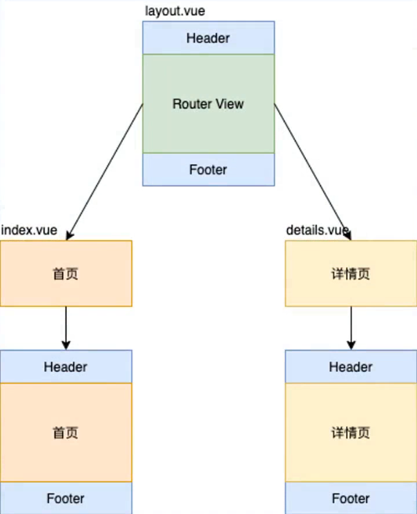
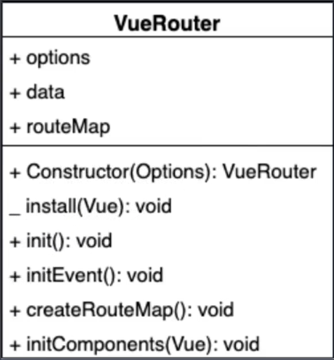

[TOC]

# vue-router

## vue-router的基础回顾

**创建带有vue-router的项目**

1. 用脚手架搭建vue项目时候记得选择 **Manually select features** 进行手动配置
2. 并在配置时使用空格勾选Router

**配置流程**

1. 引入依赖并注册路由插件

```js
// router文件夹下的index.js
import Vue from 'vue'
import VueRouter from 'vue-router'
import Index from '../views/Index.vue'
Vue.use(VueRouter)
```

2. 定义路由规则

```js
// router文件夹下的index.js
const routes = [
  {
    path: '/',
    name: 'Index',
    component: Index
  },
  {
    path: '/blog',
    name: 'Blog',
    // 按需导入路由组件，并且通过注释进行打包分组，相同cwebpackChunkName名称的将会被打包到一起
    component: () => import(/* webpackChunkName: "blog" */ '../views/Blog.vue')
  },
  {
    path: '/photo',
    name: 'Photo',
    component: () => import(/* webpackChunkName: "photo" */ '../views/Photo.vue')
  }
]
```

3. 以定义好的路由规则作为参数，实例化路由并导出

```js
// router文件夹下的index.js
const router = new VueRouter({
  routes
})

export default router
```

4. 全局注册router对象

```js
// src根目录下的main.js 入口文件
import Vue from 'vue'
import App from './App.vue'
import router from './router'

Vue.config.productionTip = false

new Vue({
  router,   // 注册router对象
  render: h => h(App)
}).$mount('#app')
```

5. 组件内创建路由跳转链接及路由显示标签

```vue
// src 目录下的根组件APP.vue
<template>
  <div id="app">
    <div>
      
    </div>
    <div id="nav">
      <!-- 创建链接 -->
      <router-link to="/">Index</router-link> |
      <router-link to="/blog">Blog</router-link> |
      <router-link to="/photo">Photo</router-link>
    </div>
    <!-- 创建路由组建的占位 -->
    <router-view/>
  </div>
</template>

<style>
</style>

```


## **$router和$route的区别**

- `$route `为当前router跳转的路由信息对象，里面可以获取当前路由的name、path、query、params等路由规则
- `$router `为VueRouter实例对象，包含了一些路由的跳转方法，钩子函数等，比如想要导航到不同URL，则使用`$router.push`方法
- PS：`$router` 里面有个 `currentRoute` 属性，里面就是当前的路由规则对象，在有些时候不方便获取 `$route` 的时候可以使用`$router` 中的 `currentRoute` 来代替


## **动态路由**

通过【:xx】的方式进行路由占位，动态匹配变化的路径

```vue
// index.js
const routes = [
    {
        path:'/detail/:id',  // 定义动态路由规则
        name: 'Detail',
        props: true  // 让组件通过props的形式来接收URL参数
    }
]

// 接收参数
<template>
  <div>
    <!-- 方式1： 通过当前路由规则，获取数据 -->
    通过当前路由规则获取：{{ $route.params.id }}

    <br>
    <!-- 方式2：路由规则中开启 props 传参 -->
    通过开启 props 获取：{{ id }}
  </div>
</template>

<script>
export default {
  name: 'Detail',
  props: ['id']   // 使用前同样要进行声明
}
</script>

<style>

</style>

```


## **嵌套路由**

应用：公共部分不动，变化部分用路由

- 也即是layout有两个子路由，一个是index一个是details
- 当然，显示子路由的前提是父路由的组件肯定也会显示的



```js
// index.js 
import Vue from 'vue'
import VueRouter from 'vue-router'
// 加载组件，嵌套路由中使用到的组件都需要导入
import Layout from '@/components/Layout.vue'  
import Index from '@/views/Index.vue'
import Login from '@/views/Login.vue'

Vue.use(VueRouter)

const routes = [
  {
    name: 'login',
    path: '/login',  //  加了'/'就永远以根路径为起点 
    component: Login
  },
  // 嵌套路由
  {
    path: '/',
    component: Layout,
    children: [
      {
        name: 'index',
        path: '',
        component: Index
      },
      {
        name: 'detail',
        path: 'detail/:id',   //  不加 '/' 就可以嵌套使用了，显示router-link中定义的路径
        props: true,
        component: () => import('@/views/Detail.vue')  // vue中的@代表绝对路径从盘符开始到src
      }
    ]
  }
]

const router = new VueRouter({
  routes
})

export default router
```


## **编程式导航**

- 类比于上述的 `router-link`生成的超链接跳转功能

- `$router.push()`

- - 直接使用路径进行跳转
  - 通过路由的name属性进行跳转

- `$router.replace()`
- `$router.go()`

```js
export default {
  name: 'Login',
  methods: {
    push () {
      this.$router.push('/')    // 直接使用路径进行跳转
      // this.$router.push({ name: 'Home' })    // 通过路由的name属性进行跳转
    },
    go () {
        this.$router.go(-2)     // 向后退两步，等同于this.$router.back(2)
    },
    replace () {
        this.$router.replace('/login')    // 替换路径，不记录路径历史
    }
  }
}
```


## **Hash模式和History模式的区别**

- 两种方式均为客户端路由的实现方式
- 当路径法发生变化，不会向服务器发送请求
- 使用js监视路径的变化根据不同的地址渲染不同的内容
- 如果需要服务器端的内容会发送Ajax请求来获取。

### **表现形式的区别**

- Hash 模式

- - [https://music.163.com/#/playlist?id=3102961863](https://link.zhihu.com/?target=https%3A//music.163.com/%23/playlist%3Fid%3D3102961863)
  - 使用#的形式接路径，使用？来传参

- Histort 模式

- - [https://music.163.com/playlist/3102961863](https://link.zhihu.com/?target=https%3A//music.163.com/playlist/3102961863)
  - 直接在后面用 ' / ' 来拼接路径，也使用 ' / ' 进行传参
  - 需要服务端配置来支持


### **原理的区别**

- Hash 模式是基于锚点，以及 `onhashchange` 事件

- History 模式 是基于 HTML5 中的 `History` API

- - `history.pushState()` ，会记录历史，但不会向服务端发送请求
  - `history.replaceState()`
  - IE10以后才支持，兼容以前版本需要使用hash模式


## **History 模式服务端配置**

- 因为在前端路由中，路径反应的是前端路由以及组件的显示情况，并不是后端url资源的对应情况。

- 所以History模式下网页是怕刷新的，一刷新就会导致想服务端发送请求，并且服务端没有对应的url则会报错404 Not Found

- 所以需要针对这个情况进行配置，如果没有这个页面可以在前端统一处理显示某一固定页面，比如将没有配置的路由地址统一使用一个404.vue页面

  

### **History 模式在Node中的配置**

- History 需要服务器的支持

- 单页应用中，服务器不存在 [http://www.testurl.com/login](https://link.zhihu.com/?target=http%3A//www.testurl.com/login) 这样的地址

- 此时如果刷新页面，就会返回找不到该页面

- 所以在服务端应该进行配置：

- - 在服务端应该除了静态资源外都返回单页应用的 index.html
  - 在Vue的脚手架开发项目中默认是已经处理了的，所以要在node或nginx上进行演示
  - 使用方法就是注册处理history模式的中间件

```js
// 注册处理 history 模式的中间件
app.use(history())
```

- - 但因为我们开启了对histort模式的支持，因此会将单页应用默认的首页返回给浏览器，浏览器接收到此页面再去判断路由地址并加载对应组件内容并渲染到浏览器。


### **History模式在nginx中的配置**

- 首先得先下载nginx，然后放到一个nginx项目目录中，目录中不能有中文
- 然后cd到项目目录中（如：`c:\nginx-1.18.0`），使用cmd命令启动nginx
- ```bash
  # 启动
  start nginx
  # 重启
  nginx -s reload
  # 停止
  nginx -s stop
  ```

- 将打包好的dist文件中的vue项目拷贝到nginx项目的html文件夹中
- 然后在浏览器中输入localhost为地址即可访问nginx项目
- 此时如果没有处理history模式时，刷新未配置的路径时也会报404的错误
- 修改 `nginx.conf` 文件

```conf
// nginx.conf 文件
http {
 server{
  ...
  location / {
   ...
   index index.html index.htm;
   try_files $uri $uri/ /index.html; 

   # $uri 为当前请求的路径 
   # 表示试着去访问当前的这个路径
   # 如果没有找到就继续往后找这个路径下的文件
   #（$uri/表示当前目录找目录下的默认首页 即index的内容）
   # 如果还没找到，返回单页面应用的首页
  }
 }
}
```

- 这样一来刷新后他的执行流程为：

- - 接收当前路径请求地址，显然服务器是没有这个url对应的资源的
  - 又因为在服务端配置了 `try_files` 选项后，如果没有对应资源会返回 `index.html` 首页
  - 当浏览器接收到服务端返回的是首页时，并有着对应的子路由名，那么他将自动解析路由组件从而正常显示对应的子路由组件


## Vue-Router实现原理

### 实现前置知识

- 插件slot 插槽

- 混入

- render 函数

- 运行时和完整版的 Vue

  

#### **Hash 模式**

- URL 中 # 后面的内容作为路径地址，不会请求服务器，但是会记录历史
- 监听 `hashchange` 事件，路径改变后进行对应的组件渲染
- 根据当前路由地址找到对应组件重新渲染


#### **History 模式**

- 通过 `history.pushState()` 方法改变地址栏并记录历史

- 监听 `popstate` 事件

- - 监听浏览器历史的变化，可以记录改变后的历史地址
  - **调用 `pushState` 或者 `replaceState` 并不会触发该事件**
  - 点击前进后退按钮或者调用 `history.back` 或者 `forward` 方法时才触发

- 根据当前路由地址找到对应组件重新渲染


### **核心要点**

- 需要使用 `Vue.use(VueRouter)` 来注册，所以 `VueRouter` 应该是个具有 `install` 方法的类
- 类中需要定义路由规则

#### **类图**



- 从上到下依次为类名，类的属性，类的方法

- 属性：

- - `options` 对象： 记录构造函数中传入的对象

  - `data` 对象：有一个属性 `current` 记录当前路由地址

  - - 目的是让该对象是响应式的，地址发生变化后对应组件会进行更新

  - `routeMap` 对象：记录路由地址和组件的对应关系，将路由规则解析到 `routerMap` 中来

- 方法：

- - +是实例方法，_ 是静态方法

  - `Coustructor(Options)`：构造函数，初始化属性

  - `install(Vue)`：静态方法，实现vue的插件机制

  - `init()`：调用下面三个方法，将不同代码分隔到不同方法实现

  - - `initEvent()`：注册 `popstate` 事件，监听浏览器历史的变化
    - `creatRouteMap()`：初始化 `routeMap` 属性，把构造函数中传入的路由规则转换成键值对的形式存储到 `RouterMap` 对象。（路由地址：对应组件）
    - `initComponents(Vue)`：创建 `router-link` 和 `router-view` 两个组件


## **实现**

### **install**

```js
let _Vue = null

export default class VueRouter {
  static install (Vue) {
    // 1.判断当前插件是否已经被安装,如果插件已经安装直接返回
    // install静态方法是个函数，函数本身也是个对象，所以可以像其中增添一个标志属性
    // installed 用来标志当前是否已经挂注册过了
    if (VueRouter.install.installed && _Vue === Vue) return
    VueRouter.install.installed = true
    // 2.把 Vue 构造函数记录到全局变量，声明在全局，赋值在install静态方法里面
    _Vue = Vue
    // 3.把创建Vue实例时候传入的router对象注入到Vue实例上，写到原型上作为公共属性
    // 混入
      // 如果直接在install内部使用this.$options.router是不行的，原因是install是静态方法
      // 静态方法中的this指向的是VueRouter类而不是实例，所以需要在能获取实例的时候调用
      // 因此使用混入，向Vue的beforeCreate生命周期中（此时有了实例）混入一个操作
      
    _Vue.mixin({ // 混入的操作每个组件都会执行，都会向原型上挂载
      beforeCreate () {
        // 判断router对象是否已经挂载了Vue实例上
        if (this.$options.router) {  // 保证只向原型中写入一次,而不是每次组件实例化都写
          // 把 router 对象注入到 Vue 实例上
          _Vue.prototype.$router = this.$options.router
          ...
        }
      }
    })
  }
  ...
}
```


### **constructor**

```js
constructor (options) {  // 初始化属性
 // 记录路径和对应的组件
  this.options = options  // 用户传入的路由规则
  this.routeMap = {}  // 解析路由规则有以键值对的形式存储，形成路径和组件的对应关系
    
  // 创建响应式对象，使用observable
  this.data = _Vue.observable({
    // 当前的默认路径
    current: '/'
  })
}
```


### **createRouteMap**

- 功能：

- - 遍历所有的路由规则，并形成路径和组件的映射关系，并存储到routerMap中

```js
createRouteMap () {
 // routes => [{ name: '', path: '', component: }]
  // 遍历所有的路由规则，把路由规则解析成键值对的形式，存储到options中的routeMap中
  this.options.routes.forEach(route => {
    // 形成路径和组件的映射关系
    this.routeMap[route.path] = route.component
  })
}
```


### **initComponents (需要创建两个组件)**

### **router-link** 组件

- 创建 `router-link` 组件
- 将 `router-link` 标签中的内容渲染到 `a` 标签中去

```js
initComponents (Vue) {  // 没有用_Vue参数参数传入的原因是为了减少当前方法对外部的依赖
  _Vue.component('router-link', {
    // 接收外部传入的参数
    props: {
      to: String
    },
    // 需要带编译器版本的 Vue.js 即完整版 Vue
    // 这样才能使用编译器将 template模板 转化为 render函数
    template: '<a :href="to"><slot></slot></a>'
}
```


### **router-view** 组件

- 相当于一个占位符，要根据当前路由地址，获取对应的路由组件
- 调用 `h` 函数，将获取到的当前路由地址对应的组件渲染到 `router-view` 的位置

```js
initComponents (Vue) {
    _Vue.component('router-link', {
      
    })
    
    const self = this // render方法时vue提供的，所以内部this并不是vueRouter的实例
    _Vue.component('router-view', {
      render (h) {
        // 当前路由地址
        // self.data.current
        
        // 根据当前路径找到对应的组件
        const component = self.routeMap[self.data.current]
        return h(component) // 将组件转换为虚拟DOM返回
      }
    })
}
```


### **Vue 的构建版本**

- 运行时版：

- - 不支持 template 模板，需要打包的时候提前编译（render函数创建虚拟DOM渲染到视图）

- 完整版：

- - 包含运行时和编译器，体积比运行时版大 10K 左右
  - 编译器在程序运行的时候把模板转换成 render 函数，所以性能不如运行时版本的提前编译


### 完整版本 Vue

- vue-cli 创建的项目默认使用的是 [运行时版本的 Vue](https://link.zhihu.com/?target=https%3A//cn.vuejs.org/v2/guide/installation.html%23%E8%BF%90%E8%A1%8C%E6%97%B6-%E7%BC%96%E8%AF%91%E5%99%A8-vs-%E5%8F%AA%E5%8C%85%E5%90%AB%E8%BF%90%E8%A1%8C%E6%97%B6)
- 如果想切换成带编译器版本的 Vue.js，需要修改 [vue-cli 配置](https://link.zhihu.com/?target=https%3A//cli.vuejs.org/zh/config/%23runtimecompiler)
- 如果想要改配置需要在项目根目录下创建一个vue.config.js并导出一个模块

```js
//  vue.config.js

module.exports = {
  // 选项
  runtimeCompiler: true // 此时会加载带编译器版本的vue 默认为false
}
```


### 运行时版本 Vue

- 采用render函数的形式来进行提前渲染，而不是程序执行时渲染

```js
initComponents (Vue) {
_Vue.component('router-link', {
    // 接收外部传入的参数
    props: {
      to: String
    },
    
    // 这里使用h函数来创建一个超链接来代替模板形式：template: '<a :href="to"><slot></slot></a>'
    // 使用运行时版本的 Vue.js，但此时没有编译器，所以需要来写一个render函数
    render (h) { // 参数h函数是用来创建虚拟DOM，并调用h函数并将结果返回，h函数式vue源码提供
      // 此处仅以解析上述template模板为例，h函数的有三个参数 
      return h('a', { // 1）创建的元素对应的选择器，此处用的a标签选择器
        attrs: { // 2） 配置对象，给当前选中DOM使用attrs设置属性或者使用on来设置事件处理函数
          href: this.to
        },
        on:{ // 给 a标签 注册点击事件
          click:this.clickhander
        }
      }, [this.$slots.default]) // 3） 获取默认的非具名插槽，并生成元素的子元素
    },
    methods:{
      clickhander(e){ //事件参数 e
        // history 模式
        if (self.options.mode === "history") {
          // pushiState只改变浏览器地址栏，不向服务器发送请求，也不能加载地址对应的组件
          history.pushState({}, "", this.to); // data【传递给popState】 title【网页标题】 url【当前超链接要跳转到的地址】
          this.$router.data.current = this.to; // 响应式对象data，改变后或重新加载组价并渲染视图，来实现动态加载对应的组件 
         }
        // hash 模式
        else {
          location.hash = this.to;
        }
        e.preventDefault();  // 阻止事件默认行为
      }
    }
  })
}
```


### **init**

使用 init 包装 createRouteMap () 、 initComponents (Vue) 和 initEvent方便调用

```js
init () {
  this.createRouteMap()
  this.initComponents(_Vue)
  this.initEvent()
}
```

并且在install() 方法中的最后调用初始化方法

```js
static install (Vue) {
    _Vue.mixin({
      beforeCreate () {
        if (this.$options.router) {
           _Vue.prototype.$router = this.$options.router
          this.$options.router.init()  // 初始化
        }
      }
    })
  }
```


### **initEvent**

- 用来实现监听 history 模式下的浏览器前进后退功能，或 hash 模式下的 hashchange 事件
- 如果没有此方法，点击前进后退后地址改变或者 hash 值变化但是组件页面不会重载，因为没有重新加载地址对应的组件
- 需要在init方法中进行调用

```js
initEvent(){
    // history 模式
    if (this.options.mode === "history") {
      window.addEventListener("popstate", () => {
        this.data.current = location.pathname;
      });
    }
    // hash 模式
    else {
      window.addEventListener("hashchange", () => {
        this.data.current = location.hash.slice(1);
      });
    }
}
```


## **完整代码**

```js
let _Vue = null     // 声明一个全局变量，用于存储Vue

export default class VueRouter {
  
  // 静态方法 install
  static install (Vue) {
    if (VueRouter.install.installed && _Vue === Vue) return
    VueRouter.install.installed = true
    _Vue = Vue
    _Vue.mixin({
      beforeCreate () {
        if (this.$options.router) {
          _Vue.prototype.$router = this.$options.router
          this.$options.router.init()
        }
      }
    })
  }

  // constructor 方法
  constructor (options) {
    this.options = options
    this.routeMap = {}
    this.data = _Vue.observable({
      current: '/'
    })
  }

  // init 方法
  init () {
    this.createRouteMap()
    this.initComponents(_Vue)
    this.initEvent()
  }
    
  // createRouteMap 方法
  createRouteMap () {
      this.options.routes.forEach(route => {
      this.routeMap[route.path] = route.component
    })
  }

  // initComponents 方法
  initComponents (Vue) {
  // 定义router-link组件
    _Vue.component('router-link', {
      props: {
        to: String
      },

      render (h) { 
        return h('a', { 
          attrs: { 
            href: this.to
          },
          on:{ 
            click:this.clickhander
          }
        }, [this.$slots.default])
      },
      methods:{
        clickhander(e) { 
          // history 模式
          if (self.options.mode === "history") {
            history.pushState({}, "", this.to);
            this.$router.data.current = this.to;
          }
          // hash 模式
          else {
            location.hash = this.to;
          }
          e.preventDefault();
        }
      }
      // template: '<a :href="to"><slot></slot></a>'
    })
      
    //  定义 router-view 组件
    const self = this 
    _Vue.component('router-view', {
      render (h) {
        const component = self.routeMap[self.data.current]
        return h(component)
      }
    })
  }

  // initEvent 方法  
  initEvent(){
    // history 模式
    if (this.options.mode === "history") {
      window.addEventListener("popstate", () => {
        this.data.current = location.pathname;
      });
    }
    // hash 模式
    else {
      window.addEventListener("hashchange", () => {
        this.data.current = location.hash.slice(1);
      });
    }
  }
}
```