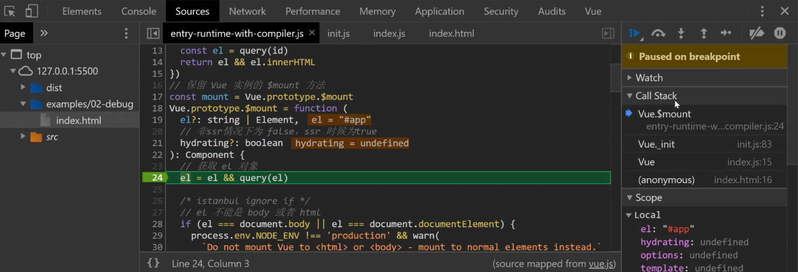
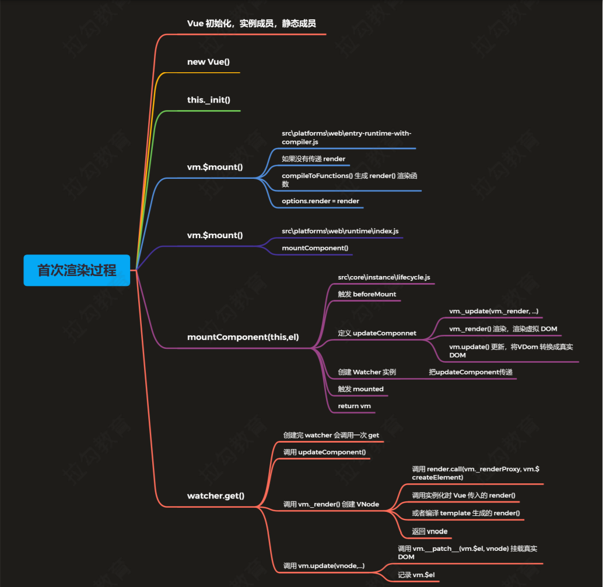
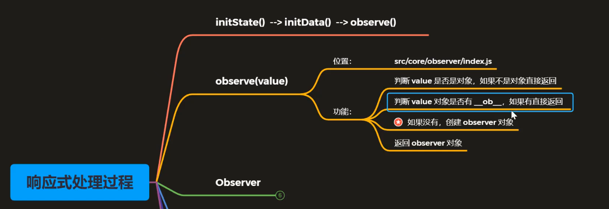
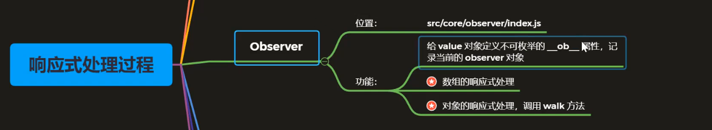
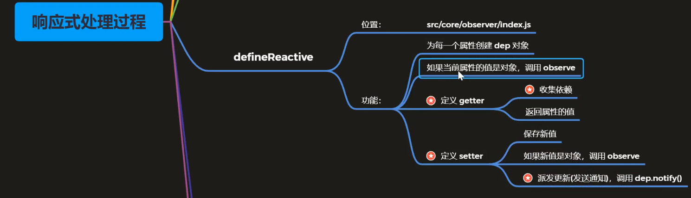
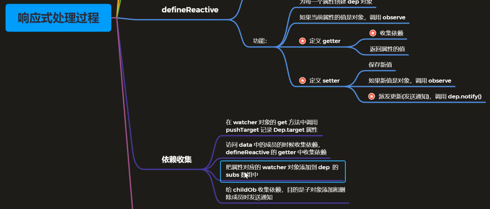
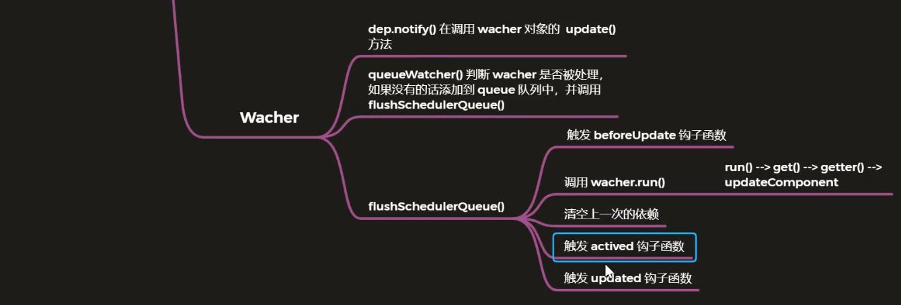

[TOC]

# vue.js响应式原理

## **准备工作**

### **Vue 源码获取**

- 项目地址 [https://github.com/vuejs/vue](https://link.zhihu.com/?target=https%3A//github.com/vuejs/vue)

- Fork 一份到自己仓库，克隆到本地，可以自己写注释提交到 github

- 为什么分析 Vue 2.6

- - 到目前为止 Vue 3.0 的正式版还没有发布
  - 新版本发布后，现有项目不会升级到 3.0，2.x 还有很长的一段过渡期
  - 3.0 项目地址：[https://github.com/vuejs/vue-next](https://link.zhihu.com/?target=https%3A//github.com/vuejs/vue-next)


### **源码目录结构**

```js
src
├─compiler      编译器，将模板转换成render函数，然后render函数来穿件虚拟DOM
├─core          Vue 核心库（和平台无关的代码）
│   components  定义 vue 自带的 keep-alive 组件
│   global-api  定义 vue 静态方法
│   instance    创建 vue 实例（构造函数、Vue的初始化、生命周期函数）
│   observer    响应式机制实现（本章重点）
│   util        公共成员
│   vdom        虚拟dom，Vue中的虚拟DOM通过重写snabbdom，并实现了组件的机制
├─platforms     和平台相关代码
│   web         web端
│   weex        基于vue移动端框架
├─server        SSR，服务端渲染
├─sfc           单文件组件（.vue 文件编译为 js 对象）
└─shared        公共的代码
```


### **了解 Flow**

- 官网：[https://flow.org/](https://link.zhihu.com/?target=https%3A//flow.org/)

- JavaScript 的静态类型检查器，在编译阶段就进行检查而不是执行时，最终也会编译成JavaScript来运行

- 为了保证代码的可维护性和可读性，所以vue2.x中使用flow，使得vue在代码最小改动的情况下使用静态类型检查

- Flow 的静态类型检查错误是通过静态类型推断实现的

- - 文件开头通过 // @flow 或者 /* @flow */ 声明

```js
/* @flow */
function square(n: number): number {
return n * n;
}
square("2"); // Error!

```


### **调试设置**

- 我们可以在阅读源码时通过打包调试代码来验证自己关于源码的理解是否正确

- 打包工具 Rollup

- - Vue.js 源码的打包工具使用的是 Rollup，比 Webpack 轻量
  - Webpack 把所有文件当做模块，Rollup 只处理 js 文件更适合在 Vue.js 这样的库中使用
  - Rollup 打包不会生成冗余的代码

- 开发项目适合使用webpack，开发库时适合使用Rollup

  

### 调试流程

1. 安装依赖

- `npm i`

2. 设置 sourcemap

- `package.json` 文件中的 dev 脚本中新添加参数 `--sourcemap`，开启代码映射
  `"dev": "rollup -w -c scripts/config.js --sourcemap --environment TARGET:web-full-dev"`

3. 执行dev

- `npm run dev` 执行打包，用的是 rollup，`-w` 参数是监听文件的变化，文件变化自动重新打包
- 此时生成的 `vue.js` 文件和 `vue.js.map` 文件，如果想要其他版本的js文件可以通过`npm run build`来执行


4. 调试

- examples 的示例中引入的 `vue.min.js` 改为 `vue.js`
- 打开 Chrome 的调试工具中的 source，我们在开启sourcemap后就可以看到源码src目录了
- 这样做的目的是如果不开启sourcemap我们只能调试打包后的 `vue.js` 文件，该文件中有1w多行代码不方便调试
- 而开启sourcemap后我们可以直接通过模块的形式调试模块源码


### Vue 的不同构建版本

- 执行`npm run build` 重新打包所有文件

- 官方文档 - 对不同构建版本的解释

- `dist/README.md`

- **完整版**：同时包含**编译器**和**运行时**的版本

- **编译器**：用来将模板字符串编译成为 JavaScript 渲染函数的代码（将template转换成render函数），体积大（3000行代码）、效率低

- **运行时**：用来创建 Vue 实例、渲染并处理虚拟 DOM 等的代码，体积小、效率高。基本上就是除去编译器的代码

- UMD：UMD 版本通用的模块版本，支持多种模块方式。 vue.js 默认文件就是运行时 + 编译器的UMD 版本，还可以把vue挂载到window对象上

- [CommonJS](https://link.zhihu.com/?target=http%3A//wiki.commonjs.org/wiki/Modules/1.1)(cjs)：CommonJS 版本用来配合老的打包工具比如 [Browserify](https://link.zhihu.com/?target=http%3A//browserify.org/) 或 [webpack 1](https://link.zhihu.com/?target=https%3A//webpack.github.io/)

- ES Module

- - 从 2.6 开始 Vue 会提供两个 ES Modules (ESM) 构建文件，为现代打包工具提供的版本，我们脚手架就是这个版本
  - ESM 格式被设计为可以被静态分析，所以打包工具可以利用这一点来进行“tree-shaking”并将用不到的代码排除出最终的包
  - [ES6 模块与 CommonJS 模块的差异](https://link.zhihu.com/?target=https%3A//es6.ruanyifeng.com/%23docs/module-loader%23ES6-%E6%A8%A1%E5%9D%97%E4%B8%8E-CommonJS-%E6%A8%A1%E5%9D%97%E7%9A%84%E5%B7%AE%E5%BC%82)【参考阮一峰老师的文章】


### Runtime+Compiler 完整版

```js
// <script src="../../dist/vue.js"></script>
// Compiler
// 需要编译器，把 template 转换成 render 函数
const vm = new Vue({
  el: '#app',
  template: '<h1>{{ msg }}</h1>',
  data: {
    msg: 'Hello Vue'
  }
})
```


### Runtime-only

```js
// <script src="../../dist/vue.runtime.js"></script>
// Runtime
// 不需要编译器
const vm = new Vue({
  el: '#app',
  // template: '<h1>{{ msg }}</h1>', // 没有编译器后不能解析html语法需要使用下面的render函数
  render (h) {
    return h('h1', this.msg)
  },
  data: {
    msg: 'Hello Vue'
  }
})

```

- 使用vue-cli创建的项目是使用的 `vue.runtime.esm.js`

- 在vue中查看webpack的配置文件（由于vue对webpack进行了深度封装，所以需要使用其他命令来查看）

- - 使用inspect方法：

```js
vue inspect  // 这样使用获取到的webpack信息会打印到终端，不方便查看
vue inspect > output.js     // > 的作用是把当前webpack配置信息打印到output.js文件中

// output.js
  resolve: {
    alias: {
      // ...
      vue$: 'vue/dist/vue.runtime.esm.js'
    }
  }
```

- **注意**： `*.vue` 文件中的模板是在构建时预编译的，已经准换成了render函数，最终打包后的结果是不需要编译器，只需要运行时版本即可


### **寻找入口文件**

- 查看 `dist/vue.js` 的构建过程来找入口文件

**执行构建**

```bash
npm run dev
# "dev": "rollup -w -c scripts/config.js --sourcemap --environment TARGET:web-full-dev"
# --environment TARGET:web-full-dev 设置环境变量 TARGET

# 其中-w 表示watch挂起监听模式，-c后面是配置文件，--environment设置环境变量为TARGET，其中web表示web端，full表示完整版，dev表示开发版不进行压缩
```

- `script/config.js` 的执行过程（文件末尾）

- - 作用：生成 rollup 构建的配置文件
  - 使用环境变量 `TARGET = web-full-dev`

- getConfig(name)

- - 根据环境变量 TARGET 获取配置信息
  - `const opts = builds[name]`
  - builds[name] 获取生成配置的信息
  - 最终返回了config配置对象

```js
const builds = {
  ...
  // Runtime+compiler development build (Browser)
  'web-full-dev': {
    // 入口
    entry: resolve('web/entry-runtime-with-compiler.js'),
    dest: resolve('dist/vue.js'),
    format: 'umd',
    env: 'development',
    alias: { he: './entity-decoder' },
    banner
  },
}
```

- resolve()

- - 获取入口和出口文件的绝对路径

```js
const aliases = require('./alias')
const resolve = p => {
  // 根据路径中的前半部分去alias中找别名
  const base = p.split('/')[0]
  if (aliases[base]) {
    return path.resolve(aliases[base], p.slice(base.length + 1))
  } else {
    return path.resolve(__dirname, '../', p)
  }
}
// scripts/alias
const path = require('path')
const resolve = p => path.resolve(__dirname, '../', p)
module.exports = {
  // ...
  web: resolve('src/platforms/web'),
}
```

**最终结果**

- 把 `src/platforms/web/entry-runtime-with-compiler.js` （入口文件）构建成 `dist/vue.js`，如果设置 `--sourcemap` 会生成 `vue.js.map`
- `src/platform` 文件夹下是 Vue 可以构建成不同平台下使用的库，目前有 weex 和 web，还有服务器端渲染的库


## **Vue源码分析**

### **Vue调试方法**

1. **如果同时用render函数和template模板会输出哪个？**

```js
const vm = new Vue({
  el: '#app',
  template: '<h1>Hello Template</h1>',
  render(h) {
    return h('h1', 'Hello Render')
  }
})
```

根据源码可分析：

```js
// 保留 Vue 实例的 $mount 方法
const mount = Vue.prototype.$mount
Vue.prototype.$mount = function (
  el?: string | Element,
  // 非ssr情况下为 false，ssr 时候为true
  hydrating?: boolean
): Component {
  // 获取 el 对象
  el = el && query(el)

  /* istanbul ignore if */
  // el 不能是 body 或者 html
  if (el === document.body || el === document.documentElement) {
    process.env.NODE_ENV !== 'production' && warn(
      `Do not mount Vue to <html> or <body> - mount to normal elements instead.`
    )
    return this
  }

  const options = this.$options
  
  // 这个if的作用
  // 如果options里面没有render函数，就把template/el转换成render函数
  // 如果传入的有render函数就不会进入这个if语句，就直接将调用mount渲染DOM
  if (!options.render) {
    // ...
  }
  // 调用 mount 方法，渲染 DOM
  return mount.call(this, el, hydrating)
}
```

- el不能是body或者html标签，此处会进行判断，如果设置了二者会报错
- 如果options里面没有render函数，就把template/el转换成render函数
- 如果传入的有render函数就不会进入这个if语句，就直接将调用mount渲染DOM
- 所以会输出render函数中的内容，**render函数优先级比template高**


**$mount 在哪里调用？被什么调用的？**

- 通过代码调试来探究

注意：

如果使用 `npm run build`来输出文件，此时的dist/vue.js 中的最后一行是没有 sourceMap 映射的：`//# sourceMappingURL=vue.js.map` 会被清除，所以如果想在调试过程看到 src 源码，需要重新运行 `npm run dev` 生成vue.js文件来开启代码地图。

- 在调试窗口Call Stack调用堆栈位置可以知道，我们可以看到方法调用的过程，当前执行的是 `Vue.$mount` 方法，再往下可以看到 是vue调用的_init，`Vue._init`



- 通过代码调试可以发现 `$mount` 是 `_init()` 调用的
- 并且证实了，如果 `new Vue()` 同时设置了 `template` 和 `render` ，此时只会执行 `render`


### **Vue初始化过程**

从导出vue的文件开始入手：

- `entry-runtime.js` 文件

- - 这个文件里是运行时的入口文件，导入了 `runtime.js` 文件并将其以Vue的名称导出

- `entry-runtime-with-compiler.js` 文件

- - 这个是带有编译器的入口文件，重写了 `$mount` 方法增加了渲染模板的功能，核心是上述的那个if语句，将模板编译成渲染函数

  - 给Vue增加了一个 `compile` 静态方法，用来编译HTML语法转换成 `render` 函数

  - 引入了runtime中的 `index.js` 即：`src/platform/web/runtime/index.js`

  - - 设置 `Vue.config`

    - 设置平台相关的指令和组件

    - - 指令`v-model`、`v-show`
      - 组件 `transition`、`transition-group`

- - - 设置平台相关的__patch__ 方法（打补丁方法，对比新旧的 VNode）
    - 设置 `$mount` 方法，挂载 DOM

```js
import config from 'core/config'
// ...
// install platform runtime directives & components
// 设置平台相关的指令和组件(运行时)
// extend() 将第二个参数对象成员 拷贝到 第一个参数对象中去
// 指令 v-model、v-show
extend(Vue.options.directives, platformDirectives)
// 组件 transition、transition-group
extend(Vue.options.components, platformComponents)

// install platform patch function
// 设置平台相关的 __patch__ 方法 (虚拟DOM 转换成 真实DOM)
// 判断是否是浏览器环境（是 - 直接返回， 非 - 空函数 noop
Vue.prototype.__patch__ = inBrowser ? patch : noop

// public mount method
// 设置 $mount 方法，挂载 DOM
Vue.prototype.$mount = function (
  el?: string | Element,
  hydrating?: boolean
): Component {
  el = el && inBrowser ? query(el) : undefined
  return mountComponent(this, el, hydrating)
}
```

- `src/platform/web/runtime/index.js` 中又引用了 `core/index`，即：`src/core/index.js`

- - platform是平台相关的，而core文件夹中的代码是和平台无关的

  - 定义了 Vue 的静态方法

  - 定义了服务端渲染的方法啥的

  - `initGlobalAPI(Vue)` 给vue的构造函数增加一些静态方法

  - - 初始化 `Vue.config` 对象
    - 定义 `Vue.set` 、`Vue.delete` 、`Vue.nextTick`
    - 定义 `Observerable` ，让对象具有响应式

- - `src/core/index.js` 中引用了 `./instance/index`

- `src/core/index.js` 中引用了 `./instance/index`，即 `src/core/instance/index.js`

- - 定义了 Vue 的构造函数
  - 设置 Vue 实例的成员

```js
// 此处不用 class 的原因是因为方便后续给 Vue 实例混入实例成员,构造函数配合原型更清晰些
function Vue (options) {
  if (process.env.NODE_ENV !== 'production' &&
    !(this instanceof Vue)
  ) {
    warn('Vue is a constructor and should be called with the `new` keyword')
  }
  // 调用 _init() 方法
  this._init(options)
}
// 注册 vm 的 _init() 方法，初始化 vm
initMixin(Vue)
// 注册 vm 的 $data/$props/$set/$delete/$watch
stateMixin(Vue)
// 初始化事件相关方法
// $on/$once/$off/$emit
eventsMixin(Vue)
// 初始化生命周期相关的混入方法
// _update/$forceUpdate/$destroy
lifecycleMixin(Vue)
// 混入 render
// $nextTick/_render
renderMixin(Vue)

export default Vue
```

### 四个导出 Vue 的模块

- `src/platforms/web/entry-runtime-with-compiler.js`

- - web 平台相关的入口
  - 重写了平台相关的 `$mount()` 方法
  - 注册了 `Vue.compile()` 方法，传递一个 HTML 字符串返回 `render` 函数

- `src/platform/web/runtime/index.js`

- - web 平台相关

  - 注册和平台相关的全局指令：`v-model`、`v-show`

  - 注册和平台相关的全局组件： `v-transition`、`v-transition-group`

  - 全局方法：

  - - `patch`：把虚拟 DOM 转换成真实 DOM
    - `$mount`：挂载方法

- `src/core/index.js`

- - 与平台无关
  - 设置了 Vue 的静态方法，`initGlobalAPI(Vue)`

- `src/core/instance/index.js`

- - 与平台无关
  - 定义了构造函数，调用了 `this._init(options)` 方法
  - 给 Vue 中混入了常用的实例成员


### **Vue 静态成员初始化**

### 两个问题

- 去掉vscode中的语法检查问题

- - 因为vscode和ts都是微软开发的，默认类型检查都是在ts文件中才能使用，而vue源码使用的flow进行的类型检查，但是vscode会报错，认为只能在ts文件中使用接口、类型检查等语法
  - 在设置的json文件中添加如下代码

```js
"javascript.validate.enable": false,  // 不对js代码进行校验
```

- 当解析到下面语法是会发生错误，导致这段代码后面的代码失去高亮显示

- - 解决办法是在vscode里面安装babel JavaScript插件即可
  - 虽然具备了高亮，但是会丢失ctrl+左击跳转的功能

```js
  Vue.observable = <T>(obj: T): T => {
    observe(obj)
    return obj
  }
```


### 静态成员的初始化

通过 `src/core/index.js` 的 `initGlobalAPI(Vue)` 来到 **初始化 Vue 的静态方法** 所在文件：`global-api/index`

```js
import { initGlobalAPI } from './global-api/index'
...
// 注册 Vue 的静态属性/方法
initGlobalAPI(Vue)
```

- `src/core/global-api/index.js`

- - 初始化 Vue 的静态方法

  - - `initUse` : `src/core/global-api/use.js`
    - `initMixin` : `src/core/global-api/mixin.js`
    - `initExtend` : `src/core/global-api/extend.js`
    - `initAssetRegisters` : `src/core/global-api/assets.js`


```js
export function initGlobalAPI (Vue: GlobalAPI) {
  ...
  // 初始化 Vue.config 对象
  Object.defineProperty(Vue, 'config', configDef)

  // exposed util methods.
  // NOTE: these are not considered part of the public API - avoid relying on
  // them unless you are aware of the risk.
  // 这些工具方法不视作全局API的一部分，除非你已经意识到某些风险，否则不要去依赖他们
  Vue.util = {
    warn,
    extend,
    mergeOptions,
    defineReactive
  }
  // 静态方法 set/delete/nextTick
  Vue.set = set
  Vue.delete = del
  Vue.nextTick = nextTick

  // 2.6 explicit observable API
  // 让一个对象可响应
  Vue.observable = <T>(obj: T): T => {
    observe(obj)
    return obj
  }
  // 初始化 Vue.options 对象，并给其扩展,全局的指令、过滤器都会存储到这里
  // components/directives/filters
  Vue.options = Object.create(null)
  ASSET_TYPES.forEach(type => {
    Vue.options[type + 's'] = Object.create(null)
  })

  // this is used to identify the "base" constructor to extend all plain-object
  // components with in Weex's multi-instance scenarios.
  // 这是用来标识 "base "构造函数，在Weex的多实例方案中，用它来扩展所有普通对象组件
  Vue.options._base = Vue

  // 设置 keep-alive 组件
  extend(Vue.options.components, builtInComponents)

  // 注册 Vue.use() 用来注册插件
  initUse(Vue)
  // 注册 Vue.mixin() 实现混入
  initMixin(Vue)
  // 注册 Vue.extend() 基于传入的options返回一个组件的构造函数
  initExtend(Vue)
  // 注册 Vue.directive()、Vue.component()、Vue.filter() 这三个参数基本一致所以可以一起定义
  initAssetRegisters(Vue)
}
```

- 路径中不加 ./ 是在src目录下，如果加了./就代表是在同级目录下

- `Vue.use` 方法的实现：

- - 初始化时通过 `initUse` 方法来实现，`initUse` 方法内部定义 `use` 方法，然后判断当前传入的插件参数是对象还是函数
  - 如果是对象就调用对象的 `install` 方法（这个是Vue文档的约定，插件必须具有 `install`方法）
  - 如果是个函数就直接调用这个函数
  - 最后要把当前作为参数传递进来的插件放到Vue的数组 `installedPlugins` 里面保存起来


### **Vue 实例成员初始化**

- 在文件 `src/core/instance/index.js` 中进行的实例化

- 定义 Vue 的构造函数

- 初始化 Vue 的实例成员

- - `initMixin` : `src/core/instance/init.js`
  - `stateMixin` : `src/core/instance/state.js`
  - `eventsMixin` : `src/core/instance/state.js`
  - `lifecycleMixin` : `src/core/instance/state.js`
  - `renderMixin` : `src/core/instance/state.js`

```js
// 此处不用 class 的原因是因为方便后续给 Vue 实例混入实例成员
function Vue (options) {
  if (process.env.NODE_ENV !== 'production' &&
    !(this instanceof Vue)
  ) {
    warn('Vue is a constructor and should be called with the `new` keyword')
  }
  // 调用 _init() 方法
  this._init(options)
}

// 注册 vm 的 _init() 方法，初始化 vm
initMixin(Vue)

// 注册 vm 的 $data/$props/$set/$delete/$watch
stateMixin(Vue)

// 初始化事件相关方法
// $on/$once/$off/$emit
eventsMixin(Vue)

// 初始化生命周期相关的混入方法
// _update/$forceUpdate/$destroy
lifecycleMixin(Vue)

// 混入 render
// $nextTick/_render
// $nextTick/_render
renderMixin(Vue)
```


### 实例成员 - init

- `initMixin(Vue)`

- - 注册 vm 的 `_init` 方法，初始化 vm
  - `src/core/instance/init.js`
  - 可参考Vue 实例 文档

```js
export function initMixin (Vue: Class<Component>) {
  // 给 Vue 实例增加 _init() 方法
  // 合并 options / 初始化操作
  Vue.prototype._init = function (options?: Object) {
    const vm: Component = this
    // a uid
    vm._uid = uid++

    let startTag, endTag
    /* istanbul ignore if */
    if (process.env.NODE_ENV !== 'production' && config.performance && mark) {
      startTag = `vue-perf-start:${vm._uid}`
      endTag = `vue-perf-end:${vm._uid}`
      mark(startTag)
    }

    // a flag to avoid this being observed
    // 如果是 Vue 实例不需要被 observe
    vm._isVue = true
    // merge options
    // 合并 options
    if (options && options._isComponent) {
      // optimize internal component instantiation
      // since dynamic options merging is pretty slow, and none of the
      // internal component options needs special treatment.
      // 优化内部组件实例化，因为动态选项合并非常慢，而且内部组件选项都不需要特殊处理。
      initInternalComponent(vm, options)
    } else {
      vm.$options = mergeOptions(
        resolveConstructorOptions(vm.constructor),
        options || {},
        vm
      )
    }
    /* istanbul ignore else */
    if (process.env.NODE_ENV !== 'production') {
      initProxy(vm)
    } else {
      vm._renderProxy = vm
    }
    // expose real self
    vm._self = vm
      
    // vm 的生命周期相关变量初始化
    // $children/$parent/$root/$refs
    initLifecycle(vm)
      
    // vm 的事件监听初始化, 父组件绑定在当前组件上的事件
    initEvents(vm)
      
    // vm 的编译render初始化
    // $slots/$scopedSlots/_c/$createElement/$attrs/$listeners
    initRender(vm)
      
    // beforeCreate 生命钩子的回调
    callHook(vm, 'beforeCreate')
      
    // 把 inject 的成员注入到 vm 上，实现依赖注入
    initInjections(vm) // resolve injections before data/props
      
    // 初始化 vm 的 _props/methods/_data/computed/watch
    initState(vm)
      
    // 初始化 provide
    initProvide(vm) // resolve provide after data/props
      
    // created 生命钩子的回调
    callHook(vm, 'created')

    /* istanbul ignore if */
    if (process.env.NODE_ENV !== 'production' && config.performance && mark) {
      vm._name = formatComponentName(vm, false)
      mark(endTag)
      measure(`vue ${vm._name} init`, startTag, endTag)
    }
    // 调用 $mount() 挂载
    if (vm.$options.el) {
      vm.$mount(vm.$options.el)
    }
  }
}
```

- 我们在 `render` 函数时调用的h函数其实就是 `$createElement` 方法来把虚拟DOM转换成真实DOM


### **实例成员 - initState**

- `initState(vm)`

- - 初始化 vm 的 `_props/methods/_data/computed/watch`
  - `src/core/instance/state.js`
  - 可参考Vue 实例 文档

```js
export function initState (vm: Component) {
  vm._watchers = []
  const opts = vm.$options
  // 将props成员转换成响应式数据，并注入到vue实例
  if (opts.props) initProps(vm, opts.props)
  // 初始化选项中的方法(methods)
  if (opts.methods) initMethods(vm, opts.methods)
  // 数据的初始化
  if (opts.data) {
    // 把data中的成员注入到Vue实例 并转换为响应式对象
    initData(vm)
  } else {
    // observe数据的响应式处理
    observe(vm._data = {}, true /* asRootData */)
  } 
  if (opts.computed) initComputed(vm, opts.computed)
  if (opts.watch && opts.watch !== nativeWatch) {
    initWatch(vm, opts.watch)
  }
}
```

- 在初始化data和props时会进行判断，二者之间有没有重名的属性，是不允许有重名的属性的


### **初始化过程调试**

- 初始化过程调试代码

**设置断点**

- `src/core/instance/index.js`

- - `initMixin(Vue)`

- `src/core/index.js`

- - `initGlobal(Vue)`

- `src/platforms/web/runtime/index.js`

- - `Vue.config.mustUseProp`

- `src/platforms/web/entry-runtime-with-compiler.js`

- - `const mount = Vue.prototype.$mount`


**开始调试**

- F5 刷新浏览器卡到断点

- 首先进入`core/instance/index.js`，core中的代码与平台无关的，在这里调用了Mixin的一些函数，这些函数里面给Vue的原型上增加了一些实例成员

- 通过 `initMixin(Vue)` 用来初始化Vue的实例vm

- - 通过 `_init` 函数，初始化vm实例，判断当前是否为组件，合并Vue自身及用户提供的 `options`
  - 通过 `stateMixin`，新增 `$data / $props / $set / $delete / $watch` 几个成员。但是 `$data` 和 `$props` 此时都是 `undefined`，仅仅初始化了这两个属性，将来需要通过选项去赋值
  - 通过函数 `eventsMixin`，初始化事件相关的四个方法 `$on / $once / $off / $emit`
  - 通过函数 `lifecycleMixin`，它注册了根生命周期相关的方法 `_update / $forceUpdate / $destroy`。其中`_update` 内部调用了 `patch` 方法，把 VNode 渲染成真实的 DOM
  - 通过函数 `renderMixin` ，其执行过后，会给原型挂载一些 _ 开头的方法，这些方法的作用是当我们把模板转换成 `render` 函数的时候，在 `render` 函数中调用，除此之外还注册了 `$nextTick / _render` ,  `_render`的作用是调用用户定义 或 模板渲染的 `render` 函数

- F8 跳转到下一个导出Vue的文件`core/index.js`，这个文件中执行了 `initGlobalAPI` ，给Vue的构造函数初始化了静态成员

- - 进入 `initGlobalAPI`，F10执行到初始化 `Vue.config` 对象的地方，Vue的构造函数新增 `config` 属性，这是一个对象，并且这个对象已经初始化了很多内容，这些内容是通过给 `config` 对象增加一个 `get` 方法，在 `get` 方法中返回了`../config`中导入的 `config`
  - 继续 F10 执行三个静态方法 `set / delete / nextTick`
  - F10 初始化 `observable`
  - 继续 F10 初始化 `options` 对象，但此时 `options` 对象为空，因为是通过 `Object.create(null)` 来初始化的，没有原型，继续F10 增添全局组件、指令以及过滤器 `components / directives / filters`，再F10初始化 `_base` 即 `Vue`
  - F10为 `options.compents` 设置 `keep-alive` 组件
  - F10 初始化静态方法 `Vue.use、Vue.mixin、Vue.extend`。以及 `Vue.directive` 、`Vue.component` 、`Vue.filter` ，它们是用来注册全局的指令、组件和过滤器，我们调用这些方法的时候，它们会把指令、组件和过滤器分别帮我们注册到 `Vue.options` 中对应的属性里面来

- 再按 F8 进入`platforms/web/runtime/index.js`，此时我们看到的代码都是与平台相关的，它首先给 `Vue.config` 中注册了一些与平台相关的一些公共的方法，当它执行完过后 又注册了几个与平台相关的指令和组件

- - F10 将其执行完观察指令和组件的变化
  - 继续 F10 给Vue原型上注册了 `patch` 和 `$mount`，其执行是在 `Vue._init` 中调用的

- F8 进入到最后一个文件`platforms/web/runtime/entry-runtime-with-compiler.js`的断点，这个文件重写了 `$mount` ，新增了把模板编译成 `render` 函数的功能

- - 在文件最后给Vue构造函数挂载了 `compile` 方法，这个方法的作用是让我们手动把模板转换成 `render` 函数


### **Vue首次渲染**

### 首次渲染过程调试

- Vue 初始化完毕，开始真正的执行

- 调用 `new Vue()` 之前，已经初始化完毕

- 通过调试[代码，记录首次渲染过程

- 首次渲染过程：

  


## **数据响应式原理**

### **响应式处理入口**

**整个响应式处理的过程是比较复杂的，下面我们先从**

- `src\core\instance\init.js`

- - `initState(vm)` vm 状态的初始化

  - - 初始化 vm 的 `_props/methods/_data`等

- `src\core\instance\state.js`

```js
export function initState (vm: Component) {
  // ...
  // 数据的初始化
  if (opts.data) {
    // 把data中的成员进行遍历注入到Vue实例，最后再调用observe方法将data换为响应式对象
    initData(vm)
  } else {
    // observe数据的响应式处理入口，创建了observer对象
    observe(vm._data = {}, true /* asRootData */)
  }
  // ...
}
```

- initData代码：vm 数据的初始化

```js
function initData (vm: Component) {
  let data = vm.$options.data
  // 初始化 _data，组件中 data 是函数，调用函数返回结果
  // 否则直接返回 data
  data = vm._data = typeof data === 'function'
    ? getData(data, vm)
    : data || {}
  // ...
  // proxy data on instance
  // 获取 data 中的所有属性
  const keys = Object.keys(data)
  // 获取 props / methods
  const props = vm.$options.props
  const methods = vm.$options.methods
  let i = keys.length
  // 判断data成员是否和props/methods重名,如果重名开发模式会发送警告
  // ...
  
  // observe data
  // 数据的响应式处理
  observe(data, true /* asRootData */)
}
```

- `src\core\observer\index.js`

- - `observe(value, asRootData)`

  - - 目的是作为响应式入口，负责为每一个 Object 类型的 value 创建一个 observer 实例

- - 此处的__ob__定义在observer类中，起到一个缓存的功能，如果value这个对象已经存在这个__ob__，就说明这个对象已经进行了响应式处理，那么直接返回ob,ob是value中的一个属性，里面存在当前对象对应的new observer实例

```js
/**
 * Attempt to create an observer instance for a value,
 * returns the new observer if successfully observed,
 * or the existing observer if the value already has one.
 */
// 试图为一个value创建一个observer观察者实例，
// 如果创建成功，则返回新的观察者实例
// 如果该值已经有观察者，则返回现有的观察者
export function observe (value: any, asRootData: ?boolean): Observer | void {
  // 首先判断 value 是否是对象 是否是 VNode虚拟DOM 的实例
  // 如果它不是对象或者是VNode实例，那么就不需要做响应式处理 直接返回
  if (!isObject(value) || value instanceof VNode) {
    return
  }
  let ob: Observer | void
  // 如果 value 有 __ob__(observer对象) 属性
  // 判断 value.__ob__ 属性是否是 observer 的实例
  if (hasOwn(value, '__ob__') && value.__ob__ instanceof Observer) {
    // 赋值 最终返回
    ob = value.__ob__
  } else if (
    // 判断是否能进行响应式处理
    shouldObserve &&
    !isServerRendering() &&
    (Array.isArray(value) || isPlainObject(value)) &&
    Object.isExtensible(value) &&
    !value._isVue
  ) {
    // 创建一个 Observer 对象
    ob = new Observer(value)
  }
  // 处理为根数据
  if (asRootData && ob) {
    ob.vmCount++
  }
  return ob
}
```


### **Observer**

- `src\core\observer\index.js`

- - 定义了三个属性

  - - value -- 被观察的对象
    - dep -- dep依赖对象
    - vmCount -- 计数器

- - 定义了walk方法，遍历每一个属性，顶用defineReactive设置为响应式数据
  - 对对象做响应化处理
  - 对数组做响应化处理
  - 观察者类，附加到每个被观察对象上一旦被附加，观察者就会将目标对象的属性转换为getter/setter，以收集依赖关系并派发更新（发送通知）

```js
/**
 * Observer class that is attached to each observed
 * object. Once attached, the observer converts the target
 * object's property keys into getter/setters that
 * collect dependencies and dispatch updates.
 */
// 观察者类，附加到每个被观察对象上
// 一旦被附加，观察者就会将目标对象的属性转换为getter/setter，
// 以收集依赖关系并派发更新
export class Observer {
  // 观测对象
  value: any;
  // 依赖对象
  dep: Dep;
  // 实例计数器
  vmCount: number; // number of vms that have this object as root $data

  constructor (value: any) {
    this.value = value
    this.dep = new Dep()
    // 初始化实例的 vmCount 为0
    this.vmCount = 0
    // def 调用 defineProperty 默认不可枚举
    // 将实例挂载到观察对象的 __ob__ 属性，这个__ob__是不可以枚举的
    def(value, '__ob__', this)
    // 数组的响应式处理
    if (Array.isArray(value)) {
      if (hasProto) {
        protoAugment(value, arrayMethods)
      } else {
        copyAugment(value, arrayMethods, arrayKeys)
      }
      // 为数组中的每一个对象创建一个 observer 实例
      this.observeArray(value)
    } else {
      // 遍历对象中的每一个属性，转换成 setter/getter
      this.walk(value)
    }
  }

  /**
   * Walk through all properties and convert them into
   * getter/setters. This method should only be called when
   * value type is Object.
   */
  // 遍历所有属性，并将它们转换为getter/setter
  // 只有当值类型为Object时，才应调用此方法
  walk (obj: Object) {
    // 获取观察对象的每一个属性
    const keys = Object.keys(obj)
    // 遍历每一个属性，设置为响应式数据
    for (let i = 0; i < keys.length; i++) {
      defineReactive(obj, keys[i])
    }
  }

  /**
   * Observe a list of Array items.
   */
  observeArray (items: Array<any>) {
    for (let i = 0, l = items.length; i < l; i++) {
      observe(items[i])
    }
  }
}
```

- `walk(obj)`

- - 遍历 obj 的所有属性，为每一个属性调用 `defineReactive()` 方法，设置 getter/setter

- 为data对象设置的__ob__是不可以枚举的，原因是后续需要遍历data中的所以成员定义响应式，而ob的作用仅是用来存贮当前对象对应的observer实例对象的，不需要在遍历时定义响应式，所以定义成不可枚举，所以遍历时忽视它，不为其定义响应式


### **对象响应式处理 defineReactive**

- `src\core\observer\index.js`

- `defineReactive(obj, key, val, customSetter, shallow)`

- - 为一个对象定义一个响应式的属性，每一个属性对应一个 dep 对象
  - 如果该属性的值是对象，继续调用 observe
  - 如果给属性赋新值，继续调用 observe
  - 如果数据更新发送通知

- 依赖收集

- - 在 `defineReactive()` 的 getter 中实例化 dep 对象，并判断 `Dep.target` 是否有值，这个target就是watcher对象，如果有, 调用 `dep.depend()` ，它内部最调用 `dep.addSub(this)` ，把 watcher 对象添加到 `dep.subs.push(watcher)` 中，也就是把订阅者添加到 dep 的 subs 数组中，当数据变化的时候调用 watcher 对象的 `update()` 方法

  - `Dep.target` 的设置时机

  - - 当首次渲染时调用 `mountComponent()` 方法的时候，创建了渲染 watcher 对象，执行 watcher 中的 `get` 方法
    - `get` 方法内部调用 `pushTarget(this)`，把当前 `Dep.target = watcher`，同时把当前 watcher 入栈，因为有父子组件嵌套的时候先把父组件对应的 watcher 入栈，再去处理子组件的 watcher，子组件的处理完毕后，再把父组件对应的 watcher 出栈，继续操作
    - `Dep.target` 用来存放目前正在使用的watcher。全局唯一，并且一次也只能有一个 watcher 被使用

```js
/**
 * Define a reactive property on an Object.
 */
// 为一个对象定义一个响应式的属性
export function defineReactive (
  obj: Object,
  key: string,
  val: any,
  customSetter?: ?Function,
  shallow?: boolean
) {
  // 创建依赖对象实例
  const dep = new Dep()
  // 获取 obj 的属性描述符对象
  const property = Object.getOwnPropertyDescriptor(obj, key)
  // 通过 configurable 指定当前属性是否为可配置的
  // 如果为不可配置 意味不可用delete删除并且不能用defineReactvie重新定义 直接返回
  if (property && property.configurable === false) {
    return
  }
  // 提供预定义的存取器函数
  // cater for pre-defined getter/setters
  const getter = property && property.get
  const setter = property && property.set
  // 参数为两个时 获取value
  if ((!getter || setter) && arguments.length === 2) {
    val = obj[key]
  }
  // 判断是否递归观察子对象，并将子对象属性都转换成 getter/setter，返回子观察对象
  let childOb = !shallow && observe(val)
  Object.defineProperty(obj, key, {
    enumerable: true,
    configurable: true,
    get: function reactiveGetter () {
      // 如果预定义的 getter 存在则 value 等于getter 调用的返回值
      // 否则直接赋予属性值
      const value = getter ? getter.call(obj) : val
      // 如果存在当前依赖目标，即 watcher 对象，则建立依赖
      if (Dep.target) {
        ...
      }
      // 返回属性值
      return value
    },
    set: function reactiveSetter (newVal) {
      // 如果预定义的 getter 存在则 value 等于getter 调用的返回值
      // 否则直接赋予属性值
      const value = getter ? getter.call(obj) : val
      // 如果新值等于旧值或者新值旧值为NaN则不执行
      /* eslint-disable no-self-compare */
      if (newVal === value || (newVal !== newVal && value !== value)) {
        return
      }
      /* eslint-enable no-self-compare */
      if (process.env.NODE_ENV !== 'production' && customSetter) {
        customSetter()
      }
      // 如果没有 setter 直接返回
      // #7981: for accessor properties without setter
      if (getter && !setter) return
      // 如果预定义setter存在则调用，否则直接更新新值
      if (setter) {
        setter.call(obj, newVal)
      } else {
        val = newVal
      }
      // 如果新值是对象，观察子对象并返回 子的 observer 对象
      childOb = !shallow && observe(newVal)
      // 派发更新(发布更改通知)
      dep.notify()
    }
  })
}
```


### **Dep**

- 依赖对象

- - 记录 watcher 对象
  - `depend()` -- watcher 记录对应的 dep
  - 发布通知

```js
let uid = 0
// dep 是个可观察对象，可以有多个指令订阅它
/**
 * A dep is an observable that can have multiple
 * directives subscribing to it.
 */
export default class Dep {
  // 静态属性，watcher 对象
  static target: ?Watcher;
  // dep 实例 Id
  id: number;
  // dep 实例对应的 watcher 对象/订阅者数组
  subs: Array<Watcher>;

  constructor () {
    this.id = uid++
    this.subs = []
  }

  // 添加新的订阅者 watcher 对象
  addSub (sub: Watcher) {
    this.subs.push(sub)
  }

  // 移除订阅者
  removeSub (sub: Watcher) {
    remove(this.subs, sub)
  }

  // 将观察对象和 watcher 建立依赖
  depend () {
    if (Dep.target) {
      // 如果 target 存在，把 dep 对象添加到 watcher 的依赖中
      Dep.target.addDep(this)
    }
  }

  // 发布通知
  notify () {
    // stabilize the subscriber list first
    const subs = this.subs.slice()
    if (process.env.NODE_ENV !== 'production' && !config.async) {
      // subs aren't sorted in scheduler if not running async
      // we need to sort them now to make sure they fire in correct
      // order
      subs.sort((a, b) => a.id - b.id)
    }
    // 调用每个订阅者的update方法实现更新
    for (let i = 0, l = subs.length; i < l; i++) {
      subs[i].update()
    }
  }
}
// Dep.target 用来存放目前正在使用的watcher
// 全局唯一，并且一次也只能有一个watcher被使用
// The current target watcher being evaluated.
// This is globally unique because only one watcher
// can be evaluated at a time.
Dep.target = null
const targetStack = []
// 将watcher放入栈中，入栈并将当前 watcher 赋值给 Dep.target
// 父子组件嵌套的时候先把父组件对应的 watcher 入栈，
// 再去处理子组件的 watcher，子组件的处理完毕后，再把父组件对应的 watcher 出栈，继续操作
export function pushTarget (target: ?Watcher) {
  targetStack.push(target)
  Dep.target = target
}

export function popTarget () {
  // 出栈操作
  targetStack.pop()
  Dep.target = targetStack[targetStack.length - 1]
}
```


### **数组响应式处理**

- `src\core\observer\index.js`
- Observer 的构造函数中

```js
// 获取 arrayMethods 特有的成员 返回的是包含名字的数组
const arrayKeys = Object.getOwnPropertyNames(arrayMethods)

export class Observer {
  // ...
  constructor (value: any) {
    // ...
    // 数组的响应式处理
    if (Array.isArray(value)) {
      // 判断当前浏览器是否支持对象的原型属性
      if (hasProto) {
        protoAugment(value, arrayMethods)
      } else {
        copyAugment(value, arrayMethods, arrayKeys)
      }
      // 为数组中的每一个对象创建一个 observer 实例
      this.observeArray(value)
    } else {
    	// ...
    }
  }
  /**
 * Augment a target Object or Array by intercepting
 * the prototype chain using __proto__
 */
  // 通过使用__proto__拦截原型链来增强目标对象或数组
  function protoAugment (target, src: Object) {
    /* eslint-disable no-proto */
    target.__proto__ = src
    /* eslint-enable no-proto */
  }

  /**
   * Augment a target Object or Array by defining
   * hidden properties.
   */
  // 通过定义隐藏属性来增强目标对象或数组 
  /* istanbul ignore next */
  function copyAugment (target: Object, src: Object, keys: Array<string>) {
    for (let i = 0, l = keys.length; i < l; i++) {
      const key = keys[i]
      def(target, key, src[key])
    }
  }
}
```

- 对数组方法进行修补

- - 数组中的某些方法会改变原数组中的元素，数组默认的方法时不会触发setter的，所以需要进行修补，当数组调用了这些方法时调用时就调用 `dep.notify` 来通知watcher来更新视图
  - 还有就是调用 `observeArray` 方法，遍历数组中的元素将数组中的元素转换成响应式的

- 能使页面中视图更新的方法有：

- - `vm.arr.push(100)` 这个可以，因为已经重写了vue组件中的数组方法

  - `vm.arr[0] = 100` 这个不可以（数据发生了变化，但是视图不会同步更新），因为源码并没有处理数组对象本身的属性(arr[0]其实就是调用arr的特殊属性名0)，因为数组对象本身有非常多的属性，如果都处理了可能会带来性能上的过度开销

  - `vm.arr.length = 0` 这个也不可以更新视图，原因同上

  - 如果要清空数组或者更改数组中的某一个元素的话，可以使用splice方法来实现

  - - `splice(0)` --- 表示清空数组
    - `splice (0, 1, 100)` --- 表示在索引为0的位置，删除1个元素，替换成100


### **Watcher**

- Watcher 分为三种，Computed Watcher（计算属性）、用户 Watcher (侦听器)、**渲染 Watcher**，前两种是在initState阶段初始化的

- 渲染 Watcher 的创建时机

- - `src/core/instance/lifecycle.js`

```js
export function mountComponent (
  vm: Component,
  el: ?Element,
  hydrating?: boolean
): Component {
  vm.$el = el
  // ...
  callHook(vm, 'beforeMount')

  let updateComponent
  /* istanbul ignore if */
  if (process.env.NODE_ENV !== 'production' && config.performance && mark) {
    // ...
  } else {
    updateComponent = () => {
      vm._update(vm._render(), hydrating)
    }
  }

  // we set this to vm._watcher inside the watcher's constructor
  // since the watcher's initial patch may call $forceUpdate (e.g. inside child
  // component's mounted hook), which relies on vm._watcher being already defined
  // 我们在watcher的构造函数中设置为vm._watcher，
  // 因为watcher的初始补丁可能会调用$forceUpdate(例如在子组件的挂载钩子中)，
  // 这依赖于vm._watcher已经被定义  
  new Watcher(vm, updateComponent, noop, {
    before () {
      if (vm._isMounted && !vm._isDestroyed) {
        callHook(vm, 'beforeUpdate')
      }
    }
  }, true /* isRenderWatcher */)
  hydrating = false

  // manually mounted instance, call mounted on self
  // mounted is called for render-created child components in its inserted hook
  if (vm.$vnode == null) {
    vm._isMounted = true
    callHook(vm, 'mounted')
  }
  return vm
}
```

- 整个流程概述：
- 当数据发生变化后，通过setter调用 `dep.notify` 方法去通知watcher
- 会先把watcher放到一个队列里面，然后遍历这个队列调用每个watcher的 `run` 方法
- 最后 `run` 方法会调用渲染watcher的 `updateComponent` 方法


### **响应式处理过程总结**










## **实例方法**

### **vm.$set**

- 功能

向响应式对象中添加一个属性，并确保这个新属性同样是响应式的，且触发视图更新。它必须用于向响应式对象上添加新属性，因为 Vue 无法探测普通的新增属性 (比如 `this.myObject.newProperty = 'hi'`)

- 实例

```js
// 使用vm.$set或者Vue.set都可以，一个是静态方法，一个是实例方法
vm.$set(obj, 'foo', 'test')    // 参数：对象，属性名，属性值
```

注意：不能给 Vue 实例，或者 Vue 实例的根数据对象($data)添加响应式对象，这样会报错，并且实现不了响应式。

- `Vue.set`

- - `src/core/global-api/index.js`

```js
  // 静态方法 set/delete/nextTick
  Vue.set = set
  Vue.delete = del
  Vue.nextTick = nextTick
```

- `vm.$set`

- - `src/core/instance/index.js`
  - `src/core/instance/state.js`

```js
// instance/index.js
// 注册 vm 的 $data/$props/$set/$delete/$watch
stateMixin(Vue)

// instance/state.js
Vue.prototype.$set = set
Vue.prototype.$delete = del
```


**源码**

`set` 方法

- `src/core/observer/index.js`

```js
/**
 * Set a property on an object. Adds the new property and
 * triggers change notification if the property doesn't
 * already exist.
 */
// 设置对象的属性。添加新的属性，如果该属性不存在，则触发更改通知
export function set (target: Array<any> | Object, key: any, val: any): any {
  if (process.env.NODE_ENV !== 'production' &&
    (isUndef(target) || isPrimitive(target))
  ) {
    warn(`Cannot set reactive property on undefined, null, or primitive value: ${(target: any)}`)
  }
  // 判断 target 是否是数组，key 是否是合法的索引
  if (Array.isArray(target) && isValidArrayIndex(key)) {
    // 判断当前key和数组length的最大值给length
    // 当我们调用$set传递的索引有可能超过数组的length属性
    target.length = Math.max(target.length, key)
    // 通过 splice 对key位置的元素进行替换
    // splice 在 array.js 进行了响应化的处理
    target.splice(key, 1, val)
    return val
  }
  // 如果 key 在对象中已经存在且不是原型成员 直接赋值
  if (key in target && !(key in Object.prototype)) {
    target[key] = val
    return val
  }
  // 获取 target 中的 observer 对象
  const ob = (target: any).__ob__
  // 如果 target 是 vue 实例或者 $data 直接返回
  if (target._isVue || (ob && ob.vmCount)) {
    process.env.NODE_ENV !== 'production' && warn(
      'Avoid adding reactive properties to a Vue instance or its root $data ' +
      'at runtime - declare it upfront in the data option.'
    )
    return val
  }
  // 如果 ob 不存在，target 不是响应式对象直接赋值
  if (!ob) {
    target[key] = val
    return val
  }
  // 如果 ob 存在，把 key 设置为响应式属性
  defineReactive(ob.value, key, val)
  // 发送通知
  ob.dep.notify()
  return val
}
```

- `set`方法会处理数组的响应式也会处理对象的响应式

- - 给数组设置值的时候会调用 `splice` 方法
  - 给对象增加新的成员时会调用 `defineReactive` 方法，最终调用 `ob.dep.notify` 方法发送通知


### **vm.$delete**

- 功能

删除对象的属性。如果对象是响应式的，确保删除能触发更新视图。这个方法主要用于避开 Vue 不能检测到属性被删除的限制，但是你应该很少会使用它。

注意：对象不能是 Vue 实例，或者 Vue 实例的根数据对象。

- 实例

```js
 vm.$delete(vm.obj, 'msg')		// 删除obj对象中的msg，并更新到视图上
```

**定义位置**

- `Vue.delete`

- - `src/core/global-api/index.js`

```js
  // 静态方法 set/delete/nextTick
  Vue.set = set
  Vue.delete = del
  Vue.nextTick = nextTick
```

- `vm.$delete`

- - `src/core/instance/index.js`
  - `src/core/instance/state.js`

```js
// instance/index.js
// 注册 vm 的 $data/$props/$set/$delete/$watch
stateMixin(Vue)

// instance/state.js
Vue.prototype.$set = set
Vue.prototype.$delete = del
```


**源码**

- `delete`

- - `src/core/observer/index.js`

```js
/**
 * Delete a property and trigger change if necessary.
 */
// 删除一个属性并在必要时触发更改
export function del (target: Array<any> | Object, key: any) {
  if (process.env.NODE_ENV !== 'production' &&
    (isUndef(target) || isPrimitive(target))
  ) {
    warn(`Cannot delete reactive property on undefined, null, or primitive value: ${(target: any)}`)
  }
  // 判断是否是数组，以及 key 是否合法
  if (Array.isArray(target) && isValidArrayIndex(key)) {
    // 如果是数组通过 splice 删除
    // splice 做过响应式处理
    target.splice(key, 1)
    return
  }
  // 获取 target 的 ob 对象
  const ob = (target: any).__ob__
  // target 如果是 Vue 实例或者 $data 对象，直接返回
  if (target._isVue || (ob && ob.vmCount)) {
    process.env.NODE_ENV !== 'production' && warn(
      'Avoid deleting properties on a Vue instance or its root $data ' +
      '- just set it to null.'
    )
    return
  }
  // 如果 target 对象没有 key 属性直接返回
  if (!hasOwn(target, key)) {
    return
  }
  // 删除属性
  delete target[key]
  // 判断是否是响应式的
  if (!ob) {
    return
  }
  // 通过 ob 发送通知
  ob.dep.notify()
}
```


### **vm.$watch**

```js
vm.$watch( expOrFn, callback, [options] )  // expOrFn是data中的属性，callback是data中属性变化时的回调，[options]是配置对象
```

- 功能

观察 Vue 实例变化的一个表达式或计算属性函数。回调函数得到的参数为新值和旧值。表达式只接受监督的键路径。对于更复杂的表达式，用一个函数取代。

- 参数

- - `expOrFn`：要监视的 $data 中的属性，可以是表达式或函数

  - `callback`：数据变化后执行的函数

  - - 函数：回调函数
    - 对象：具有 handler 属性(字符串或者函数)，如果该属性为字符串则 methods 中相应的定义

- - `options`：可选的选项

  - - `deep`：布尔类型，深度监听，可以监听子属性的变化
    - `immediate`：布尔类型，是否立即执行一次回调函数

- 示例

```js
const vm = new Vue({
  el: '#app',
  data: {
  	a: '1',
  	b: '2',
  	msg: 'Hello vue',
    user: {
      firstName: '诸葛',
      lastName: '亮'
    }
  }
})
// expOrFn 是表达式
vm.$watch('msg', function (newVal, oldVal) {
  onsole.log(newVal, oldVal)
})
vm.$watch('user.firstName', function (newVal, oldVal) {
  console.log(newVal)
})
// expOrFn 是函数
vm.$watch(function () {
  return this.a + this.b
}, function (newVal, oldVal) {
  console.log(newVal)
})
// deep 是 true，消耗性能
vm.$watch('user', function (newVal, oldVal) {
  // 此时的 newVal 是 user 对象
  console.log(newVal === vm.user)
}, {
  deep: true  
 // 如果不设置这个deep，那么将会导致只要当user对象变化时才会更新视图（比如将user置空），user对象中的属性变化不会更新视图
})
// immediate 是 true
vm.$watch('msg', function (newVal, oldVal) {
  console.log(newVal)
}, {
  immediate: true
})
```


**三种类型的 Watcher 对象**

- 没有静态方法，因为 $watch 方法中要使用 Vue 的实例
- Watcher 分三种：计算属性 Watcher、用户 Watcher (侦听器)、渲染 Watcher
- 创建顺序：计算属性 Watcher(`id:1`)、用户 Watcher (侦听器 `id:2`)、渲染 Watcher(`id:3`)
- 执行顺序：按照 id 从小到大排序，与创建顺序相同
- watcher 实例

```html
<!DOCTYPE html>
<html lang="en">
<head>
  <meta charset="UTF-8">
  <meta name="viewport" content="width=device-width, initial-scale=1.0">
  <title>watcher</title>
</head>
<body>
  <div id="app">
    {{ reversedMessage }}
    <hr>
    {{ user.fullName }}
  </div>

  <script src="../../dist/vue.js"></script>
  <script>
    const vm = new Vue({
      el: '#app',
      data: {
        message: 'Hello Vue',
        user: {
          firstName: '诸葛',
          lastName: '亮',
          fullName: ''
        }
      },
      computed: { // 计算属性
        reversedMessage: function () {
          return this.message.split('').reverse().join('')
        }
      },
      watch: {
        // 侦听器写法1：  // 这种写法不容易设置配置对象
        // 'user.firstName': function (newValue, oldValue) {
        //   this.user.fullName = this.user.firstName + ' ' + this.user.lastName
        // },
        // 'user.lastName': function (newValue, oldValue) {
        //   this.user.fullName = this.user.firstName + ' ' + this.user.lastName
        // },
        // 侦听器写法2：
        'user': {
          handler: function (newValue, oldValue) {
            this.user.fullName = this.user.firstName + ' ' + this.user.lastName
          },
          deep: true,
          immediate: true
        }
      }
    })
  </script>
</body>
</html>
```

- `vm.$watch`

- - `src\core\instance\state.js`

```js
Vue.prototype.$watch = function (
  expOrFn: string | Function,
  cb: any,
  options?: Object
): Function {
  // 获取 Vue 实例 this
  const vm: Component = this
  if (isPlainObject(cb)) {
    // 判断如果 cb 是对象执行 createWatcher
    return createWatcher(vm, expOrFn, cb, options)
  }
  options = options || {}
  // 标记为用户 watcher
  options.user = true
  // 创建用户 watcher 对象
  const watcher = new Watcher(vm, expOrFn, cb, options)
  // 判断 immediate 如果为 true
  if (options.immediate) {
    // 立即执行一次 cb 回调，并且把当前值传入
    try {
      cb.call(vm, watcher.value)
    } catch (error) {
      handleError(error, vm, `callback for immediate watcher "${watcher.expression}"`)
    }
  }
  // 返回取消监听的方法
  return function unwatchFn () {
    watcher.teardown()
  }
}
```


### **异步更新队列 nextTick()**

- 是在数据变化后，数据更新到DOM上之后才会去执行nextTick中传递的这个回调函数
- 由于Vue 更新 DOM 是异步执行的、批量的，所以当修改DOM中的数据后立即紧接着就去获取或者操作刚刚修改的数据是获取不到的，还是之前的老数据。
- 为了解决这个问题，所有引入了$nextTick方法，来实现在下次 DOM 更新循环结束之后执行延迟执行$nextTick中的回调。使得在修改数据之后立即使用这个方法，也能获取更新后的 DOM
- `vm.$nextTick(function () { /* 操作 DOM */ }) / Vue.nextTick(function () {})`
- 示例代码

```html
<!DOCTYPE html>
<html lang="en">
<head>
  <meta charset="UTF-8">
  <meta name="viewport" content="width=device-width, initial-scale=1.0">
  <title>nextTick</title>
</head>
<body>
  <div id="app">
    <p id="p" ref="p1">{{ msg }}</p>
    {{ name }}<br>
    {{ title }}<br>
  </div>
  <script src="../../dist/vue.js"></script>
  <script>
    const vm = new Vue({
      el: '#app',
      data: {
        msg: 'Hello nextTick',
        name: 'Vue.js',
        title: 'Title'
      },
      // 当属性的值被改变之后不会立即更新DOM
      // 这个更新是一个异步的过程，
      // 此时如果立即获取p标签的内容是获取不到的
      mounted() {
        this.msg = 'Hello World'
        this.name = 'Hello snabbdom'
        this.title = 'Vue.js'
  
        // 如果想获取界面上最新的值
        Vue.nextTick(() => {
          console.log(this.$refs.p1.textContent)
        })
      }
    })

  </script>
</body>
</html>
```


**定义位置**

- `src\core\instance\render.js`

```js
  Vue.prototype.$nextTick = function (fn: Function) {
    return nextTick(fn, this)
  }
```


**源码**

- 手动调用 `vm.$nextTick`
- 在 Watcher 的 queueWatcher 中执行 `nextTick`
- `src\core\util\next-tick.js`

```js
const callbacks = []
let pending = false

function flushCallbacks () {
  pending = false
  const copies = callbacks.slice(0)
  callbacks.length = 0
  // 遍历回到函数数组 依次调用
  for (let i = 0; i < copies.length; i++) {
    copies[i]()
  }
}

// Here we have async deferring wrappers using microtasks.
// In 2.5 we used (macro) tasks (in combination with microtasks).
// However, it has subtle problems when state is changed right before repaint
// (e.g. #6813, out-in transitions).
// Also, using (macro) tasks in event handler would cause some weird behaviors
// that cannot be circumvented (e.g. #7109, #7153, #7546, #7834, #8109).
// So we now use microtasks everywhere, again.
// A major drawback of this tradeoff is that there are some scenarios
// where microtasks have too high a priority and fire in between supposedly
// sequential events (e.g. #4521, #6690, which have workarounds)
// or even between bubbling of the same event (#6566).
// 在这里，我们有使用微任务的异步延迟包装器。
// 在2.5中，我们使用了(宏)任务(与微任务相结合)。
// 然而，当状态在重绘之前就被改变时，它有微妙的问题。
// 另外，在事件处理程序中使用(宏)任务会导致一些奇怪的行为。
// 另外，在事件处理程序中使用（宏）任务会导致一些奇怪的行为。
// 所以我们现在又到处使用微任务。
// 这种权衡的一个主要缺点是，有些情况下，
// 微任务的优先级太高，在所谓的顺序事件之间开火，甚至在同一事件的冒泡之间开火
let timerFunc

// The nextTick behavior leverages the microtask queue, which can be accessed
// via either native Promise.then or MutationObserver.
// MutationObserver has wider support, however it is seriously bugged in
// UIWebView in iOS >= 9.3.3 when triggered in touch event handlers. It
// completely stops working after triggering a few times... so, if native
// Promise is available, we will use it:
// nextTick行为利用了微任务队列，
// 可以通过原生的Promise.then或MutationObserver访问
// MutationObserver有更广泛的支持，然而在iOS >= 9.3.3的UIWebView中，
// 当在触摸事件处理程序中触发时，它有严重的bug。
// 触发几次后就完全停止工作了......所以，如果原生Promise可用，我们会使用它。
/* istanbul ignore next, $flow-disable-line */
if (typeof Promise !== 'undefined' && isNative(Promise)) {
  const p = Promise.resolve()
  timerFunc = () => {
    p.then(flushCallbacks)
    // In problematic UIWebViews, Promise.then doesn't completely break, but
    // it can get stuck in a weird state where callbacks are pushed into the
    // microtask queue but the queue isn't being flushed, until the browser
    // needs to do some other work, e.g. handle a timer. Therefore we can
    // "force" the microtask queue to be flushed by adding an empty timer.
    // 在有问题的UIWebViews中，Promise.then并没有完全break，
    // 但它可能会卡在一个奇怪的状态，即回调被推送到微任务队列中，
    // 但队列并没有被刷新，直到浏览器需要做一些其他工作，例如处理一个计时器
    // 因此，我们可以通过添加一个空的定时器来 "强制 "微任务队列被刷新。
    if (isIOS) setTimeout(noop)
  }
  isUsingMicroTask = true
} else if (!isIE && typeof MutationObserver !== 'undefined' && (
  isNative(MutationObserver) ||
  // PhantomJS and iOS 7.x
  MutationObserver.toString() === '[object MutationObserverConstructor]'
)) {
  // Use MutationObserver where native Promise is not available,
  // e.g. PhantomJS, iOS7, Android 4.4
  // (#6466 MutationObserver is unreliable in IE11)
  // 在没有本地Promise的地方使用MutationObserver
  let counter = 1
  const observer = new MutationObserver(flushCallbacks)
  const textNode = document.createTextNode(String(counter))
  observer.observe(textNode, {
    characterData: true
  })
  timerFunc = () => {
    counter = (counter + 1) % 2
    textNode.data = String(counter)
  }
  isUsingMicroTask = true
} else if (typeof setImmediate !== 'undefined' && isNative(setImmediate)) {
  // Fallback to setImmediate.
  // Technically it leverages the (macro) task queue,
  // but it is still a better choice than setTimeout.
  // 降级到setImmediate
  // 从技术上讲，它利用了（宏）任务队列，
  // 但它仍然是比setTimeout更好的选择
  timerFunc = () => {
    setImmediate(flushCallbacks)
  }
} else {
  // Fallback to setTimeout.
  // 降级到 setTimeout
  timerFunc = () => {
    setTimeout(flushCallbacks, 0)
  }
}

export function nextTick (cb?: Function, ctx?: Object) {
  let _resolve
  // callbacks 存储所有的回调函数
  // 把 cb 加上异常处理存入 callbacks 数组中
  callbacks.push(() => {
    if (cb) {
      try {
        // 调用 cb()
        cb.call(ctx)
      } catch (e) {
        handleError(e, ctx, 'nextTick')
      }
    } else if (_resolve) {
      _resolve(ctx)
    }
  })
  // 判断队列是否正在被处理
  if (!pending) {
    pending = true
    // 调用
    timerFunc()
  }
  // $flow-disable-line
  if (!cb && typeof Promise !== 'undefined') {
    // 返回 promise 对象
    return new Promise(resolve => {
      _resolve = resolve
    })
  }
}
```
