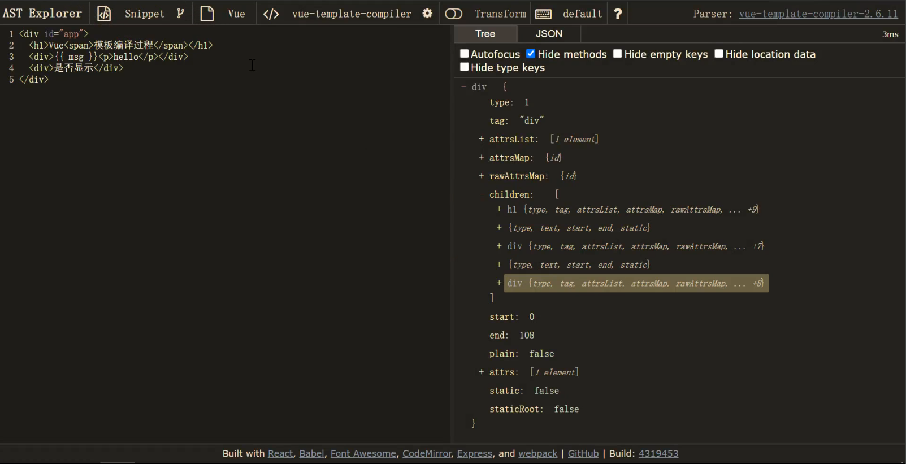
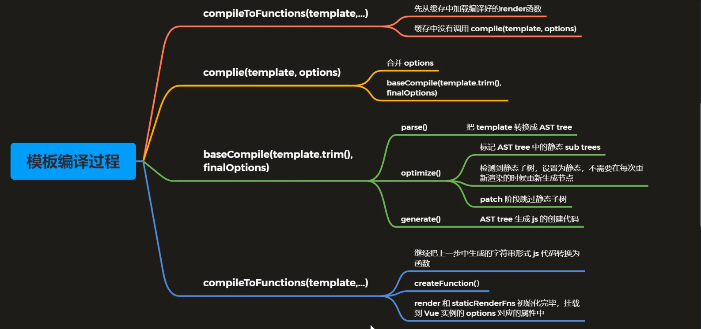

[TOC]

# vue.js模板编译和组件化

## 模板编译和组件化

## **模板编译**

- 模板编译的主要目的是将模板 (template) 转换为渲染函数 (render)

```html
<div>
  <h1 @click="handler">title</h1>
  <p>some content</p>
</div>
```

- 渲染函数 render

```js
render (h) {
  return h('div', [
    h('h1', { on: { click: this.handler} }, 'title'),
    h('p', 'some content')
  ])
}
```

- 模板编译的作用

- - Vue 2.x 使用 VNode 描述视图以及各种交互，用户自己编写 VNode 比较复杂
  - 用户只需要编写类似 HTML 的代码 - Vue 模板，通过编译器将模板转换为返回 VNode 的 render 函数
  - 编译可以分为运行时编译和构建时编译，运行时编译需要包含编译器的完整的vue文件，而构建时编译使用不包含编译器的runtime版本的vue文件，减少代码量
  - .vue 文件会被 webpack 在构建的过程中转换成 render 函数


### **模板编译结果**

- 带编译器版本的 Vue.js 中，使用 template 或 el 的方式设置模板

```html
<div id="app">
  <h1>Vue<span>模板编译过程</span></h1>
  <p>{{ msg }}</p>
  <comp @myclick="handler"></comp>
</div>
<script src="../../dist/vue.js"></script>
<script>
  Vue.component('comp', {
    template: '<div>I am a comp</div>'
  })
  const vm = new Vue({
    el: '#app',
    data: {
      msg: 'Hello compiler'
    },
    methods: {
      handler () {
        console.log('test')
      }
    }
  })
  console.log(vm.$options.render)
</script>
```

- 编译后 render 输出的结果

```js
(function anonymous() {
  with (this) {
    return _c(
      "div",    // tag
      { attrs: { id: "app" } }, // 描述tag的属性
      [
        _m(0),  // 调用renderStatic方法处理静态内容
        _v(" "),    // 创建空白的文本节点，换行和空白都会有
        _c("p", [_v(_s(msg))]), // 创建p标签对应的Vnode节点，_s 将数据转换成字符串
        _v(" "),
        _c("comp", { on: { myclick: handler } }),
      ],
      1  // 对children数组进行拍平处理
    );
  }
});
```

- `_c` 是 `createElement` 方法，定义的位置 `instance/render.js` 中
- _相关的渲染函数(_开头的方法定义)，在 `instance/render-helps/index.js` 中


### **Vue Template Explorer**

```html
<div id="app">
  <select>
    <option>
        
      {{ msg  }}
        
        
<!--加的这些换行会体现在转换后的render函数中，所以在2.x中尽量避免多余的空格-->
    </option>
  </select>
  <div>
    hello
  </div>
</div>
```

- vue-template-explorer

- - 是一种将Vue 2.6 把模板编译成 render 函数的工具

```js
function render() {
  with(this) {
    return _c('div', {
      attrs: {
        "id": "app"
      }
    }, [_c('select', [_c('option', [_v("\n      " + _s(msg) + "\n    ")])]),
      _c('div', [_v("\n    hello\n  ")])
    ])
  }
}
```

- vue-next-template-explorer

- - Vue 3.0 beta 把模板编译成 render 函数的工具

```js
import { toDisplayString as _toDisplayString, createVNode as _createVNode, openBlock as _openBlock, createBlock as _createBlock } from "vue"

export function render(_ctx, _cache, $props, $setup, $data, $options) {
  return (_openBlock(), _createBlock("div", { id: "app" }, [
    _createVNode("select", null, [
      _createVNode("option", null, _toDisplayString(_ctx.msg), 1 /* TEXT */)
    ]),
    _createVNode("div", null, " hello ")
  ]))
}
```

- 通过观察编译生成的render函数，总结

- - 在使用vue2.x的模板时，标签内的文本内容尽量不要添加多余的空白
  - vue3编译后的render函数已经去除了标签内多余的空白


## **模板编译的入口**

**编译入口**

- `src/platforms/web/entry-runtime-with-compiler.js`

```js
Vue.prototype.$mount = function (
  // ...
  // 把 template 转换成 render 函数
  const { render, staticRenderFns } = compileToFunctions(template, {
    outputSourceRange: process.env.NODE_ENV !== 'production',
    shouldDecodeNewlines,
    shouldDecodeNewlinesForHref,
    delimiters: options.delimiters,
    comments: options.comments
  }, this)
  options.render = render
  options.staticRenderFns = staticRenderFns
  // ...
)
```

- `src/platforms/web/compiler/index.js`

```js
import { baseOptions } from './options'
import { createCompiler } from 'compiler/index'

const { compile, compileToFunctions } = createCompiler(baseOptions)

export { compile, compileToFunctions }
```

- `src/compiler/index.js`

- - `baseCompile(template.trim(), finalOptions)`

```js
// `createCompilerCreator`允许创建使用替代解析器/优化器/代码生成的编译器，
// 例如SSR优化编译器。在这里，我们只是使用默认的部分导出一个默认的编译器。
export const createCompiler = createCompilerCreator(function baseCompile (
  template: string,
  options: CompilerOptions
): CompiledResult {
  // ...
})
```

- `src/compiler/create-compiler.js`

- - `complie(template, options)`
  - 内部把 `createCompiler` 中和平台相关的选项参数和用户传入的参数进行合并
  - 调用 `baseCompile` 把合并后的选项参数传递给它

```js
export function createCompilerCreator (baseCompile: Function): Function {
  // baseOptions 平台相关的options
  // src\platforms\web\compiler\options.js 中定义
  return function createCompiler (baseOptions: CompilerOptions) {
    function compile (
      template: string,
      options?: CompilerOptions
    ): CompiledResult {
      // ...
    }

    return {
      compile,
      compileToFunctions: createCompileToFunctionFn(compile)
    }
  }
}
```

- `src/compiler/to-function.js`

- - `compileToFunctions`

```js
export function createCompileToFunctionFn (compile: Function): Function {
  const cache = Object.create(null)

  return function compileToFunctions (
    template: string,
    options?: CompilerOptions,
    vm?: Component
  ): CompiledFunctionResult {
    // ...
  }
}
```

- 调试

  `compileToFunctions`

  执行过程，生成渲染函数的过程

- - `compileToFunctions`: [src/compiler/to-function.js](https://github.com/shiguanghai/vue/blob/dev/src/compiler/to-function.js)
  - `complie(template, options)`：[src/compiler/create-compiler.js](https://github.com/shiguanghai/vue/blob/dev/src/compiler/create-compiler.js)
  - `baseCompile(template.trim(), finalOptions)`：[src/compiler/index.js](https://github.com/shiguanghai/vue/blob/dev/src/compiler/index.js)


## **编译模板过程**

- 解析、优化、生成

### **compileToFunctions**

- `src/compiler/to-function.js`

```js
export function createCompileToFunctionFn (compile: Function): Function {
  const cache = Object.create(null)

  return function compileToFunctions (
    template: string,
    options?: CompilerOptions,
    vm?: Component
  ): CompiledFunctionResult {
    // 防止污染 vue 的options 故克隆一份
    options = extend({}, options)
    const warn = options.warn || baseWarn
    delete options.warn
    // ...

    // check cache
    // 1. 读取缓存中的 CompiledFunctionResult 对象，如果有直接返回
    const key = options.delimiters
      ? String(options.delimiters) + template
      : template
    if (cache[key]) {
      return cache[key]
    }

    // compile
    // 2. 把模板编译为编译对象(render, staticRenderFns)，字符串形式的js代码
    const compiled = compile(template, options)
    // ...

    // 3. 把字符串形式的js代码转换成js方法
    res.render = createFunction(compiled.render, fnGenErrors)
    res.staticRenderFns = compiled.staticRenderFns.map(code => {
      return createFunction(code, fnGenErrors)
    })
    // ...
    
    // 4. 缓存并返回res对象(render, staticRenderFns方法)
    return (cache[key] = res)
  }
}
```


### **compile**

- `src/compiler/create-compiler.js`

```js
export function createCompilerCreator (baseCompile: Function): Function {
  // baseOptions 平台相关的options
  // src\platforms\web\compiler\options.js 中定义
  return function createCompiler (baseOptions: CompilerOptions) {
    function compile (
      template: string,
      options?: CompilerOptions
    ): CompiledResult {
      // 合并 baseOptions 和 complice函数传递过来的options
      const finalOptions = Object.create(baseOptions)
      // 处理编译过程中出现的错误和信息
      const errors = []
      const tips = []

      let warn = (msg, range, tip) => {
        (tip ? tips : errors).push(msg)
      }

      if (options) {
        // ...
      }

      finalOptions.warn = warn

      // 通过 baseCompile 把模板编译成 render函数
      const compiled = baseCompile(template.trim(), finalOptions)
      if (process.env.NODE_ENV !== 'production') {
        detectErrors(compiled.ast, warn)
      }
      compiled.errors = errors
      compiled.tips = tips
      return compiled
    }

    return {
      compile,
      compileToFunctions: createCompileToFunctionFn(compile)
    }
  }
}
```


### **baseCompile**

- `src/compiler/index.js`

```js
// `createCompilerCreator` allows creating compilers that use alternative
// parser/optimizer/codegen, e.g the SSR optimizing compiler.
// Here we just export a default compiler using the default parts.
// `createCompilerCreator`允许创建使用替代解析器/优化器/代码生成的编译器，
// 例如SSR优化编译器。在这里，我们只是使用默认的部分导出一个默认的编译器。
export const createCompiler = createCompilerCreator(function baseCompile (
  template: string,
  options: CompilerOptions
): CompiledResult {
  // 把模板转换成 ast 抽象语法树
  // 抽象语法树，用来以树形的方式描述代码结构
  const ast = parse(template.trim(), options)
  if (options.optimize !== false) {
    // 优化抽象语法树
    optimize(ast, options)
  }
  // 把抽象语法树生成字符串形式的 js 代码
  const code = generate(ast, options)
  return {
    ast,
    // 渲染函数
    render: code.render,
    // 静态渲染函数，生成静态 VNode 树
    staticRenderFns: code.staticRenderFns
  }
})
```


### 基本流程是：

template模板 => 通过parse转换成AST抽象语法树 => 再通过optimize优化抽象语法树 => 通过generate将语法树转换成字符串形式的代码 。最终的目的就是将模板字符串转换成模板函数

整个编译过程分为三个阶段：

1. `parse`，将templat模板字符串转成AST抽象语法树
2. `optimize`，标注静态根节点，优化抽象语法树
3. `generate`，把抽象语法树转换成字符串形式的js代码，生成render表达式


### AST 抽象语法树(Abstract Syntax Tree)

- 使用对象的形式描述树形的代码结构

- 此处的抽象语法树是用来描述树形结构的 HTML 字符串

  

### 为什么要使用抽象语法树

- 模板字符串转换成 AST 后，可以通过 AST 对模板做优化处理
- 标记模板中的静态内容，在 patch 的时候直接跳过静态内容
- 在 patch 的过程中静态内容不需要对比和重新渲染


### 查看AST

- 使用 [astexplorer](https://astexplorer.net/)




### parse

- 解析器将templat模板解析为抽象语树 AST，只有将模板解析成 AST 后，才能基于它做优化或者生成代码字符串
- `src/compiler/index.js`

```js
const ast = parse(template.trim(), options)
//src\compiler\parser\index.js
parse()
```

- `src/compiler/parser/index.js`

```js
export function parse (
  template: string,
  options: CompilerOptions
): ASTElement | void {
  // 1. 解析 options
  ...

  // 2. 对模板解析
  parseHTML(template, {
    // 解析过程中的回调函数，生成 AST
    // start end chars comment
    ...
  })
  // 存储的就是解析好的AST对象
  return root
}
```

- `src/compiler/parser/html-parser.js`

```js
/*!
 * HTML Parser By John Resig (ejohn.org)
 * Modified by Juriy "kangax" Zaytsev
 * Original code by Erik Arvidsson (MPL-1.1 OR Apache-2.0 OR GPL-2.0-or-later)
 * http://erik.eae.net/simplehtmlparser/simplehtmlparser.js
 */
// HTML解析器 作者：John Resig (ejohn.org) 修改：Juriy "kangax" Zaytsev 原代码：Erik Arvidsson (MPL-1.1 OR Apache-2.0 OR GPL-2.0-or-later)
// 借鉴一个开源库 simplehtmlparser
// 文件中定义了很多正则表达式
// 作用是来匹配 HTML 字符串模板中的内容

// ...
export function parseHTML (html, options) {
  // ...
  // 遍历html模板字符串
  while (html) {
    last = html
    // Make sure we're not in a plaintext content element like script/style
    if (!lastTag || !isPlainTextElement(lastTag)) {
      let textEnd = html.indexOf('<')
      if (textEnd === 0) {
        // Comment:
        if (comment.test(html)) {
          const commentEnd = html.indexOf('-->')

          if (commentEnd >= 0) {
            if (options.shouldKeepComment) {
              // 如果当前找到注释标签 并且调用 options.comment方法后
  			  // 会把处理完的文本截取掉 继续去处理剩余的部分
 			  // 这个 comment 是调用 parseHTML 的时候传递进来的方法
              options.comment(html.substring(4, commentEnd), index, index + commentEnd + 3)
            }
            advance(commentEnd + 3)
            continue
          }
        }
        
        // http://en.wikipedia.org/wiki/Conditional_comment#Downlevel-revealed_conditional_comment
        // 通过正则表达式来匹配是否是条件注释
        if (conditionalComment.test(html)) {
          const conditionalEnd = html.indexOf(']>')

          if (conditionalEnd >= 0) {
            advance(conditionalEnd + 2)
            continue
          }
        }

        // Doctype:
        const doctypeMatch = html.match(doctype)
        // 通过正则表达式来匹配是否是文档声明
        if (doctypeMatch) {
          // ...
        }

        // End tag:
        const endTagMatch = html.match(endTag)
        // 通过正则表达式来匹配是否是结束标签
        if (endTagMatch) {
          // ...
        }

        // Start tag:
        const startTagMatch = parseStartTag()
        // 通过正则表达式来匹配是否是开始标签
        if (startTagMatch) {
          // 函数内最终调用了 options.start()
          handleStartTag(startTagMatch)
          if (shouldIgnoreFirstNewline(startTagMatch.tagName, html)) {
            advance(1)
          }
          continue
        }
      }
      // ...
    }    
  }
}
```

- 这里仅来演示 start 方法，其他几个方法类似，当 parseHTML 处理完毕就把 模板字符串 转化成了 AST对象 最后返回

- options.start是在调用parseHTML的时候传递进来的

- - **start** end chars comment 都是处理完对应的内容之后调用的

- **start** 方法是在解析到 **开始标签** 的时候调用的

1. 方法中首先调用了createASTElement `let element: ASTElement = createASTElement(tag, attrs, currentParent)`

```js
export function createASTElement (
  tag: string,
  attrs: Array<ASTAttr>,
  parent: ASTElement | void
): ASTElement {
  return {
    type: 1,
    tag,
    attrsList: attrs, // 标签的属性数值
    attrsMap: makeAttrsMap(attrs), // 转化为对象
    rawAttrsMap: {},
    parent,
    children: []
  }
}
// 这个函数就是返回了一个AST对象
```

1. 当生成 ASTElement 之后开始给AST的各种属性赋值
2. 开始处理指令 `processPre(element)` 用来处理 `v-pre` 指令

```js
function processPre (el) {
  // 调用getAndRemoveAttr获取v-pre指令 再从AST移除对应属性
  if (getAndRemoveAttr(el, 'v-pre') != null) {
    // 如果有v-pre 记录属性
    el.pre = true
  }
}
```

3. 处理结构化指令 `v-for`  `v-if`  `v-once`

```js
processFor(element)
processIf(element)
processOnce(element)
```

- `parse` 函数内部处理过程中会依次去遍历html模板字符串，把其转换成AST对象，html中的属性和指令都会记录在AST对象的相应属性上


### optimize

- 优化抽象语法树，检测子节点中是否是纯静态节点

- 一旦检测到纯静态节点（对应的DOM子树永远不会发生变化）

- - 提升为常量，重新渲染的时候不在重新创建节点
  - 在 patch 的时候直接跳过静态子树

- `src/compiler/index.js`

```js
if (options.optimize !== false) {
  // 优化抽象语法树
  optimize(ast, options)
}
```

- `src/compiler/optimizer.js`

```js
/**
 * Goal of the optimizer: walk the generated template AST tree
 * and detect sub-trees that are purely static, i.e. parts of
 * the DOM that never needs to change.
 *
 * Once we detect these sub-trees, we can:
 *
 * 1. Hoist them into constants, so that we no longer need to
 *    create fresh nodes for them on each re-render;
 * 2. Completely skip them in the patching process.
 */
// 优化的目的：标记抽象语法树的静态节点，即DOM中永远不需要改变的部分
// 当标记完静态子树后，将来就不需要进行渲染，在patch的时候直接跳过静态子树
// 一旦我们检测到这些子树，我们就可以做到： 
// 1. 将它们提升为常量，这样我们就不再需要在每次重新渲染时为它们创建新的节点；
// 2. 在修补过程中完全跳过它们。
export function optimize (root: ?ASTElement, options: CompilerOptions) {
  // 判断root，是否传递 AST 对象
  if (!root) return
  isStaticKey = genStaticKeysCached(options.staticKeys || '')
  isPlatformReservedTag = options.isReservedTag || no
  // first pass: mark all non-static nodes.
  // 标记静态节点
  markStatic(root)
  // second pass: mark static roots.
  // 标记静态根节点
  markStaticRoots(root, false)
}
```

- `markStatic`

```js
function markStatic (node: ASTNode) {
  // 判断当前 astNode 是否是静态的
  node.static = isStatic(node)
  // 元素节点
  if (node.type === 1) {
    // do not make component slot content static. this avoids
    // 1. components not able to mutate slot nodes
    // 2. static slot content fails for hot-reloading
    // 不要把组件槽的内容做成静态的，这样就避免了
    // 1.组件无法突变槽节点
    // 2.静态槽内容热重装失败。
    // 是组件，不是slot，没有inline-template
    if (
      !isPlatformReservedTag(node.tag) &&
      node.tag !== 'slot' &&
      node.attrsMap['inline-template'] == null
    ) {
      return
    }
    // 遍历 children
    for (let i = 0, l = node.children.length; i < l; i++) {
      const child = node.children[i]
      // 标记静态
      markStatic(child)
      if (!child.static) {
        // 如果有一个 child 不是 static，当前 node 不是static
        node.static = false
      }
    }
    if (node.ifConditions) {
      for (let i = 1, l = node.ifConditions.length; i < l; i++) {
        const block = node.ifConditions[i].block
        markStatic(block)
        if (!block.static) {
          node.static = false
        }
      }
    }
  }
}
```

- `markStaticRoots`

```js
function markStaticRoots (node: ASTNode, isInFor: boolean) {
  if (node.type === 1) {
    if (node.static || node.once) {
      node.staticInFor = isInFor
    }
    // For a node to qualify as a static root, it should have children that
    // are not just static text. Otherwise the cost of hoisting out will
    // outweigh the benefits and it's better off to just always render it fresh.
    // 如果一个元素内只有文本节点，此时这个元素不是静态的Root
    // Vue 认为这种优化会带来负面的影响
    if (node.static && node.children.length && !(
      node.children.length === 1 &&
      node.children[0].type === 3
    )) {
      node.staticRoot = true
      return
    } else {
      node.staticRoot = false
    }
    // 检测当前节点的子节点中是否有静态的Root
    if (node.children) {
      for (let i = 0, l = node.children.length; i < l; i++) {
        markStaticRoots(node.children[i], isInFor || !!node.for)
      }
    }
    if (node.ifConditions) {
      for (let i = 1, l = node.ifConditions.length; i < l; i++) {
        markStaticRoots(node.ifConditions[i].block, isInFor)
      }
    }
  }
}
```


### generate

- 把抽象语法树转换成字符串形式的js代码，生成render表达式
- `src/compiler/index.js`

```js
// 把抽象语法树生成字符串形式的 js 代码
const code = generate(ast, options)
```

- `src/compiler/codegen/index.js`

```js
export function generate (
  ast: ASTElement | void,
  options: CompilerOptions
): CodegenResult {
  // 代码生成过程中使用到的状态对象
  const state = new CodegenState(options)
  // AST存在，调用genElement生成代码
  const code = ast ? genElement(ast, state) : '_c("div")'
  return {
    render: `with(this){return ${code}}`,
    staticRenderFns: state.staticRenderFns
  }
}

// 把字符串转换成函数
// src\compiler\to-function.js
function createFunction (code, errors) {
  try {
    return new Function(code)
  } catch (err) {
    errors.push({ err, code })
    return noop
}
```


## **模板编译过程总结**




## **组件化**

### **基础回顾**

- 一个 Vue 组件就是一个拥有预定义选项的一个 Vue 实例

- 一个组件可以组成页面上一个功能完备的区域，组件可以包含脚本、样式、模板

  

### **组件化机制**

- 组件化可以让我们方便的把页面拆分成多个可重用的组件
- 组件是独立的，系统内可重用，组件之间可以嵌套
- 有了组件可以像搭积木一样开发网页
- 组件实例的创建过程是从上而下
- 组件实例的挂载过程是从下而上


### **组件注册**

Vue中注册组件的两种方式

- 全局注册：在任何位置都可以使用
- 局部注册：只能在当前注册的范围中使用

**全局组件的注册方式**

```js
<div id="app">
</div>
<script>
  // 从源码可知，自定义组件、自定义指令，自定义过滤器的定义方式及使用方式都是基本相同的
  const Comp = Vue.component('comp', {
    template: '<div>Hello Component</div>'
  })
  const vm = new Vue({
    el: '#app',
    render (h) {
	  return h(Comp)
    }
  })
</script>
```

以上创建了一个全局组件`Comp`，在任何位置都可以直接使用，在Vue的选项render函数中通过h函数创建组件对应的vnode，下面我们来看一下注册全局组件的`Vue.component`这个函数的内部实现：

- `src/core/global-api/index.js`

```js
import { initAssetRegisters } from './assets'
// ...
// 注册 Vue.directive()、Vue.component()、Vue.filter()
initAssetRegisters(Vue)
```

- `src/core/global-api/assets.js`

```js
import { ASSET_TYPES } from 'shared/constants'
// ...
// 接收Vue构造函数作为参数
export function initAssetRegisters (Vue: GlobalAPI) {
  // 遍历 ASSET_TYPES 数组，为 Vue 定义相应方法
  // ASSET_TYPES 包括了directive、 component、filter
  ASSET_TYPES.forEach(type => {
    // ...
  })
}
```

- `src/shared/constans.js`

```js
// 对应 Vue.component、Vue.directive、Vue.filter
export const ASSET_TYPES = [
  'component',
  'directive',
  'filter'
]
```

- `src/core/global-api/assets.js`

```js
ASSET_TYPES.forEach(type => {
  Vue[type] = function (
    id: string,
    definition: Function | Object
  ): Function | Object | void {
    if (!definition) {
      // 没有传定义 直接取出定义好的 directives、components、filters 并返回
      return this.options[type + 's'][id]
    } else {
      /* istanbul ignore if */
      // 环境判断
      if (process.env.NODE_ENV !== 'production' && type === 'component') {
        validateComponentName(id)
      }
      // Vue.component('comp', { template: '' })
      // 类型(type)是否是组件 如果是 判断传递的对象(definition)是否是原始对象([object Object])
      if (type === 'component' && isPlainObject(definition)) {
        definition.name = definition.name || id
        // 把组件配置转换为组件的构造函数
        // _base == Vue
        definition = this.options._base.extend(definition)
      }
      // 类型(type)是否是指令 如果是 判断传递的函数(definition) 将function设置给bind update
      if (type === 'directive' && typeof definition === 'function') {
        definition = { bind: definition, update: definition }
      }
      // 指令 - 传对象 或 组件 - 直接传构造函数：则直接存储
      // 全局注册，存储资源并赋值
      // this.options['components']['comp'] = definition
      this.options[type + 's'][id] = definition
      return definition
    }
  }
})
```

重点来看 `Vue.component` 全局组件的注册过程，其中如果第二个参数传递是对象，调用`Vue.extend`，把组件的选项对象转换成组件的构造函数，最终记录到`options.components`中；如果第二个参数是函数，会直接把这个函数记录到`options.components`中。

```js
// Vue.component('comp', { template: '' })
// 类型(type)是否是组件 如果是 判断传递的对象(definition)是否是原始对象([object Object])
if (type === 'component' && isPlainObject(definition)) {
  definition.name = definition.name || id
  // 把组件配置转换为组件的构造函数
  // _base == Vue
  definition = this.options._base.extend(definition)
}
```


### **Vue.extend**

- `src/core/global-api/extend.js`

```js
export function initExtend (Vue: GlobalAPI) {
  /**
   * Each instance constructor, including Vue, has a unique
   * cid. This enables us to create wrapped "child
   * constructors" for prototypal inheriance and cache them.
   */
  // 包括Vue在内的每个实例构造函数都有一个唯一的cid
  // 这使我们能够为原型继承创建封装的 "子构造函数"，并将它们缓存起来。
  Vue.cid = 0
  let cid = 1

  /**
   * Class inheritance
   */
  Vue.extend = function (extendOptions: Object): Function {
    extendOptions = extendOptions || {}
    // Vue 构造函数
    const Super = this
    const SuperId = Super.cid
    // 从缓存中加载组件的构造函数
    const cachedCtors = extendOptions._Ctor || (extendOptions._Ctor = {})
    // 通过cid获取缓存的组件的构造函数，有的话直接返回
    if (cachedCtors[SuperId]) {
      return cachedCtors[SuperId]
    }

    const name = extendOptions.name || Super.options.name
    if (process.env.NODE_ENV !== 'production' && name) {
      // 如果是开发环境验证组件的名称
      validateComponentName(name)
    }

    // 给Sub初始化VueComponent构造函数（组件构建的构造函数）
    const Sub = function VueComponent (options) {
      // 调用 _init() 初始化 
      this._init(options)
    }
    // 原型继承自 Vue
    // Vue的原型上之前注入了_init()
    // 所以Sub的实例也可以访问到_init()
    Sub.prototype = Object.create(Super.prototype)
    Sub.prototype.constructor = Sub
    Sub.cid = cid++
    // 合并 options
    Sub.options = mergeOptions(
      Super.options,
      extendOptions
    )
    Sub['super'] = Super

    // For props and computed properties, we define the proxy getters on
    // the Vue instances at extension time, on the extended prototype. This
    // avoids Object.defineProperty calls for each instance created.
    // 对于props和计算属性，我们在扩展时在Vue实例上，在扩展原型上定义代理获取器
    // 这样就避免了对每个创建的实例进行Object.defineProperty调用
    if (Sub.options.props) {
      initProps(Sub)
    }
    if (Sub.options.computed) {
      initComputed(Sub)
    }

    // allow further extension/mixin/plugin usage
    Sub.extend = Super.extend
    Sub.mixin = Super.mixin
    Sub.use = Super.use

    // create asset registers, so extended classes
    // can have their private assets too.
    ASSET_TYPES.forEach(function (type) {
      Sub[type] = Super[type]
    })
    // enable recursive self-lookup
    // 把组件构造构造函数保存到 Ctor.options.components.comp = Ctor
    if (name) {
      Sub.options.components[name] = Sub
    }

    // keep a reference to the super options at extension time.
    // later at instantiation we can check if Super's options have
    // been updated.
    Sub.superOptions = Super.options
    Sub.extendOptions = extendOptions
    Sub.sealedOptions = extend({}, Sub.options)

    // cache constructor
    // 把组件的构造函数缓存到 options._Ctor
    cachedCtors[SuperId] = Sub
    return Sub
  }
}
```

- 它内部就是基于传入的选项对象**创建了组件的构造函数**，组件的构造函数继承自Vue构造函数，所以组件对象拥有和Vue实例一样的成员


### **组件创建过程**

- 回顾首次渲染过程

- - Vue 构造函数
  - `this._init`
  - `this.$mount`
  - `mountComponent`
  - `new Watcher` 渲染 Watcher
  - `updateComponent`
  - `vm._render` => `createElement`
  - `vm._update`


**观察如下代码：**

```js
const Comp = Vue.component('comp', {
  template: '<div>Hello Component</div>'
})
const vm = new Vue({
  el: '#app',
  render (h) {
  return h(Comp)
  }
})
```

首先通过 `Vue.component` 返回了一个组件的构造函数，在 `render` 中的 `h` 函数就是 `createElement` 函数，调用 `createElement` 的时候传入了组件的构造函数，并且将组件转换成Vnode的形式。

我们要看的就是在 `createElement` 中是如何去处理组件的

- `_createElement` 中调用 `createComponent`
- `src/core/vdom/create-element.js`

```js
// 判断 tag 是字符串还是组件
if (typeof tag === 'string') { // ...
} else {
  // direct component options / constructor
  // 如果不是字符串的话就是组件了，通过createComponent把组件转换成了Vnode对象
  vnode = createComponent(tag, data, context, children)
}
```

- `createComponent` 中调用创建自定义组件对应的 VNode
- `src/core/vdom/create-component.js`

```js
export function createComponent (
  Ctor: Class<Component> | Function | Object | void,
  data: ?VNodeData,
  context: Component,
  children: ?Array<VNode>,
  tag?: string
): VNode | Array<VNode> | void {
  if (isUndef(Ctor)) {
    return
  }

  // context.$options._base 就是 Vue构造函数
  // 在_init()会把Vue构造函数中的选项合并到Vue实例的选项中
  // 所以此处可以通过context（实例的选项）获取_base
  const baseCtor = context.$options._base

  // plain options object: turn it into a constructor
  // 如果 Ctor 不是一个构造函数，是一个对象
  // 使用 Vue.extend() 创造一个子组件的构造函数
  // render: h => h(App)  这种情况会进入
  if (isObject(Ctor)) {
    Ctor = baseCtor.extend(Ctor)
  }

  // ...

  data = data || {}

  // resolve constructor options in case global mixins are applied after
  // component constructor creation
  // 解决在创建组件构造函数后合并当前组件选项和通过Vue.mixins混入的情况下的构造函数选项
  resolveConstructorOptions(Ctor)

  // transform component v-model data into props & events
  // 处理组件上的 v-model
  if (isDef(data.model)) {
    transformModel(Ctor.options, data)
  }

  // ...

  // install component management hooks onto the placeholder node
  // 安装组件的钩子函数 init/prepatch/insert/destroy
  // 准备好了 data.hook 中的钩子函数
  installComponentHooks(data)

  // return a placeholder vnode
  const name = Ctor.options.name || tag
  
  // 创建自定义组件对应的 VNode 对象，设置自定义组件的名字
  // 记录this.componentOptions = componentOptions
  const vnode = new VNode(
    `vue-component-${Ctor.cid}${name ? `-${name}` : ''}`,
    data, undefined, undefined, undefined, context,
    { Ctor, propsData, listeners, tag, children },
    asyncFactory
  )
  
  // ...

  return vnode
}
```

- `installComponentHooks` 初始化组件的 `data.hook`

```js
function installComponentHooks (data: VNodeData) {
  // 获取用户传入的组件的钩子函数
  const hooks = data.hook || (data.hook = {})
  // 用户可以传递自定义钩子函数
  // 把用户传入的自定义钩子函数和 componentVNodeHooks 中预定义的钩子函数合并
  for (let i = 0; i < hooksToMerge.length; i++) {
    const key = hooksToMerge[i]
    const existing = hooks[key]
    const toMerge = componentVNodeHooks[key]
    if (existing !== toMerge && !(existing && existing._merged)) {
      hooks[key] = existing ? mergeHook(toMerge, existing) : toMerge
    }
  }
}
```


```js
const hooksToMerge = Object.keys(componentVNodeHooks)
```

- 钩子函数定义的位置（ `init` 钩子中创建组件的实例）

```js
// 组件创建时的四个钩子函数
const componentVNodeHooks = {
  init (vnode: VNodeWithData, hydrating: boolean): ?boolean {
    if (
      vnode.componentInstance &&
      !vnode.componentInstance._isDestroyed &&
      vnode.data.keepAlive
    ) {
      // kept-alive components, treat as a patch
      const mountedNode: any = vnode // work around flow
      componentVNodeHooks.prepatch(mountedNode, mountedNode)
    } else {
      // 创建组件，将组件转换成Vnode的形式
      const child = vnode.componentInstance = createComponentInstanceForVnode(
        vnode,
        activeInstance
      )
      child.$mount(hydrating ? vnode.elm : undefined, hydrating)
    }
  },

  prepatch (oldVnode: MountedComponentVNode, vnode: MountedComponentVNode) {
    // ...
  },

  insert (vnode: MountedComponentVNode) {
    // ...
  },

  destroy (vnode: MountedComponentVNode) {
    // ...
  }
}
```

- **创建组件实例**的位置，由自定义组件的 `init` 钩子方法调用

```js
export function createComponentInstanceForVnode (
  vnode: any, // we know it's MountedComponentVNode but flow doesn't
  parent: any, // activeInstance in lifecycle state
): Component {
  const options: InternalComponentOptions = {
    _isComponent: true,
    _parentVnode: vnode,
    parent
  }
  // check inline-template render functions
  // 获取 inline-template
  // <comp inline-template> xxxx </comp>
  const inlineTemplate = vnode.data.inlineTemplate
  if (isDef(inlineTemplate)) {
    options.render = inlineTemplate.render
    options.staticRenderFns = inlineTemplate.staticRenderFns
  }
    
  // 创建组件实例
  return new vnode.componentOptions.Ctor(options)
}
```

- `init` 钩子函数又是在什么地方调用的呢？ 它是在 `patch` 的过程中调用的


### **组件实例的创建和挂载过程**

- 我们看过了组件被转换为VNode的过程，接下来再来看 `init` 钩子函数调用的位置，因为在 `init` 钩子函数在中最终创建了组件对象，`init` 钩子函数是在 `patch` 中调用的
- `src/core/vdom/patch.js`
- `Vue._update` -> `patch` -> `createElm` -> `createComponent`
- 创建组件实例，挂载到真实 DOM

```js
function createComponent (vnode, insertedVnodeQueue, parentElm, refElm) {
  let i = vnode.data
  if (isDef(i)) {
    const isReactivated = isDef(vnode.componentInstance) && i.keepAlive
    if (isDef(i = i.hook) && isDef(i = i.init)) {
      // 调用 init() 方法，创建和挂载组件实例
      // init() 的过程中创建好了组件的真实 DOM,挂载到了 vnode.elm 上
      i(vnode, false /* hydrating */)
    }
    // after calling the init hook, if the vnode is a child component
    // it should've created a child instance and mounted it. the child
    // component also has set the placeholder vnode's elm.
    // in that case we can just return the element and be done.
    if (isDef(vnode.componentInstance)) {
      // 调用钩子函数（VNode的钩子函数初始化属性/事件/样式等，组件的钩子函数）
      initComponent(vnode, insertedVnodeQueue)
      // 把组件对应的 DOM 插入到父元素中
      insert(parentElm, vnode.elm, refElm)
      if (isTrue(isReactivated)) {
        reactivateComponent(vnode, insertedVnodeQueue, parentElm, refElm)
      }
      return true
    }
  }
}
```

- 调用钩子函数，设置局部作用于样式

```js
function initComponent (vnode, insertedVnodeQueue) {
  if (isDef(vnode.data.pendingInsert)) {
    insertedVnodeQueue.push.apply(insertedVnodeQueue, vnode.data.pendingInsert)
    vnode.data.pendingInsert = null
  }
  vnode.elm = vnode.componentInstance.$el
  if (isPatchable(vnode)) {
    // 调用钩子函数
    invokeCreateHooks(vnode, insertedVnodeQueue)
    // 设置局部作用于样式
    setScope(vnode)
  } else {
    // empty component root.
    // skip all element-related modules except for ref (#3455)
    registerRef(vnode)
    // make sure to invoke the insert hook
    insertedVnodeQueue.push(vnode)
  }
}
```

- 调用钩子函数

```js
  function invokeCreateHooks (vnode, insertedVnodeQueue) {
    // 调用 VNode 的钩子函数
    for (let i = 0; i < cbs.create.length; ++i) {
      cbs.create[i](emptyNode, vnode)
    }
    i = vnode.data.hook // Reuse variable
    // 调用组件的钩子函数
    if (isDef(i)) {
      if (isDef(i.create)) i.create(emptyNode, vnode)
      if (isDef(i.insert)) insertedVnodeQueue.push(vnode)
    }
  }
```


## **总结**

### **整体流程：**

- `Vue._update` -> `patch`  -> `createElm`  -> `createComponent`
- 在 `Vue.extend` 方法中进行了组件构造函数的定义
- 在自定义组件的init钩子函数中进行了组件构造函数的实例化，**创建了自定义组件**，`init` 函数是在 `patch` 时进行的调用
- 然后在 `createComponent` 中将自定义的组件转**换成了对应的 Vnode 对象**
- 最后在 `patch` 中将Vnode 转换成真实的DOM挂载到DOM树


### **其他**

- 组件实例的创建过程是从上而下（父组件  -> 子组件）

- 组件实例的挂载过程是从下而上（子组件  -> 父组件）

- 由此我们可以总结出来，组件的粒度不是越小越好

- - 因为嵌套一层组件，就会重复执行一遍**组件的创建过程**，比较消耗性能。
  - 组件的抽象过程要合理，比如侧边栏组件，它内部的导航如果外部没有再次使用的话，可以把侧边栏和内部的导航设计成一个组件，减少组件重新创建的过程。
