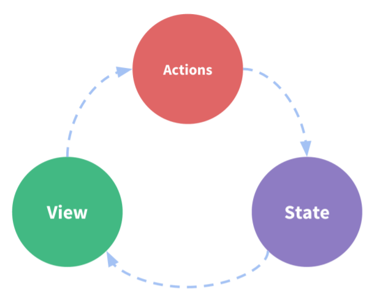
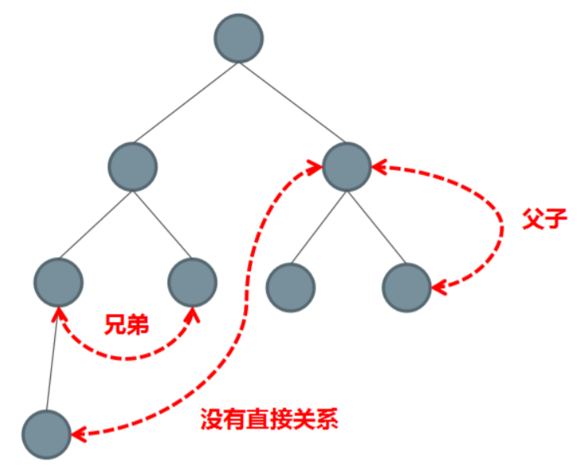
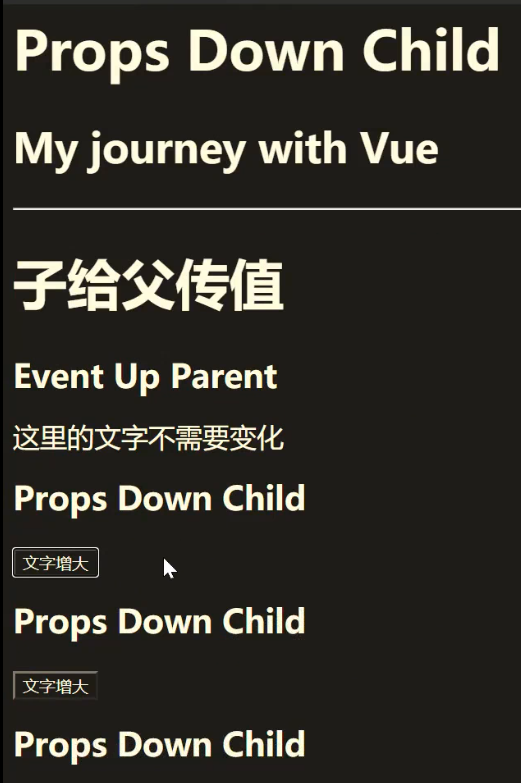
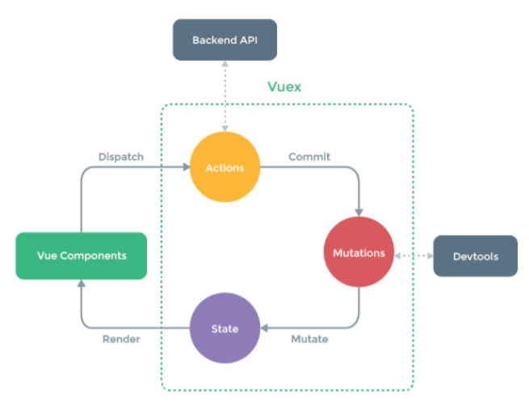

[TOC]

# vuex状态管理

## **组件通信方式**

### **组件内的状态管理流程**

Vue 最核心的两个功能：数据驱动 和 组件化

组件化开发优点：

- 更快的开发效率
- 更好的可维护性

**每个组件都有自己的状态（state）、视图（view）和行为（actions）等组成部分**

下面是一个最简单的组件的代码，每个组件内部都有自己的数据、模板还有方法。

- 数据可以称之为状态，每个组件内部都可以管理自己的内部状态
- 模板可以称之为视图，每个组件都有自己的视图，把状态绑定到视图上给用户
- 用户与视图交互的时候可能会更改状态，当状态发生变化后会自动更新到视图，更改状态的部分可以称之为行为

```js
new Vue({
  // state
  data () {
    return {
      count: 0
    }
  },
  // view
  template: `
    <div>{{ count }}</div>
  `,
  // actions
  methods: {
    increment () {
      this.count++
    }
  }
})
```



上述描述的是单个组件的状态管理，实际开发过程中可能多个组件都要共享状态，我们所说的状态管理就是通过状态集中管理和分发解决多个组件共享状态的问题。

状态管理包含以下几部分：

- **state**：驱动应用的数据源
- **view**：以声明方式将 **state** 映射到视图
- **actions**：响应在 **view** 上的用户输入导致的状态变化

这里的箭头是数据的流向，此处数据的流向是单向的，State状态就是我们所说的数据，数据绑定到视图展示给用户，当用户和视图交互，通过Actions更改数据之后，更改后的数据重新绑定到视图。

单向的数据流程非常清晰，但是多个组件共享数据时会破坏这种简单的结构，接下来我们来看一下组件之间的通信方式。


### **组件间通信方式**

- 大多数场景下的组件都并不是独立存在的，而是相互协助共同构成了一个复杂的业务功能
- 在 Vue 中为不同的组件关系提供了不同的通信规则



- 组件间传值可分为；

- - 父传子
  - 子传父
  - 不相关组件之间


### 父向子传值

1. 直接数组声明不带类型校验 也就是父组件中调用子组件时，在子组件的调用标签上用：绑定一个属性，属性值是父组件data中的数据，然后子组件在 `export default {}` 内部和 `data` 平级创建一个 `props` 数组，并再该数组中用字符串的形式定义传递过来的标签中绑定的属性名即可。
2. 带类型校验的父向子传值（和上一种区别在子组件接收的方式上） 这种传值方式是在子组件中规定好要接收的数据类型，并且这种传值方式的 `props` 不是个数组了，也不用字符串来声明接收到的属性名称了。而是采用对象的形式来接收
3. 注意：如果其他地方要使用 `props` 里面的数据，也得需要加this来访问数据

```js
export default {
    name: 'sonComponent'
    props:{
        title:{     //  这个title就是父组件传递过来的值
            type:Object,
            default: () => {
                return {}
            }
        },
         number:{
             type:Number,
              default; () => {
                  return 0
              }
         },
         // ...
    }
}
//  其中type是用来规定接收数据的类型，default是默认值（以函数的形式返回默认值），required：是否为必填
```


### 子向父传值

- 在子组件中使用 `$emit` 发布一个自定义事件：

```js
// Child.vue

<template>
  <div>
    <h1 :style="{ fontSize: fontSize + 'em' }">Props Down Child</h1>
    <button @click="handler">文字增大</button>
  </div>
</template>

<script>
export default {
  props: {
    fontSize: Number
  },
  methods: {
    handler () {
      // this：当前子组件对象
      this.$emit('enlargeText', 0.1)
    }
  }
}
</script>
```

在使用这个组件时，使用 `v-on` 监听这个自定义事件，然后当在父级组件监听这个事件的时候，我们可以通过 `$event` 访问到被抛出的这个值：(在模板区域中如果想接收$emit传递过来的参数须使用$event)

```vue
// Parent.vue

<template>
  <div>
    <h1 :style="{ fontSize: hFontSize + 'em'}">Event Up Parent</h1>

    这里的文字不需要变化

    <child :fontSize="hFontSize" v-on:enlargeText="enlargeText"></child>
    <child :fontSize="hFontSize" v-on:enlargeText="enlargeText"></child>
<!--这里第一个enlargeText是子组件用$emit触发的，而后面的是$emit触发后父组件中的处理函数-->
    <child :fontSize="hFontSize" v-on:enlargeText="hFontSize += $event"></child>
  </div>
</template>

<script>
import child from './02-Child'
export default {
  components: {
    child
  },
  data () {
    return {
      hFontSize: 1
    }
  },
  methods: {
    enlargeText (size) {
      this.hFontSize += size
    }
  }
}
</script>
```




### 不相关组件传值

我们可以使用一个非常简单的 Event Bus（创建一个公共的Vue实例作为事件总线/事件中心）来解决这个问题： 创建一个新的空vue实例并暴露出去，这个组件作为公共的‘事件处理中心’bus,即当作两个组件的桥梁，在两个兄弟组件中分别引入刚才创建的bus，假如A要是向B传值，就在组件A中通过`bus.$emit（’自定义事件名’，要发送的值）`发送数据，在组件B中通过`bus.$on（‘自定义事件名‘,function(v) { //v即为要接收的值 }）`来监听自定义的事件，并获取数据。（都是用bus的 `$emit` 来派发，和bus的 `$on` 来接收，相当于自己给自己发）

如下：

```js
// evenrbus.js

import Vue from 'vue'
export default new Vue() 
```

然后在需要通信的两端：

- 使用 `$emit` 发布：

```vue
// Sibling-01.vue

<template>
  <div>
    <h1>Event Bus Sibling01</h1>
    <div class="number" @click="sub">-</div>
    <input type="text" style="width: 30px; text-align: center" :value="value">
    <div class="number" @click="add">+</div>
  </div>
</template>

<script>
import bus from './eventbus'

export default {
  props: {
    // 文本框默认显示的商品个数
    num: Number
  },
  // 因为props的值不建议直接修改，将props数据存储到value中
  created () {
    this.value = this.num
  },
  data () {
    return {
      value: -1
    }
  },
  methods: {
    sub () {
      if (this.value > 1) {
        this.value--
        bus.$emit('numchange', this.value)
      }
    },
    add () {
      this.value++
      bus.$emit('numchange', this.value)
    }
  }
}
</script>
```

- 使用 `$on` 订阅：

```vue
// Sibling-02.vue

<template>
  <div>
    <h1>Event Bus Sibling02</h1>

    <div>{{ msg }}</div>
  </div>
</template>

<script>
import bus from './eventbus'
export default {
  data () {
    return {
      msg: ''
    }
  },
  created () {
    bus.$on('numchange', (value) => {
      this.msg = `您选择了${value}件商品`
    })
  }
}
</script>
```


### 其他组件传值方法（不推荐）

**父直接访问子组件：通过 ref 获取子组件**

- **ref 有两个作用：**

- - 如果你把它作用到普通 HTML 标签上，则获取到的是 DOM 对象
  - 如果你把它作用到组件标签上，则获取到的是组件实例对象

- 在使用子组件的时候，添加 `ref` 属性：

```vue
// Child.vue

<template>
  <div>
    <h1>ref Child</h1>
    <input ref="input" type="text" v-model="value"> // 在HTML标签上使用
  </div>
</template>

<script>
export default {
  data () {
    return {
      value: ''
    }
  },
  methods: {
    // 用来从父级组件聚焦输入框
    focus () {
      this.$refs.input.focus()
    }
  }
}
</script>
```

- 然后在父组件等渲染完毕后使用 `$refs` 访问：

```vue
// Parent.vue

<template>
  <div>
    <h1>ref Parent</h1>

    <child ref="c"></child>  // 在组件上使用ref
  </div>
</template>

<script>
import child from './04-Child'
export default {
  components: {
    child
  },
  mounted () {
    this.$refs.c.focus()
    this.$refs.c.value = 'hello input'
  }
}
</script>
```

- **$refs** 只会在组件渲染完成之后生效，并且它们不是响应式的。这仅作为一个用于直接操作子组件的一种捷径，但是尽量避免在模板或计算属性中访问 **$refs**。


### **简易的状态管理方案**

如果多个组件之间要共享状态（数据），使用上面的方式虽然可以实现，但是比较麻烦，而且多个组件之间互相传值很难追踪数据的变化，如果出现问题很难定位问题。

当遇到多个组件需要共享状态的时候，典型的场景：购物车。我们使用上述的方式都不合适，我们会遇到以下的问题：

- 多个视图依赖同一状态
- 来自不同视图的行为需要变更同一状态

对于问题一，传参的方法对于多层嵌套的组件将会非常繁琐，并且对于兄弟组件间的状态传递无能为力。

对于问题二，我们经常会采用父子组件直接引用或者通过事件来变更和同步状态的多份拷贝。

以上的这些模式非常脆弱，通常会导致无法维护的代码。

因此，我们为什么不把组件的的共享状态抽取出来（将来使用时保证其为响应式的），以一个全局单例模式来管理呢？在这种模式下，我们的组件树构成了一个巨大的“视图”，不管树在哪个位置，任何组件都能获取状态或者触发行为。

我们可以把多个组件的状态，或者整个程序的状态放到一个集中的位置存储，并且可以检测到数据的更改。你可能已经想到了 Vuex，这里我们先以一种简单的方式来实现：

- 首先创建一个共享的仓库 store 对象，这是集中式的状态管理，所有状态都在 `store` 中进行管理，且它为全局唯一的对象，任意的组件都可以导入 `store` 模块使用其中的状态，更改状态也是在该模块中实现的：

```js
// store.js

export default {
  debug: true,
  state: {
    user: {
      name: 'xiaomao',
      age: 18,
      sex: '男'
    }
  },
  setUserNameAction (name) {
    if (this.debug) {
      console.log('setUserNameAction triggered：', name)
    }
    this.state.user.name = name
  }
}
```

- 把共享的仓库 `store` 对象，存储到需要共享状态的组件 `data` 中

```vue
// componentA.vue

<template>
  <div>
    <h1>componentA</h1>
    user name: {{ sharedState.user.name }}
    <button @click="change">Change Info</button>
  </div>
</template>

<script>
import store from './store'
export default {
  methods: {
    // 点击按钮的时候通过 action 修改状态
    change () {
      store.setUserNameAction('componentA')
    }
  },
  data () {
    return {
      // 当前组件特有的自己的状态，存储到privateState
      privateState: {},
      // 把store中的state（共享的状态）存储到sharedState
      sharedState: store.state
    }
  }
}
</script>
```

- componentA 和 componentB 两个组件共享了 `store` 中的状态，并且和用户交互的时候还会更改状态中的 `name` 属性

```vue
// componentB.vue

<template>
  <div>
    <h1>componentB</h1>
    user name: {{ sharedState.user.name }}
    <button @click="change">Change Info</button>
  </div>
</template>

<script>
import store from './store'
export default {
  methods: {
    change () {
      store.setUserNameAction('componentB')
    }
  },
  data () {
    return {
      privateState: {},
      sharedState: store.state
    }
  }
}
</script>
```

- 这里我们采用了集中式的状态管理，使用了全局唯一的对象 store 来存储状态，并且有一个共同点约定：组件不允许直接变更属于 store 对象的 State，而应执行 Action 来分发（dispatch）事件通知 store 去改变，这样最终的样子跟 Vuex 的结构就类似了。
- 这样约定的好处是，我们能够记录所有 store 中发生的 State 变更，同时实现能做到记录变更、保存状态快照、历史回滚/时光旅行的先进的调试工具。


## **Vuex 核心概念**

### **什么是 Vuex**

- 官方文档：
  Vuex 是一个专为 Vue.js 应用程序开发的状态管理模式。它采用集中式存储管理应用的所有组件 的状态，并以相应的规则保证状态以一种可预测的方式发生变化。Vuex 也集成到 Vue 的官方调 试工具 devtools extension，提供了诸如零配置的 time-travel 调试、状态快照导入导出等高级调 试功能。

- Vuex 是专门为 Vue.js 设计的状态管理库
- Vuex 采用集中式的方式存储需要共享的数据
- 从使用角度，Vuex 就是一个 JavaScript 库
- Vuex 的作用是进行状态管理，解决复杂组件通信，数据共享
- Vuex 集成到了 devtools 中，提供了 time-travel 时光旅行和历史回滚的功能


### **什么情况下使用 Vuex**

- 非必要的情况不要使用 Vuex

- - Vuex 可以帮助我们管理共享状态，并附带了更多的概念和框架。这需要对短期和长期效益进行权衡。

- 大型的单页应用程序

- - 多个视图依赖同一状态（如购物车）
  - 来自不同视图的行为需要变更同一状态（如购物车）

- 建议符合这种场景的业务使用 Vuex 来进行数据管理，例如非常典型的场景：购物车。 注意：Vuex 不要滥用，不符合以上需求的业务不要使用，反而会让你的应用变得更麻烦。


### **Vuex核心概念**

### 工作流程



上图演示了整个工作流程：

- State 是我们管理的全局状态

- 把state状态绑定到 Vue Components 组件即视图上，渲染到用户界面展示给用户

- 用户可以和视图交互（比如点击购买按钮支付的时候），此时 Dispatch 分发 Actions（此处不直接提交 Mutations 是因为 Actions 中可以做异步的操作，比如购买的时候要发送异步请求）

- 当异步请求结束再通过提交 Mutations 记录状态的更改

- - Mutations必须是同步的，所有状态的更改都要通过Mutations，目的是为了便于追踪到所有状态的变化，阅读代码的时候更容易分析应用内部状态改变，还可以记录其改变实现高级的调试功能，比如 time-travel，历史回滚功能，并且可以使用devtool追踪状态变化，如果用异步则追踪不到。


### Vuex核心概念

- Store：仓库，是使用Vuex应用程序的核心，每一个应用仅有一个Store。Store是一个容器，包含应用中的大部分状态，不能直接改变Store中的状态，要通过提交Mutation的方式
- State：状态保存至Store中，因为Store是唯一的，因此状态也是唯一的，称为单一状态树。但是如果所有的状态都保存在State中，程序则难以维护，可以通过后续的模块来解决该问题。注意，这里的状态时响应式的
- Getter：像是Vue中的计算属性，对state中的数据进行加工，方便从一个属性派生出其他的值。它内部可以对计算的结果进行缓存，只有当依赖的状态发生改变时才会重新计算
- Mutation：状态的变化必须通过提交Mutation来完成
- Action：和Mutation类似，不同的是Action可以进行异步操作，内部改变状态的时候都需要提交Mutation
- Module：模块，由于使用单一状态树，应用的所有状态会集中到一个比较大的对象上来，当应用变得非常复杂时，Store对象就有可能变得非常臃肿。为了解决这个问题，Vuex允许我们将Store分割成模块每个模块拥有自己的State、Mutation、Action、Getter甚至是嵌套的子模块


## **Vuex 基本使用**

### **基本结构**

- Store 构造函数接收 state、mutations、actions，modules，如果有需要还可以有 getters。
- Vuex 和 VueRouter 都是 Vue 的插件。插件内部把 Vuex 的 Store 注入到 Vue 的实例上，然后创建 Vuex 中的 Store 对象并且导出。

```js
// store/index.js

import Vue from 'vue'
import Vuex from 'vuex'

Vue.use(Vuex)

export default new Vuex.Store({
  state: {
  },
  // 注意单词复数！！mutations和actions都得加s！！！
  mutations: {
  },
  actions: {
  },
  modules: {
  }
})
```

创建 Vue 实例的时候传入 store 选项，这个 store 选项会被注入到 Vue 实例中，在组件中使用到的 `this.$store` 就是在这个位置注入的。

```js
// main.js

import store from './store'

new Vue({
  router,
  store,
  render: h => h(App)
}).$mount('#app')
```


### **state**

- Vuex 是单一状态树，并且是响应式的，用一个对象就包含了全部的应用层级状态
- 定义状态

```js
// store/index.js

import Vue from 'vue'
import Vuex from 'vuex'

Vue.use(Vuex)

export default new Vuex.Store({
  state: {
        count: 0,
  	    msg: 'Hello Vuex'
  },
  mutations: {
  },
  actions: {
  },
  getters: {
  },
  modules: {
  }
})
```

- 使用状态

- - 常规使用

```vue
<template>
	<div>
        <h1>test</h1>
        count: {{$store.state.count}}
        msg: {{$store.state.msg}}
    </div>
</template>
```

- 使用mapState转化为计算属性来使用

```vue
<template>
	<div>
        <h1>test</h1>
        // 在模板中直接使用 count 和 msg
        count: {{count}}
        msg: {{msg}}
    </div>
</template>
<script>
    // 该方法是 vuex 提供的，所以使用前要先导入
	import { mapState } from 'vuex'
    export default {
        computed: {
            // 以数组的形式来接收参数
            ...mapState(['count', 'msg'])
            
            // 这里也可以使用对象的形式来接收数据并进行重命名，防止和组件中原有的数据冲突
            // 此处将用num和message来使用数据
            ...mapState({num:'count', message: 'msg'})
        
        
            // mapState 会返回一个对象，其包含两个计算属性对应的方法
            // count : state => state.count 
            // msg : state => state.msg
            // 计算属性使用时，内部本来就是接收属性名对应的带有返回值的方法的键值对的形式
        }
    }
</script>
```


### **Getter**

- Getter 就是 store 中的计算属性，使用 mapGetter 简化视图中的使用
- 也就是对state中的某个属性进行处理，如果视图中需要使用对state处理后的数据可以使用getters
- 比如将Vuex中的数据进行倒序处理，当然我们可以在组件中利用计算属性进行处理，但是state本属于Vuex，所以也理应在Vuex中进行处理，所以使用Getter
- 定义getter

```js
// store/index.js

import Vue from 'vue'
import Vuex from 'vuex'

Vue.use(Vuex)

export default new Vuex.Store({
  state: {
        count: 0,
  	    msg: 'Hello Vuex'
  },
  mutations: {
  },
  actions: {
  },
  getters: {
    // 接收state数据，将处理结果返回
    reverseMsg (state) {
      return state.msg.split('').reverse().join('')
  	}
  },
  modules: {
  }
})
```

- 使用 mapGetter 简化视图中的使用

```vue
<template>
	<div>
        <h1>test</h1>
	    // 直接使用：{{$store.getters.reverseMsg}}

        // 在模板中直接使用 reverseMsg
        reverseMsg的值是{{reverse}}
    </div>
</template>
<script>
    // 该方法是 vuex 提供的，所以使用前要先导入
	import { mapGetter } from 'vuex'
    export default {
        computed: {
           // 同样也有两种接收方式，一种是数组，一种是对象
           // ...mapGetter(['reverseMsg']),
           // 重命名，可以在模板中使用 reverse来使用数据
           ...mapGetter({
             reverse: 'reverseMsg'
          })
        }
    }
</script>
```


### **Mutation**

- 更改 Vuex 的 store 中的状态的唯一方法是提交 mutation。Vuex 中的 mutation 非常类似于事件：每个 mutation 都有一个字符串的 **事件类型 (type)** 和 一个 **回调函数 (handler)**。这个回调函数就是我们实际进行状态更改的地方，并且它会接受 `state` 作为第一个参数。
- 使用 Mutation 改变状态的好处是，集中的一个位置对状态修改，不管在什么地方修改，都可以追踪到状态的修改。可以实现高级的 time-travel 调试功能
- 定义

```js
// store/index.js

import Vue from 'vue'
import Vuex from 'vuex'

Vue.use(Vuex)

export default new Vuex.Store({
  state: {
        count: 0,
  	    msg: 'Hello Vuex'
  },
  mutations: {
    increate (state, payload) {  // 参数含义：payload表示传递的参数
    	state.count += payload
  },
  actions: {
  },
  getters: {
    // 接收state数据，将处理结果返回
    reverseMsg (state) {
      return state.msg.split('').reverse().join('')
  }
  },
  modules: {
  }
})
```

- 在组件中进行触发

```vue
<template>
	<div>
        <!--如果不使用mapMutation的话需要借助commit来触发mutation-->
		<!-- <button @click="$store.commit('increate', 2)">Mutation</button> -->
		<button @click="increateMut(3)">Mutation</button>
    </div>
</template>
<script>
    // 该方法是 vuex 提供的，所以使用前要先导入
	import { mapMutations } from 'vuex'
    export default {
        // mutation本质上是方法，所以可以映射到方法中
        methods: {
        // 以数组方式传参
	   // ...mapMutations(['increate']),返回的是个映射的方法，但是不再是计算属性而是对应的函数
       // 以对象形式传参来解决重名的问题
          ...mapMutations({
            increateMut: 'increate'
          })
        }
    }
</script>
```

- 使用devtools 可以查看store中state值的变化

- - 每次触发mutation都会被记录
  - time-travel：时光旅行，可以看任意次mutation被commit时的数据，并保留后续数据
  - 历史回滚：回滚到某一次commit，并清除其后面的commit触发的mutation导致数据变动

- 注意：

- - 所有的状态更改都需要通过mutation来保证devtool能方检测到并进行调试
  - 不要在 Mutations 中执行异步操作修改 state，否则调试工具无法正常地观测到状态的变化，如果需要，可以使用Aciton
  - 也就是说action并不是必须的，也可以在组件中直接使用commit来提交mutation，action是用来提交mutation并处理异步操作的


### **Action**

Action 类似于 mutation，不同在于：

- Action 提交的是 mutation，而不是直接变更状态
- Action 可以包含任意异步操作

- 定义

```js
// store/index.js

import Vue from 'vue'
import Vuex from 'vuex'

Vue.use(Vuex)

export default new Vuex.Store({
  state: {
        count: 0,
  	    msg: 'Hello Vuex'
  },
  mutations: {
    increate (state, payload) {  // 参数含义：payload表示传递的参数
    state.count += payload
  },
  actions: {
    increateAsync (context, payload) {
    setTimeout(() => {
        context.commit('increate', payload)
      }, 2000)
    }
  },
  getters: {
    // 接收state数据，将处理结果返回
    reverseMsg (state) {
      return state.msg.split('').reverse().join('')
  }
  },
  modules: {
  }
})
```

- 在组件中触发

```vue
<template>
	<div>
        <!--如果不使用mapAction的话需要借助dispatch来触发action-->
        <!-- <button @click="$store.dispatch('increateAsync', 5)">Action</button> -->
        <button @click="increateA(5)">Action</button>
    </div>
</template>
<script>
    // 该方法是 vuex 提供的，所以使用前要先导入
	import { mapAction } from 'vuex'
    export default {
        // mutation本质上是方法，所以可以映射到方法中
        methods: {
        // 以数组方式传参
	   // ...mapActions(['increateAsync']),返回的是个映射的方法，但是不再是计算属性而是对应的函数
       // 以对象形式传参来解决重名的问题
          ...mapMutations({
            increateA: 'increateAsync'
          })
        }
    }
</script>
```


### **Module**

- 由于使用单一状态树，应用的所有状态会集中到一个比较大的对象。当应用变得非常复杂时，store 对象就有可能变得相当臃肿。
- 为了解决以上问题，Vuex 允许我们将 store 分割成**模块（module）**。每个模块拥有自己的 state、mutation、action、getter、甚至是嵌套子模块。
- 将单一状态树划分成多个模块方便管理状态


**模块文件定义**

- 模块一

```js
// store/moudules/cart.js

const state = {}
const getters = {}
const mutations = {}
const actions = {}

export default {
  namespaced: true, // 开启命名空间，防止多个模块文件之间的命名冲突
  state,
  getters,
  mutations,
  actions
}
```

- 模块二

```js
// store/moudules/products.js

const state = {
  products: [
    { id: 1, title: 'iPhone 11', price: 8000 },
    { id: 2, title: 'iPhone 12', price: 10000 }
  ]
}
const getters = {}
const mutations = {
  setProducts (state, payload) {
    state.products = payload
  }
}
const actions = {}

export default {
  namespaced: true, // 开启命名空间，防止多个模块文件之间的命名冲突
  state,
  getters,
  mutations,
  actions
}
```

- 模块入口文件

```js
// store/index.js

import Vue from 'vue'
import Vuex from 'vuex'
import cart from './moudules/cart.js'
import products form './moudules/products.js'

Vue.use(Vuex)

export default new Vuex.Store({
  state: {
        count: 0,
  	    msg: 'Hello Vuex'
  },
  mutations: {
    increate (state, payload) {  // 参数含义：payload表示传递的参数
    state.count += payload
  },
  actions: {
    increateAsync (context, payload) {
    setTimeout(() => {
        context.commit('increate', payload)
      }, 2000)
    }
  },
  getters: {
    // 接收state数据，将处理结果返回
    reverseMsg (state) {
      return state.msg.split('').reverse().join('')
    }
  },
  modules: {
    products,  // 模块化后的文件
    cart
  }
})
```

- 在组件中的使用

```html
<template>
	<div>
        products为：{{$store.state.products.products}}  // 将模块的状态在入口文件的state中进行分块管理，通过$store.state.模块文件的名称.模块中的数据名即可访问
        <button @click="$store.commit('setProducts', [])">Mutation</button>
    </div>
</template>
<script>
    // 该方法是 vuex 提供的，所以使用前要先导入
	import { mapAction } from 'vuex'
    export default {
        // mutation本质上是方法，所以可以映射到方法中
        methods: {
        // 以数组方式传参
	   // ...mapActions(['increateAsync']),返回的是个映射的方法，但是不再是计算属性而是对应的函数
       // 以对象形式传参来解决重名的问题
          ...mapMutations({
            increateA: 'increateAsync'
          })
        }
    }
</script>
```

模块化后的**state结构如下:**

- store

- - state

  - - cart（cart模块中的状态）
    - products（products模块中的状态）
    - msg（入口文件中自身的状态）

- - _mutation

  - - increate （模块中的mutation）
    - setProducts
    - ······

- 所以需要使用状态或者状态时可以使用：

- - `$store.state.模块文件的名称.模块中的数据名` 即可访问数据
  - 使用 `$store.commit('模块中的mutation名称'，传递的参数)` 来提交mutation

- 或者开启命名空间，使用映射的方式来使用

```vue
<template>
	<div>
       <!--  products为：{{$store.state.products.products}}  // 将模块的状态在入口文件的state中进行分块管理，通过$store.state.模块文件的名称.模块中的数据名即可访问
        <button @click="$store.commit('setProducts', [])">Mutation</button>-->
        products为：{{products}} 
        <button @click="setProducts([])">Mutation</button>
    </div>
</template>
<script>
    // 该方法是 vuex 提供的，所以使用前要先导入
	import { mapAction } from 'vuex'
    export default {
        // mutation本质上是方法，所以可以映射到方法中
        methods: {
          ...mapMutations('products', ['setProducts'])  // 第一个参数是模块名，第二个参数是mutation名
        },
        computed: {
            ...mapState('products',['products'])  // 第一个参数是模块名，第二个参数是模块中state中的成员
        }
    }
</script>
```


### **strict 严格模式**

- 所有的状态变更必须通过提交Mutation，但是这仅仅是一个约定。
- 如果你想的话，你可以在组件中随时获取到 `$store.state.msg` 对它进行修改，从语法层面这是没有问题的，但是这破坏了Vuex的约定。如果在组件中直接修改 state，devtools 无法跟踪到这次状态的修改。
- 开启严格模式后，如果你在组件中直接修改 state 状态，会抛出错误。

开启严格模式方法：

```js
// store/index.js

export default new Vuex.Store({
  strict: true
  // ...
})
```

- 开启严格模式后直接在组件中修改state时会报错（但数据仍然改变成功），如果不开启就不会报错

- 注意

- - **不要在生产环境下开启严格模式**
  - 因为严格模式会深度检查状态树，来检查不合规的状态改变，会影响性能。我们可以**在开发环境中启用严格模式，在生产中关闭**。

所以Vuex实例时进行如下配置进行改良：

```js
export default new Vuex.Store({
  strict: process.env.NODE_ENV !== 'production'  // 在开发环境中启用严格模式，在生产中关闭
})
```


## **实现购物车案例**

- 从一个组件及其连带的开始出发去构思

- - 数据的存储 => 使用Vuex模块化，存储在Vuex的state中
  - 数据的来源 => 使用action发送异步请求，请求回数据后再提交mutation
  - 数据的流向 => 对应的组件从对应的vuex模块中去拿数据
  - 数据的操作 => 都在vuex中的mutation中进行，并且通过map

- `server.js` 后端接口

```js
// server.js
const express = require('express')
const cors = require('cors')
const app = express()

app.use(cors())

const hostname = '127.0.0.1'
const port = 3000

const _products = [
  { id: 1, title: 'iPad Pro', price: 500.01 },
  { id: 2, title: 'H&M T-Shirt White', price: 10.99 },
  { id: 3, title: 'Charli XCX - Sucker CD', price: 19.99 }
]

app.use(express.json())

app.get('/products', (req, res) => {
  res.status(200).json(_products)
})

app.post('/checkout', (req, res) => {
  res.status(200).json({
    success: Math.random() > 0.5
  })
})

app.listen(port, hostname, () => {
  console.log(`Server is running at http://${hostname}:${port}/`)
})
```

- Vuex的入口文件

```js
// src/store/index.js

import Vue from 'vue'
import Vuex from 'vuex'
import products from './modules/products'
import cart from './modules/cart'

Vue.use(Vuex)

// 插件需要在store前进行定义
// 使用vuex插件，让这个插件在mutation执行结束后再执行
const myPlugin = store => {
  // subscribe方法监听mutation的执行
  store.subscribe((mutation, state) => {
    // 这里的mutation格式为：{ type:'命名空间模块名/mutation名', payload:{参数} }
    // 判断当前执行的mutation是否是cart模块下的
    if (mutation.type.startsWith('cart/')) {
      // 当cart模块下的mutation中触发时将数据存到本地
      window.localStorage.setItem('cart-products', JSON.stringify(state.cart.cartProducts))
    }
  })
}

export default new Vuex.Store({
  state: {
  },
  mutations: {
  },
  actions: {
  },
  modules: {
    products,
    cart
  },
  plugins: [myPlugin]
})
```

- `Vuex-products.js` 模块

```js
import axios from 'axios'
// 记录所有的商品数据
const state = {
  products: []
}
const getters = {}

// 在mutation中定义方法，修改商品数据
const mutations = {
  setProducts (state, payload) {
    state.products = payload
  }
}

// 在action中添加方法，异步请求商品数据
const actions = {
  async getProducts ({ commit }) {  // 解构出context中的commit方法，否则后续得使用context.commit书写比较麻烦
    const { data } = await axios({
      method: 'GET',
      url: 'http://127.0.0.1:3000/products'
    })

    // 服务端返回的数据结果结构：有id，title，price这三个属性
    // const _products = [
    //   { id: 1, title: 'iPad Pro', price: 500.01 },
    //   { id: 2, title: 'H&M T-Shirt White', price: 10.99 },
    //   { id: 3, title: 'Charli XCX - Sucker CD', price: 19.99 }
    // ]

    commit('setProducts', data)   // 当数据请求成功后修提交mutation修改state中的数据
  }
}

export default {
  namespaced: true,
  state,
  getters,
  mutations,
  actions
}
```

- `Vuex-cart.js` 模块

```js
const state = {
  // cartProducts :[]   这种形式的数组时写在vuex中的，怕刷新
  // 改成从本地中拿去数据
  cartProducts: JSON.parse(window.localStorage.getItem('cart-products')) || []
}

// 类似于计算属性，这里将购物车中商品的属性进行了一些操作再进行输出，在组件中使用mapGetter进行映射后可直接使用，并且当数组发生变化时会重新进行计算getter中的操作
const getters = {
  // 统计商品总数，放到购物车右上角徽章圆点显示那块
  totalCount (state) {
    return state.cartProducts.reduce((sum, prod) => sum + prod.count, 0)
  },

  // 统计商品总价格，将购物车中的商品价格全部加一起（商品数量是在加入购物车处进行的处理,
  // 所以这里不是采用数量*单价的形式进行计算的，而是遍历所有商品进行累加计算,这样处理的原因是在添加购物车时已经将同样的商品进行了求总价计算拿到totalPrice了）
  totalPrice (state) {
    return state.cartProducts.reduce((sum, prod) => sum + prod.totalPrice, 0)
  },


  checkedCount (state) {
    return state.cartProducts.reduce((sum, prod) => {
      if (prod.isChecked) {
        sum += prod.count
      }
      return sum
    }, 0)
  },
  checkedPrice (state) {
    return state.cartProducts.reduce((sum, prod) => {  // reduce语法，reduce中的回调函数第一个参数sum是求和变量，会不断累加。
                                                       // 而prod是cartProducts数组的每一项，会被不断遍历加到sum上，sum会记录上次的返回结果不断进行累加
      if (prod.isChecked) {
        sum += prod.totalPrice
      }
      return sum
    }, 0)   // 这个0是sum的初始值，如果不指定则会去数组的第一元素，第二个参数会从数组的第二项开始
  }
}

// 添加购物车，向购物车cartProducts数组中添加商品
const mutations = {

  // 将商品加入购物车的方法
  addToCart (state, product) {
    // 分为两种情况
    // 1. cartProducts 中还没有该商品，把该商品添加到数组，并增加 count，isChecked，totalPrice
    // 2. cartProducts 有该商品，让商品的数量加1，选中，并重新计算小计
    const prod = state.cartProducts.find(item => item.id === product.id)  // 使用数组的find方法来找当前购物车里面是否存在这个商品
                                                                          // 如果存在返回该商品，如果不存在返回undefined
    if (prod) {
      prod.count++
      prod.isChecked = true
      prod.totalPrice = prod.count * prod.price
    } else {  // 购物车一开始肯定是空的，里面没有商品，所以每件商品都会先经过else里面的操作进行处理，也就是在原有的三个属性基础上进行拓展，新增了count、isChecked、totalPrice属性
      state.cartProducts.push({
        ...product, 
        count: 1,
        isChecked: true,
        totalPrice: product.price
      })
    }
  },

  // 删除购物车中的商品的方法
  deleteFromCart (state, prodId) {
    // findIndex 是找到当前项在数组中的索引位置
    const index = state.cartProducts.findIndex(item => item.id === prodId)
    index !== -1 && state.cartProducts.splice(index, 1)
  },

  // 更新（改变）所有商品的选中状态，调用时传入参数checked，将checked（具体是啥调用时候出入）参数赋值给每一个商品的isChecked
  updateAllProductChecked (state, checked) {
    state.cartProducts.forEach(prod => {
      prod.isChecked = checked
    })
  },

  // 更新（改变）某一商品的选中状态，调用时需要传入一个对象作为参数（这个对象成员一般用插槽scope.row来获取当前操作的项目），这里将商品对象中的属性进行了解构
  updateProductChecked (state, {
    checked,
    prodId
  }) {
    const prod = state.cartProducts.find(prod => prod.id === prodId)
    prod && (prod.isChecked = checked)
  },

  // 通过文本框更新购物车中某个商品的数量以及商品的总价小计
  updateProduct (state, {
    prodId,
    count
  }) {
    const prod = state.cartProducts.find(prod => prod.id === prodId)  // 找到对应的商品
    if (prod) {
      prod.count = count  // 这个count是文本框中的值传递过来的
      prod.totalPrice = count * prod.price
    }
  }
}
const actions = {}

export default {
  namespaced: true,
  state,
  getters,
  mutations,
  actions
}
```

- `products.vue` 组件

```vue
// src/views/products.vue

<template>
  <div>
    <el-breadcrumb separator="/">
      <el-breadcrumb-item><a href="#/">首页</a></el-breadcrumb-item>
      <el-breadcrumb-item><a href="#/">商品列表</a></el-breadcrumb-item>
    </el-breadcrumb>
    <el-table
      :data="products"
      style="width: 100%">
      <el-table-column
        prop="title"
        label="商品">
      </el-table-column>
      <el-table-column
        prop="price"
        label="价格">
      </el-table-column>
      <el-table-column
        prop="address"
        label="操作">
        <!-- <template slot-scope="scope"> -->
        <template v-slot="scope">
          <el-button @click="addToCart(scope.row)">加入购物车</el-button>
        </template>
      </el-table-column>
    </el-table>
  </div>
</template>

<script>
import { mapState, mapActions, mapMutations } from 'vuex'
export default {
  name: 'ProductList',
  computed: {
    ...mapState('products', ['products'])  // 从对应的vuex模块中拿数据
  },
  methods: {
    ...mapActions('products', ['getProducts']),   // 异步获取商品数据，触发mutation
    ...mapMutations('cart', ['addToCart'])
  },
  created () {
    this.getProducts()
  }
}
</script>

<style></style>
```

- `cart.vue` 购物车组件

- 需要实现的功能

- - 购物车列表
  - 全选 （重点，实现起来比较复杂）
  - 数字文本框加减功能
  - 删除
  - 统计选中商品的数量和总价

```vue
<template>
  <div>
    <el-breadcrumb separator="/">
      <el-breadcrumb-item :to="{ path: '/' }">首页</el-breadcrumb-item>
      <el-breadcrumb-item>购物车</el-breadcrumb-item>
    </el-breadcrumb>
    <el-table
      :data="cartProducts"
      style="width: 100%"
    >
      <el-table-column
        width="55">
        <template v-slot:header>
          <!-- checkedAll是个计算属性，并对表单控件checkbox的值进行了双向数据绑定，由于只在当前组件中使用，所以不再定义到vuex中 -->
          <el-checkbox v-model="checkedAll" size="mini">
          </el-checkbox>
        </template>
        <!--
          @change="updateProductChecked"  默认参数：更新后的值
          @change="updateProductChecked(productId, $event)"  123, 原来那个默认参数
            当你传递了自定义参数，也就是下面的这个对象的时候，如果还想得到原来那个默认参数（change触发时会默认传递改变后的checkbox的value值），
            就手动传递一个 $event，这个$event就是true或者false用来表示点击checkbox状态改变后的value值
         -->
        <template v-slot="scope">
          <el-checkbox
            size="mini"
            :value="scope.row.isChecked"
            @change="updateProductChecked({
              prodId: scope.row.id,
              checked: $event
            })"
          >
          </el-checkbox>
        </template>
      </el-table-column>
      <el-table-column
        prop="title"
        label="商品">
      </el-table-column>
      <el-table-column
        prop="price"
        label="单价">
      </el-table-column>
      <el-table-column
        prop="count"
        label="数量">
        <template v-slot="scope">
          <el-input-number :value="scope.row.count" @change="updateProduct({
            prodId: scope.row.id,
            count: $event 
          })" size="mini"></el-input-number>
          <!-- $event就是文本框中的值 -->
        </template>
      </el-table-column>
      <el-table-column
        prop="totalPrice"
        label="小计">
      </el-table-column>
      <el-table-column
        label="操作">
        <template>
          <el-button size="mini">删除</el-button>
        </template>
      </el-table-column>
    </el-table>
    <div>
      <p>已选 <span>{{ checkedCount }}</span> 件商品，总价：<span>{{ checkedPrice }}</span></p>
      <el-button type="danger">结算</el-button>
    </div>
  </div>
</template>

<script>
import { mapState, mapMutations, mapGetters } from 'vuex'
export default {
  name: 'Cart',
  computed: {
    ...mapState('cart', ['cartProducts']),
    ...mapGetters('cart', ['checkedCount', 'checkedPrice']),

    // 计算属性中可以定义get和set
    checkedAll: {
      get () {
        return this.cartProducts.every(prod => prod.isChecked)  // 有一个没选中就是false，全选中了才是true
      },
      set (value) {
        this.updateAllProductChecked(value)  // 将全选box设置为value，value是用户调用时传入的
      }
    }
  },
  methods: {
    ...mapMutations('cart', [
      'updateAllProductChecked',   // 改变所有商品的checkebox状态属性
      'updateProductChecked',   // 改变某个商品的checkebox状态属性
      'updateProduct'
    ])
  }
}
</script>

<style></style>
```


## Vuex 模拟实现

回顾基础示例，自己模拟实现一个 Vuex 实现同样的功能

```js
import Vue from 'vue'
import Vuex from 'vuex'
Vue.use(Vuex)
export default new Vuex.Store({
  state: {
    count: 0,
    msg: 'Hello World',
  },
  getters: {
    reverseMsg(state) {
      return state.msg.split('').reverse().join('')
    },
  },
  mutations: {
    increate(state, payload) {
      state.count += payload.num
    },
  },
  actions: {
    increate(context, payload) {
      setTimeout(() => {
        context.commit('increate', { num: 5 })
      }, 2000)
    },
  },
})
```


### 实现思路

+ 实现 install 方法
  +  Vuex 是 Vue 的一个插件，所以和模拟 VueRouter 类似，先实现 Vue 插件约定的 install 方法

+  实现 Store 类
  + 实现构造函数，接收 options 
  + state 的响应化处理
  + getter 的实现
  + commit、dispatch 方法 install 方法


### install 方法

```js
let _Vue = null
function install(Vue) {
  _Vue = Vue
  _Vue.mixin({
    beforeCreate() {
      if (this.$options.store) {
        Vue.prototype.$store = this.$options.store
      }
    },
  })
}
```


### Store 类

```js
class Store {
  constructor(options) {
    const { state = {}, getters = {}, mutations = {}, actions = {} } = options
    this.state = _Vue.observable(state)
    // 此处不直接 this.getters = getters，是因为下面的代码中要方法 getters 中的 key
    // 如果这么写的话，会导致 this.getters 和 getters 指向同一个对象
    // 当访问 getters 的 key 的时候，实际上就是访问 this.getters 的 key 会触发 key 属性的 getter
    // 会产生死递归
    this.getters = Object.create(null)
    Object.keys(getters).forEach((key) => {
      Object.defineProperty(this.getters, key, {
        get: () => getters[key](this.state),
      })
    })
    // 内部属性，不允许外部直接访问
    this._mutations = mutations
    this._actions = actions
  }
  commit(type, payload) {
    this._mutations[type](this.state, payload)
  }
  dispatch(type, payload) {
    this._actions[type](this, payload)
  }
}
// 导出模块
export default {
  Store,
  install,
}
```


### 使用

` src/store/index.js` 中修改导入 Vuex 的路径，测试

```js
import Vuex from '../myvuex'
// 注册插件
Vue.use(Vuex)
```

