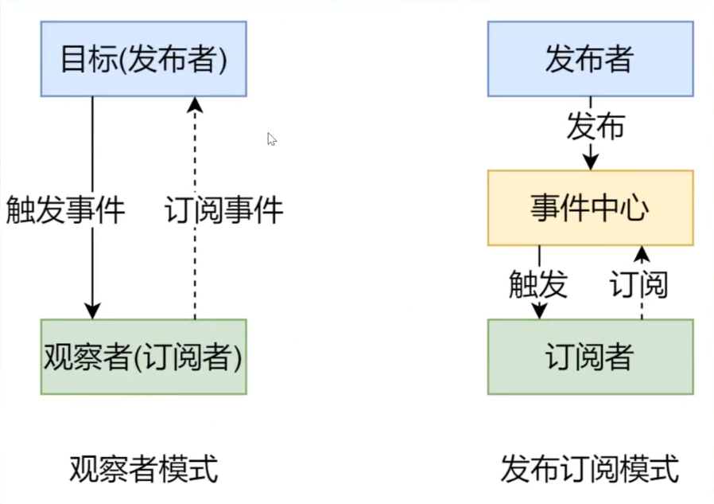
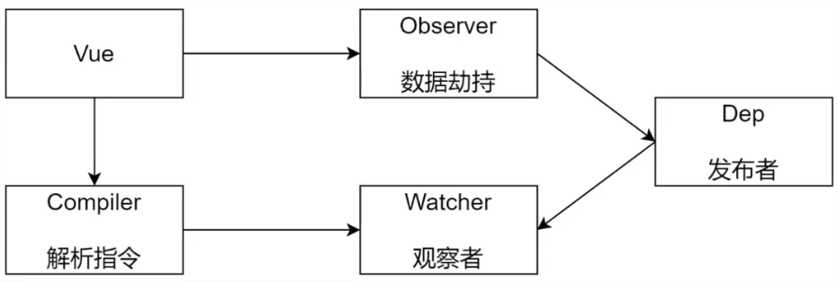
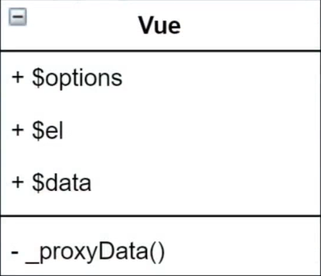
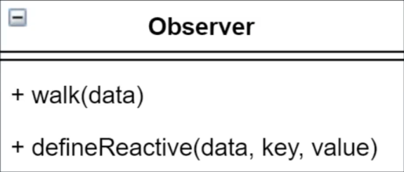
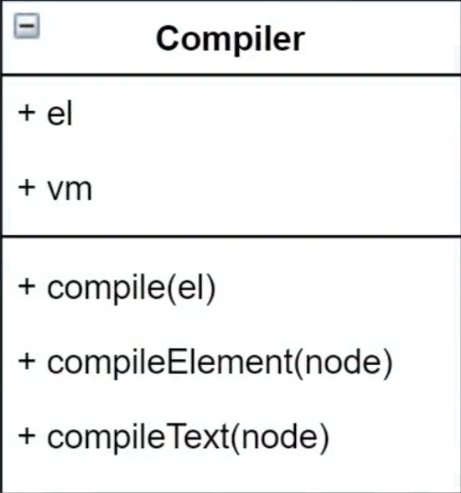
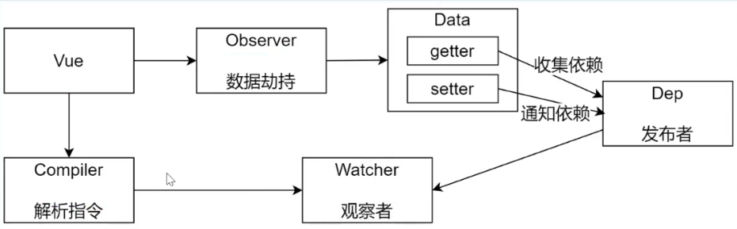
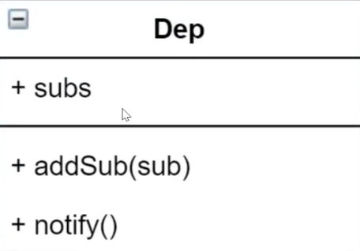
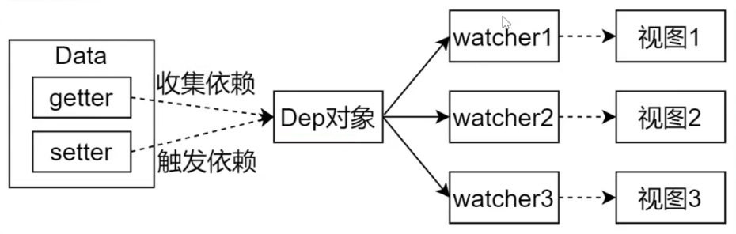
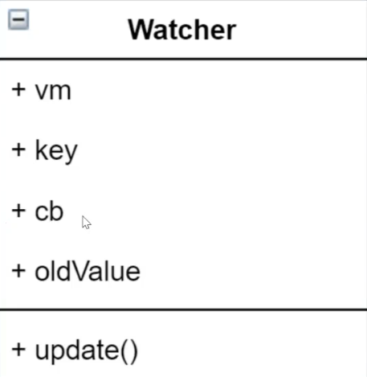
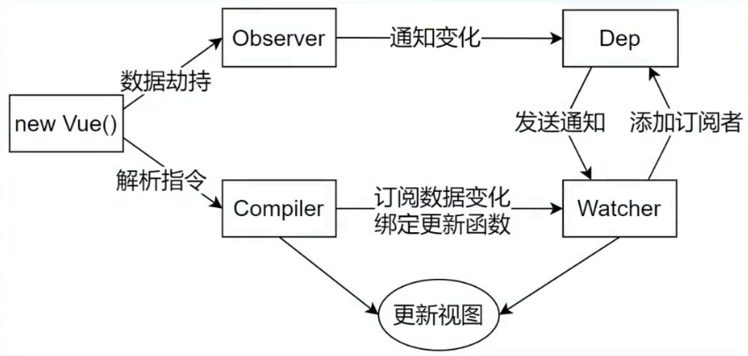

[TOC]

# 模拟vue响应式原理

## **数据驱动**

- 数据响应式

- - 数据仅仅是普通的 JavaScript 对象，而当我们修改数据时，视图会进行更新，避免了繁琐的 DOM 操作，提高开发效率

- 双向绑定

- - 数据改变，视图改变；视图改变，数据也随之改变
  - 我们可以使用 `v-model` 在表单元素上创建双向数据绑定

- 数据驱动是 Vue 最独特的特性之一

- - 开发过程中仅需要关注数据本身，不需要关心数据是如何渲染到视图


## **数据响应式的核心原理**

### **Vue 2.x - Object.defineProperty**

- 官方文档指出：

- - 当你把一个普通的 JavaScript 对象传入 Vue 实例作为 data 选项，Vue 将遍历此对象所有的 property，并使用 `Object.defineProperty` 把这些 property 全部转为 getter/setter。`Object.defineProperty` 是 ES5 中一个无法 shim 的特性，这也就是 Vue 不支持 IE8 以及更低版本浏览器的原因。

- `Object.defineProperty(【对象名】,【对象中的属性名】, {getter和setter的配置对象})`
- 对某个属性进行双向数据绑定

```js
// 模拟 Vue 中的 data 选项
let data = {
 msg: 'hello'
}

// 模拟 Vue 的实例，数据流向是从data到vm，是个代理对象，访问data中的数据时会访问vm
let vm = {}

// 数据劫持：当访问或者设置 vm 中的成员的时候，做一些干预操作
Object.defineProperty(vm, 'msg', {
 // 可枚举（可遍历）
 enumerable: true,
 // 可配置（可以使用 delete 删除，可以通过 defineProperty 重新定义）
 configurable: true,
 // 当获取值的时候执行
 get () {
 console.log('get: ', data.msg)
 return data.msg
  },
 // 当设置值的时候执行
 set (newValue) {
 console.log('set: ', newValue)
 if (newValue === data.msg) {
 return
    }
 data.msg = newValue
 // 数据更改，更新 DOM 的值
 document.querySelector('#app').textContent = data.msg
  }
})

// 测试
vm.msg = 'Hello World'
console.log(vm.msg)
```

- 对对象中的所有的属性进行双向数据绑定，进行遍历

```js
// 模拟 Vue 中的 data 选项
let data = {
  msg: 'hello', // 此处仅展示 msg
  count: 10
}

// 模拟 Vue 的实例
let vm = {}

proxyData(data)

function proxyData(data) {
  // 遍历 data 对象的所有属性
  Object.keys(data).forEach(key => {
    // 把 data 中的属性，转换成 vm 的 getter和setter
    Object.defineProperty(vm, key, {
      enumerable: true,
      configurable: true,
      get () {
        console.log('get: ', key, data[key])
        return data[key]
      },
      set (newValue) {
        console.log('set: ', key, newValue)
        if (newValue === data[key]) {
          return
        }
        data[key] = newValue
        // 数据更改，更新 DOM 的值
        document.querySelector('#app').textContent = data[key]
      }
    })
  })
}

// 测试
vm.msg = 'Hello World'
console.log(vm.msg)
```


### **Vue 3.x - Proxy**

- 直接监听对象，而非属性。
- ES 6中新增，IE 不支持，性能由浏览器优化

```js
// 模拟 Vue 中的 data 选项
 let data = {
   msg: 'hello',
   count: 0
 }

 // 模拟 Vue 实例,使用vm代理对象
 let vm = new Proxy(data, { // 第一个参数是被代理的对象
   // 执行代理行为的函数
   // 当访问 vm 的成员会执行
   get (target, key) {  // target 表示代理的对象data
     console.log('get, key: ', key, target[key])
     return target[key]
   },
   // 当设置 vm 的成员会执行
   set (target, key, newValue) {
     console.log('set, key: ', key, newValue)
     if (target[key] === newValue) {
       return
     }
     target[key] = newValue
     document.querySelector('#app').textContent = target[key]
   }
 })

 // 测试
 vm.msg = 'Hello World'
 console.log(vm.msg)
```

- 从代码整体角度来说

- - 使用 `Proxy` 比使用 `defineProperty` 的代码简洁的多。
  - 使用 `Proxy` 是代理的整个对象，也就是这个对象的所有属性在访问或者设置的时候都会去触发 vm 中的 get和set。而如果用 `defineProperty` 处理多个属性的话，我们还要进行循环。

- 从性能角度上讲

- - `Proxy` 会进行浏览器性能优化，其性能也要比 `defineProperty` 要好。


## **发布订阅模式和 观察者模式**

### **发布/订阅模式**

- 发布/订阅模式

- - 订阅者
  - 发布者
  - 信号（事件）中心

- 以家长订阅班级孩子的考试成绩为例，家长就是订阅者，老师就是发布者，班级就是事件中心
- 发布订阅模式比观察者模式多了个信号（事件）中心

我们假定，存在一个"信号中心"，某个任务执行完成，就向信号中心"发布"（publish）一个信号，其他任务可以向信号中心"订阅"（subscribe）这个信号，从而知道什么时候自己可以开始执行。这就叫做"发布/订阅模式"（publish-subscribe pattern）

- 比如自定义事件就是基于发布订阅模式的
- 自定义事件的订阅者、事件中心和发布者都是vm

```js
// Vue 自定义事件
let vm = new Vue()
// { 'click': [fn1, fn2], 'change': [fn] }

// 注册事件(订阅消息)
vm.$on('dataChange', () => {
  console.log('dataChange')
})

vm.$on('dataChange', () => {
  console.log('dataChange1')
})
// 触发事件(发布消息)
vm.$emit('dataChange')
```

- 模拟Vue自定义事件的实现

- - 核心思想就是事件的注册和触发彼此之间应该有联系
  - 而这个联系建立在一个类中即可通过 `constructor` 定义一个公用属性来拿到

```js
// 事件触发器
class EventEmitter {
  constructor () {
    // 例如 ：subs: { 'click': [fn1, fn2], 'change': [fn] }，事件可对应多个处理函数
    this.subs = Object.create(null) // 不设置原型属来提升性能
  }

  // 注册事件
  $on (eventType, handler) {
    this.subs[eventType] = this.subs[eventType] || [] // 有值的话不动直接返回，没有就返回空数组
    this.subs[eventType].push(handler)
  }

  // 触发事件
  $emit (eventType) {
    if (this.subs[eventType]) {
      this.subs[eventType].forEach(handler => {
        handler()
      })
    }
  }
}

// 测试
let em = new EventEmitter()
em.$on('click', () => {
  console.log('click1')
})
em.$on('click', () => {
  console.log('click2')
})

em.$emit('click')
```

- 再比如兄弟组件之间的通信过程

```js
// eventBus.js
// 事件中心
leteventHub = newVue()

// ComponentA.vue
// 发布者
addTodo: function () {
  // 发布消息(事件)
  eventHub.$emit('add-todo', { text: this.newTodoText })
  this.newTodoText=''
}
// ComponentB.vue
// 订阅者
created: function () {
  // 订阅消息(事件)
  eventHub.$on('add-todo', this.addTodo)
}
```


### **观察者模式**

- 观察者（订阅者）- Watcher

- - `update()`：当事件发生时，具体要做的事情

- 目标（发布者）- Dep

- - `subs` 数组：存储所有的观察者
  - `addSub()`：添加观察者
  - `notify()`：当事件发生，调用所有观察者的 `update()` 方法

- 没有事件中心
- 模拟观察者模式

```js
// 发布者-目标
class Dep {
  constructor () {
    // 记录所有的订阅者
    this.subs = []
  }
  // 添加订阅者
  addSub (sub) {
    if (sub && sub.update) {
      this.subs.push(sub)
    }
  }
  // 发布通知
  notify () {
    this.subs.forEach(sub => {
      sub.update()
    })
  }
}


// 订阅者-观察者
class Watcher {
  update () {
    console.log('update')
  }
}

// 测试
let dep = new Dep()
let watcher = new Watcher()

dep.addSub(watcher)  // 将订阅者保存到发布者的记录数组中进行记录

dep.notify()     // 通知发布者数组中的所有订阅者来更新数据，调用所有发布者的update方法
```


### **发布订阅和观察者模式 区别**

- 观察者模式是由具体目标调度，比如当事件触发，Dep 就会去调用观察者的方法，所以观察者模式的订阅者与发布者之间是存在依赖的,目标对象中记录着所有的观察者。

- 发布/订阅模式是由统一调度中心“事件中心”调用，因此发布者和订阅者不需要知道对方的存在。

- - 比如一个组件A中新增了一个待办事件add，那么此时会调用事件中心的 `$emit` 方法来触发add事件
  - `$emit` 会找到事件中心的add事件处理函数并执行，这个事件处理函数是由组件B提供的
  - 如果B组件想要知道组件A中的数据是否发生了变化就要订阅事件中心中的add事件
  - 事件中心的作用就是隔离发布者和订阅者，去除发布者和订阅者之间的依赖，使之更灵活




## **Vue响应式原理模拟**

### **Vue代码基本结构**

```html
<!DOCTYPE html>
<html lang="cn">
<head>
  <meta charset="UTF-8">
  <meta name="viewport" content="width=device-width, initial-scale=1.0">
  <meta http-equiv="X-UA-Compatible" content="ie=edge">
  <title>Vue 基础结构</title>
</head>
<body>
  <div id="app">
    <h1>差值表达式</h1>
    <h3>{{ msg }}</h3>
    <h3>{{ count }}</h3>
    <h1>v-text</h1>
    <div v-text="msg"></div>
    <h1>v-model</h1>
    <input type="text" v-model="msg">
    <input type="text" v-model="count">
  </div>

  <script src="./js/vue.js"></script>
  <script>
    let vm = new Vue({
      el: '#app',
      data: {
        msg: 'Hello Vue',
        count: 20,
        items: ['a', 'b', 'c']
      }
    })
  </script>
</body>
</html>
```


### **打印 Vue 实例观察模拟的成员**

- 观察到data中的成员具有get和set属性，所以需要为其定义响应式转换成getter和setter注入到Vue实例中，这样可以直接通过`this.msg`，`this.count`来使用

- 需要模拟的属性：

- - `$data`

  - - data 选项中的成员被记录到 $data 中并且转换成 getter 和 setter，$data 中的 setter 是真正监视数据变化的地方

- - `$options`

  - - $options 我们可以简单认为把构造函数的参数记录到 $options 当中，比如之前实现VueRouter时，router实例也将作为参数记录到$options中

- - `_data`

  - - data 和 $data 指向的是同一个对象， 开头的是私有成员，$ 开头的是公共成员，我们只需要模拟 $data 就可以了

- - `$el`

  - - $el 对应选项中的 el， 我们设置 el 选项时，可以是选择器，也可以是一个DOM对象。如果是选择器，vue 构造函数内部需要把这个选择器转换成对应的DOM对象。

- 整体结构

- - `Vue`: 把 data 中的成员注入到 Vue 实例，并且把 data 中的成员转成 getter/setter
  - `Observer`: 能够对数据对象的所有属性进行监听，如有变动可拿到最新值并通知 Dep
  - `Compiler`: 解析每个元素中的指令及插值表达式，并替换成相应的数据
  - `Dep`: 添加观察者(watcher)，当数据变化通知所有观察者
  - `Watcher`: 数据变化更新视图




### **Vue**

- 功能

- - 负责接收初始化的参数(选项)
  - 负责把 data 中的属性注入到 Vue 实例，转换成 getter/setter
  - 负责调用 observer 监听 data 中所有属性的变化
  - 负责调用 compiler 解析指令/插值表达式

- Vue结构

- - +是对外公开的方法，-是静态方法



- 代码实现

```js
// js/vue.js

class Vue { 
  constructor (options) {
    // 1. 通过属性保存选项的数据
    this.$options = options || {}
    this.$data = options.data || {}  // $data就是我们实例化时传递进去的data对象参数
    // 如果是字符串就准换成dom对象，如果要是选择器选中的dom就直接使用
    this.$el = typeof options.el === 'string' ? document.querySelector(options.el) : options.el
    // 2. 把data中的成员转换成getter和setter，注入到vue实例中
    this._proxyData(this.$data)
    // 3. 调用observer对象，将数据传递到$data中，监听$data的数据变化
    new Observer(this.$data)
    // 4. 调用compiler对象，解析指令和差值表达式
    new Compiler(this)
  }
    
  _proxyData (data) { // 只是定义了get和set，后续的响应式是由observer定义的
    // 遍历data中的所有属性
    Object.keys(data).forEach(key => {
      // 把data的属性注入到vue实例中
      Object.defineProperty(this, key, {  // this指向vue实例，而不是vue中的data
        enumerable: true,
        configurable: true,
        get () {
          return data[key] // vue本身是不存储数据的，访问的其实是$data中的数据
        },
        set (newValue) {  // 能接收一个变化后的值
          if (newValue === data[key]) {
            return
          }
          data[key] = newValue
        }
      })
    })
  }
}
```

- 当直接访问vue实例中的某个属性时，就会被数据劫持映射到Vue类中的$data中，并且当实例中的属性改变时也会直接映射到$data中，改变$data中的数据

- - _proxyData是关联vue实例对象本身的属性数据和$data数据源中的数据，是二者之间的交互，二者之间的数据响应式
  - 而Observer是关联vue实例中数据源$data中的数据和页面之间的交互以及变动响应式


### **Observer**

- 功能

- - 负责把 data 选项中的属性转换成响应式数据
  - data 中的某个属性也是对象，把该属性转换成响应式数据
  - 数据变化发送通知

- observer结构



- 实现代码

```js
// js/observer.js

class Observer {
  constructor (data) {
    this.walk(data)
  }
  walk (data) {
    // 1. 判断data是否是对象
    if (!data || typeof data !== 'object') {
      return
    }
    // 2. 遍历data对象的所有属性
    Object.keys(data).forEach(key => {
      this.defineReactive(data, key, data[key])
    })
  }
  defineReactive (obj, key, val) { 

    let that = this
		// ...    
    // 如果val是对象，把val内部的属性转换成响应式数据
    this.walk(val)
    Object.defineProperty(obj, key, { // 这个obj就是$data，存在对get的引用，所以产生闭包
      enumerable: true,
      configurable: true,
   	// 此处使用 val 而不使用obj[key]的原因是防止发生死递归，即obj[key]又会触发get
      get () { // $data引用了get发生闭包 不会释放 val 变量
        // ...
        return val
      },
      set (newValue) {
        if (newValue === val) {
          return
        }
        val = newValue
        // 新赋值的属性如果是对象，会遍历对象调用 defineReactive
        // 注意this指向，此时为data对象 因此需要在外部记录 that = this
        that.walk(newValue)
        // ...
      }
    })
  }
}
```

**备注：**

- observer定义的getter和setter，为啥一开始_proxyData也定义了一次？我的理解如下
- 首先得从 `Object.defineProperty` 说起，他的三个参数分别为数据劫持的对象，劫持的属性，设置get和set的配置对象。
- 然后，_proxyData是在Vue类中使用的，实例化的时候，类中的this会指向实例对象，开辟新的空间来存储类中定义的数据，比如vue类中定义的`this.$data = options.data || {}`，实例化后每个实例都会开辟一个新的对象来存储这个options中的data数据，并且不会互相干扰
- 在_proxyData中使用 `Object.defineProperty(this,key,{})` 是在向**vue实例**中注入$data中的数据，让vue实例对象本身就具备这些数据，可以通过 `vm.xxx` 的形式直接访问这些数据，并为这些成员添加上了get和set使其具备响应式
- 而observer中使用的 `Object.defineProperty(this,key,{})` 是在为vue实例中的$data中的成员定义get和set，并进行其他操作，如响应式
- _proxyData是关联vue实例对象本身的属性数据和$data数据源中的数据，是二者之间的交互，二者之间的数据响应式
- 而Observer是关联vue实例中数据源$data中的数据和页面之间的交互以及变动响应式


### **Compiler**

- 功能

- - 负责编译模板，解析指令/插值表达式
  - 负责页面的**首次渲染**，很重要！默认是解析首次的指令，后续的变化需要依赖watcher实例对象
  - 当数据变化后重新渲染视图
  - 总的来说就是在操作DOM

- compiler结构

- - 属性

  - - el是Vue传递过来的`options.el`，要将其转换成DOM对象
    - vm是Vue的实例，后面的方法要用到vm实例中的数据

- - 方法

  - - `compile(node)` 接收并遍历DOM对象的所有节点，判断节点类型
    - `compileElement(node)` 解析元素节点中的指令
    - `compileText(node)` 解析文本节点中的插值表达式
    - `isTextNode(node)` 判断是否为文本节点
    - `isElementNode(node)` 判断是否为元素节点
    - `isDirective(attrName)` 判断是否是个指令



- 整体结构代码：

```js
// js/compiler.js

class Compiler {
  constructor (vm) {
    this.el = vm.$el
    this.vm = vm
    this.compile(this.el)
  }
  // 编译模板，处理文本节点和元素节点
  compile (el) {
    
  }
  // 编译元素节点，处理指令
  compileElement (node) {
   
  }
  // 编译文本节点，处理差值表达式
  compileText (node) {
   
  }
  // 判断元素属性是否是指令，在compileElement中调用
  isDirective (attrName) {
    return attrName.startsWith('v-')
  }
  // 判断节点是否是文本节点,在compileText中调用
  isTextNode (node) {
    return node.nodeType === 3
  }
  // 判断节点是否是元素节点，在compileElement中调用
  isElementNode (node) {
    return node.nodeType === 1
  }
}
```

- compile

- - 遍历所有节点，而不是元素，因为文本节点中包含着插值表达式

```js
// 编译模板，处理文本节点和元素节点
compile (el) {
  let childNodes = el.childNodes // 子节点
  // 用 Array.from() 将伪数组转化为数组
  Array.from(childNodes).forEach(node => {
    if (this.isTextNode(node)) {
      // 处理文本节点
      this.compileText(node)
    } else if (this.isElementNode(node)) {
      // 处理元素节点
      this.compileElement(node)
    }

    // 判断node节点，是否有子节点，如果有子节点，要递归调用compile
    if (node.childNodes && node.childNodes.length) {
      this.compile(node)
    }
  })
}
```

- compileText

- - 编译插值表达式

```js
// 编译文本节点，处理差值表达式
compileText (node) {
  // console.dir(node) 以对象的形式打印参数
  // {{  msg }}
  // . 匹配任意的单个字符
  // + 匹配前面修饰的内容出现一或多次
  // ？ 非贪婪模式 尽可能早的结束匹配
  // () 分组 提取某个位置的内容
  let reg = /\{\{(.+?)\}\}/
  // 通过查看node 可以使用textContent或者nodeValue获取文本节点内容
  let value = node.textContent
  if (reg.test(value)) {
    // RegExp是正则的构造函数; 使用$1可以获取第一个分组的内容; trim() 去空格
    let key = RegExp.$1.trim()
    // 将文本节点原来内容的插值表达式替换成变量对应的值
    node.textContent = value.replace(reg, this.vm[key])
    /...
  }
}
```


### **compileElement**

- 要遍历所有的属性节点，并判断是否是vue提供的指令，如果是，就编译元素的指令
- 处理 `v-text` 的首次渲染
- 处理 `v-model` 的首次渲染

```js
// 编译元素节点，处理指令
compileElement (node) {
  // console.log(node.attributes)
  // 遍历所有的属性节点
  // 用 Array.from() 将伪数组转化为数组
  Array.from(node.attributes).forEach(attr => {
    // 通过查看 node.attributes 
    // 可以使用 node.attributes.name 获取属性名称
    // 使用 node.attributes.value 获取属性值
    // 判断是否是指令(以v-开头的)
    let attrName = attr.name
    if (this.isDirective(attrName)) {
      // v-text --> text  去掉v-这个前缀
      attrName = attrName.substr(2)
      let key = attr.value
      this.update(node, key, attrName)
    }
  })
}

update (node, key, attrName) {
  let updateFn = this[attrName + 'Updater']
  updateFn && updateFn(node, this.vm[key])
}

// 下面这三个都是首次渲染时来解析vue指令的，后续变化需要依赖后面的watcher实例对象
// 处理 v-text 指令
textUpdater (node, value) {
  node.textContent = value  // value是指令属性的属性值
}

// 处理 v-model 指令
modelUpdater (node, value) {
  node.value = value
}

// 编译文本节点，处理差值表达式
compileText (node) {
  let reg = /\{\{(.+?)\}\}/
  // 通过查看node 可以使用textContent或者nodeValue获取文本节点内容
  let value = node.textContent
  if (reg.test(value)) {
    // RegExp是正则的构造函数; 使用$1可以获取第一个分组的内容; trim() 去空格
    let key = RegExp.$1.trim()
    // 将文本节点原来内容的插值表达式替换成变量对应的值
    node.textContent = value.replace(reg, this.vm[key])
    // ...
  }
}
```


### **Dep**

功能

- 收集依赖，添加观察者(Watcher)
- 通知所有观察者

结构





- 属性

- - `subs`用来保存所有观察者watcher

- 方法

- - `addSubs(sub)` 向subs数组中添加观察者
  - `notify()` 当数据发生变化时就调用notify通知所有的观察者

- 代码

```js
// js/dep.js

class Dep {
  constructor () {
    // 存储所有的观察者(Watcher)
    this.subs = []
  }
  // 添加观察者
  addSub (sub) {
    if (sub && sub.update) {
      this.subs.push(sub)
    }
  }
  // 发送通知
  notify () {
    this.subs.forEach(sub => {
      sub.update()
    })
  }
}
```

- 接下来我们需要使用这个 `Dep` 类，这个类的作用是 收集依赖 和 发送通知，我们需要为每一个响应式数据创建一个 `Dep` 对象，在使用响应式数据的时候收集依赖，也就是创建观察者对象，当数据变化的时候通知所有的观察者，调用观察者的 `update` 方法来更新视图。
  所以要在 `Observer` 中来创建 `Dep` 对象，上述只是我们定义了 `Dep` 这个类，并没有实例化 `Dep`
- 在 `Observer中` 来创建 `Dep` 对象

```js
// js/observer.js

class Observer {
  // ...
  defineReactive (obj, key, val) {
    let that = this
    
    // 负责收集依赖，并发送通知
    let dep = new Dep()
    
    this.walk(val)
    Object.defineProperty(obj, key, {
      // ...
      get () {
        // 在get方法中收集依赖，这个依赖就是某个对象使用了当前数据
        // target属性（观察者对象）是在 Watcher 中添加的
        Dep.target && dep.addSub(Dep.target)
        return val
      },
      set (newValue) {
        // ...
        // 在set方法中发送通知
        dep.notify()
      }
    })
  }
}
```


### **Watcher**

功能

- 当数据变化触发依赖， `dep` 通知所有的 `Watcher` 实例更新视图
- 自身实例化的时候往`dep` 对象中的 `subs` 数组中添加自己





- 属性

- - `vm` Vue实例，用来获取data数据
  - `key` 更新视图时的数据，也就是data中的属性名称
  - `cb` 不同的watcher更新视图时所作的事是不一样的，所以watcher里面有个回调函数，实例化watcher时候会触发来更新视图
  - `oldValue` 用于记录数据变化之前的值，可以用来对比新旧数据是否发生了变化

- 方法

- - `update()` 用来更新视图

- 代码实现

```js
// js/watcher.js

class Watcher {
  constructor (vm, key, cb) { // 实例化时候传入的参数
    this.vm = vm
    // data中的属性名称
    this.key = key
    // 回调函数负责更新视图
    this.cb = cb

    // 把watcher实例对象记录到Dep类的静态属性target中
    // 也就是向Dep类上添加一个新的静态属性target
    // 便执行Observer 的 get() 方法来向subs中增加内容：
    // Dep.target && dep.addSub(Dep.target)
    Dep.target = this
      
    // 触发get方法，在get方法中会调用addSub
    // Dep.target && dep.addSub(Dep.target)
    this.oldValue = vm[key]  // 自身就作为一个watcher，依赖了data中的数据
      
    // 又因为每当有对象引用当前数据都会触发get
    // 为了防止重复叠加target中的内容，所以每次向subs中添加后要清空 Dep.target，保证每个引用对象每次只添加一个当前所属的watcher
    Dep.target = null
  }
    
  // 当数据发生变化的时候更新视图，每当数据变化后会调用setter，setter中会调用每个watcher的update方法，如果要调用update就说明数据已经变化了，也就是说这个函数是在vm数据变化后调用的，所以此时vm中的数据是最新的变化后的数据
  update () {  // 当调用Update的时候数据已经发生了变化，所以调用时可以以参数形式传入
    let newValue = this.vm[this.key]
    if (this.oldValue === newValue) {
      return
    }
    this.cb(newValue)  // 这个函数定义在compile模块中，把当前最新的数据传到compile中
  }
}
```


### 创建watcher实例化对象

- 因为在更新视图时需要使用 `cb` 回调函数来更新
- 我们在创建 `Watcher` 对象的时候传递的 `cb` 回调函数，最终调用这个 `cb` 回调函数会将 `newValue` 传递给 `cb`
- 我们更新视图的操作其实就是在操作 DOM，而我们所有的 DOM 操作都在 `Compile` 中
- 所以要在 `Compile` 中创建 `watcher` 实例对象，找到把数据渲染到 DOM 的位置，也就是处理指令和插值表达式的位置都有数据的变化，然后把变化后的数据渲染到视图，所以这里要创建 `watcher` 的实例化对象，进行数据的监听

```js
class Compiler {
  // ...
  update (node, key, attrName) {
    let updateFn = this[attrName + 'Updater']
    // this是由函数的调用形式觉得的，由于下面这句代码中没有使用this来调用而是直接调用的
    // 所以updateFn内部的this默认并不执行compiler实例，所以 通过 call 来解决
    updateFn && updateFn.call(this, node, this.vm[key], key)
    // this.updateFn 这样内部是指向compiler实例，上面的不是所以需要用call来修改
  }

  // 下面这三个处理默认都是首次渲染，解析vue指令的，后续变化要使用watcher实例对象
  // 处理 v-text 指令
  textUpdater (node, value, key) {
    node.textContent = value
 // vm是当前vue实例，key是当前vue实例中的data中的属性，newValue是调用时候传递的值
    new Watcher(this.vm, key, (newValue) => {  
      node.textContent = newValue
    })
  }
  // 处理 v-model 指令
  modelUpdater (node, value, key) {
    node.value = value
    new Watcher(this.vm, key, (newValue) => {
      node.value = newValue
    })
      
    // 双向绑定，此处在下一节详细实现
    // 注册 input 事件: 事件名称 处理函数
    // node.addEventListener('input', () => {
      // this.vm[key] = node.value
    // })
  }

  // 编译文本节点，处理差值表达式
  compileText (node) {
    // ...
    if (reg.test(value)) {
      ...
      node.textContent = value.replace(reg, this.vm[key])
      // 创建watcher对象，当数据改变更新视图
      new Watcher(this.vm, key, (newValue) => {
        node.textContent = newValue
      })
    }
  }
  ...
}
```

- 上述的三个方法都是在操作 DOM，最终都是把数据渲染到 DOM 元素上，这三个方法都是在页面首次加载的时候执行的。
- 指令和插值表达式都是依赖于数据的，而所有视图中依赖数据的位置都要创建一个 Watcher 对象，当数据改变的时候，Dep 对象会通知所有的 Watcher 对象重新渲染视图。


### **双向数据绑定**

- 截止目前为止，上述代码能实现代码改变影响视图，但是并不能实现视图变化改变代码层
- 当表单数据发生变化时重新赋值给data中的数据

```js
// 处理 v-model 指令
modelUpdater (node, value, key) {
  node.value = value
  new Watcher(this.vm, key, (newValue) => {
    node.value = newValue
  })
      
  // 双向绑定，此处在下一节详细实现
  // 注册 input 事件: 事件名称 处理函数
  node.addEventListener('input', () => {
    this.vm[key] = node.value
  })
}
```


## 总结

### **提出问题**

- 给属性重新赋值成对象，是否是响应式的？

- - 是响应式的。`set` 方法 记录新的值调用 `walk` 方法，其中会遍历这个对象的所有属性重新把它定义成响应式数据

- 给 Vue 实例新增一个成员是否是响应式的？

- - 不是响应式的。Vue 实例后，新增一个成员，此时data并没有定义该成员，data中的成员是在创建 Vue 对象的时候 `new Observer()` 来将其设置成响应式数据，当 Vue 实例化完成之后，再添加一个成员，此时仅仅是给 vm 上增加了一个js属性而已，因此并不是响应式的
  - 对于已经创建的实例，Vue不允许动态添加根级别的响应式属性。但是可以使用 `Vue.set(object, propertyName, value)` 方法向嵌套对象添加响应式属性。还可以使用 `vm.$set` 实例方法，这也是全局 `Vue.set` 方法的别名。


### 整体流程



- `Dep` 用来记录 `watcher`，将其存到 `subs` 数组中
- 首次加载通过 `compiler` 更新视图
- 数据变化通过 `watcher` 回调函数更新视图

