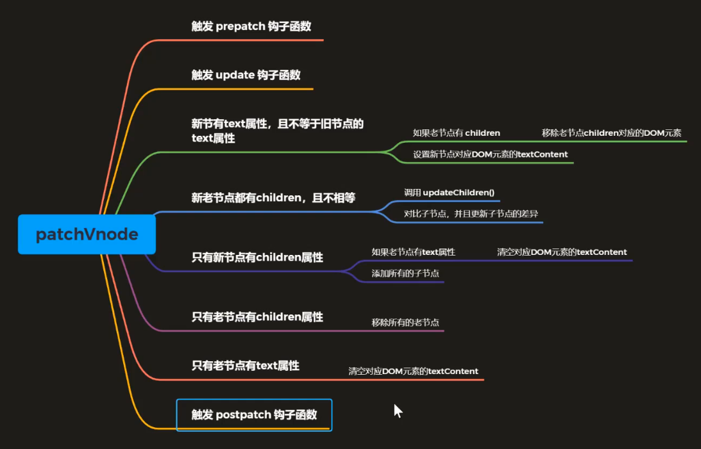
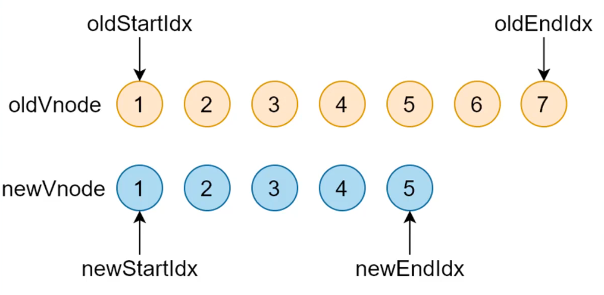
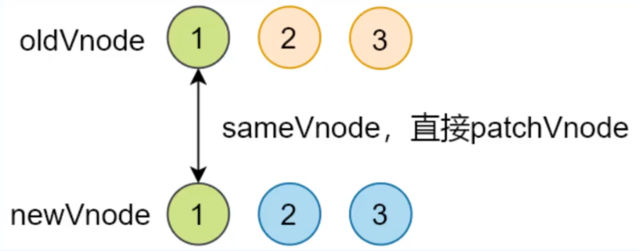
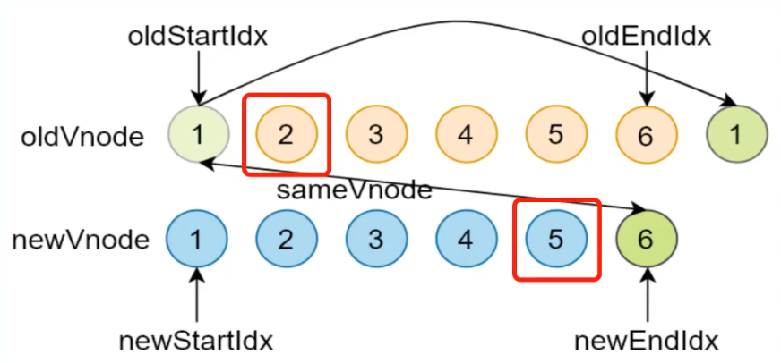
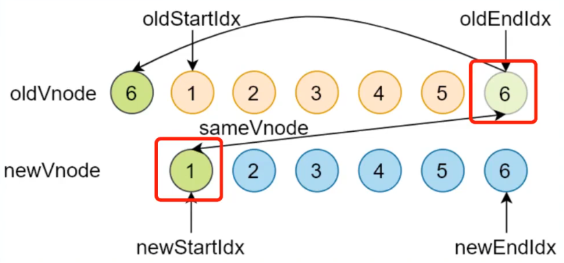
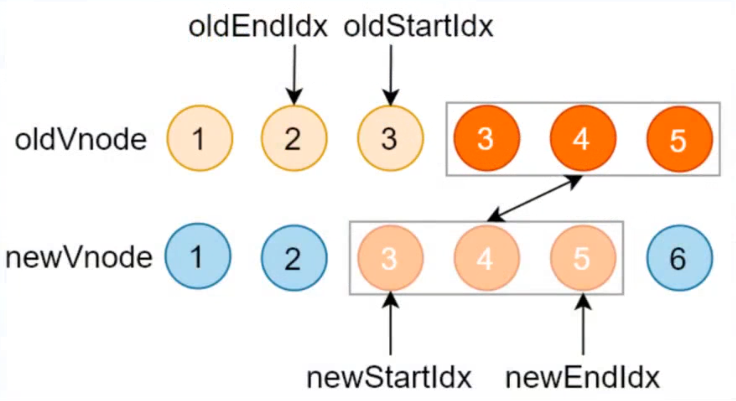
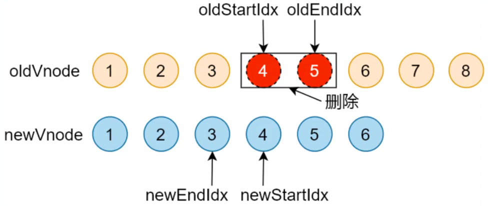
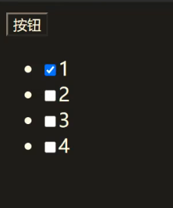
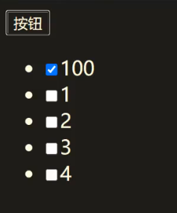

[TOC]

# 虚拟dom原理

## **什么是虚拟 DOM**

- 虚拟 DOM(Virtual DOM) 是由普工的 JavaScript 对象来描述 DOM对象

- 状态的变化首先作用于虚拟 DOM，最终映射到真实的DOM中

- Vue.js2.x内部使用的虚拟 DOM是改造的Snabbdom

  

## **为什么要使用虚拟 DOM**

- 虚拟DOM可以跟踪状态变化，并通过比较前后两次状态差异更新真实的DOM

- 虚拟DOM是间接操作DOM，使得开发过程更加关注在业务代码的实现，而不需要关注如何操作DOM，从而提高开发效率

- 虚拟DOM在首次渲染的时候肯定不如直接操作 DOM，因为要维护一层额外的虚拟 DOM，如果后续有频繁操作 DOM 的操作，这个时候才会有性能的提升

  

## **虚拟DOM的作用**

- 维护视图和状态的关系

- 复杂视图情况下提升渲染性能

- 跨平台

- - 浏览器平台渲染DOM
  - 服务端渲染SSR (Nuxt.js/ Next.js )
  - 原生应用 (Weex/ React Native)
  - 小程序 (mpvue / uni-app)

- 虚拟 DOM 在更新真实 DOM 之前会通过 Diff 算法来对比两个新旧两个虚拟 DOM 树之间的差异，实现局部更新，最终把差异更新到真实 DOM

  

## **虚拟DOM库**

### **snabbdom**

- Vue.js2.x内部使用的虚拟 DOM是改造的Snabbdom
- 大约200多行代码
- 可以通过模块来拓展功能
- 元am使用TypeScript开发
- 是最快的虚拟DOM之一


### **virtual-dom**

- 最早的虚拟DOM开源库


## **虚拟DOM的实现原理**

### **snabbdom**

- init函数将返回一个patch函数式，patch函数会将虚拟DOM转换成真实DOM渲染到截面上

- - init函数参数是个数组，里面用来配置

- h函数同vue中的函数一样，用来创建虚拟节点

- - 有多个参数，我们常用其中的两个

  - - 参数一：标签+选择器
    - 参数二：如果是字符串，那么就代表标签中的文本内容

  - 比如创建一个div标签，他的id是container，类是cls，内部文本内容是Hello world，如下

```js
let vnode = h('div#container.cls', 'Hello World')
```

案例一：

```js
import { h, init } from 'snabbdom'

// 1. hello world
// 参数：数组，模块
// 返回值：patch函数，作用对比两个vnode的差异更新到真实DOM
let patch = init([])

// h函数有多个参数，以其中最常用的两个为例
// 第一个参数：标签+选择器
// 第二个参数：如果是字符串的话就是标签中的内容,如果有别的节点可以用数组
let vnode = h('div#container.cls','Hello World')

let app = document.querySelector('#app')
// patch函数有两个参数
// 第一个参数：旧的VNode，也可以是个DOM元素，内部会把DOM元素转换成VNode
// 第二个参数：新的VNode
// 返回值：VNode，这个返回的VNode会作为下一次老的VNode
let oldVnode = patch(app, vnode)

// 假设对htmlwe文件中的#app的div进行更新，用下面的div及内容进行替换
vnode = h('div#container.xxx', 'Hello Snabbdom')

patch(oldVnode, vnode)

```

案例二：

```js
// 2. div中放置子元素 h1,p
import { h, init } from 'snabbdom'

let patch = init([])

let vnode = h('div#container', [
  h('h1', 'Hello Snabbdom'),
  h('p', '这是一个p标签')
])

let app = document.querySelector('#app') // app是选择要渲染到的位置

let oldVnode = patch(app, vnode)  // vnode 是当前创建的节点，patch方法时把当前创建的虚拟DOM渲染到app位置处，并返回渲染后的界面并转换成虚拟DOM，渲染后的oldVnode将作为以后的老节点

setTimeout(() => {
  vnode = h('div#container', [
    h('h1', 'Hello World'),
    h('p', 'Hello P')
  ])
  patch(oldVnode, vnode)

  // 清空div中的内容
  patch(oldVnode, h('!'))  // ! 将会渲染成注释标签 <!-- -->
}, 2000);
```


### **snabbdom模块**

### 模块的作用

- snabbdom 的核心库并不能处理DOM元素的属性/样式/事件等，可以通过注册snabbdom默认提供的模块来实现（类似于插件机制）
- snabbdom中的模块可以用来扩展snabbdom的功能
- snabbdom中的模块的实现时通过注册全局钩子函数来实现的，是整个vnode生命周期过程中被触发的函数


### 官方提供的模块

- attributes - 用来设置DOM的属性，通过setAttributes来实现

- props - 用来设置DOM属性，通过 . 的形式添加的

- dataset - 用来处理HTML5中的data- 自定义属性的

- class - 用来切换类样式，不是定义类样式，定义的话直接在h函数的第一个参数 . 的形式

- style - 用来设置行内样式，并且很容易设置动画

- eventlisteners - 用来注册或者移除事件的

  

### 模块的使用步骤

- 导入需要的模块
- init() 中注册模块
- h() 函数的第二个参数处设置成对象的形式，并传入模块中使用的数据

```js
import { init, h } from 'snabbdom'
// 1. 导入模块
import {styleModule} from 'snabbdom/modules/style'
import {eventlistenersModule} from 'snabbdom/modules/eventlisteners'
// 2. 注册模块
let patch = init([
  styleModule,
  eventlistenersModule
])
// 3. 使用 h() 函数的第二个参数传入模块需要的数据（对象）
let vnode = h('div', [
    h('h1', { style: { backgroundColor: 'red'} }, 'Hello Snabbdom'),
    h('p', { on: {click: eventHandler} }, '这是p标签')
])

function eventHandler () {
  console.log('点击我了')
}

let app = document.querySelector('#app')

let oldVnode = patch(app, vnode)


vnode = h('div', 'hello')
patch(oldVnode, vnode)

```


## **snabbdom源码概述**

### **如何学习源码**

- 先宏观了解
- 带着目标看源码
- 看源码的过程要不求甚解
- 调试
- 参考资料
- 源码地址：[https://github.com/snabbdom/snabbdom](https://link.zhihu.com/?target=https%3A//github.com/snabbdom/snabbdom)


### **snabbdom的核心**

- init() 设置模块，创建patch函数
- 使用h() 函数创建JavaScript对象(VNode) 来描述真实的DOM
- patch() 比较新旧两个VNode
- 把变化的内容更新到真实的DOM树


## **Snabbdom 源码实现**

### **h函数**

- 在使用 Vue 的时候的 h() 函数和snabbdom中的h函数功能一样都是用来穿件VNode对象，但是Vue中增强了 h 函数，实现了组件的机制

```js
new Vue({
  router,
  store,
  render: h => h(App)
}).$mount('#app')
```

- h() 函数最早见于 hyperscript，使用 JavaScript 创建超文本，也就是 html 字符串
- Snabbdom 中的 h() 函数源于 hyperscript，但是不是用来创建超文本，而是创建 VNode


### 函数重载

- 概念

- - 参数个数或类型不同的函数
  - JavaScript 中没有重载的概念，同名函数会被后者覆盖
  - TypeScript 中有重载，不过重载的实现还是通过代码调整参数

- 重载示例

```js
// 参数个数不同
function add (a: number, b: number) {
  console.log(a + b)
}
function add (a: number, b: number, c: number) {
  console.log(a + b + c)
}
add(1, 2)   // 调用第一个add
add(1, 2, 3)  // 调用第二个add


// 参数类型不同
function add (a: number, b: number) {
  console.log(a + b)
}
function add (a: number, b: string) {
  console.log(a + b + c)
}
add(1, 2)   // 调用第一个add
add(1, "2")  // 调用第二个add
```


### h函数实现

- 源码位置src/h.ts

```js
// h 函数的重载
export function h(sel: string): VNode;
export function h(sel: string, data: VNodeData): VNode;
export function h(sel: string, children: VNodeChildren): VNode;
export function h(sel: string, data: VNodeData, children: VNodeChildren): VNode;
export function h(sel: any, b?: any, c?: any): VNode {
  var data: VNodeData = {}, children: any, text: any, i: number;
  // 处理参数，实现重载的机制
  if (c !== undefined) {
    // 处理三个参数的情况
    // sel、data、children/text
    data = b;
    // 如果 c 是数组
    if (is.array(c)) { children = c; }
    // 如果 c 是字符串或者数字
    else if (is.primitive(c)) { text = c; }
    // 如果 c 是 VNode
    else if (c && c.sel) { children = [c]; }
  } else if (b !== undefined) {
    // 处理两个参数的情况
    // 如果 b 是数组
    if (is.array(b)) { children = b; }
    // 如果 b 是字符串或者数字
    else if (is.primitive(b)) { text = b; }
    // 如果 b 是 VNode
    else if (b && b.sel) { children = [b]; }
    else { data = b; }
  }
  if (children !== undefined) {
    // 处理 children 中的原始值(string/number)
    for (i = 0; i < children.length; ++i) {
      // 如果 child 是 string/number，创建文本节点
      if (is.primitive(children[i])) children[i] = vnode(undefined, undefined, undefined, children[i], undefined);
    }
  }
  if (
    sel[0] === 's' && sel[1] === 'v' && sel[2] === 'g' &&
    (sel.length === 3 || sel[3] === '.' || sel[3] === '#')
  ) {
    // 如果是 svg，添加命名空间
    addNS(data, children, sel);
  }
  // 返回 VNode
  return vnode(sel, data, children, text, undefined);
};
// 导出模块
export default h;
```


### **阅读源码是常用快捷键**

- ctrl+鼠标左键 - 跳转到当前变量定义的位置
- Alt+方向左键 - 回滚到跳转来的位置，也就是跳回按下ctrl+鼠标左键之前的位置


### **VNode 函数**

- 一个 VNode 就是一个虚拟节点用来描述一个 DOM 元素，如果这个 VNode 有 children 就是 Virtual DOM
- 源码位置：src/vnode.ts

```js
export interface VNode {
  // 选择器
  sel: string | undefined;
  // 节点数据：属性/样式/事件等
  data: VNodeData | undefined;
  // 子节点，和 text 只能互斥，文本和其他子节点是互斥关系
  children: Array<VNode | string> | undefined;
  // 记录 vnode 对应的真实 DOM
  elm: Node | undefined;
  // 节点中的内容，和 children 只能互斥
  text: string | undefined;
  // 优化用
  key: Key | undefined;
}

export function vnode(sel: string | undefined,
                      data: any | undefined,
                      children: Array<VNode | string> | undefined,
                      text: string | undefined,
                      elm: Element | Text | undefined): VNode {
  let key = data === undefined ? undefined : data.key;
  return {sel, data, children, text, elm, key};
}

export default vnode; // 用上述六个属性来描述VNode
```


### **Patch整体过程分析（VNode渲染真实DOM）**

- patch(oldVnode, newVnode)

- 打补丁，把新节点中变化的内容渲染到真实 DOM，最后返回新节点作为下一次处理的旧节点

- 对比新旧 VNode 是否相同节点

- - 也就是判断节点的 key(节点的唯一标志) 和 sel(节点的选择器)是否相同

- 如果不是相同节点，删除之前的内容，重新渲染
- 如果是相同节点，再判断新的 VNode 是否有 text，如果有并且和 oldVnode 的 text 不同，直接更新文本内容
- 如果新的 VNode 有 children，判断子节点是否有变化，判断子节点的过程使用的就是 diff 算法
- diff 过程只进行同层级比较


### init函数

- init(modules, domApi)，这个domApi用来吧VNode对象转换成其他平台下的对应的元素，如果没有设置第二个参数就默认设置成操作浏览器DOM的API
- 虚拟DOM的跨平台特性就是使用上述的domApi参数来实现的
- 源码位置：src/package/init.ts

```js
const hooks: (keyof Module)[] = ['create', 'update', 'remove', 'destroy', 'pre', 'post'];

export function init(modules: Array<Partial<Module>>, domApi?: DOMAPI) {
  let i: number, j: number, cbs = ({} as ModuleHooks);
  // 判断domApi的类型,设置如何转换虚拟DOM，如果没有指定就默认设置为浏览器的htmlDomApi，并提供操作浏览器DOM对象的大量方法如createElement啥的
  const api: DOMAPI = domApi !== undefined ? domApi : htmlDomApi;
    
  // 把传入的所有模块的钩子函数，统一存储到 cbs 对象中
  for (i = 0; i < hooks.length; ++i) {
    // cbs['create'] = [], cbs['update'] = [] ...
    cbs[hooks[i]] = [];
    for (j = 0; j < modules.length; ++j) {
      // modules 传入的模块数组
      // 获取其中的 hook 函数
      // const hook = modules[0]['create']
      const hook = modules[j][hooks[i]];
      if (hook !== undefined) {
          
        // 把获取到的hook函数放入到 cbs 对应的钩子函数数组中
        // 最终构建的 cbs 对象的形式 cbs = { create: [fn1, fn2], update: [], ... }
        (cbs[hooks[i]] as Array<any>).push(hook);
      }
    }
  }
  ...
  // init 内部返回 patch 函数，把vnode渲染成真实 dom，并返回vnode
  return function patch(oldVnode: VNode | Element, vnode: VNode): VNode {...}
}
```

- init最终要实现的功能是

1. 初始化cbs和domApi这两个成员，cbs用来执行对应生命周期的钩子函数，domApi用来确定要转换的DOM类型
2. init内部**返回了patch函数**，所以init是高阶函数。这样做的好处是原本patch函数需要传递四个参数：modules、domApi、oldVnode、newVnode，又因为patch函数会经常调用，所以这里使用init先初始化前两个参数，并把前两个参数进行缓存（闭包），以后调用patch函数时只需要调用oldVnode和newVnode即可


### patch 函数

- 是snabbdom的核心函数
- 对比两个Vnode，将两个Vnode的差异更新到真实的DOM
- 返回新的Vnode，作为下次处理的oldVnode
- 其中createEle、patchVnode、removeVnode较为复杂，下一节分别展开
- 源码位置：src/package/init.ts

**patch函数的执行流程**

- 首先进入patch函数，并在函数内部定义内部成员

- 遍历cbs，找到所有模块的pre钩子函数执行钩子函数

- 调用!isVnode(oldVnode)判断oldVnode是否是vnode类型的对象

- - 通过判断当前oldVnode的sel属性来判断，如果不等于undefined就说明是vnode对象，那就直接使用

  - 如果传入的是真实的DOM对象，那么DOM对象本身是没有sel属性的，所以是undefined

  - - 如果传入的是真实DOM还要将真实DOM通过emptyNodeAt函数中的Vnode函数转换成Vnode虚拟DOM对象的形式，转化的过程是获取当前DOM元素的各种信息（如使用DOM元素的方法element.tagName获取标签名，还要**把真实的DOM对象存储到Vnode的elm属性中**），然后将其注入到一个对象中return出去，这个对象就是Vnode，最终拿到Vnode

```js
// 此处复盘一下虚拟DOM对象结构
{
  sel: "div",  // 如果设置了类和id的话就成了 "div#xxx.yyy" ，xxx是id值，yyy是类名
  data: {},
  children: undefined,
  text: "Hello Virtual DOM",
  elm: undefined,  // 这个是Vnode对应的实际的DOM元素
  key: undefined
}
```

- 然后会判断传入的两个Vnode节点是不是相同的节点，如果是相同的节点就不会再创建DOM元素，而是比较两个节点的差异，把差异更新到dom元素的内容上去

- - 判断方式是两个vnode的key和sel是否相同，返回一个布尔值

  - - 如果不是相同的节点会就会创建vnode节点对应的DOM元素，然后渲染到界面上，并把oldVnode对应的DOM元素从页面上移除

    - - 获取oldVnode对应的DOM元素及其父元素，然后把新节点Vnode对象通过createElm方法转换成真实的DOM元素，并存到vnode的elm属性中，然后再将真实的DOM插入到这个oldVnode对应DOM元素的父元素中，此时并没有删除oldVnode对应的DOM元素
      - 最后移除oldVnode对应的DOM元素

- - - 如果是相同的节点会执行patchVnode的函数进行局部更新，对比 oldVnode 和 vnode 的差异，把差异渲染到 DOM

- 最后触发用户设置的insert钩函数

```js
// init的内部返回了patch函数，并把vnode渲染成真实dom，并返回vnode
return function patch(oldVnode: VNode | Element, vnode: VNode): VNode {
  let i: number, elm: Node, parent: Node;
  // 保存新插入节点的队列，为了触发钩子函数
  const insertedVnodeQueue: VNodeQueue = [];
  // 执行模块的 pre 钩子函数
  for (i = 0; i < cbs.pre.length; ++i) cbs.pre[i]();
  // 如果oldVnode不是VNode，那么就要将DOM转换成Vnode，并把当前DOM存到Vnode的elm中
  if (!isVnode(oldVnode)) {
    // 把DOM元素转换成VNode对象
    oldVnode = emptyNodeAt(oldVnode);
  }
  // 如果新旧节点是相同节点(key 和 sel 相同)
  if (sameVnode(oldVnode, vnode)) {
    // 找节点的差异并更新 DOM
    patchVnode(oldVnode, vnode, insertedVnodeQueue);
  } else {
    // 如果新旧节点不同，vnode 创建对应的 DOM
    // 获取当前的 DOM 元素
    elm = oldVnode.elm as Node;
    parent = api.parentNode(elm);
      
    // 将Vnode创建成真实的DOM对象
    createElm(vnode, insertedVnodeQueue);

    if (parent !== null) {
      // 如果父节点不为空，把 vnode 对应的 DOM 插入到文档中
      api.insertBefore(parent, vnode.elm as Node, api.nextSibling(elm));
      // 移除老节点
      removeVnodes(parent, [oldVnode], 0, 0);
    }
  }
  // 执行用户设置的 insert 钩子函数
  for (i = 0; i < insertedVnodeQueue.length; ++i) {
    (((insertedVnodeQueue[i].data as VNodeData).hook as Hooks).insert as any)(insertedVnodeQueue[i]);
  }
  // 执行模块的 post 钩子函数
  for (i = 0; i < cbs.post.length; ++i) cbs.post[i]();
  // 返回 vnode
  return vnode;
};
```


### createElm 函数

- 把Vnode节点转换成对应的真实DOM元素，把这个DOM元素存储到Vnode的elm属性中存贮起来，此时并不会插入到DOM树中渲染页面【先存储在elm属性中，后渲染】
- 调用insertBefore函数，然后把vnode中elm存的真实的DOM渲染到页面上
- 三个阶段

1. 执行用户设置的 init 钩子函数

- 允许用户自定义一些修改

2. 把 vnode 转换成真实 DOM 对象（没有渲染到页面）

- - - 如果选择器是【 ! 】，创建注释节点

    - 如果选择器为空，创建文本节点

    - 如果选择器不为空

    - - 创建对应的 DOM 对象：解析选择器，设置标签的 id 和 class 属性
      - 执行模块的 create 钩子函数
      - 如果 vnode 有 children，创建子 vnode 对应的 DOM，追加到 DOM 树
      - 如果 vnode 的 text 值是 string或者number，创建文本节点并追加到 DOM 树
      - 执行用户设置的 create 钩子函数
      - 如果有用户设置的 insert 钩子函数，把 vnode 添加到队列中，当DOM元素插入到DOM树中才会去执行insert函数

3. 返回新创建的 DOM

- `hook.create?.(xxx)` 这种语法表述表示create有值就调用，如果没有值就不调用

```js
// src/package/init.ts

function createElm(vnode: VNode, insertedVnodeQueue: VNodeQueue): Node {
  let i: any, data = vnode.data;
  if (data !== undefined) {
    // 执行用户设置的 init 钩子函数
    if (isDef(i = data.hook) && isDef(i = i.init)) {
      i(vnode);
      data = vnode.data;
    }
  }
  // 把 vnode 转换成真实 DOM 对象（没有渲染到页面）
  let children = vnode.children, sel = vnode.sel;
  if (sel === '!') {
    // 如果选择器是!，创建注释节点
    if (isUndef(vnode.text)) {
      vnode.text = '';
    }
    vnode.elm = api.createComment(vnode.text as string);
  } else if (sel !== undefined) {
    // 如果选择器不为空
    // 解析选择器
    // Parse selector
    const hashIdx = sel.indexOf('#');
    const dotIdx = sel.indexOf('.', hashIdx);
    const hash = hashIdx > 0 ? hashIdx : sel.length;
    const dot = dotIdx > 0 ? dotIdx : sel.length;
    const tag = hashIdx !== -1 || dotIdx !== -1 ? sel.slice(0, Math.min(hash, dot)) : sel;
    const elm = vnode.elm = isDef(data) && isDef(i = (data as VNodeData).ns) ? api.createElementNS(i, tag)
                                                                             : api.createElement(tag);
    if (hash < dot) elm.setAttribute('id', sel.slice(hash + 1, dot));
    if (dotIdx > 0) elm.setAttribute('class', sel.slice(dot + 1).replace(/\./g, ' '));
    // 执行模块的 create 钩子函数
    for (i = 0; i < cbs.create.length; ++i) cbs.create[i](emptyNode, vnode);
    // 如果 vnode 中有子节点，创建子 vnode 对应的 DOM 元素并追加到 DOM 树上
    if (is.array(children)) {
      for (i = 0; i < children.length; ++i) {
        const ch = children[i];
        if (ch != null) {
          api.appendChild(elm, createElm(ch as VNode, insertedVnodeQueue));
        }
      }
    } else if (is.primitive(vnode.text)) {
      // 如果 vnode 的 text 值是 string/number，创建文本节点并追加到 DOM 树
      api.appendChild(elm, api.createTextNode(vnode.text));
    }
    i = (vnode.data as VNodeData).hook; // Reuse variable
    if (isDef(i)) {
      // 执行用户传入的钩子 create
      if (i.create) i.create(emptyNode, vnode);
      // 把 vnode 添加到队列中，为后续执行 insert 钩子做准备
      if (i.insert) insertedVnodeQueue.push(vnode);
    }
  } else {
    // 如果选择器为空，创建文本节点
    vnode.elm = api.createTextNode(vnode.text as string);
  }
  // 返回新创建的 DOM
  return vnode.elm;
}
```


### **加入hook函数的案例一**

```js
import { h, init } from 'snabbdom'

// 参数：数组，模块
// 返回值：patch函数，作用对比两个vnode的差异更新到真实DOM
let patch = init([])
// 第一个参数：标签+选择器
// 第二个参数：如果是字符串的话就是标签中的内容
// let vnode = h('div#container.cls', 'Hello World')
let vnode = h('div#container.cls', { 
  // 定义钩子函数
  hook: {
    init (vnode) { 
      // 此时 vnode.elm 还没被创建，所以值为 undefined
      console.log(vnode.elm)
    },
    create (emptyVnode, vnode) { 
 // 此时已经将虚拟DOM转换成了真实的DOM，但是都是在内存中进行的操作，并没有将DOM注入到页面
 // 只有在create生命周期的下一个周期insertBefore函数调用后才将DOM渲染到页面
      console.log(vnode.elm)
    }
  }
}, 'Hello World')

let app = document.querySelector('#app')

// patch函数
// 第一个参数：可以是DOM元素，内部会把DOM元素转换成VNode
// 第二个参数：VNode
// 返回值：VNode
let oldVnode = patch(app, vnode)

// 假设的时刻
vnode = h('div', 'Hello Snabbdom')

patch(oldVnode, vnode)
```


### addVnodes 和 removeVnodes 函数

- 批量添加、移除界面上的DOM元素
- removeVnode

```js
function removeVnodes(parentElm: Node,
                      vnodes: Array<VNode>,
                      startIdx: number,
                      endIdx: number): void {
  for (; startIdx <= endIdx; ++startIdx) {
    let i: any, listeners: number, rm: () => void, ch = vnodes[startIdx];
    if (ch != null) {
      if (isDef(ch.sel)) {
        // 执行 destroy 钩子函数（会执行所有子节点的 destroy 钩子函数）
        invokeDestroyHook(ch);
        listeners = cbs.remove.length + 1;
        // 创建删除的回调函数
        rm = createRmCb(ch.elm as Node, listeners);
        for (i = 0; i < cbs.remove.length; ++i) cbs.remove[i](ch, rm);
        // 执行用户设置的 remove 钩子函数
        if (isDef(i = ch.data) && isDef(i = i.hook) && isDef(i = i.remove)) {
          i(ch, rm);
        } else {
          // 如果没有用户钩子函数，直接调用删除元素的方法
          rm();
        }
      } else { // Text node
        // 如果是文本节点，直接调用删除元素的方法
        api.removeChild(parentElm, ch.elm as Node);
      }
    }
  }
}

function invokeDestroyHook(vnode: VNode) {
  let i: any, j: number, data = vnode.data;
  if (data !== undefined) {
    // 执行用户设置的 destroy 钩子函数
    if (isDef(i = data.hook) && isDef(i = i.destroy)) i(vnode);
    // 调用模块的 distroy 钩子函数
    for (i = 0; i < cbs.destroy.length; ++i) cbs.destroy[i](vnode);
    // 执行子节点的 distroy 钩子函数
    if (vnode.children !== undefined) {
      for (j = 0; j < vnode.children.length; ++j) {
        i = vnode.children[j];
        if (i != null && typeof i !== "string") {
          invokeDestroyHook(i);
        }
      }
    }
  }
}

function createRmCb(childElm: Node, listeners: number) {
  // 返回删除元素的回调函数
  return function rmCb() {
    if (--listeners === 0) {
      const parent = api.parentNode(childElm);
      api.removeChild(parent, childElm);
    }
  };
}
```

- addVnode

```js
function addVnodes(parentElm: Node,
                   before: Node | null,
                   vnodes: Array<VNode>,
                   startIdx: number,
                   endIdx: number,
                   insertedVnodeQueue: VNodeQueue) {
  for (; startIdx <= endIdx; ++startIdx) {
    const ch = vnodes[startIdx];
    if (ch != null) {
      api.insertBefore(parentElm, createElm(ch, insertedVnodeQueue), before);
    }
  }
}
```


### patchVnode函数

- 对比 oldVnode 和 vnode 的差异，把差异渲染到 DOM

- 整体结构

  

- 执行过程

- 当新旧节点时同一个节点时，就会调用patchVnode对新旧节点差异进行局部更新

- 第一个过程：触发prepatch和update钩子函数

- - 判断新旧节点是否相同，如果相同就返回

- 第二个过程：对比新旧节点，更新差异

- - 如果 vnode.text 存在

  - - 如果 oldVnode.children 和 vnode.children 都有值

    - - 调用 updateChildren()使用 diff 算法对比子节点，更新子节点

    - 如果 vnode.children 有值， oldVnode.children 无值

    - - 清空 DOM 元素，然后调用 addVnodes() ，批量添加子节点

    - 如果 oldVnode.children 有值， vnode.children 无值

    - - 调用 removeVnodes() ，批量移除子节点

    - 如果 oldVnode.text 有值

    - - 清空 DOM 元素的内容

  - 如果 vnode.text存在 并且和 oldVnode.text 不等

  - - 如果老节点有子节点，全部移除

    - - 设置 DOM 元素的 textContent 为 vnode.text


- 第三个过程：触发postpatch钩子函数

```js
function patchVnode(oldVnode: VNode, vnode: VNode, insertedVnodeQueue: VNodeQueue) {
  let i: any, hook: any;
  // 第一个过程：触发prepatch和update钩子函数
  if (isDef(i = vnode.data) && isDef(hook = i.hook) && isDef(i = hook.prepatch)) {
    i(oldVnode, vnode);
  }
  const elm = vnode.elm = (oldVnode.elm as Node);
  let oldCh = oldVnode.children;
  let ch = vnode.children;
  // 如果新的vnode和旧的一样那就直接返回
  if (oldVnode === vnode) return;
  if (vnode.data !== undefined) {
    // 执行模块的update钩子函数
    for (i = 0; i < cbs.update.length; ++i) cbs.update[i](oldVnode, vnode);
    // 执行用户设置的update钩子函数
    i = vnode.data.hook;
    if (isDef(i) && isDef(i = i.update)) i(oldVnode, vnode);
  }
   
  // 第二个过程：对比新旧节点，更新差异
  // 如果vnode.text为假，继续判断新老节点是否都有children
  if (isUndef(vnode.text)) {
      
    // 如果新老节点都有children
    if (isDef(oldCh) && isDef(ch)) {
        
      // 如果新老节点的子节点都不一样，那么使用 diff 算法对比子节点，更新子节点
      if (oldCh !== ch) updateChildren(elm, oldCh as Array<VNode>, ch as Array<VNode>, insertedVnodeQueue);
        
    // 如果新节点有 children，老节点没有 children
    } else if (isDef(ch)) {

        
      // 如果老节点有text，清空dom 元素的内容
      if (isDef(oldVnode.text)) api.setTextContent(elm, '');  
      // 批量添加子节点
      addVnodes(elm, null, ch as Array<VNode>, 0, (ch as Array<VNode>).length - 1, insertedVnodeQueue);
        
    } else if (isDef(oldCh)) {  // 如果老节点有children，新节点没有children

      // 批量移除老节点的子节点
      removeVnodes(elm, oldCh as Array<VNode>, 0, (oldCh as Array<VNode>).length - 1);
    } else if (isDef(oldVnode.text)) {
      // 如果老节点有text，清空 DOM 元素
      api.setTextContent(elm, '');
    }
  } else if (oldVnode.text !== vnode.text) {
    // 如果没有设置 vnode.text
    if (isDef(oldCh)) {
      // 如果老节点有 children，移除
      removeVnodes(elm, oldCh as Array<VNode>, 0, (oldCh as Array<VNode>).length - 1);
    }
    // 设置 DOM 元素的 textContent 为 vnode.text
    api.setTextContent(elm, vnode.text as string);
  }
    
  // 第三个过程：触发postpatch钩子函数
  if (isDef(hook) && isDef(i = hook.postpatch)) {
    i(oldVnode, vnode);
  }
}
```


### updateChildren 函数

- 当新旧Vnode都有子节点（children属性），并且子节点不相同时触发undateChildren
- 是diff算法的核心，通过对比新旧节点

**对比新旧节点**

- 当新旧Vnode都有子节点（children属性），并且子节点不相同时触发undateChildren
- 是diff算法的核心，通过对比新旧节点
- 渲染真实DOM的开销很大，DOM操作会引起浏览器的重排和重绘
- 传统的节点比较是旧节点的每个节点对比新节点的每个节点，n个节点这样比较了n^2次
- snabbdom认为DOM操作时很少会跨级别操作节点，所以进行优化只比较【同级节点】，比较n次

**新旧节点比较情况**

- 新旧子节点是存在数组中，对比时先从开始节点和末尾节点进行对比

- 对比新旧节点的开始和结束位置比较时，总共分四种情况

- - oldStartVnode / newStartVnode (旧开始节点 / 新开始节点)
  - oldEndVnode / newEndVnode (旧结束节点 / 新结束节点)
  - oldStartVnode / oldEndVnode (旧开始节点 / 新结束节点)
  - oldEndVnode / newStartVnode (旧结束节点 / 新开始节点)



**情况一、二：**开始节点和结束节点之间对应的比较

- oldStartVnode / newStartVnode (旧开始节点 / 新开始节点)
- oldEndVnode / newEndVnode (旧结束节点 / 新结束节点)

1. 如果 oldStartVnode 和 newStartVnode 是 sameVnode (key 和 sel 相同)

- 调用 patchVnode() 对比和更新内部子节点
- 把旧开始和新开始索引往后移动 oldStartIdx++ / oldEndIdx++

2. 如果 oldStartVnode 和 newStartVnode不是 sameVnode (key 和 sel 不同)

- - 对比oldEndVnode / newEndVnode ，从后向前比较，如果是sameVnode 调用patchVnode
  - 把旧结束和新结束的索引往前移动 oldStartIdx-- / oldEndIdx--，再比较是不是相同节点
  - 如果是相同节点会重用DOM，将变动的差异更新到重用的DOM上，因为差异体现在子元素或者文本的不同，当前DOM不用重建，以节省性能



**情况三**：对比旧开始节点和新结束节点

1. 如果 oldStartVnode 和 newEndVnode 是 sameVnode (key 和 sel 相同)

- 调用 patchVnode() 对比和更新子节点
- 把 oldStartVnode 对应的 DOM 元素，移动到右边（因为旧开始和新结束相同，所以把旧节点移动到最后，以方便重用），并更新索引（旧元素的2会和新节点的5进行对比如下图）



**情况四：**对比旧结束节点和新开始节点

1. 如果 oldEndVnode 和 newStartVnode 是 sameVnode (key 和 sel 相同)

- 调用 patchVnode() 对比和更新子节点
- 把 oldEndVnode 对应的 DOM 元素，移动到左边（因为旧结束和新开始相同，所以旧节点要移动到最前，方便重用），并更新索引（旧元素的2会和新节点的5进行对比如下图）



**如果上述四种情况均不满足**

说明开始和结束节点之间彼此都不相同，就需要在旧节点数组中和新节点数组中进行对比，是否有新增节点，流程如下：

- 遍历新节点数组，使用 newStartNode 的 key 值来对比在老节点数组中找相同节点
- 如果没有找到，说明 此时的newStartNode 是个新节点，所以需要创建对应的DOM元素，插入到旧数组节点的最前面的位置去
- 如果找到了相同key值的节点，还需要判断新节点和找到的老节点的 sel 选择器是否相同
- 如果不相同，说明节点被修改了，就重新创建对应的 DOM 元素，插入到旧节点数组的最前面
- 如果有相同的key并且sel也相同，那么这个旧节点就会被赋值给 elmToMove变量，然后调用patchVnode对比更新elmToMove，最后将其移动到最前面

**整体流程如下图：**


**这种遍历方式最终会有两种情况：**

- 当老节点的所有子节点先遍历完 (oldStartIdx > oldEndIdx)，循环结束
- 新节点的所有子节点先遍历完 (newStartIdx > newEndIdx)，循环结束

1. 如果老节点的数组先遍历完(新节点个数 > 老节点个数)，说明新节点有剩余，把剩余节点批量插入到右边



2.如果新节点的数组先遍历完(老节点个数> 新节点个数)，说明老节点有剩余，把剩余节点批量删除



- 源码实现

```js
function updateChildren(parentElm: Node,
                        oldCh: Array<VNode>,
                        newCh: Array<VNode>,
                        insertedVnodeQueue: VNodeQueue) {
  let oldStartIdx = 0, newStartIdx = 0;
  let oldEndIdx = oldCh.length - 1;
  let oldStartVnode = oldCh[0];
  let oldEndVnode = oldCh[oldEndIdx];
  let newEndIdx = newCh.length - 1;
  let newStartVnode = newCh[0];
  let newEndVnode = newCh[newEndIdx];
  let oldKeyToIdx: any;
  let idxInOld: number;
  let elmToMove: VNode;
  let before: any;

  // 同级别节点比较  
  while (oldStartIdx <= oldEndIdx && newStartIdx <= newEndIdx) {
    if (oldStartVnode == null) {
      oldStartVnode = oldCh[++oldStartIdx]; // Vnode might have been moved left
    } else if (oldEndVnode == null) {
      oldEndVnode = oldCh[--oldEndIdx];
    } else if (newStartVnode == null) {
      newStartVnode = newCh[++newStartIdx];
    } else if (newEndVnode == null) {
      newEndVnode = newCh[--newEndIdx];
    // 比较开始和结束节点的4种情况  
    } else if (sameVnode(oldStartVnode, newStartVnode)) {
      // 1. 比较老开始节点和新的开始节点
      patchVnode(oldStartVnode, newStartVnode, insertedVnodeQueue);
      oldStartVnode = oldCh[++oldStartIdx];
      newStartVnode = newCh[++newStartIdx];
    } else if (sameVnode(oldEndVnode, newEndVnode)) {
      // 2. 比较老结束节点和新的结束节点
      patchVnode(oldEndVnode, newEndVnode, insertedVnodeQueue);
      oldEndVnode = oldCh[--oldEndIdx];
      newEndVnode = newCh[--newEndIdx];
    } else if (sameVnode(oldStartVnode, newEndVnode)) { // Vnode moved right
      // 3. 比较老开始节点和新的结束节点
      patchVnode(oldStartVnode, newEndVnode, insertedVnodeQueue);
      api.insertBefore(parentElm, oldStartVnode.elm as Node, api.nextSibling(oldEndVnode.elm as Node));
      oldStartVnode = oldCh[++oldStartIdx];
      newEndVnode = newCh[--newEndIdx];
    } else if (sameVnode(oldEndVnode, newStartVnode)) { // Vnode moved left
      // 4. 比较老结束节点和新的开始节点
      patchVnode(oldEndVnode, newStartVnode, insertedVnodeQueue);
      api.insertBefore(parentElm, oldEndVnode.elm as Node, oldStartVnode.elm as Node);
      oldEndVnode = oldCh[--oldEndIdx];
      newStartVnode = newCh[++newStartIdx];
    } else {
      // 开始节点和结束节点都不相同
      // 使用 newStartNode 的 key 再老节点数组中找相同节点
      // 先设置记录 key 和 index 的对象
      if (oldKeyToIdx === undefined) {
        oldKeyToIdx = createKeyToOldIdx(oldCh, oldStartIdx, oldEndIdx);
      }
      // 遍历 newStartVnode, 从老的节点中找相同 key 的 oldVnode 的索引
      idxInOld = oldKeyToIdx[newStartVnode.key as string];
      // 如果是新的vnode
      if (isUndef(idxInOld)) { // New element
        // 如果没找到，newStartNode 是新节点
        // 创建元素插入 DOM 树
        api.insertBefore(parentElm, createElm(newStartVnode, insertedVnodeQueue), oldStartVnode.elm as Node);
        // 重新给 newStartVnode 赋值，指向下一个新节点
        newStartVnode = newCh[++newStartIdx];
      } else {
        // 如果找到相同 key 相同的老节点，记录到 elmToMove 遍历
        elmToMove = oldCh[idxInOld];
        if (elmToMove.sel !== newStartVnode.sel) {
          // 如果新旧节点的选择器不同
          // 创建新开始节点对应的 DOM 元素，插入到 DOM 树中
          api.insertBefore(parentElm, createElm(newStartVnode, insertedVnodeQueue), oldStartVnode.elm as Node);
        } else {
          // 如果相同，patchVnode()
          // 把 elmToMove 对应的 DOM 元素，移动到左边
          patchVnode(elmToMove, newStartVnode, insertedVnodeQueue);
          oldCh[idxInOld] = undefined as any;
          api.insertBefore(parentElm, (elmToMove.elm as Node), oldStartVnode.elm as Node);
        }
        // 重新给 newStartVnode 赋值，指向下一个新节点
        newStartVnode = newCh[++newStartIdx];
      }
    }
  }
    
  // 循环结束后的收尾工作   
  // 循环结束，老节点数组先遍历完成或者新节点数组先遍历完成
  if (oldStartIdx <= oldEndIdx || newStartIdx <= newEndIdx) {
    if (oldStartIdx > oldEndIdx) {
      // 如果老节点数组先遍历完成，说明有新的节点剩余
      // 把剩余的新节点都插入到右边
      before = newCh[newEndIdx+1] == null ? null : newCh[newEndIdx+1].elm;
      addVnodes(parentElm, before, newCh, newStartIdx, newEndIdx, insertedVnodeQueue);
    } else {
      // 如果新节点数组先遍历完成，说明老节点有剩余
      // 批量删除老节点
      removeVnodes(parentElm, oldCh, oldStartIdx, oldEndIdx);
    }
  }
}
```


### Key的意义

- 和Vue中的key作用一样，都是在diff算法中用来比较Vnode是否是相同节点，如果不设置key会最大限度重用DOM元素，但是有些时候过度重用DOM元素会造成渲染错误

- 给具有相同父元素的子元素设置具有唯一值的key，否则在进行upDateChildren时造成渲染错误

- 如下例，在列表的开头插入一项，原本选中的第一项的选中状态会消失，跑到新添加的那项去

  



- 这种成因是：

- - 当数据变化后会执行updateChildren对比新旧节点子节点之间的差异
  - 对比子节点差异时会判断子节点的key是否相同
  - 由于当前没有设置key，对比新旧子节点时由于新旧Vnode对象相同，会重用，只会更新内部变化的文字
  - 所以插入后的100项目，它的checkbox和span都是重用之前1的DOM，只是更新了其中的文本
  - 所以导致了这种渲染错误

```js
let patch = init ([attributesModule,eventListenersModule])

const data = [1,2,3,4]
let oldVnode = null;

function view (data) {
    let arr =[]
    data.forEach(item => {
        // 不设置key
        arr.push(h('li',[h('input',{ attrs: {type: 'checkbox'} }), h('span', item)]))
        // 设置key
        arr.push(h('li',{key: item }[h('input',{ attrs: {type: 'checkbox'} }), h('span', item)]))
    })
    
    let vnode = h('div', [h('button',{on: { click: function () {
        data.unshift(100)
        vnode = view(data)
        oldVnode = patch(oldVnode, vnode)
    }}}, '按钮'), h('ul', arr)])
    return vnode
}
```

