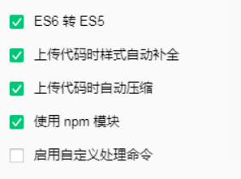

[TOC]

# 微信小程序

## 自定义导航栏

**开启自定义导航栏选项**

在全局配置或页面配置的 `.json`文件，设置 `navigationStyle `为 `custom`。

```json
{
  "navigationStyle": "custom"
}
```

导航栏样式，仅支持以下值：

+ `default` 默认样式。
+ `custom` 自定义导航栏，只保留右上角胶囊按钮。

**查看官网设计指南中，iOS和Android顶部到胶囊按钮的距离差别**


**使用 wx.getSystemInfoSync 获取状态栏高度和手机操作系统**

```js
wx.getSystemInfo({
  success: (result) => {
    let statusBarHeight = result.statusBarHeight
    let system = result.system
  },
})
```

**可以得出：**

+ 胶囊按钮到顶部距离 = 状态栏高度 + 状态栏到胶囊按钮间距
 + iOS胶囊按钮到顶部距离 = statusBarHeight + 6px（大约值）
 + Android胶囊按钮到顶部距离 = statusBarHeight + 8px（大约值）

- 导航栏高度 = 胶囊按钮高度 + 状态栏到胶囊按钮间距 * 2

  + iOS导航栏高度 = 32px + 6px * 2（大约值） = 44px
  + Android导航栏高度 = 32px + 8px * 2（大约值） = 48px

  

## 使用 npm 包

**安装 npm 包**

在小程序中初始化 npm 项目，在小程序 `package.json` 所在的目录中执行命令安装 npm 包：

```bash
npm init -y
npm install
```

**构建 npm**

点击开发者工具中的菜单栏：工具 --> 构建 npm，构建成功后，小程序根目录下就会出现 `miniprogram_npm` 目录。


**勾选“使用 npm 模块”选项**



 **构建完成后即可使用 npm 包**

```js
const myPackage = require('packageName')
const packageOther = require('packageName/other')
```

[参考文档](https://developers.weixin.qq.com/miniprogram/dev/devtools/npm.html)


## API Promise化

**安装**

```bash
npm install --save miniprogram-api-promise
```

**使用**

在小程序入口（app.js）调用一次 `promisifyAll`，只需要调用一次。

```js
import { promisifyAll, promisify } from 'miniprogram-api-promise';

const wxp = {}
// promisify all wx's api
promisifyAll(wx, wxp)
console.log(wxp.getSystemInfoSync())
wxp.getSystemInfo().then(console.log)
wxp.showModal().then(wxp.openSetting())

// compatible usage
wxp.getSystemInfo({success(res) {console.log(res)}})

// promisify single api
promisify(wx.getSystemInfo)().then(console.log)
```

[参考文档](https://developers.weixin.qq.com/miniprogram/dev/extended/utils/api-promise.html)

