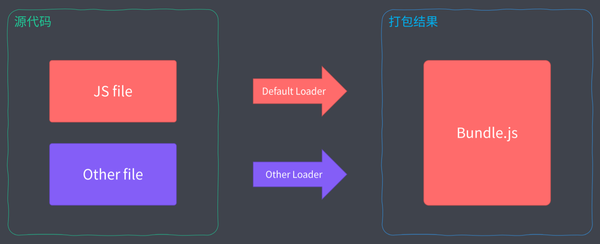

[TOC]

# Webpack基础与实践

## **ES Module 存在的问题**

- ES Modules存在环境兼容问题

- 模块文件过多，网络请求频繁

- webpack默认仅支持JS与JSON的处理

- 所有的前端资源都需要模块化，不仅仅局限于JS文件

  

## **新的需求**

- 新特性代码编译，新特性编译到可兼容

- 模块化JavaScript打包，开发阶段用模块化编写，生产阶段打包到一个文件中减少请求次数

  

- 支持不同类型的资源模块

  

- 对于前两个需求，我们可以通过之前的构建工具来实现，但是不同类型的资源模块化很难实现


## **Webpack模块打包工具**

- 模块加载器（Loader）：对存在兼容问题的代码进行编译转换

- 代码拆分（Code Splitting）：按需打包，而不是把所有的文件打包到一起

- - 如初次运行必要的模块打包到一起，其余的打包到一起，需要时再异步加载

- 资源模块（Asset Module）：载入任意资源文件，比如通过在JS文件中通过 `import` 引入css文件，这个文件会以style标签的形式来工作

- 打包工具解决的是前端整体资源的模块化，而并不是单指JavaScript的模块化


### **Webpack 快速上手**

- 初始化项目 `yarn init --y`

- `yarn add webpack webpack-cli --dev`

- - 注意项目文件夹的名字不能有空格，否则 `package.json` 中的 `name` 字段存在空格会报错，用-代替空格

- `yarn webpack --version`

- 打包 `yarn webpack`

- 在 `package.json` 中添加 `script` 字段便于命令执行

```js
"scripts": {
 "build": "webpack"
}
```


### **Webpack 配置文件**

- 默认的打包入口是 `src/index.js`，打包文件的输出时 `dist/main.js`，若修改需自定义配置

- 自定义配置文件：新增 `webpack.config.js` 文件

- - 运行在node.js环境中的文件，所以要按照CommonJS来书写代码

```js
const path = require('path')

module.exports = {
 entry:'./src/main.js',   // ./ 不能省略
 output:{
 filename:'bundle.js',
 path:path.join(__dirname,'output')  // 必须是绝对路径，所以借助path模块
    }
}
```

**备注：Webpack中的配置文件中，导出一个数组而非对象，可以执行多个打包任务**


### **Webpack 工作模式**

- 使用命令行 `yarn webpack --mode xxx`来指定工作模式，xxx有三个可选值

- - production

  - - 生产模式下，Webpack 会自动优化打包结果

- - development

  - - 开发模式下，Webpack 会自动优化打包速度，添加一些调试过程中的辅助

- - none

  - - none 模式下，Webpack 就是运行最原始的打包，不做任何额外处理

- 使用配置文件来定义工作模式：

```js
const path = require('path')

module.exports = {
 entry:'./src/main.js',   // ./ 不能省略
 output:{
 filename:'bundle.js',
 path:path.join(__dirname,'output')
    },
 mode:'development'
}
```


### **Webpack 打包结果运行原理**

- 通过立即执行函数来定义作用域

- 立即执行函数接收一个数组参数

- - 数组中的元素都是对应的一个模块

- 将所有模块打包到一起，并且提供一些基础代码，让模块和模块之间的依赖正确

  

## **Webpack 资源模块加载**

- webpack默认只能打包JS文件

- 如果想要处理其他资源文件就得使用loader来处理：

  


### **处理样式**

- 安装css-loader以及style-loader

- - `yarn add css-loader style-loader --dev`
  - css-loader是将css代码转换成JS模块进行打包引入
  - syle-loader是将css-loader转换后的结果以style标签的形式追加到页面上

- 多个loader中use是从后往前执行

  ```js
  const path = require('path')
  ​
  module.exports = {
    mode: 'none',
    entry: './src/main.css',  // 测试用，一般都是以js作为打包入口
    output: {
      filename: 'bundle.js',
      path: path.join(__dirname, 'dist')
    },
    module:{
      rules:[
        {
          test:/.css$/,
          use:[  // 先css-loader再style-loader
            'style-loader',
            'css-loader'
          ]
        }
      ]
    }
  }
  ```

  

### **导入资源模块**

- 一般都以js文件作为打包入口文件,也就是运行入口

- JavaScript 驱动整个前端应用的业务
- 让js作为打包的入口，将css作为资源文件导入
- 根据代码的需要动态导入资源,此时需要资源的不是应用，而是代码

```js
import createHeading from './heading.js'
import './main.css'  // 直接执行这个文件所以不用导出成员和接收

const heading = createHeading()

document.body.append(heading)
```

- 优势

- - 逻辑合理，JS确实需要这些资源文件
  - 确保上线资源不缺失，都是必要的


### **文件资源加载器**

**file-loader**

- 通过拷贝文件的方式来处理文件资源
- 安装file-loader
- 将导入的文件拷贝到输出目录
- 将输出目录的路径作为模块的返回值返回
- 最终拿到输出目录的访问路径


**Data URLs**

- 通过对文件进行编码的形式来表示资源
- 不同于传统URL，这个是特殊的URL协议，可以用来直接表示一个文件
- 这个URL就已经包含了文件内容，所以就不用去发送Http请求了


- 如果是图片或者字体这种无法用文本来表示的二进制类型的文件

- - 可以通过将文件的内容进行base64编码，以编码的字符串结果来表示文件内容


- - 需要安装url-loader

  - - `yarn add url-loader --dev`

- - 这样导出的资源就不再是file-loader那种文件的拷贝，而是一个base64编码的字符串

  - - 这样在输出的文件夹中就没有独立的物理文件了，而是集成到了bundle.js中了

- 这种方式适合体积比较小的资源，如果过大就会导致打包的结果过大，影响运行速度


**最佳实践：**

- 小文件使用Data URLs，减少请求次数

- 大文件使用file-loader的形式单独提取存放，提高加载速度

- 可以通过配置项的方式来实现这种最佳实践：

- - 这种通过options配置的方式会将10kb以上的文件用file-loader那种单独拷贝的形式处理
  - 10kb以下的文件将会以Data URLs的方式进行base64编码处理
  - 注意，虽然这个配置项里没有用到file-loader，但是默认url-loader会用到file-loader，所以一定要安装file-loader

+ file-loader新版本默认使用了esModule语法，造成了引用图片文件时的方式和以前的版本不一样,所以需要手动关闭才能正常显示

```js
{
   test: /.png$/,
   use: {
     loader: 'url-loader',
     options: {
       limit: 10 * 1024, // 10 KB
       esModule: false
     }
   }
 }
```


### **常用加载器分类**

- 编译转换类

- - 比如css-loader，就是将css代码转化为javascript模块

- 文件操作类

- - 比如file-loader，将文件拷贝到输出目录，然后将文件路径进行导出

- 代码检查类

- - 比如eslint-loader，统一代码风格，提高代码质量。不会修改生产环境的代码


### **处理ES6**

- webpack只能识别ES6中的 `import` 和 `export` ，其他的ES6语法不能识别

- webpack 不会编译es6代码，因为模块需要，所以处理 `import` 和 `export`

- 安装babel-loader（babel只是转换代码的平台，还需要安装具有转换功能的语法插件）

- 还需要安装插件 `@babel/core` 以及 `@babel/preset-env`

  ```js
  {
     test: /.js$/,
     use: {
       loader: 'babel-loader',
       options: {
         presets: ['@babel/preset-env']
       }
     }
   }
  ```

- webpack只是打包工具，加载器可以用来编译代码


### **模块加载方式**

loader处理JavaScript代码：

- 遵循ES Modules 标准的import声明
- 遵循 CommonJS 标准的require函数
- 遵循AMD 标准的define函数和require函数
- 非必须的情况下，一定要避免混用这些，便于维护

loader加载非JavaScript代码也会触发资源加载，所以也需要对应的loader来处理：

- 样式代码中的 `@import` 指令和 `url` 函数【JS中引入用 `import`，css中引入用 `@import`】

- - 入口文件中通过 `import` 导入main.css

  - - `import './main.css'`

- - webpack会使用css-loader打包处理main.css文件

  - - 此时发现里面的url函数引用了一个.png格式的图片，webpack会将这个图片作为资源模块加入打包过程
    - 根据配置文件中的配置找到相应的loaderj进行处理

+ 如果在css文件中使用 `@import` 导入其他的css资源也会触发资源的加载，参与webpack的打包

+ HTML代码中图片标签的src及其他资源链接属性，如href

+ - 在入口文件中导入html文件，并且导入的html模块是以字符串的形式导出

  - 所以我们要接收导入的html资源，可以使用 `document.write()` 的形式输出到页面

  - 并且要配置对应的loader，否则webpack不识别html

  - - `yarn add html-loader --dev`

- - href 也会触发资源，但是默认情况下html-loader只会识别src属性，所以需要进行额外的配置

  - - 添加options，添加attrs属性

  - ```js
    {
     test: /.html$/,
     use: {
     loader: 'html-loader',
     options: {
     attrs: ['img:src', 'a:href']
        }
      }
    }
    ```

  - 

### **webpack核心工作原理**


流程：

1. 首先是从js的入口文件，并从入口文件中的 `import` 或者 `require` 语句得到资源依赖形成依赖树
2. 然后webpack遍历递归这个依赖树，找到每个节点对应的资源文件模块
3. 接着根据配置文件中的 `rules` 属性找到模块对应的加载器来处理对应的模块文件
4. 最后将加载器处理的结果放到 `bundle.js` 中实现整个项目的打包

其中：

- Loader机制是webpack的核心，实现了各种非js资源文件的加载
- 如果没有loader，那么webpack就只能是个打包合并js代码的工具


### **开发一个自己的loader**

实现一个MarkDown文件的loader

- Loader负责资源文件从输入到输出的转换

- 对于同一个资源可以依次使用多个Loader，

- loader形如工作管道

- - 如：css-loader -> style-loader
  - source形参接收输入，return返回值返回输出
  - 要求最终的loader处理结果得是个JavaScript代码


方式一：直接返回结果

```js
const marked = require('marked')  // 需要先安装一个解析MarkDown文件的模块 yarn add marked --dev

module.exports = source => {  // source是输入，是加载到的文件的内容
  // console.log(source)
  // return 'hello'  // 这样不行，因为最终loader导出的应该是一个js代码
  // return 'console.log("hello ~")'  // 这个可以
  const html = marked(source)
  // return html  // 输出时加工后的结果
  // return `module.exports = "${html}"`  // 这样弄就会丢失换行符等格式，考虑使用下面方式
  return `module.exports = ${JSON.stringify(html)}`
  // return `export default ${JSON.stringify(html)}`

}
```

方式二：分两次loader处理

- 第一次处理后得到html字符串交给下一个loader处理

- - 第二次处理后返回结果


```js
// markdown-loader
const marked = require('marked')  

module.exports = source => {  /
  const html = marked(source)
  return html    // 返回 html 字符串交给下一个 loader 处理
}

// webpack.config.js
 module: {
    rules: [
      {
        test: /.md$/,
        use: [
          'html-loader', // 在安装一个html-loader，用于解析Markdown-loader返回的html
          './markdown-loader'
        ]
      }
    ]
}
```


## **webpack 插件机制**

- 增强 Webpack 自动化能力

- Loader专注实现资源模块加载

- Plugin专注解决其他自动化工作

- - 如自动清除dist目录中的文件
  - 拷贝静态文件至输出目录
  - 压缩输出的代码


### **webpack自动清除输出目录插件**

- 安装插件

- - `yarn add clean-webpack-plugin --dev`

- 导入插件

- - `const { CleanWebpackPlugin } = require('clean-webpack-plugin')`

- 在 `webpack.config.js` 配置文件中添加 `plugins` 属性,并声明这个插件

```js
const path = require('path')
const webpack = require('webpack')
const { CleanWebpackPlugin } = require('clean-webpack-plugin')

module.exports = {
  mode: 'none',
  entry: './src/main.js',
  output: {
    filename: 'bundle.js',
    path: path.join(__dirname, 'dist'),
    publicPath: 'dist/'
  },
  module: {
    rules: [
      {
        test: /.css$/,
        use: [
          'style-loader',
          'css-loader'
        ]
  },
  plugins: [
    new CleanWebpackPlugin()  // 声明插件
  ]
}
```


### **生成自动使用（引用）bundle.js的HTML**

- 之前HTML文件都是通过硬编码的形式写死的

- 这样存在着文件路径变化后不方便维护的问题

- 解决的方法就是通过webpack输出HTML文件到dist文件夹，让其参与webpack打包

- 安装 `html-webpack-plugin`

- - `yarn add html-webpack-plugin --dev`
  - 默认 `html-webpack-plugin` 就是一个插件类型，不需要结构内部成员，直接用其实例声明即可
  - 删除之前配置的 `{publicPath: 'dist'}`，因为现在是自动生成的了

- 改进 `html-webpack-plugin` 生成的结果

- - 简单、小量的修改可以通过配置的方式实现

  - - `title` 设置html页面标题
    -  `meta` 设置html标签

- - 大量的文件可以通过配置模板文件，根据模板文件来生成html页面文件

  - - 在src目录下定义一个用于使用的html模板
    - 在 `new HtmlWebpackPlugin()` 里面的配置对象属性中添加 `template` 属性，指向模板文件位置

```js
const HtmlWebpackPlugin = require('html-webpack-plugin')
// ...
plugins: [
  new CleanWebpackPlugin(),
    
  // 用于生成 index.html
  new HtmlWebpackPlugin({
    title: 'Webpack Plugin Sample',
    meta: {
  viewport: 'width=device-width'
    },
    template: './src/index.html'  // 根据模板来生成html页面
  })
]
```

模板文件：

```html
<!DOCTYPE html>
<html lang="en">
<head>
  <meta charset="UTF-8">
  <meta name="viewport" content="width=device-width, initial-scale=1.0">
  <meta http-equiv="X-UA-Compatible" content="ie=edge">
  <title>Webpack</title>
</head>
<body>
  <div class="container">
    <h1><%= htmlWebpackPlugin.options.title %></h1>  <!--用模板语法来占位待填充-->
  </div>
</body>
</html>
```


### **同时输出多个页面文件**

- 在 `plugins` 中加入多个 `HtmlWebpackPlugin` 实例对象
- 每个实例对象就用来生成一个页面文件

```js
const path = require('path')
const { CleanWebpackPlugin } = require('clean-webpack-plugin')
const HtmlWebpackPlugin = require('html-webpack-plugin')

module.exports = {
  mode: 'none',
  entry: './src/main.js',
  output: {
    filename: 'bundle.js',
    path: path.join(__dirname, 'dist'),
    // publicPath: 'dist/'
  },
  module: {
    rules: [
      {
        test: /.css$/,
        use: [
          'style-loader',
          'css-loader'
        ]
      }
    ]
  },
    
  plugins: [
    new CleanWebpackPlugin(),
      
    // 用于生成 index.html
    new HtmlWebpackPlugin({
      title: 'Webpack Plugin Sample',
      meta: {
        viewport: 'width=device-width'
      },
      template: './src/index.html'
    }),
      
    // 用于生成 about.html
    new HtmlWebpackPlugin({
      filename: 'about.html'
    })
  ]
}
```


### **静态文件打包**

- 拷贝静态文件至输出目录

- - 使用 `copy-webpack-plugin`

  - `yarn add copy-webpack-plugin --dev`

```js
const CopyWebpackPlugin = require('copy-webpack-plugin')
plugins: [
    new CopyWebpackPlugin([
      // 'public/**'  // 可以用目录通配符，也可以是一个文件路径
      'public'
    ])
]
```


### **插件机制的工作原理**

- 相比于`Loader`，`Plugin`拥有更宽的能力范围

- `Plugin`通过在生命周期的钩子中挂载函数实现的扩展

- webpack要求插件必须是一个函数或者是一个包含`apply`方法的对象（并非`this`指向的`apply`方法）

- 要明确插件的工作时机，在哪个生命周期进行绑定

- - `emit`生命周期是在向dist目录输出结果之前执行
  - 通过在生命周期的钩子中挂载函数实现扩展


例如开发一个删除webpack打包后产生注释的插件，示例如下：

```js
class MyPlugin {
  apply(compile) {
    console.log("调用插件");
    // emit 生命周期是在向 dist 目录输出结果之前执行
    compile.hooks.emit.tap("MyPlugin", (compilation) => {
      // compilation 可以理解为此次打包的上下文
      for (const name in compilation.assets) {
        if (name.endsWith(".js")) {
          const contents = compilation.assets[name].source();
          // 删除 webpack 注释
          const withoutComments = contents.replace(/\/\*\*+\*\//g, "");
          // 重写覆盖原有的内容
          compilation.assets[name] = {
            source: () => withoutComments,
            size: () => withoutComments.length,
          };
        }
      }
    });
  }
}

module.exports = {
  entry: {
    main: "./src/index.js",
  },
  plugins: [new MyPlugin()],
};
```


### **优化webpack开发体验**

传统的开发：

1. 编写源代码
2. webpack打包
3. 运行应用
4. 刷新浏览器

上述这种模式体验不好，所以提出新的需求

理想的开发环境：

- 可以以HTTP Server的方式运行，而不是以文件的形式

- - 更加接近生产环境
  - 可以使用前后端交互的api，如ajax

- 自动编译和自动刷新，源代码改动后会自动编译并刷新浏览器

- 能够提供Source Map支持

- - 一旦运行中出现错误，可以根据对照信息快速定位到问题所在


### **watch工作模式**

- 监听文件变化，自动重新打包

- - `yarn webpack --watch`
  - 但是浏览器需要手动刷新

- 自动刷新浏览器

- - `browser-sync dist --files "**/*"` // 用于监听dist文件下的目录变化
  - 操作麻烦，得同时使用 `watch` 和 `browser-sync`
  - 存在频繁的磁盘操作的问题，读写dist文件夹中的文件，降低了效率
  - 所以需要进一步改善


### **Webpack Dev Server**

- 同时兼备自动编译和自动刷新浏览器等功能

- 并提供了用于开发的Http Server

- 安装

- - `yarn add webpack-dev-server --dev`

- 运行

- - `yarn webpack-dev-server --open` --open自动唤醒浏览器去运行

- 功能

- - 自动使用webpack打包应用

  - 启动一个Http Server去运行打包结果

  - 运行后会监听代码的变化，源文件发生变化就会立即进行打包

  - 为并没有将打包结果(不包含静态资源)写入到磁盘当中，而是暂存到内存中，减少磁盘读写操作提高效率

  - dev server 默认只会打包输出的文件，访问不到静态资源文件

  - 如果需要访问静态资源文件需要进行额外的配置：

  - - 添加额外的devServer配置 `contentBase` ，用来指定一个静态资源目录以供访问：

```js
// webpack.config.js

module.exports = {
  mode: 'none',
  entry: './src/main.js',
  output: {
      ······
  },
  devServer: {
    contentBase: './public',  // 指定静态资源目录
    proxy: {
      '/api': {
        // http://localhost:8080/api/users -> https://api.github.com/api/users
        target: 'https://api.github.com',
        // http://localhost:8080/api/users -> https://api.github.com/users
        pathRewrite: {
          '^/api': ''
        },
        // 不能使用 localhost:8080 作为请求 GitHub 的主机名
        changeOrigin: true
      }
    }
  },
  module: {
  },
  plugins: [
    // // 开发阶段最好不要使用这个插件，频繁执行开销大，只在最后上线前使用
    // new CopyWebpackPlugin(['public'])
  ]
}
```

- - 代理API服务

  - - 问题产生原因：开发环境是在本地的http server：[http://localhost:8080/index.html](https://link.zhihu.com/?target=http%3A//localhost%3A8080/index.html)

    - 生产环境及使用的api都是在线上服务器：

    - - 生产环境应用：[http://www.example.com/index.html](https://link.zhihu.com/?target=http%3A//www.example.com/index.html)
      - 生产环境服务器：[http://www.example.com/api/users](https://link.zhihu.com/?target=http%3A//www.example.com/api/users)
      - 二者不存在跨域问题

- - - 开发环境及使用的api和应用：

    - - 开发环境的应用：[http://localhost:8080/index.html](https://link.zhihu.com/?target=http%3A//localhost%3A8080/index.html)
      - 生产环境的服务器：[http://www.example.com/api/users](https://link.zhihu.com/?target=http%3A//www.example.com/api/users)
      - 显然二者存在跨域的问题

- - - 可以使用CORS来解决，但是在同源部署的项目中没必要配置CORS，此时用代理服务更恰当

      

- - - - 例：将github api代理到本地开发服务器当中

      - - 在`devServer`中增加`proxy`属性，里面的每一个属性都代表一个规则配置
        - 属性名表示需要被代理的请求路径前缀（不是前面的主机名，而是主机名后紧跟着的路径）
        - [http://localhost:8080/api/users](https://link.zhihu.com/?target=http%3A//localhost%3A8080/api/users) => [https://api.github.com/api/users](https://link.zhihu.com/?target=https%3A//api.github.com/api/users)

```js
devServer: {
  contentBase: './public',
  proxy: {
    '/api': {
      // http://localhost:8080/api/users -> https://api.github.com/api/users
      target: 'https://api.github.com',
      // http://localhost:8080/api/users -> https://api.github.com/users 
      pathRewrite: { // 最终的路径中不应该有api，所以需要重写去掉
        '^/api': ''  // 将以api开头的字符串替换成空
      },
      // 不能使用 localhost:8080 作为请求 GitHub 的主机名
      changeOrigin: true  // 不应该是本地的主机名，应该是代理的主机名
    }
  }
}
```


### **Source Map**

- 由于经过了webpack打包后的代码是经过了编译，源代码将与运行的生产代码存在较大的差异
- 所以不方便调试，出错时也难以定位，因为都是基于转换后的代码
- 所以SourceMap即为源代码地图，可以将生产代码映射得到源代码，便于问题定位


- 以jQuery为例：

- - `jquery-x.x.x.min.map`文件就是Source Map文件

  - 是一个json文件

  - `version`表示当前source map版本

  - `sources`表示源文件名称

  - `name`表示源文件中的成员名称

  - `mappings`是核心属性，表示；源代码和生产代码之间的映射关系

  - 在jQuery的核心js压缩文件中（`.min.js`）可以添加sources map的注释

  - - `//# sourceMappingURL=jquery-3.4.1.min.map`
    - 如果有就自动请求这个sources map文件
    - 方便定位


### **Webpack配置Source Map**

- 与`mode`、`entry`、`output`平级添加`devtool`属性来指定使用哪种方式
- `webpack.config.js`中可以使用数组的形式导出，可以实现一次打包进行多个打包任务输出多个结果

```js
module.exports = [
    {
        entry:'./src/main.js'  // 从项目文件夹下开始写路径
        output: {
        	filename:'a.js'
    	}
    },
    {
        entry:'./src/main.js'
        output: {
        	filename:'b.js'
    	}
    }
]
```

- Webpack支持12种方式

- - eval

  - cheap-eval-source-map

  - cheap-module-eval-source-map

  - eval-source-map

  - cheap-source-map

  - cheap-module-source-map

  - inline-cheap-source-map

  - inline-cheap-module-source-map

  - source-map

  - inline-source-map

  - hidden-source-map

  - nosources-source-map

    

- 每种方式的效率和质量是相互牵制的关系，效果如下：

- - eval：

  - - 没有生成对应的sorce map，只能定位哪个文件出了错，并不能知道源代码行列信息，构建速度最快

  - eval-source-map

  - - 可以定位到行和列的错误信息，因为生成了sourceMap

  - cheap-source-map

  - - 阉割版的source-map，并且是编译加工后的结果，只有行没有列，生成速度会变快

  - cheap-module-eval-source-map

  - - 只能定位到行，和编写源代码一样，并没有经过编译加工

  - cheap-source-map

  - - 没有用eval处理代码，没有module是loader处理之后的代码

  - inline-source-map

  - - 和source-map效果上是一样的，source-map是以物理文件的形式存在的，inline-source-map是以Data url方式，增大了体积，一般不用

  - hidden-source-map

  - - 开发第三方包比较有用，生成了sourcemap文件但是不能在开发工具中找到

  - nosources-source-map

  - - 可以提供行列信息，但是在开发工具中看不到源代码，为了在生产环境中保护源代码不被暴露


- 前缀含义：

- - eval - 是否使用eval函数执行模块代码
  - cheap - Source Map 是否只包含行信息，没有列信息
  - module - 是否能够得到Loader处理之前的源代码


| devtool                        | 构建速度 | 重新构建速度 | 生产环境 | 品质(quality)               |
| ------------------------------ | -------- | ------------ | -------- | --------------------------- |
| (none)                         | +++      | +++          | yes      | 打包后的代码(没有sourcemap) |
| eval                           | +++      | +++          | no       | 生成后的代码                |
| cheap-eval-source-map          | +        | ++           | no       | 转换过的代码（仅限行）      |
| cheap-module-eval-source-map   | o        | ++           | no       | 原始源代码（仅限行）        |
| eval-source-map                | --       | +            | no       | 原始源代码                  |
| cheap-source-map               | +        | o            | no       | 转换过的代码（仅限行）      |
| cheap-module-source-map        | o        | -            | no       | 原始源代码（仅限行）        |
| inline-cheap-source-map        | +        | o            | no       | 转换过的代码（仅限行）      |
| inline-cheap-module-source-map | o        | -            | no       | 原始源代码（仅限行）        |
| source-map                     | --       | --           | yes      | 原始源代码                  |
| inline-source-map              | --       | --           | no       | 原始源代码                  |
| hidden-source-map              | --       | --           | yes      | 原始源代码                  |
| nosources-source-map           | --       | --           | yes      | 无源代码内容                |

**备注：+++ 非常快速, ++ 快速, + 比较快, o 中等, - 比较慢, -- 慢**


### **选择合适的Source Map**

- 开发模式

- - 首选 `cheap-module-eval-source-map`
  - 代码没行不会超过80个字符
  - 代码经过Loader转换过后的差异较大，需要调试转换之前的代码
  - 首次打包速度慢，重写打包相对较快

- 生产模式

- - 生产上线模式首选 `none`

  - Source Map 会暴露源代码

  - 调试是开发阶段的事情

  - 或者选用 `nosources-source-map`

  - - 出现错误报错时在控制台中可以找到源代码对应的位置，但是不会在开发者工具中暴露所有源代码

- - 没有绝对的通用法则，理解不同模式的差异，适配不同的环境


### **Webpack 自动刷新问题**

- 传统自动刷插件存在的问题：

- - 自动刷新导致的页面状态丢失，比如在页面中输入了一些内容
  - 但是在源代码中修改了样式会触发重新打包导致页面刷新，就会导致页面中输入的内容丢失


### **Webpack HMR体验**

- HMR：Hot Module Replacement（模块热更新/ 热插拔）

- 热拔插：

- - 在运行过程中可以随时插拔设备，并且运行状态不受影响，插入的设备也能即时投入工作
  - 如USB端口

- 模块热替换：

- - 在应用运行过程中实时替换某个模块
  - 应用运行状态不受影响
  - 不会产生页面的自动刷新而导致页面状态丢失
  - 热替换只将修改的模块实时替换至应用

- HMR是Webpack中最强大的功能之一，极大程度的提高了开发者的工作效率

- 开启HMR

- 集成在webpack-dev-server中

- - 可以通过命令行`webpack-dev-server --hot`

  - 也可以通过配置文件开启

  - - 增加`devServer`属性，设置`{hot: true}`
    - 导入webpack模块，并实例化使用webpack内置插件`webpack.HotModuleReplacementPlugin`

```js
const webpack = require('webpack')
  devServer: {
  hot: true
    },
  plugins: [
  new HtmlWebpackPlugin({
    title: 'Webpack Tutorial',
    template: './src/index.html'
  }),
  new webpack.HotModuleReplacementPlugin()
]
```

- 存在的问题：上述配置只能热更新样式，而对于js代码仍然会刷新页面

- 关于HMR的疑问

1. 为什么样式文件的热更新开箱即用？

	因为样式文件是经过loader处理的，loader已经进行了热更新配置

2. 凭什么样式文件可以自动处理，js却不行？

	当样式文件改变时可以即时替换掉样式代码，就可以覆盖样式了。而javascript是毫无规律的。

3. 我的项目没有手动处理，JS照样可以热替换

   那是由于使用了框架，框架下的开发，每种文件都是有规律的，并且通过脚手架创建的项目内部集成了HMR方案

- HMR APIs处理JS模块热替换

  在main.js中添加如下代码：


```js
module.hot.accept('./editor',() =>{   // 表示当editor这个js文件中的代码变化了就热更新，更新结束并执行后面回调函数中的内容
    console.log('执行了') 
  	// 这里写热替换的处理逻辑
}) // webpack处理JS模块热替换没有通用的方法，因为每个模块都有不同的逻辑
```

- 图片模块的热替换

```js
module.hot.accept('./xxx.png',() =>{   
    img.src = background  // 将图片的地址修改成替换后的来实现热更新
    console.log('图片替换完成')
})
```

- HMR 注意事项

1. 如果在使用HMR的时候发生了运行错误，HMR刷新会导致错误被掩盖，看不到错误
   解决办法是使用 `{hotOnly: true}` 的方法，因为 `{hot: true}` 是会导致如果热替换失败会自动使用刷新功能导致错误被掩盖。
2. 如果在没启用（没有实例化声明`new webpack.HotModuleReplacementPlugin()`）情况下HMR API会报错，解决办法是进行一次判断，如果有热替换模块再使用热替换：

```js
if (module.hot) {
	// 判断是否存在
}
```

3. 代码中多了一些与业务无关的代码，在打包后会被移除掉，不会占用资源


## **生产环境优化**

- 生产环境和开发环境存在差异

  + 生产环境注重运行效率

  - 开发环境注重开发效率

- mode 模式

  + 为不同的工作环境创建不同的配置


### **为不同的工作环境进行不同的webpack配置**

1. **配置文件根据环境不同导出不同配置**

```js
const webpack = require('webpack')
const { CleanWebpackPlugin } = require('clean-webpack-plugin')
const HtmlWebpackPlugin = require('html-webpack-plugin')
const CopyWebpackPlugin = require('copy-webpack-plugin')

module.exports = (env, argv) => { // webpack配置也支持定义一个函数，其中参数env 是通过命令行传递的环境名参数，argv是运行命令行传递的所有参数
  const config = {  // 将开发模式下的配置定义到这个config对象里面
    mode: 'development',
    entry: './src/main.js',
    output: {
      filename: 'js/bundle.js'
    },
    devtool: 'cheap-eval-module-source-map',
    devServer: {
      hot: true,
      contentBase: 'public'
    },
    module: {
      rules: [
        {
          test: /\.css$/,
          use: [
            'style-loader',
            'css-loader'
          ]
        },
        {
          test: /\.(png|jpe?g|gif)$/,
          use: {
            loader: 'file-loader',
            options: {
              outputPath: 'img',
              name: '[name].[ext]'
            }
          }
        }
      ]
    },
    plugins: [
      new HtmlWebpackPlugin({
        title: 'Webpack Tutorial',
        template: './src/index.html'
      }),
      new webpack.HotModuleReplacementPlugin()
    ]
  }

  if (env === 'production') {
    config.mode = 'production'
    config.devtool = false  // 禁用掉Sorce Map
    config.plugins = [
      ...config.plugins,
      new CleanWebpackPlugin(),  // 这两个插件只在上线阶段使用
      new CopyWebpackPlugin(['public'])
    ]
  }

  return config
}
```

- 使用的时候要在命令行中传递参数说明环境：

- - `yarn webpack --env production`
  - 额外的插件也会开始工作

- 无论是生产模式还是开发模式，配置的loader及一些通用型插件是必须都得使用的
- 但是有些插件是在开发模式下没必要使用的，如上述的两个，所以仅在上线模式前使用
- 小型项目建议使用这种，但是大型项目配置及配置文件较多，所以建议使用第二种

**2. 不同环境对应不同配置文件**
多配制文件：

- - 删除之前的`webpack.config.js`这个默认的配置文件，新建其他配置文件

  - 一般用三个文件，分别表示开发配置，生产配置，和以上两者的公共配置

  - - `webpack.common.js`
    - `webpack.dev.js`
    - `webpack.prod.js`

- - 公共配置 `webpack.common.js`

  - - 这里面插件只有一个`html-webpack-plugin`

- loader是公共的，无论是开发还是生产环境都需要

- - 开发和生产环境不同的地方主要体现在插件的使用上

```js
const HtmlWebpackPlugin = require('html-webpack-plugin')
    
module.exports = {
  entry: './src/main.js',
  output: {
    filename: 'js/bundle.js'
  },
  module: {
    rules: [
      {
        test: /\.css$/,
        use: [
          'style-loader',
          'css-loader'
        ]
      },
   {
        test: /\.(png|jpe?g|gif)$/,
     use: {
          loader: 'file-loader',
       options: {
            outputPath: 'img',
         name: '[name].[ext]'
          }
        }
      }
    ]
  },
plugins: [
     new HtmlWebpackPlugin({
       title: 'Webpack Tutorial',
       template: './src/index.html'
     })
   ]
 }
 
 
```

- 生产配置`webpack.prod.js`

- - 生产配置中相较于开发配置多了几个插件

  - 我们希望能将多出的插件合并到公共配置中，实现对公共配置扩充后成为生产配置

  - - 安装`webpack-merge`模块，`yarn add webpack-merge --dev`
    - 载入`webpack-merge`

```js
const merge = require('webpack-merge')
const { CleanWebpackPlugin } = require('clean-webpack-plugin')
const CopyWebpackPlugin = require('copy-webpack-plugin')
const common = require('./webpack.common')

module.exports = merge(common, {  // merge函数会将common中的配置合并到当前文件中，并不会发生plugins属性被覆盖的现象
  mode: 'production',
  plugins: [
    new CleanWebpackPlugin(),
    new CopyWebpackPlugin(['public'])
  ]
})
```

- - - 因为没有了配置文件，所以需要使用指定配置文件或在`scripts`字段中进行配置：

    - - `yarn webpack --config webpack.prod.js`的方式来指定配置文件来运行
      - 或者在`package.json`的`scripts`字段中进行配置

```json
 "scripts": {
    "build": "webpack --config webpack.prod.js"
  },
```


## **总结：**

由于不同环境下主要体现在使用插件的不同，所以使用分别配置的方式来进行

- 公共配置`webpack.common.js`，无论哪个环境都得有的loader和插件

- - 包含处理模块的所有loader

  - html自动引入`bundle.js`的插件

  - - `yarn add html-webpack-plugin --dev`

- 开发配置`webpack.dev.js`

- - 用于在公共配置的基础上添加插件而不是覆盖

  - - `yarn add webpack-merge --dev`

- - 自动编译、引入、热更新，并提供一个开发服务器的插件

  - - `yarn add webpack-dev-server --dev`

- 生产配置`webpack.prod.js`

- - 打包之前自动清除目录

  - - `yarn add clean-webpack-plugin --dev`

- - 拷贝静态文件至输出目录

  - - `yarn add copy-webpack-plugin --dev`


### **production模式下的优化**

在webpack4中，`mode=production`的环境下会对代码进行一系列的优化

- DefinPlugin

- - webpack内置的插件，如果想要进行配置，需要导入webpack模块

  - production模式下会自启动，并为代码注入全局成员：

  - - `process.env.NODE_ENV` （是个全局常量）
    - 三方的模块都是根据这个常量来判断当前的运行环境

- - 配置：

```js
const webpack = require('webpack')

module.exports = {
  mode: 'none',
  entry: './src/main.js',
  output: {
    filename: 'bundle.js'
  },
  plugins: [
    new webpack.DefinePlugin({
      // 值要求的是一个代码片段,也可以直接：'"https://api.example.com"'
      API_BASE_URL: JSON.stringify('https://api.example.com')
    })
  ]
}
```

- - 可以通过上述环境来进行api路径配置，生产环境和开发环境的`base_url`肯定是不一样的

- Tree-shaking

- - webpack内置的插件，如果想要进行配置，需要导入webpack模块

  - production模式下会自启动，并自动清除未使用的成员（dead-code）

  - - `usedExports: true`, 模块只导出被使用的成员,标记哪些是“枯树叶”

    - `minimize: true` ，压缩输出结果，删除没用的代码,将“枯树叶”摇下来

    - `concatenateModules: true`, 尽可能将所有的模块合并并输出到同一个函数中

    - - 既提升了运行效率，又减少了代码的体积
      - 称之为 `Scope Hoisting`

- - 配置：

```js
// webpack.config.js

module.exports = {
  mode: 'none',
  entry: './src/index.js',
  output: {
    filename: 'bundle.js'
  },
  optimization: {  // 集中配置 webpack 内部优化功能
    usedExports: true,     // 模块只导出被外部使用的成员,标记哪些是“枯树叶”
    concatenateModules: true,     // 尽可能将所有的模块合并并输出到同一个函数中
    minimize: true      // 压缩输出结果，删除没用的代码,将“枯树叶”摇下来
  }
}
```

- Tree-shaking的注意事项

- - Tree Shaking使用的前提是ES Modules，即Webpack 打包的代码必须使用 ESM

  - 但是为了转换代码中的ES6的新特性需要使用babel-loader

  - - 因为webpack是基于nodejs进行开发的，本应遵循CommonJS
    - babel-loader会根据运行环境将ES Modules转换成CommonJS
    - 理论上讲，同时使用babel和Tree Shaking时就导致Tree Shaking无法生效
    - 但是实际上的babel-loader不会导致Tree Shaking失效
    - 因为最新版本的babel-loader中的preset-env中禁止了commonJs的转换

- - 配置`preset-env`的方法：

```js
module.exports = {
  mode: 'none',
  entry: './src/index.js',
  output: {
    filename: 'bundle.js'
  },
  module: {
    rules: [
      {
        test: /\.js$/,
        use: {
          loader: 'babel-loader',
          options: {
            presets: [
           // 如果 Babel 加载模块时已经转换了 ESM，则会导致 Tree Shaking 失效
           // ['@babel/preset-env', { modules: 'commonjs' }] 这样就会失效，babel会将ESM转换为commonjs，从而导致 Tree Shaking 失效
           // ['@babel/preset-env', { modules: false }] 不转换ESM，所以 Tree Shaking 不会失效
           // 也可以使用默认配置，也就是 auto，这样 babel-loader 也不转换ESM，所以 Tree Shaking 也不会失效
              ['@babel/preset-env', { modules: 'auto' }]
            ]
          }
        }
      }
    ]
  },
  optimization: {
    // 模块只导出被使用的成员
    usedExports: true,
    // 尽可能合并每一个模块到一个函数中
    // concatenateModules: true,
    // 压缩输出结果
    // minimize: true
  }
}
```

- - 其实现在这里不需要进行配置了，因为默认配置Tree-shaking就能生效，但是探索过程值得深思。


- sideEffects 副作用

- - 模块执行时除了导出成员之外所做的事情

  - sideEffects一般用于npm包标记是否有副作用

  - 允许通过配置的方式去标识代码是否有副作用，从而为tree-shaking提供更大的压缩空间

  - 使用

  - - 在`webpack.config.js`文件中进行配置来表示开启这个功能

```js
optimization: {
  sideEffects: true  // 打开后打包时会检查package.json中的sideEffects标识
}
```

- - - 在`package.json`中进行标识哪些文件有副作用的

```js
// 表示所有文件都没有副作用
"sideEffects": "false" 

// 或者使用下面这种标识哪些文件是有副作用的
"sideEffects": [
  "./src/extend.js",
  "*.css"
]
```

- - - 注意确保代码没有副作用

    - - 在JS代码中导入的css模块也算副作用，如果在`package.json`中声明了没有那么导入的css将会失效


## **分块打包**

- webpack把文件资源统一到一起，但是过多的资源将会导致bundle过大

- 模块粒度太小了也不行，webpack初衷就是将文件资源整合起来

- - 如果不进行整合，可能导致实现某个功能将会加载很多模块

  - 并不是每个模块在启动时都是必要的，所以需要进行分包

  - 在HTTP1.1下有很多的限制：

  - - 不能对同一个域名下发起多个并行请求
    - 每次请求都会有一定的延迟
    - 请求的Header浪费带宽流量

  - 模块打包是必要的

- 所以需要有一个平衡的点，实现方式：

- - 多入口打包
  - 动态导入

- module、chunk、bundle之间的关系：

1. 项目中的资源文件无论是 ESM 还是 commonJS 或是 AMD，他们都是 module ；
2. 当我们写的 module 源文件传到 webpack 进行打包时，webpack 会根据文件引用关系生成 chunk 文件，webpack 会对这个 chunk 文件执行相应的loader及plugins的操作
3. webpack 处理好 chunk 文件后，最后会输出源码兼容编译的后的 bundle 文件，所以它可以直接在浏览器中运行。


[(*注: 此知识点参考了该博文，点击查看详情)](https://link.zhihu.com/?target=https%3A//www.cnblogs.com/skychx/archive/2020/05/18/webpack-module-chunk-bundle.html)


### **多入口打包**

- 适用于传统的多页应用程序
- 一个页面对应一个打包入口
- 每个入口文件都是一个chunk group，在不考虑分包的情况下，一个 chunk group 中只有一个 chunk代码块，该 chunk 包含递归分析后的所有模块。每一个 chunk 都有对应的一个打包后的输出文件bundle.js。

使用：

- 在`webpack.config.js`文件中进行配置，`entry`指定多入口

- - `entry`如果是个对象那么就表示多入口进行分别打包，分别输出
  - `entry`如果是个数组就表示将多个文件打包到一起，合并输出

```js
// webpack.config.js
const { CleanWebpackPlugin } = require('clean-webpack-plugin')
const HtmlWebpackPlugin = require('html-webpack-plugin')

module.exports = {
  mode: 'none',
  entry: {   // 这里的入口文件是个对象，分别打包
    index: './src/index.js',
    album: './src/album.js'
  },
  output: {
    filename: '[name].bundle.js'
  },
  module: {
    rules: [
      {
        test: /\.css$/,
        use: [
          'style-loader',
          'css-loader'
        ]
      }
    ]
  },
  plugins: [
    new CleanWebpackPlugin(),
      
    new HtmlWebpackPlugin({  // 自动载入打包后的模块的功能插件
      title: 'Multi Entry',
      template: './src/index.html',
      filename: 'index.html',
      chunks: ['index']  // 表示自动载入的打包后的文件是哪个，如果不指定两个打包文件都将会被导入
    }),
      
    new HtmlWebpackPlugin({
      title: 'Multi Entry',
      template: './src/album.html',
      filename: 'album.html',
      chunks: ['album']
    })
  ]
}
```

- 公共部分单独提取

- - 如果多个入口文件都引用了相同的资源，将会导致重复引用浪费资源（比如多页面都引入了vue，jQuery）
  - 添加`optimization`对象，并指定`splitChunks`属性，`chunks: 'all'`指定所有公共模块打包到单独的bundle.js文件中

```js
const { CleanWebpackPlugin } = require('clean-webpack-plugin')
const HtmlWebpackPlugin = require('html-webpack-plugin')

module.exports = {
  mode: 'none',
  entry: {
    index: './src/index.js',
    album: './src/album.js'
  },
  output: {
    filename: '[name].bundle.js'
  },
    
  // 提取公共模块到单独的bundle.js文件中
  optimization: {
    splitChunks: {
      chunks: 'all'
    }
  },
    
  module: {
    rules: [
      {
        test: /\.css$/,
        use: [
          'style-loader',
          'css-loader'
        ]
      }
    ]
  },
  plugins: [
    new CleanWebpackPlugin(),
    new HtmlWebpackPlugin({
      title: 'Multi Entry',
      template: './src/index.html',
      filename: 'index.html',
      chunks: ['index']
    }),
    new HtmlWebpackPlugin({
      title: 'Multi Entry',
      template: './src/album.html',
      filename: 'album.html',
      chunks: ['album']
    })
  ]
}
```


### **webpack动态导入（JS模块的按需加载）**

- 动态导入的模块会被自动分包
- 相对于多入口导入更加灵活，可以按需导入不同的模块，控制什么时候导入模块
- 使用时无需配置，只需要在写代码的时候使用ESM的按需导入模块的语法即可
- 如果使用框架的话那么在路由中配合动态导入的方式也能实现按需加载

```js
// import posts from './posts/posts'
// import album from './album/album'

const render = () => {
  const hash = window.location.hash || '#posts'

  const mainElement = document.querySelector('.main')

  mainElement.innerHTML = ''

  if (hash === '#posts') {
    // 可以通过下面添加注释的方式为生成的包重命名并且具有相同名称的包会被打包到一起
    import(/* webpackChunkName: 'components' */'./posts/posts').then(({ default: posts }) => {
      mainElement.appendChild(posts())
    })
  } else if (hash === '#album') {
    // mainElement.appendChild(album())
    import(/* webpackChunkName: 'components' */'./album/album').then(({ default: album }) => {
      mainElement.appendChild(album())
    })
  }
}

render()

window.addEventListener('hashchange', render)
```


### **CSS模块的按需加载**

- 安装`yarn add mini-css-extract-plugin --dev`
- 可以实现打包后生成单独的css文件，而并非是之前那种集成到bundle.js中以style引入的样式
- 替换之前使用的style-loader，取而代之的是使用 `MiniCssExtractPlugin.loader`
- style-loader是向html中国注入style标签的形式完成的，而MiniCssExtractPlugin是通过link引入CSS文件的形式注入CSS的
- 并不是所有的css文件都按需加载，而是css文件超过了150KB左右才进行这种单独提取CSS文件的形式
- 否则CSS代码嵌入得到HTML中减少一次请求效果会更好
- 这种打包模式也还有个缺点，缺点就是生产模式打包时内置的压缩代码插件只对JS代码有效
- 其余资源压缩需要配置额外的插件进行处理

```js
const { CleanWebpackPlugin } = require('clean-webpack-plugin')
const HtmlWebpackPlugin = require('html-webpack-plugin')
const MiniCssExtractPlugin = require('mini-css-extract-plugin')

module.exports = {
  mode: 'none',
  entry: {
    main: './src/index.js'
  },
  output: {
    filename: '[name].bundle.js'
  },

  module: {
    rules: [
      {
        test: /\.css$/,
        use: [
          // 'style-loader', // 将样式通过 style 标签注入,使用MiniCssExtractPlugin后不使用这种引用方式
          MiniCssExtractPlugin.loader, // 而是使用link标签引入文件的方式注入CSS
          'css-loader'
        ]
      }
    ]
  },
  plugins: [
    new CleanWebpackPlugin(),
    new HtmlWebpackPlugin({
      title: 'Dynamic import',
      template: './src/index.html',
      filename: 'index.html'
    }),
    new MiniCssExtractPlugin()
  ]
}
```


### **生产模式打包情况下压缩CSS**

- 安装 `yarn add optimize-css-assets-webpack-plugin --dev`
- `optimize-css-assets-webpack-plugin`写到 `optimization`而非 `plugins`中，是因为让其在指定`env = production`时才生效，而非所有模式下生效，因为`optimization`配置的优化只会在`env = production`时才生效。
- 通过在optimization中进行配置，但是这样配置有个问题会把默认的JS压缩覆盖掉
- 所以需要再安装JS压缩的插件`yarn add terser-webpack-plugin --dev`，`terser-webpack-plugin`是webpack内置默认压缩js的插件。
- 这样就能保证在生产模式下才压缩代码

```js
const { CleanWebpackPlugin } = require('clean-webpack-plugin')
const HtmlWebpackPlugin = require('html-webpack-plugin')
const MiniCssExtractPlugin = require('mini-css-extract-plugin')
const OptimizeCssAssetsWebpackPlugin = require('optimize-css-assets-webpack-plugin')
const TerserWebpackPlugin = require('terser-webpack-plugin')

module.exports = {
  mode: 'none',
  entry: {
    main: './src/index.js'
  },
  output: {
    filename: '[name].bundle.js'
  },
  optimization: {
    minimizer: [
      new TerserWebpackPlugin(),
      new OptimizeCssAssetsWebpackPlugin()
    ]
  },
  module: {
    rules: [
      {
        test: /\.css$/,
        use: [
          // 'style-loader', // 将样式通过 style 标签注入,使用MiniCssExtractPlugin后不使用这种引用方式
          MiniCssExtractPlugin.loader, // 而是使用link标签引入文件的方式注入CSS
          'css-loader'
        ]
      }
    ]
  },
  plugins: [
    new CleanWebpackPlugin(),
    new HtmlWebpackPlugin({
      title: 'Dynamic import',
      template: './src/index.html',
      filename: 'index.html'
    }),
    new MiniCssExtractPlugin()
  ]
}
```


## **输出文件名Hash**

- 背景：

- - 前端在部署项目时会开启浏览器的静态资源缓存功能，但是在缓存静态资源时存在着问题

  - - 如果缓存设置的缓存有效时间过短，那么将导致缓存效果不明显
    - 如果缓存设置的有效时间过长的话，那么将导致应用重新部署后缓存得不到及时更新

- 解决办法

- - 在生产模式下，给输出的文件名中添加Hash值
  - 这样一来，一旦资源文件发生改变，文件名称也将发生变化
  - 对应客户端而言，全新的文件名代表着全新的请求，这样就不存在缓存得不到更新的情况了
  - 这样就可以将缓存有效时间设置的无限的长

- 使用

- - 为输出的文件名进行操作，即`filename`属性
  - 输出hash值的三种方法：
  - `filename: '[name]-[hash].bundle.js'` // 全局级别，任意文件改变所有文件都会更新hash值
  - `filename: '[name]-[chunkhash].bundle.js'`// chunk级别，**同一个chunk下的文件hash值是一样的，某个chunk下的文件发生改变，那么同一个chunk下的所有文件的hash值都会更新**
  - `filename: '[name]-[contenthash:8].bundle.js'` // 文件级别，对应文件发生改变才会改变自身的hash值，而不会改变其他文件的hash值
  - 可以在hash模式后面接一个冒号加数字用来限制hash的长度，一般选用8位最优
  - 注意，一般文件发生变化后main.js入口文件也会发生变化，因为引入chunk的路径变化了
