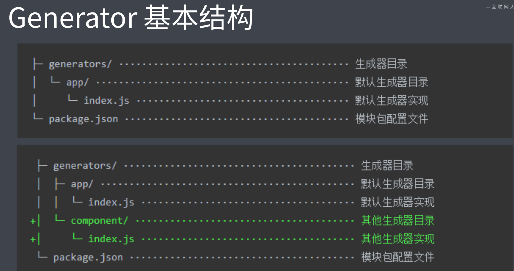
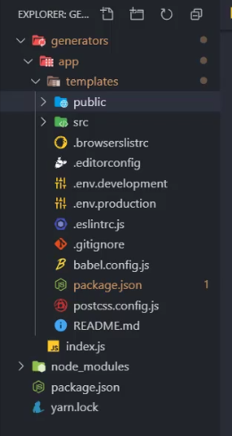
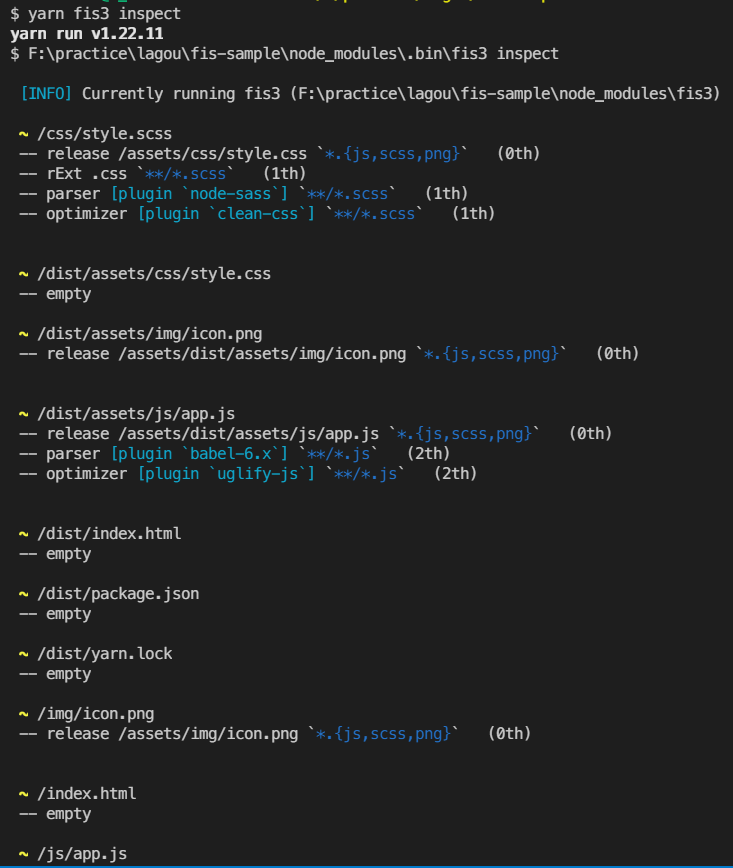

[TOC]

# 前端工程化概述及自动化构建工具

## **定义**

- 一切以提高效率、降低成本、质量保证为目的的手段，都属于工程化

  

## **前端工程化主要解决的问题**

- 传统语言或语法的弊端
- 无法使用模块化/组件化
- 重复性的机械工作
- 代码风格统一、质量保证
- 依赖后端服务接口的保证
- 整体依赖后端项目

  

## **工程化的表现**

体现在项目的整个流程：

- 创建项目

- 创建项目结构

- 创建特定类型文件

- 编码

- - 格式化校验
  - 校验代码风格
  - 编译 / 构建 / 打包

- 预览/测试

- - Web Server / Mock
  - Live Reloading / HMR
  - Source Map

- 提交

- - Git Hooks
  - Lint-staged
  - 持续集成

- 部署

- - CI / CD
  - 自动发布


## **工具和工程化**

- 工具不等于工程化，比如webpack不是工程化，它是工具

- 工程化是对项目的整体的规划或者架构而不是某个工具

- 工具是实现这种规划或者架构落地的手段

- 成熟的工程化的集成：

- - create-react-cli
  - vue-cli
  - angular-cli
  - ......

- 上述的集成工具不仅实现自动化构建项目
- 更多的是约定vue项目应该有什么样的目录结构、什么特定的文件
- 提供热更新等服务


## **工程化与node**

- 前端工程化是由node强力驱动的


## **项目创建环节——脚手架**

### **脚手架的本质作用**

- 创建项目基础结构
- 提供项目规定和约定


### **用于解决的问题**

- 相同的组织结构
- 相同的开发范式
- 相同的模块依赖
- 相同的工具配置
- 相同的基础代码


### **常用的脚手架工具**

#### 专用型脚手架

如**create-react-cli**

- 作用

- - 根据信息创建对应的项目接触结构
  - 服务于专用的框架项目


#### 通用型脚手架

如**Yeoman**

- 作用

- - 在项目创建时使用
  - 根据一套模板生成对应的项目结构
  - 灵活易扩展


如**plop**

- 作用

- - 在项目过程中用于创建特定类型的文件（组件化项目中创建新的组件，模块化的项目中创建新的模块）
  - 更稳定，更方便，更快捷


### **通用型脚手架Yeoman**

- 更像是一款脚手架运行平台
- Yeoman需要搭配generator创建任何类型的项目
- 不够专注，细节上没有专用型细致
- 想要使用Yeoman来创建项目的话必须要找到对应的generator

### Yeoman使用

以创建node模块项目为例

- 在全局范围安装yo

- - ```bash
    yarn global add yo / npm install -g yo 
    ```

- 安装对应的generator （不同的generator可生成不同的项目）

- - ```bash
    yarn global add generator-node / npm install -g generator-node
    ```

- 通过yo运行generator（运行方式是把包名前面的`generator-`去掉通过yo来运行）

- - ```bash
    cd path/to/project-dir
    ```

  - ```bash
    mkdir my-module
    ```

  - ```bash
    yo node // 生成node项目结构
    ```


如果想要在原有的项目基础上去添加一些配置文件需要使用Sub Generator

下面以向node项目中添加cli功能举例：

- Sub Generator

- - 在原有的基础上加上配置文件

  - 基本使用，把上述项目变成一个cli命令，所以需要使用node:cli子集Generator来进行生成

  - - ```bash
      yo node:cli
      ```

    - ```bash
      yarn link // 将本地的项目link到全局范围，就相当于 yarn link 自动给全局配置了一个映射关系
      ```

    - 因为转变成cli项目后新增了新的依赖，所以需要安装一下新的依赖，使用`yarn`命令即可

    - ```bash
      my-module --help // 这样就不用使用yo node来使用了
      ```

**注意：并不是所有的generator都提供子集sub生成器，需要根据Yeoman官网中给出的generator来**


### Yeoman使用流程

1. 明确你的需求
2. 找到合适的Generator（去Yeoman官网上去找合适的Generator）
3. 全局范围安装找到的Generator
4. 通过Yo运行对应的Generator
5. 通过命令行交互填写选项
6. 生成你所需要的项目结构


### 自定义Generator

因为不同的Generator会生成不同的手脚架，那么我们自定义一个Generator将会生成自己所需要的项目结构

基于Yeoman搭建自己的脚手架，以Vue为例

- Generator本质上就是一个npm模块

- 创建Generator模块

- - Generator与npm模块不同的是他的名称得是以generator-name的形式来命名
  - Generator 基本结构

- 

默认是app文件夹存放的是生成器对应的代码，如果有 sub-generator 的话就直接和app同级新建一个文件夹即可，如上图中就有了个component生成器


基本流程：

1. 新建一个项目文件夹，并用`yarn init -y`初始化 (注意，这个文件夹的名字就是最终的生成器的名字，使用`yo name` 就能使用了)

2. 安装yeoman-generator，提供了一些便于创建生成器的工具函数

   ```bash
   npm i yeoman-generator
   ```

3. cd到这个项目文件夹，创建上述图片中的Generator结构

- 其中，`index.js`就是Generator的核心入口，需要导入一个继承自Yeoman Generator的类型
- Yeoman Generator 在工作时会自动调用我们在此类型中定义的一些生命周期方法
- 我们在这些方法中就可以调用父类提供的一些工具方法来实现功能，如文字的写入

```js
// index.js
// 此文件作为Generator的核心入口
// 需要导出一个继承自Yeoman Generator的类型
// Yeoman Generator 在工作时会自动调用我们在此类型中定义的一些生命周期方法
// 我们在这些方法中可以通过调用父类提供的一些工具方法实现一些功能，如文件的写入


const Generator = require('yeoman-generator')

module.exports = class extends Generator {
  prompting () {  // 可以和用户交互，根据用户输入进行配置
    return this.prompt([
      {
        type: 'input', // 以用户输入的方式来接收信息
        name: 'name',  // 得到结果的键名
        message: 'Your project name',  // 用户看到的问题提示
        default: this.appname   // 当前生成目录的文件夹的名字
      }
    ])
    .then(answers => {  //  这个answer是个对象，对象里面的键就是name，值就是用户输入的数据：{name:'用户输入的数据'}
      this.answers = answers
    })
  }

  writing () {  // Yeoman会在自动生成文件阶段调用此方法
    this.fs.write(
        this.destinationPath('temp.txt'),   // 自动获取生成项目目录下的文件路径
        Math.random().toString()
   )
  }
}
```

- 还可以使用模板的方式来创建文件，使用模板语法ejs

首先新建一个template模板文件夹，里面放模板文件，然后项目会根据这个模板文件来进行创建

```js
// index.js
// 此文件作为Generator的核心入口
// 需要导出一个继承自Yeoman Generator的类型
// Yeoman Generator 在工作时会自动调用我们在此类型中定义的一些生命周期方法
// 我们在这些方法中可以通过调用父类提供的一些工具方法实现一些功能，如文件的写入


const Generator = require('yeoman-generator')

module.exports = class extends Generator {
   prompting () {  // 可以和用户交互，根据用户输入进行配置
    return this.prompt([
      {
        type: 'input', // 以用户输入的方式来接收信息，可选input（默认值）, number, confirm, list, rawlist, expand, checkbox, password, editor
        name: 'name',  // 得到结果的键名
        message: 'Your project name',  // 用户看到的问题提示
        default: this.appname   // 当前生成目录的文件夹的名字
      }
    ])
    .then(answers => {  
      //  这个answer是个对象，对象里面的键就是name，值就是用户输入的数据：{name:'用户输入的数据'}
      this.answers = answers
    })
  }

  writing () {
    /*this.fs.write(
        this.destinationPath('temp.txt'),  
        Math.random().toString()
   )*/   // 若使用模板方法就不用这种方式写入了
   
   // 通过模板方法写入文件到目标目录
   // 模板文件路径:
    const tmpl = this.templagePath('foo.txt')  // 模板文件
    const output = this.destinationPath('foo.txt')  // 输出路径
    const context = this.answers  // 模板数据上下文
    this.fs.copyTpl(templ, output, context)  // 将模板文件映射到输出文件中
  }
}
```

- 可以使用prompting接受用户数据

  

### 实现Vue-generator

- 首先准备一个文件夹里面是预想要的文件结构
- 然后把这个文件夹中的文件作为模板，通过循环遍历的方式根据里面的文件创建新的文件。
- 最后进行创建完成后可以使用`npm publish`进行发布



```js
const Generator = require('yeoman-generator')

module.exports = class extends Generator {
  prompting () {
    return this.prompt([
      {
        type: 'input',
        name: 'name',
        message: 'Your project name',
        default: this.appname
      }
    ])
    .then(answers => {
      this.answers = answers
    })
  }

  writing () {
    // 把每一个文件都通过模板转换到目标路径

    const templates = [
      '.browserslistrc',
      '.editorconfig',
      '.env.development',
      '.env.production',
      '.eslintrc.js',
      '.gitignore',
      'babel.config.js',
      'package.json',
      'postcss.config.js',
      'README.md',
      'public/favicon.ico',
      'public/index.html',
      'src/App.vue',
      'src/main.js',
      'src/router.js',
      'src/assets/logo.png',
      'src/components/HelloWorld.vue',
      'src/store/actions.js',
      'src/store/getters.js',
      'src/store/index.js',
      'src/store/mutations.js',
      'src/store/state.js',
      'src/utils/request.js',
      'src/views/About.vue',
      'src/views/Home.vue'
    ]

    templates.forEach(item => {
      // item => 每个文件路径
      this.fs.copyTpl(
        this.templatePath(item),
        this.destinationPath(item),
        this.answers
      )
    })
  }
}
```


### **plop**

- 小型脚手架工具
- 用于项目创建过程中实现自动化创建特定类型的小工具
- 一般不会独立使用，而是集成到项目当中用于自动化的创建同类型的项目文件

**具体使用**

- 将plop模块作为项目开发依赖安装

- - `npm i plop -D`

- 在项目根目录下创建一个`plopfile.js`配置文件
- 在`plopfile.js`文件中定义脚手架任务
- 编写用于生成特定类型文件的模版
- 通过Plop提供的CLI运行脚手架任务 `yarn plop component`

```js
// plopfile.js
// 这是Plop 入口文件，需要导出一个函数
// 此函数接收一个 plop 对象，用于创建生成器任务

module.exports = plop => {
  plop.setGenerator('component', {
    description: 'create a component',
    prompts: [
      {
        type: 'input',
        name: 'name',
        message: 'component name',
        default: 'MyComponent'
      }
    ],
    actions: [
      {
        type: 'add', // 代表添加文件
        path: 'src/components/{{name}}/{{name}}.js',
        templateFile: 'plop-templates/component.hbs'
      },
      {
        type: 'add', // 代表添加文件
        path: 'src/components/{{name}}/{{name}}.css',
        templateFile: 'plop-templates/component.css.hbs'
      },
      {
        type: 'add', // 代表添加文件
        path: 'src/components/{{name}}/{{name}}.test.js',
        templateFile: 'plop-templates/component.test.hbs'
      }
    ]
  })
}
```


### **脚手架的工作原理**

- 启动脚手架后，它会自动去询问一些预设的问题，将用户回答的结果结合一些模板文件来生成项目的结构
- 意义：在创建项目环节大大提高开发者的效率


### **基于NodeJS创建一个脚手架**

1. 创建一个项目文件，并通过 `yarn init-y` 进行初始化
2. 在`package.json`中指定一个bin字段，用来指定脚手架的入口文件`cli.js`

```json
{
  "name": "scaffold-sample",
  "version": "1.0.0",
  "description": "",
  "main": "index.js",
  "scripts": {
    "test": "echo \"Error: no test specified\" && exit 1"
  },
  "bin": "./cli.js",
  "dependencies": {
    "ejs": "^3.1.6",
    "inquirer": "^8.1.2"
  },
  "author": "",
  "license": "ISC"
}
```

3. 创建cli.js文件

- - 必须要有文件头`#!/usr/bin/env node`

  - 文件创建好后要记得使用 `npm link` 映射到全局，否则无法使用

  - 需要安装inquirer来实现命令行询问，安装ejs包来使用ejs模板

  - - `npm i inquirer ejs`

```js
#!/usr/bin/env node

// Node CLI 应用入口文件必须要有这样的文件头
// 如果是 Linux 或者 macOS 系统下还需要修改此文件的读写权限为 755
// 具体就是通过 chmod 755 cli.js 实现修改

// 脚手架的工作过程：
// 1. 通过命令行交互询问用户问题
// 2. 根据用户回答的结果生成文件

const fs = require('fs')
const path = require('path')
const inquirer = require('inquirer') // 通过命令行交互询问用户问题
const ejs = require('ejs') // 模板引擎

inquirer.prompt([
  {
    type: 'input',
    name: 'name',
    message: 'Project name?'
  }
])
.then(anwsers => {
  // console.log(anwsers)
  // 根据用户回答的结果生成文件

  // 模板目录
  const tmplDir = path.join(__dirname, 'templates')
  // 目标目录
  const destDir = process.cwd()

  // 将模板下的文件全部转换到目标目录
  fs.readdir(tmplDir, (err, files) => {
    if (err) throw err
    files.forEach(file => {
      // 通过模板引擎渲染文件
      ejs.renderFile(path.join(tmplDir, file), anwsers, (err, result) => {
        if (err) throw err

        // 将结果写入目标文件路径
        fs.writeFileSync(path.join(destDir, file), result)
      })
    })
  })
})
```

4. 创建模板文件
   创建templates文件夹，里面是模板文件，并且可以使用ejs语法作为语法槽

   ```html
   <!DOCTYPE html>
   <html lang="en">
   <head>
    <meta charset="UTF-8">
    <meta name="viewport" content="width=device-width, initial-scale=1.0">
    <title><%= name %></title> <!--ejs语法-->
   </head>
   <body>
    
   </body>
   </html>
   ```

5. 新建一个测试目录，并切换到测试目录，执行命令行，即可根据脚手架生成项目目录结构

   ```bash
   cd ..
   mkdir test-demo
   cd test-demo
   scaffold-sample
   ```

   

## **自动化构建**

一切重复性工作本应被自动化

- 将源代码自动化转化为可执行的生产代码，这个过程就是自动化构建工作流

- 脱离运行环境兼容带来的各种问题

- 使用提高效率的语法、规范和标准

- 这些用法大都不被浏览器直接支持

- 可以使用最新的ECMA语法来提高编码质量和效率

- - ECMAScript Next
  - Sass
  - 模版引擎

- 自动化构建工具

- - 将不被支持的特性转换成能够直接运行的代码


### **初体验——sass为例**

### sass基本使用

sass不能被浏览器直接使用，需要转换成css来使用

- 安装sass模块 `npm i sass -D`
- `./node_modules/.bin/sass `可以查看帮助信息
- 执行命令 ` ./node_modules/.bin/sass sass/main.scss css/style.css`指定sass文件的输入路径和css的输出路径
- 存在的问题：每次转换都要执行一边代码，过于繁琐


### NPM Script

- 实现自动化构建工作流的最简方式

- 与这个项目有关的脚本命令，包装构建命令，在`package.json`中增加 `scripts` 字段

- `"build": "sass scss/main.scss css/style.css"`

- - 会自动发现`node_modules`下的命令，所以不用写完整的路径，直接使用命令的名称即可

  - - `"build": "sass scss/main.scss css/style.css"`
    - 执行`npm run build`，而 yarn 可以省略 run 直接使用 `yarn build`

- `"serve": "browser-sync . "`

- - 安装`browser-sync`模块` npm i browser-sync -D` 用于启动测试服务器，刷新浏览器

  - - `"serve": "browser-sync . "`
    - 执行 `yarn serve`
    - 自动运行浏览器唤起页面
    - 但是如果在执行 `yarn serve` 之前没有执行 `yarn build` 来生成css，则没有样式，所以需要我们可以使用`preserve`字段在运行`serve`之前运行 `build` 以保证正常执行。

- `“preserve”: "yarn build"`

- - 需要在`serve`之前启动`build`命令
  - 利用npm scripts的钩子机制，在`serve`命令之前去执行
  - 也就是`“preserve”: "yarn build"`字段要出现在`yarn serve`之前

- `"build": "sass scss/main.scss css/style.css --watch"`

- - 监听文件变化，当sass文件改变，会自动编译
  - 执行`yarn serve`
  - 但是命令行会阻塞，终端挂起，等待sass文件的变化，`browser-sync`不会执行
  - 所以可以使用`npm-run-all`来同时执行多个任务

- `"start": "run-p build serve"`

- - 安装`npm-run-all: npm i npm-run-all -D`
  - 去掉`preserve`字段
  - `"start": "run-p build serve"`
  - 执行多个命令 `yarn start`

- `"serve": "browser-sync . --files *.css"`

- - 监听项目文件下的变化
  - 将变化后的文件内容自动同步到浏览器，实时监测代码效果

- NPM Script 构建相对复杂的任务时则会显得非常吃力，所以需要更加专业化的构建工具

  

### **常用的构建工具**

### **Grunt**

- 生态完善，插丰富，最早的自动化构建工具

- 基于磁盘的临时文件读写，所以文件构建速度慢

- - 先编译，再加入私有属性前缀，再压缩代码
  - 这样一来每一步都会有磁盘的读写操作，如编译完后将会写入到一个临时文件，再通过读取文件来完成下一步
  - 所以在大型项目中读写的环节越多，读写的次数也就越多

- 使用
- `yarn init --y` // 初始化
- `yarn add grunt`
- 新建 `gruntfile.js` 配置文件
- Grunt的入口文件，用于定义一些需要 Grunt 自动执行的任务，需要导出一个函数，此函数接收一个grunt 的形参，内部提供一些创建任务时可以用到的API

```js
module.exports = grunt => {
 grunt.registerTask('foo', () => {
 console.log('hello grunt~')
  })
 
 grunt.registerTask('bar', '任务描述'() => {
 console.log('hello bar~')
  })
}
// 使用 yarn grunt foo 可以执行这个任务，其中yarn可以自动找到module中的命令，grunt foo 可以执行foo任务
// registerTask的第二个参数如果是字符串，则会变成任务描述出现在 grunt --help中

grunt.registerTask('default', ['foo', 'bar']) 
// 如果注册任务的名称是default ，就不需要写yarn grunt default，可以直接写成yarn grunt
// 第二个参数可以是数组去映射其他的任务
// 这样执行 default 就相当于执行对应的任务
// 这里映射的任务会按顺序依次执行


 grunt.registerTask('async-task', function () {
 const done = this.async()
 setTimeout(() => {
 	console.log('async task working~')
 	done()
  }, 1000)
})
// 默认 grunt 采用同步模式编码
// 如果需要异步可以使用 this.async() 方法创建回调函数
// 由于函数体中需要使用 this，所以这里不能使用箭头函数
// 在函数执行结束后要调用done

// 标记任务失败：
grunt.registerTask('bad', () => {
 console.log('bad working~')
 return false
})
grunt.registerTask('foo', () => {
 console.log('foo working~')
})
grunt.registerTask('bar', () => {
 console.log('bar working~')
})

grunt.registerTask('default',['foo','bad','bar'])
// 如果一个任务列表中的某个任务执行失败
// 则后续任务默认不会运行
// 除非 grunt 运行时指定 --force 参数强制执行

// 异步函数中标记当前任务执行失败的方式是为回调函数指定一个 false 的实参
grunt.registerTask('bad-async', function () {
	const done = this.async()
	setTimeout(() => {
 		console.log('async task working~')
 		done(false)
  }, 1000)
})
```


#### Grunt 配置选项方法

```js
grunt.initConfig({
  foo: 'bar'
})
grunt.registerTask('foo', () => {
  console.log(grunt.config('foo'))   // 'bar'
})

grunt.initConfig({
  foo: {  // 也可以是个对象
    bar: 123
  }
})
grunt.registerTask('foo', () => {
	console.log(grunt.config('foo.bar'))  // 'bat'
})
```


#### Grunt 多目标任务

多目标模式，可以让任务根据配置形成多个子任务

```js
// 同时执行两个子目标，用yarn grunt build
grunt.initConfig({
  build: { // 其中css和js是两个目标的名称
    css: {
     	options:{
        foo: 'baz' // target的options会覆盖task的options
      }
    },
    js: '2'
    options: {   // 这里面的options字段将不作为目标名称，而是配置项
      foo: 'bar'  
    }
  }
})

grunt.registerMultiTask('build', function () {
    console.log('build task')
})

// 也可以执行其中的某一个,如执行yarn grunt build:css，此时只执行css
 grunt.initConfig({
   build: {
     css: '1',
     js: '2'
   }
})
grunt.registerMultiTask('build', function () {
 console.log(task: build, target: ${this.target}, data: ${this.data})
})
```


#### Grunt插件的使用

安装插件 -> 载入插件 -> 进行配置文件配置

- 安装插件：

- - `yarn add grunt-contrib-clean`

- 把插件中提供的任务进行加载：

- - `grunt.loadNpmTasks('grunt-contrib-clean')`

- 在initConfig中进行一些选项的配置

```js
module.exports = grunt => {
 grunt.initConfig({
 	clean: {
 		temp: 'temp/**' // 目标：temp下面的所有文件
  }
 })
}
grunt.loadNpmTasks('grunt-contrib-clean')
```


#### 常用插件及总结

- sass

- - 安装：`yarn add grunt-sass sass -D` // 安装grunt-sass任务和sass解析器

```js
const sass = require('sass')

module.exports = grunt => {
    grunt.initConfig({
        sass: {
          options: {
            sourceMap: true,  // 用来生成sourceMap文件
            implementation: sass
          },
          main: {
            files: {
             // 输入路径：输入路径
             	'dist/css/main.css': 'src/scss/main.scss' 
            }
        }
    })
        
    grunt.loadNpmTasks('grunt-sass')
}

```

- babel
  安装：`yarn add grunt-babel @babel/core @babel/preset-env -D`
- loadGruntTasks 模块用来解决频繁使用 loadNpmTasks 加载 grunt 任务

```js
const loadGruntTasks = require('load-grunt-tasks')
const sass = require('sass')

module.exports = grunt => {
    grunt.initConfig({
        babel: {
          options: {
            sourceMap: true,
            presets: ['@babel/preset-env'] // 转换ES新特性为ES5
          },
          main: {
           files: {
             'dist/js/app.js': 'src/js/app.js'
           }
          }
        }
    })
   // grunt.loadNpmTasks('grunt-sass')
   loadGruntTasks(grunt) // 自动加载所有的grunt插件中的任务
}

```

- watch 文件修改完后自动编译
  安装 `yarn add grunt-contrib-watch -D`

```js
const loadGruntTasks = require('load-grunt-tasks')
const sass = require('sass')

module.exports = grunt => {
    grunt.initConfig({
        babel: {
          options: {
            sourceMap: true,
            presets: ['@babel/preset-env'] // 转换ES新特性为ES5
          },
          main: {
           files: {
             'dist/js/app.js': 'src/js/app.js'
           }
          }
        },
        watch: { // 自动编译
          js: {
            files: ['src/js/*.js'],
            // 当文件改变之后需要进行babel
            tasks: ['babel']
          },
          css: {
            files: ['src/scss/*.scss'],
            tasks: ['sass']
          }
        }
    })
   // grunt.loadNpmTasks('grunt-sass')
   loadGruntTasks(grunt) // 自动加载所有的grunt插件中的任务
   grunt.registerTask('default', ['sass', 'babel', 'watch'])  // 这样更合理些，一开始就先执行sass和babel任务，再进行监听操作
}

// 使用yarn grunt watch 来执行监听
```


### **Gulp**

- 生态完善，更加直观易懂,目前最常用的构建工具。

- 基于内存完成，文件的处理环节都是在内存中完成的，相对于磁盘读写，速度比较快

- 可执行多个任务

- 现在最主流的构建工具

- 使用

- - `yarn init -y`
  - `yarn add gulp -D`
  - 新建 `gulpfile.js` 作为gulp的入口文件
  - `yarn gulp xxx `来执行任务

```js
// 导出的函数都会作为 gulp 任务（不能这样同步导出）
exports.foo = () => {  // 相当于定义了一个名为foo的任务
  console.log('foo task working~')
}  // 这样导出会报错


// gulp 的任务函数都是异步的，需要以通过调用回调函数标识任务完成
exports.foo = done => {
  console.log('foo task working~')
  done() // 标识任务执行完成
}

// default 是默认任务，在运行是可以省略任务名参数
exports.default = done => {
  console.log('default task working~')
  done()
}

// 4.0 版本以前是使用task方法来注册任务的，但是现在尽量都用导出函数成员的形式更好
const gulp = require('gulp')
gulp.task('bar', done => {
    console.log('bar working')
    done()
})

```


#### Gulp 创建组合任务

```js
const { series, parallel } = require('gulp')

const task1 = done =>{
  setTimeout(() => {
    console.log('task1')
    done()
  }, 1000)
}

const task2 = done =>{
  setTimeout(() => {
    console.log('task2')
    done()
  }, 1000)
}

const task3 = done =>{
  setTimeout(() => {
    console.log('task3')
    done()
  }, 1000)
}

// 让多个任务按照顺序依次执行,串行
exports.series = series(task1, task2, task3)
// 让多个任务同时执行，并行
exports.parallel = parallel(task1, task2, task3)
```


#### Gulp 执行异步任务

- 回调函数

```js
exports.callback = done => {
 console.log('callback task')
 done()
}

exports.callback_error = done => {
 console.log('callback task')
 done(new Error('task failed'))  // 报出错误后不会向后执行
}
```

- Promise

```js
exports.promise = () => {
 console.log('promise task')
 return Promise.resolve()
}
exports.promise_error = () => {
 console.log('promise task')
 return Promise.reject(new Error('task failed'))
}
const timeout = time => {
 return new Promise(resolve => {
 setTimeout(resolve, time)
 })
}
```

- async

```js
exports.async = async () => {
 await timeout(1000)
 console.log('async task')
}

// yarn gulp async
```

- stream

```js
const fs = require('fs')
exports.stream = () => {
 const read = fs.createReadStream('yarn.lock')
 const write = fs.createWriteStream('a.txt')
 read.pipe(write)
 return read
}

// 相当于下面的代码
exports.stream = done => {
 const read = fs.createReadStream('yarn.lock')
 const write = fs.createWriteStream('a.txt')
 read.pipe(write)
 read.on('end', () => {
 	done()
 })
}
```


#### Gulp 构建过程核心工作原理

输入 （通过读取流读取我们想要转换的文件）-> 加工（通过转换流的转换逻辑加工文件，得到结果）-> 输出（通过写入流写入文件）

```js
const fs = require('fs')
const { Transform } = require('stream')
exports.default = () => {  // default是默认导出，直接通过yarn gulp来执行即可
 // 创建文件读取流
 const readStream = fs.createReadStream('normalize.css')
 // 创建文件写入流
 const writeStream = fs.createWriteStream('normalize.min.css')
 // 创建文件转换流
 const transformStream = new Transform({
 // 核心转换过程
   transform: (chunk, encoding, callback) => {
     // chunk => 读取流中读取到的内容（Buffer），是个字节数组
     const input = chunk.toString() // 将字节数组转换成文本内容
     const output = input.replace(/\s+/g, '').replace(/\/\*.+?\*\//g, '') // 替换掉空白字符和注释
     callback(null, output)  // callback第一个参数是错误对象
    }
  })
 return readStream
 .pipe(transformStream) // 将读取的结果放入到转换流当中进行转换
 .pipe(writeStream) // 将转换后的结果放到写入流当中进行写入
}
```


#### Gulp文件操作API与 插件的使用

通过src创建读取流  -> 通过插件提供的文件转换流来实现文件的加工 -> 插件提供的dest方法创建一个写入流从而写入到目标文件

```js
// 读取、写入
const { src, dest } = require('gulp')

// 压缩css的插件
// yarn add gulp-clean-css --dev  安装压缩css的插件
const cleanCSS = require('gulp-clean-css')  // 载入插件

// 重命名插件
// yarn add gulp-rename --dev  安装重命名的插件
const rename = require('gulp-rename')
exports.default = () => {
 return src('src/*.css')  // 读取流
 .pipe(cleanCSS())  // 转换流
 .pipe(rename({ extname: '.min.css' }))
 .pipe(dest('dist')) // 写入目标目录
}
```


#### Gulp案例

- 首先需要创建一个测试文件夹，并用 `yarn init -y` 进行初始化

- 安装gulp

- - `yarn add gulp --dev`

- 创建 `gulpfile.js` 文件，作为gulp的入口文件

1. 样式任务编辑

- 安装sass转换流

- - `yarn add gulp-sass --dev`

```js
const { src, dest  } = require('gulp')
const sass = require('gulp-sass')
const style = () => {
 return src('src/assets/styles/*.scss', { base: 'src' })  // 保留路径从src以后的文件嵌套结构，按照src目录下的格式文件夹路径输出
 .pipe(sass({ outputStyle: 'expanded'})) // 一般插件提供的都是一个函数，函数执行结果的返回值
                        // 就是转换流执行转换后的结果，outputStyle是转换css后括号的所在位置是否单独成行
 .pipe(dest('dist'))
}
module.exports = {
 style
}
```

2. 脚本任务编辑

- - 需要安装`yarn add gulp-babel @babel/core @babel/preset-env --dev`
  - babel是转换平台，只是提供转换环境，并不提供转换功能。

- 提供转换功能的是babel相关的插件，而presets就是具有转换功能插件的集合

```js
const babel = require('gulp-babel')
const script = () => {
 return src('src/assets/scripts/*.js', { base: 'src' })
 .pipe(babel({ presets: ['@babel/preset-env'] }))  // 也可以通过添加.babelrc文件的方式来进行配置
 .pipe(dest('dist'))
}

module.exports = {
 script
}
```

3. 页面模板编译

- 安装`gulp-swig`
- `yarn gulp page`来执行

```js
const swig = require('gulp-swig')

const data = {  // 模板中用到的数据
    menus:[],
    pkg:require('./package.json'),
    date:new Date()
}

const page = () => {
 return src('src/*.html', { base: 'src' })  // 多层子目录的通配方式：'src/**/*.html'
 .pipe(swig({ data }))  // 是data：data的简写，将data数据传入到模板中
 .pipe(dest('dist'))
}

module.exports = {
 page
}
```

将上述任务进行组合即将样式、脚本、页面三个任务进行组合，由于三个任务之间彼此没有依赖关系，所有可以使用并行组合

```js
const { src, dest, parallel } = require('gulp')
const compile = parallel(style, script, page)
module.exports = {
 compile
}
```

4. 图片和字体文件的转换

- `yarn add gulp-imagemin --dev` 对图片和字体进行压缩
- 因为是c++二进制，只有github上有，无法配置镜像，所以安装较慢

```js
const imagemin = require('glup-imagemin')
const image = () => {
 return src('src/assets/images/**', { base: 'src' })
 .pipe(imagemin())
 .pipe(dest('dist'))
}
module.exports = {
 image
}
const font = () => {
 return src('src/assets/fonts/', { base: 'src' })
 .pipe(imagemin())
 .pipe(dest('dist'))
}
module.exports = {
 font
}
```

5. 其他文件处理


- 复制静态目录下资源

```js
// 复制public目录下资源
const extra = () => {
  return src("public/**", { base: "public" }).pipe(dest("dist"));
};
```

- 安装del插件，自动删除dist文件夹中的内容

  `yarn add del --dev` //不是gulp的插件

```js
// 拷贝public文件
const extra = () => {
 return src('public/**', { base: 'public' })
 .pipe(dest('dist'))
}
const build = parallel(compile, extra)
module.exports = {
 compile,
 build
}

// 自动删除指定文件
const { src, dest, parallel, series } = require('gulp')
const del = require('del')
const clean = () => {
 return del(['dist', 'temp'])
}
const build = series(clean, parallell(compile, extra)) // 使用series串行执行任务，因为要先clean再build，保证dist目录的干净
```

6. 自动加载插件

- 安装 `yarn add gulp-load-plugins --dev`

```js
const loadPlugins = require('gulp-load-plugins')
const plugins = loadPlugins() // 将所有的插件都集成到plugins对象里面

// 后续如果用到了某个模块了就直接使用下面的这种对象成员访问的形式即可
// plugins.sass
// plugins.babel
// plugins.swig
```

**注意：如果require引入的模块是出现多个短横线`-`，如 `require('grunt-my-plugin')`，那么就使用 `plugins.myPlugin`小驼峰命名法进行访问。**

7. 热更新开发服务器

- 自动编译并更新页面
- `yarn add browser-sync --dev` 提供一个开发服务器
- 并不是gulp的插件，只是用gulp来管理它，需要单独引入

```js
const browserSync = require('browser-sync')
const bs = browserSync.create()
const serve = () => {
  bs.init({
    notify: false, // 去掉页面右上角的提示
    port: 3001, // 修改浏览器端口
    // open: false,  // 是否自动打开浏览器
    files: 'dist/**', // 【编译后（dist文件夹下的）】的文件修改之后自动更新浏览器
    server: {
      baseDir: 'dist',
      routes: {  // 优先于baseDir
        '/node_modules': 'node_modules'
      } // 页面中有些文件路径指向
    }
  })
}
```

8. 监听源代码变化以及构建优化
   使用watch来监听文件的变化：

- - 从gulp中解构出watch
  - 源代码发生变化自动执行构建任务
  - 任务执行后编译后的代码会覆盖dist原有的代码
  - 那么dist文件夹内部的文件发生了改变就会触发bs定义的files字段功能，自动更新到浏览器

```js
const serve = () => {
 watch('src/assets/styles/.scss', style)
 watch('src/assets/scripts/.js', script)
 watch('src/*.html', page)
 // watch('src/assets/images/', image)
 // watch('src/assets/fonts/', font)
 // watch('public/', extra)
 // 图片是无损压缩的，在开发阶段无意义，会减慢构建速度，所以让其从源文件中拿图和字体
 
 // 图片和字体变化后更新浏览器
 watch([   // 这个watch监听并不是会进行构建，而是当这些路径中的文件发生改变后会更新浏览器
 'src/assets/images/',
 'src/assets/fonts/',
 'public/'
 ], bs.reload) 
 bs.init({
   notify: false,
   port: 2080,
   // open: false,
   // files: 'dist/',
   server: {
     baseDir: ['dist', 'src', 'public'], // 提高构建速度，从前到后依此查找
     routes: {
       '/nodemodules': 'nodemodules'
     }
   }
 })
}
const page = () => {
 return src('src/*.html', { base: 'src' })
 .pipe(plugins.swig({ data, defaults: { cache: false } })) // 防止模板缓存导致页面不能及时更新
 .pipe(dest('temp'))
 .pipe(bs.reload({ stream: true }))
}

// compile是将src中的源文件进行兼容性等编译 
const compile = parallel(style, script, page)

// build是上线之前执行的任务
const build = series(
 clean,parallel(compile,image,font,extra)
)
const develop = series(compile, serve)
// bs.init中的files: 'dist/' 可以不需要
// 可以使用推流到浏览器的方式.pipe(bs.reload({ stream: true }))
```

9. useref文件引用处理

- `yarn add gulp-useref --dev`
- 将引入的同类型依赖资源（比如通过script、link引入的css和js文件）全部合并到一个文件中并进行压缩

```js
const useref = () => {
 return src('dist/*.html', { base: 'dist' })
 .pipe(plugins.useref({ searchPath: ['dist', '.'] }))
 .pipe(dest('dist'))
}
```

10. 文件压缩

- -  `yarn add gulp-htmlmin --dev`	压缩html
    - `yarn add gulp-uglify --dev`压缩js
    - `yarn add gulp-clean-css --dev`压缩css
    - `yarn add gulp-if --dev`区分文件类型

```js
const useref = () => {
 return src('temp/*.html', { base: 'temp' })
   .pipe(plugins.useref({ searchPath: ['temp', '.'] }))
   // 处理后的结果包含了html js css三种文件类型，所以需要进行分类
   .pipe(plugins.if(/.js$/, plugins.uglify()))  // js文件就用plugins.uglify()来处理
   .pipe(plugins.if(/.css$/, plugins.cleanCss()))
   .pipe(plugins.if(/.html$/, plugins.htmlmin({
     collapseWhitespace: true, // 折叠空白字符
     minifyCSS: true, // 压缩html页面内部嵌入的css
     minifyJS: true,  // 压缩html页面内部嵌入的js
   })))
   .pipe(dest('dist'))
  }
```

11. 重新构建目录

- 因为上述操作存在着将中间过程文件放到了dist目录中的情况这是不合理的
- 所以新建一个temp文件夹用来存放临时的中间文件，将HTML、css、js放进去

```js
// 上线之前执行的任务
const build = series(
 clean,
 parallel(
   series(compile, useref),
   image,
   font,
   extra
 )
)
```

12. 将任任务写到 `package.json` 中

```json
"scripts": {
  "clean": "gulp clean",
  "build": "gulp build",
  "develop": "gulp develop"
 },
```

**注意：将dist、temp写在 gitignore 文件中，忽略git管理**


####  封装工作流

- `Gulpfile` + `Gulp` = `构建工作流`
- `Gulpfile` + `Gulp CLI` = `工作流模块 (eg: zce-pages)`
- 约定专一配置文件 类似 `vue.config.js` 这里我们可以来一个 `page.config.js`
- 将封闭出来的工作流在本地调试时使用 `npm link` 放到全局上去


### **FIS**

- 百度前端团队发起

- 捆绑套餐：资源加载、模块化开发、性能优化

- 高度集成，内置丰富的任务，不需用户定义任务

- 核心功能：资源定位，有效解决资源路径变动问题

- 使用

- - 安装 `yarn add fis3 --dev`

  - 构建到文件夹

  - - `fis3 release -d output` -d 指定输出目录
    - 资源定位，将路径相对路径修改为绝对路径，保证上线后能用
    - `fis-config.js`

```js
fis.match('*.{js,scss,png}', {
  release: '/assets/$0'
})
```

- 编译和压缩

- - 安装sass插件 `yarn add fis-parser-node-sass --dev`
  - 安装babel插件 `yarn add fis-parser-babel-6.x --dev`
  - 压缩 fis.plugin

```js
fis.match('*.{js,scss,png}', {
  release: '/assets/$0'
})

fis.match('**/*.scss', {
  rExt: '.css',
  parser: fis.plugin('node-sass'),
  optimizer: fis.plugin('clean-css')
})

fis.match('**/*.js', {
  parser: fis.plugin('babel-6.x'),
  optimizer: fis.plugin('uglify-js')
})
```

+ 查看具体的转换文件信息，以便于调试配置文件

  ```bash
  fis3 inspect
  ```

  


## Gulp vs. Webpack

- Gulp 不具备任何具体功能，完全自主，自定义性强
  - 需要开发者自己实现各种功能
  - 对 Node.js 储备要求高
  - 强调任务的概念，Gulp 本身实际上是一个任务调度工具（tasks runner）
  - 通俗点说：Gulp 就是你想干什么就干什么～
- Webpack 从模块打包出发，通过插件实现一部分 Web 项目的自动化任务
  - 开箱即用，门槛更低
  - 主要应对 SPA 类应用的模块打包

以往我们使用 Gulp 去实现的常用自动化工作现在都可以使用 Webpack 实现

让开发者产生二者「类似」这个误会的原因：Webpack 一直在突破边界。


### Gulp 常见场景

- 如果只是传统的静态页面开发（多页应用），注重的是页面结构与样式，建议采用 Gulp

- 小程序项目中使用 Sass / Less，Gulp

- 再者就是日常的综合事务：文件重命名 / 前后缀

  

### 最佳实践

- 工具层面没有唯一标准答案
- 充分掌握 Gulp 与 Webpack，因地制宜
- SPA 类使用 Webpack
- MPA 类使用 Gulp
- 如果只是个别的需求直接使用 npm scripts 配合个别工具就好
  - 例如 只需要校验代码，单独使用 ESLint
  - npm scripts 就是小型 tasks runner
  - start prestart

