[TOC]

# 性能优化

## 性能优化介绍

### 什么是 Web 性能 

简单来说就是你的网站够不够快。

+ 打开速度
+ 动画效果
+ 表单提交
+ 列表滚动
+ 页面切换
+ ...


[MDN 上的 Web 性能定义](https://developer.mozilla.org/en-US/docs/Learn/Performance/What_is_web_performance)：Web 性能是网站或应用程序的客观度量和可感知的用户体验。


+ 减少整体加载时间：减小文件体积、减少 HTTP 请求、使用预加载
+ 使网站尽快可用：仅加载首屏内容，其它内容根据需要进行懒加载
+ 平滑和交互性：使用 CSS 替代 JS 动画、减少 UI 重绘
+ 感知表现：你的页面可能不能做得更快，但你可以让用户感觉更快。耗时操作要给用户反馈，比如加载动画、进度条、骨架屏等提示信息
+ 性能测定：性能指标、性能测试、性能监控持续优化


### 为什么要关注 Web 性能 

+ 用户的留存
+ 网站的转化率
+ 体验与传播
+ 搜索排名
+ 客户投诉
+ 提升工作绩效
+ ...


###  如何进行 Web 性能优化？ 

（1）首先需要了解性能指标 - 多快才算快？

（2）使用专业的工具可量化地评估出网站或应用的性能表现；

（3）然后立足于网站页面响应的生命周期，分析出造成较差性能表现的原因；

（4）最后进行技术改造、可行性分析等具体的优化实施。

（5）迭代优化


###  性能指标 

+ [RAIL 性能模型](https://web.dev/rail/)
+ [基于用户体验的核心指标](https://web.dev/metrics/)
+ [新一代性能指标：Web Vitals](https://web.dev/vitals/)


###  性能测量 

如果把对网站的性能优化比作一场旅程，它无疑会是漫长且可能还略带泥泞的，那么在开始之前我们有必要对网站进行性能测量，以知道优化的方向在何处。通常我们会借助一些工具来完成性能测量，本节先简要介绍以下两个操作，后面会有独立章节详细介绍它们的使用方式与生成报告的分析。

+ 浏览器 DevTools 调试工具
  + 网络监控分析
  + 性能监控分析
  + ...

+ 灯塔（Lighthouse）
  + 网站整体质量评估，并给出优化建议

+ WebPageTest
  + 多测试地点
  + 全面的性能报告

+ ...


###  生命周期 

网站页面的生命周期，通俗地讲就是从我们在浏览器的地址栏中输入一个 URL 后，到整个页面渲染出来的过程。整个过程包括域名解析，建立 TCP 连接，前后端通过 HTTP 进行会话，压缩与解压缩，以及前端的关键渲染路径等，把这些阶段拆解开来看，不仅能容易地获得优化性能的启发，而且也能为今后的前端工程师之路构建出完整的知识框架，网站页面加载的生命周期如下图所示。

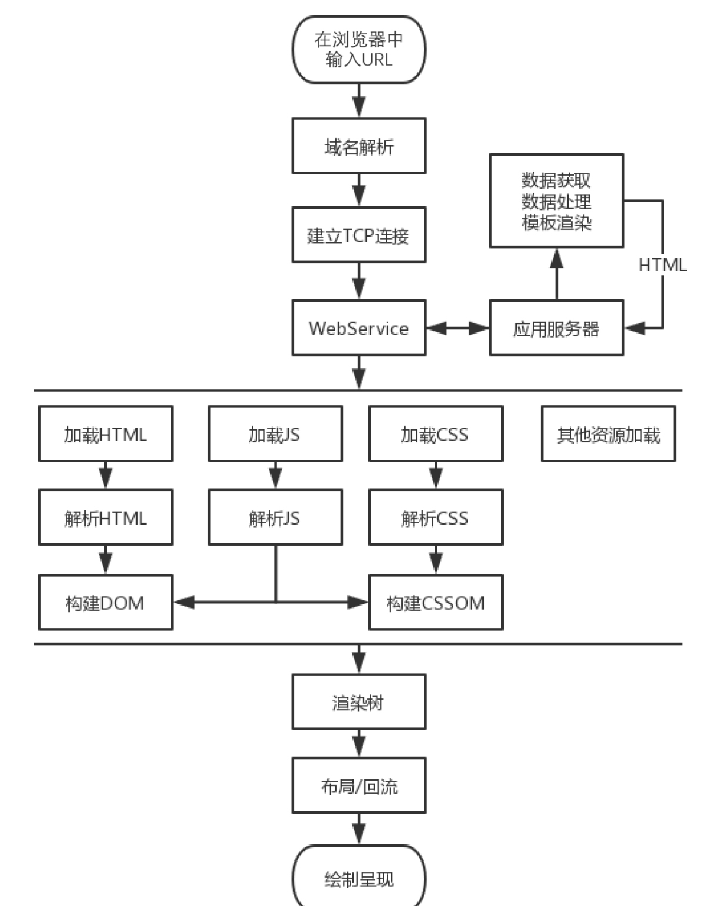


###  优化方案 

经过对网站页面性能的测量及渲染过程的了解，相信你对于糟糕性能体验的原因已经比较清楚了，那么接下来便是优化性能，这也是本课程所要呈现给读者的大部分篇幅。本节先简单扼要地介绍一些优化方面的思路。

+ 从发出请求到收到响应的优化，比如 DNS 查询、HTTP 长连接、HTTP 2、HTTP 压缩、HTTP 缓存等。

+ 关键渲染路径优化，比如是否存在不必要的重绘和回流。
+ 加载过程的优化，比如延迟加载，是否有不需要在首屏展示的非关键信息，占用了页面加载的时间。
+ 资源优化，比如图片、视频等不同的格式类型会有不同的使用场景，在使用的过程中是否恰当。
+ 构建优化，比如压缩合并、基于 webpack 构建优化方案等。
+ ...


## Web 性能指标

我们已经知道性能的重要性，但当我们讨论性能的时候，让一个网页变得跟快，具体是指哪些？

事实上性能是相对的：

+ 对于一个用户而言，一个站点可能速度很快（在具有功能强大的设备的快速网络上），而对于另一用户而言，一个站点可能会较慢（在具有低端设备的慢速网络上）。
+ 两个站点可能会在完全相同的时间内完成加载，但一个站点似乎加载速度会更快（如果它逐步加载内容，而不是等到最后显示任何内容）。
+ 一个网站可能会出现快速加载但后来（在全部或没有）慢慢地响应用户的交互。

所以在讨论性能的时候，精确的、可量化的指标很重要。

但是，仅仅因为一个度量标准是基于客观标准并且可以定量地度量的，并不一定意味着这些度量是有用的。

对于 Web 开发人员来说，如何衡量一个 Web 页面的性能一直是一个难题。

最初，我们使用 Time to First Byte、DomContentLoaded 和 Load 这些衡量文档加载进度的指标，但它们不能直接反应用户视觉体验。

为了能衡量用户视觉体验，Web 标准中定义了一些性能指标，这些性能指标被各大浏览器标准化实现，例如 First Paint 和 First Contentful Paint。还有一些由 Web 孵化器社区组（WICG）提出的性能指标，如 Largest Contentful Paint 、Time to Interactive、First Input Delay、First CPU Idle。另外还有 Google 提出的 First Meaningful Paint、Speed Index，百度提出的 First Screen Paint。

这些指标之间并不是毫无关联，而是在以用户为中心的目标中不断演进出来的，有的已经不再建议使用、有的被各种测试工具实现、有的则可以作为通用标准有各大浏览器提供的可用于在生产环境测量的 API。


### RAIL 性能模型

[RAIL](https://web.dev/rail/) 是 Response, Animation, Idle, 和 Load 的首字母缩写, 是一种由 Google Chrome 团队于 2015 年提出的性能模型,  用于提升浏览器内的用户体验和性能。

RAIL 模型的理念是”以用户为中心，最终目标不是让您的网站在任何特定设备上都能运行很快，而是使用户满意”。

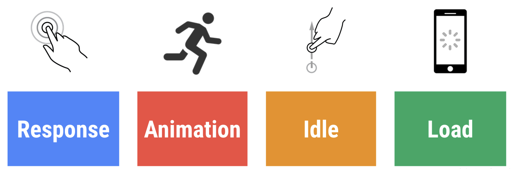

这个名字的由来是四个英文单词的首字母：

+ 响应（Response）：应该尽可能快速的响应用户, 应该在 100ms 以内响应用户输入。
+ 动画（Animation）：在展示动画的时候，每一帧应该以 16ms 进行渲染，这样可以保持动画效果的一致性，并且避免卡顿。
+ 空闲（Idle）：当使用 Javascript 主线程的时候，应该把任务划分到执行时间小于 50ms 的片段中去，这样可以释放线程以进行用户交互。
+ 加载（Load）：应该在小于 1s 的时间内加载完成你的网站，并可以进行用户交互。


根据网络条件和硬件的不同，用户对性能延迟的理解也有所不同。例如，通过快速的Wi-Fi连接在功能强大的台式机上加载站点通常在1秒内完成，用户对此已经习以为常。在3G连接速度较慢的移动设备上加载网站需要花费更多时间，因此移动用户通常更耐心，在移动设备上加载5 s是一个更现实的目标。


这四个单词代表与网站或应用的生命周期相关的四个方面，这些方面会以不同的方式影响整个网站的性能。


我们将用户作为之后性能优化的中心，首先需要了解用户对于延迟的反应。用户感知延迟的时间窗口，如下表所示。

| 延迟         | 用户反映                                                     |
| ------------ | ------------------------------------------------------------ |
| 0 ~ 16ms     | 人眼可以感知每秒 60 帧的动画，即每帧 16 ms，除了浏览器将一帧画面绘制到屏幕上的时间，网站应用大约需要 10ms 来生成一帧 |
| 0 ~ 100ms    | 在该时间范围内响应用户操作，才会是流畅的体验                 |
| 100 ~ 1000ms | 能够感觉到明显的延迟                                         |
| >1s          | 用户的注意力将离开对执行任务的关注                           |
| >10s         | 用户感到失望，可能会放弃任务                                 |


#### 响应

指标：应该尽可能快速的响应用户，应该在 100ms 以内响应用户输入。

网站性能对于响应方面的要求是，在用户感知延迟之前接收到操作的反馈。比如用户进行了文本输入、按钮单击、表单切换及启动动画等操作后，必须在 100ms 内收到反馈，如果超过 100ms 的时间窗口，用户就会感知延迟。

看似很基本的用户操作背后，可能会隐藏着复杂的业务逻辑处理及网络请求与数据计算。对此我们应当谨慎，将较大开销的工作放在后台异步执行，而即便后台处理要数百毫秒才能完成的操作，也应当给用户提供及时的阶段性反馈。

比如在单击按钮向后台发起某项业务处理请求时，首先反馈给用户开始处理的提示，然后在处理完成的回调后反馈完成的提示。

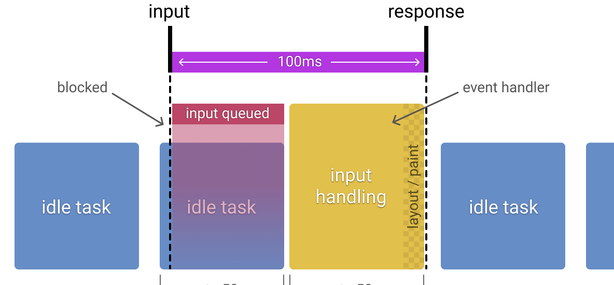


#### 动画

指标：在展示动画的时候，每一帧应该以 10ms 进行渲染，这样可以保持动画效果的一致性，并且避免卡顿。

前端所涉及的动画不仅有炫酷的UI特效，还包括滚动和触摸拖动等交互效果，而这一方面的性能要求就是流畅。众所周知，人眼具有视觉暂留特性，就是当光对视网膜所产生的视觉在光停止作用后，仍能保留一段时间。

研究表明这是由于视神经存在反应速度造成的，其值是 1/24s，即当我们所见的物体移除后，该物体在我们眼中并不会立即消失，而会延续存在 1/24s 的时间。对动画来说，无论动画帧率有多高，最后我们仅能分辨其中的 30 帧，但越高的帧率会带来更好的流畅体验，因此动画要尽力达到 60fps 的帧率。

目前大多数设备的屏幕刷新率为 60 次/秒，那么浏览器渲染动画或页面的每一帧的速率也需要跟设备屏幕的刷新率保持一致。所以根据 60fps 帧率的计算，每一帧画面的生成都需要经过若干步骤，一帧图像的生成预算为 16ms（1000ms / 60 ≈ 16.66ms），除去浏览器绘制新帧的时间，留给执行代码的时间仅 10ms 左右。如果无法符合此预算，帧率将下降，并且内容会在屏幕上抖动。 此现象通常称为卡顿，会对用户体验产生负面影响。关于这个维度的具体优化策略，会在后面优化渲染过程的相关章节中详细介绍。

+ https://googlechrome.github.io/devtools-samples/jank/


#### 空闲 

指标：当使用 Javascript 主线程的时候，应该把任务划分到执行时间小于 50ms 的片段中去，这样可以释放线程以进行用户交互。

要使网站响应迅速、动画流畅，通常都需要较长的处理时间，但以用户为中心来看待性能问题，就会发现并非所有工作都需要在响应和加载阶段完成，我们完全可以利用浏览器的空闲时间处理可延迟的任务，只要让用户感受不到延迟即可。利用空闲时间处理延迟，可减少预加载的数据大小，以保证网站或应用快速完成加载。

为了更加合理地利用浏览器的空闲时间，最好将处理任务按 50ms 为单位分组。这么做就是保证用户在发生操作后的 100ms 内给出响应。


#### 加载

指标：首次加载应该在小于 5s 的时间内加载完成，并可以进行用户交互。对于后续加载，则是建议在2秒内完成。

用户感知要求我们尽量在 5s 内完成页面加载，如果没有完成，用户的注意力就会分散到其他事情上，并对当前处理的任务产生中断感。需要注意的是，这里在 5s 内完成加载并渲染出页面的要求，并非要完成所有页面资源的加载，从用户感知体验的角度来说，只要关键渲染路径完成，用户就会认为全部加载已完成。

对于其他非关键资源的加载，延迟到浏览器空闲时段再进行，是比较常见的渐进式优化策略。比如图片懒加载、代码拆分等优化手段。

关于加载方面具体的优化方案，后续也会分出独立内容进行详细介绍。


## **基于用户体验的性能指标**

[基于用户体验的性能指标](https://web.dev/metrics/)是 Google 在 web.dev 提出的。

### [First Contentful Paint（FCP）](https://web.dev/fcp/) 

FCP（First Contentful Paint）首次内容绘制，浏览器首次绘制来自 DOM 的内容的时间，内容必须是文本、图片（包含背景图）、非白色的 canvas 或 SVG，也包括带有正在加载中的 Web 字体的文本。

**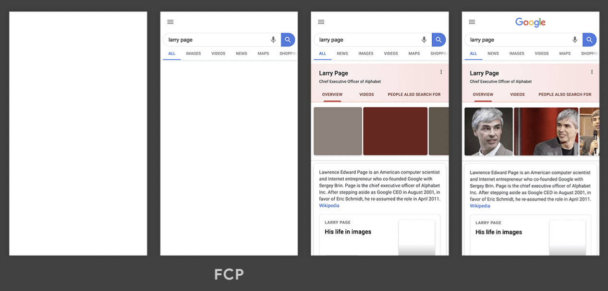**

这是用户第一次开始看到页面内容，但仅仅有内容，并不意味着它是有用的内容（例如 Header、导航栏等），也不意味着有用户要消费的内容。


#### 速度指标 

| FCP 时间（以秒为单位） | 颜色编码     | FCP分数（HTTP存档百分位数） |
| ---------------------- | ------------ | --------------------------- |
| 0–2                    | 绿色（快速） | 75–100                      |
| 2–4                    | 橙色（中等） | 50–74                       |
| 超过4                  | 红色（慢）   | 0–49                        |


#### [优化方案](https://web.dev/fcp/#how-to-improve-fcp) 

+ https://web.dev/fcp/#how-to-improve-fcp


### [Largest Contentful Paint（LCP） ](https://web.dev/lcp/) 

LCP（Largest Contentful Paint）最大内容绘制，可视区域中最大的内容元素呈现到屏幕上的时间，用以估算页面的主要内容对用户可见时间。

LCP 考虑的元素：

+ ` 元素`

+ `<image> 元素内的 <svg> 元素`

+  `<video> 元素（封面图）`

+ 通过 [url()](https://developer.mozilla.org/en-US/docs/Web/CSS/url()) 函数加载背景图片的元素

包含文本节点或其他内联级文本元素子级的[块级](https://developer.mozilla.org/en-US/docs/Web/HTML/Block-level_elements)元素


为了提供良好的用户体验，网站应力争使用 2.5 秒或更短的“最大内容绘画” 。为确保您达到大多数用户的这一目标，衡量移动设备和台式机设备的页面加载量的第75个百分位数是一个很好的衡量标准。


以下是一些示例：

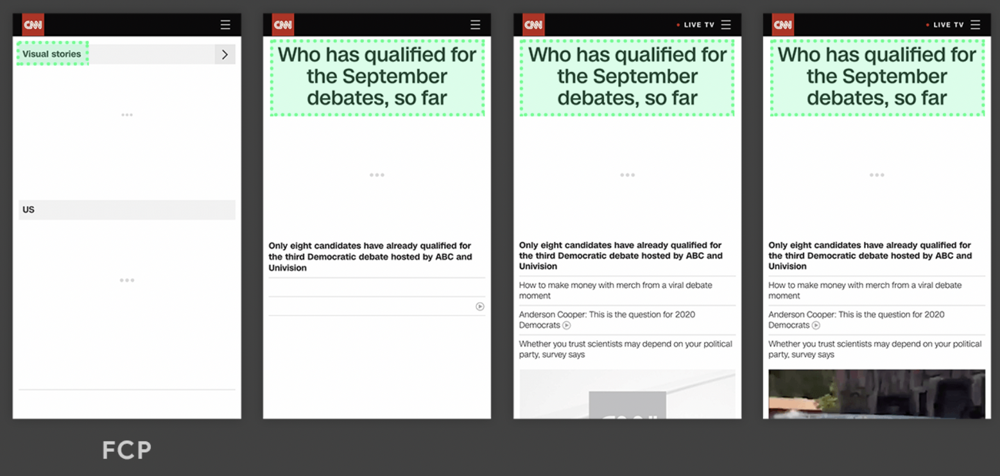

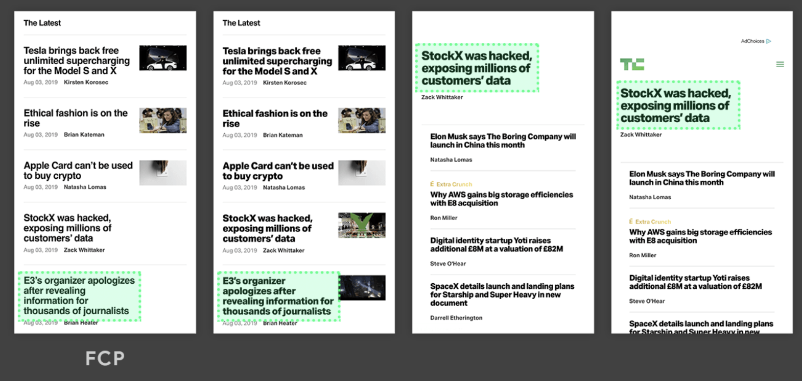

在以上两个时间轴中，最大的元素随内容加载而变化。在第一个示例中，新内容被添加到DOM中，并且更改了最大的元素。在第二个示例中，布局发生更改，以前最大的内容从视口中删除。

通常情况下，延迟加载的内容要比页面上已有的内容大，但不一定是这种情况。接下来的两个示例显示了在页面完全加载之前发生的最大内容绘画。

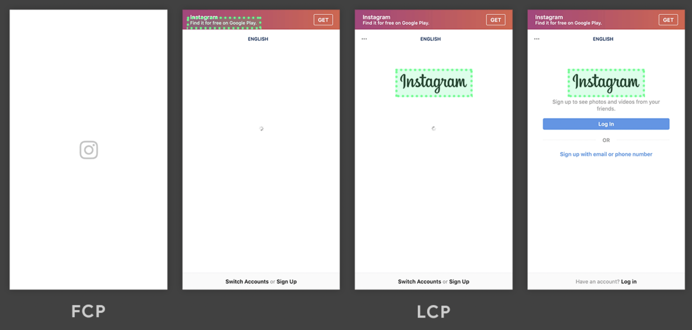

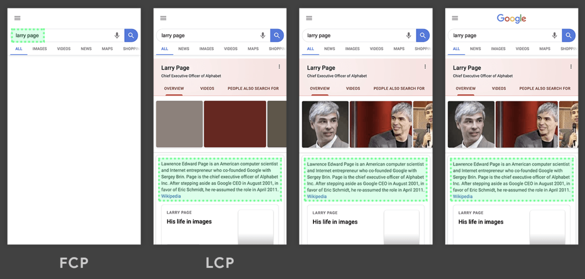

在第一个示例中，Instagram 徽标相对较早地加载，即使逐渐显示其他内容，它仍然是最大的元素。在 Google 搜索结果页面示例中，最大的元素是一段文本，该文本在任何图像或徽标加载完成之前显示。由于所有单个图像均小于此段，因此在整个加载过程中，它始终是最大的元素。

在 Instagram 时间轴的第一帧中，您可能会注意到相机徽标周围没有绿色框。那是因为它是一个 <svg> 元素，并且 <svg> 元素当前不被视为 LCP 候选对象。


#### 速度指标

 

| LCP 时间（以秒为单位） | 颜色编码     |
| ---------------------- | ------------ |
| 0-2.5                  | 绿色（快速） |
| 2.5-4                  | 橙色（中等） |
| 超过4                  | 红色（慢）   |


 

#### 优化方案

+ https://web.dev/optimize-lcp/


### [First Input Delay（FID）](https://web.dev/fid/)

FID（First Input Delay）首次输入延迟，从用户第一次与页面交互（例如单击链接、点击按钮等）到浏览器实际能够响应该交互的时间。

输入延迟是因为浏览器的主线程正忙于做其他事情，所以不能响应用户。发生这种情况的一个常见原因是浏览器正忙于解析和执行应用程序加载的大量计算的 JavaScript。

第一次输入延迟通常发生在第一次内容绘制（FCP）和可持续交互时间（TTI）之间，因为页面已经呈现了一些内容，但还不能可靠地交互。

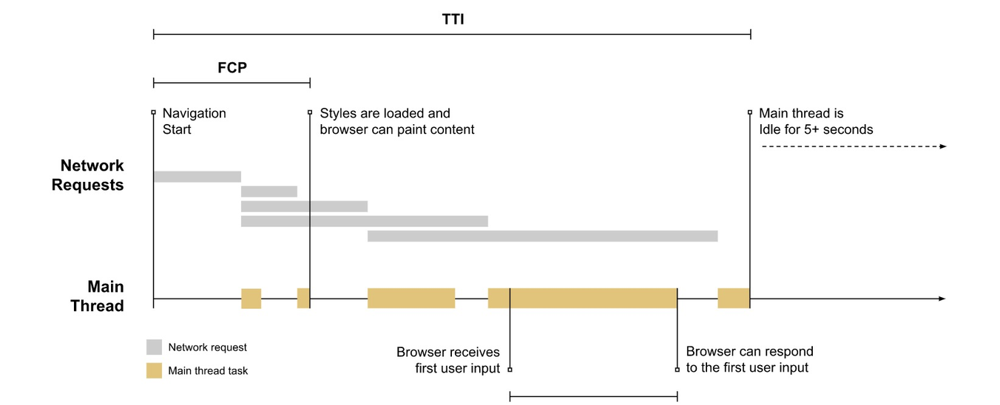

如上图所示，浏览器接收到用户输入操作时，主线程正在忙于执行一个耗时比较长的任务，只有当这个任务执行完成后，浏览器才能响应用户的输入操作。它必须等待的时间就此页面上该用户的 FID 值。

例如，以下所有 HTML 元素都需要在响应用户交互之前等待主线程上正在进行的任务完成：

+ 文本输入框，复选框和单选按钮（<input>，<textarea>）
+ 选择下拉菜单（<select>）
+ 链接（<a>）


#### **速度指标**

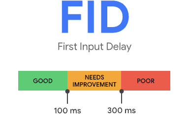

#### 优化方案

+ https://web.dev/fid/#how-to-improve-fid
+ https://web.dev/optimize-fid/


### [Time to Interactive（TTI）](https://web.dev/tti/)

表示网页第一次 **完全达到可交互状态** 的时间点，浏览器已经可以持续性的响应用户的输入。完全达到可交互状态的时间点是在最后一个长任务（Long Task）完成的时间, 并且在随后的 5 秒内网络和主线程是空闲的。
从定义上来看，中文名称叫可持续交互时间或可流畅交互时间更合适。

>  长任务是需要 50 毫秒以上才能完成的任务

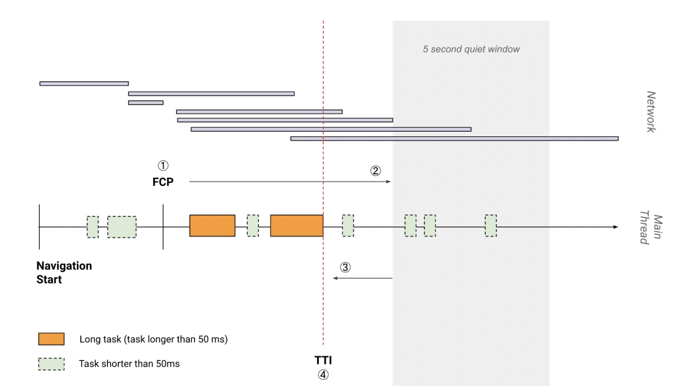


#### **速度指标**

| TTI指标（以秒为单位） | 颜色编码     |
| --------------------- | ------------ |
| 0–3.8                 | 绿色（快速） |
| 3.9–7.3               | 橙色（中等） |
| 7.3以上               | 红色（慢）   |


#### 优化方案

+ https://web.dev/tti/#how-to-improve-tti


### [Total Block Time（TBT）](https://web.dev/tbt/)

Total Block Time（TBT）总阻塞时间，度量了 FCP 和 TTI 之间的总时间，在该时间范围内，主线程被阻塞足够长的时间以防止输入响应。

只要存在长任务，该主线程就会被视为“阻塞”，该任务在主线程上运行超过50毫秒（ms）。我们说主线程“被阻止”是因为浏览器无法中断正在进行的任务。因此，如果用户确实在较长的任务中间与页面进行交互，则浏览器必须等待任务完成才能响应。

如果任务足够长（例如，超过50毫秒的任何时间），则用户很可能会注意到延迟并感觉页面缓慢或过时。

给定的长任务的阻止时间是其持续时间超过50毫秒。页面的总阻塞时间是FCP和TTI之间发生的每个长任务的阻塞时间的总和。

例如，考虑页面加载期间浏览器主线程的下图：

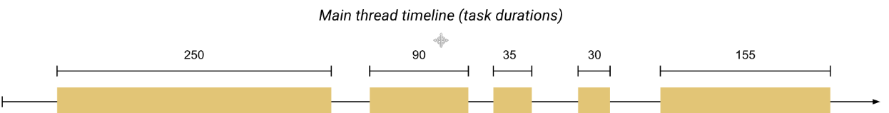

上面的时间轴有五个任务，其中三个是长任务，因为它们的持续时间超过50毫秒。下图显示了每个长任务的阻塞时间：

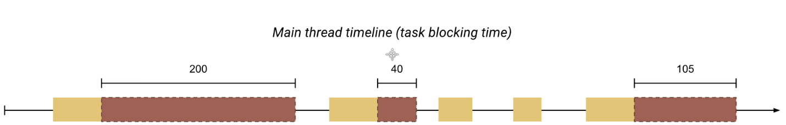

因此，虽然在主线程上运行任务花费的总时间为560毫秒，但只有345毫秒的时间被视为阻塞时间。


 

#### 速度指标 

| TBT时间 （以毫秒为单位） | 颜色编码     |
| ------------------------ | ------------ |
| 0–300                    | 绿色（快速） |
| 300-600                  | 橙色（中等） |
| 超过600                  | 红色（慢）   |


#### 优化方案 

+ https://web.dev/tbt/#how-to-improve-tbt


### [Cumulative Layout Shift（CLS）](https://web.dev/cls/)

Cumulative Layout Shift（CLS）累计布局偏移，CLS 会测量在页面整个生命周期中发生的每个意外的布局移位的所有单独布局移位分数的总和，它是一种保证页面的视觉稳定性从而提升用户体验的指标方案。


您是否曾经在页面上突然发生变化时在没有警告的情况下，文字移动了，并且您失去了位置。甚至更糟：您将要点击一个链接或一个按钮，但是在手指落下的瞬间，链接移动了，您最终单击了其他东西！

页面内容的意外移动通常是由于异步加载资源或将 DOM 元素动态添加到现有内容上方的页面而发生的。罪魁祸首可能是尺寸未知的图像或视频，呈现比其后备更大或更小的字体，或者是动态调整自身大小的第三方广告或小部件。


#### 速度指标

| CLS 时间（以毫秒为单位） | 颜色编码     |
| ------------------------ | ------------ |
| 0–0.1                    | 绿色（快速） |
| 0.1-0.25                 | 橙色（中等） |
| 超过0.25                 | 红色（慢）   |


#### 优化方案 

+ https://web.dev/cls/#how-to-improve-cls

+ https://web.dev/optimize-cls/


### Speed Index 

Speed Index（速度指数）是一个表示页面可视区域中内容的填充速度的指标，可以通过计算页面可见区域内容显示的平均时间来衡量。


#### 测量方式 
捕获浏览器加载页面过程的视频，然后对每 100ms 间隔的页面截图计算页面内容填充的百分比，可以得到这样一个曲线。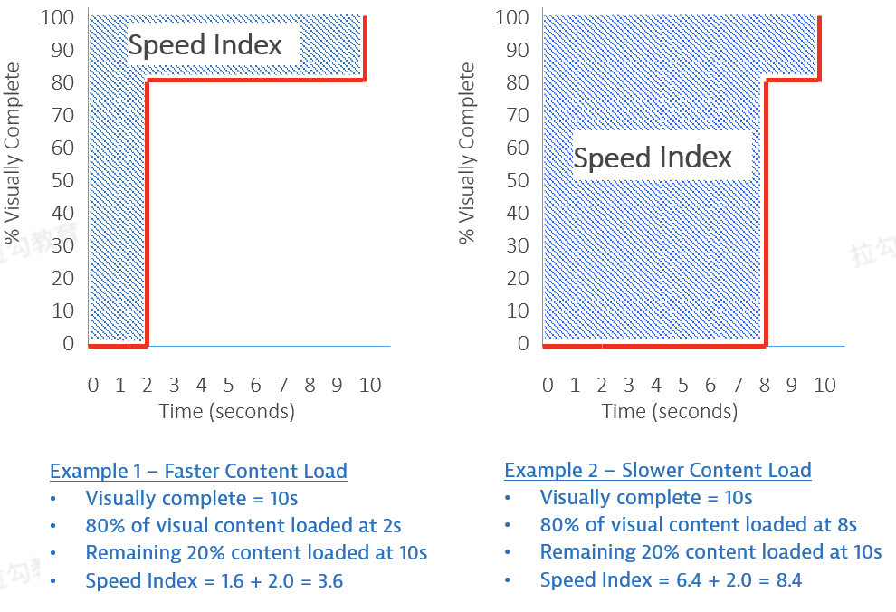

图中的 Example 1 和 Example 2 都是在 10s 时页面填充完成，但 Example 1 在 2s 时就已经填充了 80% 的内容，而 Example 2 在 8s 时才填充 80%。

图中阴影部分的面积（即时间-内容填充百分比曲线以上部分）的大小即可表示可视区域内页面内容的填充速度，面积越小，填充速度越快。


#### 速度指标 

| 速度指数 （以秒为单位） | 颜色编码     | 速度指数得分 |
| ----------------------- | ------------ | ------------ |
| 0–4.3                   | 绿色（快速） | 75–100       |
| 4.4–5.8                 | 橙色（中等） | 50–74        |
| 5.8以上                 | 红色（慢）   | 0–49         |


#### 优化方案 

+ https://web.dev/speed-index/#how-to-improve-your-speed-index-score


## Web Vitals

Google 开发了许多实用指标和工具，帮助衡量用户体验和质量，从而发掘优化点。一项名为 Web Vitals 的计划降低了学习成本，为网站体验提供了一组统一的质量衡量指标 — Core Web Vitals，其中包括加载体验、交互性和页面内容的视觉稳定性。

有很多方法可以优化网站的用户体验。若能预先了解最佳的优化衡量方法，可以大大节省时间和成本。

Google 在 2020 年 5 月 5 日提出了新的用户体验量化方式 Web Vitals 来衡量网站的用户体验，并将这些衡量结果用作其排名算法的一部分。为了更好的理解这些内容，让我们来看看这些重要指标是什么。


### Core Web Vitals 与 Web Vitals 

什么是 Web Vitals，Google 给出的定义是 一个良好网站的基本指标（Essential metrics for a healthy site），过去要衡量一个网站的好坏，需要使用的指标太多了，Web Vitals 可以简化指标的学习曲线，只需聚焦于 Web Vitals 指标的表现即可。

在这些 Web Vitals 中，Google 确定了三个主要衡量指标，即在所有类型的网站中通用的 Core Web Vitals：

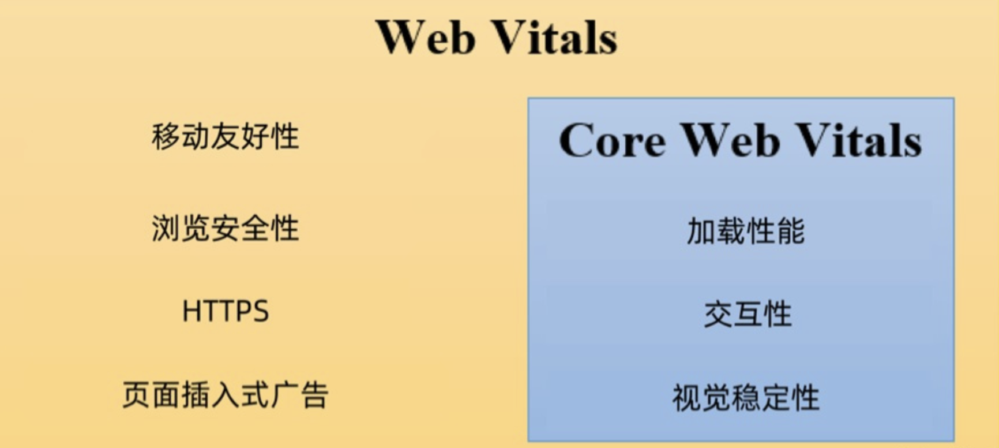

> Core Web Vitals 是应用于所有 Web 页面的 Web Vitals 的子集，是其最重要的核心。


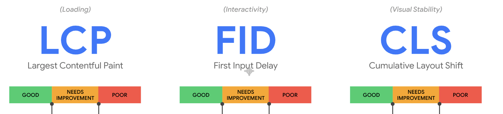

+ 加载性能（LCP） — 显示最大内容元素所需时间
+ 交互性（FID） — 首次输入延迟时间
+ 视觉稳定性（CLS） — 累积布局配置偏移

这三个指标已经经过了一段时间的验证，如 LCP 在 WICG 已经孵化至少 1 年以上，FID 在 Google Chrome Labs 上已经实施 2 年以上，LCP 和 CLS（相关 Layout Instability API）已于今年入 W3C 草拟标准。


### **测量 Web Vitals**

+ 性能测试工具，比如 Lighthouse
+ 使用 [web-vitals](https://github.com/GoogleChrome/web-vitals) 库
+ 使用浏览器插件 [Web Vitals](https://chrome.google.com/webstore/detail/web-vitals/ahfhijdlegdabablpippeagghigmibma)


### **优化 Web Vitals**

+ [Optimize Largest Contentful Paint](https://web.dev/optimize-lcp/)
+ [Optimize First Input Delay](https://web.dev/optimize-fid/)
+ [Optimize Cumulative Layout Shift](https://web.dev/optimize-cls/)


### 参考链接

+ https://web.dev/vitals/
+ https://juejin.cn/post/6844904168591736846
+ https://chrome.google.com/webstore/detail/web-vitals/ahfhijdlegdabablpippeagghigmibma/related
+ https://www.uisdc.com/web-vitals


## **Web 性能测试**

作为网站应用的开发者或维护者，我们需要时常关注网站当前的健康状况，譬如在主流程运行正常的情况下，各方面性能体验是否满足期望，是否存在改进与提升的空间，如何进行快速且准确的问题定位等，为了满足这些诉求，我们需要进行全面且客观的性能检测。


**性能检测的认知**

性能检测作为性能优化过程中的一环，它的目的通常是给后续优化工作提供指导方向、参考基线及前后对比的依据。性能检测并不是一次性执行结束后就完成的工作，它会在检测、记录和改进的迭代过程中不断重复，来协助网站的性能优化不断接近期望的效果。

在展开介绍性能检测的方法和工具之前，我们首先需要破除有关性能的一些错误认知与理解偏差。

（1）不要通过单一指标就能衡量网站的性能体验。这是完全站在用户感知的角度上产生的认知，它只会有主观上的好与差，很难给出切实可行的优化建议。因此我们建议应当从更多维度、更多具体的指标角度来考量网站应用的性能表现，比如页面的首屏渲染时间，不同类型资源的加载次数与速度，缓存的命中率等。

（2）不要一次检测就能得到网站性能表现的客观结果。网站应用的实际性能表现通常是高度可变的，因为它会受到许多因素的影响，比如用户使用的设备状况、当前网络的连接速度等，因此若想通过性能检测来得到较为客观的优化指导，就不能仅依赖一次检测的数据，而需要在不同环境下收集尽量多的数据，然后以此来进行性能分析。

（3）不要仅在开发环境中模拟进行性能检测。在开发环境中模拟进行的性能检测具有许多优势：比如可以很方便地制定当前检测的设备状况与网络速度，可以对检测结果进行重复调试，但因其所能覆盖的场景有限，会很容易陷入“幸存者偏差”，即所发现的问题可能并非实际的性能瓶颈。

据此可知，我们若想通过检测来进行有效的性能优化改进，就需要从尽可能多的角度对网站性能表现进行考量，同时保证检测环境的客观多样，能够让分析得出的结果更加贴近真实的性能瓶颈，这无疑会花费大量的时间与精力，所以在进行性能优化之前我们还需要考虑所能投入的优化成本。


**常见的检测工具 **

+ Lighthouse
+ WebPageTest
+ 浏览器 DevTools
  + 浏览器任务管理器
  + Network 面板
  + Coverage 面板
  + Memory 面板
  + Performance 面板
  + Performance monitor 面板

+ 性能监控 API
+ 持续的性能监控方案


### **使用灯塔 Lighthouse 测试性能**

Lighthouse 直译过来是“灯塔”的意思，它是由 Google 开发并开源的一个 Web 性能测试工具。该性能检测工具以此命名也蕴涵了相同的含义，即通过监控和检测网站应用的各方面性能表现，来为开发者提供优化用户体验和网站性能的指导建议。


#### 准备

参考：https://developer.chrome.com/docs/devtools/speed/get-started/。


#### 使用方式

Lighthouse 提供了多种使用方式。

+ [在 Chrome DevTools 中使用 Lighthouse](https://github.com/GoogleChrome/lighthouse#using-lighthouse-in-chrome-devtools)
+ [使用 Chrome 扩展](https://github.com/GoogleChrome/lighthouse#using-the-chrome-extension)
+ [使用 Node CLI 命令行工具](https://github.com/GoogleChrome/lighthouse#using-the-node-cli)
+ [使用 Node 包](https://github.com/GoogleChrome/lighthouse#using-the-node-module)


#### 性能报告

关于性能报告部分的检测结果，Lighthouse 给出的信息包括：检测得分、性能指标、优化建议、诊断结果及已通过的性能，下面来分别进行介绍。


##### **检测得分**

经过检测，Lighthouse 会对上述五个维度给出一个 0～100 的评估得分，如果没有分数或得分为 0，则很有可能是检测过程发生了错误，比如网络连接状况异常等；如果得分能达到 90 分以上，则说明网站应用在该方面的评估表现符合最佳实践，如下图所示。

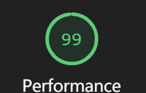

于如何得到这个评估得分，Lighthouse首先会获得关于评估指标的原始性能数据，然后根据指标权重进行加权计算，最后以其数据库中大量的评估结果进行对数正态分布的映射并计算最终得分。

+ https://googlechrome.github.io/lighthouse/scorecalc
+ https://web.dev/performance-scoring/

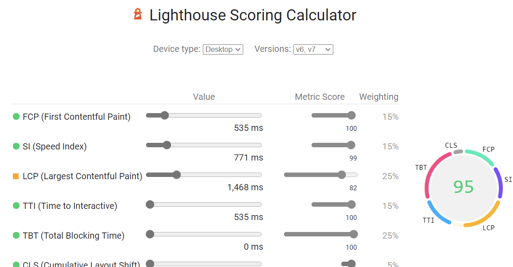


##### 性能指标

关于性能指标有以下六个关键的数据。

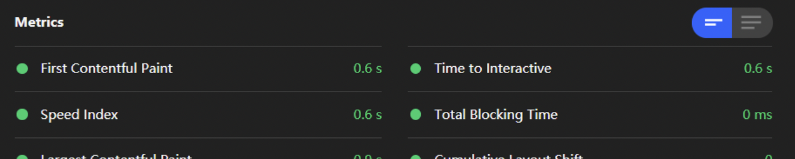

这六个指标我们已经在[基于用户体验的性能指标](https://www.yuque.com/go/doc/44095887)中详细说过了，这里不再赘述。

这6种不同的指标数据需要通过加权计算，才能得到关于性能的最终评分，所加的权值越大表示对应指标对性能的影响就越大，如下图所示，列出了目前 Lighthouse 的权重情况。

| Audit                                                        | Weight |
| ------------------------------------------------------------ | ------ |
| [First Contentful Paint](https://web.dev/first-contentful-paint/) | 15%    |
| [Speed Index](https://web.dev/speed-index/)                  | 15%    |
| [Largest Contentful Paint](https://web.dev/lcp/)             | 25%    |
| [Time to Interactive](https://web.dev/interactive/)          | 15%    |
| [Total Blocking Time](https://web.dev/lighthouse-total-blocking-time/) | 25%    |
| [Cumulative Layout Shift](https://web.dev/cls/)              | 5%     |

该权重系统还在不断优化过程中，虽然 Lighthouse 对于其中个别指标给予了较大的权重，也就意味着对该指标的优化能够带来更显著的性能评分提升，但这里还要建议在优化的过程中切勿只关注单个指标的优化，而要从整体性能的提升上来考虑优化策略。


##### 优化建议

为了方便开发者更快地进行性能优化，Lighthouse 在给出关键性能指标评分的同时，还提供了一些切实可行的优化建议，如下图所示为检测报告中的优化建议。

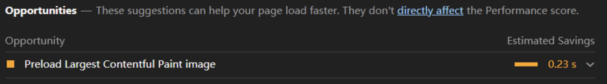

这些建议按照优化后预计能带来的提升效果从高到低进行排列，每一项展开又会有更加详细的优化指导建议，从上到下依次包括以下内容。


（1）**移除阻塞渲染的资源**，部分JavaScript脚本文件和样式表文件可能会阻塞系统对网站页面的首次渲染，建议可将其以内嵌的方式进行引用，并考虑延迟加载。报告会将涉及需要优化的资源文件排列在下面，每个文件还包括尺寸大小信息和优化后预计提升首屏渲染时间的效果，据此可安排资源文件优化的优先级。


（2）预连接所要请求的源，提前建立与所要访问资源之间的网络连接，或者加快域名的解析速度都能有效地提高页面的访问性能。这里给出了两种方案：一种是设置〈link rel="preconnect"〉的预连接，另一种是设置〈link rel="dns-prefetch"〉的DNS预解析，前面章节对这两种方案都有过讨论，此处就不再赘述了。


（3）**降低服务器端响应时间**，通常引起服务器响应缓慢的原因有很多，因此也有许多改进方法：比如升级服务器硬件以拥有更多的内存或CPU，优化服务器应用程序逻辑以更快地构建出所需的页面或资源，以及优化服务器查询数据库等，不要以为这些可能并非属于前端工程师的工作范围就不去关注，通常node服务器转发层就需要前端工程师进行相应的优化。


（4）适当调整图片大小，使用大小合适的图片可节省网络带宽并缩短加载用时，此处的优化建议通常对于本应使用较小尺寸的图片就可满足需求，但却使用了高分辨率的大图，对此进行适当压缩即可。


（5）**移除未使用的CSS**，这部分列出了未使用但却被引入的 CSS 文件列表，可以将其删除来降低对网络带宽的消耗，若需要对资源文件的内部代码使用率进行进一步精简删除，则可以使用 Chrome 开发者工具的Coverage面板进行分析。


##### 诊断结果

这部分 Lighthouse 分别从影响网站页面性能的多个主要维度，进行详细检测和分析得到的一些数据，下面我们来对其进行介绍。

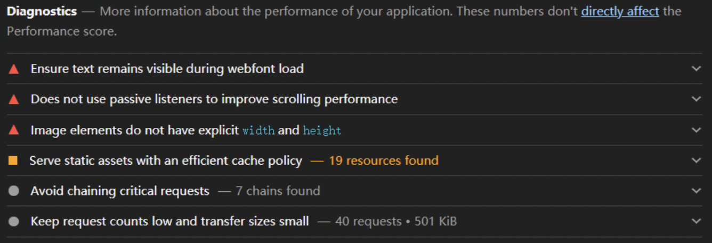

（1）**对静态资源文件使用高效的缓存策略**，这里列出了所有静态资源的文件大小及缓存过期时间，开发者可以根据具体情况进行缓存策略的调整，比如延迟一些静态资源的缓存期限来加快二次访问时的速度。

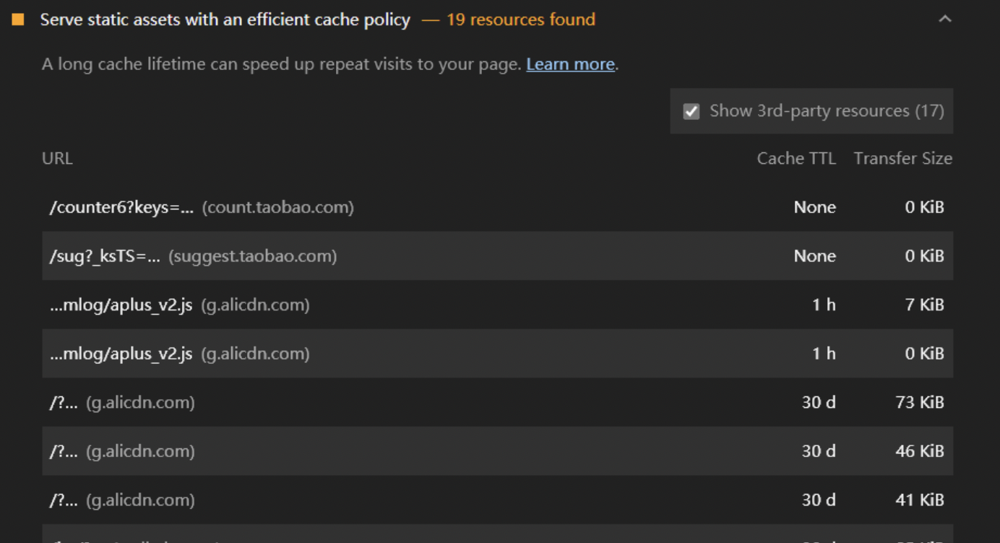

（2）**减少主线程的工作**，浏览器渲染进程的主线程通常要处理大量的工作：如解析 HTML 构建 DOM，解析 CSS 样式表文件并应用指定的样式，以及解析和执行 JavaScript 文件，同时还需要处理交互事件，因此渲染进程的主线程过忙很容易导致用户响应延迟的不良体验，Lighthouse 给我们提供了这一环节网站页面主线程对各个任务的执行耗时，让开发者可针对异常处理过程进行有目标的优化，如下图所示。

（3）降低JavaScript脚本执行时间，前端项目的逻辑基本都是依托于JavaScript执行的，所以JavaScript执行效率与耗时也会对页面性能产生不小的影响，通过对这个维度的检测可以发现执行耗时过长的JavaScript文件，进而针对性的优化JavaScript解析、编译和执行的耗时，如图所示。

（4）**避免存在较大尺寸网络资源的请求**，因为如果一个资源文件尺寸较大，那么浏览器就需要等待其完全加载好后，才能进行后续的渲染操作，这就意味着单个文件的尺寸越大其阻塞渲染流程的时间就可能越长，并且网络传输过程中存在丢包的风险，一旦大文件传输失败，重新传输的成本也会很高，所以应当尽量将较大尺寸的资源进行优化，通常一个尺寸较大的代码文件可以通过构建工具打包成多个尺寸较小的代码包；对于图片文件如非必要还是建议在符合视觉要求的前提下尽量进行压缩。可以看出该检测维度列出的大尺寸资源文件，基本都是图片文件，如图所示。

（5）**缩短请求深度**，浏览器通常会对同一域名下的并发请求进行限制，超过限制的请求会被暂时挂起，如果请求链的深度过长，则需要加载资源的总尺寸也会越大，这都会对页面渲染性能造成很大影响。因此建议在进行性能检测时，对该维度进行关注和及时优化，如图所示。


##### 已通过的性能

这部分列出的优化项为该网站已通过的性能审核项，如图所示，下面对其中重要的几项进行介绍和解读。

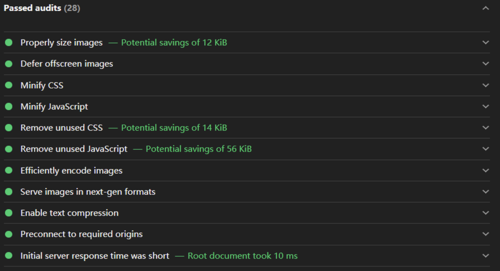

（1）延迟加载首屏视窗外的图片，该审核项的优化原理在有关图像优化章节有过详细的介绍，对首屏关键资源加载完毕后，延迟首屏外或处于隐藏状态的图片加载能够有效缩短用户可交互前的等待时间，提升用户访问体验。
（2）压缩 CSS 文件，可降低网络负载规模。
（3）压缩 JavaScript 文件，可降低网络负载规模。
（4）对图片文件采用高效的编码方式，经过编码优化的图片文件，不但其加载速度会更快，而且需要传输的数据规模也会越小，详情可参考图像优化章节的内容。
（5）采用新一代的图片文件格式，WebP、JPEG XR、JPEG 2000等较新的图片文件格式通常比传统的PNG或JPEG有更好的压缩效果，能够获得更快的下载速度和更少的流量消耗，但使用的同时还需要注意对新格式的兼容性处理。
（6）开启文本压缩，对于文本资源，先压缩再提供能够最大限度地减少网络传输的总字节数，常用的压缩方式有 gzip、 deflate 和 brotli，至少采用其中一种即可。
（7）避免多次页面重定向，过多的重定向会在网页加载前造成延迟。
（8）预加载关键请求，通过 <link rel="preload"> 来预先获取在网页加载后期需要请求的资源，这主要是为了充分利用网站运行的间歇期。
（9）使用视频格式提供动画内容，建议通过 WebM 或 MPEG4 提供动画，来取代网站页面中大型 GIF 的动画。
（10）避免 DOM 的规模过大，如果 DOM 规模过大，则可能会导致消耗大量的内存空间、过长的样式计算耗时及较高的页面布局重排代价。Lighthouse 给出的参考建议是，页面包含的 DOM 元素最好少于1500个，树的深度尽量控制不要超过32层。
（11）确保在网页字体加载期间文本内容可见，使用 CSS 的 font-display 功能，来让网站页面中的文本在字体加载期间始终可见。


### **使用 Chrome DevTools 测试性能**

#### 浏览器任务管理器

通过 Chrome 任务管理器我们可以查看当前 Chrome 浏览器中，所有进程关于 GPU、网络和内存空间的使用情况，这些进程包括当前打开的各个页签，安装的各种扩展插件，以及 GPU、网络、渲染等浏览器的默认进程，通过监控这些数据，我们可以在有异于其他进程的大幅开销出现时，去定位到可能存在内存泄漏或网络资源加载异常的问题进程。

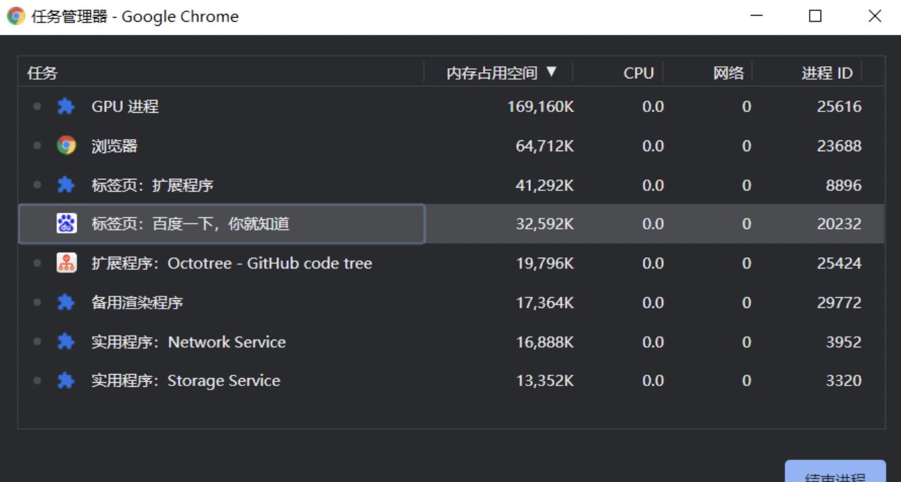


#### Network 网络分析

Network 面板是 Chrome 开发者工具中一个经常会被用到的工具面板，通过它可以查看到网站所有资源的请求情况，包括加载时间、尺寸大小、优先级设置及 HTTP 缓存触发情况等信息，从而帮助我们发现可能由于未进行有效压缩而导致资源尺寸过大的问题，或者未合理配置缓存策略导致二次请求加载时间过长的问题等。

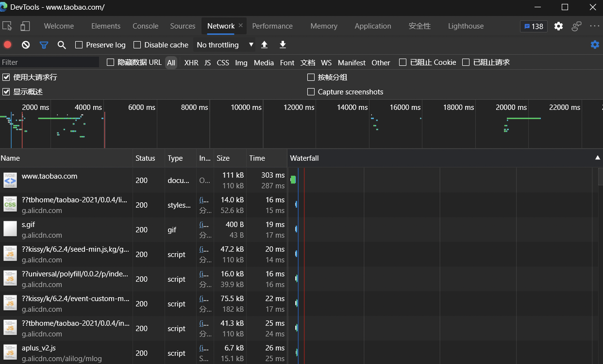

参考：https://developer.chrome.com/docs/devtools/network/。


#### **面板设置**

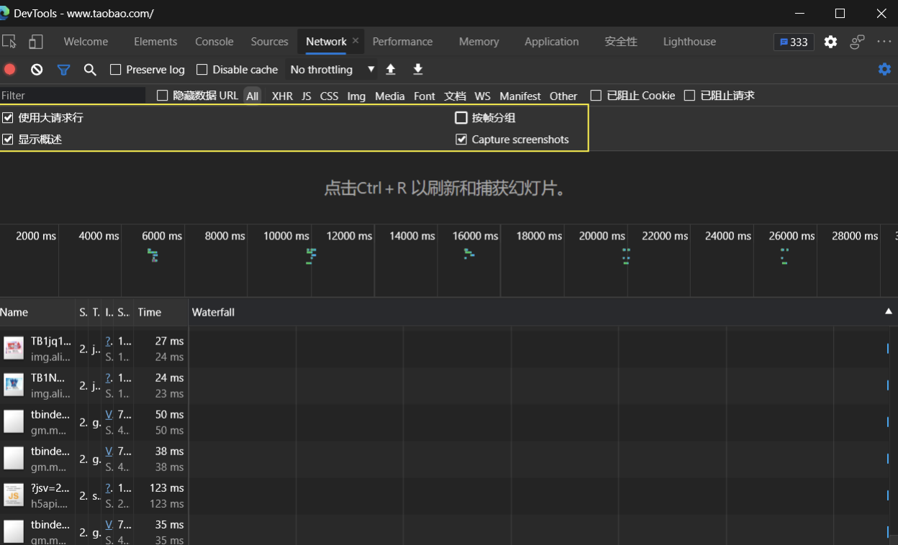


#### **查看网络请求信息**

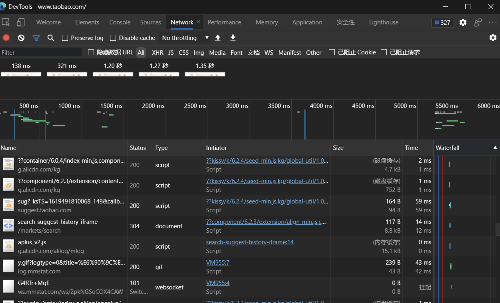


#### **缓存测试**

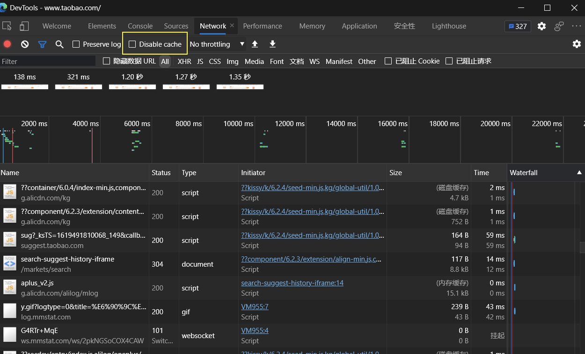


#### **网络吞吐测试**

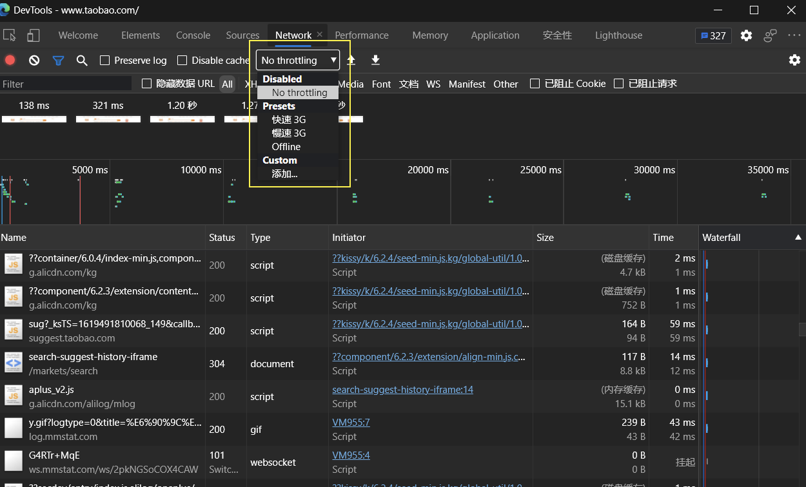


####  网络请求阻止 

+ 打开方式：Ctrl+ Shift + P -> Show Network Request Blocking
+ 启用网络请求阻止
+ 添加阻止规则

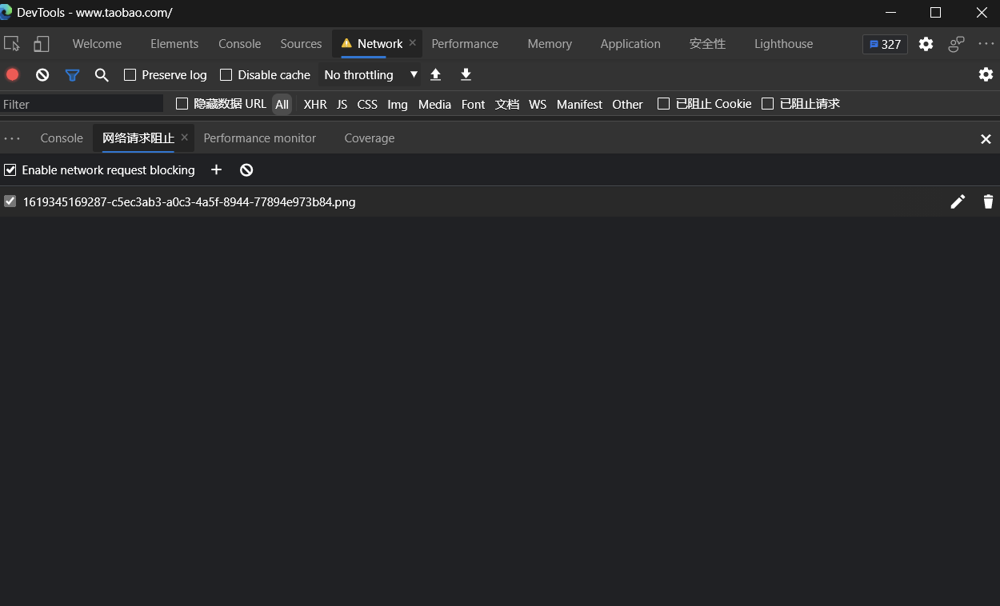


#### Coverage 面板

**我们可以通过 Coverage 面板监控并统计出网站应用运行过程中代码执行的覆盖率情况**。该面板统计的对象是 JavaScript 脚本文件与 CSS 样式表文件，统计结果主要包括：每个文件的字节大小、执行过程中已覆盖的代码字节数，以及可视化的覆盖率条形图。

根据执行结果我们能够发现，在启动录制的过程中到底有哪些尺寸较大的代码文件执行覆盖率较低，这就意味着有些代码文件中可能存在较多的无用代码，更准确地说是暂时没用到的代码。这些信息对性能优化来说是非常有用的，开发者可以据此将执行覆盖率较低的代码文件进行拆分，将首屏渲染阶段暂时不会执行到的代码部分单独打包，仅在需要的时候再去加载。

同时对规模较大且迭代周期较长的项目来说，工程代码中会包含一些永远都不会执行到的代码，而使用 webpack 的 Tree Shaking 仅能根据 export 进行无关联引用，那么此时 Coverage 面板就为优化提供了一条可以尝试的途径。

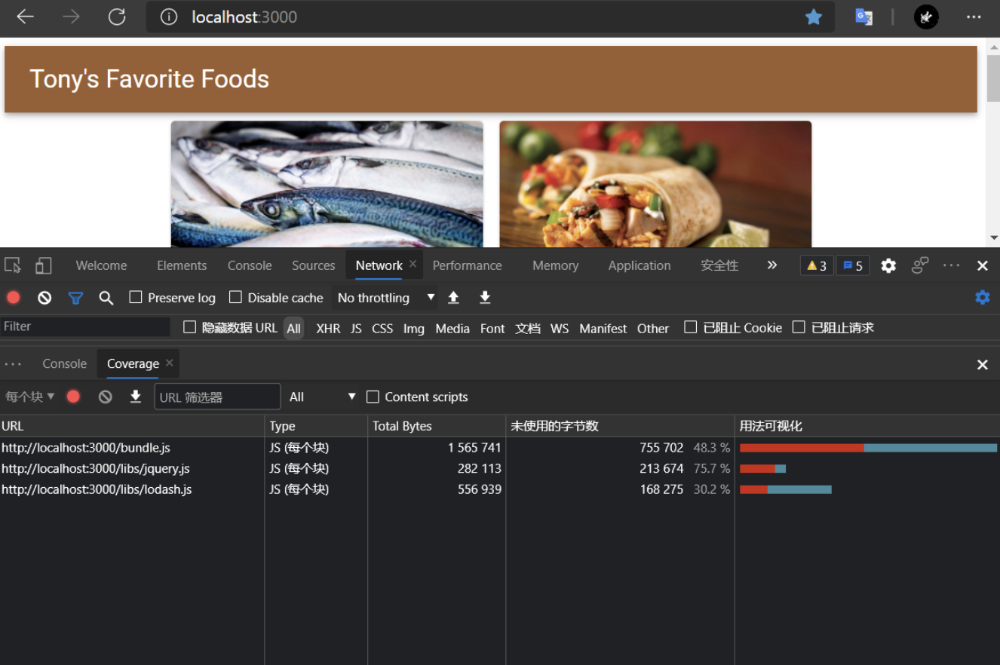


#### Memory 面板

前端主要使用 JavaScript 代码来处理业务逻辑，所以保证代码在执行过程中内存的良性开销对用户的性能体验来说尤为重要，如果出现内存泄漏，那么就可能会带来网站应用卡顿或崩溃的后果。

为了更细致和准确地监控网站应用当前的内存使用情况，Chrome 浏览器开发者工具提供了 Memory 面板，通过它可以快速生成当前的堆内存快照，或者查看内存随时间的变化情况。据此我们可以查看并发现可能出现内存泄漏的环节，下图是使用 Memory 面板查看堆内存使用快照的情况。

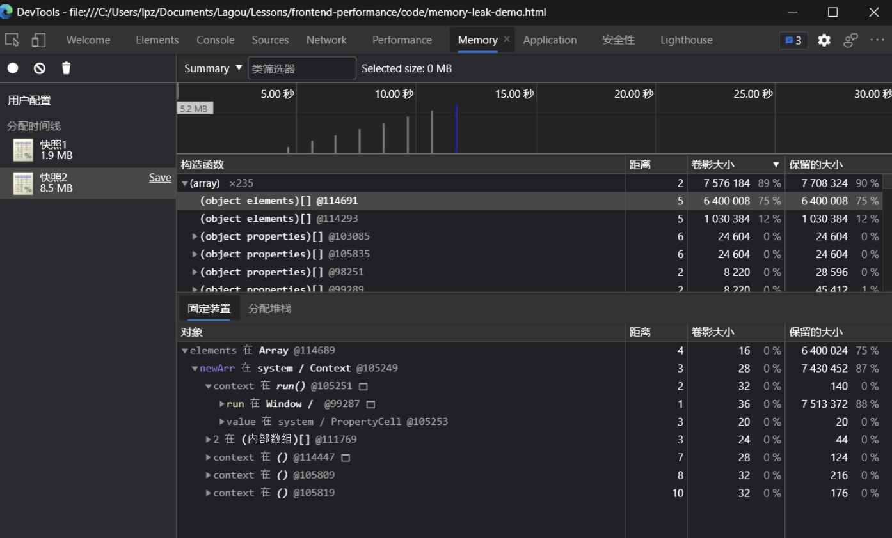


####  Performance 面板 

使用 Performance 面板主要对网站应用的运行时性能表现进行检测与分析，其可检测的内容不仅包括页面的每秒帧数（FPS）、CPU 的消耗情况和各种请求的时间花费，还能查看页面在前 1ms 与后 1ms 之间网络任务的执行情况等内容。


##### 使用方式 

使用方式非常简单，只需要在进行性能检测的网站页面中打开 Chrome 开发者工具的 Performance 面板即可，这里建议在Chrome 浏览器的匿名模式下使用该工具，因为在匿名模式下不会受到既有缓存或其他插件程序等因素的影响，能够给性能检测提供一个相对干净的运行环境。****

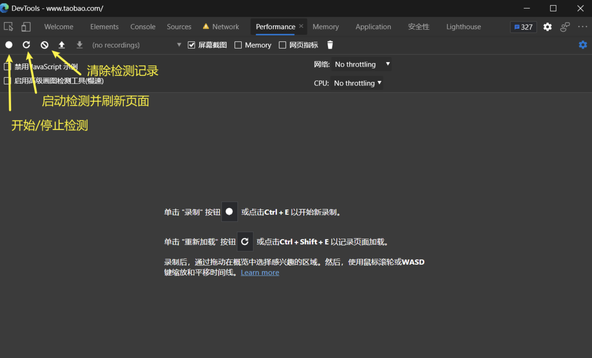

Performance 面板中常用的是图中标出的三个按钮。通常当我们需要检测一段时间内的性能状况时，可单击两次“启动/停止检测”按钮来设置起止时间点，当单击第二次按钮停止检测后，相应的检测信息便出现在控制面板下方的区域。

图中的“启动检测并刷新页面”按钮用来检测页面刷新过程中的性能表现，单击它会首先清空目前已有的检测记录，然后启动检测刷新页面，当页面全部加载完成后自动停止检测。

打开测试示例：https://googlechrome.github.io/devtools-samples/jank/。


##### **面板信息** 

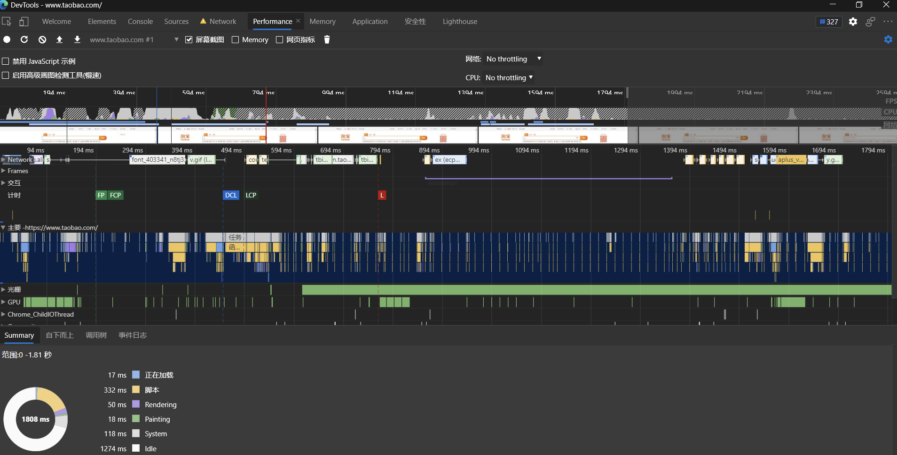

Performance 的评估结果页，其中的面板信息大致可分为四大类：控制面板、概览面板、线程面板及统计面板，下面进行逐一介绍。


###### **控制面板**

（1）Screenshots：表示是否截取每一帧的屏幕截图，默认会勾选，并且在概览面板中展示随时间变化的每帧截屏画面，如果取消勾选，则不会在概览面板中展示这部分内容。
（2）Memory：表示是否记录内存消耗，默认不会勾选，如果勾选则会在线程面板与统计面板之间展示出各种类型资源的内存消耗曲线。

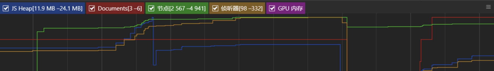（3)网页指标：表示是否展示性能指标信息，默认不会勾选，如果勾选则会在网络和Frames之间展示出核心指标的节点状态。

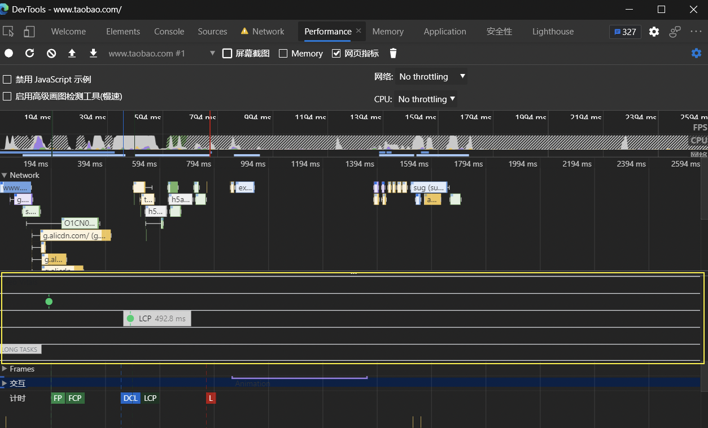

（4）Disable javaScript samples：如果勾选则表示关闭 JavaScript 示例，减少在手机端运行时的开销，若要模拟手机端的运行环境时则需要勾选。

（5）Enable advanced paint instrumentation（slow）：如果选中则表示开启加速渲染工具，用来记录渲染事件的相关细节。因为该功能比较消耗性能，所以开启后重新生成检测报告的速度会变慢。

（6）Network：在性能检测时，用以切换模拟网络环境。

（7）CPU：限制 CPU 处理速度，主要用于模拟低速 CPU 运行时的性能。


###### 概览面板

在概览面板的时间轴上，可以通过选择一个起始时间点，然后按住鼠标左键滑动选择面板中的局部范围，来进行更小范围内的性能观察。

这部分可观察的性能信息包括：FPS、CPU 开销和网络请求时间。对每秒帧数而言，尽量保持在60FPS才能让动画有比较流畅的视觉体验。

对CPU开销而言，不仅可以在整个检测时间轴上以曲线的形式观察CPU处理任务所花费时间的变化情况，同时还可以在统计面板中查看当前选中时间区域里各个任务花费时间的占比，其中占比较大的部分就有可能存在性能问题，可以进一步检测与分析。

对网络请求时间而言，概览面板提供的信息可能不够清晰，这里建议在线程面板的Network部分中具体查看，比如时间轴上每个请求的耗时及起止时间点都会更加清楚，从而方便开发者发现响应过长的网络请求并进行优化。

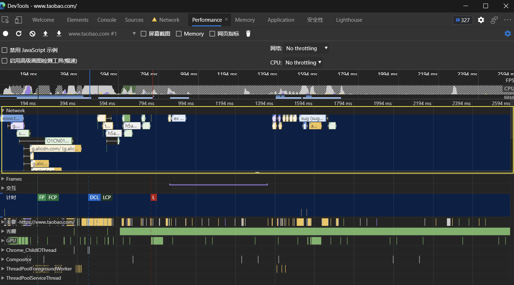


###### 线程面板

这部分最主要的信息即为主线程执行过程的火焰图，主线程在解析 HTML 和 CSS、页面绘制及执行 JavaScript 的过程中，每个事件调用堆栈和耗时的情况都会反映在这张图上，其中每一个长条都代表了一个事件，将鼠标悬浮其上的时候可以查看到相应事件的执行耗时与事件名。

这个火焰图的横轴表示执行时间，纵轴表示调用栈的情况，上面的事件会调用下面的事件，越往下事件数量越少，所以火焰图是倒立的形式。

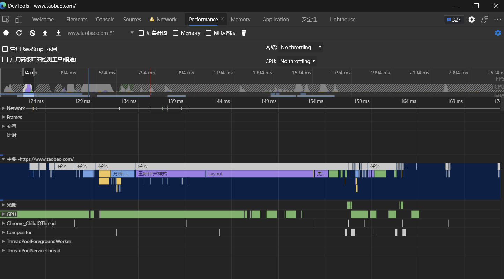

火焰图中的事件会以不同颜色进行标注，常见的事件类型有以下几种：HTML 解析、JavaScript 事件（例如鼠标单击、滚动等）、页面布局更改、元素样式重新计算及页面图层的绘制。了解并熟知这些事件的执行情况，有助于发现潜在的性能问题。


###### 统计面板

统计面板会根据在概览面板中选择时间区域的不同，绘制出不同类型任务执行耗时的可视化图标。统计面板中包含四个页签。

其中 Summary 页签中会展示各类任务事件耗时的环形图；

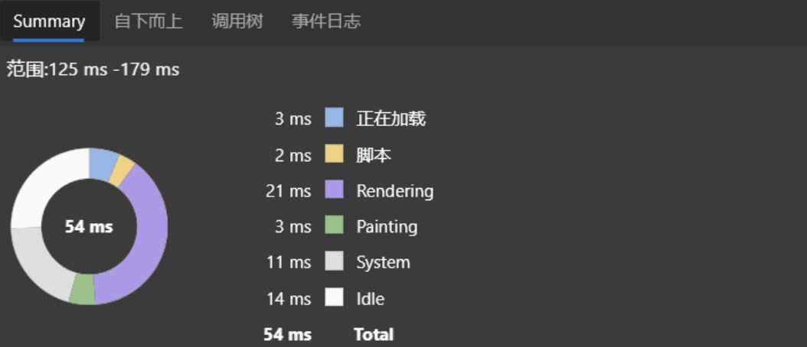

Bottom-Up 页签中可以查看各个事件耗费时间的排序列表，列表会包含两个维度：去除子事件后该事件本身的耗时和包含子事件从开始到结束的总耗时。

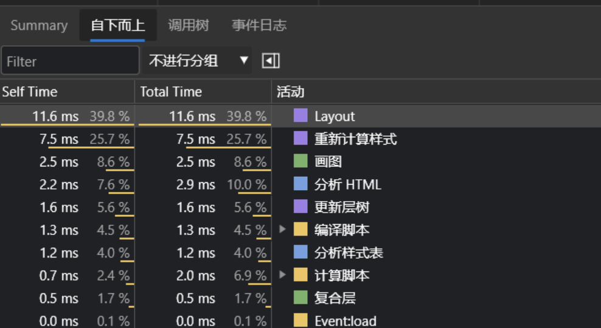

Call Tree页签中可以查看全部或指定火焰图中某个事件的调用栈，如下图所示。

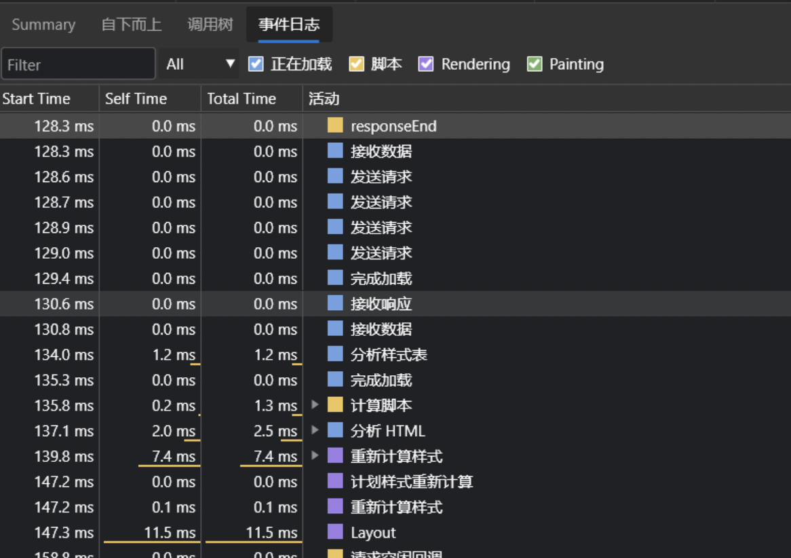


##### **保存测试记录**

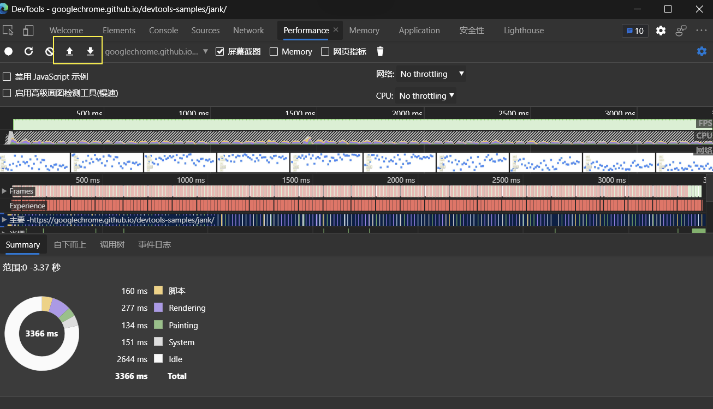


#### FPS 计数器

另一个非常方便的工具是 FPS 计数，可在页面运行时提供对 FPS 的实时估计。

1、选择 Control+Shift+P (Windows、Linux) 或 Command+Shift+P (macOS) 打开命令菜单。
2、在命令菜单中开始键入Rendering，然后选择显示渲染.
3、在呈现工具 中，打开 FPS 指示器。 新的叠加层将显示在视线的右上角。

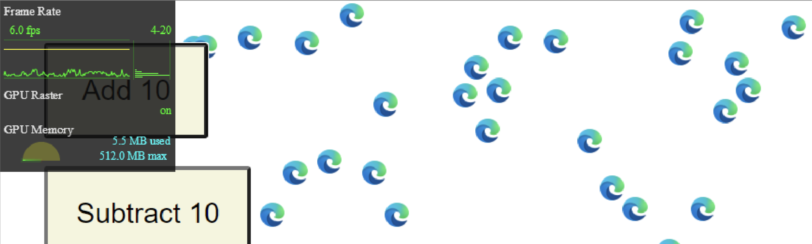

4、关闭 FPS 计数并选择 Escape 来关闭呈现工具。 


#### **Performance monitor**

虽然使用 Performance 面板来进行检测能够得到较为全面的性能数据，但依然存在两个使用上的问题，即面板信息不够直观和数据的实时性不够强。

为了弥补这两方面的不足，Chrome 从 64 版本开始便在开发者工具中引入了 Performance monitor 面板，通过它让我们可以实时监控网站应用运行过程中，诸如 CPU 占用率、JavaScript 内存使用大小、内存中挂的 DOM 节点数、JavaScript 事件监听次数及页面发生重绘与重排的处理时间等信息。

据此如果我们发现，当与页面的交互过程中出现某项指标有较为陡峭的增长，就意味着可能有影响性能体验的风险存在。

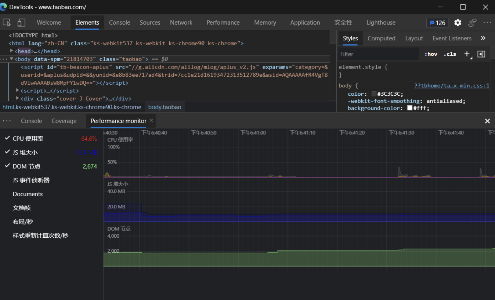

如图所示为 Performance monitor 面板，图中出现的明显波动是执行刷新页面操作所产生的，可观察到 JavaScript 堆内存大小与 DOM 节点数的指标都有一个明显的断崖式下跌，这正是刷新操作清除了原有 DOM 节点后，还未重新渲染出新节点的时间点。


#### 参考链接 

+ https://developer.chrome.com/docs/devtools/
+ https://developer.chrome.com/docs/devtools/evaluate-performance/
+ https://docs.microsoft.com/zh-cn/microsoft-edge/devtools-guide-chromium/evaluate-performance/


### **前端页面的生命周期**

性能问题呈现给用户的感受往往是简单而直接的：加载资源缓慢、运行过程卡顿或响应交互迟缓等，当把这些问题呈现到前端工程师面前时，却是另一种系统级别复杂的图景。

从域名解析、TCP 建立连接到 HTTP 的请求与响应，以及从资源请求、文件解析到关键渲染路径等，每一个环节都有可能因为设计不当、考虑不周、运行出错而产生性能不佳的体验。作为前端工程师，为了能在遇到性能问题时快速而准确地定位问题所在，并设计可行的优化方案，熟悉前端页面的生命周期是一堂必修课。

本章就从一道常见的前端面试题开始，通过对此问题的解答，来分析前端页面生命周期的各个环节，并着重分析其中关键渲染路径的具体过程和优化实践，希望以此为基础帮读者建构一套完整知识框架的图谱，而后续章节的专题性优化，也都是对此生命周期中某个局部过程的优化分析。


#### **一道前端面试题**

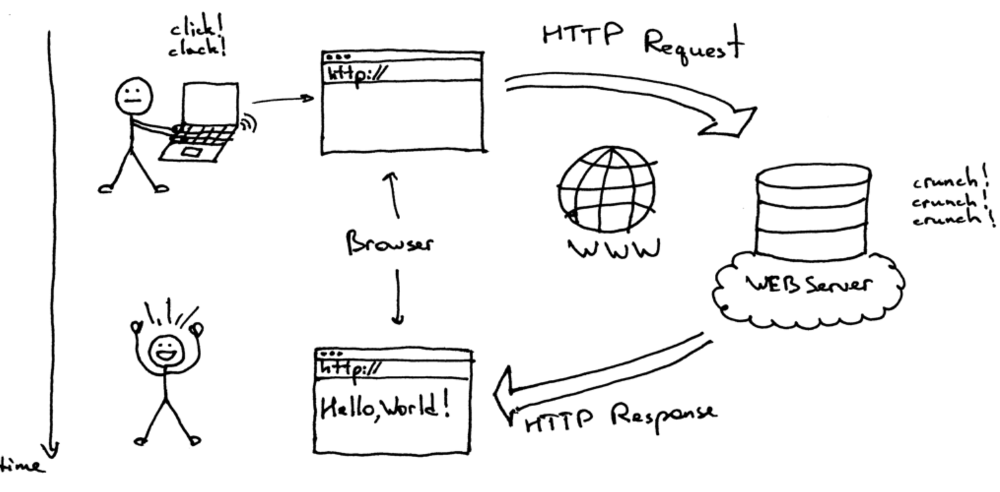

大家在进行前端面试时，经常问这样一个问题：**从浏览器地址栏输入URL后，到页面渲染出来，整个过程都发生了什么？**这个问题不仅能很好地分辨出面试候选人对前端知识的掌握程度，能够考查其知识体系的完整性，更重要的是，能够考查面试者在前端性能优化方面理解和掌握此过程的深入程度，与快速定位性能瓶颈及高效权衡出恰当的性能优化解决方案是正相关的。

根据笔者面试和工作的经验，笔者将工程师的能力由低到高划分了若干等级：不堪一击、初窥门径、略有小成、驾轻就熟、融会贯通……

如果面试者的回答是：首先浏览器发起请求，然后服务器返回数据，最后脚本执行和页面渲染，那么这种程度大概在不堪一击与初窥门径之间，属于刚入门前端，对性能优化还没什么概念。

如果知道在浏览器输入 URL 后会建立 TCP 连接，并在此之上有 HTTP 的请求与响应，在浏览器接收到数据后，了解 HTML 与 CSS 文件如何构成渲染树，以及 JavaScript 引擎解析和执行的基本流程，这种程度基本算是初窥门径，在面对网站较差的性能表现时，能够尝试从网络连接、关键渲染路径及 JS 执行过程等角度去分析和找寻可能存在的问题。本课程的目标便是带领各位同学从初窥门径的程度向更高的级别提升。

其实这个问题的回答可以非常细致，能从信号与系统、计算机原理、操作系统聊到网络通信、浏览器内核，再到 DNS 解析、负载均衡、页面渲染等，但这门课程主要关注前端方面的相关内容，为了后文表述更清楚，这里首先将整个过程划分为以下几个阶段。

（1）浏览器接收到 URL，到网络请求线程的开启。
（2）一个完整的 HTTP 请求并的发出。
（3）服务器接收到请求并转到具体的处理后台。
（4）前后台之间的 HTTP 交互和涉及的缓存机制。
（5）浏览器接收到数据包后的关键渲染路径。
（6）JS 引擎的解析过程。

本章接下来的部分将对以上各阶段进行介绍，由于其中涉及一些知识点，笔者认为这些知识点对理解性能问题和实施优化十分重要，需要更多的篇幅才能表述清楚，所以本章仅对其讲明原理，而后续章节将会单独详述，比如发起完整 HTTP 请求阶段的 DNS 域名解析，前后台 HTTP 交互阶段的数据压缩与缓存等。


#### 网络请求线程开启 

浏览器接收到我们输入的 URL 到开启网络请求线程，这个阶段是在浏览器内部完成的，需要先来了解这里面涉及的一些概念。

首先是对 URL 的解析，它的各部分的含义如下图所示。

| 标题     | 名称               | 备注                                                         |
| -------- | ------------------ | ------------------------------------------------------------ |
| Protocol | 协议头             | 说明浏览器如何处理要打开的文件，常见的有 HTTP、FTP、Telnet 等。 |
| Host     | 主机域名 / IP 地址 | 所访问资源在互联网上的地址，主机域名或经过 DNS 解析为 IP 地址。 |
| Port     | 端口号             | 请求程序和响应程序之间连接用的标识                           |
| Path     | 目录路径           | 请求的目录或文件名                                           |
| Query    | 查询参数           | 请求所传递的参数                                             |
| Fragment | 片段               | 次级资源信息，通常作为前端路由或锚点                         |

URL结构：Protocol://Host:Port/Path?Query#Fragment，例如 http://example.com/users/1?foo=bar#abc

解析 URL 后，如果是 HTTP 协议，则浏览器会新建一个网络请求线程去下载所需的资源，要明白这个过程需要先了解进程和线程之间的区别，以及目前主流的多进程浏览器结构。


#### 进程与线程

简单来说，进程就是一个程序运行的实例，操作系统会为进程创建独立的内存，用来存放运行所需的代码和数据；而线程是进程的组成部分，每个进程至少有一个主线程及可能的若干子线程，这些线程由所属的进程进行启动和管理。由于多个线程可以共享操作系统为其所属的同一个进程所分配的资源，所以多线程的并行处理能有效提高程序的运行效率。

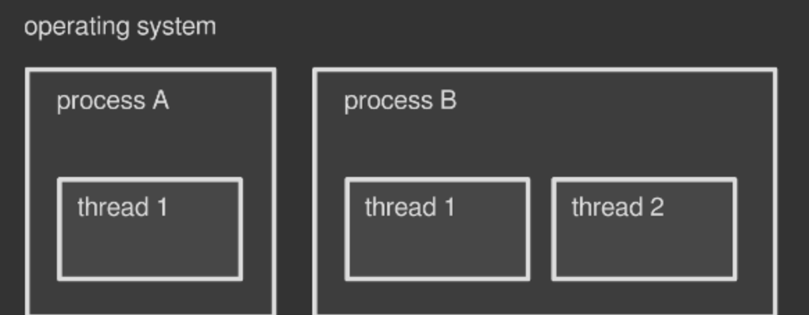


进程和线程之间的区别：


（1）只要某个线程执行出错，将会导致整个进程崩溃。

（2）进程与进程之间相互隔离。这保证了当一个进程挂起或崩溃的情况发生时，并不会影响其他进程的正常运行，虽然每个进程只能访问系统分配给自己的资源，但可以通过 [IPC 机制](https://en.wikipedia.org/wiki/Inter-process_communication)进行进程间通信。

（3）进程所占用的资源会在其关闭后由操作系统回收。即使进程中存在某个线程产生的内存泄漏，当进程退出时，相关的内存资源也会被回收。

（4）线程之间可以共享所属进程的数据。


#### 单进程浏览器 

在熟悉了进程和线程之间的区别后，我们在此基础上通过了解浏览器架构模型的演变，来看看网络请求线程的开启处在怎样的位置。

说到底浏览器也只是一个运行在操作系统上的程序，那么它的运行单位就是进程，而早在 2008 年谷歌发布 Chrome 多进程浏览器之前，市面上几乎所有浏览器都是单进程的，它们将所有功能模块都运行在同一个进程中，其架构示意图如下图所示。

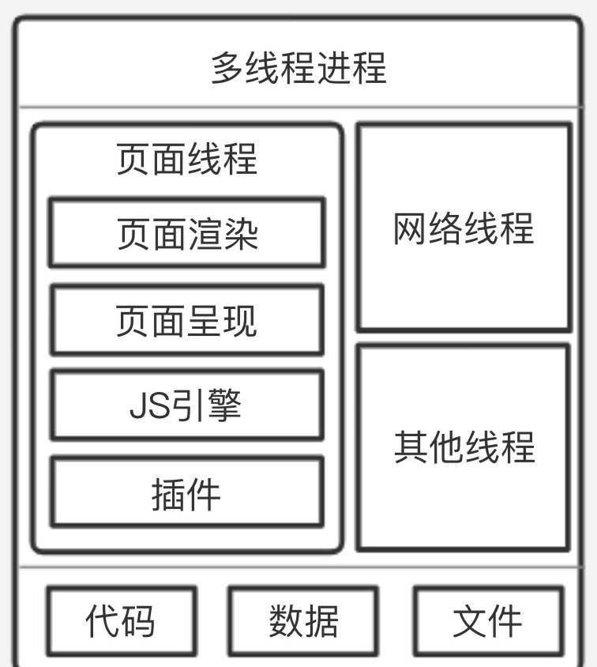

单进程浏览器在以下方面有着较为明显的隐患。

+ 流畅性：首先是页面内存泄漏，浏览器内核通常非常复杂，单进程浏览器打开再关闭一个页面的操作，通常会有一些内存不能完全回收，这样随着使用时间延长，占用的内存会越来越多，从而引起浏览器运行变慢；其次由于很多模块运行在同一个线程中，如JS引擎、页面渲染及插件等，那么执行某个循环任务的模块就会阻塞其他模块的任务执行，这样难免会有卡顿的现象发生。
+ 安全性：由于插件的存在，不免其中有些恶意脚本会利用浏览器漏洞来获取系统权限，进行引发安全问题的行为。
+ 稳定性：由于所有模块都运行在同一个进程中，对于稍复杂的JS代码，如果页面渲染引擎崩溃，就会导致整个浏览器崩溃。同样，各种不稳定的第三方插件，也是导致浏览器崩溃的隐患。


#### 多进程浏览器 

出于对单进程浏览器存在问题的优化，Chrome 推出了多进程浏览器架构，浏览器把原先单进程内功能相对独立的模块抽离为单个进程处理对应的任务，主要分为以下几种进程。

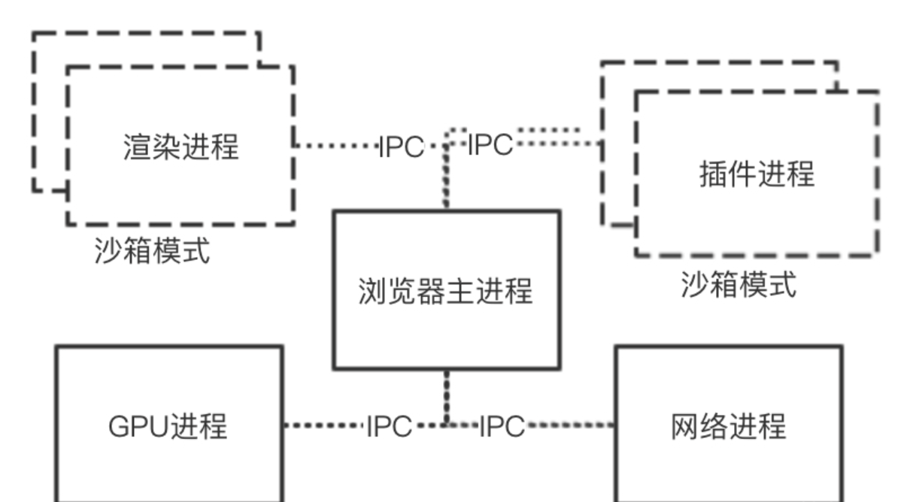

1）浏览器主进程：一个浏览器只有一个主进程，负责如菜单栏、标题栏等界面显示，文件访问，前进后退，以及子进程管理等。
（2）GPU 进程：GPU（图形处理单元）最初是为了实现 3D 的 CSS 效果而引入的，后来随着网页及浏览器在界面中的使用需求越来越普遍，Chrome 便在架构中加入了 GPU 进程。
（3）插件进程：主进程会为每个加入浏览器的插件开辟独立的子进程，由于进程间所分配的运行资源相对独立，所以即便某个插件进程意外崩溃，也不至于对浏览器和页面造成影响。另外，出于对安全因素的考虑，这里采用了沙箱模式（即上图中虚线所标出的进程），在沙箱中运行的程序受到一些限制：不能读取敏感位置的数据，也不能在硬盘上写入数据。这样即使插件运行了恶意脚本，也无法获取系统权限。
（4）网络进程：负责页面的网络资源加载，之前属于浏览器主进程中的一个模块，最近才独立出来。
（5）渲染进程：也称为浏览器内核，其默认会为**每个标签窗口页开辟一个独立的渲染进程**，负责将 HTML、CSS 和 JavaScript 等资源转为可交互的页面，其中包含多个子线程，即 JS 引擎线程、GUI 渲染线程、事件触发线程、定时触发器线程、异步 HTTP 请求线程等。当打开一个标签页输入 URL 后，所发起的网络请求就是从这个进程开始的。另外，出于对安全性的考虑，渲染进程也被放入沙箱中。

打开 Chrome 任务管理器，可以从中查看到当前浏览器都启动了哪些进程，如下图所示。

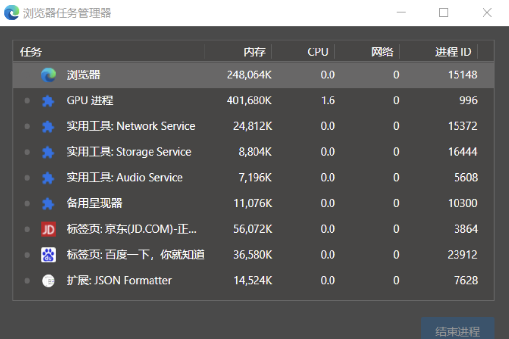

此时仅打开了两个标签页，除了笔者浏览器添加插件所开辟的进程，还可以看到浏览器进程、GPU 进程、网络进程，以及最近新抽离出来的一个音频服务进程等。


#### 建立 HTTP 请求 

这个阶段的主要工作分为两部分：DNS 解析和通信链路的建立。

简单说就是：

+ 首先发起请求的客户端浏览器要明确知道所要访问的服务器地址
+ 然后建立通往该服务器地址的路径


##### DNS 解析

在前面章节讲到的 URL 解析，其实仅将 URL 拆分为代表具体含义的字段，然后以参数的形式传入网络请求线程进行进一步处理，首先第一步便是这里讲到的 DNS 解析。其主要目的便是通过查询将 URL 中的 Host 字段转化为网络中具体的 IP 地址，因为域名只是为了方便帮助记忆的，IP 地址才是所访问服务器在网络中的“门牌号”。

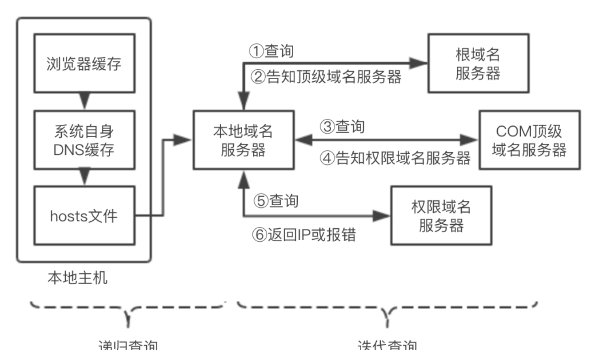

首先查询浏览器自身的 DNS 缓存，如果查到 IP 地址就结束解析，由于缓存时间限制比较大，一般只有1分钟，同时缓存容量也有限制，所以在浏览器缓存中没找到 IP 地址时，就会搜索系统自身的 DNS 缓存；如果还未找到，接着就会尝试从系统的 hosts 文件中查找。

在本地主机进行的查询若都没获取到，接下来便会在本地域名服务器上查询。如果本地域名服务器没有直接的目标 IP 地址可供返回，则本地域名服务器便会采取迭代的方式去依次查询根域名服务器、COM 顶级域名服务器和权限域名服务器等，最终将所要访问的目标服务器 IP 地址返回本地主机，若查询不到，则返回报错信息。

由此可以看出 DNS 解析是个很耗时的过程，若解析的域名过多，势必会延缓首屏的加载时间。本节仅对 DNS 解析过程进行简要的概述，而关于原理及优化方式等更为详细的介绍会在后续课程中单独展开介绍。


##### 网络模型

在通过 DNS 解析获取到目标服务器 IP 地址后，就可以建立网络连接进行资源的请求与响应了。但在此之前，我们需要对网络架构模型有一些基本的认识，在互联网发展初期，为了使网络通信能够更加灵活、稳定及可互操作，国际标准化组织提出了一些网络架构模型：OSI 模型、TCP/IP 模型，二者的网络模型图示如下图所示。

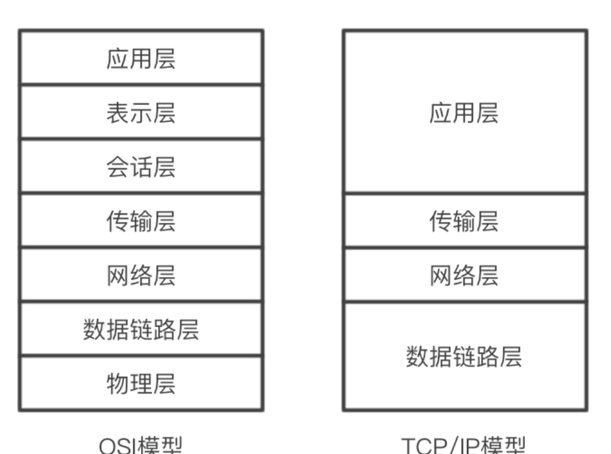

OSI（开放系统互连）模型将网络从底层的物理层到顶层浏览器的应用层一共划分了 7 层，OSI 各层的具体作用如下表所示。

| 应用层     | 负责给应用程序提供接口，使其可以使用网络服务，HTTP 协议就位于该层 |
| ---------- | ------------------------------------------------------------ |
| 表示层     | 负责数据的编码与解码，加密和解密，压缩和解压缩               |
| 会话层     | 负责协调系统之间的通信过程                                   |
| 传输层     | 负责端到端连接的建立，使报文能在端到端之间进行传输。TCP/UDP 协议位于该层 |
| 网络层     | 为网络设备提供逻辑地址，使位于不同地理位置的主机之间拥有可访问的连接和路径 |
| 数据链路层 | 在不可靠的物理链路上，提供可靠的数据传输服务。包括组帧、物理编址、流量控制、差错控制、接入控制等 |
| 物理层     | 主要功能包括：定义网络的物理拓扑，定义物理设备的标准（如介质传出速率、网线或光钎的接口模型等），定义比特的表示和信号的传输模式 |

OSI 是一种理论下的模型，它先规划了模型再填入协议，先制定了标准再推行实践，TCP/IP 充分借鉴了 OSI 引入的服务、接口、协议及分层等概念，建立了 TCP/IP 模型并广泛使用，成为目前互联网事实上的标准。


##### TCP 连接

根据对网络模型的介绍，当使用本地主机连上网线接入互联网后，数据链路层和网络层就已经打通了，而要向目标主机发起 HTTP 请求，就需要通过传输层建立端到端的连接。

传输层常见的协议有 TCP 协议和 UDP 协议，由于本章关注的重点是前端页面的资源请求，这需要面向连接、丢包重发及对数据传输的各种控制，所以接下来仅详细介绍 TCP 协议的“三次握手”和“四次挥手”。

由于 TCP 是面向有连接的通信协议，所以在数据传输之前需要建立好客户端与服务器端之间的连接，即通常所说的“三次握手”，具体过程分为如下步骤。

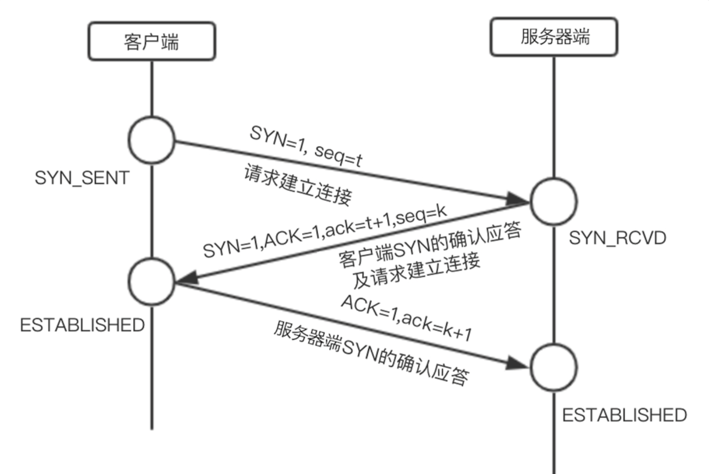

**“3次握手”的作用就是双方都能明确自己和对方的收、发能力是正常的。**

（1）第1次握手：客户端生成一个随机数 `seq`，假设其值为 `t`，并将标志位 `SYN` 设为 `1`，将这些数据打包发给服务器端后，客户端进入等待服务器端确认的状态。
（2）第2次握手：服务器端收到客户端发来的 `SYN=1` 的数据包后，知道这是在请求建立连接，于是服务器端将 `SYN` 与 `ACK` 均置为`1`，并将请求包中客户端发来的随机数`t`加 `1` 后赋值给 `ack`，然后生成一个服务器端的随机数 `seq=k`，完成这些操作后，服务器端将这些数据打包再发回给客户端，作为对客户端建立连接请求的确认应答。
（3）第三次握手：客户端收到服务器端的确认应答后，检查数据包中 `ack` 的字段值是否为 `t+1`，ACK 是否等于 `1`，若都正确就将服务器端发来的随机数加 `1（ack=k+1）`，将 `ACK=1` 的数据包再发送给服务器端以确认服务器端的应答，服务器端收到应答包后通过检查 `ack` 是否等于 `k+1` 来确认连接是否建立成功。连接建立的关系图如下图所示。

当用户关闭标签页或请求完成后，TCP 连接会进行“四次挥手”断开连接，具体过程如下。

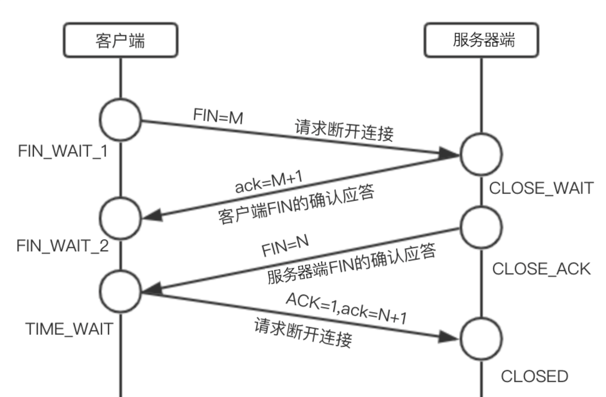

（1） 由客户端先向服务器端发送 `FIN=M` 的指令，随后进入完成等待状态 `FIN_WAIT_1`，表明客户端已经没有再向服务器端发送的数据，但若服务器端此时还有未完成的数据传递，可继续传递数据。
（2） 当服务器端收到客户端的FIN报文后，会先发送 `ack=M+1` 的确认，告知客户端关闭请求已收到，但可能由于服务器端还有未完成的数据传递，所以请客户端继续等待。
（3） 当服务器端确认已完成所有数据传递后，便发送带有 `FIN=N` 的报文给客户端，准备关闭连接。
（4） 客户端收到 `FIN=N` 的报文后可进行关闭操作，但为保证数据正确性，会回传给服务器端一个确认报文 `ack=N+1`，同时服务器端也在等待客户端的最终确认，如果服务器端没有收到报文则会进行重传，只有收到报文后才会真正断开连接。而客户端在发送了确认报文一段时间后，没有收到服务器端任何信息则认为服务器端连接已关闭，也可关闭客户端信息。

只有连接建立成功后才可开始进行数据的传递，由于浏览器对同一域名下并发的 TCP 连接有限制，以及在 1.0 版本的 HTTP 协议中，一个资源的下载需对应一个 TCP 的请求，这样的并发限制又会涉及许多优化方案，我们将在后续章节中进行进一步介绍。

这里较为详细地介绍了 TCP 连接建立和断开的过程，首先让读者有一个网络架构分层的概念，虽然前端工作基本围绕在应用层，但有一个全局的网络视角后，能帮助我们在定位性能瓶颈时更加准确；其次也为了说明影响前端性能体验的因素，不仅是日常编写的代码和使用的资源，网络通信中每个环节的优劣缓急都值得关注。


**QA：为什么三次握手建立连接的 TCP 客户端最后还要发送一次确认呢？**
一句话，主要防止已经失效的连接请求报文突然又传送到了服务器，从而产生错误。

如果使用的是两次握手建立连接，假设有这样一种场景，客户端发送了第一个请求连接并且没有丢失，只是因为在网络节点中滞留的时间太长了，由于 TCP 的客户端迟迟没有收到确认报文，以为服务器没有收到，此时重新向服务器发送这条报文，此后客户端和服务器经过两次握手完成连接，传输数据，然后关闭连接。此时此前滞留的那一次请求连接，网络通畅了到达了服务器，这个报文本该是失效的，但是，两次握手的机制将会让客户端和服务器再次建立连接，这将导致不必要的错误和资源的浪费。

如果采用的是三次握手，就算是那一次失效的报文传送过来了，服务端接受到了那条失效报文并且回复了确认报文，但是客户端不会再次发出确认。由于服务器收不到确认，就知道客户端并没有请求连接。


**QA：为什么建立连接是三次握手，关闭连接确是四次挥手呢？**
建立连接的时候， 服务器在LISTEN状态下，收到建立连接请求的SYN报文后，把ACK和SYN放在一个报文里发送给客户端。
而关闭连接时，服务器收到对方的FIN报文时，仅仅表示对方不再发送数据了但是还能接收数据，而自己也未必全部数据都发送给对方了，所以己方可以立即关闭，也可以发送一些数据给对方后，再发送FIN报文给对方来表示同意现在关闭连接，因此，己方ACK和FIN一般都会分开发送，从而导致多了一次。


**QA：如果已经建立了连接，但是客户端突然出现故障了怎么办？**
TCP 还设有一个保活计时器，显然，客户端如果出现故障，服务器不能一直等下去，白白浪费资源。服务器每收到一次客户端的请求后都会重新复位这个计时器，时间通常是设置为2小时，若两小时还没有收到客户端的任何数据，服务器就会发送一个探测报文段，以后每隔75秒发送一次。若一连发送10个探测报文仍然没反应，服务器就认为客户端出了故障，接着就关闭连接。


#### 前后端的交互

当 TCP 连接建立好之后，便可通过 HTTP 等协议进行前后端的通信，但在实际的网络访问中，并非浏览器与确定 IP 地址的服务器之间直接通信，往往会在中间加入反向代理服务器。


#### 反向代理服务器 

对需要提供复杂功能的网站来说，通常单一的服务器资源是很难满足期望的。一般采用的方式是将多个应用服务器组成的集群由反向代理服务器提供给客户端用户使用，这些功能服务器可能具有不同类型，比如文件服务器、邮件服务器及 Web 应用服务器，同时也可能是相同的Web服务部署到多个服务器上，以实现负载均衡的效果，反向代理服务器的作用如图所示。

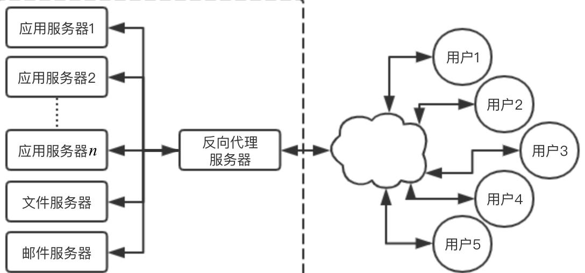

反向代理服务器根据客户的请求，从后端服务器上获取资源后提供给客户端。反向代理服务器通常的作用如下：

+ 负载均衡。
+ 安全防火墙。
+ 加密及SSL加速。
+ 数据压缩。
+ 解决跨域。
+ 对静态资源缓存。

常用作反向代理服务器的有 Nginx、IIS、Apache，我们会在后面针对 Nginx 深入介绍一些可用于性能优化的配置。


#### 后端处理流程

经反向代理收到请求后，具体的服务器后台处理流程大致如下。

（1）首先会有一层统一的验证环节，如跨域验证、安全校验拦截等。如果发现是不符合规则的请求，则直接返回相应的拒绝报文。
（2）通过验证后才会进入具体的后台程序代码执行阶段，如具体的计算、数据库查询等。
（3）完成计算后，后台会以一个HTTP响应数据包的形式发送回请求的前端，结束本次请求。


#### **HTTP 相关协议特性**


HTTP 是建立在传输层 TCP 协议之上的应用层协议，在 TCP 层面上存在长连接和短连接的区别。所谓长连接，就是在客户端与服务器端建立的 TCP 连接上，可以连续发送多个数据包，但需要双方发送心跳检查包来维持这个连接。

短连接就是当客户端需要向服务器端发送请求时，会在网络层 IP 协议之上建立一个 TCP 连接，当请求发送并收到响应后，则断开此连接。根据前面关于 TCP 连接建立过程的描述，我们知道如果这个过程频繁发生，就是个很大的性能耗费，所以从 HTTP 的 1.0 版本开始对于连接的优化一直在进行。

在 HTTP 1.0 时，默认使用短连接，浏览器的每一次 HTTP 操作就会建立一个连接，任务结束则断开连接。

在 HTTP 1.1 时，默认使用长连接，在此情况下，当一个网页的打开操作完成时，其中所建立用于传输 HTTP 的 TCP 连接并不会断开关闭，客户端后续的请求操作便会继续使用这个已经建立的连接。如果我们对浏览器的开发者工具留心，在查看请求头时会发现一行 Connection: keep-alive。长连接并非永久保持，它有一个持续时间，可在服务器中进行配置。

而在 HTTP 2.0 到来之前，每一个资源的请求都需要开启一个 TCP 连接，由于 TCP 本身有并发数的限制，这样的结果就是，当请求的资源变多时，速度性能就会明显下降。为此，经常会采用的优化策略包括，将静态资源的请求进行多域名拆分，对于小图标或图片使用雪碧图等。

在 HTTP 2.0 之后，便可以在一个 TCP 连接上请求多个资源，分割成更小的帧请求，其速度性能便会明显上升，所以之前针对 HTTP 1.1 限制的优化方案也就不再需要了。

HTTP 2.0 除了一个连接可请求多个资源这种多路复用的特性，还有如下一些新特性。

（1）二进制分帧：在应用层和传输层之间，新加入了一个二进制分帧层，以实现低延迟和高吞吐量。
（2）服务器端推送：以往是一个请求带来一个响应，现在服务器可以向客户端的一个请求发出多个响应，这样便可以实现服务器端主动向客户端推送的功能。
（3）设置请求优先级：服务器会根据请求所设置的优先级，来决定需要多少资源处理该请求。
（4）HTTP头部压缩：减少报文传输体积。


#### 浏览器缓存

在基于 HTTP 的前后端交互过程中，使用缓存可以使性能得到显著提升。具体的缓存策略分为两种：强缓存和协商缓存。

强缓存就是当浏览器判断出本地缓存未过期时，直接读取本地缓存，无须发起 HTTP 请求，此时状态为：200 from cache。在HTTP 1.1版本后通过头部的 cache-control 字段的 max-age 属性值规定的过期时长来判断缓存是否过期失效，这比之前使用 expires 标识的服务器过期时间更准确而且安全。

协商缓存则需要浏览器向服务器发起 HTTP 请求，来判断浏览器本地缓存的文件是否仍未修改，若未修改则从缓存中读取，此时的状态码为：304。具体过程是判断浏览器头部 if-none-match 与服务器短的 e-tag 是否匹配，来判断所访问的数据是否发生更改。这相比 HTTP 1.0 版本通过 last-modified 判断上次文件修改时间来说也更加准确。具体的浏览器缓存触发逻辑如图所示。

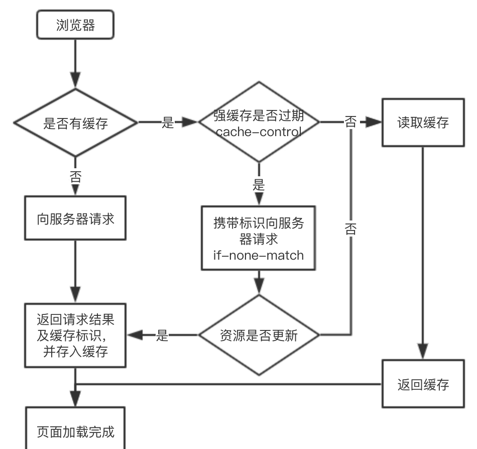


在浏览器缓存中，强缓存优于协商缓存，若强缓存生效则直接使用强缓存，若不生效则再进行协商缓存的请求，由服务器来判断是否使用缓存，如果都失效则重新向服务器发起请求获取资源。本节仅简要说明浏览器缓存的触发过程，由于这部分对性能优化来说比较重要，所以在后续章节也会详细介绍。


#### 关键渲染路径（CRP） 

当我们经历了网络请求过程，从服务器获取到了所访问的页面文件后，浏览器如何将这些 HTML、CSS 及 JS 文件组织在一起渲染出来呢？


##### 构建对象模型 

首先浏览器会通过解析 HTML 和 CSS 文件，来构建 DOM（文档对象模型）和 CSSOM（层叠样式表对象模型），为便于理解，我们以如下 HTML 内容文件为例，来观察文档对象模型的构建过程。

```html
<!DOCTYPE html>
<html lang="en">
<head>
  <meta charset="UTF-8">
  <meta http-equiv="X-UA-Compatible" content="IE=edge">
  <meta name="viewport" content="width=device-width, initial-scale=1.0">
  <title>关键路径渲染</title>
  <link rel="stylesheet" href="style.css">
</head>
<body>
  <p>你好<span>性能优化</span></p>
  <div>
    
  </div>
</body>
</html>
```

浏览器接收读取到的 HTML 文件，其实是文件根据指定编码（UTF-8）的原始字节，形如 `3C 62 6F 79 3E 65 6C 6F 2C 20 73 70…`。首先需要将字节转换成字符，即原本的代码字符串，接着再将字符串转化为 W3C 标准规定的令牌结构，所谓令牌就是 HTML 中不同标签代表不同含义的一组规则结构。然后经过词法分析将令牌转化成定义了属性和规则值的对象，最后将这些标签节点根据 HTML 表示的父子关系，连接成树形结构，如下图所示。

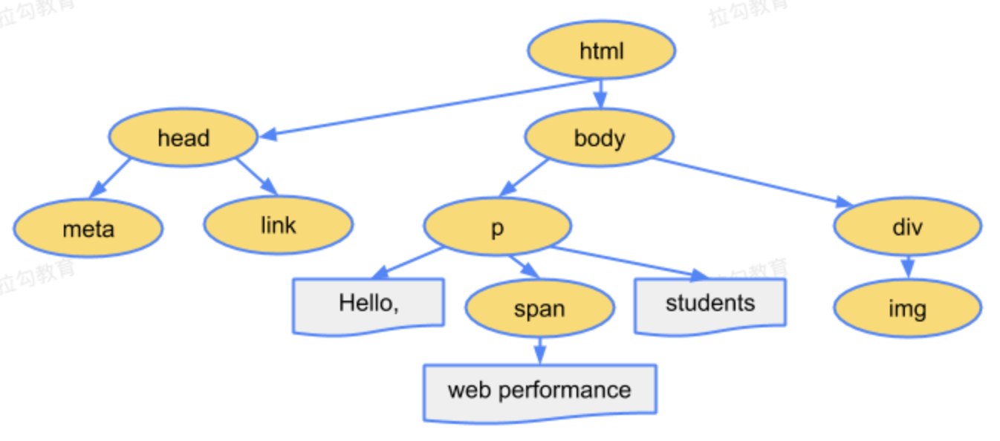


##### 构建 CSSOM

DOM 树表示文档标记的属性和关系，但未包含其中各元素经过渲染后的外观呈现，这便是接下来 CSSOM 的职责了，与将 HTML 文件解析为文档对象模型的过程类似，CSS 文件也会首先经历从字节到字符串，然后令牌化及词法分析后构建为层叠样式表对象模型。假设 CSS 文件内容如下：

```css
body {
  font-size: 16px;
}

p {
  font-weight: bold;
}

span {
  color: red;
}

p span {
  display: none;
}

img {
  float: right;
}
```

最后构建的 CSSOM 树如图所示。

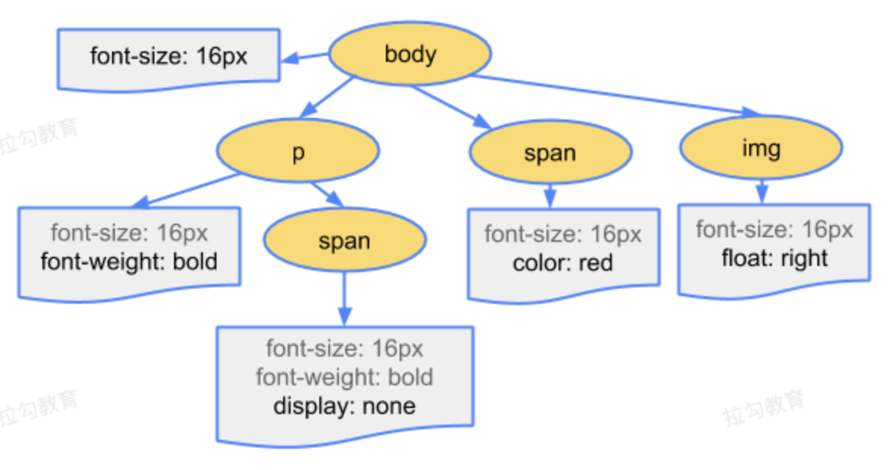

这两个对象模型的构建过程是会花费时间的，可以通过打开 Chrome 浏览器的开发者工具的性能选项卡，查看到对应过程的耗时情况，如图所示。

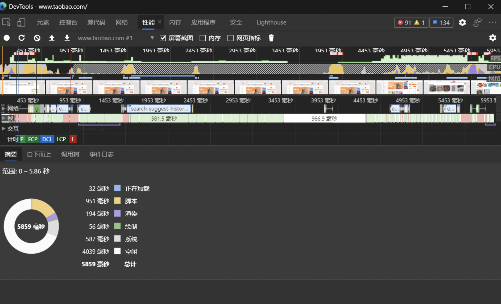


#### 渲染绘制

当完成文档对象模型和层叠样式表对象模型的构建后，所得到的其实是描述最终渲染页面两个不同方面信息的对象：一个是展示的文档内容，另一个是文档对象对应的样式规则，接下来就需要将两个对象模型合并为渲染树，渲染树中只包含渲染可见的节点，该 HTML 文档最终生成的渲染树如图所示。

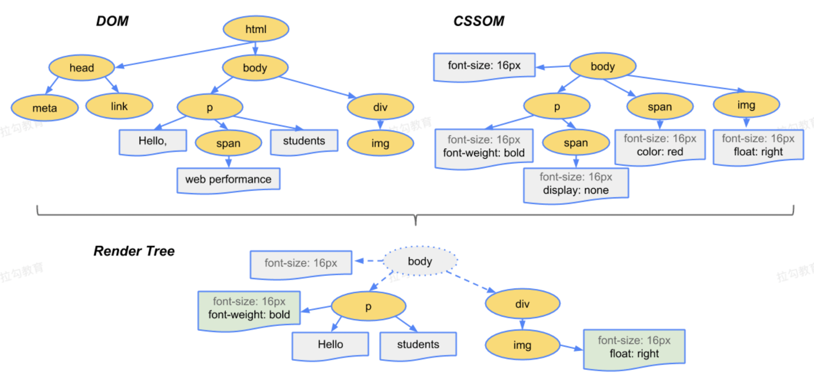

渲染绘制的步骤大致如下。

（1）从所生成 DOM 树的根节点开始向下遍历每个子节点，忽略所有不可见的节点（脚本标记不可见、CSS 隐藏不可见），因为不可见的节点不会出现在渲染树中。
（2）在 CSSOM 中为每个可见的子节点找到对应的规则并应用。
（3）布局阶段，根据所得到的渲染树，计算它们在设备视图中的具体位置和大小，这一步输出的是一个“盒模型”。
（4）绘制阶段，将每个节点的具体绘制方式转化为屏幕上的实际像素。

此处所举的例子较为简单，读者要明白执行构建渲染树、布局及绘制过程所需要的时间取决于实际文档的大小。文档越大，浏览器需要处理的任务就越多，样式也复杂，绘制需要的时间就越长，所以关键渲染路径执行快慢，将直接影响首屏加载时间的性能指标。

当首屏渲染完成后，用户在和网站的交互过程中，有可能通过 JavaScript 代码提供的用户操作接口更改渲染树的结构，一旦 DOM 结构发生改变，这个渲染过程就会重新执行一遍。可见对于关键渲染路径的优化影响的不仅是首屏性能，还有交互性能。

本节仅对首屏渲染过程进行了简要描述，其中细节性的优化方案，将会在后续章节中展开介绍。


#### 小结

本章通过一道前端工程师常见的面试题，较为详细地描述了当用户从浏览器的地址栏输入 URL 后，到页面渲染出来的整个过程。其实不难理解当某个较差的性能体验发生时，很有可能是这个过程中的某个环节出现了过多的性能损耗，后续我们会介绍一些辅助的性能分析工具来帮助定位具体的性能瓶颈，其实它们也是以页面加载生命周期为“纲”进行逐步分析的，所以我们理解并掌握了这个过程，对具体的优化手段可以做到心中有数。

后续的章节安排，就是选取本章介绍的页面生命周期的某个局部环节进行优化，以及某些具体的优化技巧和实用工具。如果说这些是前端性能优化的“术”，那么理解页面生命周期就是“道”。


#### 参考链接 

+ https://developer.mozilla.org/en-US/docs/Web/Performance/How_browsers_work
+ https://zhuanlan.zhihu.com/p/80551769
+ https://docs.microsoft.com/zh-cn/microsoft-edge/extensions-chromium/getting-started/
+ https://blog.csdn.net/qzcsu/article/details/72861891
+ https://zhuanlan.zhihu.com/p/53374516
