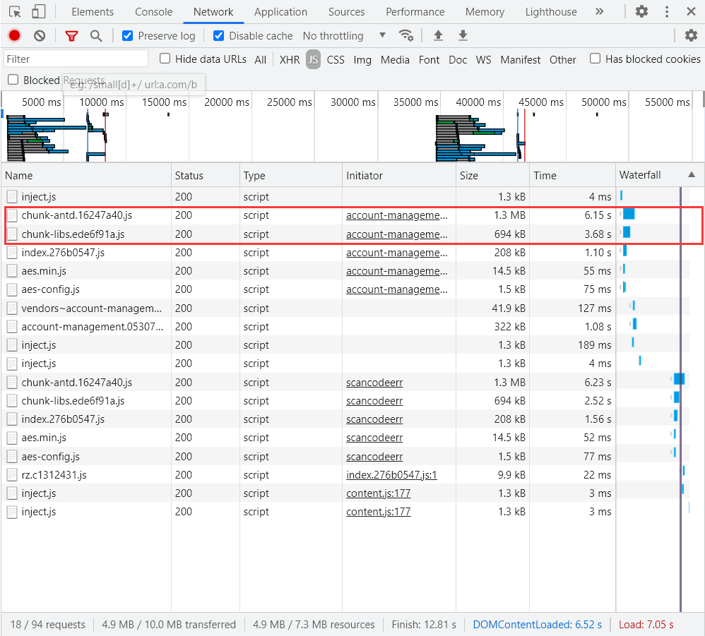
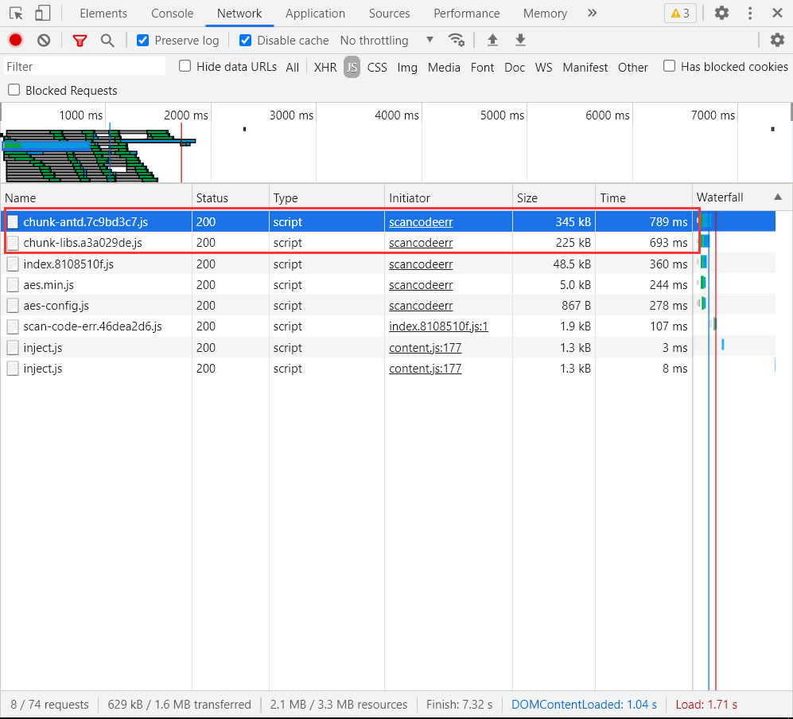

[TOC]

# 性能优化

## gzip压缩

**1、前端 vue-cli 项目打包生成 gzip 压缩文件**

安装 `compression-webpack-plugin` 插件：

```bash
npm install compression-webpack-plugin -D
```

在 `vue.config.js` 的 webpack 配置的 plugin 中加入 `compression-webpack-plugin`：

```js
const CompressionPlugin = require('compression-webpack-plugin')
const productionGzipExtensions = ['css', 'js']
// 生产环境下使用的配置
config.when(isProd, (config) => {
  // 使用 gzip 压缩
  config.plugin('compress').use(CompressionPlugin, [
    {
      algorithm: 'gzip', // 压缩算法
      test: new RegExp('\\.(' + productionGzipExtensions.join('|') + ')$'), // 匹配文件后缀名
      threshold: 10240, // 压缩阈值，超过 10kb 才压缩
      minRatio: 0.8, // 压缩比
    },
  ])
})

```

然后执行 `npm run build` 之后，生成的打包目录中资源文件就有与之对应的 gz 格式文件：


**2、修改 nginx 配置，开启 gzip**

修改 nginx 配置文件：

```bash
vi nginx.conf
```

在http、server、location 三者之一（视实际需求选择）加入 gzip 配置：

```conf
server {
	gzip on;
	gzip_min_length 10;
	gzip_buffers 32 4k;
	gzip_comp_level 6;
	gzip_types text/plain application/javascript application/x-javascript text/css application/xml text/javascript;
	gzip_vary on;
	gzip_disable "MSIE [1-6]\.";
}
```

**参数说明：**

**gzip：**打开或关闭gzip，默认 off 关闭

**gzip_buffers：**设置用于处理请求压缩的缓冲区数量和大小。比如32 4K表示按照内存页（one memory page）大小以4K为单位（即一个系统中内存页为4K），申请32倍的内存空间。建议此项不设置，使用默认值。

**gzip_comp_level：**设置gzip压缩级别，级别越底压缩速度越快文件压缩比越小，反之速度越慢文件压缩比越大。推荐6压缩级别(级别越高,压的越小,越浪费CPU计算资源)

**gzip_disable：**通过表达式，表明哪些UA头不使用gzip压缩。如 MSIE [1-6]\. 代表ie6及以下不启用gzip（因为ie低版本不支持）

**gzip_min_length：**当返回内容大于此值时才会使用gzip进行压缩,以K为单位,当值为0时，所有页面都进行压缩。

**gzip_http_version：**用于识别http协议的版本，早期的浏览器不支持gzip压缩，用户会看到乱码，所以为了支持前期版本加了此选项。默认在http/1.0的协议下不开启gzip压缩。

**gzip_proxied：**nginx做为反向代理的时候启用。

**gzip_types：**设置需要压缩的MIME类型,如果不在设置类型范围内的请求不进行压缩。

**gzip_vary：**增加响应头”Vary: Accept-Encoding”，告诉接收方发送的数据经过了压缩处理，开启后的效果是在响应头部添加了Accept-Encoding: gzip，这对于本身不支持gzip压缩的客户端浏览器有用。

修改配置完成后，重启 nginx：

```bash
docker restart nginx
# 或者
nginx -s reload
```


**3、查看页面效果**

进入浏览器相应的页面中刷新，按F12进入审查元素，查看**network**，可以清楚看到使用gzip压缩后资源文件的大小和加载时间得到大幅减少。

**优化前：**



**优化后：**



