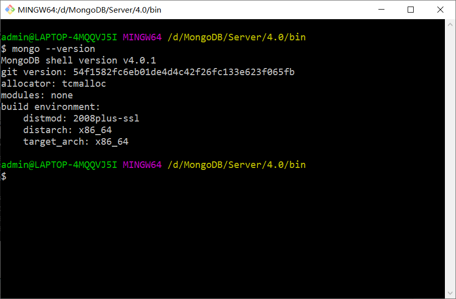
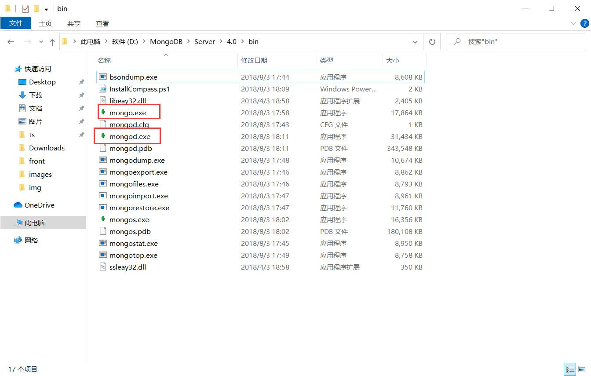
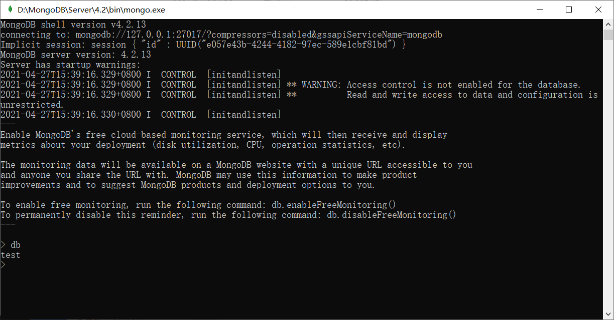

[TOC]

# mongodb

## 安装

[官方文档](https://docs.mongodb.com/manual/administration/install-community/)

安装成功后，使用命令验证是否安装成功：

```bash
mongo -version
```



然后查看目录，先启动mongod，再启动mongo：



连接成功，mongodb默认端口是27017：



mongod 命令是启用数据库服务，即搭建并开启服务器，可以通过端口被访问（27017）

mongo 命令是连接数据库服务，即连接服务器，可以通过端口进行访问（27017）

注意：mongod 和 mongo 的区别，前者是启用MongoDB进程，后者是对MongoDB进行连接操作。


## 备份/恢复

**备份：**

```bash
mongodump -h localhost -u root -p 密码 -d test -o /tmp/test
```

参数：

- -h：MongoDB 所在服务器地址
- -u：用户名
- -p：密码
- -d：需要备份的数据库，例如：test，不传-d则备份所有数据库。
- -o：备份的数据存放位置。

备注：可以使用docker cp将容器内部的目录复制到宿主机的目录，从而实现将备份数据保存到宿主机目录。

```bash
docker cp 容器id:容器目录 宿主机目录
```


**恢复：**

```bash
mongorestore -h localhost -u root -p 密码 -d test --dir /tmp/test
```

参数：

- -h：MongoDB 所在服务器地址
- -u：用户名
- -p：密码
- -d：需要备份的数据库，例如：test，不传-d则备份所有数据库。
- --dir：指定备份存放的目录。


## mongoose

[官方文档](http://www.mongoosejs.net/)

Mongoose是一个对象文档模型（ODM）库，它对Node原生的MongoDB模块进行了进一步的优化封装，并提供了更多的功能。

数据库核心概念区别：

| 分类 | Oralce/Mysql | MongoDB          | Mongoose                 |
| ---- | ------------ | ---------------- | ------------------------ |
| 1    | 数据库实例   | MongoDB实例      | Mongoose                 |
| 2    | 模式(schema) | 数据库(database) | mongoose                 |
| 3    | 表(table)    | 集合(collection) | 模板(Schema)/模型(Model) |
| 4    | 行(row)      | 文档(document)   | 实例(instance)           |
| 5    | Primary key  | Object(_id)      | Object(_id)              |
| 6    | 表自动Column | Field            | Field                    |

Schema：Mongoose 的一切始于 Schema。每个 schema 都会映射到一个 MongoDB collection ，并定义这个collection里的文档的构成。

Model：Models 是从 Schema 编译来的构造函数。 它们的实例就代表着可以从数据库保存和读取的 documents。 从数据库创建和读取 document 的所有操作都是通过 model 进行的。

例如：

```js
var schema = new mongoose.Schema({ name: 'string', size: 'string' });
var Tank = mongoose.model('Tank', schema);
```


### 增删改查

**插入文档：**

```js
const TestSchema = mongoose.Schema({
  name: { type: String },
  age: { type: Number },
  email: { type: String },
})

const User = mongoose.model('users', TestSchema)

const user = {
  name: 'edward',
  age: 28,
  email: '872990547@qq.com'
}

const insertMethod = async () => {
  const data = new User(user)
  const result = await data.save()
  console.log(result)
}
```

**查询文档：**

```js
const findMethods = async () => {
  const result = await User.find()
  console.log(result)
}
```

**修改文档：**

```js
const updateMethods = async () => {
  const result = await User.update()
  console.log(result)
}
```

**删除文档：**

```js
const deleteMethods = async () => {
  const result = await User.deleteOne({name: 'edward'})
  console.log(result)
}
```

