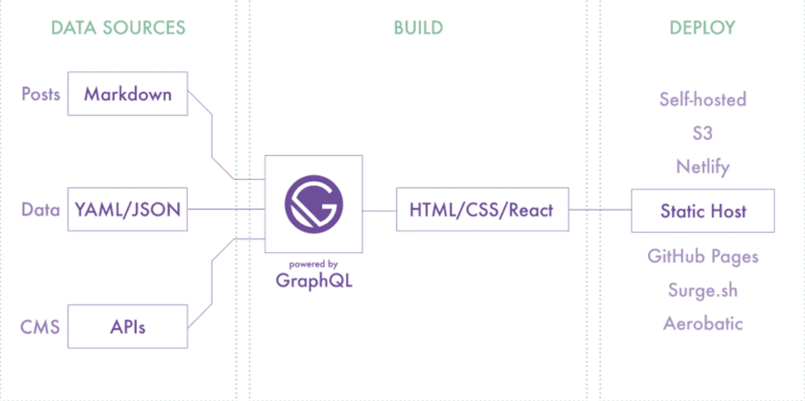
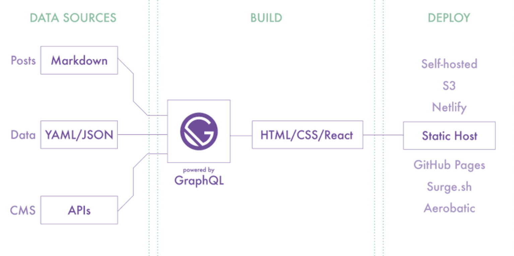

[TOC]

# Gatsby

## Gatsby 介绍

Gatsby 是一个静态站点生成器. 

官网：https://www.gatsbyjs.org/


## 静态应用的优势

1. 访问速度快
2. 更利于 SEO 搜索引擎的内容抓取
3. 部署简单


## Gatsby 总览



1. 基于 React 和 GraphQL. 结合了 webpack, babel, react-router 等前端领域中最先进工具. 开发人员开发体验好 
2. 采用数据层和UI层分离而不失 SEO 的现代前端开发模式. 对SEO非常友好
3. 数据预读取, 在浏览器空闲的时候预先读取链接对应的页面内容. 使静态页面拥有 SPA 应用的用户体验, 用户体验好
4. 数据来源多样化: Headless CMS, markdown, API. 
5. 功能插件化, Gatsby 中提供了丰富且功能强大的各种类型的插件, 用什么装什么.


## 创建 Gatsby 项目

1. 全局安装脚手架工具

`npm install gatsby-cli -g`

2. 创建项目

创建：`gatsby new project-name https://github.com/gatsbyjs/gatsby-starter-hello-world` 

启动：`gatsby develop` 或 `npm start` 

访问：localhost:8000


## 基于文件的路由系统

Gatsby 框架内置基于文件的路由系统, 页面组件被放置在 src/pages 文件夹中.


## 以编程的方式创建页面

基于同一个模板创建多个HTML页面，有多少数据就创建多少页面 比如商品详情页面，有多少商品就生成多少商品详情展示页面

```jsx
// createPages 方法用于创建页面
// Gatsby 在构建应用时会调用该方法
// 该方法需要在 gatsby-node.js 文件中定义
function createPages({ actions }) {
  const { createPage } = actions;
  // 获取模板的绝对路径

  // 获取模板所需要的数据

  // 根据模板和数据创建页面
}
```


## Link 组件

在 Gatsby 框架中页面跳转通过 Link 组件实现.

```jsx
import { Link } from 'gatsby';
<Link to="/list">jump to list pages</Link>
```


## GraphQL 数据层

在 Gatsby 框架中提供了一个统一的存储数据的地方，叫做数据层. 

在应用构建时，Gatsby 会从外部获取数据并将数据放入数据层，组件可以直接从数据层查询数据. 数据层使用 GraphQL 构建. 

调试工具：localhost:8000/___graphql



## GraphQL 数据查询

### 页面组件

在组件文件中导出查询命令, 框架执行查询并将结果传递给组件的 prop 对象. 存储在 props 对象的 data 属性中.

```jsx
import { graphql } from "gatsby"

function PageComponent({ data }) {
  return <div>{data.site.siteMetadata.title}</div>
}

export const query = graphql`
  query {
    site {
      siteMetadata {
        title
      }
    }
  }
`
```


## 非页面组件

通过钩子函数 useStaticQuery 进行手动查询.

```jsx
import { graphql, useStaticQuery } from "gatsby"

const data = useStaticQuery(graphql`
   query {
    site {
       siteMetadata {
        author
        title
       }
     }
   }
`)
```


## Gatsby 插件

Gatsby 框架内置插件系统, 插件是为应用添加功能的最好的方式. 

在 Gatsby 中有三种类型的插件: 分别为数据源插件 ( source ), 数据转换插件 ( transformer ), 功能插件 ( plugin ) 数据源插件：负责从应用外部获取数据，将数据统一放在 Gatsby 的数据层中 数据转换插件：负责转换特定类型的数据的格式，比如将 markdown 文件中的内容转换为对象形式 功能插件：为应用提供功能，比如通过插件让应用支持 Less 或者 TypeScript.

[链接](https://www.gatsbyjs.com/plugins)


## 将 JSON 数据放入数据层

要将本地 JSON 文件中的数据放入数据层需要用到两个插件.

gatsby-source-filesystem: 用于将本地文件中的数据添加至数据层.

gatsby-transformer-json：将原始JSON字符串转换为JavaScript对象.

```jsx
module.exports = {
  plugins: [
    {
      resolve: "gatsby-source-filesystem",
      options: {
        name: "data",
        path: `${__dirname}/data/`,
      },
    },
    
    "gatsby-transformer-json",
  ]
}
```


## 图像优化

1. 图像文件和数据文件不在源代码中的同一位置 
2. 图像路径基于构建站点的绝对路径, 而不是相对于数据的路径, 难以分析出图片的真实位置 
3. 图像没有经过任何优化操作


gatsby-source-filesystem: 用于将本地文件信息添加至数据层. 

gatsby-plugin-sharp: 提供本地图像的处理功能(调整图像尺寸, 压缩图像体积 等等). 

gatsby-transformer-sharp: 将 gatsby-plugin-sharp 插件处理后的图像信息添加到数据层. 

gatsby-image: React 组件, 优化图像显示, 基于 gatsby-transformer-sharp 插件转化后的数据.


1.生成多个具有不同宽度的图像版本, 为图像设置 srcset 和 sizes 属性, 因此无论您的设备是什么宽度都可以加载到合适大小的图片 

2.使用"模糊处理"技术, 其中将一个20px宽的小图像显示为占位符, 直到实际图像下载完成为止.

```bash
npm install gatsby-plugin-sharp gatsby-transformer-sharp gatsby-image
```


## 将 markdown 数据放入数据层

### 构建文章列表 

1. 通过 gatsby-source-filesystem 将markdown文件数据放入数据层

```jsx
{
    resolve: "gatsby-source-filesystem",
    options: {
      name: "markdown",
      path: `${__dirname}/src/posts/`,
    },
},
```

2. 通过 gatsby-transformer-remark 将数据层中的原始 markdown 数据转换为对象形式

```jsx
module.exports = {
  plugins: ["gatsby-transformer-remark"]
}
```

3. 组件数据查询

```jsx
export const query = graphql`
	query {
		...
	}
`;
```


### 构建文章详情

1. 重新构建查询数据, 添加 slug 作为请求标识, slug 值为文件名称

   gatsby.md -> /posts/gatsby 

   react.md -> /posts/react

   ```jsx
   function onCreateNode({ node, actions }) {
     const { createNodeField } = actions
     if (node.internal.type === "MarkdownRemark") {
       const slug = path.basename(node.fileAbsolutePath, ".md")
       createNodeField({
         node,
         name: "slug",
         value: slug,
       })
     }
   }
   ```

2. 根据 slug 标识构建页面

   ```jsx
   async function createPages({ graphql, actions }) {
     const { createPage } = actions
     // 1. 获取模板文件的绝对路径
     const template = require.resolve("./src/templates/article.js")
     // 2. 获取页面的访问标识
     let { data } = await graphql(`
       query {
         allMarkdownRemark {
           nodes {
             fields {
               slug
             }
           }
         }
       }
     `)
     // 3. 创建页面
     data.allMarkdownRemark.nodes.forEach(node => {
       createPage({
         component: template,
         path: `/article/${node.fields.slug}`,
         context: {
           slug: node.fields.slug,
         },
       })
     })
   }
   ```

3. 组件数据查询

   ```jsx
   export const query = graphql`
     query($slug: String) {
       markdownRemark(fields: { slug: { eq: $slug } }) {
         html
         frontmatter {
           title
           date
         }
         id
       }
     }
   `
   ```

4. 处理 markdown 文件中图片

   gatsby-remark-images: 处理 markdown 中的图片, 以便可以在生产环境中使用

   ```jsx
   {
     resolve: "gatsby-transformer-remark",
     options: {
        plugins: ["gatsby-remark-images"],
     },
   }
   ```


## 从 Strapi 中获取数据

创建项目: npx create-strapi-app 项目名称 https://github.com/strapi/strapi

[链接](https://www.gatsbyjs.com/plugins/gatsby-source-strapi/?=strapi)

```jsx
{
  resolve: "gatsby-source-mystrapi",
  options: {
  	apiUrl: "http://localhost:1337",
  	contentTypes: ["Post"]
  }
}
```


## Gatsby Source 插件开发

数据源插件负责从 Gatsby 应用外部获取数据，创建数据查询节点供开发者使用 

1. gatsby clean 清除上一次的构建内容 
2. 在项目根目录里下创建 plugins 文件夹，在此文件夹中继续创建具体的插件文件夹，比如 gatsby-source-mystrapi 文件夹 
3. 在插件文件夹中创建 gatsby-node.js 文件 
4. 插件实际上就是 npm 包 
5. 导出 sourceNodes 方法用于获取外部数据，创建数据查询节点 
6. 在 gatsby-config.js 文件中配置插件，并传递插件所需的配置参数
7. 重新运行应用


## Gatsby Transformer 插件开发

transformer 插件将 source 插件提供的数据转换为新的数据 

1. 在 plugins 文件夹中创建 gatsby-transformer-xml 文件件 
2. 在插件文件夹中创建 gatsby-node.js 文件 
3. 在文件中导出 onCreateNode 方法用于构建 Gatsby 查询节点 
4. 根据节点类型筛选 xml 节点 node.internal.mediaType -> application/xml
5. 通过 loadNodeContent 方法读取节点中的数据 
6. 通过 xml2js 将xml数据转换为对象 
7. 将对象转换为 Gatsby 查询节点


## SEO 优化

gatsby-plugin-react-helmet 

react-helmet 是一个组件, 用于控制页面元数据. 这对于 SEO 非常重要. 此插件用于将页面元数据添加到 Gatsby 构建的静态HTML页面中. 

```bash
npm install gatsby-plugin-react-helmet react-helmet
```


## Less 支持 

在 gatsby 应用中使用 less 

下载插件：`npm install --save gatsby-plugin-less` 

配置插件：`plugins: ['gatsby-plugin-less']`

创建样式：`index.module.less` 

引入样式：`import styles from './index.module.less'`


## Gatsby 构建

Gatsby + github + Netlify