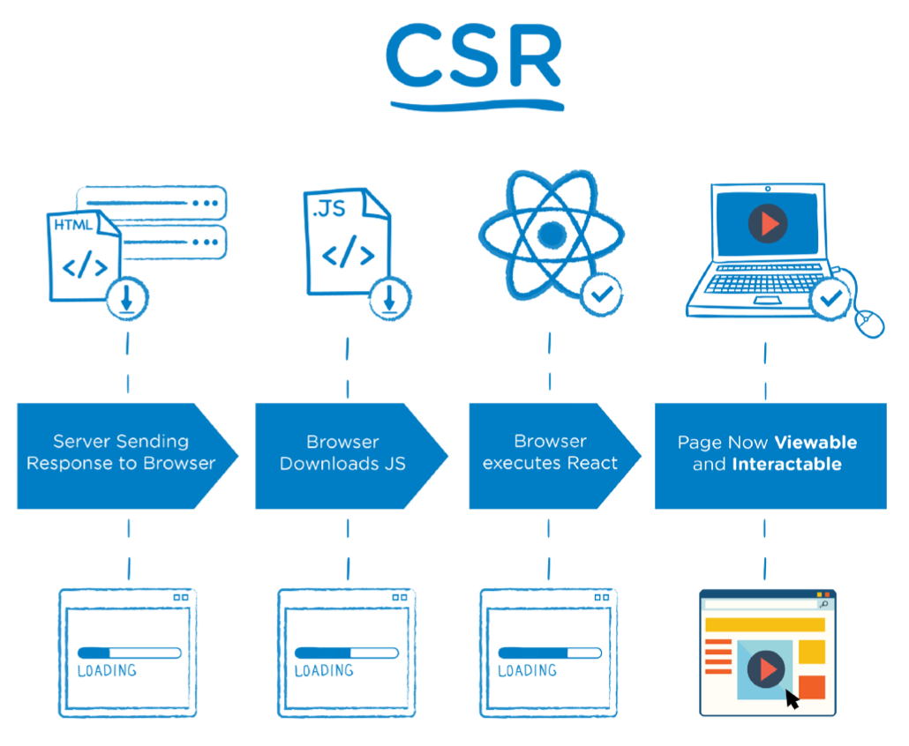
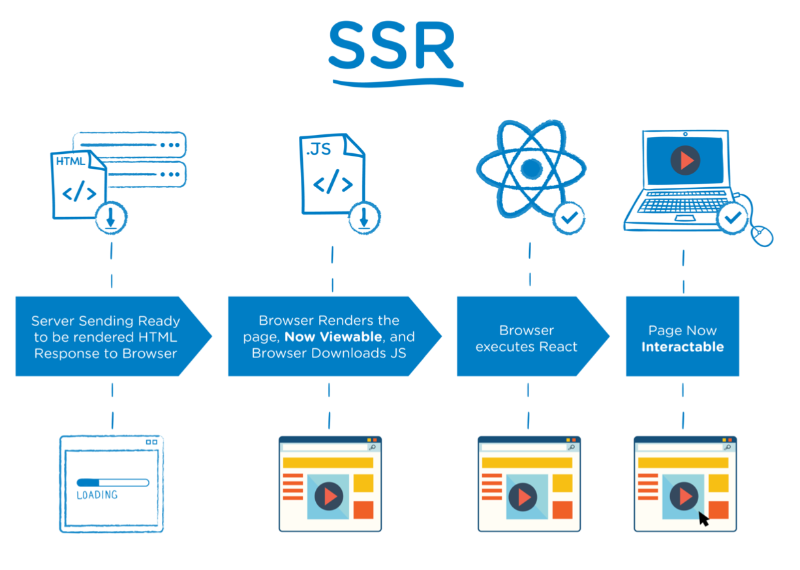

[TOC]

# React SSR

## React SSR 介绍

### 客户端渲染

CSR:Client Side Rendering
 服务器端仅返回 JSON 数据, DATA 和 HTML 在客户端进行渲染.


### 服务端渲染

SSR:Server Side Rendering
 服务器端返回HTML, DATA 和 HTML 在服务器端进行渲染.


### 客户端渲染存在的问题

1. 首屏等待时间长, 用户体验差 
2. 页面结构为空, 不利于 SEO


### SPA 应用中服务器端渲染解决的问题

 


### SPA 应用中服务器端渲染解决的问题	




### React SSR 同构

同构指的是代码复用. 即实现客户端和服务器端最大程度的代码复用.


## 服务器端渲染快速开始

### 项目结构

```txt
react-ssr
 	src 源代码文件夹
		client 客户端代码 
		server 服务器端代码 
		share 同构代码
```


### 创建 Node 服务器

```js
import express from "express";

const app = express();
app.use(express.static('public'))

app.listen(3000, () => console.log("app is running on 3000 port"));

export default app
```


### 实现 React SSR

1. 引入要渲染的 React 组件

2. 通过 renderToString 方法将 React 组件转换为 HTML 字符串 

3. 将结果HTML字符串想到到客户端

renderToString 方法用于将 React 组件转换为 HTML 字符串, 通过 react-dom/server 导入.


### webpack 打包配置

问题: Node 环境不支持 ESModule 模块系统, 不支持 JSX 语法


### 项目启动命令配置

1. 配置服务器端打包命令: `"dev:server-build": "webpack --config webpack.server.js --watch" `
2. 配置服务端启动命令: `"dev:server-run": "nodemon --watch build --exec \"node build/bundle.js\""`


## 客户端 React 附加事件

### 实现思路分析

在客户端对组件进行二次"渲染", 为组件元素附加事件. 

客户端二次 "渲染" hydrate 使用 hydrate 方法对组件进行渲染, 为组件元素附加事件. hydrate 方法在实现渲染的时候, 会复用原本已经存在的 DOM 节点, 减少重新生成节点以及删除原本 DOM 节点的开销. 通过 react-dom 导入 hydrate.

```jsx
ReactDOM.hydrate(<App />, document.getElementById("root"));
```


### 客户端 React 打包配置

1. webpack 配置 打包目的: 转换JSX语法, 转换浏览器不识别的高级 JavaScript 语法 打包目标位置: public 文件夹

2. 打包启动命令配置 `"dev:client-build": "webpack --config webpack.client.js --watch"`

   

### 添加客户端包文件请求链接

在响应给客户端的 HTML 代码中添加 script 标签, 请求客户端 JavaScript 打包文件

```html
    <html>
      <head>
        <title>React SSR</title>
      </head>
      <body>
        <div id="root">${content}</div>
        <script src="bundle.js"></script>
      </body>
    </html>
```


### 服务器端实现静态资源访问

服务器端程序实现静态资源访问功能, 客户端 JavaScript 打包文件会被作为静态资源使用.

```js
app.use(express.static('public'))
```


## 优化

### 合并 webpack 配置 

服务器端 webpack 配置和客户端 webpack 配置存在重复. 将重复配置抽象到 webpack.base.js 配置文件中.

```js
const merge = require('webpack-merge');
const baseConfig = require('./webpack.base');
const config = {...};
module.exports = merge(baseConfig, config);                
```


### 合并项目启动命令

目的: 使用一个命令启动项目, 解决多个命令启动的繁琐问题. 通过 npm-run-all 工具实现.

`"dev": "npm-run-all --parallel dev:*"`


### 服务器端打包文件体积优化

问题：在服务器端打包文件中, 包含了 Node 系统模块. 导致打包文件本身体积庞大. 解决：通过 webpack 配置剔除打包文件中的 Node 模块.

```js
// webpack.server.js
const nodeExternals = require('webpack-node-externals');
const config = {
  externals: [nodeExternals()]
}
```


### 将启动服务器代码和渲染代码进行模块化拆分

优化代码组织方式, 渲染 React 组件代码是独立功能, 所以把它从服务器端入口文件中进行抽离.


## 路由支持

### 实现思路分析

在 React SSR 项目中需要实现两端路由. 客户端路由是用于支持用户通过点击链接的形式跳转页面. 服务器端路由是用于支持用户直接从浏览器地址栏中访问页面. 客户端和服务器端公用一套路由规则.


### 编写路由规则

```js
import Home from "../share/pages/Home";
import List from "../share/pages/List";

export default [
  {
    path: "/",
    component: Home,
    exact: true,
  },
  {
    path: "/list",
    ...List,
  },
];
```


### 实现服务器端路由

Express 路由接收任何请求 Express 路由接收所有 GET 请求, 服务器端 React 路由通过请求路径匹配要进行渲染的组件.

```js
app.get("*", async (req, res) => {});
```


服务器端路由配置

```js
import { StaticRouter } from "react-router-dom";
import { renderRoutes } from "react-router-config";
import routes from "../share/routers";

export default req => {
  const content = renderToString(
      <StaticRouter location={req.path}>
    		{renderRoutes(routes)}
      </StaticRouter>
  );
};
```


### 实现客户端路由

添加客户端路由配置

```js
import { BrowserRouter } from "react-router-dom";
import { renderRoutes } from "react-router-config";
import routes from "../share/routers";

ReactDOM.hydrate(
  <BrowserRouter>{renderRoutes(routes)}</BrowserRouter>,
  document.getElementById("root")
);

```


## Redux 支持

### 实现思路分析

在实现了 React SSR 的项目中需要实现两端 Redux. 客户端 Redux 就是通过客户端 JavaScript 管理 Store 中的数据. 服务器端 Redux 就是在服务器端搭建一套 Redux 代码, 用于管理组件中的数据. 客户端和服务器端共用一套 Reducer 代码. 创建 Store 的代码由于参数传递不同所以不可以共用.


### 实现客户端 Redux

1. 创建 Store 
2. 配置 Store 
3. 创建 Action 和 Reducer 
4. 配置 polyfill 由于浏览器不能识别异步函数代码, 所以需要 polyfill 进行填充.


### 实现服务器端 Redux

**创建 Store**

```js
import { applyMiddleware, createStore } from 'redux';
import thunk from 'redux-thunk';
import reducer from '../share/store/reducers';

export default () => createStore(reducer, {}, applyMiddleware(thunk));
```


**配置 Store**

```js
app.get("*", (req, res) => {
  const store = createStore();
	res.send(renderer(req, store));
});
```

```js
import { Provider } from "react-redux";

export default (req, store) => {
  const content = renderToString(
    <Provider store={store}>
      <StaticRouter location={req.path}>{renderRoutes(routes)}</StaticRouter>
    </Provider>
  );
};

```


### 服务器端 store 数据填充

问题：服务器端创建的 store 是空的, 组件并不能从Store中获取到任何数据. 解决：服务器端在渲染组件之前获取到组件所需要的数据.

1. 在组件中添加 loadData 方法, 此方法用于获取组件所需数据，方法被服务器端调用 
2. 将 loadData 方法保存在当前组件的路由信息对象中. 
3. 服务器端在接收到请求后，根据请求地址匹配出要渲染的组件的路由信息 
4. 从路由信息中获取组件中的 loadData 方法并调用方法获取组件所需数据 
5. 当数据获取完成以后再渲染组件并将结果响应到客户端


**组件 loadData 方法**

服务器端通过调用组件的 loadData 方法获取组件所需数据并将数据存储在服务器端的 Store 中

```js
export function loadData (store) {
  // dispatch 方法的返回值是要触发的 action 对象
  // 但现在通过使用 thunk 触发 action 时 返回的是异步函数
  // 异步函数的返回值是promise 所以此处的返回值就是promise
  return store.dispatch(fetchUser());
}
```


**服务器端获取组件所需数据**

服务器端 store 数据填充 服务器端在接收到请求以后，先根据请求路径分析出要渲染的路由信息，再从路由信息中得到 loadData方法.

```js
app.get("*", (req, res) => {
  const store = createStore();

  const promises = matchRoutes(routes, req.path).map(({ route }) => {
    if (route.loadData) return route.loadData(store);
  });

  Promise.all([promises]).then(() => res.send(renderer(req, store)));
});
```


**React 警告消除**

警告原因: 客户端 Store 在初始状态下是没有数据的, 在渲染组件的时候生成的是空 ul, 但是服务器端是先获取数据再进行的组件渲染, 所以生成的是有子元素的ul, hydrate 方法在对比的时候发现两者不一致, 所以报了个警告. 解决思路: 将服务器端获取到的数据回填给客户端, 让客户端拥有初始数据.


**服务器响应 Store 初始状态**

```js
  const initialState = store.getState();

  return `
    <html>
      <head>
        <title>React SSR</title>
      </head>
      <body>
        <div id="root">${content}</div>
        <script>window.INITIAL_STATE = ${JSON.stringify(initialState)}</script>
        <script src="bundle.js"></script>
      </body>
    </html>
  `;
```


**客户端设置 Store 初始状态**

```js
const store = createStore(reducer, window.INITIAL_STATE, applyMiddleware(thunk));
```


### 防范 XSS 攻击

转义状态中的恶意代码.

```js
  let response = {
    data: [{id: 1, name: "</script><script>alert(1)</script>"}]
  }
  
  import serialize from "serialize-javascript";

  const initialState = serialize(store.getState());
```

