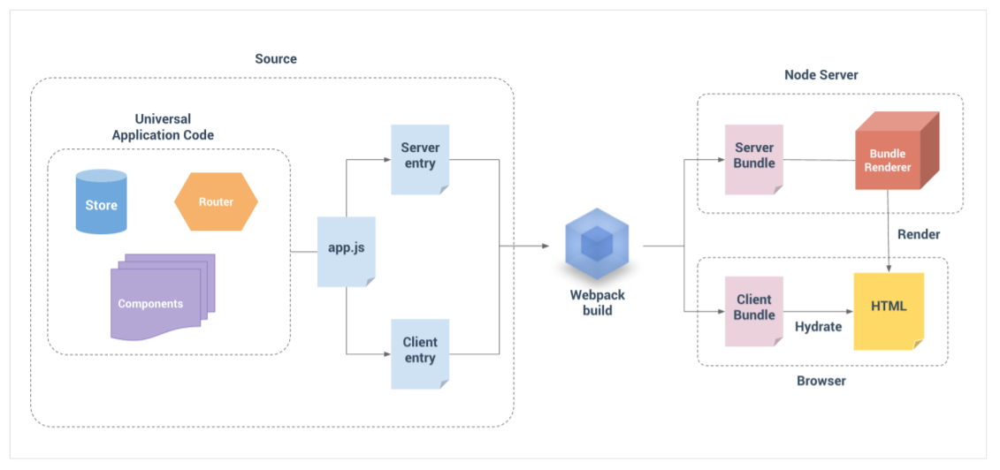
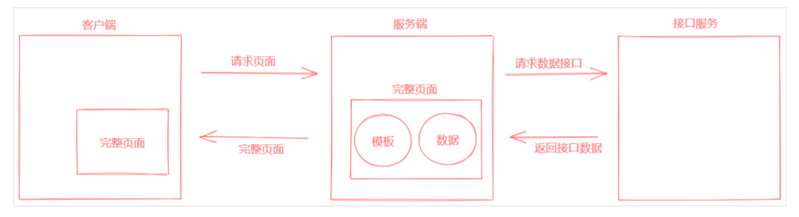

[TOC]

# Vue SSR

## 介绍

+ 官方文档：https://ssr.vuejs.org/ 
+ Vue SSR（Vue.js Server-Side Rendering） 是 Vue.js 官方提供的一个服务端渲染（同构应用）解 决方案 
+ 使用它可以构建同构应用 
+ 还是基于原有的 Vue.js 技术栈

> 官方文档的解释：Vue.js 是构建客户端应用程序的框架。默认情况下，可以在浏览器中输出 Vue 组件，进行生成 DOM 和操作 DOM。然而，也可以将同一个组件渲染为服务器端的 HTML 字符 串，将它们直接发送到浏览器，最后将这些静态标记"激活"为客户端上完全可交互的应用程序。 服务器渲染的 Vue.js 应用程序也可以被认为是"同构"或"通用"，因为应用程序的大部分代码都可 以在服务器和客户端上运行。


## 使用场景

在对你的应用程序使用服务器端渲染 (SSR) 之前，你应该问的第一个问题是，是否真的需要它。 

技术层面： 

+ 更快的首屏渲染速度 

+ 更好的 SEO 

  

业务层面： 

+ 不适合管理系统 
+ 适合门户资讯类网站，例如企业官网、知乎、简书等 
+ 适合移动网站


## 如何实现 Vue SSR

（1）基于 Vue SSR 官方文档提供的解决方案 

官方方案具有更直接的控制应用程序的结构，更深入底层，更加灵活，同时在使用官方方案的过程中， 也会对Vue SSR有更加深入的了解。 

该方式需要你熟悉 Vue.js 本身，并且具有 Node.js 和 webpack 的相当不错的应用经验。


（2）Nuxt.js 开发框架 

NUXT提供了平滑的开箱即用的体验，它建立在同等的Vue技术栈之上，但抽象出很多模板，并提供了 一些额外的功能，例如静态站点生成。通过 Nuxt.js 可以快速的使用 Vue SSR 构建同构应用。


## Vue SSR 基本使用

接下来我们以 Vue SSR 的官方文档为参考，来学习一下它的基本用法。

### 渲染一个 Vue 实例

> 目标： 
>
> + 了解如何使用 VueSSR 将一个 Vue 实例渲染为 HTML 字符串

首先我们来学习一下服务端渲染中最基础的工作：模板渲染。 

说白了就是如何在服务端使用 Vue 的方式解析替换字符串。 

在它的官方文档中其实已经给出了示例代码，下面我们来把这个案例的实现过程以及其中含义演示一 下。

```bash
mkdir demo01
cd demo01
npm install vue vue-server-renderer
```

`demo01/index.js` ：

```js
// 第 1 步：创建一个 Vue 实例
const Vue = require("vue");
const app = new Vue({
  template: `<div>{{ message }}</div>`,
  data: {
    message: "Hello World",
  },
});
// 第 2 步：创建一个 renderer
const renderer = require("vue-server-renderer").createRenderer();
// 第 3 步：将 Vue 实例渲染为 HTML
renderer.renderToString(app, (err, html) => {
  if (err) throw err;
  console.log(html);
  // => <div data-server-rendered="true">Hello World</div>
});
// 在 2.5.0+，如果没有传入回调函数，则会返回 Promise：
renderer
  .renderToString(app)
  .then((html) => {
    console.log(html);
  })
  .catch((err) => {
    console.error(err);
  });
```


### 与服务器集成

在 Node.js 服务器中使用时相当简单直接，例如 Express。 首先安装 Express 到项目中：

```bash
npm i express
```

然后使用 Express 创建一个基本的 Web 服务：

```js
const express = require("express");
const app = express();
app.get("/", (req, res) => {
  res.send("Hello World!");
});
app.listen(3000, () => console.log("app listening at http://localhost:port"));
```

启动 Web 服务：

```bash
nodemon index.js
```

在 Web 服务中渲染 Vue 实例：

```js
const Vue = require("vue");
const server = require("express")();
const renderer = require("vue-server-renderer").createRenderer();
server.get("*", (req, res) => {
  const app = new Vue({
    data: {
      url: req.url,
    },
    template: `<div>访问的 URL 是： {{ url }}</div>`,
  });
  renderer.renderToString(app, (err, html) => {
    if (err) {
      res.status(500).end("Internal Server Error");
      return;
    }
    res.end(`
<!DOCTYPE html>
<html lang="en">
<head>
<title>Hello</title>
<meta charset="UTF-8">
</head>
<body>${html}</body>
</html>
`);
  });
});
server.listen(8080);
```


### 使用一个页面模板

新建一个 `index-template.html`：

```html
<!DOCTYPE html>
<html lang="en">
  <head>
    <title>Hello</title>
    <meta charset="UTF-8" />
  </head>
  <body>
    <!--vue-ssr-outlet-->
  </body>
</html>
```

在页面的某个位置写入 `<!--vue-ssr-outlet-->` 标记，将来 `vue-server-renderer`渲染出来的html字符串将替换掉该标记的内容。

然后指定 `vue-server-renderer` 的渲染模板：

```js
const fs = require('fs')
const renderer = require("vue-server-renderer").createRenderer({
  template: fs.readFileSync('./index-template.html', 'utf-8')
});
```

最后服务端响应 `renderToString` 生成的html即可。生成的html将会替换掉 `<!--vue-ssr-outlet-->` 标记的内容：

```js
renderer.renderToString(app, (err, html) => {
  if (err) {
    res.status(500).end("internal server error");
  }
  res.setHeader("content-type", "text/html; charset=utf8");
  res.end(html);
});
```


### 模板中使用外部数据

在 `renderToString` 方法的第二个参数传入数据对象：

```js
renderer.renderToString(
  app,
  {
    title: "陈泽华",
    meta: `<meta name="description" content="陈泽华的描述">`,
  },
  (err, html) => {
    if (err) {
      res.status(500).end("internal server error");
    }
    res.setHeader("content-type", "text/html; charset=utf8");
    res.end(html);
  }
);

```

在模板中使用 `{{}}` 模板语法，渲染时将会替换对应的内容。

**注意：如果想渲染html标签，则需要使用 `{{{}}}`。**

```html
<!DOCTYPE html>
<html lang="en">
  <head>
    <title>{{ title }}</title>
    {{{ meta }}}
    <meta charset="UTF-8" />
  </head>
  <body>
    <!--vue-ssr-outlet-->
  </body>
</html>
```


## 构建同构渲染

### 构建流程




### 源码结构

我们需要使用 webpack 来打包我们的 Vue 应用程序。事实上，我们可能需要在服务器上使用 webpack 打包 Vue 应用程序，因为：

+ 通常 Vue 应用程序是由 webpack 和 vue-loader 构建，并且许多 webpack 特定功能不能直接在 Node.js 中运行（例如通过 file-loader 导入文件，通过 css-loader 导入 CSS）。
+ 尽管 Node.js 最新版本能够完全支持 ES2015 特性，我们还是需要转译客户端代码以适应老版浏览 器。这也会涉及到构建步骤。


所以基本看法是，对于客户端应用程序和服务器应用程序，我们都要使用 webpack 打包 - 服务器需要 「服务器 bundle」然后用于服务器端渲染(SSR)，而「客户端 bundle」会发送给浏览器，用于混合静 态标记。 

现在我们正在使用 webpack 来处理服务器和客户端的应用程序，大部分源码可以使用通用方式编写， 可以使用 webpack 支持的所有功能。同时，在编写通用代码时，有一些事项要牢记在心。 

一个基本项目可能像是这样：

```bash
src
├── components
│ ├── Foo.vue
│ ├── Bar.vue
│ └── Baz.vue
├── App.vue
├── app.js # 通用 entry(universal entry)
├── entry-client.js # 仅运行于浏览器
└── entry-server.js # 仅运行于服务器
```

`App.vue`：

```vue
<template>
  <!-- 客户端渲染的入口节点 -->
  <div id="app">
    <h1>标题</h1>
  </div>
</template>
<script>
export default {
  name: 'App',
}
</script>
<style></style>
```

`app.js`：

`app.js` 是我们应用程序的「通用 entry」。在纯客户端应用程序中，我们将在此文件中创建根 Vue 实 例，并直接挂载到 DOM。但是，对于服务器端渲染(SSR)，责任转移到纯客户端 entry 文件。`app.js` 简单地使用 export 导出一个 `createApp` 函数：

```js
import Vue from 'vue'
import App from './App.vue'
// 导出一个工厂函数，用于创建新的
// 应用程序、router 和 store 实例
export function createApp() {
  const app = new Vue({
    // 根实例简单的渲染应用程序组件。
    render: (h) => h(App),
  })
  return { app }
}
```

`entry-client.js`：

客户端 entry 只需创建应用程序，并且将其挂载到 DOM 中：

```js
import { createApp } from './app'
// 客户端特定引导逻辑……
const { app } = createApp()
// 这里假定 App.vue 模板中根元素具有 `id="app"`
app.$mount('#app')
```

`entry-server.js`：

服务器 entry 使用 default export 导出函数，并在每次渲染中重复调用此函数。此时，除了创建和返回 应用程序实例之外，它不会做太多事情 - 但是稍后我们将在此执行服务器端路由匹配 (server-side route matching) 和数据预取逻辑 (data pre-fetching logic)。

```js
import { createApp } from './app'
export default (context) => {
  const { app } = createApp()
  return app
}
```

`server.js`：

```js
/**
 * 通用应用 Web 服务启动脚本
 */
const express = require('express')
const Vue = require('vue')
const VueServerRenderer = require('vue-server-renderer')
const fs = require('fs')
// 创建一个 express 实例
const server = express()
// 生成一个渲染器
const renderer = VueServerRenderer.createRenderer({
  // 渲染器就会自动把渲染的结果注入到模板中
  template: fs.readFileSync('./index.html', 'utf-8'),
})
const createApp = () => {
  const app = new Vue({
    template: `
<div id="app">
<h1>Hello {{ message }}</h1>
<input v-model="message">
</div>
`,
    data: {
      message: 'World',
    },
  })
  return app
}
server.get('/foo', (req, res) => {
  const app = createApp()
  app.message = '世界'
  res.end('foo')
})
// 设置一个路由
server.get('/', async (req, res) => {
  // const app = new Vue({
  // template: `
  // <div id="app">
  // <h1>Hello {{ message }}</h1>
  // <input v-model="message">
  // </div>
  // `,
  // data: {
  // message: 'World'
  // }
  // })
  try {
    const app = createApp()
    const ret = await renderer.renderToString(app, {
      title: '自定义页面标题',
      meta: `
    <meta name="description" content="hello world">
    `,
    })
    res.end(ret)
  } catch (err) {
    res.status(500).end('Internal Server Error.')
  }
})
// 监听端口，启动 Web 服务
server.listen(3000, () => {
  console.log('running at port 3000.')
})
```

`index.template.html`：

```html
<!DOCTYPE html>
<html lang="en">
  <head>
    <meta charset="UTF-8" />
    <meta name="viewport" content="width=device-width, initial-scale=1.0" />
    <title>标题</title>
  </head>
  <body>
    <!-- 服务端渲染的内容出口 -->
    <!--vue-ssr-outlet-->
  </body>
</html>
```


### 构建配置

#### 安装依赖

（1）安装生产依赖

```bash
npm i vue vue-server-renderer express cross-env
```

| 包                  | 说明                                |
| ------------------- | ----------------------------------- |
| vue                 | Vue.js 核心库                       |
| vue-server-renderer | Vue 服务端渲染工具                  |
| express             | 基于 Node 的 Web 服务框架           |
| cross-env           | 通过 npm scripts 设置跨平台环境变量 |


（2）安装开发依赖

```bash
npm i -D webpack webpack-cli webpack-merge webpack-node-externals @babel/core
@babel/plugin-transform-runtime @babel/preset-env babel-loader css-loader url-loader file-loader rimraf vue-loader vue-template-compiler friendly-errorswebpack-plugin
```

| 包                                                           | 说明                                   |
| ------------------------------------------------------------ | -------------------------------------- |
| webpack                                                      | webpack 核心包                         |
| webpack-cli                                                  | webpack 的命令行工具                   |
| webpack-merge                                                | webpack 配置信息合并工具               |
| webpack-node-externals                                       | 排除 webpack 中的 Node 模块            |
| rimraf                                                       | 基于 Node 封装的一个跨平台 rm -rf 工具 |
| friendly-errors-webpack-plugin                               | 友好的 webpack 错误提示                |
| @babel/core @babel/plugin-transform-runtime @babel/preset-env babel-loader | Babel 相关工具                         |
| vue-loader vue-template-compiler                             | 处理 .vue 资源                         |
| file-loader                                                  | 处理字体资源                           |
| css-loader                                                   | 处理 CSS 资源                          |
| url-loader                                                   | 处理图片资源                           |


#### 配置文件及打包命令

（1）初始化 webpack 打包配置文件

```bash
build
├── webpack.base.config.js # 公共配置
├── webpack.client.config.js # 客户端打包配置文件
└── webpack.server.config.js # 服务端打包配置文件
```

`webpack.base.config.js`：

```js
/**
 * 公共配置
 */
const VueLoaderPlugin = require("vue-loader/lib/plugin");
const path = require("path");
const FriendlyErrorsWebpackPlugin = require("friendly-errors-webpack-plugin");
const resolve = (file) => path.resolve(__dirname, file);
const isProd = process.env.NODE_ENV === "production";
module.exports = {
  mode: isProd ? "production" : "development",
  output: {
    path: resolve("../dist/"),
    publicPath: "/dist/",
    filename: "[name].[chunkhash].js",
  },
  resolve: {
    alias: {
      // 路径别名，@ 指向 src
      "@": resolve("../src/"),
    },
    // 可以省略的扩展名
    // 当省略扩展名的时候，按照从前往后的顺序依次解析
    extensions: [".js", ".vue", ".json"],
  },
  devtool: isProd ? "source-map" : "cheap-module-eval-source-map",
  module: {
    rules: [
      // 处理图片资源
      {
        test: /\.(png|jpg|gif)$/i,
        use: [
          {
            loader: "url-loader",
            options: {
              limit: 8192,
            },
          },
        ],
      },
      // 处理字体资源
      {
        test: /\.(woff|woff2|eot|ttf|otf)$/,
        use: ["file-loader"],
      },
      // 处理 .vue 资源
      {
        test: /\.vue$/,
        loader: "vue-loader",
      }, // 处理 CSS 资源
      // 它会应用到普通的 `.css` 文件
      // 以及 `.vue` 文件中的 `<style>` 块
      {
        test: /\.css$/,
        use: ["vue-style-loader", "css-loader"],
      },
      // CSS 预处理器，参考：https://vue-loader.vuejs.org/zh/guide/preprocessors.html
      // 例如处理 Less 资源
      // {
      // test: /\.less$/,
      // use: [
      // 'vue-style-loader',
      // 'css-loader',
      // 'less-loader'
      // ]
      // },
    ],
  },
  plugins: [new VueLoaderPlugin(), new FriendlyErrorsWebpackPlugin()],
};
```

`webpack.client.config.js`：

```js
/**
 * 客户端打包配置
 */
const { merge } = require("webpack-merge");
const baseConfig = require("./webpack.base.config.js");
const VueSSRClientPlugin = require("vue-server-renderer/client-plugin");
module.exports = merge(baseConfig, {
  entry: {
    app: "./src/entry-client.js",
  },
  module: {
    rules: [
      // ES6 转 ES5
      {
        test: /\.m?js$/,
        exclude: /(node_modules|bower_components)/,
        use: {
          loader: "babel-loader",
          options: {
            presets: ["@babel/preset-env"],
            cacheDirectory: true,
            plugins: ["@babel/plugin-transform-runtime"],
          },
        },
      },
    ],
  },
  // 重要信息：这将 webpack 运行时分离到一个引导 chunk 中，
  // 以便可以在之后正确注入异步 chunk。
  optimization: {
    splitChunks: {
      name: "manifest",
      minChunks: Infinity,
    },
  },
  plugins: [
    // 此插件在输出目录中生成 `vue-ssr-client-manifest.json`。
    new VueSSRClientPlugin(),
  ],
});
```

`webpack.server.config.js`：

```js
/**
 * 服务端打包配置
 */
const { merge } = require("webpack-merge");
const nodeExternals = require("webpack-node-externals");
const baseConfig = require("./webpack.base.config.js");
const VueSSRServerPlugin = require("vue-server-renderer/server-plugin");
module.exports = merge(baseConfig, {
  // 将 entry 指向应用程序的 server entry 文件
  entry: "./src/entry-server.js",
  // 这允许 webpack 以 Node 适用方式处理模块加载
  // 并且还会在编译 Vue 组件时，
  // 告知 `vue-loader` 输送面向服务器代码(server-oriented code)。
  target: "node",
  output: {
    filename: "server-bundle.js",
    // 此处告知 server bundle 使用 Node 风格导出模块(Node-style exports)
    libraryTarget: "commonjs2",
  },
  // 不打包 node_modules 第三方包，而是保留 require 方式直接加载
  externals: [
    nodeExternals({
      // 白名单中的资源依然正常打包
      allowlist: [/\.css$/],
    }),
  ],
  plugins: [
    // 这是将服务器的整个输出构建为单个 JSON 文件的插件。
    // 默认文件名为 `vue-ssr-server-bundle.json`
    new VueSSRServerPlugin(),
  ],
});
```


（2）在 npm scripts 中配置打包命令

```json
  "scripts": {
    "build:client": "cross-env NODE_ENV=production webpack --config build/webpack.client.config.js",
    "build:server": "cross-env NODE_ENV=production webpack --config build/webpack.server.config.js",
    "build": "rimraf dist && npm run build:client && npm run build:server",
  },
```

运行测试：

```bash
npm run build:client
npm run build:server
npm run build
```


#### 启动应用

`server.js`：

```js
const Vue = require("vue");
const fs = require("fs");
const serverBundle = require("./dist/vue-ssr-server-bundle.json");
const template = fs.readFileSync("./index-template.html", "utf-8");
const clientManifest = require("./dist/vue-ssr-client-manifest.json");

const renderer = require("vue-server-renderer").createBundleRenderer(
  serverBundle,
  {
    template,
    clientManifest,
  }
);
const express = require("express");

const server = express();

server.use("/dist", express.static("./dist"));

server.get("/", (req, res) => {
  renderer.renderToString(
    {
      title: "陈泽华",
      meta: `<meta name="description" content="陈泽华的描述">`,
    },
    (err, html) => {
      if (err) {
        res.status(500).end("internal server error");
      }
      res.setHeader("content-type", "text/html; charset=utf8");
      res.end(html);
    }
  );
});

server.listen(3000, () => {
  console.log("listening port 3000");
});
```


### 解析渲染流程 

（1）服务端渲染

+ renderer.renderToString 渲染了什么？ 
+ renderer 是如何拿到 entry-server 模块的？ 
  + createBundleRenderer 中的 serverBundle
+  server Bundle 是 Vue SSR 构建的一个特殊的 JSON 文件 
  + entry：入口
  + files：所有构建结果资源列表
  + maps：源代码 source map 信息

+ server-bundle.js 就是通过 server.entry.js 构建出来的结果文件 
+ 最终把渲染结果注入到模板中


（2）客户端渲染

+ vue-ssr-client-manifest.json
  +  publicPath：访问静态资源的根相对路径，与 webpack 配置中的 publicPath 一致
  + all：打包后的所有静态资源文件路径
  + initial：页面初始化时需要加载的文件，会在页面加载时配置到 preload 中
  + async：页面跳转时需要加载的文件，会在页面加载时配置到 prefetch 中
  + modules：项目的各个模块包含的文件的序号，对应 all 中文件的顺序；moduleIdentifier和 和all数组中文件的映射关系（modules对象是我们查找文件引用的重要数据）

​    

## 构建开发模式

我们现在已经实现同构应用的基本功能了，但是这对于一个完整的应用来说还远远不够，例如如何处理 同构应用中的路由、如何在服务端渲染中进行数据预取等功能。这些功能我们都会去对它进行实现，但 是在实现它们之前我们要先来解决一个关于打包的问题：

+ 每次写完代码，都要重新打包构建 
+ 重新启动 Web 服务 
+ 很麻烦...

所以下面我们来实现项目中的开发模式构建，也就是我们希望能够实现： 

+ 写完代码，自动构建 
+ 自动重启 Web 服务 
+ 自动刷新页面内容 
+ ...


### 基本思路 

+ 生产模式 
  + npm run build 构建 
  + node server.js 启动应用 
+ 开发模式 
  + 监视代码变动自动构建，热更新等功能 
  + node server.js 启动应用 

所以我们设计了这样的启动脚本：

```json
  "scripts": {
    "dev": "node server.js",
    "start": "cross-env NODE_ENV=production && node server.js"
  },
```


服务端配置：

```js
/**
 * 服务端入口，仅运行于服务端
 */
const express = require('express')
const path = require('path')
const fs = require('fs')
const { createBundleRenderer } = require('vue-server-renderer')
const isProd = process.env.NODE_ENV === 'production'
const templatePath = './index.html'
let renderer
// 生产模式，直接基于已构建好的包创建渲染器
if (isProd) {
  const template = fs.readFileSync(templatePath, 'utf-8')
  const serverBundle = require('./dist/vue-ssr-server-bundle.json')
  const clientManifest = require('./dist/vue-ssr-client-manifest.json')
  renderer = createBundleRenderer(serverBundle, {
    runInNewContext: false, // 推荐
    template, // （可选）页面模板
    clientManifest, // （可选）客户端构建 manifest
  })
} else {
  // 开发模式 -> 监视打包构建（客户端 + 服务端） -> 重新生成 Renderer 渲染器
}
const server = express()
server.use(express.static(path.resolve(__dirname, './dist/')))

async function render(req, res) {
  const context = { url: req.url }
  // 这里无需传入一个应用程序，因为在执行 bundle 时已经自动创建过。
  // 现在我们的服务器与应用程序已经解耦！
  // bundle renderer 在调用 renderToString 时，
  // 它将自动执行「由 bundle 创建的应用程序实例」所导出的函数（传入上下文作为参数），然后渲染它。
  try {
    const html = await renderer.renderToString(context)
    res.send(html)
  } catch (err) {
    res.status(500).end(err.message)
  }
}
server.get(
  '*',
  isProd
    ? render // 生产模式：使用构建好的包直接渲染
    : (req, res) => {
        // 开发模式：等待有了 Renderer 渲染器之后，调用 render 进行渲染
      	render()
      }
)
server.listen(8080, () => console.log('running 8080'))
```


### 封装处理模块

`build/setup-dev-server.js`：

```js
module.exports = function (app, templatePath, cb) {
  let ready
  const onReady = new Promise((r) => (ready = r))
  let serverBundle
  let clientManifest
  let template
  const update = () => {
    if (serverBundle && clientManifest) {
      // 构建完毕，通知 server 可以 render 渲染了
      ready()
      // 更新 server 中的 Renderer
      cb(serverBundle, {
        template,
        clientManifest,
      })
    }
  }
  // 监视构建 template，调用 update 更新 Renderer
  // 监视构建 serverBundle，调用 update 更新 Renderer
  // 监视构建 clientManifest，调用 update 更新 Renderer
  return onReady
}
```

`server.js`：

```js
/**
 * 服务端入口，仅运行于服务端
 */
const express = require('express')
const path = require('path')
const fs = require('fs')
const { createBundleRenderer } = require('vue-server-renderer')
const isProd = process.env.NODE_ENV === 'production'
const templatePath = './index.html'
const app = express()
let renderer
let onReady
// 生产模式，直接基于已构建好的包创建渲染器
if (isProd) {
  const template = fs.readFileSync(templatePath, 'utf-8')
  const serverBundle = require('./dist/vue-ssr-server-bundle.json')
  const clientManifest = require('./dist/vue-ssr-client-manifest.json')
  renderer = createBundleRenderer(serverBundle, {
    runInNewContext: false, // 推荐
    template, // （可选）页面模板
    clientManifest, // （可选）客户端构建 manifest
  })
} else {
  // 开发模式
  // 打包构建（客户端 + 服务端）
  // ↓
  // 创建渲染器
  // 模板 + 客户端 bundle + 服务端 bundle
  // 改变 -> 从新生成渲染器
  // 源码改变 -> 打包客户端 Bundle + 服务端 Bundle
  // onReady 是一个 Promise,当它完成的时候意味着初始构建已完成
  onReady = require('./build/setup-dev-server')(
    app,
    templatePath,
    (serverBundle, options) => {
      // 该回调函数是重复调用的
      // 每当生成新的 template、客户端 bundle、服务端 bundle 都会重新生成新的渲染器
      renderer = createBundleRenderer(serverBundle, {
        runInNewContext: false, // 推荐
        ...options,
      })
    }
  )
}
app.use(express.static(path.resolve(__dirname, './dist/')))
async function render(req, res) {
  const context = { url: req.url }
  // 这里无需传入一个应用程序，因为在执行 bundle 时已经自动创建过。
  // 现在我们的服务器与应用程序已经解耦！
  // bundle renderer 在调用 renderToString 时，
  // 它将自动执行「由 bundle 创建的应用程序实例」所导出的函数（传入上下文作为参数），然后渲染它。
  try {
    const html = await renderer.renderToString(context)
    res.send(html)
  } catch (err) {
    res.status(500).end(err.message)
  }
}
app.get(
  '*',
  isProd
    ? render // 生产模式：使用构建好的包直接渲染
    : async (req, res) => {
        // 开发模式：等第一次构建好再渲染
        await onReady
        render(req, res)
      }
)
app.listen(8080, () => console.log('running 8080'))
```


### 更新模板

关于 Node 中的监视的问题：

+ fs.watch
+ fs.watchFile
+ 第三方包：chokidar

```js
// 监视构建 template，调用 update 更新 Renderer
template = fs.readFileSync(templatePath, 'utf-8')
chokidar.watch(templatePath).on('change', () => {
  template = fs.readFileSync(templatePath, 'utf-8')
  console.log('template updated.')
  update()
})
```

> 注意：使用 chokidar 监视文件变化在 vscode 中有问题，不影响整体功能。


### 更新服务端打包

```js
// 监视服务端打包构建
const serverConfig = require('./webpack.server.config')
const serverCompiler = webpack(serverConfig)
serverCompiler.watch(
  {
    // 监视打包的可选配置参数
  },
  (err, stats) => {
    // console.log('err => ', err)
    // console.log('stats => ', stats)
    if (err) throw err
    if (stats.hasErrors()) return
    // read bundle generated by vue-ssr-webpack-plugin
    serverBundle = JSON.parse(
      fs.readFileSync('./dist/vue-ssr-server-bundle.json', 'utf-8')
    )
    // 更新 Renderer
    update()
  }
)
```


### 将打包结果存储到内存中

webpack 默认会把构建结果存储到磁盘中，对于生产模式构建来说是没有问题的；但是我们在开发模 式中会频繁的修改代码触发构建，也就意味着要频繁的操作磁盘数据，而磁盘数据操作相对于来说是比 较慢的，所以我们有一种更好的方式，就是把数据存储到内存中，这样可以极大的提高构建的速度。 

memfs 是一个兼容 Node 中 fs 模块 API 的内存文件系统，通过它我们可以轻松的实现把 webpack 构 建结果输出到内存中进行管理。 

方案一：自己配置 memfs。

```js
const { createFsFromVolume, Volume } = require('memfs')
// 自定义 webpack 把数据写入内存中
serverCompiler.outputFileSystem = createFsFromVolume(new Volume())
// memfs 模块去除了 join 方法，所以这里我们需要手动的给它提供 join 方法
serverCompiler.outputFileSystem.join = path.join.bind(path)
serverCompiler.watch(
  {
    // 监视构建的配置选项
  },
  (err, stats) => {
    // 每当构建成功，就会执行该回调函数
    if (err) {
      throw err
    }
    if (stats.hasErrors()) {
      return
    }
    // 读取打包之后的最新结果
    serverBundle = JSON.parse(
      serverCompiler.outputFileSystem.readFileSync(
        resolve('../dist/vuessr-server-bundle.json'),
        'utf-8'
      )
    )
    // update 更新
    update()
  }
)
```


方案二：使用 webpack-dev-middleware。

webpack-dev-middleware 作用是，以监听模式启动 webpack，将编译结果输出到内存中，然后将内 存文件输出到 Express 服务中。

安装依赖：

```bash
npm i -D webpack-dev-middleware
```

配置到构建流程中：

```js
// 监视构建 serverBundle -> 调用 update -> 更新 Renderer 渲染器
const serverConfig = require('./webpack.server.config')
const serverCompiler = webpack(serverConfig)
webpackDevMiddleware(serverCompiler, {
  logLevel: 'silent',
})
serverCompiler.hooks.done.tap('server', () => {
  serverBundle = JSON.parse(
    serverCompiler.outputFileSystem.readFileSync(
      resolve('../dist/vue-ssrserver-bundle.json'),
      'utf-8'
    )
  )
  // console.log(serverBundle)
  update()
})
```


### 更新客户端打包

```js
// 监视构建 serverBundle -> 调用 update -> 更新 Renderer 渲染器
const clientConfig = require('./webpack.client.config')
const clientCompiler = webpack(clientConfig)
clientDevMiddleware = webpackDevMiddleware(clientCompiler, {
  publicPath: clientConfig.output.publicPath, // 重要！输出资源的访问路径前缀，应该和客户端打包输出的 publicPath 一致
  logLevel: 'silent',
})
clientCompiler.hooks.done.tap('client', () => {
  clientManifest = JSON.parse(
    clientCompiler.outputFileSystem.readFileSync(
      resolve('../dist/vue-ssrclient-manifest.json'),
      'utf-8'
    )
  )
  update()
})
// 重要！将内存中的资源通过 Express 中间件对外公开访问
server.use(clientDevMiddleware)
```


### 热更新

热更新功能需要使用到 [webpack-hot-middleware](https://github.com/webpack-contrib/webpack-hot-middleware) 工具包。

安装依赖：

```bash
npm install --save-dev webpack-hot-middleware
```

```js
const hotMiddleware = require('webpack-hot-middleware')
// 监视构建 serverBundle -> 调用 update -> 更新 Renderer 渲染器
const clientConfig = require('./webpack.client.config')
// ====================== 热更新配置 ============================
clientConfig.plugins.push(new webpack.HotModuleReplacementPlugin())
clientConfig.entry.app = [
  'webpack-hot-middleware/client?reload=true&noInfo=true',
  clientConfig.entry.app,
]
clientConfig.output.filename = '[name].js'
// ======================== /热更新配置 ==========================
const clientCompiler = webpack(clientConfig)
clientDevMiddleware = webpackDevMiddleware(clientCompiler, {
  publicPath: clientConfig.output.publicPath,
  logLevel: 'silent',
})
clientCompiler.hooks.done.tap('client', () => {
  clientManifest = JSON.parse(
    clientCompiler.outputFileSystem.readFileSync(
      resolve('../dist/vue-ssrclient-manifest.json'),
      'utf-8'
    )
  )
  update()
})
server.use(clientDevMiddleware)
// 挂载热更新的中间件
server.use(
  hotMiddleware(clientCompiler, {
    log: false,
  })
)
```

工作原理：

+ 中间件将自身安装为 webpack 插件，并侦听编译器事件。
+ 每个连接的客户端都有一个 Server Sent Events 连接，服务器将在编译器事件上向连接的客户端 发布通知。 
  + MDN - [使用服务器发送事件](https://developer.mozilla.org/zh-CN/docs/Server-sent_events/Using_server-sent_events)
  + [Server-Sent Events 教程](http://www.ruanyifeng.com/blog/2017/05/server-sent_events.html)
+ 当客户端收到消息时，它将检查本地代码是否为最新。如果不是最新版本，它将触发 webpack 热 模块重新加载。


## 编写通用代码

我们现在终于把实现 Vue SSR 同构应用的基础环境搭建起来了，虽然还有很多不足之处，但是也能满足 我们当前的基本使用了。 

所以接下来我们就要把内容的核心转移到 Vue SSR 本身上了，那首先我们来了解一下编写通用应用的注 意事项，通过了解这些注意事项对于如何正确的使用 Vue SSR 是非常有帮助的。 

在这些注意事项中，有些其实已经在前面的学习过程中了解过了，而有些还没有接触过，所以在这里通 过官方文档做一个简单的总结。


### 服务器上的数据响应

在纯客户端应用程序 (client-only app) 中，每个用户会在他们各自的浏览器中使用新的应用程序实例。 对于服务器端渲染，我们也希望如此：每个请求应该都是全新的、独立的应用程序实例，以便不会有交 叉请求造成的状态污染 (cross-request state pollution)。 

因为实际的渲染过程需要确定性，所以我们也将在服务器上“预取”数据 ("pre-fetching" data) - 这意味着 在我们开始渲染时，我们的应用程序就已经解析完成其状态。也就是说，将数据进行响应式的过程在服 务器上是多余的，所以默认情况下禁用。禁用响应式数据，还可以避免将「数据」转换为「响应式对 象」的性能开销。


### 组件生命周期钩子函数

由于没有动态更新，所有的生命周期钩子函数中，只有 `beforeCreate` 和 `created` 会在服务器端渲染 (SSR) 过程中被调用。这就是说任何其他生命周期钩子函数中的代码（例如 `beforeMount` 或 `mounted` ），只会在客户端执行。 

此外还需要注意的是，你应该避免在 `beforeCreate` 和 `created` 生命周期时产生全局副作用的代码， 例如在其中使用 `setInterval` 设置 timer。在纯客户端 (client-side only) 的代码中，我们可以设置一 个 timer，然后在 `beforeDestroy` 或 `destroyed` 生命周期时将其销毁。但是，由于在 SSR 期间并不 会调用销毁钩子函数，所以 timer 将永远保留下来。为了避免这种情况，请将副作用代码移动到 `beforeMount` 或 `mounted` 生命周期中。


### 访问特定平台(Platform-Specific) API

通用代码不可接受特定平台的 API，因此如果你的代码中，直接使用了像 `window` 或 `document` ，这种 仅浏览器可用的全局变量，则会在 Node.js 中执行时抛出错误，反之也是如此。 

对于共享于服务器和客户端，但用于不同平台 API 的任务(task)，建议将平台特定实现包含在通用 API 中，或者使用为你执行此操作的 library。例如，`axios` 是一个 HTTP 客户端，可以向服务器和客户端都 暴露相同的 API。 

对于仅浏览器可用的 API，通常方式是，在「纯客户端 (client-only)」的生命周期钩子函数中惰性访问 (lazily access) 它们。 

请注意，考虑到如果第三方 library 不是以上面的通用用法编写，则将其集成到服务器渲染的应用程序 中，可能会很棘手。你可能要通过模拟 (mock) 一些全局变量来使其正常运行，但这只是 hack 的做 法，并且可能会干扰到其他 library 的环境检测代码。


### 区分运行环境

```js
new webpack.DefinePlugin({
	'process.client': true,
	'process.server': false
});
```


### 自定义指令

大多数自定义指令直接操作 DOM，因此会在服务器端渲染 (SSR) 过程中导致错误。有两种方法可以解 决这个问题： 

1. 推荐使用组件作为抽象机制，并运行在「虚拟 DOM 层级(Virtual-DOM level)」（例如，使用渲染 函数(render function)）。 
2. 如果你有一个自定义指令，但是不是很容易替换为组件，则可以在创建服务器 renderer 时，使用 [`directives`](https://ssr.vuejs.org/zh/api/#directives) 选项所提供"服务器端版本(server-side version)"。


## 路由和代码分割

接下来我们来了解一下如何处理通用应用中的路由。 

官方文档给出的解决方案肯定还是使用 vue-router，整体使用方式和纯客户端的使用方式基本一致，只 需要在少许的位置做一些配置就可以了。文档中已经把配置的方式描述的很清楚了，建议大家认真看一 下文档，下面我把具体的实现来演示一下。

`router/index.js`：

```js
/**
 * 路由模块
 */
import Vue from "vue";
import VueRouter from "vue-router";
import Home from "@/pages/Home";
Vue.use(VueRouter);
export function createRouter() {
  const router = new VueRouter({
    mode: "history", // 同构应用不能使用 hash 路由，应该使用 history 模式
    routes: [
      {
        path: "/",
        name: "home",
        component: Home,
      },
      {
        path: "/about",
        name: "about",
        component: () => import("@/pages/About"),
      },
      {
        path: "*",
        name: "404",
        component: () => import("@/pages/404"),
      },
    ],
  });
  return router;
}
```

`app.js`：

```js
/**
 * 通用启动入口
 */
import Vue from "vue";
import App from "./App.vue";
import { createRouter } from "./router";
// 导出一个工厂函数，用于创建新的
// 应用程序、router 和 store 实例
export function createApp() {
  const router = createRouter();
  const app = new Vue({
    router, // 将 router 挂载到根实例
    // 根实例简单的渲染应用程序组件。
    render: (h) => h(App),
  });
  return { app, router };
}
```

`entry-server.js`：

```js
/**
 * 服务端启动入口
 */
import { createApp } from "./app";
export default async (context) => {
  const { app, router } = createApp();
  // set server-side router's location
  router.push(context.url);
  // wait until router has resolved possible async components and hooks
  await new Promise(router.onReady.bind(router));
  // const matchedComponents = router.getMatchedComponents()
  return app;
};
```

`server.js`：

```js
const render = async (req, res) => {
  const context = {
    url: req.url,
    meta: "",
    title: "标题",
  };
  try {
    const html = await renderer.renderToString(context);
    res.end(html);
  } catch (err) {
    res.status(500).end("Internal Server Error");
  }
};
server.get(
  "*",
  isProd
    ? render
    : async (req, res) => {
        // 等待有了 Renderer 渲染器以后，调用 render 进行渲染
        await onReady;
        render(req, res);
      }
);
```

`entry-client.js`：

```js
/**
 * 客户端入口
 */
import { createApp } from "./app";
// 客户端特定引导逻辑……
const { app, router } = createApp();
router.onReady(() => {
  app.$mount("#app");
});
```

`App.vue`：

最后要在 App.vue 根组件中来设置路由的出口，因为没有路由出口的话，匹配到的路由组件就不知道 要渲染到哪里。

```vue
<template>
  <div id="app">
    <ul>
      <li>
        <router-link to="/">Home</router-link>
      </li>
      <li>
        <router-link to="/about">About</router-link>
      </li>
    </ul>
    <!-- 路由出口 -->
    <router-view />
  </div>
</template>
<script>
export default {
  name: "App",
};
</script>
<style></style>
```

配置好出口以后，启动应用：

```bash
npm run dev
```

启动成功，访问页面。 

测试路由导航，可以看到正常工作，那说明我们同构应用中的路由产生作用了。

现在我们的应用就非常的厉害了，当你首次访问页面的时候，它是通过服务端渲染出来的，服务端渲染 拥有了更快的渲染速度以及更好的 SEO，当服务端渲染的内容来到客户端以后被客户端 Vue 结合 Vue Router 激活，摇身一变成为了一个客户端 SPA 应用，之后的页面导航也不需要重新刷新整个页面。这 样我们的网站就既拥有了更好的渲染速度，也拥有了更好的用户体验。

除此之外，我们在路由中配置的异步组件（也叫路由懒加载）也是非常有意义，它们会被分割为独立的 chunk（也就是单独的文件），只有在需要的时候才会进行加载。这样就能够避免在初始渲染的时候客 户端加载的脚本过大导致激活速度变慢的问题。关于它也可以来验证一下，通过 npm run build 打包构 建，我们发现它们确实被分割成了独立的 chunk。然后再来看一下在运行期间这些 chunk 文件是如何 加载的。

你会发现除了 app 主资源外，其它的资源也被下载下来了，你是不是要想说：不是应该在需要的时候才 加载吗？为什么一上来就加载了。 

原因是在页面的头部中的带有 preload 和 prefetch 的 link 标签。

我们期望客户端 JavaScript 脚本尽快加载尽早的接管服务端渲染的内容，让其拥有动态交互能力，但是 如果你把 script 标签放到这里的话，浏览器会去下载它，然后执行里面的代码，这个过程会阻塞页面的 渲染。

所以看到真正的 script 标签是在页面的底部的。而这里只是告诉浏览器可以去预加载这个资源。但是不 要执行里面的代码，也不要影响网页的正常渲染。直到遇到真正的 script 标签加载该资源的时候才会去 执行里面的代码，这个时候可能已经预加载好了，直接使用就可以了，如果没有加载好，也不会造成重 复加载，所以不用担心这个问题。

而 prefetch 资源是加载下一个页面可能用到的资源，浏览器会在空闲的时候对其进行加载，所以它并 不一定会把资源加载出来，而 preload 一定会预加载。所以你可以看到当我们去访问 about 页面的时 候，它的资源是通过 prefetch 预取过来的，提高了客户端页面导航的响应速度。 

好了，关于同构应用中路由的处理，以及代码分割功能就介绍到这里。


## 管理页面 Head

无论是服务端渲染还是客户端渲染，它们都使用的同一个页面模板。

页面中的 body 是动态渲染出来的，但是页面的 head 是写死的，也就说我们希望不同的页面可以拥有 自己的 head 内容，例如页面的 title、meta 等内容，所以下面我们来了解一下如何让不同的页面来定 制自己的 head 头部内容。

官方文档这里专门描述了关于页面 Head 的处理，相对于来讲更原生一些，使用比较麻烦。 

我这里主要给大家介绍一个第三方解决方案：[vue-meta](https://github.com/nuxt/vue-meta)。

Vue Meta 是一个支持 SSR 的第三方 Vue.js 插件，可让你轻松的实现不同页面的 head 内容管理。 

使用它的方式非常简单，而只需在页面组件中使用 `metaInfo` 属性配置页面的 head 内容即可。

```vue
<template>
  // ...
</template>
<script>
export default {
  metaInfo: {
    title: "My Example App",
    titleTemplate: "%s - Yay!",
    htmlAttrs: {
      lang: "en",
      amp: true,
    },
  },
};
</script>
```

页面渲染出来的结果：

```html
<html lang="en" amp>
<head>
<title>My Example App - Yay!</title>
	// ...
</head>
```


安装：

```bash
npm i vue-meta
```

在通用入口中通过插件的方式将 vue-meta 注册到 Vue 中。

```js
import Vue from "vue";
import VueMeta from "vue-meta";
Vue.use(VueMeta);
Vue.mixin({
  metaInfo: {
    titleTemplate: "%s - 标题",
  },
});
```

然后在服务端渲染入口模块中适配 vue-meta：

```js
// entry-server.js
import { createApp } from "./app";
export default async (context) => {
  // 因为有可能会是异步路由钩子函数或组件，所以我们将返回一个 Promise，
  // 以便服务器能够等待所有的内容在渲染前，
  // 就已经准备就绪。
  const { app, router } = createApp();
  const meta = app.$meta();
  // 设置服务器端 router 的位置
  router.push(context.url);
  context.meta = meta;
  // 等到 router 将可能的异步组件和钩子函数解析完
  await new Promise(router.onReady.bind(router));
  return app;
};
```

最后在模板页面中注入 meta 信息：

```html
<head>
	{{{ meta.inject().title.text() }}}
	{{{ meta.inject().meta.text() }}}
</head>
```


下面就是直接在组件中使用即可：

`Home.vue`：

```vue
{
	metaInfo: {
		title: '首页' // 首页 - 标题
	}
}
```

`About.vue`：

```vue
{
	metaInfo: {
		title: 'About' // About - 标题
	}
}
```

关于使用 vue-meta 管理页面 Head 我们就介绍这些，大家可以根据自己的需求，多查阅文档，灵活使 用即可。


## 数据预取和状态

接下来我们来了解一下服务端渲染中的数据预取和状态管理。 

官方文档中的描述比较枯燥，无法在很短的时间内搞清楚它到底要做什么，所以我们这里通过一个实际 的业务需求来引入这个话题。

我们的需求就是： 

+ 已知有一个数据接口，接口返回一个文章列表数据 
+ 我们想要通过服务端渲染的方式来把异步接口数据渲染到页面中

这个需求看起来是不是很简单呢？无非就是在页面发请求拿数据，然后在模板中遍历出来，如果是纯客 户端渲染的话确实就是这样的，但是想要通过服务端渲染的方式来处理的话就比较麻烦了。

无论如何，我们都要来尝试一下：



也就是说我们要在服务端获取异步接口数据，交给 Vue 组件去渲染。 

我们首先想到的肯定是在组件的生命周期钩子中请求获取数据渲染页面，那我们可以顺着这个思路来试 一下。

在组件中添加生命周期钩子，beforeCreate 和 created，服务端渲染仅支持这两个钩子函数的调用。 

然后下一个问题是如何在服务端发送请求？依然使用 axios，axios 既可以运行在客户端也可以运行在 服务端，因为它对不同的环境做了适配处理，在客户端是基于浏览器的 XMLHttpRequest 请求对象， 在服务端是基于 Node.js 中的 http 模块实现，无论是底层是什么，上层的使用方式都是一样的。

```vue
// 服务端渲染
// 只支持 beforeCreate 和 created
// 不会等待 beforeCreate 和 created 中的异步操作
// 不支持响应式数据
// async created () {
// 	const { data } = await axios({
// 		method: 'GET',
// 		url: 'https://cnodejs.org/api/v1/topics'
// 	})
// 	this.posts = data.data
// }
```

接下来我们就按照官方文档给出的参考来把服务端渲染中的数据预取以及状态管理来处理一下。 

通过官方文档我们可以看到，它的核心思路就是把在服务端渲染期间获取的数据存储到 Vuex 容器中， 然后把容器中的数据同步到客户端，这样就保持了前后端渲染的数据状态同步，避免了客户端重新渲染 的问题。 

所以接下来要做的第一件事儿就是把 Vuex 容器创建出来。

（1）通过 Vuex 创建容器实例，并挂载到 Vue 根实例

安装 Vuex：

```bash
npm i vuex
```

创建 Vuex 容器：

```js
import Vue from "vue";
import Vuex from "vuex";
import axios from "axios";
Vue.use(Vuex);
export const createStore = () => {
  return new Vuex.Store({
    state: {
      posts: [], // 文章列表
    },
    mutations: {
      // 修改容器状态
      setPosts(state, data) {
        state.posts = data;
      },
    },
    actions: {
      async getPosts({ commit }) {
        const { data } = await axios({
          method: "GET",
          url: "https://cnodejs.org/api/v1/topics",
        });
        commit("setPosts", data.data);
      },
    },
  });
};
```

在通用应用入口中将 Vuex 容器挂载到 Vue 根实例：

```js
/**
 * 通用启动入口
 */
import Vue from "vue";
import App from "./App.vue";
import { createRouter } from "./router/";
import VueMeta from "vue-meta";
import { createStore } from "./store";
Vue.use(VueMeta);
Vue.mixin({
  metaInfo: {
    titleTemplate: "%s - 标题",
  },
});
// 导出一个工厂函数，用于创建新的
// 应用程序、router 和 store 实例
export function createApp() {
  const router = createRouter();
  const store = createStore();
  const app = new Vue({
    router, // 把路由挂载到 Vue 根实例中
    store, // 把容器挂载到 Vue 根实例
    // 根实例简单的渲染应用程序组件。
    render: (h) => h(App),
  });
  return { app, router, store };
}
```

（2）在组件中使用 `serverPrefetch` 触发容器中的 action

```vue
<template>
  <div>
    <h1>Post List</h1>
    <ul>
      <li v-for="post in posts" :key="post.id">{{ post.title }}</li>
    </ul>
  </div>
</template>
<script>
// import axios from 'axios'
import { mapState, mapActions } from "vuex";
export default {
  name: "PostList",
  metaInfo: {
    title: "Posts",
  },
  data() {
    return {
      // posts: []
    };
  },
  computed: {
    ...mapState(["posts"]),
  },
  serverPrefetch() {
    return this.getPosts();
  },
  // 服务端渲染
  // 只支持 beforeCreate 和 created
  // 不会等待 beforeCreate 和 created 中的异步操作
  // 不支持响应式数据
  // 所有这种做法在服务端渲染中是不会工作的！！！
  // async created () {
  // console.log('Posts Created Start')
  // const { data } = await axios({
  // method: 'GET',
  // url: 'https://cnodejs.org/api/v1/topics'
  // })
  // this.posts = data.data
  // console.log('Posts Created End')
  // },
  methods: {
    ...mapActions(["getPosts"]),
  },
};
</script>
<style></style>
```

（3）在服务端渲染应用入口中将容器状态序列化到页面中

接下来我们要做的就是把在服务端渲染期间所获取填充到容器中的数据同步到客户端容器中，从而避免 两个端状态不一致导致客户端重新渲染的问题。

+ 将容器中的 state 转为 JSON 格式字符串 
+ 生成代码： `window.__INITIAL__STATE = 容器状态` 语句插入模板页面中 
+ 【客户端通过 `window.__INITIAL__STATE` 获取该数据】

```js
// router.onReady...
context.rendered = () => {
  // 在应用渲染完成以后，服务端 Vuex 容器中已经填充了状态数据
  // 这里手动的把容器中的状态数据放到 context 上下文中
  // Renderer 在渲染页面模板的时候会把 state 序列化为字符串串内联到页面中
  // window.__INITIAL_STATE__ = store.state
  context.state = store.state;
};
```

（4）最后，在客户端渲染入口中把服务端传递过来的状态数据填充到客户端 Vuex 容器中：

```js
/**
 * 客户端入口
 */
import { createApp } from "./app";
// 客户端特定引导逻辑……
const { app, router, store } = createApp();
// 如果当前页面中有 __INITIAL_STATE__ 数据，则直接将其填充到客户端容器中
if (window.__INITIAL_STATE__) {
  // We initialize the store state with the data injected from the server
  store.replaceState(window.__INITIAL_STATE__);
}
router.onReady(() => {
  app.$mount("#app");
});
```

客户端更新问题：

```vue
{
  mounted() {
    if (!this.posts.length) {
      this.$store.dispatch("getPosts");
    }
  },
  beforeRouteLeave(to, from, next) {
    this.$store.commit("setPosts", []);
    next();
  },
}
```


## 服务端渲染优化

> 这里主要针对是服务端层面的优化。

尽管 Vue 的 SSR 速度相当快，但由于创建组件实例和虚拟 DOM 节点的成本，它无法与纯基于字符串 的模板的性能相匹配。在 SSR 性能至关重要的情况下，明智地利用缓存策略可以极大地缩短响应时间并 减少服务器负载。

缓存能够更快的将内容发送给客户端，提升 web 应用程序的性能，同时减少服务器的负载。


### 页面缓存

如[官方文档](https://ssr.vuejs.org/guide/caching.html#page-level-caching)中介绍的那样，对特定的页面合理的应用 [micro-caching](https://www.nginx.com/blog/benefits-of-microcaching-nginx/) 能够大大改善服务器处理并发的能 力(吞吐率 RPS )。

但并非所有页面都适合应用 [micro-caching](https://www.nginx.com/blog/benefits-of-microcaching-nginx/) 缓存策略，我们可以将资源分为三类：

+ 静态资源：如 `js` 、 `css` 、 `images` 等。
+ 用户特定的动态资源：不同的用户访问相同的资源会得到不同的内容
+ 用户无关的动态资源：任何用户访问该资源都会得到相同的内容，但该内容可能在任意时间发生变 化，如博客文章。

只有“用户无关的动态资源”适合应用 [micro-caching](https://www.nginx.com/blog/benefits-of-microcaching-nginx/) 缓存策略。

安装依赖：

```bash
npm i lru-cache
```

`server.js`：

```js
const express = require("express");
const fs = require("fs");
const { createBundleRenderer } = require("vue-server-renderer");
const setupDevServer = require("./build/setup-dev-server");
const LRU = require("lru-cache");
const cache = new LRU({
  max: 100,
  maxAge: 10000, // Important: entries expires after 1 second.
});
const isCacheable = (req) => {
  console.log(req.url);
  if (req.url === "/posts") {
    return true;
  }
};
const server = express();
server.use("/dist", express.static("./dist"));
const isProd = process.env.NODE_ENV === "production";

let renderer;
let onReady;
if (isProd) {
  const serverBundle = require("./dist/vue-ssr-server-bundle.json");
  const template = fs.readFileSync("./index.template.html", "utf-8");
  const clientManifest = require("./dist/vue-ssr-client-manifest.json");
  renderer = createBundleRenderer(serverBundle, {
    template,
    clientManifest,
  });
} else {
  // 开发模式 -> 监视打包构建 -> 重新生成 Renderer 渲染器
  onReady = setupDevServer(server, (serverBundle, template, clientManifest) => {
    renderer = createBundleRenderer(serverBundle, {
      template,
      clientManifest,
    });
  });
}
const render = async (req, res) => {
  try {
    const cacheable = isCacheable(req);
    if (cacheable) {
      const html = cache.get(req.url);
      if (html) {
        return res.end(html);
      }
    }
    const html = await renderer.renderToString({
      title: "标题",
      meta: `
<meta name="description" content="标题">
`,
      url: req.url,
    });
    res.setHeader("Content-Type", "text/html; charset=utf8");
    res.end(html);
    if (cacheable) {
      cache.set(req.url, html);
    }
  } catch (err) {
    res.status(500).end("Internal Server Error.");
  }
};
// 服务端路由设置为 *，意味着所有的路由都会进入这里
server.get(
  "*",
  isProd
    ? render
    : async (req, res) => {
        // 等待有了 Renderer 渲染器以后，调用 render 进行渲染
        await onReady;
        render(req, res);
      }
);

server.listen(3000, () => {
  console.log("server running at port 3000.");
});
```

