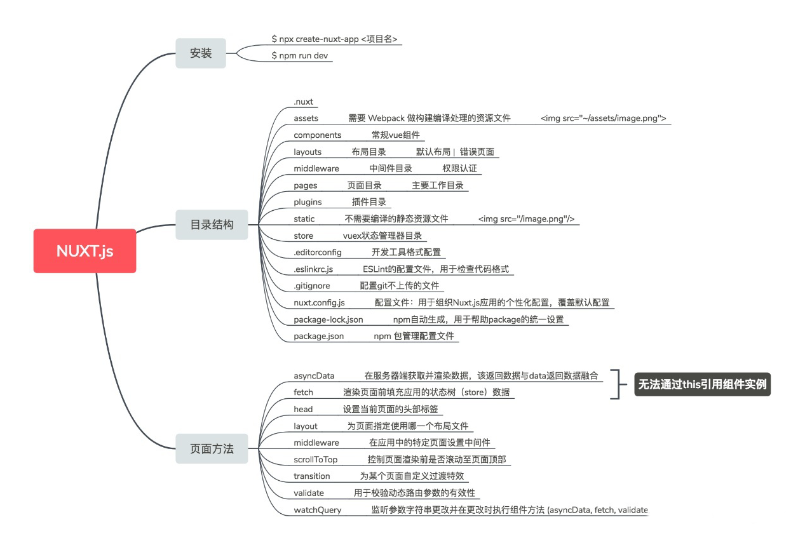
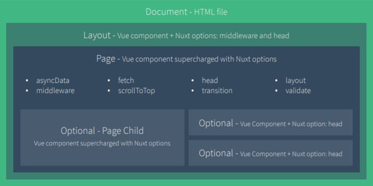
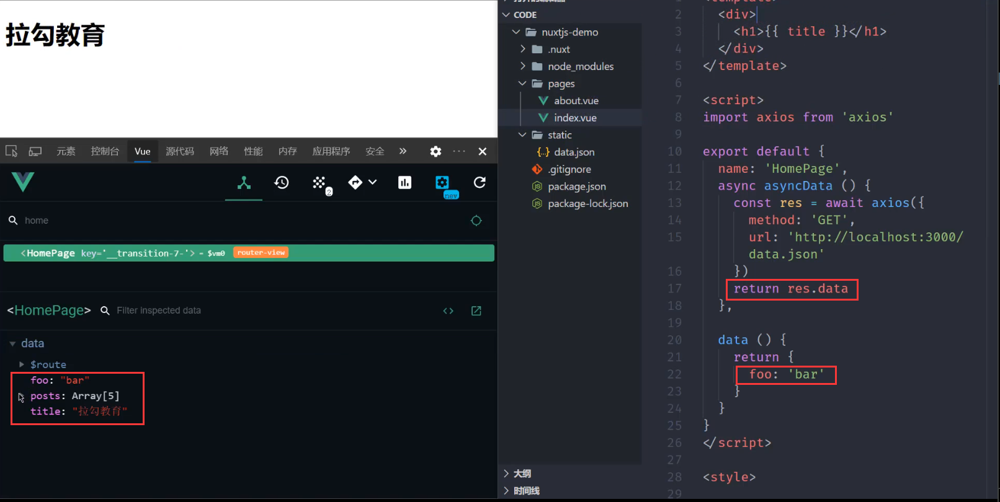
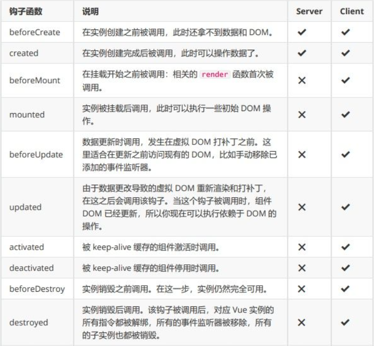
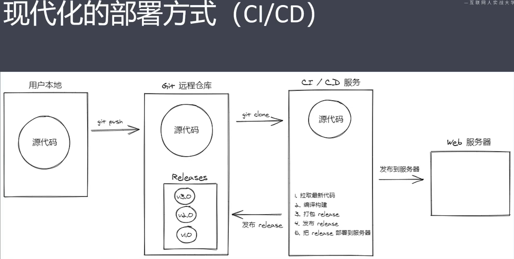

[TOC]

# Nuxt

Nuxt 是一个基于 Vue 的通用应用框架，预设了利用 Vue 开发服务端渲染所需要的各种配置。提供静态站点、异步数据加载、中间件支持、布局支持等。


## 文档

[官方文档](https://zh.nuxtjs.org/)


## 区别

Vue 和 Nuxt 的区别：

| 分类     | Vue                      | Nuxt                                         |
| -------- | ------------------------ | -------------------------------------------- |
| 框架     | 独立框架                 | 基于Vue，不仅用于服务端渲染，还进行了丰富    |
| 生命周期 | 全                       | 只有beforeCreated，created                   |
| 组件     | router-view，router-link | nuxt，nuxt-child，nuxt-link，**client-only** |
| 路由     | 自定义                   | 由文件名、文件夹**自动生成**                 |
| 目录结构 | 自定义                   | 相对限定，不同的文件名不同的**默认行为**     |
| 第三方库 | 自定义                   | 需求分浏览器与node侧                         |
| 其他     | cli集成了vuex，router    | prettier，ui框架等                           |


## Nuxt.js基础

## **简介**

- Nuxt.js 是一个基于 Vue.js 的第三方开源服务端渲染应用框架
- 它可以帮我们轻松的实现同构应用
- 通过对客户端/服务端基础架构的抽象组织，Nuxt.js 主要关注的是应用的 UI渲染
- 我们的目标是创建一个灵活的应用框架，你可以基于它初始化新项目的基础结构代码，或者在已有 Node.js 项目中使用 Nuxt.js
- Nuxt.js 预设了利用 Vue.js 开发服务端渲染的应用所需要的各种配置，类似于脚手架生成了项目的基本框架
- 提供了一种命令叫： nuxt generate ，为基于 Vue.js 的应用提供生成对应的静态站 点的功能，是向开发集成各种微服务（Microservices）的 Web 应用迈开的新一 步
- 作为框架，Nuxt.js 为 客户端/服务端 这种典型的应用架构模式提供了许多有用的特性，例如异步数据 加载、中间件支持、布局支持等非常实用的功能


### **Nuxt框架是如何运作的**

Nuxt.js 集成了以下组件/框架，用于开发完整而强大的 Web 应用：

- Vue.js
- Vue Router
- Vuex
- Vue Server Renderer

压缩并 gzip 后，总代码大小为：**57kb** （如果使用了 Vuex 特性的话为 60kb）。

另外，Nuxt.js 使用 Webpack和 vue-loader 、 babel-loader来处理代码的自动化构建工作（如打包、代码分层、压缩等等）。


### **NuxtJS 特性**

- 基于 Vue.js

- - Vue、Vue Router、Vuex、Vue SSR

- 自动代码分层
- 服务端渲染
- 强大的路由功能，支持异步数据
- 静态文件服务
- ES2015+ 语法支持
- 打包和压缩 JS 和 CSS
- HTML 头部标签管理
- 本地开发支持热加载
- 集成 ESLint
- 支持各种样式预处理器： SASS、LESS、 Stylus 等等
- 支持 HTTP/2 推送


### **NuxtJS 渲染流程**

下图阐述了 Nuxt.js 应用一个完整的服务器请求到渲染（或用户通过 `<nuxt-link>` 切换路由渲染页面）的流程：


## **基本使用**

### **NuxtJS 使用方式**

- 初始项目，从零开始的方式

- 已有的 Node.js 服务端项目的方式

- - 直接把 Nuxt 当作一个中间件集成到 Node Web Server 中

- 现有的 Vue.js 项目基础上增加Nuxt的方式

- - 非常熟悉 Nuxt.js
  - 至少百分之 10 的代码改动


### **初始化 NuxtJS**

Nuxt 提供了两种方式用来创建项目：

- 官方文档

- - 使用 create-nuxt-app 脚手架工具
  - 手动创建

- 下面以手动创建为例

1. **准备**

```bash
# 创建示例项目
mkdir nuxt-app-demo

# 进入示例项目目录中
cd nuxt-app-demo

# 初始化 package.json 文件
npm init -y

# 安装 nuxt
npm install nuxt
```

在 `package.json` 文件的 `scripts` 中新增：

```json
"scripts": {
  "dev": "nuxt"
}
```

上面的配置使得我们可以通过运行 `npm run dev` 来运行 `nuxt` 。


1. **创建页面并启动项目**

创建 `pages` 目录：

```bash
mkdir pages
```

创建我们的第一个页面的 `pages/index.vue`：

```vue
<template>
  <h1>Hello world!</h1>
</template>
```

然后启动项目：

```bash
npm run dev
```

- 这样就在[http://localhost:3000](https://link.zhihu.com/?target=http%3A//localhost%3A3000/)上运行了
- 注意：Nuxt.js 会监听 pages 目录中的文件更改，因此在添加新页面时无需重新启动应用程序。


1. **Nuxt 中的基础路由**

- Nuxt.js 会根据 `pages` 目录中的所有 `*.vue` 文件生成应用的路由配置，也就是路由的嵌套体现在文件夹之间的嵌套

1. 根目录新建.gitignore文件用来排出不需要用git托管的文件

- node_modules和.nuxt文件都需要被忽视


### **Nuxt目录结构**



### **NuxtJS 路由**

- Nuxt.js 依据 `pages` 目录结构自动生成 vue-router模块的路由配置，pages 就相当于/，从 pages 内部开始写

### **基础路由**

- Nuxt.js 官方文档

假设 `pages` 的目录结构如下：

```text
pages/
--| user/
-----| index.vue
-----| one.vue
--| index.vue
```

那么，Nuxt.js 自动生成的路由配置如下：

```js
router: {
  routes: [
    {
      name: 'index',
      path: '/',
      component: 'pages/index.vue'
    },
    {
      name: 'user',
      path: '/user',
      component: 'pages/user/index.vue'
      //  那这个对应的路由地址就是http://localhost:3000/user/index.vue
    },
    {
      name: 'user-one',
      path: '/user/one',
      component: 'pages/user/one.vue'
    }
  ]
}
```


### **路由导航**

- a 标签

- - 它会刷新整个页面，走服务端渲染，不要使用

- nuxt-link组

- 编程式导航

- - [https://router.vuejs.org/zh/guide/essentials/navigation.html](https://link.zhihu.com/?target=https%3A//router.vuejs.org/zh/guide/essentials/navigation.html)

```vue
<template>
  <div>
    <h1>About page</h1>
    <!-- a 链接，刷新导航，走服务端渲染 -->
    <h2>a 链接</h2>
    <a href="/">首页</a>

    <!-- router-link 导航链接组件 -->
    <h2>router-link</h2>
    <router-link to="/">首页</router-link>

    <!-- 编程式导航 -->
    <h2>编程式导航</h2>
    <button @click="onClick">首页</button>
  </div>
</template>

<script>
export default {
  name: 'AboutPage',
  methods: {
    onClick () {
      this.$router.push('/')
    }
  }
}
</script>
```


### **动态路由**

- 官方文档

- - [Vue Router 动态路由](https://link.zhihu.com/?target=https%3A//router.vuejs.org/zh/guide/essentials/dynamic-matching.html%23%E5%8A%A8%E6%80%81%E8%B7%AF%E7%94%B1%E5%8C%B9%E9%85%8D)

  - [Nuxt.js 动态路由](https://link.zhihu.com/?target=https%3A//www.nuxtjs.cn/guide/routing%23%E5%8A%A8%E6%80%81%E8%B7%AF%E7%94%B1)

  - 动态路由指的是路径时动态的，路径中的某一部分是动态变化的、可以是任意的，需要用：进行表征，使用？可以定义其是否是必要项

  - 在 Nuxt.js 里面定义带参数的动态路由，需要创建对应的**以下划线作为前缀**的 Vue 文件 或 目录。

  - 个人理解，动态路由的两个作用：

  - - 用来动态匹配路由地址
    - 使用动态路由来传递参数


以下目录结构：

```text
pages/
--| _slug/
-----| comments.vue
-----| index.vue
--| users/
-----| _id.vue
--| index.vue
```

Nuxt.js 生成对应的路由配置表为：

```js
router: {
  routes: [
    {
      name: 'index',
      path: '/',
      component: 'pages/index.vue'
    },
    {
      name: 'users-id',
      path: '/users/:id?',  
      // 这个就可以匹配到/users/* 的路径来展示当前组件*为任意，?表示当前这个字段是可选的
      // 并且如果想要拿到动态路由这个传递的参数可以使用$route.params.id来拿到
      component: 'pages/users/_id.vue'  
    },
    {
      name: 'slug',
      path: '/:slug',
      component: 'pages/_slug/index.vue'
    },
    {
      name: 'slug-comments',
      path: '/:slug/comments',
      component: 'pages/_slug/comments.vue'
    }
  ]
}
```


```vue
// pages/user/_id.vue

<template>
  <div>
    <h1>User Pages</h1>
  </div>
</template>

<script>
export default {
  name: 'UserPage'
}
</script>
```

使用参数时直接通过 `$route.params.xx` 的形式来获取

```js
<template>
  <div>
    <h1>User Pages</h1>
    <h2>{{ $route.params.id }}</h2>
  </div>
</template>
```


### **嵌套路由**

- 官方文档

- - [Vue Router 嵌套路由](https://link.zhihu.com/?target=https%3A//router.vuejs.org/zh/guide/essentials/nested-routes.html)
  - [Nuxt.js 嵌套路由](https://link.zhihu.com/?target=https%3A//www.nuxtjs.cn/guide/routing%23%E5%B5%8C%E5%A5%97%E8%B7%AF%E7%94%B1)

- 你可以通过 vue-router 的子路由创建 Nuxt.js 应用的嵌套路由。
- 创建内嵌子路由，你需要添加一个 Vue 文件，【同时添加一个**与该文件同名**的目录用来存放子视图组件】
- 注意区分父子路由和父子组件的区别

**Warning:** 别忘了在父组件( `.vue` 文件) 内增加 `<nuxt-child/>` 用于显示【子视图】内容。子视图对应子路由，定义在父路由组件的nuxt-child路由出口组件中

假设文件结构如：

```js
pages/
--| users/		// 与users同名的目录来存放users的子路由组件
-----| _id.vue
-----| index.vue
--| users.vue   // 父路由
```

Nuxt.js 自动生成的路由配置如下：

```js
router: {
  routes: [
    {
      path: '/users',
      component: 'pages/users.vue',
      children: [
        {
          path: '',
          component: 'pages/users/index.vue',
          name: 'users'
        },
        {
          path: ':id',
          component: 'pages/users/_id.vue',
          name: 'users-id'
        }
      ]
    }
  ]
}
```


### **自定义路由**

- [官方文档](https://link.zhihu.com/?target=https%3A//zh.nuxtjs.org/docs/2.x/configuration-glossary/configuration-router/)
- 新增一个 `nuxt.config.js` 文件进行配置

```js
// nuxt.config.js

/**
 * Nuxt.js 配置文件
 */

module.exports = {
  router: {
    base: '/abc'   
  }
}

// 注意，这样配置后路由地址都应该以/abc开头：http://localhost:3000/abc/...
// 要是访问首页的话就是abc/，末尾的/不能省略
```

- 如果不想配置文件，也可以使用 `extendRoutes` 方法

```js
module.exports = {
  router: {
    base: '/abc',
    // routes: 一个数组，路由配置表
    // resolve: 解析路由组件路径
    extendRoutes(routes, resolve) {
      routes.push({
        name: 'hello',
        path: '/hello',
        component: resolve(__dirname, 'pages/about.vue')
      })
    }
  }
}
```


## **NuxtJS 视图**

### **概述**



在 NuxtJS 中页面结构一般由三部分组成：

1. 第一部分是最外层的文档页面，也就是单页面或者说服务端渲染的HTML页面。
2. 在HTML 页面里面包裹着 Layout布局组件（可选），相当于所有页面的父路由。
3. 再往里面是页面组件，每个页面组件有自己额外的成员方法，包括页面的子组件之类的可选内容。


### **模板 (上图最外层HTML file)**

你可以定制化 Nuxt.js 默认的应用模板。

定制化默认的 html 模板，只需要在 `src` 文件夹下（默认是应用根目录）创建一个 `app.html` 的文件。

默认模板为：

```html
<!DOCTYPE html>
<html {{ HTML_ATTRS }}>
  <head {{ HEAD_ATTRS }}>
    {{ HEAD }}
  </head>
  <body {{ BODY_ATTRS }}>
    {{ APP }}  <!-- 这body里就是渲染视图的位置，这个app就是根组件 -->
  </body>
</html>
```


### **布局 （Layout）**

- 默认是所有页面组件的父路由
- Nuxt.js 允许你扩展默认的布局，或在 `layout` 目录下创建自定义的布局。
- 可通过添加 `layouts/default.vue` 文件来扩展应用的默认布局。
- **提示**: 别忘了在布局文件中添加`<nuxt/>`组件用于显示页面的主体内容。
- 新增layouts时需要重启项目
- 相当于一个更简便的嵌套路由

默认布局的代码如下：

```vue
<template>
  <nuxt />
</template>
// layouts/default.vue  默认布局
// 一旦使用default默认布局，默认所有页面都会作用，不能取消，只能更改
// 除非在别的组件使用时指定layout:'foo' 也就是指定别的组件作为布局组件，也就是foo会代替default

<template>
  <div>
    <h1>layouts/default.vue 组件</h1>
    <!-- 页面出口，类似于子路由出口，是另一种匹配规则，而不是走路由规则 -->
    <nuxt />
  </div>
</template>

<script>
export default {
  name: 'LayoutDefault'
}
</script>
```

然后我们必须告诉页面 (即`pages/index.vue`) 使用您的自定义布局：

```vue
<template>
  <h1>Hello world!</h1>
</template>

<script>
export default {
  name: 'HomePage',
  // 默认 default 可修改
  layout: 'default'   // 表示使用默认布局使用的是 layouts文件夹下面的default组件
}
</script>
```


## **NuxtJS 异步数据**

- Nuxt.js 扩展了 Vue.js，增加了一个叫 `asyncData` 的方法，使得我们可以在设置组件的数据之前能异步获取或处理数据。
- [官方文档](https://link.zhihu.com/?target=https%3A//www.nuxtjs.cn/guide/async-data)
- 核心就是 `asyncData` 方法

**流程示例**

- 首先定义一个数据文件：

```json
// static/data.json

{
  "posts": [
    {
      "id": 1,
      "title": "sunt aut facere repellat provident occaecati excepturi optio reprehenderit",
      "body": "quia et suscipit\nsuscipit recusandae consequuntur expedita et cum\nreprehenderit molestiae ut ut quas totam\nnostrum rerum est autem sunt rem eveniet architecto"
    },
    {
      "id": 2,
      "title": "qui est esse",
      "body": "est rerum tempore vitae\nsequi sint nihil reprehenderit dolor beatae ea dolores neque\nfugiat blanditiis voluptate porro vel nihil molestiae ut reiciendis\nqui aperiam non debitis possimus qui neque nisi nulla"
    },
    {
      "id": 3,
      "title": "ea molestias quasi exercitationem repellat qui ipsa sit aut",
      "body": "et iusto sed quo iure\nvoluptatem occaecati omnis eligendi aut ad\nvoluptatem doloribus vel accusantium quis pariatur\nmolestiae porro eius odio et labore et velit aut"
    },
    {
      "id": 4,
      "title": "eum et est occaecati",
      "body": "ullam et saepe reiciendis voluptatem adipisci\nsit amet autem assumenda provident rerum culpa\nquis hic commodi nesciunt rem tenetur doloremque ipsam iure\nquis sunt voluptatem rerum illo velit"
    },
    {
      "id": 5,
      "title": "nesciunt quas odio",
      "body": "repudiandae veniam quaerat sunt sed\nalias aut fugiat sit autem sed est\nvoluptatem omnis possimus esse voluptatibus quis\nest aut tenetur dolor neque"
    }
  ],
  "title": "拉勾教育"
}
```

- NuxtJS默认在Web服务中将数据放到static目录中，可以直接通过路径来获取数据，并且是将static中的文件暴露到根文件夹下，可以不写static路径字段

```js
http://localhost:3000/data.json  
// static字段不用写
```

- 假设想在首页直接获取数据（服务端获取异步数据）：

- - 首先要安装axios来发送请求

```js
npm i axios
// pages/index.vue

<template>
  <div>
    <h1>{{ title }}</h1>
  </div>
</template>

<script>
import axios from 'axios'

export default {
  name: 'HomePage',
  layout: 'default',
  async asyncData () {
    console.log('asyncData')
    console.log(this)
    const res = await axios({
      method: 'GET',
      url: 'http://localhost:3000/data.json'
    })
    return res.data
  },
  data () {
    return {
      foo: 'bar'
    }
  }
}
</script>
```

- 通过 `asyncData` 得到的数据将和组件原本的data文件进行混合

  

- 如果我们尝试在 `asyncData` 里面进行 `console.log('xxx')` 时，会发现在服务端的控制台输出xxx的同时，nuxt为了方便调试和更加直观，会让客户端也会输出xxx，并且客户端的xxx是包裹在Nuxt SSR对象中的，如果尝试打印 `this` 会发现是 `undefined` ，因为服务端渲染时组件还没初始化。

- `asyncData` 方法除了会在服务端渲染期间来运行，还会在客户端路由导航之前运行

实例：

```js
// pages/index.vue

<template>
  <div>
    <h1>{{ title }}</h1>
    <nuxt-link to="/about">About</nuxt-link>
  </div>
</template>

<script>
import axios from 'axios'

export default {
  name: 'HomePage',
  layout: 'default',
  async asyncData () {
    console.log('xxx')
    const res = await axios({
      method: 'GET',
      url: 'http://localhost:3000/data.json'
    })
    return res.data
  },
  data () {
    return {
      foo: 'bar'
    }
  }
}
</script>
```

先通过地址访问首页，会发现客户端控制台打印Nuxt SSR下面输出了xxx，说明首屏是在服务端渲染的，然后输出了xxx。紧接着通过about路由导航链接跳转到about页面，然后about页面中也有个导航链接可以跳转到首页，此时跳转回首页时也会调用首页组件`index.vue` 中的 `asyncData` 方法，此时也会打印xxx，但是这时候的xxx外层没有Nuxt SSR对象了，原因是这次导航跳转引起的调用是在客户端执行的

首屏服务端渲染数据好理解，直接拿到数据返回并返回了SPA页面脚本，但是如果客户端执行SPA程序时，不执行 `asyncData` 的话，将会导致数据无法更新，所以当我们通过导航链接进行跳转时也会在客户端进行一次调用 `asyncData`

- 注意，`asyncData` 只能在页面组件中使用，不能在非页面组件（比如页面组件的子组件）中使用，非页面组件中不会调用 `asyncData` 函数
- 如果想在子组件使用服务端渲染时的数据，只能通过页面组件进行获取，然后再利用父子组件中的传值方法来传递给页面组件的子组件

**实例如下：**

- 页面组件的子组件：

```vue
// components/Foo.vue

<template>
  <div>
    <h1>FooPage</h1>
    <ul>
      <li
        v-for="item in posts"
        :key="item.id"
      >
      {{ item.title }}
      </li>
    </ul>
  </div>
</template>

<script>
export default {
  name: 'FooPage',
  props: ['posts'],
  // asyncData 只能在页面组件中使用
  // async asyncData () {
  //   console.log('foo asyncData')
  //   return {
  //     foo: 'bar'
  //   }
  // }
}
</script>
```

- 页面组件

```vue
// pages/index.vue
<template>
  <div>
    <h1>{{ title }}</h1>
    <nuxt-link to="/about">About</nuxt-link>
    <br>
    <foo :posts="posts" />    
  </div>
</template>

<script>
import axios from 'axios'
import Foo from '@/components/Foo'

export default {
  name: 'HomePage',
  layout: 'default',
  components: {
    Foo
  },
  // 当你想要动态页面内容有利于 SEO
  // 或者是提升首屏渲染速度的时候，
  // 就在 asyncData 中发请求拿数据
  async asyncData () {
    console.log('asyncData')
    console.log(this)
    const res = await axios({
      method: 'GET',
      url: 'http://localhost:3000/abc/data.json'
    })
    return res.data
  },

  // 如果是非异步数据或者普通数据，则正常的初始化到 data 中即可
  data () {
    return {
      foo: 'bar'
    }
  }
}
</script>
```


**总结**：

- 基本用法

- - 它会将 `asyncData` 返回的数据融合组件 data 方法返回数据并一并给组件
  - 调用时机：服务端渲染期间和客户端路由更新之前

- 注意事项

- - 只能在页面组件中使用
  - 没有 `this` ，因为它是组件初始化之前被调用的


## **上下对象**

- 假设这里给这些文章标题加了链接，希望点击标题跳转到文章页面，所以准备了`pages/article/_id.vue` 详情页面（动态路由），这个路由将匹配所有的 `pages/article/*` 地址都将匹配到这个`_id.vue` 这个组件。然后拿到对应的id值（也就是*值），获取文章内容展示到页面。并且要使数据有利于SEO，提高首屏渲染速度。

- 比如：`http:// localhost:3000/artical/5` 这个路径就应该对应第五篇文章，那么问题是怎么获取这个5呢

- - 首先我们容易想到路由对象 `this.$route.params` ，但是 `asyncData` 在服务端执行时是没有 `this` 的，也就是说 `this` 不指向当前Vue实例
  - 所以我们需要使用 `asyncData` 中的context上下文对象参数来获取,上下文对象中可以获取动态路由中的参数

```vue
// pages/article/_id.vue，根据路径中的最后一位id值的不同来拿到不同的对象，然后渲染页面中的不同内容

<template>
  <div>
    <!-- <h1>article page</h1> -->
    <h1>{{ article.title }}</h1>
    <div>{{ article.body }}</div>
  </div>
</template>

<script>
import axios from 'axios'

export default {
  name: 'ArticlePage',
  // asyncData 上下文对象
  async asyncData (context) {
    // 这里有我们需要的数据
    console.log(context)
    const { data } = await axios({
      method: 'GET',
      url: 'http://localhost:3000/data.json'
    })
    // asyncData 里面没有 this
    // 不能通过这种方式获取 id
    // console.log(this.$route.params)

    // 可以通过上下文对象的 params.id 或者 router.params.id
    // 拿到后将字符串类型转换为数字类型
    // 根据路径中的最后一位id值的不同来拿到不同的对象，然后渲染页面中的不同内容
    const id = Number.parseInt(context.params.id)
    return {
      article: data.posts.find(item => item.id === id)
    }
  }
}
</script>
```


## **生命周期对比**




## 环境区分

`process.client`：判断是否是客户端渲染

`process.server`：判断是否是服务端渲染

示例：

```js
// 仅在客户端加载 js-cookie 包
const Cookie = process.client ? require('js-cookie') : undefined
// 仅在服务端加载 cookieparser 包
const cookieparser = process.server ? require('cookieparser') : undefined
```


## nuxtServerInit

`nuxtServerInit` 是一个特殊的 action 方法，这个 action 会在服务端渲染期间自动调用，作用：**初始化容器数据，传递数据给客户端使用**。

示例：

```js
const cookieparser = process.server ? require('cookieparser') : undefined

// 在服务端渲染期间运行都是同一个实例
// 为了防止数据冲突，务必要把 state 定义成一个函数，返回数据对象
export const state = () => {
  return {
    // 当前登录用户的登录状态
    user: null
  }
}

export const mutations = {
  setUser (state, data) {
    state.user = data
  }
}

export const actions = {
  nuxtServerInit ({ commit }, { req }) {
    let user = null

    // 如果请求头中有 Cookie
    if (req.headers.cookie) {
      // 使用 cookieparser 把 cookie 字符串转为 JavaScript 对象
      const parsed = cookieparser.parse(req.headers.cookie)
      try {
        user = JSON.parse(parsed.user)
      } catch (err) {
        // No valid cookie found
      }
    }

    // 提交 mutation 修改 state 状态
    commit('setUser', user)
  }
}

```


## 中间件

中间件允许你定义一个自定义函数允许在一个页面或一组页面渲染之前。

每一个中间件应放置在 `middleware/` 目录。文件名的名称将成为中间件名称（`middleware/auth.js` 将成为 `auth` 中间件）。

`/middleware/authenticated.js`：

```js
/**
 * 验证是否登录的中间件
 */
export default function ({ store, redirect }) {
  // If the user is not authenticated
  if (!store.state.user) {
    return redirect('/login')
  }
}

```

在页面组件中使用 `middleware` 属性，指定要执行的中间件，对应的值为中间件文件名。

```vue	
<script>
export default {
  middleware: 'authenticated',
}
</script>
```


## 插件

Nuxt.js 允许您在运行 Vue.js 应用程序之前执行 js 插件。这在您需要使用自己的库或第三方模块时特别有用。


### 注入 context

context 注入方式和在其它 vue 应用程序中注入类似。

`plugins/request.js`:

```js
/**
 * 基于 axios 封装的请求模块
 */

import axios from 'axios'

// 创建请求对象
export const request = axios.create({
  baseURL: 'http://realworld.api.fed.lagounews.com'
})

// 通过插件机制获取到上下文对象（query、params、req、res、app、store...）
// 插件导出函数必须作为 default 成员
export default ({ store }) => {

  // 请求拦截器
  // Add a request interceptor
  // 任何请求都要经过请求拦截器
  // 我们可以在请求拦截器中做一些公共的业务处理,例如统一设置 token
  request.interceptors.request.use(function (config) {
    // Do something before request is sent
    // 请求就会经过这里
    const { user } = store.state

    if (user && user.token) {
      config.headers.Authorization = `Token ${user.token}`
    }

    // 返回 config 请求配置对象
    return config
  }, function (error) {
    // 如果请求失败(此时请求还没有发出去)就会进入这里
    // Do something with request error
    return Promise.reject(error)
  })
}

```

`nuxt.config.js`:

```js
export default {
  plugins: ['~/plugins/request.js']
}
```


## API

### head 方法

> Nuxt.js 使用了 [`vue-meta`](https://github.com/nuxt/vue-meta) 更新应用的 `头部标签(Head)` 和 `html 属性`。

- **类型：** `Object` 或 `Function`

使用 `head` 方法设置当前页面的头部标签。

在 `head` 方法里可通过 `this` 关键字来获取组件的数据，你可以利用页面组件的数据来设置个性化的 `meta` 标签。

```html
<template>
  <h1>{{ title }}</h1>
</template>

<script>
  export default {
    data() {
      return {
        title: 'Hello World!'
      }
    },
    head() {
      return {
        title: this.title,
        meta: [
          {
            hid: 'description',
            name: 'description',
            content: 'My custom description'
          }
        ]
      }
    }
  }
</script>
```

**注意：**为了避免子组件中的 meta 标签不能正确覆盖父组件中相同的标签而产生重复的现象，建议利用 `hid` 键为 meta 标签配一个唯一的标识编号。请阅读[关于 `vue-meta` 的更多信息](https://vue-meta.nuxtjs.org/api/#tagidkeyname)。


## 发布部署

Nuxt.js 提供了一系列常用的命令, 用于开发或发布部署

| 命令          | 描述                                                         |
| ------------- | ------------------------------------------------------------ |
| nuxt          | 启动一个热加载的Web服务器（开发模式） localhost:3000。       |
| nuxt build    | 利用webpack编译应用，压缩JS和CSS资源（发布用）。             |
| nuxt start    | 以生产模式启动一个Web服务器 (需要先执行 nuxt build )。       |
| nuxt generate | 编译应用，并依据路由配置生成对应的HTML文件 (用于静态站点的部署)。 |

如果使用了 Koa/Express 等 Node.js Web 开发框架，并使用了 Nuxt 作为中间件，可以自定义 Web 服 务器的启动入口：

| 命令                                         | 描述                                                         |
| -------------------------------------------- | ------------------------------------------------------------ |
| NODE_ENV=development nodemon server/index.js | 启动一个热加载的自定义 Web 服务器（开发模 式）。             |
| NODE_ENV=production node server/index.js     | 以生产模式启动一个自定义 Web 服务器 (需要先执行 nuxt build )。 |

**参数**

您可以使用 `--help` 命令来获取详细用法。常见的命令有： 

+ `--config-file` 或 `-c` : 指定 `nuxt.config.js` 的文件路径。 
+ `--spa` 或 `-s` : 禁用服务器端渲染，使用SPA模式 
+ `--unix-socket` 或 `-n` : 指定UNIX Socket的路径。 


 你可以将这些命令添加至 `package.json` ：

```json
{
  "scripts": {
    "dev": "nuxt",
    "build": "nuxt build",
    "start": "nuxt start",
    "generate": "nuxt generate"
  }
}
```

这样你可以通过 `npm run <command>`  来执行相应的命令。如: `npm run dev` 。 提示: 要将参数传递给npm命令，您需要一个额外的 `--` 脚本名称(例如： `npm run dev --参数 --spa` )


开发模式

可通过以下命令以开发模式启动带热加载特性的 Nuxt 服务：

```bash
nuxt
// 或
npm run dev
```


Nuxt.js 提供了两种发布部署应用的方式：服务端渲染应用部署 和 静态应用部署。 部署 Nuxt.js 服务端渲染的应用不能直接使用 `nuxt` 命令，而应该先进行编译构建，然后再启动 Nuxt 服务，可通过以下两个命令来完成：

```bash
nuxt build
nuxt start
```

推荐的 `package.json` 配置如下：

```json
{
  "name": "my-app",
  "dependencies": {
    "nuxt": "latest"
  },
  "scripts": {
    "dev": "nuxt",
    "build": "nuxt build",
    "start": "nuxt start"
  }
}
```

**提示**： 建议将 `.nuxt` 加入 `.npmignore` 和 `.gitignore` 文件中。

```json
{
  "apps": [
    {
      "name": "RealWorld",
      "script": "npm",
      "args": "start"
    }
  ]
}
```


### 手动部署

1. 配置 Host + Port
2. 压缩发布包
3. 把发布包传到服务端
4. 解压（服务端）
5. 安装依赖（服务端）
6. 启动服务（服务端）


### 自动部署

1. 在项目根目录创建 `.github/workflows` 目录
2. 创建 `main.yml` 到 `workflows` 目录下
3. 修改配置
4. 配置 PM2 配置文件
5. 提交更新
6. 查看自动部署状态
7. 访问网址

`.github/workflows/main.yml`

```yml
name: Publish And Deploy Demo
on:
  push:
    tags:
      - 'v*'

jobs:
  build-and-deploy:
    runs-on: ubuntu-latest
    steps:

    # 下载源码
    - name: Checkout
      uses: actions/checkout@master

    # 打包构建
    - name: Build
      uses: actions/setup-node@master
    - run: npm install
    - run: npm run build
    - run: tar -zcvf release.tgz .nuxt static nuxt.config.js package.json package-lock.json pm2.config.json

    # 发布 Release
    - name: Create Release
      id: create_release
      uses: actions/create-release@master
      env:
        GITHUB_TOKEN: ${{ secrets.TOKEN }}
      with:
        tag_name: ${{ github.ref }}
        release_name: Release ${{ github.ref }}
        draft: false
        prerelease: false

    # 上传构建结果到 Release
    - name: Upload Release Asset
      id: upload-release-asset
      uses: actions/upload-release-asset@master
      env:
        GITHUB_TOKEN: ${{ secrets.TOKEN }}
      with:
        upload_url: ${{ steps.create_release.outputs.upload_url }}
        asset_path: ./release.tgz
        asset_name: release.tgz
        asset_content_type: application/x-tgz

    # 部署到服务器
    - name: Deploy
      uses: appleboy/ssh-action@master
      with:
        host: ${{ secrets.HOST }}
        username: ${{ secrets.USERNAME }}
        password: ${{ secrets.PASSWORD }}
        port: ${{ secrets.PORT }}
        script: |
          cd /root/realworld-nuxtjs
          wget https://github.com/lipengzhou/realworld-nuxtjs/releases/latest/download/release.tgz -O release.tgz
          tar zxvf release.tgz
          npm install --production
          pm2 reload pm2.config.json

```


### 流程图


