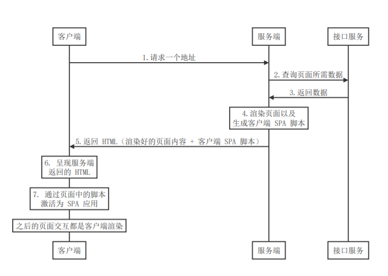

[TOC]

# 服务端渲染基础

## **概述**

随着前端技术栈和工具链的迭代成熟，前端工程化、模块化也已成为了当下的主流技术方案。在这波技术浪潮当中，涌现了诸如Angular、React、Vue等基于客户端渲染的前端框架。

这类框架所构造的单页面应用具有用户体验好、开发效率高、渲染性能好、可维护性好等优点。但是也带来了很大的缺陷

首先是单页面应用的 **首屏渲染时间长**：与传统服务端渲染直接获取服务端渲染好的 HTML 不同，单页应用使用 JavaScript 在客户端生成 HTML来呈现内容，用户需要等待客户端 JS 解析执行完成才能看到页面，这就使得首屏加载时间变长，从而影响用户体验。

还有一点那就是单页面应用 **不利于SEO**：当搜索引擎爬取网站 HTML 文件时，单页应用的 HTML 没有内容，因为他它需要通过客户端 JavaScript 解析执行才能生成网页内容，而目前的主流的搜索引擎对于这一部分内容的抓取还不是很好。

为了解决这两个缺陷，业界借鉴了传统的服务端直出 HTML 方案，提出在服务器端执行前端框架（React/Vue/Angular）代码生成网页内容，然后将渲染好的网页内容返回给客户端，客户端只需要负责展示就可以了；


当然不仅仅如此，为了获得更好的用户体验，同时会在客户端将来自服务端渲染的内容激活为一个 SPA应用，也就是说之后的页面内容交互都是通过客户端渲染处理。



这种方式简而言之就是：

- 通过服务端渲染首屏直出，解决首屏渲染慢以及不利于 SEO 问题
- 通过客户端渲染接管页面内容交互得到更好的用户体验
- 这种方式我们通常称之为现代化的服务端渲染，也叫同构渲染，所谓的同构指的就是服务端构建渲染 + 客户端构建渲染。同理，这种方式构建的应用称之为服务端渲染应用或者是同构应用。


## **渲染**

渲染指的是把**（数据 + 模板）**拼接到一起的这个事儿。

例如对于我们前端开发者来说最常见的一种场景就是：请求后端接口数据，然后将数据通过模板绑定语法绑定到页面中，最终呈现给用户。这个过程就是我们这里所指的渲染。

渲染本质其实就是字符串的解析替换，实现方式有很多种；但是我们这里要关注的并不是如何渲染，而是在哪里渲染的问题。


## **传统的服务端渲染**

最早期时候，Web 页面渲染都是在服务端完成的，即服务端运行过程中将所需的数据结合页面模板渲染为HTML，响应给客户端浏览器。所以浏览器呈现出来的是直接包含内容的页面。


首先，客户端发起一个请求，请求服务端，服务端收到请求以后执行查库操作来拿到页面对应的数据，然后把数据结合页面模板渲染为完整的 HTML，接着把渲染完毕的 HTML 发送给客户端，客户端接收到内容将其直接展示到浏览器当中。其中，重要的是**渲染这件事是在服务端执行的**。

下面通过我们前端比较熟悉的 Node.js 来了解一下这种方式。

- 安装依赖

```bash
// 创建 http 服务
npm i express

// 服务端模板引擎
npm i art-template express-art-template
```

- 服务端代码

- - 使用模板引擎art-template来渲染页面

```js
// index.js

const express = require('express')
const fs = require('fs')
const template = require('art-template')
// 创建一个 express 实例
const app = express()

// 添加一个路由，当其以get请求网站根路径时触发
app.get('/', (req, res) => {
  // 1. 获取页面模板，node中需要先读取文件，然后就可以将该文件保存到一个变量中
  // 读取文件的方法常用的有两种，readFile 是一个异步方法，readFileSync 是一个同步方法
  // 默认得到的是Buffer二进制数据，为了得到字符串HTML模板可以指定utf-8编码
  const templateStr = fs.readFileSync('./index.html', 'utf-8')

  // 2. 获取数据
  // 注意，采用这种读取方法读取到的返回结构都是字符串，使用JSON.parse()转换成数据对象
  const data = JSON.parse(fs.readFileSync('./data.json', 'utf-8'))
  
  // 3. 渲染：数据 + 模板 = 最终结果
  // 使用art-template模板引擎，模板引擎的本质就是对字符串进行解析替换
  // 第一个参数：要渲染的模板字符串
  // 第二个参数：数据对象
  // 如：
  // template.render('hello {{message}}', {message: 'world'} )返回结果是hello world
  const html = template.render(templateStr, data)
  
  // 4. 把渲染结果发送给客户端
  res.send(html)
})

app.listen(3000, () => console.log('running...'))
```

- 数据文件

```json
// data.json

{
  "posts": [
    {
      "id": 1,
      "title": "sunt aut facere repellat provident occaecati excepturi optio reprehenderit",
      "body": "quia et suscipit\nsuscipit recusandae consequuntur expedita et cum\nreprehenderit molestiae ut ut quas totam\nnostrum rerum est autem sunt rem eveniet architecto"
    },
    {
      "id": 2,
      "title": "qui est esse",
      "body": "est rerum tempore vitae\nsequi sint nihil reprehenderit dolor beatae ea dolores neque\nfugiat blanditiis voluptate porro vel nihil molestiae ut reiciendis\nqui aperiam non debitis possimus qui neque nisi nulla"
    },
    {
      "id": 3,
      "title": "ea molestias quasi exercitationem repellat qui ipsa sit aut",
      "body": "et iusto sed quo iure\nvoluptatem occaecati omnis eligendi aut ad\nvoluptatem doloribus vel accusantium quis pariatur\nmolestiae porro eius odio et labore et velit aut"
    },
    {
      "id": 4,
      "title": "eum et est occaecati",
      "body": "ullam et saepe reiciendis voluptatem adipisci\nsit amet autem assumenda provident rerum culpa\nquis hic commodi nesciunt rem tenetur doloremque ipsam iure\nquis sunt voluptatem rerum illo velit"
    },
    {
      "id": 5,
      "title": "nesciunt quas odio",
      "body": "repudiandae veniam quaerat sunt sed\nalias aut fugiat sit autem sed est\nvoluptatem omnis possimus esse voluptatibus quis\nest aut tenetur dolor neque"
    }
  ],
  "title": "拉勾教育"
}
```

- 客户端代码

- - 直接在客户端请求的返回结果Response中就有数据
  - 这种数据+模板的形式较为灵活，实现了动态网页，通过改变数据就可以直接影响结果

```html
// index.html
// 使用了art-template模板语法
<!DOCTYPE html>
<html lang="en">
<head>
  <meta charset="UTF-8">
  <meta name="viewport" content="width=device-width, initial-scale=1.0">
  <title>传统的服务端渲染</title>
</head>
<body>
  <h1>传统的服务端渲染示例</h1>
  <h2>{{ title }}</h2>
  <ul>
    {{ each posts }}
    <li>{{ $value.title }}</li>
    {{ /each }}
  </ul>   
</body>
</html>
```

- 但是种模式存在很多明显的不足：

- - 前后端代码完全耦合在一起，不利于团队开发和维护

  - - 如果将渲染工作分给前端，那么将会使得工作职责得到进一步划分，使得开发更加专精

- - 前端没有足够的发挥空间
  - 由于内容都是在服务端动态生成的，所以服务端的压力较大
  - SPA 应用可以无刷新展示页面，而这种传统模式用户体验一般

- 但是在网页应用并不复杂的情况下，这种方式也是可取的


## **客户端渲染**

### **概述**

传统的服务端渲染有很多问题，但是这些问题随着客户端 Ajax 技术的普及得到了有效的解决，Ajax 技术可以使得客户端动态获取数据变为可能，也就是说原本服务端渲染这件事儿也可以拿到客户端做了

客户端渲染的 SPA 应用的基本工作流程：


- 首先，客户端发起请求，请求网页地址
- 服务端返回一个空白的 HTML 页面
- 客户端拿到页面以后加载执行里面的脚本代码（如果有动态数据会发起AJAX请求）
- 服务端收到请求之后进行查库相关操作，拿到数据后服务端把数据直接返回给客户端，客户端拿到数据再来渲染动态的页面内容展示给用户（比如vue配合axios就是典型的客户端渲染）。

因此，服务端只需要负责数据的处理，客户端负责页面的展示

所以数据处理和页渲染就被分离开来，分别交付给前后端来完成，具有更好的可维护性，提高开发效率

但是仍然存在**缺点**：

- 首屏渲染慢

- 不利于 SEO

  

### **为什么客户端渲染 首屏渲染慢**

- 因为 HTML 中没有实质性的内容，有的是js资源的引用，并且必须等到这些js加载并执行完成才能呈现页面内容。
- 所以客户端渲染最起码要经历三次 http 请求周期：第一次（**红色标记**）是页面的请求，第二次（**黄色标记**）是 js 对应的请求，第三次（**蓝色标记**）是动态数据请求
- 而传统的服务端渲染是页面直出，不用再去执行 js ，也不用再去发请求。


### **为什么客户端渲染 不利于 SEO**

```js
// 搜索引擎是怎么获取网页内容的？
const http = require('http')

// 通过程序获取指定的网页内容
// 服务端
// http.get('http://localhost:3000/', res => {
// 客户端
http.get('http://localhost:8080/', res => {
  let data = ''
  res.on('data', chunk => {
    data += chunk
  })
  res.on('end', () => {
    console.log(data)
  })
})
```

- 拿到数据后，对于搜索引擎就要去分析：根据权重进行收录，如果发现新的链接就会进入另一个页面再去收录，才有可能通过打开搜索引擎搜索到你的页面。
- 相较于服务端渲染，客户端需要经过解析执行js（是通过js标签引入脚本，如下图）才能渲染出来所谓的网页内容。而搜索引擎的程序不是浏览器，而是一个普通的程序，它拿到的都是网页的html字符串，不会像浏览器一样再去加载解析js、发请求拿数据、再来渲染页面，它分析body发现没有内容。
- 因为 HTML 中没有内容，所以对于目前的搜索引擎爬虫来说，页面中没有任何有用的信息，自然无法提取关键词，进行索引了。


## **现代化的服务端渲染（同构渲染）**

- SPA 应用有两个非常明显的问题：

- - 首屏渲染慢
  - 不利于 SEO

- 解决方案

- - 服务端渲染，严格来说是现代化的服务端渲染，也叫同构渲染
  - 也就是将客户端渲染的工作放到服务端渲染，但需要注意的是这里的服务端渲染不是让我们再回到传统的服务端渲染，本质上确实是需要使用到传统的服务端渲染，但是用到的是服务端渲染 + 客户端渲染。

- 流程

- - 基于 React、Vue 等框架，客户端渲染和服务端渲染的结合

  - - 在服务器端执行一次，用于实现服务器端渲染（首屏直出）
    - 在客户端再执行一次，用于接管页面交互，生成SPA应用，交互式客户端渲染

- - 核心解决 SEO 和首屏渲染慢的问题
  - 拥有传统服务端渲染的优点，也有客户端渲染的优点

- 个人理解

- - 首先要理解渲染这个词：渲染就是将数据和模板拼接到一起进行显示的过程

  - 所以应用得nuxt框架其实不仅仅是服务端渲染，而是【服务端】+【客户端】渲染

  - 应用了nuxt框架之后，所有的Vue模板解析成js的工作都在服务端进行的，**不仅会返回带有数据的渲染后的模板内容，还会返回不带数据的客户端**SPA脚本，用来进行用户交互，但是数据与模板的结合并不一定在服务端进行操作：

  - - 总的来说就是需要内容直出的页面就用服务端渲染，在服务端就将数据和模板进行整合到一起，然后一同返回给页面。而需要交互的页面使用的仍然是异步请求的方式，进行客户端渲染。


**如何实现同构渲染？**

- 使用 Vue、React 等框架的官方解决方案

- - 优点：有助于理解原理
  - 缺点：需要搭建环境，比较麻烦

- 使用第三方解决方案

- - React 生态中的 Next.js
  - Vue 生态中的 Nuxt.js
  - ······


### **通过 Nuxt 体验 同构渲染**

Nuxt.js 是一个基于 Vue.js 生态开发的一个第三方服务端渲染框架，通过它我们可以轻松构建现代化的服务端渲染应用。

- 新建一个ssr文件夹，里面存放ssr案例
- ssr文件中有page页面组件、static静态资源、layouts模板组件

**pages：**

```vue
// ssr/pages/index.vue

<template>
  <div id="app">
    <h2>{{ title }}</h2>
    <ul>
      <li
        v-for="item in posts"
        :key="item.id"
      >{{ item.title }}</li>
    </ul>
  </div>
</template>

<script>
import axios from 'axios'

export default {
  name: 'Home',
  components: {},
  // Nuxt 中特殊提供的一个钩子函数
  // 专门用于获取页面服务端渲染的数据 
  async asyncData () {
    const { data } = await axios({
      method: 'GET',
      url: '/data.json'
    })
   
    // 这里返回的数据会和 data() {} 中的数据合并到一起给页面使用
    // return data：
    return {
      title: data.title,
      posts: data.posts
    }
  } 
}
</script>

<style>

</style>
```

**static**：

```json
// ssr/static/data.json

{
  "posts": [
    {
      "id": 1,
      "title": "sunt aut facere repellat provident occaecati excepturi optio reprehenderit",
      "body": "quia et suscipit\nsuscipit recusandae consequuntur expedita et cum\nreprehenderit molestiae ut ut quas totam\nnostrum rerum est autem sunt rem eveniet architecto"
    },
    {
      "id": 2,
      "title": "qui est esse",
      "body": "est rerum tempore vitae\nsequi sint nihil reprehenderit dolor beatae ea dolores neque\nfugiat blanditiis voluptate porro vel nihil molestiae ut reiciendis\nqui aperiam non debitis possimus qui neque nisi nulla"
    },
    {
      "id": 3,
      "title": "ea molestias quasi exercitationem repellat qui ipsa sit aut",
      "body": "et iusto sed quo iure\nvoluptatem occaecati omnis eligendi aut ad\nvoluptatem doloribus vel accusantium quis pariatur\nmolestiae porro eius odio et labore et velit aut"
    },
    {
      "id": 4,
      "title": "eum et est occaecati",
      "body": "ullam et saepe reiciendis voluptatem adipisci\nsit amet autem assumenda provident rerum culpa\nquis hic commodi nesciunt rem tenetur doloremque ipsam iure\nquis sunt voluptatem rerum illo velit"
    },
    {
      "id": 5,
      "title": "nesciunt quas odio",
      "body": "repudiandae veniam quaerat sunt sed\nalias aut fugiat sit autem sed est\nvoluptatem omnis possimus esse voluptatibus quis\nest aut tenetur dolor neque"
    }
  ],
  "title": "拉勾教育"
}
```

**layouts**：

```vue
// ssr/layouts/default.vue
// 这个模板会作为所有页面的父模板

<template>
  <div>
    <ul>
      <li>
        <!-- 类似于 router-link，用于单页面导航 -->
        <nuxt-link to="/">Home</nuxt-link>
      </li>
      <li>
        <nuxt-link to="/about">About</nuxt-link>
      </li>
    </ul>

    <!-- nuxt是子页面组件坑位 -->
    <nuxt />
  </div>
</template>

<script>
export default {

}
</script>

<style>

</style>
```

- 注意：

- - 通过导航链接跳转页面并不会引起页面刷新，因此可以整明其还是单页面程序，即客户端渲染。
  - 所谓首屏是指我们在地址栏中输入的地址对应的页面，如果输入的路径对应的是index.vue页面那么index就是首屏，如果要是about，那么about就是首屏
  - 首屏加载后不仅能让首屏页面直出提高加载速度，还将当前vue项目中的其他页面组件中的vue模板中的虚拟DOM进行了解析，解析成HTML语法返回，形成SPA应用，后续的所有交互都是基于这个SPA应用进行客户端渲染的


### **同构渲染问题**

- 开发条件受限。浏览器特定的代码，只能在某些生命周期钩子函数 (lifecycle hook) 中使用；一些 外部扩展库 (external library) 可能需要特殊处理，才能在服务器渲染应用程序中运行。某些代码操作需要区分运行环境

- 涉及构建设置和部署的更多要求。与可以部署在任何静态文件服务器上的完全静态单页面应用程序(SPA) 不同，服务器渲染应用程序，需要处于 Node.js server 的运行环境，因为都是基于前端渲染框架来实现的，这些前端渲染框架使用js来实现的。

  

- 更多的服务器端负载。在 Node.js 中渲染完整的应用程序，显然会比仅仅提供静态文件的 server的方式更加大量占用 CPU 资源 (CPU-intensive - CPU 密集)，因此如果你预料在高流量环境 (high traffic)下使用，请准备相应的服务器负载，并明智地采用缓存策略。
- 不能再服务端渲染期间操作DOM

在对你的应用程序使用服务器端渲染 (SSR) 之前，你应该问的第一个问题是，是否真的需要它。

- 首屏渲染速度是否重要

这主要 取决于内容到达时间 (time-to-content) 对应用程序的重要程度。例如，如果你正在构建一个内部仪表 盘，初始加载时的额外几百毫秒并不重要，这种情况下去使用服务器端渲染 (SSR) 将是一个小题大作之 举。然而，内容到达时间 (time-to-content) 要求是绝对关键的指标，在这种情况下，服务器端渲染 (SSR) 可以帮助你实现最佳的初始加载性能。

- 是否真的需求SEO

比如一个后端管理系统显然是不需要SEO的，但是一个电商网站肯定是需要SEO的

事实上，很多网站是出于**效益**的考虑才启用服务端渲染，**性能倒是在其次**。 假设 A 网站页面中有一个 关键字叫“前端性能优化”，这个关键字是 JS 代码跑过一遍后添加到 HTML 页面中的。那么客户端渲染模 式下，我们在搜索引擎搜索这个关键字，是找不到 A 网站的——搜索引擎只会查找现成的内容，不会帮 你跑 JS 代码。A 网站的运营方见此情形，感到很头大：搜索引擎搜不出来，用户找不到我们，谁还会用 我的网站呢？为了把“现成的内容”拿给搜索引擎看，A 网站不得不启用服务端渲染。 但性能在其次，不 代表性能不重要。