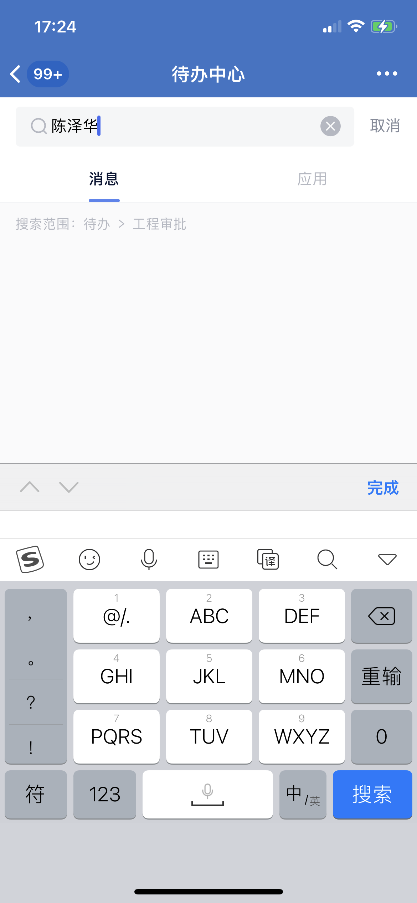

[TOC]

# 移动端笔记

## 输入框输入时出现搜索按钮

```html
<form action="" @submit.prevent>
  <input type="search" @keypress.enter="handleSearch">
</form>
```

```less
input[type="search"] {
	-webkit-appearance: none; // 隐藏输入框出现自带的搜索图标
  &::-webkit-search-cancel-button {
    display: none; // 隐藏输入框出现自带的删除图标
  }
}
```


如图所示：

