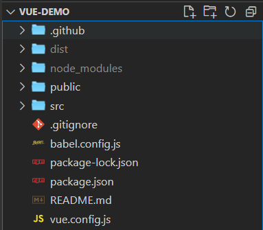
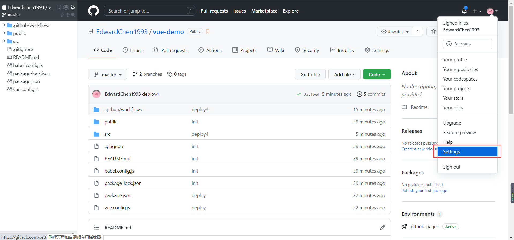
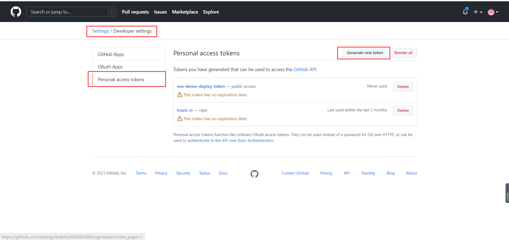
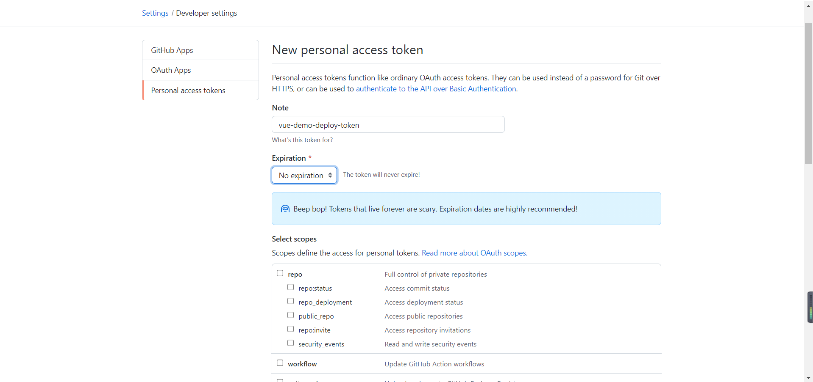
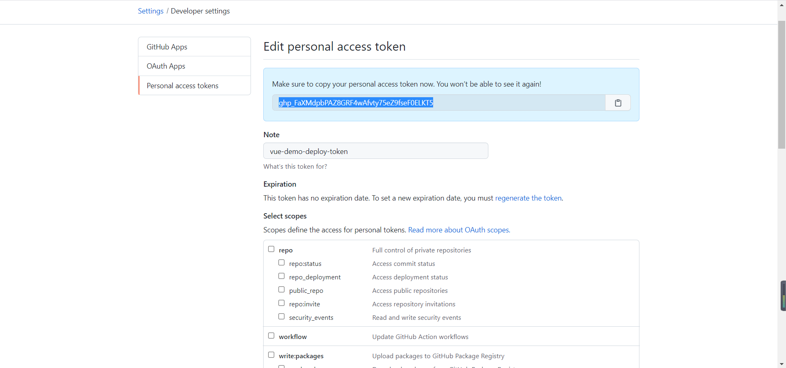
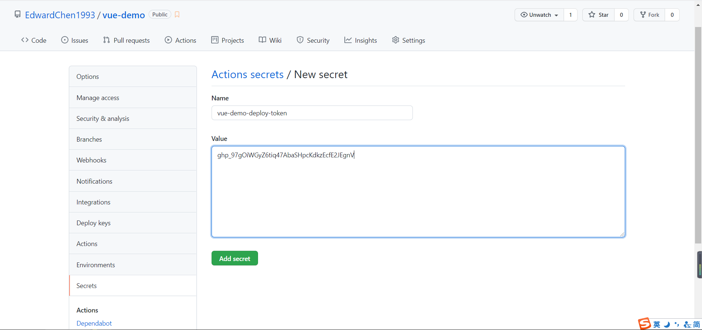
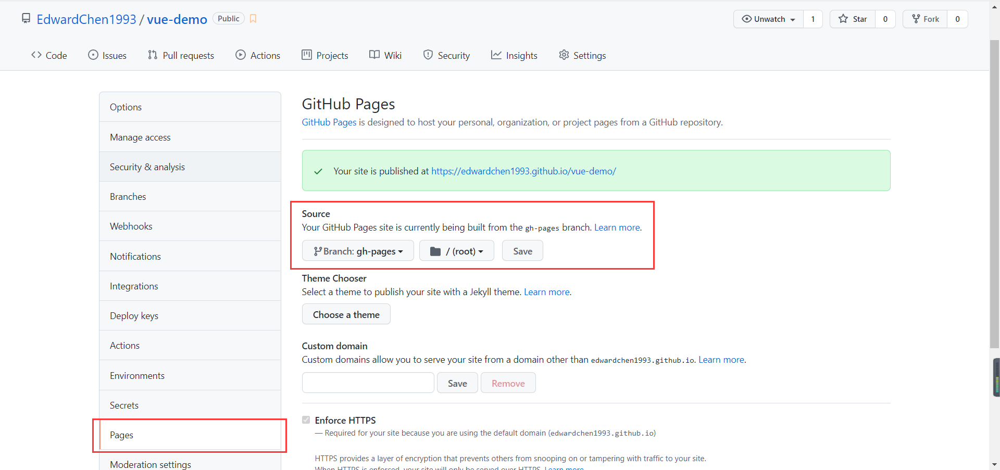
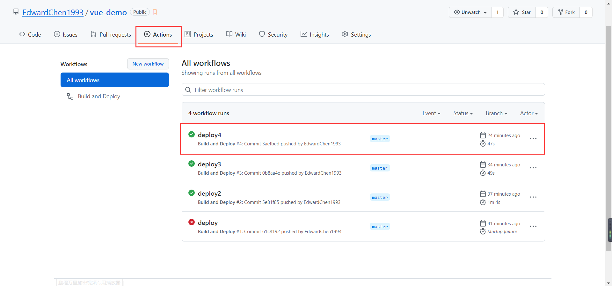

[TOC]

# Github

## GitHub Pages

1. 新建本地项目。



2. 在 github 上新建一个与本地项目相对于的远程仓库。


3. 在 github 右上角 Settings - Developer settings - Personal access tokens 中，创建一个新的 token，并将生成的 token 保存下来。









4. 在远程仓库的 Settings - Secrets 中，新建一个 secret，并将第3步保存的 token 填入。




5. 在本地项目下，创建 `.github/workflows/deploy.yml`，[参考配置](https://github.com/marketplace/actions/deploy-to-github-pages)

   ```yml
   name: Build and Deploy
   on:
     push:
       branches:
         - master
   jobs:
     build-and-deploy:
       runs-on: ubuntu-latest
       steps:
         - name: Checkout 🛎️
           uses: actions/checkout@v2.3.1
   
         - name: Install and Build 🔧 # This example project is built using npm and outputs the result to the 'build' folder. Replace with the commands required to build your project, or remove this step entirely if your site is pre-built.
           run: |
             npm install
             npm run build
   
         - name: Deploy 🚀
           uses: JamesIves/github-pages-deploy-action@4.1.5
           with:
             github_token: ${{ secrets.VUE_DEMO_DEPLOY_TOKEN }}
             branch: gh-pages # The branch the action should deploy to.
             folder: dist # The folder the action should deploy.
   ```

6. 在本地项目下，在 `package.json` 中增加 `homepage` 字段，值为 `https://[用户名].github.io/[仓库名称]`。

   ```json
   {
     "homepage": "https://edwardchen1993.github.io/vue-demo",
   }
   ```

7. git 提交，并推送到远程仓库，就会触发 github 的自动构建部署。

   ```bash
   git add .
   git commit -m 'deploy'
   git push origin master
   ```

8. 设置 Github Pages，指定 gh-pages 分支。

   

9. 在仓库的 Actions 中可以查看部署进度和是否成功，当显示部署成功后，打开第8步提示的访问链接，即可访问到要部署的静态页面。

   例如： `https://edwardchen1993.github.io/vue-demo/index.html`

   

