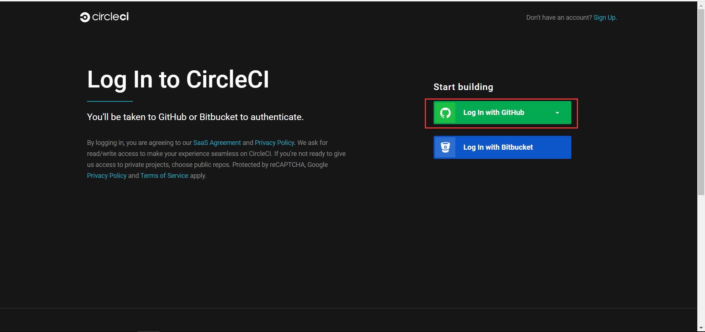
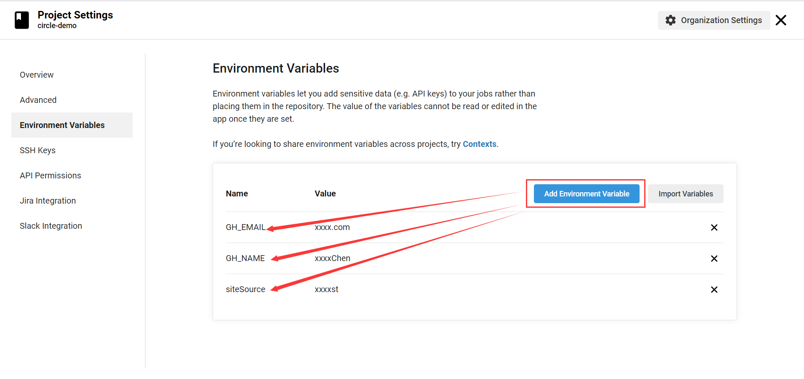
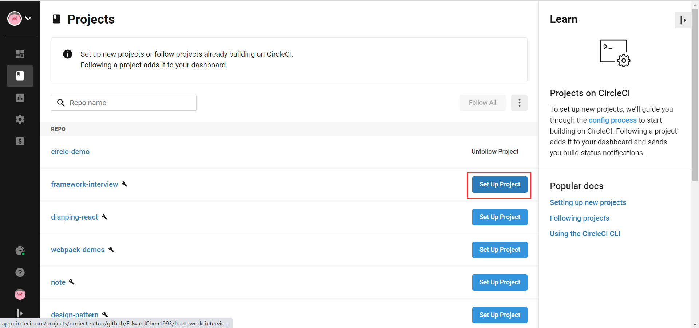
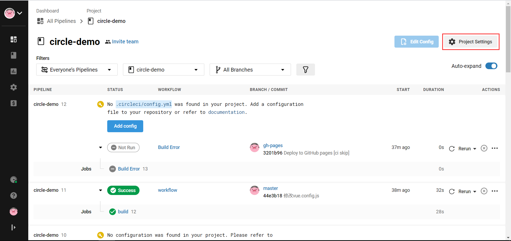
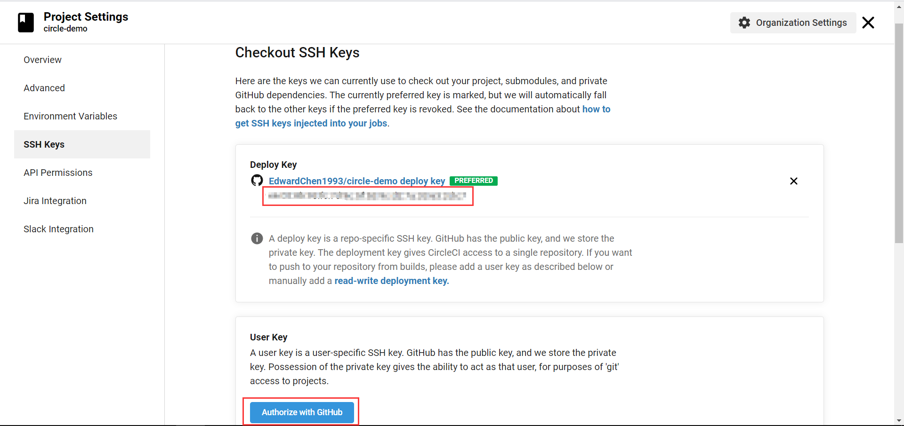
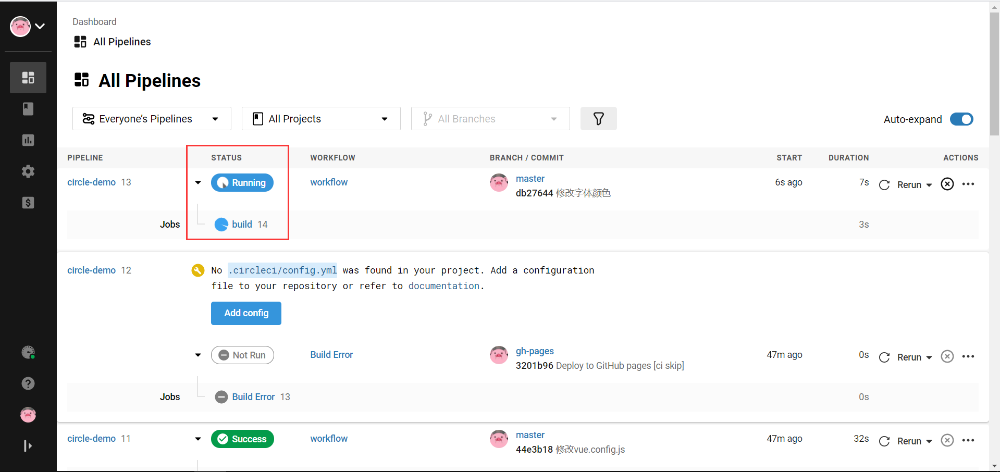
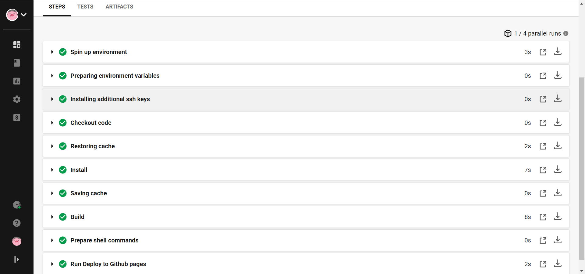

[TOC]

# circleci

## 操作流程

**第一步、进入[官网](https://circleci.com)，使用github账户注册并授权。**



**第二步、在github上新建仓库，并克隆项目代码到本地。**


**第三步、在本地项目目录新建.circleci/config.yml文件，用于配置circleci。**

详细配置参考：[文档](https://circleci.com/docs/2.0/configuration-reference)

config.yml：

```yaml
# circleci 版本
version: 2
jobs:
  build:
  	# 使用的 node 镜像
    docker:
      - image: circleci/node:10
    # 指定拉取代码的分支
    branches:
      only:
        - master
    # 构建步骤
    steps:
    	# 增加 ssh_key ，用于与 github 通信
      - add_ssh_keys:
          fingerprints:
            - "YOUR SSHKEY"
      # 检出远程代码到工作区
      - checkout
      # 恢复缓存
      - restore_cache:
          keys:
            - dependencies
      # 安装依赖
      - run:
          name: Install
          command: npm install
      # 保存缓存
      - save_cache:
          paths:
            - node_modules
          key: dependencies
      # 构建打包
      - run:
          name: Build
          command: npm run build
			# 赋予 shell 脚本可执行权限          
      - run:
          name: Prepare shell commands
          command: chmod +x scripts/deploy.sh
      # 执行 shell 脚本进行远程部署
      - run:
          name: Run Deploy to Github pages
          command: sh ./scripts/deploy.sh          
```

YAML语法参考[链接](https://www.runoob.com/w3cnote/yaml-intro.html)


deploy.sh：

```shell
#!/bin/sh
# 构想 https://gist.github.com/motemen/8595451

# 基于 https://github.com/eldarlabs/ghpages-deploy-script/blob/master/scripts/deploy-ghpages.sh
# MIT许可 https://github.com/eldarlabs/ghpages-deploy-script/blob/master/LICENSE

# abort the script if there is a non-zero error
set -e

# 打印当前的工作路径
pwd
remote=$(git config remote.origin.url)

echo 'remote is: '$remote

# 新建一个发布的目录
mkdir gh-pages-branch
cd gh-pages-branch
# 创建的一个新的仓库
# 设置发布的用户名与邮箱
git config --global user.email "$GH_EMAIL" >/dev/null 2>&1
git config --global user.name "$GH_NAME" >/dev/null 2>&1
git init
git remote add --fetch origin "$remote"

echo 'email is: '$GH_EMAIL
echo 'name is: '$GH_NAME
echo 'sitesource is: '$siteSource

# 切换gh-pages分支
if git rev-parse --verify origin/gh-pages >/dev/null 2>&1; then
  git checkout gh-pages
  # 删除掉旧的文件内容
  git rm -rf .
else
  git checkout --orphan gh-pages
fi

# 把构建好的文件目录给拷贝进来
cp -a "../${siteSource}/." .

ls -la

# 把所有的文件添加到git
git add -A
# 添加一条提交内容
git commit --allow-empty -m "Deploy to GitHub pages [ci skip]"
# 推送文件
git push --force --quiet origin gh-pages
# 资源回收，删除临时分支与目录
cd ..
rm -rf gh-pages-branch

echo "Finished Deployment!"
```

**注意：shell脚本中使用的$GH_EMAIL、$GH_NAME、$siteSource等环境变量，需要在circleci对应的project的Project Settings中配置。**




**第四步、在circleci官网进入Go to app，点击左侧Project，选择仓库，点击Set Up Project。**




**第五步、进入对应的project，点击右上角的Project Settings。然后点击左侧的SSH Keys，再点击右侧User Key的Add User Key。然后将Deploy Key写入到config.yml文件的add_ssh_keys/fingerprints中。**






**第六步、修改项目代码，然后提交并推送到github。稍等片刻就会自动触发circleci的构建任务，自动执行config.yml中定义的steps任务进行构建部署。**

