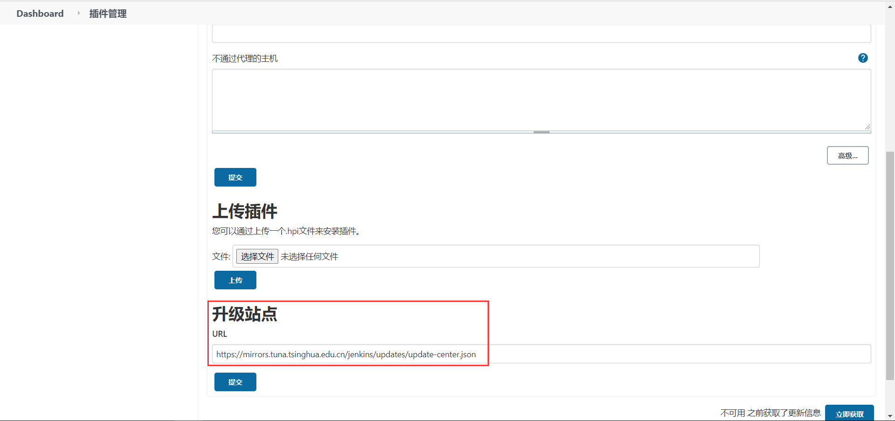
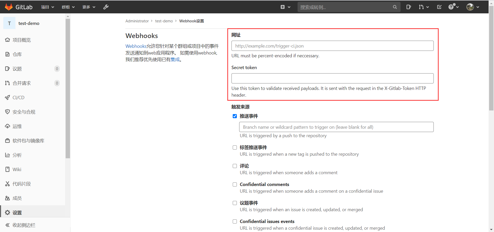

[TOC]

# jenkins

## 系统要求

最低推荐配置:

- 256MB可用内存
- 1GB可用磁盘空间(作为一个Docker容器运行jenkins的话推荐10GB)

为小团队推荐的硬件配置:

- 1GB+可用内存
- 50 GB+ 可用磁盘空间


## 安装

参考：[文档](https://www.jenkins.io/zh/doc/book/installing/)


## 运行

第一步、使用docker拉取jenkins镜像并启动容器。

[参考](https://github.com/jenkinsci/docker)

```bash
docker run --name jenkins_test -itd -p 11005:8080 -p 50000:50000 jenkins/jenkins:lts
# 启动后放行端口
firewall-cmd --add-port=11005/tcp --permanent
firewall-cmd --reload
```


第二步、打印容器日志，复制输出的admin密码

```bash
docker logs jenkins_test -f
```


第三步、浏览器输入ip+端口查看jenkins页面，如：http://192.168.11.79:11005/。将第二步复制的密码输入，然后点继续。


第四步、安装插件，插件下载比较缓慢，不同网络环境耗时不一样（**部分插件需要连接谷歌服务，所以不使用VPN可能安装失败**）。


第五步、创建管理员账号。


第六步、保存Jenkins URL，后续与gitlab进行连接时需要使用到。


第七步、安装完成后点击重启，稍等片刻即可进入jenkins操作面板。


## 插件

### 使用清华镜像加速

第一步、前往[清华大学开源软件镜像站](https://mirrors.tuna.tsinghua.edu.cn/)，搜索jenkins进入jenkins/updates目录。找到[update-center.json](https://mirrors.tuna.tsinghua.edu.cn/jenkins/updates/update-center.json)文件，复制链接地址。


第二步、点击系统管理-插件管理-高级。将第一步复制的链接地址替换掉升级站点的URL。





### 安装插件

第一步、进入[官网](https://www.jenkins.io/zh/)，点击插件。


第二步、搜索需要的插件名，点击插件进入详情。


第三步、进入插件详情，点击右上角的Archives。


第四步、点击插件版本号，即可开始下载插件。


第五步、进入jenkins操作面板，点击系统管理-插件管理-高级。将第四步下载的hpi插件上传，即可开始安装插件。勾选“安装完成后重启Jenkins(空闲时)”，jenkins重启后即可完成安装。


## gitlab

### 授权登录

第一步、jenkins中安装gitlab相关插件


第二步、jenkins中系统管理-全局安全配置-授权策略，勾选Gitlab Commiter Authorization Strategy。然后Admin User Names输入gitlab用户名，勾选Use Gitlab repository permissions、Grant READ permissions to all Authenticated Users、Grant READ permissions for Anonymous Users、Grant ViewStatus permissions for Anonymous Users，最后点保存。


第三步、gitlab中点管理中心-应用，点击New application。输入名称、Redirect URI、并在范围里勾选api。Redirect URI填写jenkins的ip地址 + /securityRealm/finishLogin即可。最后点保存。


第四步、在jenkins中系统管理-全局安全配置-安全域勾选Gitlab Authentication Plugin，将第三步保存后生成的应用id和密码，分别填写到Client ID和Client Secret。GitLab Web URI和GitLab API URI填写gitlab的ip地址即可。最后点保存。


第五步、以上步骤设置成功后，在jenkins中点右上角注销然后重新登录，就会出现gitlab授权登录页面，点击授权即可使用gitlab账号成功登录jenkins。


### 自动化构建

第一步、jenkins中，操作面板界面，点击新建任务。输入任务名称，选择构建一个自由风格的软件项目，点击确定。


第二步、在gitlab中，创建一个示例项目。


第三步、在jenkins中，点击右上角用户名，然后点击左侧凭据，点击全局凭据-添加凭据。


第四步、凭据类型选择SSH Username with private key，然后填写Username和Private Key。然后在虚拟机中输入家目录下新建一个临时目录，执行ssh-keygen生成公私钥对。将私钥填入Private Key中，最后点确定。


第五步、在gitlab中，进入管理中心-部署密钥，点击新建部署密钥。然后将第四步生成的公钥填入键中，点击Create。


第六步、在gitlab中回到项目，点击左边设置-仓库，然后点击Deploy keys的展开。找到公开访问的部署密钥点击启用。


第七步、在gitlab中克隆项目的仓库地址，回到jenkins，点击任务列表中的任务名称，选择配置。在源码管理中选择Git，将克隆的仓库地址复制到Repository URL，然后点击Credentials下拉选项，选择第四步生成的凭据deploy。


第八步、在构建触发器中勾选Build when a change is pushed to GitLab. GitLab webhook URL: http://192.168.11.79:11005/project/front-dev，然后点高级，生成Secret token。


第九步、在gitlab中，点击左侧设置-集成，点击转到Webhooks。将第八步的webhook URL和Secret token输入，然后取消勾选启用SSL验证。最后点击Add webhook。





第十步、在jenkins中，在构建中选择执行 shell，输入你要执行的shell命令，最后点击保存。


第十一步、在本地克隆gitlab对应的项目仓库，修改代码，然后提交并推送到gitlab。稍等片刻在jenkins中的构建队列即可看到对应的任务正在构建。点击任务名进入任务详情，在Build History上点击序号上显示的控制台输出，即可查看到构建过程中的控制台输出。


