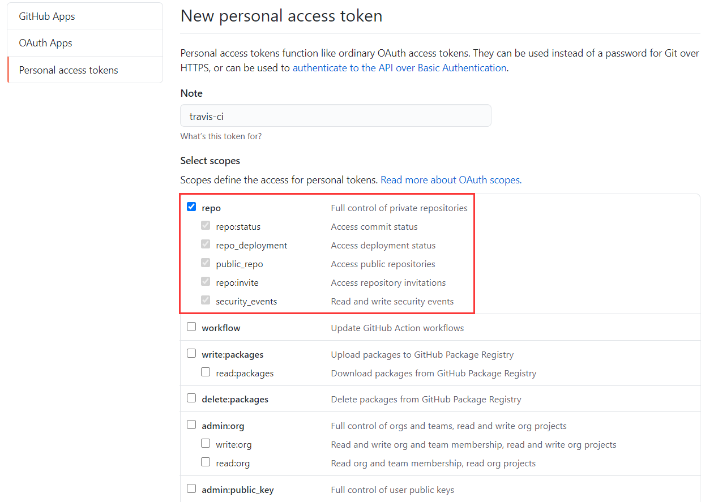
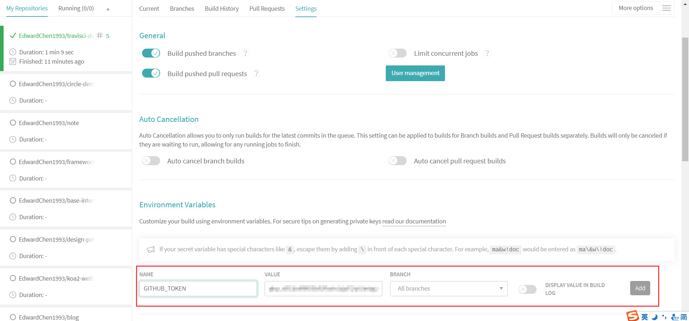

[TOC]

# travisci

## 操作流程

**第一步、进入[官网](https://travis-ci.com)，使用github账户注册并授权。**


**第二步、同步github账户数据和激活所有仓库，激活后点击列表中对应的仓库即可进入仓库详情。**


**第三步、在github上新建仓库，并克隆项目代码到本地。**


**第四步、在本地项目目录新建.travis.yml文件，用于配置travisci。**

详细配置参考：[文档](https://docs.travis-ci.com/user/job-lifecycle/)

.travis.yml：

```yaml
# 设置语言环境
language: node_js
# 设置语言版本
node_js:
  - 10

# npm 默认启用缓存，如果想禁用将以下选项设置为 false 即可
cache:
  npm: true

# 安装依赖
install:
  - npm install

# 构建步骤
script:
  - npm run build

# 部署配置
deploy:
  provider: pages
  skip_cleanup: true
  local_dir: dist/
  github_token: $GITHUB_TOKEN  # 在 travisci 存储库的设置页面中设置，作为安全环境变量
  keep_history: false
  name: EdwardChen
  email: 872990547@qq.com
  on:
    branch: master
```


**第五步、在github中的settings创建personal access token，创建成功后复制生成的token。**





**第六步、在travisci的More options的Settings中，将第四步生成的token添加到环境变量。**





**第七步、修改项目代码，然后提交并推送到github。稍等片刻就会自动触发travisci的构建任务，自动执行.travis.yml中定义的install、script和deploy任务进行构建部署。**


