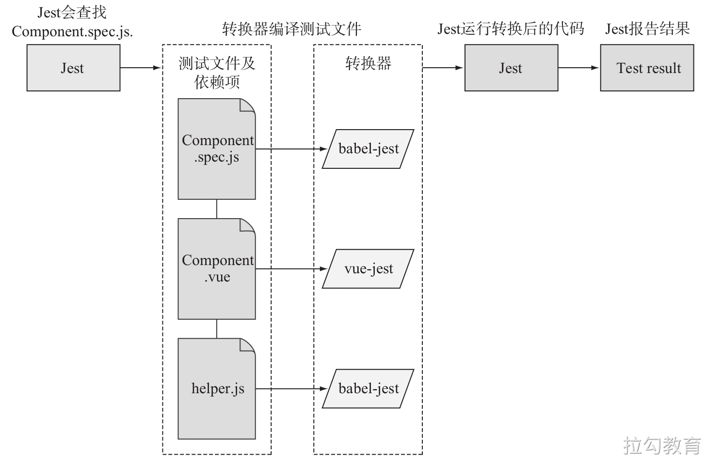

[TOC]


# Vue Test Utils 使用

## 在 Vue 应用中集成 Jest

- 方式一：使用 Vue CLI 创建项目的时候。
- 方式二：在一个已有的 Vue CLI 创建的项目中配置 Jest：`vue add unit-jest`
- 方式三：[手动配置](https://vue-test-utils.vuejs.org/zh/installation/)。


下面以方式一为例进行演示。

```shell
? Please pick a preset: Manually select features
? Check the features needed for your project: Choose Vue version, Babel, Linter, Unit
? Choose a version of Vue.js that you want to start the project with 2.x
? Pick a linter / formatter config: Standard
? Pick additional lint features: Lint on save, Lint and fix on commit
? Pick a unit testing solution: Jest
? Where do you prefer placing config for Babel, ESLint, etc.? In dedicated config files
? Save this as a preset for future projects? No
```

选择 "Manually select features" 和 "Unit Testing"，以及 "Jest" 作为 test runner。


一旦安装完成，cd 进入项目目录中并运行 `npm run test:unit`。如果一切顺利，你将看到：

```shell
 PASS  tests/unit/HelloWorld.spec.js
  HelloWorld.vue
    ✓ renders props.msg when passed (26ms)

Test Suites: 1 passed, 1 total
Tests:       1 passed, 1 total
Snapshots:   0 total
Time:        2.074s
```

恭喜，你已经运行了你的第一个通过的测试！


## Jest 默认配置说明

```javascript
// node_modules/@vue/cli-plugin-unit-jest/presets/default/jest-preset.js
module.exports = {
  moduleFileExtensions: [ // 可以省略的模块扩展名
    'js',
    'jsx',
    'json',
    // tell Jest to handle *.vue files
    'vue'
  ],
  transform: { // 模块转换器
    // process *.vue files with vue-jest
    '^.+\\.vue$': require.resolve('vue-jest'), // .vue 模块使用 vue-jest 转换
    '.+\\.(css|styl|less|sass|scss|svg|png|jpg|ttf|woff|woff2)$':
    require.resolve('jest-transform-stub'), // css 等模块使用 jest-transform-stub 转换为字符串
    '^.+\\.jsx?$': require.resolve('babel-jest') // .jsx 模块使用 babel-jest 转换
  },
  transformIgnorePatterns: ['/node_modules/'], // 不转换第三方包资源模块
  // support the same @ -> src alias mapping in source code
  // 支持模块加载路径中的 @ 别名
  moduleNameMapper: {
    '^@/(.*)$': '<rootDir>/src/$1'
  },
  // 测试环境，Jest中的默认环境是通过jsdom的类似于浏览器的环境
  // 如果要构建 node 应用，则可以使用 node 选项来使用类似 node 的环境。
  // 通过在文件顶部添加 @jest-environment docblock，可以在该文件中指定另一个用于所有测试的环境
  testEnvironment: 'jest-environment-jsdom-fifteen',
  // serializer for snapshots
  
  // 序列化快照
  // 对 .vue 组件进行快照测试，快照存储为一个文件，文件内容需要格式化，这里使用 jest-serializer-vue 进行格式化处理
  snapshotSerializers: [
    'jest-serializer-vue'
  ],
  
  // 要测试的文件路径
  testMatch: [
    '**/tests/unit/**/*.spec.[jt]s?(x)',
    '**/__tests__/*.[jt]s?(x)'
  ],
  // 测试的浏览器环境地址
  // https://github.com/facebook/jest/issues/6766
  testURL: 'http://localhost/',
  
  // 监视运行测试的插件工具
  watchPlugins: [
    // 在监视模式下，为 p 方式筛选文件提供交互式选择文件功能
    require.resolve('jest-watch-typeahead/filename'),
    require.resolve('jest-watch-typeahead/testname')
  ]
}
```

详细的配置说明参考官方文档：https://jestjs.io/docs/zh-Hans/configuration。




- 当 Jest 加载 `.vue` 或 `.js` 文件时，会在正确的转换器中运行，并将文件转换为可在 Node 下运行的 JavaScript 代码。
- Jest 通过 vue-jest 和 babel-jest 编译一个组件。


Vue Test Utils 通过将它们隔离挂载，然后模拟必要的输入 (prop、注入和用户事件) 和对输出 (渲染结果、触发的自定义事件) 的断言来测试 Vue 组件。

被挂载的组件会返回到一个[包裹器](https://vue-test-utils.vuejs.org/zh/api/wrapper/)内，而包裹器会暴露很多封装、遍历和查询其内部的 Vue 组件实例的便捷的方法。

你可以通过 `mount` 方法来创建包裹器。让我们创建一个名叫 `test.js` 的文件：

```javascript
// test.js

// 从测试实用工具集中导入 `mount()` 方法
// 同时导入你要测试的组件
import { mount } from '@vue/test-utils'
import Counter from './counter'

// 现在挂载组件，你便得到了这个包裹器
const wrapper = mount(Counter)

// 你可以通过 `wrapper.vm` 访问实际的 Vue 实例
const vm = wrapper.vm

// 在控制台将其记录下来即可深度审阅包裹器
// 我们对 Vue Test Utils 的探索也由此开始
console.log(wrapper)
import Greeting from '@/components/Greeting.vue'
import { mount } from '@vue/test-utils'

test('renders a greeting', () => {
  const wrapper = mount(Greeting)
  expect(wrapper.html()).toMatch('Vue and TDD')
})
```


## mount 和 shallowMount

`vue-test-utils` 提供了两种方式用于渲染，或者说 **加载（mount）** 一个组件 -- `mount` 和 `shallowMount`。一个组件无论使用这两种方法的哪个都会返回一个 `wrapper`，也就是一个包含了 Vue 组件的对象，辅以一些对测试有用的方法。

让我们从两个简单的组件开始：

```html
<!-- src\components\Child.vue -->
<template>
  <div>
    <h1>Child</h1>
  </div>
</template>
<!-- src\components\Parent.vue -->
<template>
  <div>
    <h1>Parent</h1>
    <Child/>
  </div>
</template>

<script>
import Child from './Child'

export default {
  components: {
    Child
  }
}
</script>
```

先来渲染 `Child` 并调用由 `vue-test-utils` 提供的用以核查置标语言的 `html` 方法。

```javascript
const shallowWrapper = shallowMount(Child)
const mountWrapper = mount(Child)

console.log(shallowWrapper.html())
console.log(mountWrapper.html())
```

`mountWrapper.html()` 和 `shallowWrapper.html()` 都产生了如下输出：

```html
<div>
	<h1>Child</h1>
</div>
```

此次并没有差别。换作 `Parent` 又如何呢？

```javascript
const shallowWrapper = shallowMount(Parent)
const mountWrapper = mount(Parent)

console.log(shallowWrapper.html())
console.log(mountWrapper.html())
```

`mountWrapper.html()` 现在产生了：

```html
<div>
  <h1>Parent</h1>
  <div>
    <h1>Child</h1>
  </div>
</div>
```

这完整地渲染了 `Parent` 和 `Child` 的标记。


而 `shallowWrapper.html()` 产生了如下输出：

```html
<div>
  <h1>Parent</h1>
  <child-stub></child-stub>
</div>
```

原本 `<Child />` 应该出现的地方被替换成了 `<child-stub />`。`shallowMount` 会渲染常规的 HTML 元素，但将用 stub 替换掉 Vue 组件。

一个 stub 就是一种替代真实组件的 “假的” 对象


这会很管用。想象一下要测试你的 `App.vue` 组件，看起来是这样的：

```html
<template>
  <div>
    <h1>My Vue App</h1>
    <fetch-data />
  </div>
</template>
```

并且我们只想测试 `<h1>My Vue App</h1>` 被正确地渲染了。但同时我们也有一个 `<fetch-data>` 组件，该组件在其 `mounted` 生命周期钩子中向外部 API 发起一个请求。


如果我们用了 `mount`，尽管我们只想断言一些文本被渲染，但 `<fetch-data />` 也将发起 API 请求。这将拖慢测试并容易出错。所以，我们 stub 掉外部依赖。通过使用 `shallowMount`，`<fetch-data />` 将会被替换为一个 `<vuecomponent-stub />`，并且 API 调用也不会被初始化了。


## 测试 Props

`propsData` 对于 `mount` 和 `shallowMount` 都可以使用。它经常被用于测试从父组件中接受属性（props）的组件。

`propsData` 会以下面的形式被传入 `shallowMount` 或 `mount` 的第二个参数中：

```javascript
const wrapper = shallowMount(Foo, {
  propsData: {
    foo: 'bar'
  }
})
```


## 明白要测试的是什么

对于 UI 组件来说，我们不推荐一味追求行级覆盖率，因为它会导致我们过分关注组件的内部实现细节，从而导致琐碎的测试。


### 组件测试不应该测什么

**1、单纯测组件模板中的 HTML**

比如，测试组件模板中有几个 `div`、`input`、`button`，以及元素的 `class`、`id` 属性等与业务逻辑无关的纯 UI 测试。这里并非说我们不需要关注组件的 UI，而是出于以下几个考量：

- 使用单元测试测试组件的 UI 会导致测试非常繁琐，为了测试覆盖的全面会导致针对一个组件写出大量的测试，不但降低了开发效率还体验非常差
- 这种单纯的 UI 测试是非常脆弱的，这类测试和组件模板是强耦合的，一旦我们对 HTML 结构进行调整，测试就会挂掉，这就造成了测试非常难以维护。而实际上我们往往并不关心组件模板中的具体 HTML 结构是怎样的，我们只关心组件呈现出来的样子
- 像 Jest 等前端测试框架已经提供了快照测试来帮助我们对比修改引起的 UI 变化，并且我们也可以使用Storybook这类工具实现可视化的 UI 测试

**2、测试组件的内部方法**

如果一些方法只是在组件内部调用其他方法而没有任何暴露给外部的行为（比如更改了组件的 UI、请求外部 API 等），那这些方法是不需要测试的。我们希望一个组件就像一个黑盒一样，我们不关心其内部的处理逻辑而只关注其外部呈现。


### 组件测试应该测什么

取而代之的是，我们推荐把测试撰写为断言你的组件的公共接口，并在一个黑盒内部处理它。一个简单的测试用例将会断言一些输入 (用户的交互或 prop 的改变) 提供给某组件之后是否导致预期结果 (渲染结果或触发自定义事件)。


比如，对于每次点击按钮都会将计数加一的 `Counter` 组件来说，其测试用例将会模拟点击并断言渲染结果会加 1。该测试并没有关注 `Counter` 如何递增数值，而只关注其输入和输出。


该提议的好处在于，即便该组件的内部实现已经随时间发生了改变，只要你的组件的公共接口始终保持一致，测试就可以通过。


这个话题的细节在 [Matt O'Connell 一份非常棒的演讲](https://www.youtube.com/watch?v=OIpfWTThrK8)中有更多的讨论。


### 如何进行组件测试

1、确定业务逻辑

2、确认输入和输出

3、不要超出输入和输出的界限

3、不要测试其它库的功能


### 举个例子

## Vue Test Utils 常用技巧

参考：https://vue-test-utils.vuejs.org/zh/guides/common-tips.html。


## 配合 TypeScript 使用

参考：[https://vue-test-utils.vuejs.org/zh/guides/#%E9%85%8D%E5%90%88-typescript-%E4%BD%BF%E7%94%A8](https://vue-test-utils.vuejs.org/zh/guides/#配合-typescript-使用)。


## 参考链接

- https://vuejsdevelopers.com/2019/08/26/vue-what-to-unit-test-components/
- [https://laylawang17.github.io/2020/03/19/Vue%E7%BB%84%E4%BB%B6%E6%B5%8B%E8%AF%95%E6%B5%8B%E4%BB%80%E4%B9%88/](https://laylawang17.github.io/2020/03/19/Vue组件测试测什么/)


# Vue 和 BDD

## 介绍

**TDD 的问题：**

- 由于是以单元测试为主，会导致做出来的东西和实际功能需求相偏离
- 过于依赖被测试功能的实现逻辑导致测试代码和实现代码耦合太高难以维护


**BDD 行为驱动开发：**

- 不需要再面向实现细节设计测试，取而代之的是面向行为来测试
-  BDD 的核心是关注软件的功能测试，所以 BDD 更多的是结合集成测试进行


**BDD 开发流程：**

1、开发人员和非开发人员一起讨论确认需求

2、以一种自动化的方式将需求建立起来，并确认是否一致

3、最后，实现每个文档示例描述的行为，并从自动化测试开始以指导代码的开发

4、功能验收


**BDD 解决方案：**

- [Cucumber](https://cucumber.io/)

- - 需求分析
  - 使用 [Gherkin](https://cucumber.io/docs/gherkin/) 语法描述需求
  - 将 Gherkin 描述的需求文档映射为自动化测试用例
  - 编写代码以通过测试
  - 功能验收

- BDD + TDD

- - 需求分析
  - 将需求映射为集成测试用例

- - - 单元测试
    - 编写代码以通过单元测试

- - 验证集成测试
  - 功能验收

- 轻量级 BDD 方案

- - 需求分析
  - 将需求映射为测试用例
  - 编写代码以通过测试
  - 功能验收

- TDD + BDD

- - 需求分析
  - TDD 测试驱动开发

- - - 编写单元测试
    - 编写代码以使测试通过

- - 编写集成测试验证功能需求


BDD 的核心是关注功能需求是否正确，所以先写测试后写测试都可以，但是通常情况下先写测试有助于对需求的理解，从而朝着正确的目标前进。


**Vue 中的 BDD 技术栈：**

- Jest + Vue Test Utils

- - 可以做单元测试
  - 也可以做集成测试

- Jest + Vue Testing Library

- - 只能做集成测试


## 配置测试环境

方式一：使用 Vue CLI 创建项目。

```bash
? Please pick a preset: Manually select features
? Check the features needed for your project: Choose Vue version, Babel, Router, Vuex, Linter, Unit
? Choose a version of Vue.js that you want to start the project with 2.x
? Use history mode for router? (Requires proper server setup for index fallback in production) No
? Pick a linter / formatter config: Standard
? Pick additional lint features: Lint on save, Lint and fix on commit
? Pick a unit testing solution: Jest
? Where do you prefer placing config for Babel, ESLint, etc.? In dedicated config files
? Save this as a preset for future projects? No
```

方式二：在一个已有的 Vue 项目中配置 Jest。

```bash
vue add unit-jest
```

方式三：[手动配置](https://vue-test-utils.vuejs.org/zh/installation/)。

测试环境准备完成之后需要简单配置一下功能测试代码结构及测试命令。

1、约定将所有的功能测试模块文件放到 /tests/feature 目录中

2、配置 npm scripts 脚本运行功能测试

```json
"scripts": {
  "test:unit": "vue-cli-service test:unit",
  "coverage": "vue-cli-service test:unit --coverage",
	"test:feature": "test:feature": "vue-cli-service test:unit --testMatch **/tests/feature/**/*.spec.[jt]s?(x)",
}
```

3、修改 ESLint 配置文件忽略 Jest 代码监测（可选）

```js
// .eslintrc
module.exports = {
  root: true,
  env: {
    node: true
  },
  extends: [
    'plugin:vue/essential',
    '@vue/standard'
  ],
  parserOptions: {
    parser: 'babel-eslint'
  },
  rules: {
    'no-console': process.env.NODE_ENV === 'production' ? 'warn' : 'off',
    'no-debugger': process.env.NODE_ENV === 'production' ? 'warn' : 'off'
  },
  overrides: [
    {
      files: [
        '**/__tests__/*.{j,t}s?(x)',
        '**/tests/unit/**/*.spec.{j,t}s?(x)',
        '**/tests/feature/**/*.spec.{j,t}s?(x)'
      ],
      env: {
        jest: true
      }
    }
  ]
}
```


运行测试：

```bash
npm run test:feature
```


## 需求分析及编写功能测试用例

## 使用 Vue Test Utils 进行功能测试


## 使用 Vue Testing Library 进行功能测试


参考：https://testing-library.com/docs/vue-testing-library/intro/。


Vue Testing Library 是一组专注于测试组件而不依赖实现细节的工具。由于在设计时就充分考虑了可访问性，它采用的方案也使重构变得轻而易举。


它的指导原则是，与软件使用方式相似的测试越多，它们提供的可信度就越高。


- [官方文档](https://testing-library.com/docs/vue-testing-library/intro/)
- [GitHub 仓库](https://github.com/testing-library/vue-testing-library)
- 基于 DOM Testing Library 构建
- 基于官方的 [@vue/test-utils](https://github.com/vuejs/vue-test-utils) 构建


Vue Testing Library 做三件事：

- 从 DOM Testing Library 重新导出查询实用程序和帮助程序。
- 隐藏与测试库指导原则冲突的 `@vue/test-utils` 方法。
- 从这两个来源调整了一些方法。


### [指导原则（思想）](https://testing-library.com/docs/guiding-principles/)

测试越类似于您的软件使用方式，它们就可以给您带来更多的信心。

我们尝试仅公开鼓励您编写与网页使用方式非常相似的测试的方法和实用程序。


根据以下指导原则，实用程序包括在该项目中：

- 如果涉及渲染组件，则它应处理 DOM 节点而不是组件实例，并且不应鼓励处理组件实例。
- 对于以用户使用它的方式测试应用程序组件，它通常应该是有用的。我们在这里进行权衡是因为我们使用的是计算机，通常是模拟的浏览器环境，但总的来说，实用程序应鼓励按预期使用组件的方式进行测试。
- 实用程序的实现和 API 应该简单灵活。


归根结底，我们想要的是使此库轻巧，简单并且易于理解。


Vue 测试库是用于测试 Vue 组件的非常轻巧的解决方案。它在 @vue/test-utils 之上提供了轻量级的实用程序功能，以鼓励更好的测试实践的方式。


它的核心思想是：

测试越类似于您的软件使用方式，它们就可以给您带来更多的信心。


因此，您的测试将不使用渲染的 Vue 组件实例，而是使用实际的 DOM 节点。


该库提供的实用程序使用户以与查询用户 DOM 相同的方式方便地查询 DOM。它们使您可以通过其标签文本查找元素，从其文本中查找链接和按钮，并断言您的应用程序可访问。


它还公开了一种建议的方式，即通过 `data-testid` 查找元素，以作为文本内容和标签不合理或不实际的元素的“转义阴影线”。


### 安装

```bash
npm install --save-dev @testing-library/vue
```


### 基本示例

```vue
<template>
  <div>
    <p>Times clicked: {{ count }}</p>
    <button @click="increment">increment</button>
  </div>
</template>

<script>
  export default {
    data: () => ({
      count: 0,
    }),

    methods: {
      increment() {
        this.count++
      },
    },
  }
</script>
```

```js
import { render, fireEvent } from '@testing-library/vue'
import Component from './Component.vue'

test('increments value on click', async () => {
  // render 方法返回一组用于查询组件的实用程序。
  const { getByText } = render(Component)

	// getByText 返回所提供文本的第一个匹配节点
  // 如果没有匹配到任何元素或者找到了多个匹配，则抛出错误。
  getByText('Times clicked: 0')

  const button = getByText('increment')

  // Dispatch a native click event to our button element.
  await fireEvent.click(button)
  await fireEvent.click(button)

  getByText('Times clicked: 2')
})
```


### 查询操作

单元素查询：

- getBy ...：返回查询的匹配节点，如果没有元素匹配或找到多个匹配项，则抛出描述性错误（如果期望多个元素，则使用getAllBy代替）。
- queryBy ...：返回查询的第一个匹配节点，如果没有元素匹配，则返回null。这对于声明不存在的元素很有用。如果找到多个匹配项，则会引发错误（如果可以，请使用queryAllBy代替）。
- findBy ...：返回一个Promise，该Promise在找到与给定查询匹配的元素时进行解析。如果未找到任何元素，或者在默认的1000ms超时后找到一个以上的元素，则拒绝诺言。如果需要查找多个元素，请使用findAllBy。


多元素查询：

- getAllBy ...：返回查询的所有匹配节点的数组，如果没有元素匹配，则引发错误。
- queryAllBy ...：返回查询的所有匹配节点的数组，如果没有元素匹配，则返回一个空数组（[]）。
- findAllBy ...：返回一个promise，当找到与给定查询匹配的任何元素时，该promise将解析为元素数组。如果在默认的1000ms超时后未找到任何元素，则承诺将被拒绝。

- - findBy方法是getBy *查询和waitFor的组合。他们接受waitFor选项作为最后一个参数（即await screen.findByText（'text'，queryOptions，waitForOptions））

| Type of Query   | 0 匹配      | 1 匹配   | 大于 1 个匹配 | 重试 |
| --------------- | ----------- | -------- | ------------- | ---- |
| **单节点查询**  |             |          |               |      |
| `getBy...`      | 抛出异常    | 返回元素 | 抛出异常      | 否   |
| `queryBy...`    | 返回 `null` | 返回元素 | 抛出异常      | 否   |
| `findBy...`     | 抛出异常    | 返回元素 | 抛出异常      | 是   |
| **多节点查询**  |             |          |               |      |
| `getAllBy...`   | 抛出异常    | 返回数组 | 返回数组      | 否   |
| `queryAllBy...` | 返回 `[]`   | 返回数组 | 返回数组      | 否   |
| `findAllBy...`  | 抛出异常    | 返回数组 | 返回数组      | 是   |


### 查询使用建议


根据指导原则，您的测试应尽可能类似于用户与您的代码（组件，页面等）的交互方式。考虑到这一点，我们建议按以下优先顺序：


**1、每个人均可访问的查询，这些查询反映了视觉/鼠标用户以及使用辅助技术的用户的体验**

- getByRole：可用于查询可访问性树中公开的每个元素。使用名称选项，您可以按其可访问名称过滤返回的元素。对于几乎所有内容，这应该是您的首选。没有太多您无法做到的（如果无法做到，则可能无法访问您的UI）。通常，它将与name选项一起使用，例如：getByRole（'button'，{name：/ submit / i}）。检查角色列表。
- getByLabelText：仅对表单字段真正有用，但这是用户找到这些元素的第一方法，因此它应该是您的首选。
- getByPlaceholderText：占位符不能替代标签。但是，如果您仅此而已，那么它会比其他方法更好。
- getByText：对表单无用，但这是用户找到大多数非交互式元素（例如div和spans）的数字1方法。
- getByDisplayValue：导航带有填充值的页面时，表单元素的当前值会很有用。


**2、语义查询HTML5和ARIA兼容的选择器。请注意，在浏览器和辅助技术之间，与这些属性进行交互的用户体验差异很大。**

- getByAltText：如果您的元素是支持替代文本（img，区域和输入）的元素，则可以使用它来查找该元素。
- getByTitle：屏幕阅读器无法始终读取title属性，默认情况下，视觉属性不可见的用户看不到该属性


**3、Test IDs**

- getByTestId：用户看不到（或听到）这些内容，因此仅在您无法按角色或文本进行匹配或没有意义（例如文本是动态的）的情况下才建议使用此方法。


### debug

为了方便起见，除了查询之外，屏幕还公开了调试方法。此方法本质上是console.log（prettyDOM（））的快捷方式。它支持调试文档，单个元素或元素数组。 

```js
import { screen } from '@testing-library/dom'

document.body.innerHTML = `
  <button>test</button>
  <span>multi-test</span>
  <div>multi-test</div>
`

// debug document
screen.debug()
// debug single element
screen.debug(screen.getByText('test'))
// debug multiple elements
screen.debug(screen.getAllByText('multi-test'))
```

对于使用test-playground进行调试，屏幕显示了这种方便的方法，该方法记录了可以在浏览器中打开的URL。

```js
import { screen } from '@testing-library/dom'

document.body.innerHTML = `
  <button>test</button>
  <span>multi-test</span>
  <div>multi-test</div>
`

// log entire document to testing-playground
screen.logTestingPlaygroundURL()
// log a single element
screen.logTestingPlaygroundURL(screen.getByText('test'))
```


### 手动查询

在测试库提供的查询之上，您可以使用常规的querySelector DOM API来查询元素。请注意，不建议将其用作逃生舱口，以按类或ID查询，因为它们对于用户是不可见的。如有必要，请使用一个testid，以使您可以轻松地回退非语义查询，并在HTML中建立稳定的API合同。 

```js
// @testing-library/react
const { container } = render(<MyComponent />)
const foo = container.querySelector('[data-foo="bar"]')
```


### 查询辅助工具

- https://chrome.google.com/webstore/detail/testing-playground/hejbmebodbijjdhflfknehhcgaklhano/related


### Playground

如果您想更熟悉这些查询，可以在 [testing-playground.com](https://testing-playground.com/) 上尝试一下。 Testing Playground 是一个交互式沙箱，您可以在其中对自己的 html 运行不同的查询，并获得与上述规则匹配的视觉反馈。


## 业务功能测试

## 优化

```js
// jest.config.js
module.exports = {
  preset: '@vue/cli-plugin-unit-jest',
  setupFilesAfterEnv: ['./jest.setup.js']
}
```

```js
// jest.setup.js
import { Wrapper } from '@vue/test-utils'

Wrapper.prototype.findById = function (id) {
  return this.find(`[data-testid=${id}]`)
}

Wrapper.prototype.findAllById = function (id) {
  return this.findAll(`[data-testid=${id}]`)
}
```

```ts
// types.d.ts
import { Wrapper } from '@vue/test-utils'
import Vue from 'vue'

declare module '@vue/test-utils' {
  export interface Wrapper {
    findById (id: string): Wrapper<Vue>
    findAllById (id: string): WrapperArray<Vue>
  }
}
```


## 总结

对于前端应用开发来说，在保证开发效率和软件质量的前提下，我个人更倾向于 BDD 模式。