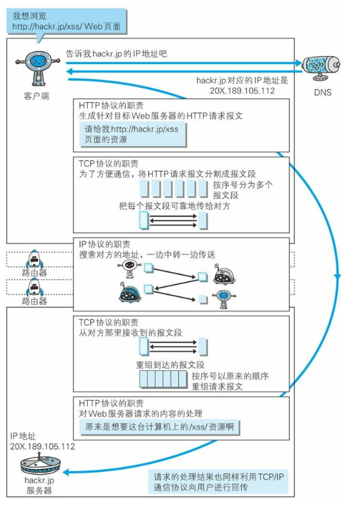
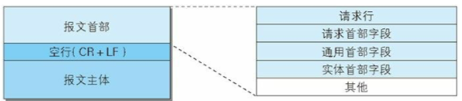
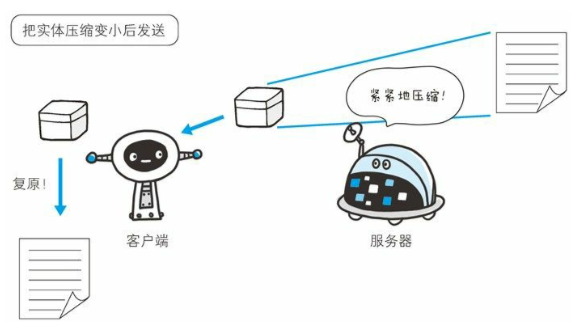
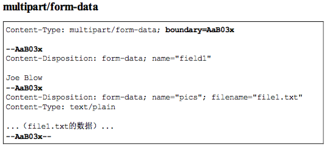
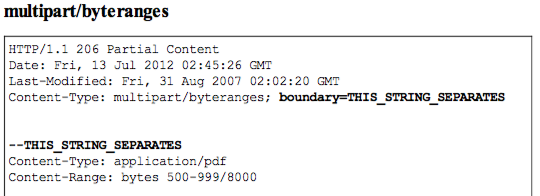

[TOC]

# http

## 1.HTTP协议和TCP协议



## 1.1 长链接


## 1.2 管线化


## 2. URI和URL

### 2.1 URI

URI(Uniform Resource Identifier)是统一资源标识符,在某个规则下能把这个资源独一无二标示出来，比如人的身份证号

- Uniform 不用根据上下文来识别资源指定的访问方式
- Resource 可以标识的任何东西
- Identifier 表示可标识的对象

### 2.2 URL

统一资源定位符，表示资源的地点，URL时使用浏览器访问WEB页面时需要输入的网页地址

- Uniform 不用根据上下文来识别资源指定的访问方式
- Resource 可以标识的任何东西
- Location 定位

### 2.2.1 URL的格式


- 协议类型
- 登录信息
- 服务器地址
- 服务器端口号
- 带层次的文件路径
- 查询字符串
- 片段标识符

## 3. HTTP

- 请求的一方叫客户端，响应的一方叫服务器端
- 通过请求和响应达成通信
- HTTP是一种不保存状态的协议

### 3.1 请求报文




- 请求行
  - 方法
    - GET 获取资源
    - POST 向服务器端发送数据，传输实体主体
    - PUT 传输文件
    - HEAD 获取报文首部
    - DELETE 删除文件
    - OPTIONS 询问支持的方法
    - TRACE 追踪路径
    - 
  - 协议/版本号
  - URL
- 请求头
  - 通用首部(General Header)
  - 请求首部(Request Header)
  - 响应首部(Response Header)
  - 实体首部(Entity Header Fields)
- 请求体

### 3.2 响应报文

- 
- 
- 响应行
- 响应头
- 响应体

### 3.3 编码

HTTP可以在传输的过程中通过编码提升传输效率，但是会消耗更多的CPU时间。

### 3.3.1 编码压缩

发送文件时可以先用ZIP压缩功能后再发送文件



- gzip
- compress
- deflate
- identify

### 3.3.2 分割发送的分块传输编码

请求的实体在尚未传输完成前浏览器不能显示。所以在传输大容量数据时，通过把数据分割成多块，能让浏览器逐步显示页面。


### 3.3.3 多部分对象集合

- 一份报文主体中可以包含多类型实体。
- 使用boundary字符串来划分多部分对象指明的各类实体。在各个实体起始行之前插入**--**标记,多部分对象集合最后插入**--**标记


#### 3.3.3.1 multiparty/form-data

上传表单时使用multiparty/form-data



#### 3.3.3.2 multipart/byteranges 206(Particial Content)

状态码(Partical Content)响应报文中包含多个范围时使用

- 

### 3.3.4 获取部分内容的范围请求

为了实现中断恢复下载的需求，需要能下载指定下载的实体范围

- 请求头中的Range来指定 资源的byte范围
- 响应会返回状态码206响应报文
- 对于多重范围的范围请求，响应会在首部字段`Content-Type`中标明`multipart/byteranges`
- 
- 

### 3.4 内容协商

- 首部字段
  - Accept
  - Accept-Charset
  - Accept-Encoding
  - Accept-Language
  - Content-Language
- 协商类型
  - 服务器驱动
  - 客户端驱动协商
  - 透明协商

### 3.5 状态码

状态码负责表示客户端请求的返回结果、标记服务器端是否正常、通知出现的错误

#### 3.5.1 状态码类别

| 类别 | 原因短语                       |      |
| :--- | :----------------------------- | ---- |
| 1XX  | Informational(信息性状态码)    |      |
| 2XX  | Success(成功状态码)            |      |
| 3XX  | Redirection(重定向)            |      |
| 4XX  | Client Error(客户端错误状态码) |      |
| 5XX  | Server Error(服务器错误状态吗) |      |

#### 3.5.2 2XX 成功

- 200(OK 客户端发过来的数据被正常处理
- 204(Not Content 正常响应，没有实体
- 206(Partial Content 范围请求，返回部分数据，响应报文中由Content-Range指定实体内容

#### 3.5.3 3XX 重定向

- 301(Moved Permanently) 永久重定向
- 302(Found) 临时重定向，规范要求方法名不变，但是都会改变
- 303(See Other) 和302类似，但必须用GET方法
- 304(Not Modified) 状态未改变 配合(If-Match、If-Modified-Since、If-None_Match、If-Range、If-Unmodified-Since)
- 307(Temporary Redirect) 临时重定向，不该改变请求方法

#### 3.5.4 4XX 客户端错误

- 400(Bad Request) 请求报文语法错误
- 401 (unauthorized) 需要认证
- 403(Forbidden) 服务器拒绝访问对应的资源
- 404(Not Found) 服务器上无法找到资源

#### 3.5.5 5XX 服务器端错误

- 500(Internal Server Error)服务器故障
- 503(Service Unavailable) 服务器处于超负载或正在停机维护

## 4. Web服务器

### 4.1 虚拟主机(Virtual Host)

一台HTTP服务器上搭建多个Web站点,客户端发送请求时必须在Host首部完整指定主机名或域名的URL

### 4.2 通信转发程序:代理、网关

#### 4.2.1 代理

代理就是客户端和服务器的中间人


##### 4.2.1.1 为啥使用代理

- 利用缓存技术减少网络流量

- 组织内部针对网站进行访问控制

- 获取访问日志

  ##### 4.2.1.2 代理的分类

- 缓存代理 会预先把资源副本保存在服务器上

- 透明代理 不对报文进行任何加工

#### 4.2.2 网关

接收从客户端发送来的数据时，会转发给其他服务器处理，再由自己返回

- 使通信线路上的服务器提供非HTTP协议服务
- 提高通信安全性


## 5. 首部

### 5.1 通用首部字段

| 首部字段名       | 说明                       |
| :--------------- | :------------------------- |
| Cache-Control    | 控制缓存行为               |
| Connection       | 链接的管理                 |
| Date             | 报文日期                   |
| Pragma           | 报文指令                   |
| Trailer          | 报文尾部的首部             |
| Trasfer-Encoding | 指定报文主体的传输编码方式 |
| Upgrade          | 升级为其他协议             |
| Via              | 代理服务器信息             |
| Warning          | 错误通知                   |

### 5.2 请求首部字段

| 首部字段名          | 说明                                        |
| :------------------ | :------------------------------------------ |
| Accept              | 用户代理可处理的媒体类型                    |
| Accept-Charset      | 优先的字符集                                |
| Accept-Encoding     | 优先的编码                                  |
| Accept-Langulage    | 优先的语言                                  |
| Authorization       | Web认证信息                                 |
| Expect              | 期待服务器的特定行为                        |
| From                | 用户的电子邮箱地址                          |
| Host                | 请求资源所在的服务器                        |
| If-Match            | 比较实体标记                                |
| If-Modified-Since   | 比较资源的更新时间                          |
| If-None-Match       | 比较实体标记                                |
| If-Range            | 资源未更新时发送实体Byte的范围请求          |
| If-Unmodified-Since | 比较资源的更新时间(和If-Modified-Since相反) |
| Max-Forwards        | 最大传输跳数                                |
| Proxy-Authorization | 代理服务器需要客户端认证                    |
| Range               | 实体字节范围请求                            |
| Referer             | 请求中的URI的原始获取方                     |
| TE                  | 传输编码的优先级                            |
| User-Agent          | HTTP客户端程序的信息                        |

### 5.3 响应首部字段

| 首部字段名         | 说明                         |
| :----------------- | :--------------------------- |
| Accept-Ranges      | 是否接受字节范围             |
| Age                | 资源的创建时间               |
| ETag               | 资源的匹配信息               |
| Location           | 客户端重定向至指定的URI      |
| Proxy-Authenticate | 代理服务器对客户端的认证信息 |
| Retry-After        | 再次发送请求的时机           |
| Server             | 服务器的信息                 |
| Vary               | 代理服务器缓存的管理信息     |
| www-Authenticate   | 服务器对客户端的认证         |

### 5.4 实体首部字段

| 首部字段名       | 说明                       |
| :--------------- | :------------------------- |
| Allow            | 资源可支持的HTTP方法       |
| Content-Encoding | 实体的编码方式             |
| Content-Language | 实体的自然语言             |
| Content-Length   | 实体的内容大小(字节为单位) |
| Content-Location | 替代对应资源的URI          |
| Content-MD5      | 实体的报文摘要             |
| Content-Range    | 实体的位置范围             |
| Content-Type     | 实体主体的媒体类型         |
| Expires          | 实体过期时间               |
| Last-Modified    | 资源的最后修改时间         |


## 6. HTTP服务器

HTTP全称是超文本传输协议，构建于TCP之上，属于应用层协议。

### 6.1 创建HTTP服务器

```javascript
let server  = http.createServer([requestListener]);
server.on('request',requestListener);
```

- requestListener 当服务器收到客户端的连接后执行的处理
  - http.IncomingMessage 请求对象
  - http.ServerResponse对象 服务器端响应对象

### 6.2 启动HTTP服务器

```javascript
server.listen(port,[host],[backlog],[callback]);
server.on('listening',callback);
```

- port 监听的端口号
- host 监听的地址
- backlog 指定位于等待队列中的客户端连接数

```javascript
let http = require('http');
let server = http.createServer(function(req,res){
}).listen(8080,'127.0.0.1',function(){console.log('服务器端开始监听!')});
```

### 6.3 关闭HTTP服务器

```javascript
server.close();
server.on('close',function(){});
let http = require('http');
let server = http.createServer(function(req,res){
});
server.on('close',function(){
    console.log('服务器关闭');
});
server.listen(8080,'127.0.0.1',function(){
    console.log('服务器端开始监听!')
    server.close();
});
```

### 6.4 监听服务器错误

```javascript
server.on('error',function(){
    if(e.code == 'EADDRINUSE'){
         console.log('端口号已经被占用!);   
    }
});
```

### 6.5 connection

```javascript
let server = http.createServer(function(req,res){
});
server.on('connection',function(){
    console.log(客户端连接已经建立);
});
```

### 6.6 setTimeout

设置超时时间，超时后不可再复用已经建立的连接，需要发请求需要重新建立连接。默认超时时间时2分钟

```javascript
server.setTimeout(msecs,callback);
server.on('timeout',function(){
    console.log('连接已经超时');
});
```

### 6.7 获取客户端请求信息

- request

  - method 请求的方法

  - url 请求的路径

  - headers 请求头对象

  - httpVersion 客户端的http版本

  - socket 监听客户端请求的socket对象

    ```javascript
    let http = require('http');
    let fs = require('fs');
    let server = http.createServer(function(req,res){
    if(req.url != '/favicon.ico'){
    let out = fs.createWriteStream(path.join(__dirname,'request.log'));
    out.write('method='+req.method);
    out.write('url='+req.url);
    out.write('headers='+JSON.stringify(req.headers));
    out.write('httpVersion='+req.httpVersion);
    }
    }).listen(8080,'127.0.0.1);
    ```

```javascript
let http = require('http');
let fs = require('fs');
let server = http.createServer(function(req,res){
  let body = [];
  req.on('data',function(data){
    body.push(data);
  });
  req.on('end',function(){
      let result = Buffer.concat(body);
      console.log(result.toString());
  });
}).listen(8080,'127.0.0.1);
```

### 6.8 querystring

querystring模块用来转换URL字符串和URL中的查询字符串

#### 6.8.1 parse方法用来把字符串转换成对象

```javascript
querystring.parse(str,[sep],[eq],[options]);
```

#### 6.8.2 stringify方法用来把对象转换成字符串

```javascript
querystring.stringify(obj,[sep],[eq]);
```

### 6.9 querystring

```javascript
url.parse(urlStr,[parseQueryString]);
```

- href 被转换的原URL字符串
- protocal 客户端发出请求时使用的协议
- slashes 在协议与路径之间是否使用了//分隔符
- host URL字符串中的完整地址和端口号
- auth URL字符串中的认证部分
- hostname URL字符串中的完整地址
- port URL字符串中的端口号
- pathname URL字符串的路径，不包含查询字符串
- search 查询字符串，包含?
- path 路径，包含查询字符串
- query 查询字符串，不包含起始字符串`?`
- hash 散列字符串，包含`#`

### 6.10 发送服务器响应流

http.ServerResponse对象表示响应对象

#### 6.10.1 writeHead

```javascript
response.writeHead(statusCode,[reasonPhrase],[headers]);
```

- content-type 内容类型
- location 将客户端重定向到另外一个URL地址
- content-disposition 指定一个被下载的文件名
- content-length 服务器响应内容的字节数
- set-cookie 在客户端创建Cookie
- content-encoding 指定服务器响应内容的编码方式
- cache-cache 开启缓存机制
- expires 用于制定缓存过期时间
- etag 指定当服务器响应内容没有变化不重新下载数据

#### 6.10.2 Header

设置、获取和删除Header

```javascript
response.setHeader('Content-Type','text/html;charset=utf-8');
response.getHeader('Content-Type');
response.removeHeader('Content-Type');
response.headersSent 判断响应头是否已经发送
```

#### 6.10.3 headersSent

判断响应头是否已经发送

```javascript
let http = require('http');
let server = http.createServer(function(req,res){
  console.log(resopnse.headersSent?"响应头已经发送":"响应头未发送!");
  res.writeHead(200,'ok);
  console.log(resopnse.headersSent?"响应头已经发送":"响应头未发送!");
});
```

#### 6.10.4 sendDate

不发送Date

```javascript
res.sendDate = false;
```

#### 6.10.5 write

可以使用write方法发送响应内容

```javascript
response.write(chunk,[encoding]);
response.end([chunk],[encoding]);
```

#### 6.10.6 timeout

可以使用setTimeout方法设置响应让超时时间，如果在指定时间内不响应，则触发timeout事件

```javascript
response.setTimeout(msecs,[callback]);
response.on('timeout',callback);
```

#### 6.10.7 close

在响应对象的end方法被调用之前，如果连接中断，将触发http.ServerResponse对象的close事件

```javascript
response.on('close',callback);
```

#### 6.10.8 parser

```javascript
net
onconnection

_http_server.js
连接监听
connectionListenerInternal
socketOnData
onParserExecuteCommon
parserOnIncoming
```

## 7. HTTP客户端

### 7.1 向其他网站请求数据

```javascript
let req = http.request(options,callback);
req.on('request',callback);
request.write(chunk,[encoding]);
request.end([chunk],[encoding]);
```

- host 指定目标域名或主机名
- hostname 指定目标域名或主机名，如果和host都指定了，优先使用hostname
- port 指定目标服务器的端口号
- localAddress 本地接口
- socketPath 指定Unix域端口
- method 指定HTTP请求的方式
- path 指定请求路径和查询字符串
- headers 指定客户端请求头对象
- auth 指定认证部分
- agent 用于指定HTTP代理，在Node.js中，使用http.Agent类代表一个HTTP代理，默认使用keep-alive连接，同时使用http.Agent对象来实现所有的HTTP客户端请求

```javascript
let http = require('http');
let options = {
    hostname: 'localhost',
    port: 8080,
    path: '/',
    method: 'GET'
}
let req = http.request(options, function (res) {
    console.log('状态吗:' + res.statusCode);
    console.log('响应头:' + JSON.stringify(res.headers));
    res.setEncoding('utf8');
    res.on('data', function (chunk) {
        console.log('响应内容', chunk);
    });
});
req.end();
```

### 7.2 取消请求

可以使用abort方法来终止本次请求

```javascript
req.abort();
```

### 7.3 监听error事件

如果请求过程中出错了，会触发error事件

```javascripot
request.on('error',function(err){});
```

### 7.4 socket

建立连接过程中，为该连接分配端口时，触发`socket`事件

```javascript
req.on('socket',function(socket){
  socket.setTimeout(1000);
  socket.on('timeout',function(){req.abort()});
});
```

### 7.5 get

可以使用get方法向服务器发送数据

```javascript
http.get(options,callback);
```

### 7.6 addTrailers

可以使用response对象的addTrailers方法在服务器响应尾部追加一个头信息

```javascript
let http = require('http');
let path = require('path');
let crypto = require('crypto');


let server = http.createServer(function (req, res) {
    res.writeHead(200, {
        'Transfer-Encoding': 'chunked',
        'Trailer': 'Content-MD5'
    });
    let rs = require('fs').createReadStream(path.join(__dirname, 'msg.txt'), {
        highWaterMark: 2
    });
    let md5 = crypto.createHash('md5');
    rs.on('data', function (data) {
        console.log(data);
        res.write(data);
        md5.update(data);
    });
    rs.on('end', function () {
        res.addTrailers({
            'Content-MD5': md5.digest('hex')
        });
        res.end();
    });
}).listen(8080);
let http = require('http');
let options = {
    hostname: 'localhost',
    port: 8080,
    path: '/',
    method: 'GET'
}
let req = http.request(options, function (res) {
    console.log('状态吗:' + res.statusCode);
    console.log('响应头:' + JSON.stringify(res.headers));
    res.setEncoding('utf8');
    res.on('data', function (chunk) {
        console.log('响应内容', chunk);
    });
    res.on('end', function () {
        console.log('trailer', res.trailers);
    });
});
req.end();
```

### 7.7 制作代理服务器

```javascript
let http = require('http');
let url = require('url');
let server = http.createServer(function (request, response) {
    let {
        path
    } = url.parse(request.url);
    let options = {
        host: 'localhost',
        port: 9090,
        path: path,
        headers: request.headers
    }
    let req = http.get(options, function (res) {
        console.log(res);
        response.writeHead(res.statusCode, res.headers);
        res.pipe(response);
    });
    req.on('error', function (err) {
        console.log(err);
    });
    request.pipe(req);
}).listen(8080);
```