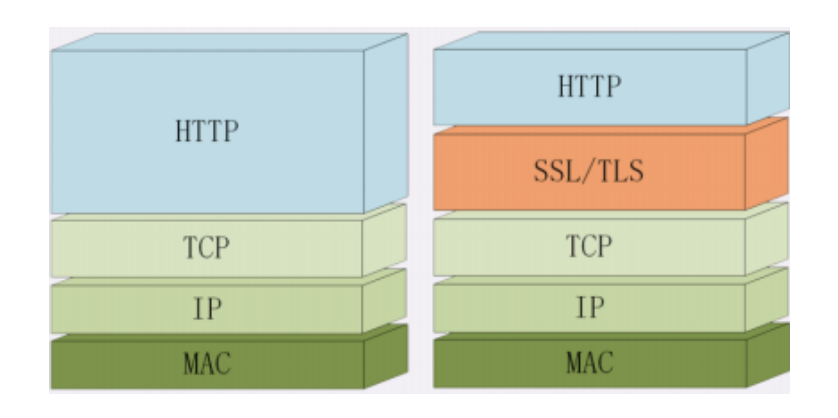
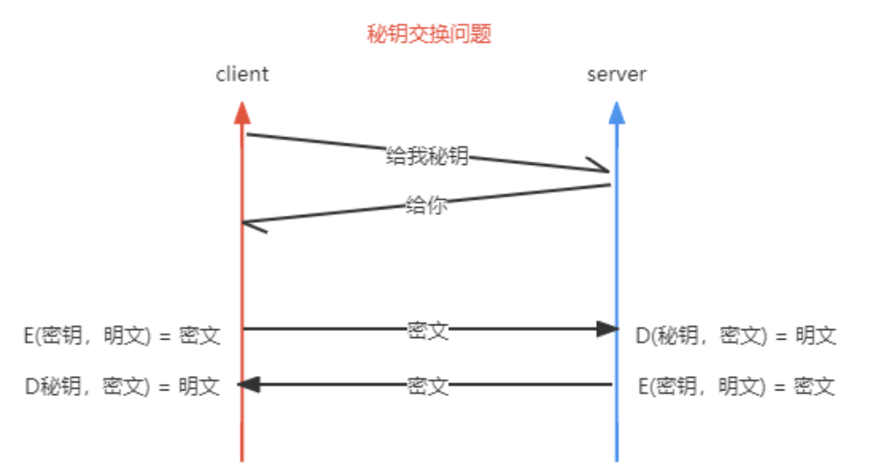
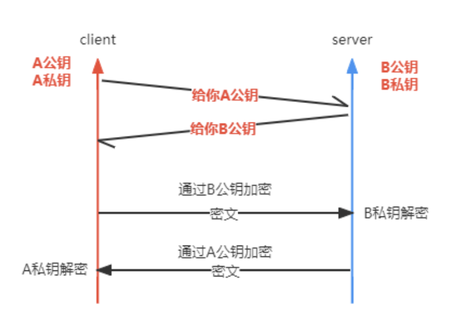
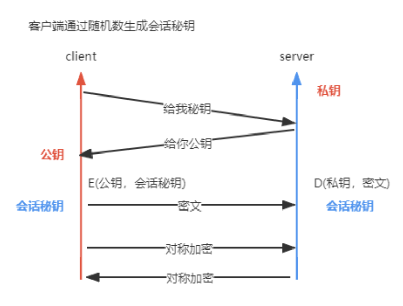
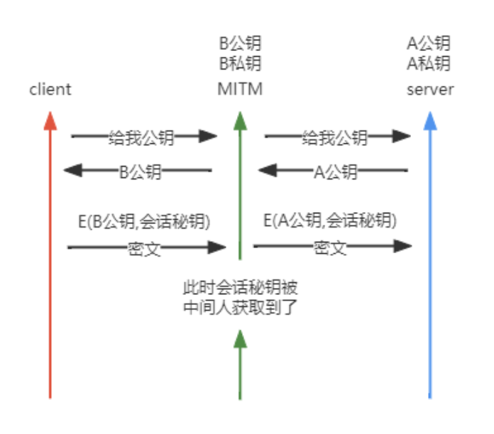
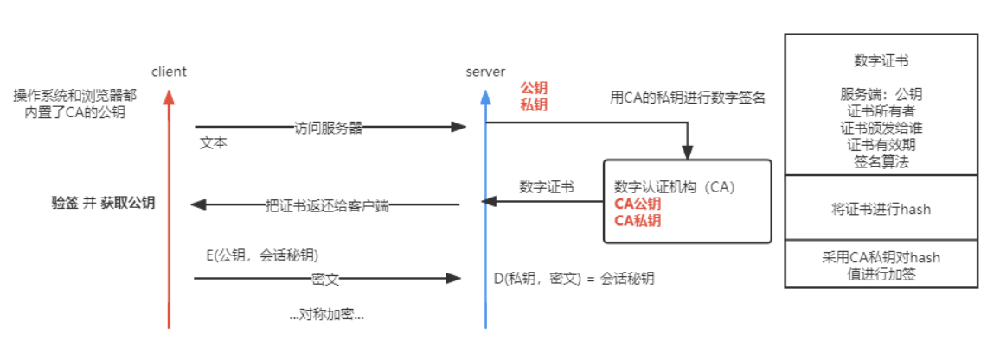
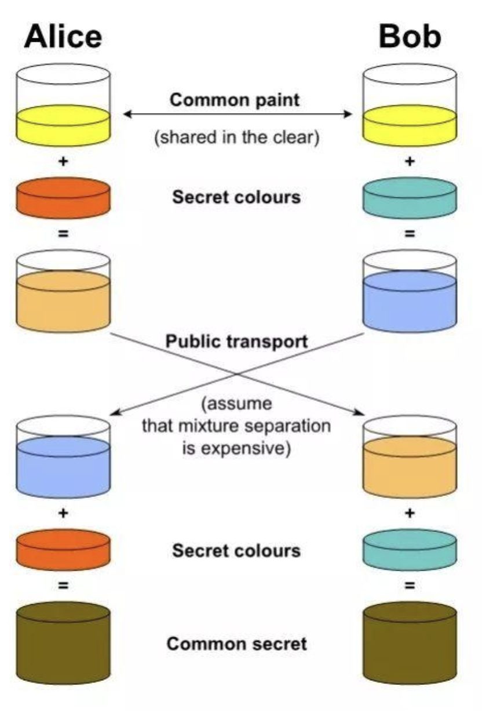
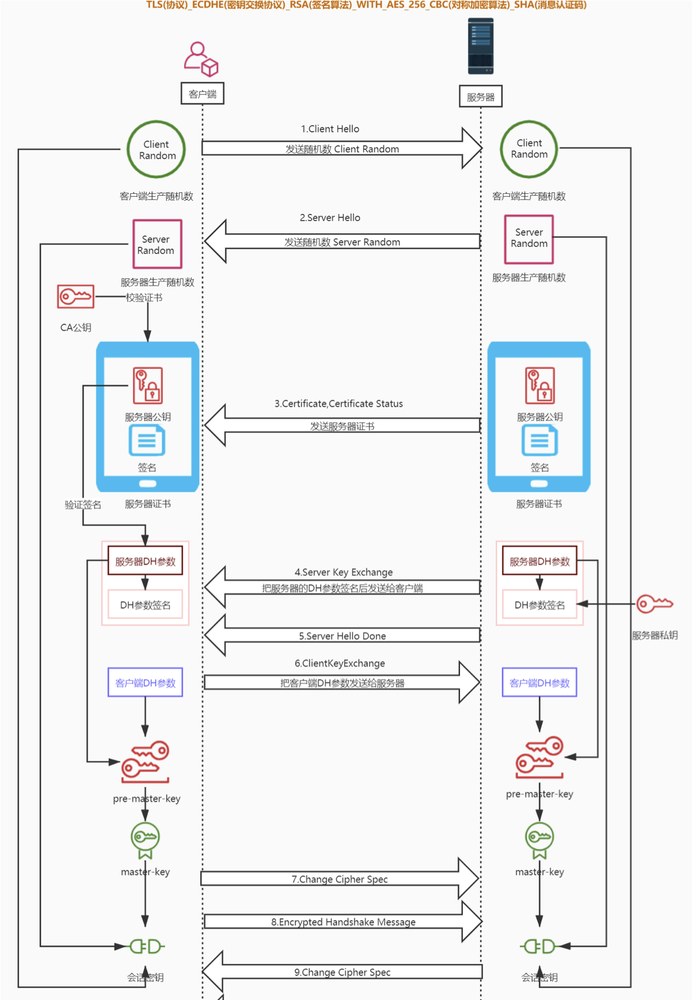
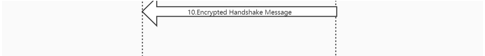

[TOC]

# 计算机网络

## OSI七层网络模型


| OSI七层模型 | 功能                                                         | 对应的网络协议                                               |
| :---------- | ------------------------------------------------------------ | ------------------------------------------------------------ |
| 应用层      | 应用层是网络体系中最高的一层，也是唯一面向用户的一层，也可视为为用户提供常用的应用程序，每个网络应用都对应着不同的协议 | HTTP、TFTP、FTP、NFS、WAIS、SMTP                             |
| 表示层      | 主要负责数据格式的转换，确保一个系统的应用层发送的消息可以被另一个系统的应用层读取，编码转换，数据解析，管理数据的解密和加密，同时也对应用层的协议进行翻译 | Telnet、Rlogin、SNMP、Gopher                                 |
| 会话层      | 负责网络中两节点的建立，在数据传输中维护计算机网络中两台计算机之间的通信连接，并决定何时终止通信 | SMTP、DNS                                                    |
| 传输层      | 是整个网络关键的部分，是实现两个用户进程间端到端的可靠通信，处理数据包的错误等传输问题。是向下通信服务最高层，向上用户功能最底层。即向网络层提供服务，向会话层提供独立于网络层的传送服务和可靠的透明数据传输。 | TCP、UDP                                                     |
| 网络层      | 进行逻辑地址寻址，实现不同网络之间的路径选择，IP就在网络层   | IP、ICMP、ARP、 RARP、 AKP、 UUCP                            |
| 数据链路层  | 物理地址（MAC地址），网络设备的唯一身份标识。建立逻辑连接、进行硬件地址寻址，相邻的两个设备间的互相通信 | FDDI、 Ethernet, Arpanet、 PDN,、SLIP、PPP、STP、HDLC、SDLC、帧中继 |
| 物理层      | 七层模型中的最底层，主要是物理介质传输媒介（网线或者是无线），在不同设备中传输比特，将0/1信号与电信号或者光信号互相转化 | IEEE 802.1A、IEEE 802.2到IEEE 802                            |


## TCP

### TCP 和 UDP 的区别

|              | UDP                                        | TCP                                    |
| ------------ | ------------------------------------------ | -------------------------------------- |
| 是否连接     | 无连接                                     | 面向连接                               |
| 是否可靠     | 不可靠传输，不使用流量控制和拥塞控制       | 可靠传输，使用流量控制和拥塞控制       |
| 连接对象个数 | 支持一对一，一对多，多对一和多对多交互通信 | 只能是一对一通信                       |
| 传输方式     | 面向报文                                   | 面向字节流                             |
| 首部开销     | 首部开销小，仅8字节                        | 首部最小20字节，最大60字节             |
| 适用场景     | 适用于实时应用（IP电话、视频会议、直播等） | 适用于要求可靠传输的应用，例如文件传输 |


### TCP三次握手建立连接


**第一次握手**

客户端向服务端发送连接请求报文段。该报文段中包含自身的数据通讯初始序号。请求发送后，客户端便进入 SYN-SENT 状态。

**第二次握手**

服务端收到连接请求报文段后，如果同意连接，则会发送一个应答，该应答中也会包含自身的数据通讯初始序号，发送完成后便进入 SYN-RECEIVED 状态。

**第三次握手**

当客户端收到连接同意的应答后，还要向服务端发送一个确认报文。客户端发完这个报文段后便进入 ESTABLISHED 状态，服务端收到这个应答后也进入 ESTABLISHED 状态，此时连接建立成功。


**这里可能大家会有个疑惑：为什么 TCP 建立连接需要三次握手，而不是两次？这是因为这是为了防止出现失效的连接请求报文段被服务端接收的情况，从而产生错误。**

谢希仁版《计算机网络》中的例子是这样的，“已失效的连接请求报文段”的产生在这样一种情况下：client发出的第一个连接请求报文段并没有丢失，而是在某个网络结点长时间的滞留了，以致延误到连接释放以后的某个时间才到达server。本来这是一个早已失效的报文段。但server收到此失效的连接请求报文段后，就误认为是client再次发出的一个新的连接请求。于是就向client发出确认报文段，同意建立连接。假设不采用“三次握手”，那么只要server发出确认，新的连接就建立了。由于现在client并没有发出建立连接的请求，因此不会理睬server的确认，也不会向server发送数据。但server却以为新的运输连接已经建立，并一直等待client发来数据。这样，server的很多资源就白白浪费掉了。采用“三次握手”的办法可以防止上述现象发生。例如刚才那种情况，client不会向server的确认发出确认。server由于收不到确认，就知道client并没有要求建立连接。”


### TCP四次挥手断开连接


**第一次挥手**

若客户端 A 认为数据发送完成，则它需要向服务端 B 发送连接释放请求。

**第二次挥手**

B 收到连接释放请求后，会告诉应用层要释放 TCP 链接。然后会发送 ACK 包，并进入 CLOSE_WAIT 状态，此时表明 A 到 B 的连接已经释放，不再接收 A 发的数据了。但是因为 TCP 连接是双向的，所以 B 仍旧可以发送数据给 A。

**第三次挥手**

B 如果此时还有没发完的数据会继续发送，完毕后会向 A 发送连接释放请求，然后 B 便进入 LAST-ACK 状态。

**第四次挥手**

A 收到释放请求后，向 B 发送确认应答，此时 A 进入 TIME-WAIT 状态。该状态会持续 2MSL（最大段生存期，指报文段在网络中生存的时间，超时会被抛弃） 时间，若该时间段内没有 B 的重发请求的话，就进入 CLOSED 状态。当 B 收到确认应答后，也便进入 CLOSED 状态。


**问：客户端有必要最后设置2MSL（最大分段生存期）的等待时间吗？**

答：有必要，如果没有2MSL的等待时间，那么如果客户端最后一次确认报文丢失，那么服务器端就会因为迟迟收不到客户端的确认报文而不断触发服务器端的超时重发。


**问：为什么连接的时候是三次握手，关闭的时候却是四次挥手？**
答：因为当Server端收到Client端的SYN连接请求报文后，可以直接发送SYN+ACK报文。其中ACK报文是用来应答的，SYN报文是用来同步的。但是关闭连接时，当Server端收到FIN报文时，很可能并不会立即关闭SOCKET，所以只能先回复一个ACK报文，告诉Client端，"你发的FIN报文我收到了"。只有等到我Server端所有的报文都发送完了，我才能发送FIN报文，因此不能一起发送。故需要四步挥手。


备注：

SYN(synchronous)：发送/同步标志，用来建立连接。

ACK(acknowledgement)：确认标志，表示确认收到请求。

FIN(finish)：结束标志，用于结束一个TCP会话。


## HTTP

### http缓存

http缓存（强制缓存和协商缓存）是浏览器在本地磁盘对用户最近请求过的文档进行存储。当访问者再次访问同一页面时，浏览器就可以直接从本地磁盘加载文档，从而加快文档读取速度，减少http请求。


#### 强制缓存

**expires：**

是http1.0的规范，里面有该资源的失效时间，只要是在失效之前，该资源始终有效。

```
expires:Mar, 06 Apr 2020 10:47:02 GMT。
```


**Cache-Control:** 

是http1.1中出现的，一般利用该字段的max-age来判断，这个值是一个相对时间。

```
Cache-Control:max-age=3600 // 代表着资源的有效期是3600秒
```

除了该字段还有其他的几个常用的值：

+ no-cache：不直接使用强缓存，每次都使用协商缓存。
+ no-store：直接禁止游览器缓存数据，每次用户请求该资源，都会向服务器发送一个请求，每次都会下载完整的资源（既禁用强缓存，也禁用协商缓存）。 
+ public：可以被所有的用户缓存，包括终端用户和CDN等中间代理服务器。 
+ private：只能被终端用户的浏览器缓存，不允许CDN等中继缓存服务器对其缓存。

**Cache-Control比expires的优先级要高。**


#### 协商缓存

**Last-Modify 和 If-Modify-Since：**

是第一次访问此页面时，服务端返回的值，我们把他保存在本地磁盘(像expires和Cache-Control一样)，当我们再次发起请求时(已经判断是协商缓存不是强缓存了)，会把Last-Modify的值复制一份，放在请求头里发送给服务端，而此时这个属性名就改变为 If-Modify-Since，也就是说，Last-Modify只存在响应头，If-Modify-Since只存在请求头。

被服务端判断(服务端最后一次更新资源时间会被记录下来，对比这两个时间，如果更新时间 等于If-Modify-Since的值)，返回304，请求体无数据，前端获取304，自己拿协商缓存。如果（服务端资源更新时间 新于If-Modify-Since的值），返回200和最新的缓存数据。

> 从上面看可能会觉得使用Last-Modified已经足以让浏览器知道本地的缓存副本是否足够新，为什么还需要Etag呢？
>
> 服务端一些文件也许会周期性的更改，但是他的内容并不改变(仅仅改变的修改时间)，这个时候我们并不希望客户端认为这个文件被修改了，而重新获取； 服务端某些文件修改非常频繁，比如在秒以下的时间内进行修改，还是在这一秒，内容改变了，时间还是这个时间。
>
> 所以Etag作为唯一标识，可以进行缓存内容的对比，而不是仅仅时间的对比。

**ETag 和 If-none-match：**

Last-Modified与ETag作用是一模一样的，而且，Last-Modified与ETag是可以一起使用的，服务器会优先验证ETag，一致的情况下，才会继续比对Last-Modified，最后才决定是否返回304。

同样，这里的ETag和 If-none-match也是这个意思，浏览器第一次请求资源，获取ETag的值，浏览器将此值赋值给If-none-match，发送给服务器(ETag只存在于响应头，If-none-match只存在于请求头)，
返回对应状态码和缓存和以上last-modify类似。


#### 图例


### https

HTTP采用明文传输，中间人可以获取到明文数据 (从而实现 对数据的篡改)。这时候 HTTPS 就登场了! HTTPS 是什么 呢?

**`HTTPS = HTTP + SSL/TLS`**

SSL 安全套接层 (Secure Sockets Layer) 发展到 v3时改名为TLS 传输层安 全(Transport Layer Security)，主要的目的是提供数据的完整 性和保密性。



#### 一、数据完整性

##### 1.摘要算法

+ 把任意⻓度的数据压缩成固定的⻓度
+  输入不同输出的结果发生剧烈的变化“雪崩效应”，相同的内 容摘要后结果相同
+ 不能从结果反推输入

> 我们可以在内容后面增加hash值进行传输，服务端收到后 通过hash值来校验内容是否完整。数据是明文的显然不安 全


#### 二、数据加密

##### 1.对称加密

加密和解密时使用的密钥都是同一个， 通信过程使用秘钥加密 后的密文传输。只有自己和网站才能解密。



> 目前`AES (Advanced Encryption Standard)`、`ChaCha20` 为最常⻅的对称加密算法 。


##### 2.非对称加密

非对称加密可以解决“密钥交换”的问题。非对称加密有两个秘钥，**公钥、私钥**，所以称之为非对称。公钥加密私钥解密。

> 并不能完全采用非对称加密算法，由于算法本身耗时远高于对称加密。

使用 `RSA` 、 `ECDHE` 算法解决秘钥交换的问题



> 最常听到的非对称加密算法是`RSA`、`ECC`(子算法 `ECDHE` 用 于密钥交换，`ECDSA` 用于数字签名)(性能和安全略胜一筹)
>
> HTTPS中目前广泛使用`ECC` 。


##### 3.混合加密

通信刚开始的时候使用非对称算法，交换秘钥。在客户端生成 **会话秘钥**后传送给服务端，后续通信采用对称加密的方式



> 这里还并不安全，还涉及到中间人攻击。( 指攻击者与通 讯的两端分别创建独立的联系,并交换其所收到的数据 )



##### 4**.**数字证书和CA

> 因为谁都可以发布公钥，所以我们需要验证对方身份。防止中间人攻击



> 客户端会判断有效期、颁发者、证书是否被修改及证书是否 被吊销。 每份签发证书都可以根据验证链查找到对应的根 证书，操作系统、浏览器会在本地存储权威机构的根证书， 利用本地根证书可以对对应机构签发证书完成来源验证。

+  加密:对传输的数据进行加密。
+  数据一致性:保证传输过程中数据不会被篡改。
+  身份认证:确定对方的真实身份。


#### 三、HTTPS过程

##### 1.第一阶段

+ 客户端会发送 `handshake Protocol:client hello`
  + Cipher Suites `密钥交换算法 + 签名算法 + 对称加密算法 + 摘要算法` 套件列表
  + Random 客户端随机数
  + Version: TLS 1.2
+ 服务端会发送 `handleshake Protocol:Server Hello`
  + Version: TLS 1.2 
  + Random 服务端随机数
  + Cipher Suites:选择的套件

> 双方选择 `TLS` 版本，确定加密算法，生成两个随机数。


##### 2.第二阶段

+ 服务端发送证书 `certificate`
+ 服务端发送 `ECDHE` 参数，服务端Hello完成
  + `Server Key Exchange`
  + `Server Hello Done`
+ 客户端发送 `ECDHE` 参数，以后使用秘钥进行通信吧，加密握 手消息发送给对方
  + `Client Key Exchange`
  + `Change Cipher Spec`
  + `Encrypted HandleShake Message`
+ 服务端发送会话凭证，以后使用秘钥进行通信吧，加密握手消息发送给对方
  + `new Session Ticket`
  + `Change Cipher Spec`
  + `Encrypted HandleShake Message`






#### 四、SSL协议组成

> `SSL` 握手协议、 `SSL` 秘钥变化协议、 `SSL` 警告协议、 `SSL` 记录协议等


## WebSocket

### 简介

WebSocket是一种网络传输协议，可以在单个TCP链接上进行**全双工**通信，位于OSI模型的应用层。

特点：

+ TCP链接，与HTTP协议兼容
+ 双向通信，主动推送（服务端向客户端）
+ 无同源限制，协议标识符ws（加密wss）

应用场景：

+ 聊天、消息、点赞
+ 直播评论（弹幕）
+ 游戏、协同编辑、基于位置的应用


### 概念图


### 常用前端库

**ws：**实现原生协议，特点：通用、性能高，定制性强

**socket.io：**向下兼容协议（浏览器不支持WebSocket的情况下，会使用ajax发起http请求），特点：适配性强、性能一般


### 客户端

**常量：**

| Constant             | Value |
| -------------------- | ----- |
| WebSocket.CONNECTING | 0     |
| WebSocket.OPEN       | 1     |
| WebSocket.CLOSING    | 2     |
| WebSocket.CLOSED     | 3     |

**属性：**

**WebSocket.onopen：**用于指定连接成功后的回调函数。

**WebSocket.onmessage：**用于指定当从服务器接受到信息时的回调函数。

**WebSocket.onclose：**用于指定连接关闭后的回调函数。

**WebSocket.onerror：**用于指定连接失败后的回调函数。


**方法：**

**WebSocket.close([code[, reason\]])：**关闭当前连接。

**WebSocket.send(data)：**向服务器发送数据，**`data`直接传对象会变成`[object Object]`，要先使用`JSON.stringify`将对象字符串化**。


### 服务端

创建一个新的服务器实例。

```js
const WebSocket = require('ws')
const wss = new WebSocket.Server({ port: 3000 })
```

**参数：**

+ port：指定服务器的端口


**事件：**

**connection：**当有新的客户端建立连接时触发。

**error：**当服务器发生错误时触发。

**close：**当服务器关闭时触发。

**message：**当服务器接收到消息时触发。


**方法：**

**ws.close()：**关闭当前连接。

**ws.send(data)：**向客户端发送数据，**`data`直接传对象会变成`[object Object]`，要先使用`JSON.stringify`将对象字符串化**。


**广播消息：**

**ws：**

```js
wss.clients.forEach(client => {
  client.send('消息内容')
})
```

**socket.io：**

```js
socket.broadcast.emit('事件名', '消息内容')
```


**获取连接的客户端数量：**

```js
wss.clients.size
```


### 鉴权

协议本身在握手阶段不提供鉴权方案

**浏览器侧：**url传参，message主动消息，cookie/session

**nodejs侧：**直接使用ws传Headers