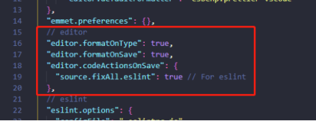

# 通用产品部-研发三部前端开发规范

[TOC]


## 一、统一开发工具

### 1.1、开发工具

**Visual Studio Code**

Visual Studio code是一个轻量级但功能强大的源代码编辑器，在桌面上运行，适用于 Windows、macOS 和 Linux。它附带了对 JavaScript、TypeScript 和节点的内置支持.js并且具有丰富的其他语言（如 C++、C#、Java、Python、PHP、Go）和运行时（如 .NET 和 Unity）的扩展生态系统。

下载地址：https://code.visualstudio.com/


### 1.2、插件安装

**必装插件**

- **ESLint**：用来识别并检查ECMAScript/JavaScript 代码的工具

  

- **Prettier**：用来格式化代码，如.js、.vue、css等都可以进行格式化

  

- **Vetur**：用来识别并高亮vue语法 

  

**推荐安装**

- **Auto Close Tag**：自动添加 HTML/XML 关闭标签
- **Auto Rename Tag**：自动重命名 HTML或XML 标签
- **Path Intellisense**：智能路径提示


- **Bracket Pair Colorizer**：给匹配的括号上颜色


- **Highlight Matching Tag**：突出显示匹配的开始和/或结束标签


- **Postcode**：Postman的vscode版本，可以在vscode内进行接口模拟调用

  


### 1.3、代码格式化工具配置

代码格式化根据公司的技术栈而定，目前适合公司的代码校验手段主要是Vscode+ESLint+Prettier方式。效果如下：


配置方式：

1、在vscode中安装**prettier**和**ESLint**插件

2、创建Vue项目时，在代码校验选项选择ESLint+Prettier


3、为Vue工程添加Prettier配置文件“prettier.config.js”，配置prettier自动格式化行为，符合ESLint规范。详细配置如下：

```js
module.exports = {
  printWidth: 200, // 行长规则通常设置为100或120
  tabWidth: 2, // tab缩进大小,默认为2
  useTabs: false, // 使用tab缩进，默认false
  semi: false, // 使用分号, 默认true
  singleQuote: true, // 使用单引号, 默认false
  quoteProps: "as-needed", //仅在需要时在对象属性周围添加引号
  trailingComma: "none", //结尾是否强制添加逗号，默认none,可选 none|es5|all
  bracketSpacing: true, //对象中的空格 默认true
  jsxSingleQuote: false, //jsx中是否使用单引号
  jsxBracketSameLine: false, //在jsx中把'>' 是否单独放一行
  endOfLine: "lf", //定义结尾换行符 \n \r \n\r，默认auto,
  arrowParens: "avoid", // (x) => {} 箭头函数参数只有一个时是否要有小括号。avoid：省略括号
  vueIndentScriptAndStyle: false // vue文件的script标签和Style标签下的内容需要缩进
};
```

4、修改vscode的setting.js，开启vscode的保存自动格式化功能




## 二、编程规范

### 2.1、命名规范

#### 2.1.1、项目命名

项目命名采用全小写单词组合方式，单词间以中划线“-”划分。

正例：

```
idaas-web-admin
```

反例：

```
IdaasWebAdmin / idaasWebAdmin / Idaas_webAdmin
```

#### 2.1.2、目录命名

目录命名采用全小写单词组合方式，单词间以中划线“-”划分。有复数结构时，要采用复数命名法，缩写则不需要复数。

正例：

```
scripts / styles / components / images / utils / layouts / libs / idaas-libs / img / js / doc
```

反例：

```
script / style / component / image / imgs / idaas_libs / idaasLibs / docs
```

#### 2.1.3、JS、HTML、样式文件、字体文件、图片文件命名

文件命名采用全小写单词组合方式，单词间以中划线“-”划分。

正例：

```
request.js / user-management.js / index.html / user-manage.html / banner.png
```

反例：

```
userManagement.js / UserManagement.html / sync_userManagement.js
```

如果是js类文件，则采用`PascalCase`命名规范。

正例：

```
Employee.js
```

反例：

```
employee.js
```


#### 2.1.4、注意命名严谨性

代码中的命名**严禁使用拼音与英文混合**的方式，更不允许直接使用中文的方式。 除非是国际通用的名称，可视同英文（如地方名、rmb等）。

正例：

```
user-management / beijing / rmb
```

反例：

```
user-mgmt / user-manag / getPinyin [拼音] / getDazhe [打折] / pingfen [评分]
```


### 2.2、HTML规范

#### 2.2.1 使用 HTML5 的文档类型申明

- DOCTYPE 大写

- 规定字符编码

- 告诉IE浏览器，IE8及以后的版本都会以最高版本IE来渲染页面。 

  ```html
  <!DOCTYPE html>
  <html lang="en">
  <head>
    <meta charset="UTF-8">
    <meta http-equiv="X-UA-Compatible" content="IE=edge">
    <meta name="viewport" content="width=device-width, initial-scale=1.0">
    <title>Document</title>
  </head>
  <body>
    
  </body>
  </html>
  ```

 <!DOCTYPE> 标签告知浏览器文档所使用的 HTML 规范，从而来规范浏览器的行为（让浏览器按照它们应该的方式来运行）。


#### 2.2.2 缩进

缩进使用 2 个空格（不推荐使用1个 tab），嵌套的节点应该缩进。

```html
<body>
  <!-- good -->
  <div>
    <div></div>
  </div>

  <!-- bad -->
    <div>
        <div></div>
    </div>
</body>
```


#### 2.2.3 单行注释

注释内容前后各一个空格字符，注释位于要注释代码的上面，单独占一行。

```html	
<!-- 这是一段单行注释 -->
<div></div> 
```


#### 2.2.4 多行注释

注释内容前后各一个空格字符，<!-- 注释文案 --> 表示模块开始，<!-- /注释文案 --> 表示模块结束

```html
<!-- <div>
 <div>这是一段多行注释</div>
</div> -->
```


#### 2.2.5 标签名

标签名必须使用小写字母

```html
<!-- good -->
<p>这是一个p标签</p>

<!-- bad -->
<P>这是一个P标签</P>
```


#### 2.2.6 不允许在自闭合标签中添加 /

HTML中常见的自闭合标签如下：

+ input
+ br
+ img
+ hr
+ link
+ meta
+ area
+ embed

```html
<!-- good -->
<input type="text">

<!-- bad -->
<input type="text"/>
```


#### 2.2.7 标签使用必须符合标签嵌套规则

+ 有些标签是固定的嵌套规则，比如ul包含li、ol包含li、dl包含dt和dd
+ 块元素可以包含内联元素或某些块元素，但内联元素不能包含块元素，它只能包含其它的内联元素


#### 2.2.8 标签的使用应该遵循标签的语义化

HTML中常见的标签语义化：

- header - 头部
- main -  主体
- aside - 侧边栏
- section - 章节
- nav - 导航栏
- footer - 底部
- h1,h2,h3,h4,h5,h6 - 层级标题
- p - 段落
- strong,em - 强调
- ins - 插入
- del - 删除
- abbr - 缩写
- code - 代码标识
- cite - 引述来源作品的标题
- q - 引用
- blockquote - 一段或长篇引用
- ul - 无序列表
- ol - 有序列表
- dl,dt,dd - 定义列表
- table 表格


#### 2.2.9 标签属性

属性名必须使用小写字母，同时属性值必须用双引号包围。

```html
<!-- good -->
<table cellspacing="0">...</table>

<!-- bad -->
<table cellSpacing="0">...</table>
<table cellspacing='0'>...</table>
```

自定义属性建议以 xxx- 为前缀，推荐使用 data-。

```html
<div data-index="1"></div>
```


### 2.3、CSS规范

#### 2.3.1 命名

+ 类名使用小写字母，以中划线分隔
+ id 采用驼峰式命名

```css
/* good */
.userinfo-card {
  margin: 0;
  padding: 0;
}
#chartContainer {
  margin: 0;
  padding: 0;
}

/* bad */
.userinfoCard {
  margin: 0;
  padding: 0;
}
#chart-container {
  margin: 0;
  padding: 0;
}
```


#### 2.3.2 缩进

缩进使用 2 个空格（不推荐使用1个 tab）。

```css
div {
  margin: 0;
  padding: 0;
}
```


#### 2.3.3 空格

选择器 与 { 之间必须包含空格。

```css
/* good */
.selector {
}

/* bad */
.selector{
}
```

属性名 与之后的 : 之间不允许包含空格， : 与 属性值 之间必须包含空格。

```css
/* good */
.selector {
  margin: 0;
}

/* bad */
.selector {
  margin :0;
}
```


#### 2.3.4 当一个 rule 包含多个 selector 时，每个选择器声明必须独占一行。

```css
/* good */
.post,
.page,
.comment {
  line-height: 1.5;
}

/* bad */
.post, .page, .comment {
  line-height: 1.5;
}
```


#### 2.3.5 >、+、~ 选择器的两边各保留一个空格。

```css
/* good */
main > nav {
  padding: 10px;
}

label + input {
  margin-left: 5px;
}

input:checked ~ button {
  background-color: #69C;
}

/* bad */
main>nav {
  padding: 10px;
}

label+input {
  margin-left: 5px;
}

input:checked~button {
  background-color: #69C;
}
```


#### 2.3.6 选择器中的属性必须用双引号包围。

```css
/* good */
article[character="juliet"] {
  voice-family: "Vivien Leigh", victoria, female;
}

/* bad */
article[character='juliet'] {
  voice-family: "Vivien Leigh", victoria, female;
}
article[character=juliet] {
  voice-family: "Vivien Leigh", victoria, female;
}
```


#### 2.3.7 选择器的嵌套层级应不大于3级，位置靠后的限定条件应尽可能精确。

```css
/* good */
#username input {}
.comment .avatar {}

/* bad */
.page .header .login #username input {}
.comment div * {}
```


#### 2.3.8 属性定义必须另起一行。

```css
/* good */
.selector {
  margin: 0;
  padding: 0;
}

/* bad */
.selector { margin: 0; padding: 0; }
```


#### 2.3.9 属性缩写

在可以使用缩写的情况下，尽量使用属性缩写。

```css
/* good */
.post {
  /* 上右下左原则 */
  padding: 10px 20px 30px 40px;
}

/* bad */
.post {
  padding-top: 10px;
  padding-right: 20px;
  padding-bottom: 30px;
  padding-left: 40px;
}
```


#### 2.3.10 属性书写顺序

同一 rule set 下的属性在书写时，应按功能进行分组，并以 **布局方式、位置** > **尺寸** > **文本相关** > **视觉效果** 的顺序书写，以提高代码的可读性。

1. 布局方式、位置：position、display、float、left、top、right、bottom、overflow、clear、z-index

2. 尺寸：width、height、padding、border、margin

3. 文本相关：font、line-height、text-align、word-wrap

4. 视觉效果：background、color、transition、list-style

另外，如果包含 content 属性（多用于伪元素），应放在最前面。


#### 2.3.11 文本

文本内容必须用双引号包围。

```css
/* good */
html[lang|="zh"] {
  font-family: "Microsoft YaHei", sans-serif;
  content: "“";
}

/* bad */
html[lang|=zh] {
  font-family: 'Microsoft YaHei', sans-serif;
  content: '“';
}
```


#### 2.3.12 单位

省略值为 0 时的单位。

```css
/* good */
body {
  padding: 0 5px;
}

/* bad */
body {
  padding: 0px 5px;
}
```


#### 2.3.13 颜色

 RGB颜色值尽量使用十六进制值，并且严格小写，能缩写就缩写。

```css
/* good */
.success {
  border-color: #fff;
}

/* bad */
.success {
  border-color: rgb(255, 255, 255);
}
.success {
  border-color: #FFFFFF;
}
.success {
  border-color: #ffffff;
}
```


#### 2.3.14 位置

2D 位置必须同时给出水平和垂直方向的位置。

2D 位置初始值为 0% 0%，但在只有一个方向的值时，另一个方向的值会被解析为 center。为避免理解上的困扰，应同时给出两个方向的值。

```css
/* good */
body {
  background-position: center top; /* 50% 0% */
}

/* bad */
body {
  background-position: top; /* 50% 0% */
}
```


#### 2.3.15 属性前缀

带私有前缀的属性由长到短排列，同时标准属性放在最后。

```css
.box {
  -webkit-box-sizing: border-box;
  -moz-box-sizing: border-box;
  box-sizing: border-box;
}
```


### 2.4、Javascript规范

#### 2.4.1 命名

变量、函数名使用小驼峰式命名法，类名是用大驼峰式命名法：

```js
const loadingModules = {}

function stringFormat(source) {
}

function Person (name, age) {
  this.name = name
  this.age = age
}

class Person {
  constructor(name, age) {
    this.name = name
    this.age = age
  }
}
```

常量使用全部字母大写，单词间下划线分隔 的命名方式：

```js
const HTML_ENTITY = {}
```


#### 2.4.2 条件

使用类型严格的===进行条件判断。

```js
// good
if (a === 1) {
  // …
}

// bad
if (a == 1) {
  // …
}
```


#### 2.4.3 换行

每个独立语句结束后必须换行，运算符处换行时，运算符必须在新行的行首

```javascript
// good
if (user.isAuthenticated()
    && user.isInRole('admin')
    && user.hasAuthority('add-admin')
) {
    // Code
}

var result = number1 + number2 + number3
    + number4 + number5


// bad
if (user.isAuthenticated() &&
    user.isInRole('admin') &&
    user.hasAuthority('add-admin')) {
    // Code
}

var result = number1 + number2 + number3 +
    number4 + number5
```


#### 2.4.4 慎用 console.log

因 console.log 大量使用会有性能问题，所以在非 webpack 项目中谨慎使用 log 功能。


#### 2.4.5 合并重复的条件片段

如果一段代码或者函数体内有一些条件分支语句，而这些条件分支语句内部散布了一些重复的代码， 那么就有必要进行合并去重工作。

```js
// bad
var paging = function (currPage) {
  if (currPage <= 0) {
    currPage = 0;
    jump(currPage); // 跳转
  } else if (currPage >= totalPage) {
    currPage = totalPage;
    jump(currPage); // 跳转
  } else {
    jump(currPage); // 跳转
  }
};

//可以看到，负责跳转的代码 jump( currPage )在每个条件分支内都出现了，所以完全可以把这句代码独立出来：

// good
var paging = function (currPage) {
  if (currPage <= 0) {
    currPage = 0;
  } else if (currPage >= totalPage) {
    currPage = totalPage;
  }
  jump(currPage); // 把 jump 函数独立出来
};
```


#### 2.4.6 必要的类型判断

由于js是动态弱类型语言，优点是写法灵活不受类型的限制，但缺点是不同类型的赋值不能在编译期间发现问题，从而导致潜在的bug。

使用必要的类型判断，可以大大增加代码的健壮性，防止没传递参数或者参数类型错误导致程序执行报错，保证程序按照预想的流程执行，减少报错几率。

**判断是否为函数：**

```js
// bad
function foo(cb) {
  // ... do something
  cb()
}
foo()

// good
function foo(cb) {
  // ... do something
  cb && cb()
}
foo()

// better
function foo(cb) {
  // ... do something
  typeof cb === 'function' && cb()
}
foo()
```

**判断是否为undefined：**

```js
// bad
x === undefined

// good
typeof x === 'undefined'
```


#### 2.4.7 将对象的属性值保存为局部变量

对象成员嵌套越深，读取速度也就越慢。所以好的做法是：如果需要多次读取一个对象属性，最佳做法是将该属性值保存在局部变量中，避免多次查找带来的性能开销。（尤其是在多次访问该对象的属性值的情况下）

**对象：**

```js
const person = {
  info: {
    sex: '男'
  }
}
// bad
function getMaleSex() {
  if (person.info.sex === '男') {
    console.log(person.info.sex)
  }
}

// good
function getMaleSex() {
  const sex = person.info.sex;  // 将该属性值保存在局部变量中
  if (sex === '男') {
    console.log(sex)
  }
}
```

**数组：**

```js
var arr = Array.from({ length: 1000 }, (k, v) => v) // 创建一个长度为1000，值为从0开始到999的数组
console.time()
// bad
for (let i = 0; i < arr.length; i++) {
  // ... do something
}
console.timeEnd()

console.time()
// good
for (let i = 0, len = arr.length; i < len; i++) {
  // ... do something
}
console.timeEnd()
```


#### 2.4.8 传递对象参数代替过长的函数参数列表

函数参数尽可能的少，如果参数超过三个，就可以考虑传递对象来替代。

```js
// bad
function createMenu(title, body, buttonText, cancellable) {
  // ... do something
}
createMenu('Foo', 'bar', 'Baz', true)

// good
function createMenu({ title, body, buttonText, cancellable }) { // 这里使用到ES6的解构赋值语法
  // ... do something
}
createMenu({
  title: 'Foo',
  body: 'Bar',
  buttonText: 'Baz',
  cancellable: true
});

// 好处：函数需要的数据可以自行从该对象里获取。现在不用再关心参数的数量和顺序，只要保证参数对应的 key 值不变即可。
```


#### 2.4.9 使用参数默认值

函数形参可以指定默认值，来减少由于没传递参数出现函数执行错误的几率。可以使用ES6的默认参数语法替代使用条件语句进行赋值。

```js
// bad
function foo(name) {
  // ... use name to do something
}

// good
function foo(name) {
  name = name || 'tom'
  // ... use name to do something
}

// better
function foo(name = 'tom') {
  // ... use name to do something
}
```


#### 2.4.10 保持必要的注释

代码注释不是越多越好，保持必要的业务逻辑注释，至于函数的用途、代码逻辑等，要通过语义化的命令、简单明了的代码逻辑，来让阅读代码的人快速看懂。

**js文件开头，介绍文件作用描述、作者，编写日期等信息：**

```js
/**
 * @description 工具类函数
 * @author 陈泽华
 * @date 2021-05-25
 */
```

**js函数注释信息：**

```js
/**
 * 递归判断跳转页面路径是否在权限菜单内
 * @param {string} path 跳转的页面路径
 * @param {Array} menu 菜单列表
 * @returns {boolean} 是否有权限
 */
export const hasMenuPermission = function fn(path, menu) {
  if (menu.some(item => item.url === path)) {
    return true
  }

  for (const menuItem of menu) {
    if (menuItem.list) {
      const result = fn(path, menuItem.list)
      if (result) return true
    }
  }

  return false
}
```


#### 2.4.11 尽量使用字面量

创建对象和数组推荐使用字面量，因为这不仅是性能最优也有助于节省代码量。

```js
// bad
const obj = {};
obj.name = 'tom';
obj.age = 15;
obj.sex = '男';

// good
const obj = {   
	name:'tom',     
	age:15,     
	sex:'男' 
} 
```


#### 2.4.12 推荐函数式编程

函数式变编程可以让代码简洁、逻辑清晰和易于理解。

```js
const balls = [
  {
    name: 'football',
    count: 100
  }, {
    name: 'basketball',
    count: 200
  }, {
    name: 'volleyball',
    count: 300
  }
]
// bad
let totalCount = 0;
for (let i = 0; i < balls.length; i++) {
  totalCount += balls[i].count;
}

// good
const totalCount = balls
  .map(item => item.count)
  .reduce((accu, curr) => accu + curr)
```


#### 2.4.13 提取常量配置文件

使用scss可以进行项目的颜色、字体大小统一更改（换肤），有利于后期主题变更：

```scss
$primary-color: #5585f0; // 全局主色
$normal-font-size: 14px; // 普通字体大小
```

使用js创建项目的全局常量配置文件，有利于后期项目的维护：

```js
// constant.js
// 账户状态
const PERSON_STATUS = {
  NORMAL: 1, // 正常
  DISABLED: 2, // 禁用
  RESIGNED: 3, // 离职
  VERIFIED: 4, // 已认证
  UNVERIFIED: 5 // 未认证
}

// 账户状态映射
const PERSON_STATUS_MAP = {
  [PERSON_STATUS.NORMAL]: '正常',
  [PERSON_STATUS.DISABLED]: '禁用',
  [PERSON_STATUS.RESIGNED]: '离职',
  [PERSON_STATUS.VERIFIED]: '已认证',
  [PERSON_STATUS.UNVERIFIED]: '未认证'
}
```

```vue
<!-- index.vue -->
<!-- bad -->
<template>
	<div v-for="(item, index) in list" :key="index">
    <span v-if="item.type === 1">正常</span>
    <span v-else-if="item.type === 2">禁用</span>
    <span v-else-if="item.type === 3">离职</span>
    <span v-else-if="item.type === 4">已认证</span>
    <span v-else-if="item.type === 5">未认证</span>
  </div>
</template>

 <!-- good -->
<template>
	<div v-for="(item, index) in list" :key="index">
    <span>{{ PERSON_STATUS_MAP[item.type] }}</span>
  </div>
</template>
<script>
import { PERSON_STATUS_MAP } from 'xxx/constant.js'
export default {
  data() {
    return {
      PERSON_STATUS_MAP
    }
  }
}
</script>
```


#### 2.4.14 慎用三元运算符

有一些程序员喜欢大规模地使用三元运算符，来代替传统的 if、else。理由是三元运算符性 能高，代码量少。不过，这两个理由其实都很难站得住脚。

三元运算符的效率比 if、else 高，这点差距也是完全可以忽略不计的。 在实际的开发中，即使把一段代码循环一百万次，使用三元运算符和使用 if、else 的时间开销 处在同一个级别里。

同样，相比损失的代码可读性和可维护性，三目运算符节省的代码量也可以忽略不计。

如果条件分支逻辑简单且清晰，这无碍我们使用三元运算符：

```js
var global = typeof window !== "undefined" ? window : this
```

但如果条件分支逻辑非常复杂，如下段代码所示，那我们最好的选择还是按部就班地编写 if、else。if、else 语句的好处很多，一是阅读相对容易，二是修改的时候比修改三元运算符周围的代码更加方便： 

```js
if (!aup || !bup) {
  return a === doc ? -1 :
    b === doc ? 1 :
      aup ? -1 :
        bup ? 1 :
          sortInput ?
            (indexOf.call(sortInput, a) - indexOf.call(sortInput, b)) :
            0;
}
```


#### 2.4.15 合理使用链式调用

经常使用 jQuery 的程序员相当习惯链式调用方法：

```js
// bad
var $this = $(this)
$this.addClass('active')
var siblings = $this.siblings()
siblings.removeClass('active')

// good
$(this)
  .addClass('active')
  .siblings()
  .removeClass('active')
```

在 JavaScript 中，可以很容易地实现方法的链式调用，即让方法调用结束后返回对象：

```js
var User = {
  id: null,
  name: null,
  setId: function (id) {
    this.id = id;
    return this;
  },
  setName: function (name) {
    this.name = name;
    return this;
  }
};
console.log(User.setId(9527).setName('tom'));
```


#### 2.4.16 命名符合语义化

命名需要符合语义化，例如函数命名，可以采用加上动词前缀：

| 动词 | **含义**               | 例子                            |
| ---- | ---------------------- | ------------------------------- |
| can  | 判断是否可执行某个动作 | canSendCode：是否可以发送验证码 |
| has  | 判断是否含有某个值     | hasChild：是否含有子节点        |
| is   | 判断是否为某个值       | isLeaf：是否为叶子节点          |
| get  | 获取某个值             | setUserInfo：获取用户信息       |
| set  | 设置某个值             | getUserInfo：设置用户信息       |


## 三、Vue项目规范

### 3.1、目录及命名规范

vue项目的目录命名规范遵循第二章的命名规范，均使用`kebab-case`方式命名。

```
src                               源码目录
|-- api                              所有api接口
|-- assets                           静态资源，images, icons, styles等
|-- components                       公用组件
|-- config                           配置信息
|-- constants                        常量信息，项目所有Enum, 全局常量等
|-- directives                       自定义指令
|-- filters                          过滤器，全局工具
|-- datas                            模拟数据，临时存放
|-- lib                              外部引用的插件存放及修改文件
|-- plugins                          插件，全局使用
|-- router                           路由，统一管理
|-- store                            vuex, 统一管理
|-- themes                           自定义样式主题
|-- views                            视图目录
|   |-- role                             role模块
|   |-- |-- role-list.vue                    role列表页面
|   |-- |-- role-add.vue                     role新建页面
|   |-- |-- role-update.vue                  role更新页面
|   |-- |-- index.less                       role模块样式
|   |-- |-- components                       role模块通用组件文件夹
|   |-- |-- |-- role-update-dialog                role模块通用组件
|   |-- employee                         employee模块
```

#### 3.1.1、api目录

api目录用来存放项目中所有请求方法，按模块划分文件来管理。

- api目录中，按照模块进行分文件管理。如views下有role模块，则api中则需要有role.js。
- api中的方法名称，尽量要与后端的api url保持语义一致，并且单独export，这样有利于Tree shaking。
- api中的每一个方法，必须要添加注释，注释内容与后端swagger文档保持一致。

正例：

后端：ApplicationController.java

```java
/application/add
/application/delete/{id}
/application/edit
/application/list
```

前端：application.js

```javascript
/**
 * @description 应用管理
 */
import { request } from '@_utils/request'

// 添加应用
export function addApplication(data) {
	return request.post('/application/add', data)
}

// 删除应用
export function deleteApplication(id) {
	return request.delete(`/application/delete/${id}`)
}

// 编辑应用
export function editApplication(data) {
	return request.put('/application/edit', data)
}

// 获取应用列表
export function getApplicationList(params) {
	return request.get('/application/list', { params })
}
```

#### 3.1.2、assets目录

assets目录是静态资源目录，用于存放 图片、样式文件、字体文件等静态资源。文件及目录命名规范遵循`kebab-case`风格。

```
|-- assets                            	
|   |-- icons     
|   |-- images 
|   |-- |-- background-image.jpg                  
|   |-- |-- banner.jpg    
|   |-- styles
|   |-- |-- index.css
|   |-- |-- common.scss
|   |-- |-- mixin.less
```

#### 3.1.3、components目录

- components目录只能存放于项目业务功能无关的、通用性的组件。
- components目录下，按照组件进行目录划分，命名规范遵循`kebab-case`规范。

```
|-- components                            	 
|   |-- color-button 
|   |-- |-- index.vue                  
|   |-- |-- index.js    
|   |-- banner
|   |-- |-- index.css
|   |-- |-- index.vue
|   |-- |-- index.js
```

#### 3.1.4、constants目录

constants目录用于存放项目中所有常量。

- constants目录下的常量按照模块进行份文件管理，文件命名遵循`kebab-case`规范。
- 常量的命名采用全大写单词组合方式，单词间以中划线“-”划分。

目录结构：

```
|-- constants                            	 
|   |-- index.js 
|   |-- application.js
|   |-- role.js
```

例子：application.js

```

```

#### 3.1.5、router目录

router用于管理整个项目的路由。

- router目录使用分模块管理，除基本系统级路由，业务功能的路由按照模块分文件管理。
- modules目录下的模块路由文件命名遵循`kebab-case`规范。

```
|-- router                            	 
|   |-- modules                             //分模块目录
|   |-- |-- application.js  
|   |-- |-- role.js 
|   |-- index.js                            //路由定义
|   |-- permission.js                       //全局路由守卫
```

#### 3.1.6、store目录

store目录用于管理整个项目的共享状态。store目录使用分模块管理，按照业务进行拆分不同的模块。

```
|-- store                            	 
|   |-- modules                             //分模块目录
|   |-- |-- user.js                         //用户与登录相关状态
|   |-- |-- menu.js                         //权限与菜单相关状态
|   |-- index.js                            //路由定义
```

#### 3.1.7、views目录

views目录用于存放系统业务功能界面文件。

- views目录下，按照模块进行目录划分，每一个模块对应一个文件夹。
- 模块目录与功能页面命名，遵循`kebab-case`规范。
- 每一个模块下允许有一个components目录，用于存放与业务功能相关的组件。
- 组件的命名，应该严格遵循父子命名规范。如父组件为todo，那子组件的命名必须以“todo-”开头。

正例：

```
|-- views                            	 
|   |-- application                         //应用管理模块
|   |-- |-- components
|   |-- |-- |-- application-list-item.vue
|   |-- |-- |-- application-list-header.vue
|   |-- |-- |-- application-list-footer.vue
|   |-- |-- |-- application-update-form.vue
|   |-- |-- |-- application-detail-form.vue
|   |-- |-- application-list.vue
|   |-- |-- application-update.vue                        
|   |-- |-- application-detail.vue                       
|   |-- role                                //权限管理模块
|   |-- ......
```

反例：

```
|-- views                            	 
|   |-- application                         //应用管理模块
|   |-- |-- components
|   |-- |-- |-- list-item.vue
|   |-- |-- |-- Header.vue
|   |-- |-- |-- Footer.vue
|   |-- |-- |-- updateForm.vue
|   |-- |-- |-- detail_form.vue
|   |-- |-- application-list.vue
|   |-- |-- application-update.vue                        
|   |-- |-- application-detail.vue                       
|   |-- role                                //权限管理模块
|   |-- ......
```


### 3.2、Vue编码规范

Vue编码规范，以Vue官方规范中的`A规范`为基础进行项目开发，所以请大家仔细阅读该规范并熟记。

Vue官方规范：https://cn.vuejs.org/v2/style-guide/


### 3.3、组件规范

#### 3.3.1、组件命名规范与使用规范

- vue项目中的每一个组件都必须命名，也就是需要设置name属性。命名的组件可以在组件内进行自身调用，在vue-devtool中调试也会显示完整的名称，方便开发者快速找到组件并进行调试。
- vue的组件名称，始终是由多个单词组成（大于等于2个），且命名规范为`KebabCase`。这样可以避免跟现有以及未来的HTML元素冲突，因为所有的HTML元素名称都是单个单词的。

正例：

```javascript
export default {
	name: 'NewsItem',
	// ...
}
```

反例：

```javascript
export default {
	name: 'news',
	// ...
}

export default {
	name: 'news-item',
	// ...
}
```


#### 3.1.2、组件的标签顺序

单文件组件应该总是让标签保持为从上到下以"template"、“script”、“style”的顺序排列

正例：

```html
<template>...</template>
<script>...</script>
<style>...</style>
```

反例：

```html
<template>...</template>
<style>...</style>
<script>...</script>
```


#### 3.1.3、组件内<script>中的属性顺序

script标签中的属性顺序，在ESLint中也有一套默认的排列规则，遵循这套规则即可

name > components  >  props > data > computed > watch > filter > 钩子函数（钩子函数按其执行顺序） >  methods

```js
export default {
	name: 'NewsItem',
    components: { ... },
    props: {},
    data() {
        return {}
    },
    computed: {},
    watch: {},
    filter: {},
    brforeCreate() {},
    created() {},
    beforeMount() {},
    mounted() {},
    ...[钩子函数, 按其执行顺序]
    mehtods: {}
}
```


#### 3.1.4、组件的data

除了根组件以外，vue单文件组件中的data必须为函数，且返回一个Object对象。由于对象是链式存储，如果data直接定义为对象，则多个相同组件之间，data的值会互相影响。这是非常严重的问题。

正例：

```javascript
export default {
	data() {
		return {
			foo: 'foo',
			bar: 'bar',
			// ...
		}
	}
}
```

反例：

```javascript
export default {
	data：{
		foo: 'foo',
		bar: 'bar',
		// ...
	}
}
```


#### 3.1.5、prop定义

在单文件组件中，prop的定义需尽量详细。

- 必须使用 camelCase 驼峰命名
- 必须指定类型
- 必须加上注释，表明其含义
- 必须加上 required 或者 default，两者二选其一
- 如果有业务需要，必须加上 validator 验证

正例：

```javascript
export default {
    props: {
      // 组件状态，用于控制组件的颜色
       status: {
         type: String,
         required: true,
         validator: function (value) {
           return [
             'succ',
             'info',
             'error'
           ].indexOf(value) !== -1
         }
       },
       // 用户类型
       userType: {
          type: String,
          default: 'teacher'
       }
    }
}
```


#### 3.1.6、模板属性和表达式

当模板的属性较多的时候，应该主动进行换行

正例：

```html
<my-component 
      foo="a" 
      bar="b" 
      baz="c" 
      bss="d" 
      bas="e" 
      bab="f" 
      bag="g"
/>
```

反例：

```html
<my-component foo="a" bar="b" baz="c" bss="d" bas="e" bab="f" bag="g" />
```

当模板中的表达式过长时，应该使用计算属性computed来处理。

正例：

```html
<template>
	<p>{{ normalizedFullName }}</p>
</template>

computed: {
  normalizedFullName: function () {
    return this.fullName.split(' ').map(function (word) {
      return word[0].toUpperCase() + word.slice(1)
    }).join(' ')
  }
}
```

反例：

```
<template>
  <p>
       {{
          fullName.split(' ').map(function (word) {
             return word[0].toUpperCase() + word.slice(1)
           }).join(' ')
        }}
  </p>
</template>
```


#### 3.1.7、指令

指令推荐使用缩写模式，如用“ : ”表示b-bind:，用@表示v-on:，用#表示v-slot:

正例：

```
<input 
	:default-value="defaultValue"
	@input="onInput"
	@focus="onFocus"
/>
```

反例：

```
<input 
	v-bind:default-value="defaultValue"
	v-on:input="onInput"
	v-on:focus="onFocus"
/>
```


#### 3.1.8、v-for、v-show和v-if

- 如果在模板中使用了v-for，则必须为为循环的元素设置key值。否则在vue刷新dom的时候无法判断元素相等而导致频繁地patch，造成性能浪费。

正例：

```html
<tamplate>
	<div v-for="item" :key="item.id">...</div>
</tamplate>
```

反例：

```html
<tamplate>
	<div v-for="item">...</div>
</tamplate>
```

- 如果运行时，需要非常频繁地切换，使用 v-show ；如果在运行时，条件很少改变，使用 v-if。
- v-for与v-if不要同时在一个元素上使用。因为v-for的判断优先级比v-if高，每次渲染都会先循环再判断，造成性能浪费。如果需要根据循环中的数据中的某一个属性来判断是否显示该元素，则应使用computed

正例：

```
<template>
	<div v-for="item in matchedList" :key="item.id"></div>
</template>

computed: {
	matchedList() {
		return this.list.filter(i => i.show === true)
	}
}
```

反例：

```
<template>
	<div v-for="item in list" :key="item.id" v-if="item.show === true"></div>
</template>
```


### 3.4、Vue Router规范

#### 3.4.1、路由命名规范

- path值采用`kebab-case`风格。
- name值采用`KebabCase`风格进行命名，与组件名称风格一致，因为keep-alive是按照组件名进行缓存，所以name值必须和组件名保持一致。
- route的扩展属性，应该定义在meta中，及时不需要扩展属性，也请为每一个route定义meta: {}。

正例：

```
export const application = [
	{
		path: '/application',
		name: 'Application',
		component: () => import('@/views/application/index.vue'),
		meta: {},
		children: [
			{
				path: '/application/add',
				name: 'ApplicationAdd',
				component: () => import('@/views/application/add.vue'),
				meta: {}
			},
			{
				path: '/application/add',
				name: 'ApplicationAdd',
				component: () => import('@/views/application/add.vue'),
				meta: {}
			},
		]
	}
]
```


#### 3.4.2、路由传参

针对路由传参，应尽量使用query。因为params传参的方式，在刷新页面后参数会丢失，除非你非常有把握。

例子：

```javascript
let id = ' 123';
this.$router.push({ name: 'userCenter', query: { id: id } });
```


## 未完待续，持续更新

